# 소프트웨어 아키텍처 명세서

## 1. 개요

### 1.1 시스템 정의

#### 시스템 개요

**시스템 이름**: Count 통합 관리 시스템 (Count Management System)

**시스템 목적**: 다양한 서비스에서 발생하는 Count 데이터를 중앙에서 통합 관리하여, Count 값의 일관성과 신뢰성을 보장하고, 효율적인 조회 및 관리 기능을 제공하며, 관리자를 위한 UI를 통한 Count 관리, 다양한 분석 기능, 대시보드를 통한 모니터링 기능을 제공하는 시스템입니다.

**시스템이 해결하려는 문제**:
- 여러 서비스에서 분산되어 관리되는 Count 값의 불일치 문제
- Count 데이터의 중복 저장 및 관리로 인한 비효율성
- Count 조회 및 관리 기능의 부재 또는 분산
- Count 값의 실시간 동기화 및 일관성 보장 어려움

#### 시스템 범위

**포함 기능**:
- 외부 서비스로부터의 Count 데이터 수신 및 처리
- Count 데이터의 API 인터페이스 제공
- 관리자를 위한 웹 UI를 통한 Count 관리 기능
- Count 데이터의 다양한 분석 기능 (트렌드 분석, 비교 분석, 예측 분석 등)
- 대시보드를 통한 Count 데이터 모니터링 및 시각화

**제외 기능**:
- Count 값의 비즈니스 로직 처리 (외부 서비스의 책임)
- Count 데이터의 백업 정책 및 재해 복구 (인프라 레벨)
- 사용자 인증 및 권한 관리 (별도 인증 시스템의 책임)

#### 시스템 경계


**사용자 유형**:
- **외부 서비스**: Count 값을 생성, 수정, 조회하는 마이크로서비스 또는 애플리케이션
- **관리자**: Count 데이터를 직접 관리하고, 분석 기능을 활용하며, 대시보드를 통해 모니터링하는 운영 담당자

**외부 환경**:
- **외부 서비스들**: Count 값을 생성하고 사용하는 다양한 마이크로서비스

**인터페이스 (고수준)**:
- **REST API**: 외부 서비스와의 통신을 위한 RESTful 인터페이스
  - Count 생성/수정/삭제 API
  - Count 조회 API
  - Count 통계/집계 API
- **웹 UI**: 관리자를 위한 웹 기반 사용자 인터페이스
  - Count 관리 화면 (생성, 수정, 삭제)
  - 분석 화면 (트렌드, 비교, 예측 등)
  - 대시보드 화면 (모니터링 및 시각화)

**Primary/Secondary Actors**:
- **Primary Actor**: 외부 서비스, 관리자
- **Secondary Actor**: 없음

### 1.2 비즈니스 컨텍스트

#### 비즈니스 배경

마이크로서비스 아키텍처 환경에서 여러 서비스들이 각각 Count 데이터를 분산 관리하면서 발생하는 문제들을 해결하기 위해, Count 데이터를 중앙에서 통합 관리하는 시스템이 필요하게 되었습니다. 분산된 Count 값의 불일치, 중복 저장으로 인한 비효율성, 그리고 Count 조회 및 관리 기능의 부재는 서비스 운영의 신뢰성과 효율성을 저해하는 주요 요인입니다.

#### 비즈니스 목적

Count 통합 관리 시스템을 통해 다음과 같은 비즈니스 목적을 달성하고자 합니다:
- Count 데이터의 일관성과 신뢰성 보장을 통한 서비스 품질 향상
- Count 데이터의 중앙 집중식 관리를 통한 운영 효율성 증대
- 관리자를 위한 통합 UI, 분석 기능, 대시보드를 제공하여 의사결정 지원
- 외부 서비스들이 Count 데이터를 효율적으로 활용할 수 있는 인프라 제공

#### 비즈니스 가치 제안

- **데이터 일관성 보장**: 분산된 Count 값의 불일치 문제 해결로 서비스 신뢰성 향상
- **운영 효율성**: 중앙 집중식 관리를 통한 운영 비용 절감 및 관리 편의성 증대
- **의사결정 지원**: 분석 기능과 대시보드를 통한 데이터 기반 의사결정 지원
- **확장성**: Kubernetes 환경에서 MSA로 개발하여 향후 서비스 확장에 유연하게 대응
- **개발 생산성**: 외부 서비스들이 표준화된 API를 통해 Count 데이터를 쉽게 활용

#### 비즈니스 목표

**단기 목표 (3-6개월)**:
- Count 통합 관리 시스템 구축 및 배포 완료
- 주요 외부 서비스들의 Count 데이터 마이그레이션 완료
- 관리자 UI를 통한 Count 관리 기능 제공
- 기본적인 분석 기능 및 대시보드 제공
- Count 데이터의 일관성 보장 메커니즘 구현

**중기 목표 (6-12개월)**:
- 모든 외부 서비스의 Count 데이터 통합 완료
- 고급 분석 기능 제공 (트렌드 분석, 비교 분석, 예측 분석 등)
- 대시보드 기능 고도화 및 실시간 모니터링 강화
- 시스템 성능 최적화 및 확장성 개선
- 운영 안정성 향상 및 장애 대응 체계 구축

**장기 목표 (12개월 이상)**:
- Count 데이터 기반 비즈니스 인사이트 제공
- 머신러닝을 활용한 예측 분석 기능 확장
- 자동화된 Count 데이터 관리 및 최적화
- 다른 데이터 타입으로의 확장 가능성 검토
- 비즈니스 가치 창출을 위한 데이터 활용 전략 수립

#### 비즈니스 드라이버

**시장 요구사항**:
- 마이크로서비스 아키텍처 환경에서 데이터 일관성 보장의 중요성 증가
- 실시간 데이터 분석 및 모니터링에 대한 요구 증가
- 서비스 운영의 효율성과 신뢰성에 대한 기대 증가
- 데이터 기반 의사결정의 중요성 강조

**경쟁력 요인**:
- **데이터 일관성**: Count 값의 불일치 문제 해결로 서비스 품질 향상
- **운영 효율성**: 중앙 집중식 관리를 통한 운영 비용 절감
- **의사결정 지원**: 분석 기능과 대시보드를 통한 빠른 의사결정
- **확장성**: Kubernetes 및 MSA 기반의 유연한 아키텍처
- **개발 생산성**: 표준화된 API를 통한 쉬운 통합 및 활용

### 1.3 제약 사항

#### 기술적 제약사항

- Kubernetes 환경에서 마이크로서비스 아키텍처(MSA)로 개발됨

## 2. 요구사항

### 2.1 기능 요구사항

#### 구조적으로 중요한 Use Case 목록 (ASR)

Count 통합 관리 시스템은 다음 5개의 주요 Use Case를 제공합니다:

1. **UC-001-Count 저장**: 외부 서비스가 Count 값을 저장하거나 증가/감소시킵니다.
2. **UC-002-Count 조회**: 외부 서비스나 관리자가 저장된 Count 데이터를 조회합니다.
3. **UC-003-Count 관리**: 관리자가 웹 UI를 통해 Count 데이터를 생성, 수정, 삭제하는 통합 관리 기능을 수행합니다.
4. **UC-004-Count 분석**: 관리자가 Count 데이터에 대한 다양한 분석 기능(트렌드 분석, 비교 분석, 예측 분석 등)을 수행합니다.
5. **UC-005-Count 모니터링**: 관리자가 대시보드를 통해 Count 데이터를 모니터링하고 시각화된 정보를 확인합니다.

#### Use Case 다이어그램


#### 2.1.1 UC-001-Count 저장

**설명**: 외부 서비스가 Count 값을 저장하거나 증가/감소시킵니다. Count 데이터를 생성하거나 기존 Count 값을 변경하는 기능을 포함합니다.

**주요 액터**: 외부 서비스

**사전조건**:
- 외부 서비스가 시스템에 인증되어 있어야 함
- 외부 서비스가 유효한 API 키 또는 인증 토큰을 보유하고 있어야 함
- 시스템이 정상적으로 동작 중이어야 함

**사후조건**:
- Count 값이 시스템에 저장되거나 업데이트됨
- Count 값의 일관성이 보장됨
- 저장된 Count 값이 조회 가능한 상태가 됨

**주요 시나리오**:
1. 외부 서비스가 시스템의 REST API를 통해 Count 저장 요청을 전송한다. (Count ID, 증가/감소 값 또는 새로운 Count 값 포함)
2. 시스템은 요청을 검증한다. (인증 정보, 요청 형식, 필수 필드 등)
3. 시스템은 Count ID에 해당하는 기존 Count 데이터를 조회한다.
4. 시스템은 Count 값을 저장하거나 업데이트한다. (기존 Count 값 증가/감소)
5. 시스템은 업데이트된 Count 값을 저장한다.
6. 시스템은 외부 서비스에게 저장 결과를 반환한다. (성공 여부, 업데이트된 Count 값 등)

**대안 시나리오**:
- **Count 값 증가**: 요청이 Count 값 증가인 경우, 기존 Count 값에 증가 값을 더하여 저장
- **Count 값 감소**: 요청이 Count 값 감소인 경우, 기존 Count 값에서 감소 값을 빼서 저장
- **Count 값 설정**: 요청이 Count 값을 특정 값으로 설정하는 경우, Count 값을 요청된 값으로 설정

#### 2.1.2 UC-002-Count 조회

**설명**: 외부 서비스가 저장된 Count 데이터를 조회합니다.

**주요 액터**: 외부 서비스, 관리자

**사전조건**:
- 외부 서비스가 시스템에 인증되어 있어야 함
- 조회할 Count ID가 존재해야 함
- 시스템이 정상적으로 동작 중이어야 함

**사후조건**:
- Count 값이 조회되어 반환됨
- 조회된 Count 값이 정확하고 일관된 값임

**주요 시나리오**:
1. 외부 서비스가 시스템에게 Count 조회 요청을 전송한다. (Count ID 포함)
2. 시스템은 요청을 검증한다. (인증 정보, 요청 형식 등)
3. 시스템은 Count ID에 해당하는 Count 데이터를 조회한다.
4. 시스템은 조회된 Count 값을 반환한다. (Count ID, Count 값, 업데이트 시간 등)

#### 2.1.3 UC-003-Count 관리

**설명**: 관리자가 웹 UI를 통해 Count 데이터를 생성, 수정, 삭제하는 통합 관리 기능을 수행합니다.

**주요 액터**: 관리자

**주요 시나리오**:
- **Count 생성**: 관리자가 웹 UI에서 Count 정보를 입력하여 새로운 Count 데이터를 생성
- **Count 수정**: 관리자가 웹 UI에서 기존 Count 데이터를 수정
- **Count 삭제**: 관리자가 웹 UI에서 기존 Count 데이터를 삭제
- **Count 목록 조회**: 관리자가 웹 UI에서 Count 목록을 조회

#### 2.1.4 UC-004-Count 분석

**설명**: 관리자가 Count 데이터에 대한 다양한 분석 기능(트렌드 분석, 비교 분석, 예측 분석 등)을 수행합니다.

**주요 액터**: 관리자

**주요 시나리오**:
1. 관리자가 웹 UI에서 Count 분석 화면으로 이동한다.
2. 관리자가 분석 유형을 선택한다. (트렌드 분석, 비교 분석, 예측 분석 등)
3. 관리자가 분석할 Count를 선택한다. (단일 또는 여러 Count)
4. 관리자가 분석 기간 및 조건을 설정한다. (시작일, 종료일, 집계 단위 등)
5. 관리자가 분석 요청을 제출한다.
6. 시스템은 선택된 Count 데이터를 조회하고 분석한다.
7. 시스템은 분석 결과를 생성하여 관리자에게 표시한다. (차트, 테이블, 요약 정보 등)

**분석 유형**:
- **트렌드 분석**: 시간에 따른 Count 값 변화 추이 분석
- **비교 분석**: 여러 Count 간의 값 비교 분석
- **예측 분석**: 과거 데이터 기반 Count 값 미래 추이 예측

#### 2.1.5 UC-005-Count 모니터링

**설명**: 관리자가 대시보드를 통해 Count 데이터를 모니터링하고 시각화된 정보를 확인합니다.

**주요 액터**: 관리자

**주요 시나리오**:
1. 관리자가 웹 UI에서 대시보드 화면으로 이동한다.
2. 시스템은 대시보드에 표시할 Count 목록 및 분석 데이터 목록을 조회한다.
3. 시스템은 각 Count의 현재 값을 조회하고 통계 정보를 계산한다.
4. 시스템은 Count 데이터의 변화 추이를 조회한다.
5. 시스템은 대시보드에 Count 모니터링 정보 및 분석 데이터를 표시한다.
6. 관리자가 대시보드에서 Count 모니터링 정보를 확인한다.

**대시보드 기능**:
- Count 모니터링 정보 표시 (현재 값, 통계 정보, 변화 추이 차트 등)
- 실시간 갱신 (Count 데이터 변경 시 자동 갱신)
- 대시보드 편집 (요소 추가/제거, 레이아웃 조정)

### 2.2 비기능적 요구사항

#### 2.2.1 NFR-001-Count-저장-응답-시간

**설명**: 외부 서비스가 Count 값을 저장하거나 증가/감소시킬 때의 응답 시간

**측정 공식**:
```
[Count 저장 응답 시간] = [외부 서비스가 CountAPI로부터 응답을 받은 시각] - [외부 서비스가 Count 저장 API 요청을 CountAPI로 전송한 시각]
```

**허용치**: `[Count 저장 응답 시간] < 100ms`

#### 2.2.2 NFR-002-Count-조회-응답-시간

**설명**: 외부 서비스나 관리자가 Count 값을 조회할 때의 응답 시간

**측정 공식**:
```
[Count 조회 응답 시간] = [외부 서비스가 CountAPI로부터 응답을 받은 시각] - [외부 서비스가 Count 조회 API 요청을 CountAPI로 전송한 시각]
```

**허용치**: `[Count 조회 응답 시간] < 100ms`

#### 2.2.3 NFR-003-동시-요청-처리-능력

**설명**: 여러 외부 서비스가 동시에 Count 저장/조회 요청을 보낼 때 처리할 수 있는 요청 수

**측정 공식**:
```
[동시 요청 처리량] = [측정 기간 동안 성공적으로 처리된 요청 수] / [측정 기간 (초 단위)]
```

**허용치**: `[동시 요청 처리량] >= 1000 RPS`

#### 2.2.4 NFR-004-대시보드-로딩-시간

**설명**: 관리자가 대시보드를 열었을 때 초기 데이터를 로딩하는 시간

**측정 공식**:
```
[대시보드 로딩 시간] = [관리자가 대시보드 화면에 데이터가 표시된 것을 확인한 시각] - [관리자가 대시보드 페이지 요청을 수행한 시각]
```

### 2.3 품질 속성

#### 2.3.1 QA-001-Count-저장-응답-시간-최소화

**설명**: 외부 서비스가 Count 값을 저장하거나 증가/감소시킬 때의 응답 시간을 최소화

**측정 공식**:
```
[Count 저장 응답 시간] = [외부 서비스가 CountAPI로부터 응답을 받은 시각] - [외부 서비스가 Count 저장 API 요청을 CountAPI로 전송한 시각]
```

#### 2.3.2 QA-002-Count-조회-응답-시간-최소화

**설명**: 외부 서비스나 관리자가 Count 값을 조회할 때의 응답 시간을 최소화

**측정 공식**:
```
[Count 조회 응답 시간] = [외부 서비스가 CountAPI로부터 응답을 받은 시각] - [외부 서비스가 Count 조회 API 요청을 CountAPI로 전송한 시각]
```

#### 2.3.3 QA-003-Count-저장-서비스-독립성-최대화

**설명**: Count 저장 서비스가 다른 서비스의 부하에 영향을 받지 않으며, 변경 시 다른 서비스에 영향을 미치지 않는 정도를 최대화

**측정 공식**:
```
[서비스 독립성] = 1 - ([Count 저장 서비스의 부하나 변경에 영향을 받는 다른 서비스의 수] / [시스템 내 전체 서비스 수])
```

#### 2.3.4 QA-004-Count-조회-서비스-독립성-최대화

**설명**: Count 조회 서비스가 다른 서비스의 부하에 영향을 받지 않으며, 변경 시 다른 서비스에 영향을 미치지 않는 정도를 최대화

**측정 공식**:
```
[서비스 독립성] = 1 - ([Count 조회 서비스의 부하나 변경에 영향을 받는 다른 서비스의 수] / [시스템 내 전체 서비스 수])
```

#### 2.3.5 QA-005-분석-기능-추가-용이성-최대화

**설명**: 새로운 분석 기능(예: 상관관계 분석)을 추가할 때 필요한 작업의 범위를 최소화

**측정 공식**:
```
[변경 비용] = Σ(LOC(추가되는 모듈)) + Σ(LOC(변경되는 모듈)) + Σ(LOC(추가/변경되는 모듈을 의존하는 모듈))
```

#### 2.3.6 QA-006-대시보드-기능-추가-용이성-최대화

**설명**: 대시보드에 새로운 기능(예: 알림 기능, 필터 기능)을 추가할 때 필요한 작업의 범위를 최소화

**측정 공식**:
```
[변경 비용] = Σ(LOC(추가되는 모듈)) + Σ(LOC(변경되는 모듈)) + Σ(LOC(추가/변경되는 모듈을 의존하는 모듈))
```

#### 2.3.7 QA-007-UI-변경-용이성-최대화

**설명**: 관리자에게 제공하는 UI를 변경할 때 영향받는 모듈의 범위를 최소화

**측정 공식**:
```
[변경 비용] = Σ(LOC(추가되는 모듈)) + Σ(LOC(변경되는 모듈)) + Σ(LOC(추가/변경되는 모듈을 의존하는 모듈))
```

#### 2.3.8 QA-008-Count-관리-서비스-독립성-최대화

**설명**: Count 관리 서비스가 다른 서비스의 부하에 영향을 받지 않으며, 변경 시 다른 서비스에 영향을 미치지 않는 정도를 최대화

**측정 공식**:
```
[서비스 독립성] = 1 - ([Count 관리 서비스의 부하나 변경에 영향을 받는 다른 서비스의 수] / [시스템 내 전체 서비스 수])
```

#### 2.3.9 QA-009-Count-분석-서비스-독립성-최대화

**설명**: Count 분석 서비스가 다른 서비스의 부하에 영향을 받지 않으며, 변경 시 다른 서비스에 영향을 미치지 않는 정도를 최대화

**측정 공식**:
```
[서비스 독립성] = 1 - ([Count 분석 서비스의 부하나 변경에 영향을 받는 다른 서비스의 수] / [시스템 내 전체 서비스 수])
```

#### 2.3.10 QA-010-Count-모니터링-서비스-독립성-최대화

**설명**: Count 모니터링 서비스가 다른 서비스의 부하에 영향을 받지 않으며, 변경 시 다른 서비스에 영향을 미치지 않는 정도를 최대화

**측정 공식**:
```
[서비스 독립성] = 1 - ([Count 모니터링 서비스의 부하나 변경에 영향을 받는 다른 서비스의 수] / [시스템 내 전체 서비스 수])
```

#### 2.3.11 QA-011-대시보드-갱신-시간-최소화

**설명**: 대시보드가 열려있는 상태에서 Count 데이터가 변경되었을 때 화면에 반영되는 시간을 최소화

**측정 공식**:
```
[대시보드 갱신 시간] = [대시보드 화면에 변경사항이 표시된 시각] - [Count 데이터가 변경된 시각]
```

#### 2.3.12 QA-012-입력-오류-복원-용이성-최대화

**설명**: 관리자의 잘못된 Count 관리 요청에 대한 복원 용이성을 최대화

**측정 공식**:
```
[복원 용이성] = [Count 관리 오류를 복원하는 데까지 걸리는 시간 (초)]
```

## 3. 시스템 구조

시스템 구조는 배치 측면에서 설계된 최종 구조를 설명합니다. 각 배치 단위의 역할과 책임, 그리고 배치 단위 간의 상호작용을 중심으로 설명합니다.

### 전체 배치 다이어그램

```mermaid
graph LR
    Admin[관리자]
    
    subgraph System[Count 통합 관리 시스템]
        WS[Count 저장 서비스<br/>count-write-service]
        MS[Count 관리 서비스<br/>count-management-service]
        AS[Count 분석 서비스<br/>count-analysis-service]
        DPS[대시보드 제공 서비스<br/>dashboard-provision-service]
        DUS[대시보드 갱신 서비스<br/>dashboard-update-service]

        InfoDB[(CountInfoDB<br/>PostgreSQL)]
        ValueDB[(CountValueDB<br/>Redis)]
        ValueDBReplica[(CountValueDB<br/>Read Replica<br/>Redis)]
        DashDB[(DashboardConfigDB<br/>PostgreSQL)]

        Cache[Redis 캐시]
        Kafka[Kafka 메시징]
    end
    
    Admin -->|웹 UI| MS
    Admin -->|웹 UI| AS
    Admin -->|웹 UI| DPS
    Admin -->|SSE| DUS
    
    MS -->|쓰기/읽기| InfoDB
    MS -->|쓰기| ValueDB
    
    AS -->|읽기| ValueDBReplica
    
    DPS -->|쓰기/읽기| DashDB
    DPS -->|대시보드 구성 조회| DUS
    
    DUS -->|읽기| ValueDBReplica
    DUS -->|캐시| Cache
    DUS -->|실시간 갱신<br/>SSE| Admin
    
    WS -->|이벤트 발행| Kafka
    Kafka -->|이벤트 구독| DUS
    
    MS -->|캐시 무효화| Cache
    DUS -->|캐시 무효화| Cache
    
    ValueDB -.->|복제| ValueDBReplica
```




### 3.1 컴포넌트 명세

#### Count 저장 서비스 (count-write-service)

**책임**: 외부 서비스로부터 Count 값 저장, 증가, 감소 요청을 처리

**포함 컴포넌트**:
- **CountAPI (저장 엔드포인트)**: 외부 서비스로부터 Count 저장 요청 수신 및 응답 반환 (REST API)
- **CountWriter**: Count 값 저장 및 업데이트 비즈니스 로직 처리

**컴포넌트 상호작용**:


#### Count 조회 서비스 (count-read-service)

**책임**: 외부 서비스로부터 Count 값 조회 요청을 처리

**포함 컴포넌트**:
- **CountAPI (조회 엔드포인트)**: 외부 서비스로부터 Count 조회 요청 수신 및 응답 반환 (REST API)
- **CountReader**: Count 값 조회 비즈니스 로직 처리

**컴포넌트 상호작용**:


#### Count 관리 서비스 (count-management-service)

**책임**: 관리자가 웹 UI를 통해 Count 데이터를 생성, 수정, 삭제하는 기능 제공

**포함 컴포넌트**:
- **CountManagementUI**: 관리자와의 Count 관리 웹 UI 인터페이스
- **CountManager**: Count 데이터 생성, 수정, 삭제 비즈니스 로직 처리

**컴포넌트 상호작용**:


#### Count 분석 서비스 (count-analysis-service)

**책임**: 관리자가 Count 데이터에 대한 다양한 분석 기능(트렌드, 비교, 예측) 수행

**포함 컴포넌트**:
- **CountAnalysisUI**: 관리자와의 Count 분석 웹 UI 인터페이스
- **CountAnalyzer**: Count 분석 요청 처리 및 분석 유형별 컴포넌트로 위임
- **TrendAnalyzer**: 트렌드 분석 비즈니스 로직 처리
- **ComparisonAnalyzer**: 비교 분석 비즈니스 로직 처리
- **PredictionAnalyzer**: 예측 분석 비즈니스 로직 처리

**컴포넌트 상호작용**:


#### 대시보드 제공 서비스 (dashboard-provision-service)

**책임**: 관리자에게 대시보드 UI를 제공하고 대시보드 구성 및 레이아웃 관리 기능 제공

**포함 컴포넌트**:
- **DashboardUI**: 관리자와의 Count 모니터링 대시보드 웹 UI 인터페이스
- **DashboardManager**: 대시보드 구성 및 레이아웃 관리 비즈니스 로직 처리

**컴포넌트 상호작용**:


#### 대시보드 갱신 서비스 (dashboard-update-service)

**책임**: 대시보드 데이터의 실시간 갱신 로직 처리 및 SSE를 통한 실시간 갱신 제공

**포함 컴포넌트**:
- **DashboardUpdater**: 대시보드 데이터 실시간 갱신 비즈니스 로직 처리 및 SSE 제공
- **CountReader**: Count 값 조회 비즈니스 로직 처리

**컴포넌트 상호작용**:


#### 데이터베이스 및 인프라 컴포넌트

**CountInfoDB (PostgreSQL)**:
- **책임**: Count 정보(메타데이터)의 영속적 저장 및 관리
- **특징**: 강한 일관성 보장 (ACID 속성), 고급 인덱싱 옵션 제공

**CountValueDB (Redis)**:
- **책임**: Count 값의 영속적 저장 및 관리
- **특징**: 인메모리 구조로 높은 성능, 네이티브 Atomic 증가/감소 연산 지원, AOF 영속성 전략

**CountValueDB Read Replica (Redis)**:
- **책임**: Count 값의 읽기 전용 복제본 제공
- **특징**: 읽기 부하 분산, 비동기 복제 또는 동기 복제 선택 가능

**DashboardConfigDB (PostgreSQL)**:
- **책임**: 대시보드 구성 정보의 영속적 저장 및 관리
- **특징**: 읽기 중심 워크로드, 강한 일관성 보장

**Redis 캐시**:
- **책임**: CountInfoDB 및 CountValueDB 데이터 캐싱, 조회 결과 캐싱
- **특징**: 고급 기능 지원 (Pub/Sub, 복잡한 데이터 구조), 데이터 영속성 지원 (선택적)

**Kafka 메시징**:
- **책임**: 이벤트 기반 갱신을 위한 메시징
- **특징**: 높은 처리량, 메시지 순서 보장, 장기 메시지 보관 지원

### 3.2 동작 명세

#### UC-001: Count 저장

**동작 흐름**:

1. 외부 서비스가 Count 저장 API 요청을 Count 저장 서비스로 전송
2. CountAPI가 요청 데이터 형식 검증 및 인증 정보 검증 수행
3. CountAPI가 CountWriter로 Count 저장 요청 전달
4. CountWriter가 Redis 캐시에서 CountInfo 조회
5. 캐시 미스 시 CountInfoDB에서 CountInfo 조회
6. CountWriter가 Redis의 Atomic 증가/감소 연산 사용
7. CountWriter가 Write-Behind 캐싱으로 비동기 쓰기 수행
8. CountWriter가 Kafka로 변경 이벤트 발행
9. CountWriter가 Redis 캐시 무효화 수행
10. CountWriter가 저장 결과를 CountAPI로 반환
11. CountAPI가 외부 서비스로 저장 결과 반환

**배치 단위 간 상호작용**:


#### UC-002: Count 조회

**동작 흐름**:

1. 외부 서비스가 Count 조회 API 요청을 Count 조회 서비스로 전송
2. CountAPI가 요청 데이터 형식 검증 및 인증 정보 검증 수행
3. CountAPI가 CountReader로 Count 조회 요청 전달
4. CountReader가 Redis 캐시에서 조회 결과 확인
5. 캐시 미스 시:
   - CountReader가 Redis 캐시에서 CountInfo 조회
   - CountReader가 Redis 캐시에서 CountValue 조회
   - 캐시 미스 시 CountInfoDB 및 CountValueDB Read Replica에서 병렬 조회
6. CountReader가 조회 결과를 조합하여 Redis 캐시에 저장
7. CountReader가 조회 결과를 CountAPI로 반환
8. CountAPI가 외부 서비스로 조회 결과 반환

**배치 단위 간 상호작용**:


#### UC-005: Count 모니터링

**동작 흐름**:

1. 관리자가 대시보드 웹 UI 접근
2. DashboardUI가 DashboardManager를 통해 DashboardConfigDB에서 대시보드 구성 조회
3. DashboardUI가 관리자에게 대시보드 화면 표시
4. 관리자가 대시보드 갱신 서비스로 SSE 연결 요청
5. DashboardUpdater가 Redis 캐시에서 대시보드 데이터 확인
6. 캐시 미스 시 CountReader를 통해 CountValueDB Read Replica에서 Count 데이터 조회
7. DashboardUpdater가 대시보드 데이터를 조합하여 Redis 캐시에 저장
8. DashboardUpdater가 초기 대시보드 데이터를 SSE로 관리자에게 전송
9. Kafka에서 변경 이벤트 수신 시:
   - DashboardUpdater가 Delta 업데이트 처리
   - DashboardUpdater가 SSE를 통해 관리자에게 직접 실시간 갱신 전송
   - DashboardUpdater가 Redis 캐시 무효화

**배치 단위 간 상호작용**:


### 3.3 품질 설계

#### 성능

**응답 시간**:
- **NFR-001 (Count 저장 응답 시간 < 100ms)**: CountInfoDB 캐싱, Write-Behind 캐싱, Atomic 연산, Redis 사용으로 달성 가능
- **NFR-002 (Count 조회 응답 시간 < 100ms)**: CountInfoDB 캐싱, CountValueDB 캐싱, 조회 결과 캐싱, Read Replica, Redis 사용으로 달성 가능
- **NFR-004 (대시보드 로딩 시간 < 3초)**: 대시보드 데이터 캐싱으로 달성 가능

**처리량**:
- **NFR-003 (동시 요청 처리량 >= 1000 RPS)**: 서비스 분할, Connection Pooling, Read Replica, Redis 사용, Kafka 사용으로 달성 가능

**리소스 활용**:
- 각 서비스의 독립적 스케일링으로 리소스 활용 최적화
- 캐싱을 통한 데이터베이스 부하 감소
- Read Replica를 통한 읽기 부하 분산

#### 가용성

**장애 격리**:
- 서비스 분할로 각 서비스의 장애가 다른 서비스에 전파되지 않음
- Database per Service 패턴으로 데이터베이스 장애 격리
- 대시보드 제공/갱신 서비스 분리로 갱신 서비스의 부하가 UI 제공 서비스에 영향 없음

**복제 및 백업**:
- CountValueDB Read Replica로 읽기 가용성 향상
- Redis AOF 영속성 전략으로 데이터 영속성 보장
- PostgreSQL의 기본 복제 기능 활용 가능

#### 신뢰성

**데이터 일관성**:
- CountValueDB는 Redis의 Atomic 연산으로 일관성 보장
- CountInfoDB와 DashboardConfigDB는 PostgreSQL의 ACID 속성으로 일관성 보장
- Read Replica 사용 시 Eventual Consistency

**장애 복구**:
- Write-Behind 캐싱의 배치 쓰기 및 복구 메커니즘으로 데이터 손실 방지
- Kafka의 메시지 보관 정책으로 이벤트 재처리 가능

#### 보안

**인증/권한**:
- 각 서비스의 API 엔드포인트에서 인증/권한 검증 수행
- 외부 서비스와 관리자 간 인증 메커니즘 분리

**네트워크 보안**:
- HTTPS 프로토콜 사용
- Kubernetes 환경의 네트워크 정책 활용 가능

#### 사용성

**사용자 인터페이스**:
- 관리자용 웹 UI 제공 (Count 관리, 분석, 모니터링)
- 외부 서비스용 REST API 제공

**응답성**:
- 실시간 갱신으로 대시보드 응답성 향상
- 캐싱을 통한 빠른 응답 시간
- 서비스 분리로 갱신 로직의 부하가 UI 제공에 영향 없음

## 4. 모듈 구조

모듈 구조는 개발 측면에서 설계된 최종 구조를 설명합니다. 개발해야 할 모듈의 구성과 모듈 간 의존성 관계를 중심으로 설명합니다.

### 전체 모듈 다이어그램


### 4.1 모듈 명세

#### 공통 모듈 레이어

**CountInfo 도메인 공통 모듈 (common.count-info)**:
- **책임**: CountInfo 도메인 관련 인프라 및 비즈니스 로직 제공
- **포함 모듈**:
  - `common.count-info.infra`: CountInfoDB 접근 모듈 (Repository 인터페이스 및 구현체)
  - `common.count-info.logic`: CountInfo CRUD 비즈니스 로직 모듈
- **의존성**: 다른 패키지에 의존하지 않음 (최하위 레이어)

**CountValue 도메인 공통 모듈 (common.count-value)**:
- **책임**: CountValue 도메인 관련 인프라 및 비즈니스 로직 제공
- **포함 모듈**:
  - `common.count-value.infra`: CountValueDB 접근 모듈 (Repository 인터페이스 및 구현체)
  - `common.count-value.logic`: CountValue CRUD 비즈니스 로직 모듈
  - `common.count-value.logic.analysis`: CountValue 분석 로직 모듈 (TrendAnalyzer, ComparisonAnalyzer, PredictionAnalyzer)
- **의존성**: 다른 패키지에 의존하지 않음 (최하위 레이어)

#### 서비스별 레이어

**Count 저장 서비스 (count-write-service)**:
- **책임**: 외부 서비스로부터 Count 값 저장, 증가, 감소 요청 처리
- **포함 모듈**:
  - `api.write`: Count 저장 API 레이어 (REST API 컨트롤러, DTO, 어댑터)
- **의존성**: common.count-info.logic, common.count-value.logic

**Count 조회 서비스 (count-read-service)**:
- **책임**: 외부 서비스로부터 Count 값 조회 요청 처리
- **포함 모듈**:
  - `api.read`: Count 조회 API 레이어 (REST API 컨트롤러, DTO, 어댑터)
- **의존성**: common.count-info.logic, common.count-value.logic

**Count 관리 서비스 (count-management-service)**:
- **책임**: 관리자가 웹 UI를 통해 Count 데이터를 생성, 수정, 삭제하는 기능 제공
- **포함 모듈**:
  - `ui.management`: Count 관리 UI 레이어 (React 컴포넌트, 페이지)
- **의존성**: common.count-info.logic, common.count-value.logic

**Count 분석 서비스 (count-analysis-service)**:
- **책임**: 관리자가 Count 데이터에 대한 다양한 분석 기능(트렌드, 비교, 예측) 수행
- **포함 모듈**:
  - `ui.analysis`: Count 분석 UI 레이어 (React 컴포넌트, 페이지)
- **의존성**: common.count-value.logic.analysis

**대시보드 제공 서비스 (dashboard-provision-service)**:
- **책임**: 관리자에게 대시보드 UI를 제공하고 대시보드 구성 및 레이아웃 관리 기능 제공
- **포함 모듈**:
  - `ui.dashboard`: 대시보드 UI 레이어 (React 컴포넌트, 페이지)
  - `logic.dashboard`: 대시보드 관리 로직 레이어 (대시보드 구성 관리)
- **의존성**: common.count-info.logic, common.count-value.logic

**대시보드 갱신 서비스 (dashboard-update-service)**:
- **책임**: 대시보드 데이터의 실시간 갱신 로직 처리 및 SSE를 통한 실시간 갱신 제공
- **포함 모듈**:
  - `logic.dashboard`: 대시보드 갱신 로직 레이어 (실시간 갱신, SSE)
- **의존성**: common.count-value.logic

#### 주요 모듈 상세

**CountInfoRepository (인터페이스)**:
- **유형**: Infrastructure (인터페이스)
- **레이어**: common.count-info.infra
- **책임**: CountInfoDB 접근을 위한 리포지토리 인터페이스 정의
- **설계 결정**: 리포지토리 패턴 적용으로 데이터베이스 변경 용이성 향상

**CountInfoRepositoryImpl**:
- **유형**: Infrastructure (구현체)
- **레이어**: common.count-info.infra
- **책임**: CountInfoDB 접근 구현 (PostgreSQL, TypeORM)
- **설계 결정**: TypeORM을 사용한 PostgreSQL 접근 구현

**CountInfoService**:
- **유형**: Control
- **레이어**: common.count-info.logic
- **책임**: CountInfo CRUD 비즈니스 로직 처리
- **설계 결정**: 도메인별 공통 모듈로 분리하여 재사용성 향상

**CountValueRepository (인터페이스)**:
- **유형**: Infrastructure (인터페이스)
- **레이어**: common.count-value.infra
- **책임**: CountValueDB 접근을 위한 리포지토리 인터페이스 정의 (Atomic 연산 포함)
- **설계 결정**: 리포지토리 패턴 적용으로 데이터베이스 변경 용이성 향상

**CountValueRepositoryImpl**:
- **유형**: Infrastructure (구현체)
- **레이어**: common.count-value.infra
- **책임**: CountValueDB 접근 구현 (Redis, ioredis)
- **설계 결정**: ioredis를 사용한 Redis 접근 구현

**CountValueService**:
- **유형**: Control
- **레이어**: common.count-value.logic
- **책임**: CountValue CRUD 비즈니스 로직 처리
- **설계 결정**: 도메인별 공통 모듈로 분리하여 재사용성 향상

**AnalysisStrategy (인터페이스)**:
- **유형**: Control (인터페이스)
- **레이어**: common.count-value.logic.analysis
- **책임**: 분석 전략 인터페이스 정의
- **설계 결정**: 전략 패턴 적용으로 분석 기능 추가 용이성 향상

**TrendAnalyzer, ComparisonAnalyzer, PredictionAnalyzer**:
- **유형**: Control
- **레이어**: common.count-value.logic.analysis
- **책임**: 각각 트렌드 분석, 비교 분석, 예측 분석 비즈니스 로직 처리
- **설계 결정**: AnalysisStrategy 인터페이스 구현

**CountWriteController, CountReadController**:
- **유형**: Boundary
- **레이어**: count-write-service.api.write, count-read-service.api.read
- **책임**: 외부 서비스로부터 REST API 요청 수신 및 응답 반환
- **설계 결정**: NestJS Controller로 REST API 제공

**CountWriteAdapter, CountReadAdapter**:
- **유형**: Boundary
- **레이어**: count-write-service.api.write, count-read-service.api.read
- **책임**: REST API 요청을 비즈니스 로직으로 변환
- **설계 결정**: API 어댑터 계층 분리로 프로토콜 변경 용이성 향상

**CountManagementPage, CountAnalysisPage, DashboardPage**:
- **유형**: Boundary
- **레이어**: 각 서비스의 ui 레이어
- **책임**: 관리자와의 웹 UI 인터페이스
- **설계 결정**: React 기반 UI 컴포넌트

**DashboardManager**:
- **유형**: Control
- **레이어**: dashboard-provision-service.logic.dashboard
- **책임**: 대시보드 구성 및 레이아웃 관리 비즈니스 로직 처리
- **설계 결정**: DashboardFeature 인터페이스에 의존하여 대시보드 기능 추가 용이성 향상

**DashboardUpdater**:
- **유형**: Control
- **레이어**: dashboard-update-service.logic.dashboard
- **책임**: 대시보드 데이터 실시간 갱신 비즈니스 로직 처리
- **설계 결정**: 이벤트 기반 갱신, Delta 업데이트

### 4.2 품질 설계

#### 변경 용이성

**모듈 독립성**:
- 도메인별 공통 모듈 구조로 도메인별 변경 시 영향 범위 제한
- 서비스별 API/UI 레이어 분리로 서비스별 독립성 보장
- 리포지토리 패턴으로 데이터베이스 변경 시 영향 범위 제한

**인터페이스 분리**:
- AnalysisStrategy 인터페이스로 분석 기능 추가 시 CountAnalyzer 수정 불필요
- DashboardFeature 인터페이스로 대시보드 기능 추가 시 DashboardManager 수정 불필요
- Repository 인터페이스로 데이터베이스 구현 변경 시 비즈니스 로직 수정 불필요

**의존성 관리**:
- 공통 모듈은 다른 패키지를 의존하지 않음
- 서비스 레이어는 공통 모듈의 Logic 레이어만 의존
- 의존성 역전 원칙 적용으로 인터페이스에 의존

#### 재사용성

**모듈 재사용성**:
- CountInfoService, CountValueService가 여러 서비스에서 재사용
- AnalysisStrategy 구현체가 분석 서비스에서 재사용
- 공통 UI 컴포넌트 라이브러리로 UI 컴포넌트 재사용

**공통 모듈 분리**:
- 도메인별 공통 모듈로 공통 로직 분리
- 공통 모듈 내부에서 infra와 logic 레이어 분리

#### 테스트 용이성

**모듈 테스트**:
- 각 모듈이 인터페이스에 의존하여 독립적으로 테스트 가능
- Repository 인터페이스를 모킹하여 비즈니스 로직 테스트 가능
- AnalysisStrategy 인터페이스를 모킹하여 분석 로직 테스트 가능

**의존성 주입**:
- NestJS의 의존성 주입 프레임워크 활용
- 인터페이스 기반 의존성 주입으로 테스트 용이성 향상

**모킹 가능성**:
- Repository 인터페이스를 모킹하여 데이터베이스 접근 테스트
- Service 인터페이스를 모킹하여 비즈니스 로직 테스트

#### 유지보수성

**코드 구조**:
- 도메인별 공통 모듈 구조로 명확한 코드 구조
- 레이어별 패키지 구성으로 관심사 분리

**모듈 경계**:
- 도메인별 공통 모듈과 서비스별 레이어로 명확한 모듈 경계
- 인터페이스를 통한 모듈 간 통신으로 경계 명확화

### 4.3 폴더 구조

```
count-management-system/
├── common/                                    # 공통 모듈 레이어
│   ├── count-info/                            # CountInfo 도메인 공통 모듈
│   │   ├── infra/                             # infra 레이어
│   │   │   ├── repository/                    # Repository 인터페이스 및 구현체
│   │   │   └── entity/                        # Entity 모델 (TypeORM)
│   │   └── logic/                             # logic 레이어
│   │       └── service/                       # Service 인터페이스 및 구현체
│   │
│   └── count-value/                           # CountValue 도메인 공통 모듈
│       ├── infra/                             # infra 레이어
│       │   ├── repository/                    # Repository 인터페이스 및 구현체
│       │   └── entity/                        # Entity 모델 (Redis)
│       └── logic/                             # logic 레이어
│           ├── service/                       # Service 인터페이스 및 구현체
│           └── analysis/                      # 분석 로직 레이어
│               ├── strategy/                  # AnalysisStrategy 인터페이스
│               └── analyzer/                  # Analyzer 구현체
│
├── count-write-service/                       # Count 저장 서비스
│   └── api/                                   # API 레이어
│       └── write/                             # api.write 패키지
│           ├── controller/                    # REST API Controller
│           ├── adapter/                       # API 어댑터
│           ├── dto/                           # DTO (Data Transfer Object)
│           └── version/                       # API 버전 관리
│
├── count-read-service/                        # Count 조회 서비스
│   └── api/                                   # API 레이어
│       └── read/                              # api.read 패키지
│           ├── controller/                    # REST API Controller
│           ├── adapter/                       # API 어댑터
│           ├── dto/                           # DTO (Data Transfer Object)
│           └── version/                       # API 버전 관리
│
├── count-management-service/                  # Count 관리 서비스
│   └── ui/                                    # UI 레이어
│       └── management/                        # ui.management 패키지
│           ├── page/                          # React 페이지 컴포넌트
│           ├── component/                     # UI 컴포넌트
│           ├── style/                         # 스타일 시스템
│           └── api/                           # API 계층 (서비스 API 호출)
│
├── count-analysis-service/                    # Count 분석 서비스
│   └── ui/                                    # UI 레이어
│       └── analysis/                          # ui.analysis 패키지
│           ├── page/                          # React 페이지 컴포넌트
│           ├── component/                     # UI 컴포넌트
│           │   └── chart/                     # 차트 컴포넌트
│           ├── style/                         # 스타일 시스템
│           └── api/                           # API 계층 (서비스 API 호출)
│
├── dashboard-provision-service/               # 대시보드 제공 서비스
│   ├── ui/                                    # UI 레이어
│   │   └── dashboard/                         # ui.dashboard 패키지
│   │       ├── page/                          # React 페이지 컴포넌트
│   │       ├── component/                     # UI 컴포넌트
│   │       │   └── widget/                    # 대시보드 위젯 컴포넌트
│   │       ├── style/                         # 스타일 시스템
│   │       └── api/                           # API 계층 (서비스 API 호출)
│   └── logic/                                 # Logic 레이어
│       └── dashboard/                          # logic.dashboard 패키지
│           ├── manager/                       # DashboardManager
│           ├── feature/                       # DashboardFeature 인터페이스 및 구현체
│           └── repository/                    # DashboardConfigDB Repository
│
└── dashboard-update-service/                  # 대시보드 갱신 서비스
    └── logic/                                 # Logic 레이어
        └── dashboard/                          # logic.dashboard 패키지
            ├── updater/                       # DashboardUpdater
            ├── sse/                           # SSEHandler
            └── event/                         # 이벤트 처리 모듈
```

### 4.4 배치 및 배포 구조

각 배치 단위는 독립적인 마이크로서비스로 배포되며, 다음과 같이 매핑됩니다:

- **count-write-service**: Count 저장 서비스 배치 단위
- **count-read-service**: Count 조회 서비스 배치 단위
- **count-management-service**: Count 관리 서비스 배치 단위
- **count-analysis-service**: Count 분석 서비스 배치 단위
- **dashboard-provision-service**: 대시보드 제공 서비스 배치 단위
- **dashboard-update-service**: 대시보드 갱신 서비스 배치 단위

각 서비스는 Kubernetes 환경에서 독립적으로 배포 및 스케일링 가능하며, 공통 모듈은 각 서비스에 포함되어 배포됩니다.

## 부록 A. 도메인 모델

### 도메인 모델 다이어그램


### A.1 도메인 모델 컴포넌트 목록

#### Boundary 컴포넌트

**CountAPI**:
- **역할**: 외부 서비스와의 REST API 인터페이스를 담당하는 컴포넌트
- **책임**: 외부 서비스로부터의 REST API 요청 수신, 요청 데이터 형식 검증, 인증 정보 검증, 응답 데이터 형식 변환 및 반환, HTTP 프로토콜 처리
- **관련 Use Case**: UC-001, UC-002

**CountManagementUI**:
- **역할**: 관리자와의 Count 관리 웹 UI 인터페이스를 담당하는 컴포넌트
- **책임**: 관리자로부터의 Count 관리 웹 UI 요청 수신, 사용자 입력 데이터 형식 검증, 인증 및 권한 확인, 화면 표시 및 사용자 상호작용 처리
- **관련 Use Case**: UC-003

**CountAnalysisUI**:
- **역할**: 관리자와의 Count 분석 웹 UI 인터페이스를 담당하는 컴포넌트
- **책임**: 관리자로부터의 Count 분석 웹 UI 요청 수신, 사용자 입력 데이터 형식 검증, 분석 결과 시각화
- **관련 Use Case**: UC-004

**DashboardUI**:
- **역할**: 관리자와의 Count 모니터링 대시보드 웹 UI 인터페이스를 담당하는 컴포넌트
- **책임**: 관리자로부터의 대시보드 웹 UI 요청 수신, 대시보드 시각화, 대시보드 편집 모드 지원, 실시간 업데이트 처리
- **관련 Use Case**: UC-005

#### Control 컴포넌트

**CountWriter**:
- **역할**: Count 값 저장 및 업데이트 비즈니스 로직을 처리하는 컴포넌트
- **책임**: Count 저장 요청 처리, Count 값 유효성 검증, Count 값 증가/감소/설정 로직 처리, CountInfoDB와 CountValueDB와의 상호작용 제어
- **관련 Use Case**: UC-001

**CountReader**:
- **역할**: Count 값 조회 비즈니스 로직을 처리하는 컴포넌트
- **책임**: Count 조회 요청 처리, CountInfoDB와 CountValueDB로부터 Count 데이터 조회, 기간별 Count 데이터 조회
- **관련 Use Case**: UC-002, UC-004, UC-005

**CountManager**:
- **역할**: Count 데이터 생성, 수정, 삭제 비즈니스 로직을 처리하는 컴포넌트
- **책임**: Count 생성/수정/삭제 요청 처리, Count ID 중복 확인, Count 값 유효성 검증, CountInfoDB와 CountValueDB와의 상호작용 제어
- **관련 Use Case**: UC-003

**CountAnalyzer**:
- **역할**: Count 데이터 분석 요청을 처리하고 분석 유형별 컴포넌트로 위임하는 컴포넌트
- **책임**: Count 분석 요청 처리, 분석 요청 검증, CountReader를 통한 Count 데이터 조회 요청, 분석 유형에 따라 적절한 분석 컴포넌트로 분석 요청 위임
- **관련 Use Case**: UC-004, UC-005

**TrendAnalyzer, ComparisonAnalyzer, PredictionAnalyzer**:
- **역할**: 각각 트렌드 분석, 비교 분석, 예측 분석 비즈니스 로직을 처리하는 컴포넌트
- **책임**: 각 분석 유형별 분석 요청 처리, 분석 알고리즘 수행, 분석 결과 생성 및 반환
- **관련 Use Case**: UC-004

**DashboardManager**:
- **역할**: Count 데이터 모니터링 비즈니스 로직을 처리하는 컴포넌트
- **책임**: 대시보드 데이터 조회 요청 처리, CountReader를 통한 Count 데이터 조회 요청, Count 데이터 통계 정보 계산, 대시보드 구성 저장 및 조회, 실시간 업데이트 처리
- **관련 Use Case**: UC-005

#### Entity 컴포넌트

**CountInfoDB**:
- **역할**: Count 정보(메타데이터)의 영속적 저장 및 관리를 담당하는 컴포넌트
- **책임**: Count 정보 저장, Count ID로 Count 정보 조회, Count 정보 목록 조회, Count 정보 업데이트, Count 정보 삭제, Count 정보 무결성 관리
- **관리 데이터**: Count ID, 생성 시간, 설명 등 Count 메타데이터
- **관련 Use Case**: UC-001, UC-002, UC-003, UC-004, UC-005

**CountValueDB**:
- **역할**: Count 값의 영속적 저장 및 관리를 담당하는 컴포넌트
- **책임**: Count 값 저장, Count ID로 Count 값 조회, Count ID 및 기간으로 Count 값 목록 조회, Count 값 업데이트, Count 값 삭제, Count 값 무결성 관리
- **관리 데이터**: Count ID, Count 값, 업데이트 시간
- **관련 Use Case**: UC-001, UC-002, UC-003, UC-004, UC-005

**DashboardConfigDB**:
- **역할**: 대시보드 구성 정보의 영속적 저장 및 관리를 담당하는 컴포넌트
- **책임**: 대시보드 구성 저장, 대시보드 구성 조회, 대시보드 구성 업데이트, 대시보드 구성 삭제, 대시보드 구성 무결성 관리
- **관리 데이터**: 대시보드 ID, 표시할 Count 목록, 표시할 분석 데이터 목록, 요소별 표시 옵션, 레이아웃 정보, 생성 시간, 업데이트 시간
- **관련 Use Case**: UC-005

### A.2 도메인 모델 동작

#### UC-001: Count 저장


#### UC-002: Count 조회


#### UC-003: Count 관리


#### UC-004: Count 분석


#### UC-005: Count 모니터링


## 부록 B. 품질 시나리오

총 19개의 품질 시나리오가 식별되었습니다:

```mermaid
graph LR
    Root[Utility Tree]
    
    Root --> Performance[성능]
    Root --> Modifiability[변경 용이성]
    Root --> Usability[사용성]
    Root --> Independence[독립성]
    
    Performance --> ResponseTime[응답 시간]
    Performance --> Throughput[처리량]
    
    ResponseTime --> QS001[QS-001-Count-저장-응답-시간]
    ResponseTime --> QS002[QS-002-Count-조회-응답-시간]
    ResponseTime --> QS003[QS-003-Count-분석-처리-시간]
    ResponseTime --> QS004[QS-004-대시보드-로딩-시간]
    ResponseTime --> QS005[QS-005-대시보드-갱신-시간]
    
    Throughput --> QS006[QS-006-동시-요청-처리-능력]
    
    Modifiability --> InterfaceChange[인터페이스 변경]
    Modifiability --> RequirementChange[요구사항 변경]
    Modifiability --> ImplementationChange[구현 방식 변경]
    
    InterfaceChange --> QS007[QS-007-API-인터페이스-변경-용이성]
    InterfaceChange --> QS008[QS-008-UI-변경-용이성]
    
    RequirementChange --> QS009[QS-009-분석-기능-추가-용이성]
    RequirementChange --> QS010[QS-010-대시보드-기능-추가-용이성]
    
    ImplementationChange --> QS011[QS-011-데이터베이스-변경-용이성]
    
    Usability --> UserConvenience[사용자 편의성]
    Usability --> ErrorRecovery[오류 복원]
    
    UserConvenience --> QS017[QS-017-대시보드-사용-편의성]
    UserConvenience --> QS018[QS-018-분석-기능-사용-편의성]
    
    ErrorRecovery --> QS019[QS-019-입력-오류-복원-용이성]
    
    Independence --> ServiceIndependence[서비스 독립성]
    
    ServiceIndependence --> QS012[QS-012-Count-저장-서비스-독립성]
    ServiceIndependence --> QS013[QS-013-Count-조회-서비스-독립성]
    ServiceIndependence --> QS014[QS-014-Count-관리-서비스-독립성]
    ServiceIndependence --> QS015[QS-015-Count-분석-서비스-독립성]
    ServiceIndependence --> QS016[QS-016-Count-모니터링-서비스-독립성]
```

## 부록 C. 품질 시나리오 평가

### 품질 시나리오 평가 결과 및 품질 요구사항 선정 결과

| 시나리오 ID | 제목 | 중요도 | 난이도 | 비즈니스 영향도 | 품질 요구사항 |
|------------|------|--------|--------|----------------|--------------|
| QS-001 | Count 저장 응답 시간 | 매우 높음 | 중간 | 매우 높음 | QA-001, NFR-001 (P95 < 100ms) |
| QS-002 | Count 조회 응답 시간 | 매우 높음 | 중간 | 매우 높음 | QA-002, NFR-002 (P95 < 100ms) |
| QS-003 | Count 분석 처리 시간 | 높음 | 높음 | 높음 | - |
| QS-004 | 대시보드 로딩 시간 | 높음 | 중간 | 높음 | NFR-004 (< 3초) |
| QS-005 | 대시보드 갱신 시간 | 중간 | 높음 | 중간 | QA-011 |
| QS-006 | 동시 요청 처리 능력 | 매우 높음 | 높음 | 매우 높음 | NFR-003 (>= 1000 RPS) |
| QS-007 | API 인터페이스 변경 용이성 | 중간 | 높음 | 중간 | - |
| QS-008 | UI 변경 용이성 | 중간 | 중간 | 높음 | QA-007 |
| QS-009 | 분석 기능 추가 용이성 | 중간 | 중간 | 높음 | QA-005 |
| QS-010 | 대시보드 기능 추가 용이성 | 중간 | 중간 | 높음 | QA-006 |
| QS-011 | 데이터베이스 변경 용이성 | 중간 | 높음 | 중간 | - |
| QS-012 | Count 저장 서비스 독립성 | 매우 높음 | 높음 | 매우 높음 | QA-003 |
| QS-013 | Count 조회 서비스 독립성 | 매우 높음 | 높음 | 매우 높음 | QA-004 |
| QS-014 | Count 관리 서비스 독립성 | 높음 | 높음 | 높음 | QA-008 |
| QS-015 | Count 분석 서비스 독립성 | 높음 | 높음 | 높음 | QA-009 |
| QS-016 | Count 모니터링 서비스 독립성 | 높음 | 높음 | 높음 | QA-010 |
| QS-017 | 대시보드 사용 편의성 | 높음 | 중간 | 높음 | - |
| QS-018 | 분석 기능 사용 편의성 | 중간 | 중간 | 높음 | - |
| QS-019 | 입력 오류 복원 용이성 | 중간 | 중간 | 중간 | QA-012 |

## 부록 D. 후보 구조 설계

### 후보 구조 설계 개요

후보 구조 설계는 품질 시나리오별로 최적화, MSA 서비스 설계, 패키지 구조 설계, 기술 솔루션 선택, 개발 프레임워크 선택 등의 관점에서 수행되었습니다.

### MSA 서비스 설계([candidate/msa.md](candidate/msa.md))

```mermaid
graph LR
    Start[MSA 설계 시작] --> Func[Use Case별 서비스 구분]
    
    Func --> UC001[UC-001: Count 저장]
    Func --> UC002[UC-002: Count 조회]
    Func --> UC003[UC-003: Count 관리]
    Func --> UC004[UC-004: Count 분석]
    Func --> UC005[UC-005: Count 모니터링]
    
    UC001 --> CA001[CA-001: Count 저장 서비스 분할]
    CA001 --> CA001_Prob1[문제: DB 공유]
    CA001_Prob1 --> CA001_Tact1[전술: Database per Service]
    CA001_Tact1 --> CA001A[CA-001A: CountValueDB for Count 저장 서비스]
    CA001A --> CA001A_Prob1[문제: 데이터 불일치]
    CA001A_Prob1 --> CA001A1[CA-001A1: 비동기적 일치]
    CA001A_Prob1 --> CA001A2[CA-001A2: 동기적 일치]
    
    UC002 --> CA002[CA-002: Count 조회 서비스 분할]
    CA001 --> CA006[CA-006: Count 저장/조회 서비스 통합]
    CA002 --> CA006
    CA002 --> CA002_Prob1[문제: DB 공유]
    CA002_Prob1 --> CA002_Tact1[전술: Read Replica]
    CA002_Tact1 --> CA002A[CA-002A: CountValueDB read-only 복제본]
    CA002A --> CA002A_Prob1[문제: 데이터 불일치]
    CA002A_Prob1 --> CA002A1[CA-002A1: 비동기적 일치]
    CA002A_Prob1 --> CA002A2[CA-002A2: 동기적 일치]
    
    UC003 --> CA003[CA-003: Count 관리 서비스 분할]
    CA003 --> CA003_Prob1[문제: DB 공유]
    CA003_Prob1 --> CA003_Tact1[전술: Database per Service]
    CA003_Tact1 --> CA003A[CA-003A: CountInfoDB for Count 관리 서비스]
    CA003_Tact1 --> CA003B[CA-003B: CountValueDB for Count 관리 서비스]
    
    UC004 --> CA004[CA-004: Count 분석 서비스 분할]
    CA004 --> CA004_Prob1[문제: DB 공유]
    CA004_Prob1 --> CA004_Tact1[전술: Read Replica]
    CA004_Tact1 --> CA004A[CA-004A: CountValueDB read-only 복제본]
    
    UC005 --> CA005[CA-005: Count 모니터링 서비스 분할]
    CA005 --> CA005_Prob1[문제: DB 공유]
    CA005_Prob1 --> CA005_Tact1[전술: Database per Service]
    CA005_Tact1 --> CA005A[CA-005A: DashboardConfigDB for Count 모니터링 서비스]
    CA005_Tact1 --> CA005B[CA-005B: CountValueDB read-only 복제본]
```

### 성능 시나리오 최적화

#### QS-001. Count 저장 응답 시간(NFR-001, QA-001)([candidate/QS-001-Count-저장-응답-시간.md](candidate/QS-001-Count-저장-응답-시간.md))

```mermaid
graph LR
    P1[문제 1: CountInfoDB 반복 조회]
    P2[문제 2: CountValueDB 읽기-수정-쓰기]
    P3[문제 3: 동기적 DB 쓰기 지연]
    P4[문제 4: DB 연결 관리 비효율]
    
    T1[전술: Caching]
    T2[전술: Write-Through Cache]
    T3[전술: Write-Behind Cache]
    T4[전술: Connection Pooling]
    T5[전술: Database Indexing]
    T6[전술: Atomic Operations]
    
    C1[CA-007: CountInfoDB 캐싱]
    C2[CA-008: CountValueDB Write-Through 캐싱]
    C3[CA-009: CountValueDB Write-Behind 캐싱]
    C4[CA-010: 데이터베이스 인덱싱 최적화]
    C5[CA-011: Connection Pooling]
    C6[CA-012: Atomic 증가/감소 연산]
    
    D1[단점: 캐시 일관성 문제]
    D2[단점: 캐시 무효화 복잡도]
    D3[단점: 데이터 손실 위험]
    D4[단점: 메모리 사용량 증가]
    
    P1 --> T1
    T1 --> C1
    C1 --> D1
    D1 --> C1A[CA-007A: TTL 기반 캐시 무효화]
    C1 --> D2
    D2 --> C1B[CA-007B: 이벤트 기반 캐시 무효화]
    
    P2 --> T2
    T2 --> C2
    C2 --> D1
    C2 --> D4
    D4 --> C2A[CA-008A: LRU 캐시 정책]
    
    P2 --> T3
    T3 --> C3
    C3 --> D3
    D3 --> C3A[CA-009A: 배치 쓰기 및 복구 메커니즘]
    
    P2 --> T6
    T6 --> C6
    C6 --> C6A[CA-012A: 데이터베이스 네이티브 증가/감소]
    
    P3 --> T3
    P4 --> T4
    T4 --> C5
    
    P1 --> T5
    P2 --> T5
    T5 --> C4
    
    style C1 fill:#e1f5ff
    style C2 fill:#e1f5ff
    style C3 fill:#e1f5ff
    style C4 fill:#e1f5ff
    style C5 fill:#e1f5ff
    style C6 fill:#e1f5ff
    style C1A fill:#fff4e1
    style C1B fill:#fff4e1
    style C2A fill:#fff4e1
    style C3A fill:#fff4e1
    style C6A fill:#fff4e1
```

#### QS-002. Count 조회 응답 시간(NFR-002, QA-002)([candidate/QS-002-Count-조회-응답-시간.md](candidate/QS-002-Count-조회-응답-시간.md))

```mermaid
graph LR
    P1[성능 문제: CountInfoDB 반복 조회]
    P2[성능 문제: CountValueDB 반복 조회]
    P3[성능 문제: 순차적 DB 접근]
    P4[성능 문제: DB 연결 관리 비효율]
    P5[성능 문제: 조회 결과 캐싱 부재]
    
    T1[전술: Caching]
    T2[전술: Read Replica]
    T3[전술: Connection Pooling]
    T4[전술: Database Indexing]
    T5[전술: Parallel Processing]
    T6[전술: Cache-Aside]
    
    C1[CA-013: CountInfoDB 캐싱]
    C2[CA-014: CountValueDB 캐싱]
    C3[CA-015: Count 조회 결과 캐싱]
    C4[CA-016: CountValueDB Read Replica]
    C5[CA-017: 데이터베이스 인덱싱 최적화]
    C6[CA-018: Connection Pooling]
    C7[CA-019: 병렬 DB 조회]
    
    D1[단점: 캐시 일관성 문제]
    D2[단점: 캐시 무효화 복잡도]
    D3[단점: 메모리 사용량 증가]
    D4[단점: 데이터 복제 지연]
    
    P1 --> T1
    T1 --> C1
    C1 --> D1
    D1 --> C1A[CA-013A: TTL 기반 캐시 무효화]
    C1 --> D2
    D2 --> C1B[CA-013B: 이벤트 기반 캐시 무효화]
    
    P2 --> T1
    T1 --> C2
    C2 --> D1
    C2 --> D3
    D3 --> C2A[CA-014A: LRU 캐시 정책]
    
    P5 --> T6
    T6 --> C3
    C3 --> D1
    C3 --> D3
    D3 --> C3A[CA-015A: LRU 캐시 정책]
    
    P2 --> T2
    T2 --> C4
    C4 --> D4
    D4 --> C4A[CA-016A: 동기 복제]
    D4 --> C4B[CA-016B: 비동기 복제]
    
    P1 --> T4
    P2 --> T4
    T4 --> C5
    
    P4 --> T3
    T3 --> C6
    
    P3 --> T5
    T5 --> C7
    
    style C1 fill:#e1f5ff
    style C2 fill:#e1f5ff
    style C3 fill:#e1f5ff
    style C4 fill:#e1f5ff
    style C5 fill:#e1f5ff
    style C6 fill:#e1f5ff
    style C7 fill:#e1f5ff
    style C1A fill:#fff4e1
    style C1B fill:#fff4e1
    style C2A fill:#fff4e1
    style C3A fill:#fff4e1
    style C4A fill:#fff4e1
    style C4B fill:#fff4e1
```

#### QS-005. 대시보드 갱신 시간(QA-011)([candidate/QS-011-데이터베이스-변경-용이성.md](candidate/QS-011-데이터베이스-변경-용이성.md))

```mermaid
graph LR
    P1[성능 문제: 폴링 주기 지연]
    P2[성능 문제: 이벤트 기반 DB 조회 지연]
    P3[성능 문제: HTTP 요청/응답 오버헤드]
    P4[성능 문제: 전체 데이터 재전송]
    P5[성능 문제: 변경 감지 비효율]
    P6[성능 문제: 대시보드 제공과 갱신 로직 결합]
    
    T1[전술: WebSocket]
    T2[전술: Server-Sent Events]
    T3[전술: Event-Driven Architecture]
    T4[전술: Delta Updates]
    T5[전술: Caching]
    T6[전술: Event Sourcing]
    T7[전술: Message Queue]
    T8[전술: Service Separation]
    
    C1[CA-020: WebSocket 실시간 통신]
    C2[CA-021: Server-Sent Events 실시간 통신]
    C3[CA-022: 이벤트 기반 갱신]
    C4[CA-023: Delta 업데이트]
    C5[CA-024: 변경 이벤트에 데이터 포함]
    C6[CA-025: 대시보드 데이터 캐싱]
    C7[CA-026: 배치 업데이트]
    C8[CA-027: 대시보드 제공/갱신 서비스 분리]
    
    D1[단점: 연결 관리 복잡도]
    D2[단점: 이벤트 순서 보장]
    D3[단점: 이벤트 손실 위험]
    D4[단점: 캐시 일관성 문제]
    D5[단점: 서비스 간 통신 오버헤드]
    
    P1 --> T1
    T1 --> C1
    C1 --> D1
    D1 --> C1A[CA-020A: 연결 풀 관리]
    
    P1 --> T2
    T2 --> C2
    C2 --> D1
    
    P2 --> T3
    T3 --> C3
    C3 --> D2
    D2 --> C3A[CA-022A: 이벤트 순서 보장]
    C3 --> D3
    D3 --> C3B[CA-022B: 이벤트 재전송 메커니즘]
    
    P4 --> T4
    T4 --> C4
    
    P5 --> T6
    T6 --> C5
    
    P2 --> T5
    T5 --> C6
    C6 --> D4
    D4 --> C6A[CA-025A: 이벤트 기반 캐시 무효화]
    
    P3 --> T7
    T7 --> C7
    
    P6 --> T8
    T8 --> C8
    C8 --> D5
    
    style C1 fill:#e1f5ff
    style C2 fill:#e1f5ff
    style C3 fill:#e1f5ff
    style C4 fill:#e1f5ff
    style C5 fill:#e1f5ff
    style C6 fill:#e1f5ff
    style C7 fill:#e1f5ff
    style C1A fill:#fff4e1
    style C3A fill:#fff4e1
    style C3B fill:#fff4e1
    style C6A fill:#fff4e1
    style C8 fill:#e1f5ff
```

### 기술 솔루션 선택([candidate/solutions.md](candidate/solutions.md))

```mermaid
graph LR
    Start[기술 솔루션 선택 시작] --> Prob1[문제 1: CountInfoDB 선택]
    Start --> Prob2[문제 2: CountValueDB 선택]
    Start --> Prob3[문제 3: DashboardConfigDB 선택]
    Start --> Prob4[문제 4: 캐싱 솔루션 선택]
    Start --> Prob5[문제 5: 메시징 시스템 선택]
    
    Prob1 --> CA701[CA-701: PostgreSQL for CountInfoDB]
    Prob1 --> CA702[CA-702: MySQL for CountInfoDB]
    Prob1 --> CA713[CA-713: MongoDB for CountInfoDB]
    
    Prob2 --> CA703[CA-703: PostgreSQL for CountValueDB]
    Prob2 --> CA704[CA-704: Redis for CountValueDB]
    Prob2 --> CA705[CA-705: MongoDB for CountValueDB]
    
    Prob3 --> CA706[CA-706: PostgreSQL for DashboardConfigDB]
    Prob3 --> CA707[CA-707: MongoDB for DashboardConfigDB]
    
    Prob4 --> CA708[CA-708: Redis for 캐싱]
    Prob4 --> CA709[CA-709: Memcached for 캐싱]
    
    Prob5 --> CA710[CA-710: Kafka for 메시징]
    Prob5 --> CA711[CA-711: RabbitMQ for 메시징]
    Prob5 --> CA712[CA-712: Redis Pub/Sub for 메시징]
```

### 패키지 구조 설계[candidate/packages.md](candidate/packages.md)

```mermaid
graph LR
    P[패키지 구성 문제]
    
    P --> S1[배포 용이성 관점]
    P --> S2[공통 모듈 관점]
    P --> S3[레이어 관점]
    
    S1 --> CA501[CA-501. Count 저장 서비스 패키지]
    CA501 --> CA501_MOD[포함: CountAPI 저장, CountWriter]
    
    S1 --> CA502[CA-502. Count 조회 서비스 패키지]
    CA502 --> CA502_MOD[포함: CountAPI 조회, CountReader]
    
    S1 --> CA503[CA-503. Count 관리 서비스 패키지]
    CA503 --> CA503_MOD[포함: CountManagementUI, CountManager]
    
    S1 --> CA504[CA-504. Count 분석 서비스 패키지]
    CA504 --> CA504_MOD[포함: CountAnalysisUI, CountAnalyzer, TrendAnalyzer, ComparisonAnalyzer, PredictionAnalyzer]
    
    S1 --> CA505[CA-505. 대시보드 제공 서비스 패키지]
    CA505 --> CA505_MOD[포함: DashboardUI, DashboardManager]
    
    S1 --> CA506[CA-506. 대시보드 갱신 서비스 패키지]
    CA506 --> CA506_MOD[포함: DashboardUpdater, CountReader]
    
    S2 --> CA507[CA-507. CountReader 공통 모듈]
    CA507 --> CA507_MOD[포함: CountReader]
    CA507 --> CA507_DEP[CA-507A. 의존성 규칙]
    CA507 --> CA507_DEP2[CA-507B. 의존성 규칙]
    
    S2 --> CA508[CA-508. 데이터베이스 접근 공통 모듈]
    CA508 --> CA508_MOD[포함: CountInfoDB, CountValueDB, DashboardConfigDB 접근]
    CA508 --> CA508_DEP[CA-508A. 의존성 규칙]
    CA508 --> CA508_DEP2[CA-508B. 의존성 규칙]
    
    S2 --> CA509[CA-509. 캐시 접근 공통 모듈]
    CA509 --> CA509_MOD[포함: Redis 캐시 접근]
    CA509 --> CA509_DEP[CA-509A. 의존성 규칙]
    CA509 --> CA509_DEP2[CA-509B. 의존성 규칙]
    
    S2 --> CA510[CA-510. 메시징 공통 모듈]
    CA510 --> CA510_MOD[포함: Kafka 메시징]
    CA510 --> CA510_DEP[CA-510A. 의존성 규칙]
    CA510 --> CA510_DEP2[CA-510B. 의존성 규칙]
    
    S2 --> CA511[CA-511. 인증/권한 공통 모듈]
    CA511 --> CA511_MOD[포함: API 인증, 권한 검증]
    CA511 --> CA511_DEP[CA-511A. 의존성 규칙]
    CA511 --> CA511_DEP2[CA-511B. 의존성 규칙]
    
    S2 --> CA512[CA-512. 공통 유틸리티]
    CA512 --> CA512_MOD[포함: 로깅, 에러 처리, 데이터 변환]
    CA512 --> CA512_DEP[CA-512A. 의존성 규칙]
    CA512 --> CA512_DEP2[CA-512B. 의존성 규칙]
    
    S3 --> CA513[CA-513. Infra 레이어]
    CA513 --> CA513A[CA-513A. infra.db 패키지]
    CA513 --> CA513B[CA-513B. infra.cache 패키지]
    CA513 --> CA513C[CA-513C. infra.messaging 패키지]
    CA513 --> CA513D[CA-513D. 의존성 규칙]
    
    S3 --> CA514[CA-514. Logic 레이어]
    CA514 --> CA514A[CA-514A. logic.write 패키지]
    CA514 --> CA514B[CA-514B. logic.read 패키지]
    CA514 --> CA514C[CA-514C. logic.management 패키지]
    CA514 --> CA514D[CA-514D. logic.analysis 패키지]
    CA514 --> CA514E[CA-514E. logic.dashboard 패키지]
    CA514 --> CA514F[CA-514F. 의존성 규칙]
    
    S3 --> CA515[CA-515. API 레이어]
    CA515 --> CA515A[CA-515A. api.write 패키지]
    CA515 --> CA515B[CA-515B. api.read 패키지]
    CA515 --> CA515C[CA-515C. 의존성 규칙]
    
    S3 --> CA516[CA-516. UI 레이어]
    CA516 --> CA516A[CA-516A. ui.management 패키지]
    CA516 --> CA516B[CA-516B. ui.analysis 패키지]
    CA516 --> CA516C[CA-516C. ui.dashboard 패키지]
    CA516 --> CA516D[CA-516D. 의존성 규칙]
    
    S3 --> CA517[CA-517. 전체 레이어 구조 통합]
    CA517 --> CA517_INFRA[Infra 레이어 통합]
    CA517 --> CA517_LOGIC[Logic 레이어 통합]
    CA517 --> CA517_API[API 레이어 통합]
    CA517 --> CA517_UI[UI 레이어 통합]
    CA517 --> CA517A[CA-517A. Infra 의존성 규칙]
    CA517 --> CA517B[CA-517B. Logic 의존성 규칙]
    CA517 --> CA517C[CA-517C. API 의존성 규칙]
    CA517 --> CA517D[CA-517D. UI 의존성 규칙]
    CA517 --> CA517E[CA-517E. 순환 의존성 방지]
    
    S3 --> CA518[CA-518. Infra 공통 + 서비스별 레이어]
    CA518 --> CA518A[CA-518A. 공통 Infra 레이어]
    CA518 --> CA518B[CA-518B. Count 저장 서비스]
    CA518 --> CA518C[CA-518C. Count 조회 서비스]
    CA518 --> CA518D[CA-518D. Count 관리 서비스]
    CA518 --> CA518E[CA-518E. Count 분석 서비스]
    CA518 --> CA518F[CA-518F. 대시보드 제공 서비스]
    CA518 --> CA518G[CA-518G. 대시보드 갱신 서비스]
    
    S3 --> CA519[CA-519. 도메인별 공통 모듈]
    CA519 --> CA519A[CA-519A. CountInfo 도메인]
    CA519 --> CA519B[CA-519B. CountValue 도메인]
    CA519 --> CA519C[CA-519C. Count 저장 서비스]
    CA519 --> CA519D[CA-519D. Count 조회 서비스]
    CA519 --> CA519E[CA-519E. Count 관리 서비스]
    CA519 --> CA519F[CA-519F. Count 분석 서비스]
    CA519 --> CA519G[CA-519G. 대시보드 제공 서비스]
    CA519 --> CA519H[CA-519H. 대시보드 갱신 서비스]
    
    S3 --> CA520[CA-520. 헥사고날 아키텍처]
    CA520 --> CA520A[CA-520A. 애플리케이션 코어]
    CA520 --> CA520B[CA-520B. Count 저장 인바운드]
    CA520 --> CA520C[CA-520C. Count 조회 인바운드]
    CA520 --> CA520D[CA-520D. Count 관리 인바운드]
    CA520 --> CA520E[CA-520E. Count 분석 인바운드]
    CA520 --> CA520F[CA-520F. 대시보드 제공 인바운드]
    CA520 --> CA520G[CA-520G. 대시보드 갱신 인바운드]
    CA520 --> CA520H[CA-520H. DB 아웃바운드]
    CA520 --> CA520I[CA-520I. 캐시 아웃바운드]
    CA520 --> CA520J[CA-520J. 메시징 아웃바운드]
    
    S3 --> CA521[CA-521. 클린 아키텍처]
    CA521 --> CA521A[CA-521A. 엔티티 레이어]
    CA521 --> CA521B[CA-521B. 유스케이스 레이어]
    CA521 --> CA521C[CA-521C. 인터페이스 어댑터]
    CA521 --> CA521D[CA-521D. 프레임워크 & 드라이버]
    CA521 --> CA521E[CA-521E. Count 저장 서비스]
    CA521 --> CA521F[CA-521F. Count 조회 서비스]
    CA521 --> CA521G[CA-521G. Count 관리 서비스]
    CA521 --> CA521H[CA-521H. Count 분석 서비스]
    CA521 --> CA521I[CA-521I. 대시보드 제공 서비스]
    CA521 --> CA521J[CA-521J. 대시보드 갱신 서비스]
```

### 변경용이성 시나리오 최적화

#### QS-009. 분석 기능 추가 용이성(QA-005)([candidate/QS-009-분석-기능-추가-용이성.md](candidate/QS-009-분석-기능-추가-용이성.md))

```mermaid
graph LR
    AUI[CountAnalysisUI]
    ANALYZER[CountAnalyzer]
    
    subgraph Factory[팩토리 시스템]
        AF[AnalysisFactory 인터페이스]
        TAF[TrendAnalysisFactory]
        CAF[ComparisonAnalysisFactory]
        PAF[PredictionAnalysisFactory]
        NEWF[새로운 AnalysisFactory]
    end
    
    subgraph Analyzers[분석 컴포넌트]
        TA[TrendAnalyzer]
        CA[ComparisonAnalyzer]
        PA[PredictionAnalyzer]
        NEW[새로운 분석 컴포넌트]
    end
    
    ValueDB[(CountValueDB)]
    
    AUI -->|분석 요청| ANALYZER
    ANALYZER -->|팩토리 사용| AF

    TAF --|구현|--> AF
    CAF --|구현|--> AF
    PAF --|구현|--> AF
    NEWF --|구현|--> AF
    TAF -->|생성| TA
    CAF -->|생성| CA
    PAF -->|생성| PA
    NEWF -->|생성| NEW
    TA --> ValueDB
    CA --> ValueDB
    PA --> ValueDB
    NEW --> ValueDB
```

#### QS-010. 대시보드 기능 추가 용이성(QA-006)([candidate/QS-010-대시보드-기능-추가-용이성.md](candidate/QS-010-대시보드-기능-추가-용이성.md))

```mermaid
graph TB
    subgraph UI[UI 레이어]
        DUI[DashboardUI]
        NF_UI[NotificationFeatureUI]
        FF_UI[FilterFeatureUI]
        SF_UI[SortFeatureUI]
        EF_UI[ExportFeatureUI]
    end
    
    subgraph Logic[로직 레이어]
        DM[DashboardManager]
        NF_LOGIC[NotificationFeatureLogic]
        FF_LOGIC[FilterFeatureLogic]
        SF_LOGIC[SortFeatureLogic]
        EF_LOGIC[ExportFeatureLogic]
    end
    
    DashDB[(DashboardConfigDB)]
    
    DUI -->|기능 요청| DM
    NF_UI -->|인터페이스| NF_LOGIC
    FF_UI -->|인터페이스| FF_LOGIC
    SF_UI -->|인터페이스| SF_LOGIC
    EF_UI -->|인터페이스| EF_LOGIC
    DM -->|설정 저장/조회| DashDB
```

#### QS-008. UI 변경 용이성(QS-007)

```mermaid
graph TB
    subgraph Page[페이지 컴포넌트]
        MPage[Count 관리 페이지]
        APage[Count 분석 페이지]
        DPage[대시보드 페이지]
    end
    
    subgraph Components[독립적인 컴포넌트]
        C1[Count 목록 컴포넌트]
        C2[Count 입력 컴포넌트]
        C3[차트 컴포넌트]
        C4[필터 컴포넌트]
        C5[대시보드 위젯 컴포넌트]
    end
    
    MPage -->|사용| C1
    MPage -->|사용| C2
    APage -->|사용| C3
    APage -->|사용| C4
    DPage -->|사용| C5
    DPage -->|사용| C3
```

#### QS-007. API 인터페이스 변경 용이성([candidate/QS-007-API-인터페이스-변경-용이성.md](candidate/QS-007-API-인터페이스-변경-용이성.md))

```mermaid
graph LR
    P[API 인터페이스 변경 용이성 문제]
    
    P --> P1[높은 결합도 문제]
    P --> P2[프로토콜 처리 로직 분산 문제]
    P --> P3[비즈니스 로직과 프로토콜 결합 문제]
    P --> P4[다중 프로토콜 지원 어려움 문제]
    P --> P5[외부 서비스 의존성 문제]
    
    P1 --> S1[어댑터 패턴]
    S1 --> CA537[CA-537. API 어댑터 계층 분리]
    CA537 --> CA537A[CA-537A. 프로토콜 어댑터 인터페이스 정의]
    CA537 --> CA537B[CA-537B. 프로토콜별 어댑터 구현]
    
    P2 --> S2[프로토콜 처리 모듈 분리]
    S2 --> CA538[CA-538. 프로토콜 처리 모듈 분리]
    CA538 --> CA538A[CA-538A. 프로토콜 처리 모듈 구성]
    CA538 --> CA538B[CA-538B. 데이터 직렬화 모듈 분리]
    
    P3 --> S3[비즈니스 로직과 프로토콜 분리]
    S3 --> CA539[CA-539. API 게이트웨이 패턴]
    CA539 --> CA539A[CA-539A. API 게이트웨이 구성]
    CA539 --> CA539B[CA-539B. 프로토콜 변환 계층]
    
    P4 --> S4[다중 프로토콜 지원]
    S4 --> CA540[CA-540. 다중 프로토콜 지원 구조]
    CA540 --> CA540A[CA-540A. 프로토콜별 엔드포인트 구성]
    CA540 --> CA540B[CA-540B. 공통 비즈니스 로직 계층]
    
    P5 --> S5[API 버전 관리]
    S5 --> CA541[CA-541. API 버전 관리 구조]
    CA541 --> CA541A[CA-541A. API 버전 관리 메커니즘]
    CA541 --> CA541B[CA-541B. 하위 호환성 보장]
    
    P5 --> S6[프로토콜 추상화]
    S6 --> CA542[CA-542. 프로토콜 추상화 계층]
    CA542 --> CA542A[CA-542A. 공통 API 인터페이스 정의]
    CA542 --> CA542B[CA-542B. 프로토콜별 구현체]
```

#### QS-011. 데이터베이스 변경 용이성([candidate/QS-011-데이터베이스-변경-용이성.md](candidate/QS-011-데이터베이스-변경-용이성.md))

```mermaid
graph TB
    subgraph Business[비즈니스 로직]
        Writer[CountWriter]
        Reader[CountReader]
    end
    
    subgraph CommonModel[공통 데이터 모델]
        DataModel[데이터 모델]
    end
    
    subgraph Adapters[데이터베이스 어댑터]
        PostgreSQLAdapter[PostgreSQL 어댑터]
        RedisAdapter[Redis 어댑터]
        MongoDBAdapter[MongoDB 어댑터]
    end
    
    subgraph Database[데이터베이스]
        PostgreSQL[(PostgreSQL)]
        Redis[(Redis)]
        MongoDB[(MongoDB)]
    end
    
    Writer -->|공통 모델 사용| DataModel
    Reader -->|공통 모델 사용| DataModel
    DataModel -->|변환| PostgreSQLAdapter
    DataModel -->|변환| RedisAdapter
    DataModel -->|변환| MongoDBAdapter
    PostgreSQLAdapter -->|접근| PostgreSQL
    RedisAdapter -->|접근| Redis
    MongoDBAdapter -->|접근| MongoDB
```

### 개발 프레임워크 선택([candidate/frameworks.md](candidate/frameworks.md))

```mermaid
graph LR
    P[개발 프레임워크 선택 문제]
    
    P --> L1[1단계: 프로그래밍 언어 선택]
    
    L1 --> CA601[CA-601. Java]
    L1 --> CA602[CA-602. JavaScript/TypeScript]
    L1 --> CA603[CA-603. Python]
    
    CA601 --> F1[2단계: 애플리케이션 프레임워크]
    F1 --> CA601A[CA-601A. Spring Boot]
    F1 --> CA601B[CA-601B. Quarkus]
    
    CA601A --> O1[3단계: ORM 프레임워크]
    O1 --> CA601A1[CA-601A1. JPA/Hibernate]
    O1 --> CA601A2[CA-601A2. Spring Data MongoDB]
    O1 --> CA601A3[CA-601A3. Spring Data Redis]
    
    CA601A --> T1[3단계: 테스트 프레임워크]
    T1 --> CA601A4[CA-601A4. JUnit 5]
    
    CA601A --> A1[3단계: 비동기 프레임워크]
    A1 --> CA601A5[CA-601A5. Spring WebFlux]
    A1 --> CA601A6[CA-601A6. Spring Kafka]
    
    CA602 --> F2[2단계: 애플리케이션 프레임워크]
    F2 --> CA602A[CA-602A. Express.js]
    F2 --> CA602B[CA-602B. NestJS]
    
    CA602A --> O2[3단계: ORM 프레임워크]
    O2 --> CA602A1[CA-602A1. Prisma]
    O2 --> CA602A2[CA-602A2. TypeORM]
    O2 --> CA602A3[CA-602A3. Mongoose]
    
    CA602A --> T2[3단계: 테스트 프레임워크]
    T2 --> CA602A4[CA-602A4. Jest]
    
    CA602A --> A2[3단계: 비동기 프레임워크]
    A2 --> CA602A5[CA-602A5. Node.js 비동기 I/O]
    A2 --> CA602A6[CA-602A6. kafkajs]
    
    CA603 --> F3[2단계: 애플리케이션 프레임워크]
    F3 --> CA603A[CA-603A. FastAPI]
    F3 --> CA603B[CA-603B. Django]
    
    CA603A --> O3[3단계: ORM 프레임워크]
    O3 --> CA603A1[CA-603A1. SQLAlchemy]
    O3 --> CA603A2[CA-603A2. Motor]
    
    CA603A --> T3[3단계: 테스트 프레임워크]
    T3 --> CA603A3[CA-603A3. pytest]
    
    CA603A --> A3[3단계: 비동기 프레임워크]
    A3 --> CA603A4[CA-603A4. asyncio]
    A3 --> CA603A5[CA-603A5. aiokafka]
```

## 부록 E. 후보 구조 평가

### 후보 구조 목록

- **CA-001**: Count 저장 서비스 분할 (채택)
- **CA-002**: Count 조회 서비스 분할 (채택)
- **CA-003**: Count 관리 서비스 분할 (채택)
- **CA-004**: Count 분석 서비스 분할 (채택)
- **CA-005**: Count 모니터링 서비스 분할 (채택)
- **CA-006**: Count 저장/조회 서비스 통합 (CA-001, CA-002 채택으로 인한 기각)
- **CA-007**: CountInfoDB 캐싱 (저장용) (채택)
- **CA-008**: CountValueDB Write-Through 캐싱 (CA-009 채택으로 인한 기각)
- **CA-009**: CountValueDB Write-Behind 캐싱 (채택, 조건부)
- **CA-010**: 데이터베이스 인덱싱 최적화 (저장용) (채택)
- **CA-011**: Connection Pooling (저장용) (채택)
- **CA-012**: Atomic 증가/감소 연산 (채택)
- **CA-013**: CountInfoDB 캐싱 (조회용) (채택)
- **CA-014**: CountValueDB 캐싱 (채택)
- **CA-015**: Count 조회 결과 캐싱 (채택)
- **CA-016**: CountValueDB Read Replica (채택)
- **CA-017**: 데이터베이스 인덱싱 최적화 (조회용) (채택)
- **CA-018**: Connection Pooling (조회용) (채택)
- **CA-019**: 병렬 DB 조회 (채택)
- **CA-020**: WebSocket 실시간 통신 (CA-021 채택으로 인한 기각)
- **CA-022**: 이벤트 기반 갱신 (채택)
- **CA-023**: Delta 업데이트 (채택)
- **CA-024**: 변경 이벤트에 데이터 포함 (채택)
- **CA-025**: 대시보드 데이터 캐싱 (채택)
- **CA-027**: 대시보드 제공/갱신 서비스 분리 (채택)
- **CA-501**: Count 저장 서비스 패키지 구성 (채택)
- **CA-502**: Count 조회 서비스 패키지 구성 (채택)
- **CA-503**: Count 관리 서비스 패키지 구성 (채택)
- **CA-504**: Count 분석 서비스 패키지 구성 (채택)
- **CA-505**: 대시보드 제공 서비스 패키지 구성 (채택)
- **CA-506**: 대시보드 갱신 서비스 패키지 구성 (채택)
- **CA-517**: 전체 레이어 구조 통합 (CA-519 채택으로 인한 기각)
- **CA-518**: Infra 공통 + 서비스별 레이어 구조 (CA-519 채택으로 인한 기각)
- **CA-519**: 도메인별 공통 모듈 구조 (채택)
- **CA-520**: 헥사고날 아키텍처 구조 (CA-519 채택으로 인한 기각)
- **CA-521**: 클린 아키텍처 구조 (CA-519 채택으로 인한 기각)
- **CA-522**: 분석 인터페이스 추상화 (채택)
- **CA-526**: 대시보드 기능 인터페이스 추상화 (채택)
- **CA-530**: 대시보드 UI와 로직 분리 구조 (채택)
- **CA-531**: UI와 API 계층 분리 (채택)
- **CA-532**: 공통 UI 컴포넌트 라이브러리 (채택)
- **CA-535**: 스타일 시스템 분리 (채택)
- **CA-536**: 컴포넌트 기반 UI 구조 (채택)
- **CA-537**: API 어댑터 계층 분리 (채택)
- **CA-541**: API 버전 관리 구조 (채택)
- **CA-543**: 리포지토리 패턴 적용 (채택)
- **CA-547**: 쿼리 분리 구조 (채택)
- **CA-601**: Java 프로그래밍 언어 선택 (CA-602 채택으로 인한 기각)
- **CA-602**: JavaScript/TypeScript 프로그래밍 언어 선택 (채택)
- **CA-602A**: Express.js 애플리케이션 프레임워크 선택 (CA-602B 채택으로 인한 기각)
- **CA-602B**: NestJS 애플리케이션 프레임워크 선택 (채택)
- **CA-602B1**: TypeORM ORM 프레임워크 선택 (채택)
- **CA-602B3**: ioredis Redis 클라이언트 선택 (채택)
- **CA-602B4**: Jest 테스트 프레임워크 선택 (채택)
- **CA-602B5**: NestJS Microservice Transport 비동기 프레임워크 선택 (채택)
- **CA-602B6**: Node.js 비동기 I/O 선택 (채택)
- **CA-701**: PostgreSQL for CountInfoDB (채택)
- **CA-702**: MySQL for CountInfoDB (CA-701 채택으로 인한 기각)
- **CA-703**: PostgreSQL for CountValueDB (CA-704 채택으로 인한 기각)
- **CA-704**: Redis for CountValueDB (채택)
- **CA-705**: MongoDB for CountValueDB (CA-704 채택으로 인한 기각)
- **CA-706**: PostgreSQL for DashboardConfigDB (채택)
- **CA-707**: MongoDB for DashboardConfigDB (CA-706 채택으로 인한 기각)
- **CA-708**: Redis for 캐싱 (채택)
- **CA-709**: Memcached for 캐싱 (CA-708 채택으로 인한 기각)
- **CA-710**: Kafka for 메시징 (채택, 조건부)
- **CA-711**: RabbitMQ for 메시징 (CA-710 채택으로 인한 기각)
- **CA-712**: Redis Pub/Sub for 메시징 (CA-710 채택으로 인한 기각, 조건부)
- **CA-713**: MongoDB for CountInfoDB (CA-701 채택으로 인한 기각)

### 평가 결과

#### CA-001: Count 저장 서비스 분할

| 품질 시나리오 | 영향도 | 평가 근거 |
|--------------|--------|----------|
| QS-001 (Count 저장 응답 시간) | (+) | 서비스 분할로 인한 네트워크 오버헤드가 있지만, 독립적 성능 최적화로 전체적으로 개선 |
| QS-012 (Count 저장 서비스 독립성) | (++) | 서비스 분할로 독립적인 배포, 스케일링, 운영 가능하여 독립성 크게 향상 |
| QS-006 (동시 요청 처리 능력) | (+) | 독립적 확장 가능하여 처리량 향상 |

#### CA-002: Count 조회 서비스 분할

| 품질 시나리오 | 영향도 | 평가 근거 |
|--------------|--------|----------|
| QS-002 (Count 조회 응답 시간) | (++) | 독립적 최적화 및 읽기 전용 복제본 활용으로 조회 성능 크게 향상 |
| QS-013 (Count 조회 서비스 독립성) | (++) | 서비스 분할로 독립적인 배포, 스케일링, 운영 가능하여 독립성 크게 향상 |
| QS-006 (동시 요청 처리 능력) | (++) | 읽기 전용 복제본을 통한 수평 확장으로 처리량 크게 향상 |

#### CA-003: Count 관리 서비스 분할

| 품질 시나리오 | 영향도 | 평가 근거 |
|--------------|--------|----------|
| QS-014 (Count 관리 서비스 독립성) | (++) | 서비스 분할로 독립적인 배포, 스케일링, 운영 가능하여 독립성 크게 향상 |

#### CA-004: Count 분석 서비스 분할

| 품질 시나리오 | 영향도 | 평가 근거 |
|--------------|--------|----------|
| QS-003 (Count 분석 처리 시간) | (+) | 독립적 최적화 및 리소스 격리로 분석 성능 향상 |
| QS-015 (Count 분석 서비스 독립성) | (++) | 서비스 분할로 독립적인 배포, 스케일링, 운영 가능하여 독립성 크게 향상 |
| QS-009 (분석 기능 추가 용이성) | (+) | 서비스 분할로 분석 기능 추가 시 영향 범위 최소화 |

#### CA-005: Count 모니터링 서비스 분할

| 품질 시나리오 | 영향도 | 평가 근거 |
|--------------|--------|----------|
| QS-016 (Count 모니터링 서비스 독립성) | (++) | 서비스 분할로 독립적인 배포, 스케일링, 운영 가능하여 독립성 크게 향상 |
| QS-010 (대시보드 기능 추가 용이성) | (+) | 서비스 분할로 대시보드 기능 추가 시 영향 범위 최소화 |

#### CA-006: Count 저장/조회 서비스 통합

| 품질 시나리오 | 영향도 | 평가 근거 |
|--------------|--------|----------|
| QS-001 (Count 저장 응답 시간) | (+) | 통합으로 인한 단순성으로 응답 시간 개선 |
| QS-002 (Count 조회 응답 시간) | (+) | 통합으로 인한 단순성으로 응답 시간 개선 |
| QS-012 (Count 저장 서비스 독립성) | (--) | 서비스 통합으로 독립적인 배포, 스케일링, 운영 어려움으로 독립성 크게 저하 |
| QS-013 (Count 조회 서비스 독립성) | (--) | 서비스 통합으로 독립적인 배포, 스케일링, 운영 어려움으로 독립성 크게 저하 |
| QS-006 (동시 요청 처리 능력) | (0) | 통합으로 인한 단순성은 있으나 독립적 확장 어려움 |

#### CA-007: CountInfoDB 캐싱

| 품질 시나리오 | 영향도 | 평가 근거 |
|--------------|--------|----------|
| QS-001 (Count 저장 응답 시간) | (++) | CountInfoDB 조회 지연 제거로 저장 응답 시간 크게 단축 |

#### CA-008: CountValueDB Write-Through 캐싱

| 품질 시나리오 | 영향도 | 평가 근거 |
|--------------|--------|----------|
| QS-001 (Count 저장 응답 시간) | (+) | 동기 쓰기로 인해 응답 시간 개선이 제한적이지만 캐시 활용으로 일부 개선 |
| QS-002 (Count 조회 응답 시간) | (++) | 캐시 활용으로 조회 응답 시간 크게 단축 |
| QS-006 (동시 요청 처리 능력) | (+) | 동기 쓰기로 인해 처리량 향상이 제한적이지만 캐시 활용으로 일부 개선 |
| 데이터 일관성 | (++) | 동기 쓰기로 즉시 일관성 보장 |

#### CA-009: CountValueDB Write-Behind 캐싱

| 품질 시나리오 | 영향도 | 평가 근거 |
|--------------|--------|----------|
| QS-001 (Count 저장 응답 시간) | (++) | 비동기 쓰기로 응답 시간 크게 단축 |
| QS-002 (Count 조회 응답 시간) | (++) | 캐시 활용으로 조회 응답 시간 크게 단축 |
| QS-006 (동시 요청 처리 능력) | (++) | 비동기 처리로 처리량 크게 향상 |
| 데이터 일관성 | (-) | 비동기 쓰기로 Eventual Consistency, 즉시 일관성 저하 |

**부정적 영향 완화 전략**: 
- **데이터 일관성 저하**: CA-009A (배치 쓰기 및 복구 메커니즘)를 함께 채택하여 데이터 손실 위험 완화

#### CA-010: 데이터베이스 인덱싱 최적화

| 품질 시나리오 | 영향도 | 평가 근거 |
|--------------|--------|----------|
| QS-001 (Count 저장 응답 시간) | (+) | 인덱싱으로 조회 성능 향상, 저장 시 약간의 오버헤드 있지만 전체적으로 개선 |
| QS-002 (Count 조회 응답 시간) | (++) | 인덱싱으로 조회 성능 크게 향상 |

#### CA-011: Connection Pooling

| 품질 시나리오 | 영향도 | 평가 근거 |
|--------------|--------|----------|
| QS-001 (Count 저장 응답 시간) | (+) | 연결 생성 오버헤드 제거로 응답 시간 개선 |
| QS-002 (Count 조회 응답 시간) | (+) | 연결 생성 오버헤드 제거로 응답 시간 개선 |
| QS-006 (동시 요청 처리 능력) | (++) | 연결 풀을 통한 효율적인 연결 관리로 처리량 크게 향상 |

#### CA-012: Atomic 증가/감소 연산

| 품질 시나리오 | 영향도 | 평가 근거 |
|--------------|--------|----------|
| QS-001 (Count 저장 응답 시간) | (++) | 읽기-수정-쓰기 패턴 제거로 응답 시간 크게 단축 |
| QS-006 (동시 요청 처리 능력) | (++) | 동시성 제어 오버헤드 감소로 처리량 크게 향상 |

#### CA-013: CountInfoDB 캐싱 (조회용)

| 품질 시나리오 | 영향도 | 평가 근거 |
|--------------|--------|----------|
| QS-002 (Count 조회 응답 시간) | (++) | CountInfoDB 조회 지연 제거로 조회 응답 시간 크게 단축 |

#### CA-014: CountValueDB 캐싱

| 품질 시나리오 | 영향도 | 평가 근거 |
|--------------|--------|----------|
| QS-002 (Count 조회 응답 시간) | (++) | CountValueDB 조회 지연 제거로 조회 응답 시간 크게 단축 |

#### CA-015: Count 조회 결과 캐싱

| 품질 시나리오 | 영향도 | 평가 근거 |
|--------------|--------|----------|
| QS-002 (Count 조회 응답 시간) | (++) | 조회 결과 캐싱으로 응답 시간 크게 단축 |

#### CA-016: CountValueDB Read Replica

| 품질 시나리오 | 영향도 | 평가 근거 |
|--------------|--------|----------|
| QS-002 (Count 조회 응답 시간) | (++) | 읽기 전용 복제본으로 조회 부하 분산 및 성능 향상 |
| QS-006 (동시 요청 처리 능력) | (++) | 읽기 전용 복제본을 통한 수평 확장으로 처리량 크게 향상 |

#### CA-017: 데이터베이스 인덱싱 최적화 (조회용)

| 품질 시나리오 | 영향도 | 평가 근거 |
|--------------|--------|----------|
| QS-002 (Count 조회 응답 시간) | (++) | 인덱싱으로 조회 성능 크게 향상 |

#### CA-018: Connection Pooling (조회용)

| 품질 시나리오 | 영향도 | 평가 근거 |
|--------------|--------|----------|
| QS-002 (Count 조회 응답 시간) | (+) | 연결 생성 오버헤드 제거로 응답 시간 개선 |
| QS-006 (동시 요청 처리 능력) | (++) | 연결 풀을 통한 효율적인 연결 관리로 처리량 크게 향상 |

#### CA-019: 병렬 DB 조회

| 품질 시나리오 | 영향도 | 평가 근거 |
|--------------|--------|----------|
| QS-002 (Count 조회 응답 시간) | (+) | 병렬 조회로 응답 시간 개선 |

#### CA-020: WebSocket 실시간 통신

| 품질 시나리오 | 영향도 | 평가 근거 |
|--------------|--------|----------|
| QS-005 (대시보드 갱신 시간) | (++) | 양방향 통신, 낮은 지연으로 실시간 갱신 성능 크게 향상 |
| QS-006 (동시 요청 처리 능력) | (-) | 연결 관리 복잡도로 인한 동시성 처리 능력 저하 |
| 운영 복잡도 | (-) | 연결 관리 복잡도 증가 |

#### CA-021: Server-Sent Events 실시간 통신

| 품질 시나리오 | 영향도 | 평가 근거 |
|--------------|--------|----------|
| QS-005 (대시보드 갱신 시간) | (+) | 단방향 통신으로 실시간 갱신 성능 향상 |
| QS-006 (동시 요청 처리 능력) | (+) | 연결 오버헤드 낮음으로 동시성 처리에 유리 |
| 운영 복잡도 | (0) | 단방향 통신으로 단순 |

#### CA-022: 이벤트 기반 갱신

| 품질 시나리오 | 영향도 | 평가 근거 |
|--------------|--------|----------|
| QS-005 (대시보드 갱신 시간) | (++) | 폴링 방식 대신 이벤트 기반으로 갱신 시간 크게 단축 |

#### CA-023: Delta 업데이트

| 품질 시나리오 | 영향도 | 평가 근거 |
|--------------|--------|----------|
| QS-005 (대시보드 갱신 시간) | (+) | 전체 데이터 대신 변경된 부분만 전송하여 네트워크 부하 감소 |

#### CA-024: 변경 이벤트에 데이터 포함

| 품질 시나리오 | 영향도 | 평가 근거 |
|--------------|--------|----------|
| QS-005 (대시보드 갱신 시간) | (+) | 이벤트에 데이터 포함으로 추가 조회 불필요하여 갱신 시간 개선 |

#### CA-025: 대시보드 데이터 캐싱

| 품질 시나리오 | 영향도 | 평가 근거 |
|--------------|--------|----------|
| QS-004 (대시보드 로딩 시간) | (++) | 대시보드 데이터 캐싱으로 로딩 시간 크게 단축 |
| QS-005 (대시보드 갱신 시간) | (+) | 캐시된 데이터 활용으로 갱신 시간 개선 |

#### CA-026: 배치 업데이트

| 품질 시나리오 | 영향도 | 평가 근거 |
|--------------|--------|----------|
| QS-005 (대시보드 갱신 시간) | (-) | 배치 업데이트로 인한 지연 시간 증가 |
| QS-004 (대시보드 로딩 시간) | (+) | 배치 업데이트로 네트워크 부하 감소하여 로딩 시간 개선 |

**부정적 영향 완화 전략**: 
- **QS-005 (대시보드 갱신 시간)**: 배치 크기와 주기를 조정하여 지연 시간을 허용 가능한 수준으로 제한. 또는 CA-022 (이벤트 기반 갱신)와 함께 사용하여 실시간 갱신과 배치 업데이트의 균형 유지.

#### CA-027: 대시보드 제공/갱신 서비스 분리

| 품질 시나리오 | 영향도 | 평가 근거 |
|--------------|--------|----------|
| QS-004 (대시보드 로딩 시간) | (+) | 서비스 분리로 독립적 최적화 가능하여 로딩 시간 개선 |
| QS-005 (대시보드 갱신 시간) | (+) | 서비스 분리로 독립적 최적화 가능하여 갱신 시간 개선 |
| QS-010 (대시보드 기능 추가 용이성) | (+) | 서비스 분리로 기능 추가 시 영향 범위 최소화 |

#### CA-501: Count 저장 서비스 패키지 구성

| 품질 시나리오 | 영향도 | 평가 근거 |
|--------------|--------|----------|
| QS-012 (Count 저장 서비스 독립성) | (+) | 서비스별 패키지 구성으로 독립적인 빌드 및 배포 가능하여 독립성 향상 |

#### CA-502: Count 조회 서비스 패키지 구성

| 품질 시나리오 | 영향도 | 평가 근거 |
|--------------|--------|----------|
| QS-013 (Count 조회 서비스 독립성) | (+) | 서비스별 패키지 구성으로 독립적인 빌드 및 배포 가능하여 독립성 향상 |

#### CA-503: Count 관리 서비스 패키지 구성

| 품질 시나리오 | 영향도 | 평가 근거 |
|--------------|--------|----------|
| QS-014 (Count 관리 서비스 독립성) | (+) | 서비스별 패키지 구성으로 독립적인 빌드 및 배포 가능하여 독립성 향상 |

#### CA-504: Count 분석 서비스 패키지 구성

| 품질 시나리오 | 영향도 | 평가 근거 |
|--------------|--------|----------|
| QS-015 (Count 분석 서비스 독립성) | (+) | 서비스별 패키지 구성으로 독립적인 빌드 및 배포 가능하여 독립성 향상 |

#### CA-505: 대시보드 제공 서비스 패키지 구성

| 품질 시나리오 | 영향도 | 평가 근거 |
|--------------|--------|----------|
| QS-016 (Count 모니터링 서비스 독립성) | (+) | 서비스별 패키지 구성으로 독립적인 빌드 및 배포 가능하여 독립성 향상 |

#### CA-506: 대시보드 갱신 서비스 패키지 구성

| 품질 시나리오 | 영향도 | 평가 근거 |
|--------------|--------|----------|
| QS-016 (Count 모니터링 서비스 독립성) | (+) | 서비스별 패키지 구성으로 독립적인 빌드 및 배포 가능하여 독립성 향상 |

#### CA-507: CountReader 공통 모듈 패키지 구성

| 품질 시나리오 | 영향도 | 평가 근거 |
|--------------|--------|----------|
| QS-013 (Count 조회 서비스 독립성) | (+) | 공통 모듈 분리로 조회 로직 재사용성 향상 및 변경 영향 범위 제한 |

#### CA-508: 데이터베이스 접근 공통 모듈 패키지 구성

| 품질 시나리오 | 영향도 | 평가 근거 |
|--------------|--------|----------|
| QS-011 (데이터베이스 변경 용이성) | (++) | 데이터베이스 접근 로직을 공통 모듈로 분리하여 변경 영향 범위 크게 제한 |

#### CA-509: 캐시 접근 공통 모듈 패키지 구성

| 품질 시나리오 | 영향도 | 평가 근거 |
|--------------|--------|----------|
| QS-001 (Count 저장 응답 시간) | (+) | 캐시 접근 로직 재사용으로 개발 생산성 향상 |
| QS-002 (Count 조회 응답 시간) | (+) | 캐시 접근 로직 재사용으로 개발 생산성 향상 |

#### CA-510: 메시징 공통 모듈 패키지 구성

| 품질 시나리오 | 영향도 | 평가 근거 |
|--------------|--------|----------|
| QS-005 (대시보드 갱신 시간) | (+) | 메시징 로직 재사용으로 개발 생산성 향상 |

#### CA-511: 인증/권한 공통 모듈 패키지 구성

| 품질 시나리오 | 영향도 | 평가 근거 |
|--------------|--------|----------|
| - | (0) | 품질 시나리오에 직접적 영향 없음 (보안 관련) |

#### CA-512: 공통 유틸리티 패키지 구성

| 품질 시나리오 | 영향도 | 평가 근거 |
|--------------|--------|----------|
| - | (0) | 품질 시나리오에 직접적 영향 없음 (개발 생산성 향상) |

#### CA-513: Infra 레이어 패키지 구성

| 품질 시나리오 | 영향도 | 평가 근거 |
|--------------|--------|----------|
| QS-011 (데이터베이스 변경 용이성) | (++) | Infra 레이어 분리로 기술 스택 변경 시 영향 범위 크게 제한 |
| QS-007 (API 인터페이스 변경 용이성) | (+) | 레이어 분리로 관심사 분리 및 변경 영향 범위 제한 |

#### CA-514: Logic 레이어 패키지 구성

| 품질 시나리오 | 영향도 | 평가 근거 |
|--------------|--------|----------|
| QS-009 (분석 기능 추가 용이성) | (+) | Logic 레이어 분리로 비즈니스 로직 변경 영향 범위 제한 |
| QS-010 (대시보드 기능 추가 용이성) | (+) | Logic 레이어 분리로 비즈니스 로직 변경 영향 범위 제한 |

#### CA-515: API 레이어 패키지 구성

| 품질 시나리오 | 영향도 | 평가 근거 |
|--------------|--------|----------|
| QS-007 (API 인터페이스 변경 용이성) | (++) | API 레이어 분리로 API 변경 시 영향 범위 크게 제한 |

#### CA-516: UI 레이어 패키지 구성

| 품질 시나리오 | 영향도 | 평가 근거 |
|--------------|--------|----------|
| QS-008 (UI 변경 용이성) | (++) | UI 레이어 분리로 UI 변경 시 영향 범위 크게 제한 |

#### CA-517: 전체 레이어 구조 통합

| 품질 시나리오 | 영향도 | 평가 근거 |
|--------------|--------|----------|
| QS-007 (API 인터페이스 변경 용이성) | (+) | 레이어 분리로 API 변경 영향 범위 제한 |
| QS-008 (UI 변경 용이성) | (+) | 레이어 분리로 UI 변경 영향 범위 제한 |
| QS-011 (데이터베이스 변경 용이성) | (+) | 레이어 분리로 데이터베이스 변경 영향 범위 제한 |

#### CA-518: Infra 공통 + 서비스별 레이어 구조

| 품질 시나리오 | 영향도 | 평가 근거 |
|--------------|--------|----------|
| QS-012~QS-016 (서비스 독립성) | (++) | 서비스별 레이어 구성으로 서비스 독립성 크게 향상 |
| QS-011 (데이터베이스 변경 용이성) | (++) | Infra 공통 분리로 기술 스택 변경 시 영향 범위 크게 제한 |
| QS-007 (API 인터페이스 변경 용이성) | (+) | 레이어 분리로 API 변경 영향 범위 제한 |
| QS-008 (UI 변경 용이성) | (+) | 레이어 분리로 UI 변경 영향 범위 제한 |

#### CA-519: 도메인별 공통 모듈 구조

| 품질 시나리오 | 영향도 | 평가 근거 |
|--------------|--------|----------|
| QS-009 (분석 기능 추가 용이성) | (++) | 도메인별 공통 모듈로 분석 기능 추가 시 영향 범위 크게 제한. CountValue 분석 로직이 `common.count-value.logic.analysis`에 집중되어 분석 기능 추가 용이 |
| QS-011 (데이터베이스 변경 용이성) | (++) | CountValueDB 관련 모든 로직(infra + logic)이 `common.count-value` 모듈에 완전히 캡슐화되어 데이터베이스 변경 시 영향 범위 크게 제한 |
| QS-013 (Count 조회 서비스 독립성) | (+) | 공통 모듈 재사용으로 개발 생산성 향상 |
| 도메인 캡슐화 | (++) | CountValueDB 관련 모듈(infra + logic)이 `common.count-value`에 완전히 캡슐화되어 구현 세부사항(DB 종류, 캐싱, 동기 방식)을 다른 모듈 개발자로부터 완전히 숨김 |

**부정적 영향 완화 전략**: 
- **공통 모듈 의존성 관리**: 공통 모듈을 별도 라이브러리로 배포하거나 각 서비스에 포함하여 의존성 관리. 버전 관리 전략 수립 필요
- **서비스별 독립성**: 공통 모듈 변경 시 영향 범위가 넓어질 수 있으나, 인터페이스 기반 설계로 변경 영향 최소화 가능

**특별 고려사항 (사용자 요구사항 반영)**:
- **CountValueDB 관련 모듈 캡슐화**: CA-519는 CountValueDB 관련 모든 모듈을 `common.count-value`에 하나로 묶어서 관리하며, 구현 세부사항(Redis 사용, 캐싱 전략, Write-Behind, Atomic 연산, 동기 방식 등)을 완전히 캡슐화하여 다른 모듈 개발자가 알 필요 없도록 함
- **도메인별 응집도**: CountValue 도메인 관련 모든 로직이 한 곳에 집중되어 응집도 향상 및 중복 제거

#### CA-520: 헥사고날 아키텍처 구조

| 품질 시나리오 | 영향도 | 평가 근거 |
|--------------|--------|----------|
| QS-007 (API 인터페이스 변경 용이성) | (++) | 포트 앤 어댑터 패턴으로 API 변경 시 어댑터만 수정하면 됨 |
| QS-008 (UI 변경 용이성) | (++) | 인바운드 어댑터 분리로 UI 변경 시 어댑터만 수정하면 됨 |
| QS-009 (분석 기능 추가 용이성) | (++) | 포트 인터페이스로 분석 기능 추가 시 영향 범위 크게 제한 |
| QS-010 (대시보드 기능 추가 용이성) | (++) | 포트 인터페이스로 대시보드 기능 추가 시 영향 범위 크게 제한 |
| QS-011 (데이터베이스 변경 용이성) | (++) | 아웃바운드 어댑터 분리로 데이터베이스 변경 시 어댑터만 수정하면 됨 |

**부정적 영향 완화 전략**: 
- **개발 복잡도 증가**: 헥사고날 아키텍처 패턴 학습 및 적용 비용. NestJS의 모듈 시스템과 의존성 주입을 활용하여 복잡도를 완화할 수 있음.

#### CA-521: 클린 아키텍처 구조

| 품질 시나리오 | 영향도 | 평가 근거 |
|--------------|--------|----------|
| QS-007 (API 인터페이스 변경 용이성) | (++) | 인터페이스 어댑터 레이어 분리로 API 변경 시 어댑터만 수정하면 됨 |
| QS-008 (UI 변경 용이성) | (++) | 인터페이스 어댑터 레이어 분리로 UI 변경 시 어댑터만 수정하면 됨 |
| QS-009 (분석 기능 추가 용이성) | (++) | 유스케이스 레이어 분리로 분석 기능 추가 시 영향 범위 크게 제한 |
| QS-010 (대시보드 기능 추가 용이성) | (++) | 유스케이스 레이어 분리로 대시보드 기능 추가 시 영향 범위 크게 제한 |
| QS-011 (데이터베이스 변경 용이성) | (++) | 프레임워크 & 드라이버 레이어 분리로 데이터베이스 변경 시 드라이버만 수정하면 됨 |

**부정적 영향 완화 전략**: 
- **개발 복잡도 증가**: 클린 아키텍처 패턴 학습 및 적용 비용. NestJS의 모듈 시스템과 의존성 주입을 활용하여 복잡도를 완화할 수 있음.

#### CA-601: Java 프로그래밍 언어 선택

| 품질 시나리오 | 영향도 | 평가 근거 |
|--------------|--------|----------|
| QS-001 (Count 저장 응답 시간) | (++) | JVM 최적화로 매우 높은 성능 제공 |
| QS-002 (Count 조회 응답 시간) | (++) | JVM 최적화로 매우 높은 성능 제공 |
| QS-006 (동시 요청 처리 능력) | (++) | 높은 동시성 처리 능력 |
| 개발 생산성 | (-) | 개발 속도가 상대적으로 느림 |
| 학습 곡선 | (-) | 학습 곡선이 높음 |
| 생태계 | (++) | 풍부한 생태계 |
| MSA 지원 | (++) | Spring Cloud 등 MSA 지원 우수 |

#### CA-602: JavaScript/TypeScript 프로그래밍 언어 선택

| 품질 시나리오 | 영향도 | 평가 근거 |
|--------------|--------|----------|
| QS-001 (Count 저장 응답 시간) | (+) | Node.js 비동기 I/O로 높은 성능 제공, 100ms 이하 달성 가능 |
| QS-002 (Count 조회 응답 시간) | (+) | Node.js 비동기 I/O로 높은 성능 제공, 100ms 이하 달성 가능 |
| QS-006 (동시 요청 처리 능력) | (++) | Node.js 비동기 I/O로 높은 동시성 처리 능력, 1000 RPS 이상 달성 가능 |
| 개발 생산성 | (++) | 빠른 개발 속도로 개발 생산성 크게 향상 |
| 학습 곡선 | (+) | 학습 곡선이 상대적으로 낮음 |
| 생태계 | (++) | 풍부한 생태계 |
| MSA 지원 | (+) | MSA 지원 가능 |

**부정적 영향 완화 전략**: 
- **성능**: Java에 비해 상대적으로 낮은 성능이지만, Node.js 비동기 I/O와 최적화를 통해 NFR 요구사항(100ms, 1000 RPS)을 만족할 수 있음. 성능이 부족한 경우 성능 최적화 후보 구조(CA-007~CA-019)를 함께 채택하여 완화 가능.

#### CA-603: Python 프로그래밍 언어 선택

| 품질 시나리오 | 영향도 | 평가 근거 |
|--------------|--------|----------|
| QS-001 (Count 저장 응답 시간) | (-) | 성능이 상대적으로 낮음 |
| QS-002 (Count 조회 응답 시간) | (-) | 성능이 상대적으로 낮음 |
| QS-006 (동시 요청 처리 능력) | (-) | 동시성 처리 능력이 제한적 |
| 개발 생산성 | (++) | 빠른 개발 속도로 개발 생산성 크게 향상 |
| 학습 곡선 | (++) | 쉬운 학습 곡선으로 매우 우수 |
| 생태계 | (+) | 적절한 생태계 |
| MSA 지원 | (-) | MSA 지원이 제한적 |

#### CA-602A: Express.js 애플리케이션 프레임워크 선택

| 품질 시나리오 | 영향도 | 평가 근거 |
|--------------|--------|----------|
| QS-007 (API 인터페이스 변경 용이성) | (+) | 경량 프레임워크로 기본적인 변경 용이성 제공 |
| QS-008 (UI 변경 용이성) | (+) | 경량 프레임워크로 기본적인 변경 용이성 제공 |
| QS-009 (분석 기능 추가 용이성) | (+) | 경량 프레임워크로 기본적인 변경 용이성 제공 |
| QS-010 (대시보드 기능 추가 용이성) | (+) | 경량 프레임워크로 기본적인 변경 용이성 제공 |
| QS-011 (데이터베이스 변경 용이성) | (+) | 경량 프레임워크로 기본적인 변경 용이성 제공 |
| 개발 생산성 | (++) | 경량 프레임워크, 빠른 시작으로 개발 생산성 크게 향상 |
| 구조화 | (-) | 구조화가 제한적 |
| 학습 곡선 | (++) | 간단한 구조로 학습 곡선 매우 낮음 |

#### CA-602B: NestJS 애플리케이션 프레임워크 선택

| 품질 시나리오 | 영향도 | 평가 근거 |
|--------------|--------|----------|
| QS-007 (API 인터페이스 변경 용이성) | (++) | 모듈 시스템과 의존성 주입으로 API 변경 시 영향 범위 크게 제한 |
| QS-008 (UI 변경 용이성) | (++) | 모듈 시스템과 컴포넌트 분리로 UI 변경 시 영향 범위 크게 제한 |
| QS-009 (분석 기능 추가 용이성) | (++) | 모듈 시스템과 Provider 패턴으로 분석 기능 추가 시 영향 범위 크게 제한 |
| QS-010 (대시보드 기능 추가 용이성) | (++) | 모듈 시스템과 Provider 패턴으로 대시보드 기능 추가 시 영향 범위 크게 제한 |
| QS-011 (데이터베이스 변경 용이성) | (++) | 의존성 주입과 리포지토리 패턴 지원으로 데이터베이스 변경 시 영향 범위 크게 제한 |
| QS-012~QS-016 (서비스 독립성) | (+) | 모듈 기반 아키텍처로 마이크로서비스 지원 |
| 개발 생산성 | (+) | 구조화된 개발로 개발 생산성 향상 |
| 구조화 | (++) | Spring Boot와 유사한 구조로 구조화 매우 우수 |
| 학습 곡선 | (+) | 명확한 구조와 문서화로 학습 곡선 낮음 |

**부정적 영향 완화 전략**: 
- **복잡도 증가**: Express.js에 비해 복잡도가 증가하지만, 구조화된 개발과 변경 용이성 향상으로 장기적으로 유지보수 비용 감소. NestJS의 명확한 구조와 문서화로 학습 곡선 완화 가능.

#### CA-602B1: TypeORM ORM 프레임워크 선택

| 품질 시나리오 | 영향도 | 평가 근거 |
|--------------|--------|----------|
| QS-011 (데이터베이스 변경 용이성) | (++) | TypeORM과 NestJS 통합으로 리포지토리 패턴 쉽게 구현, 스키마 변경 시 영향 범위 크게 제한 |

#### CA-602B2: Mongoose ORM 프레임워크 선택

| 품질 시나리오 | 영향도 | 평가 근거 |
|--------------|--------|----------|
| QS-011 (데이터베이스 변경 용이성) | (+) | Mongoose와 NestJS 통합으로 MongoDB 접근 용이, TypeORM과 동시 사용 가능 |

#### CA-602B3: ioredis Redis 클라이언트 선택

| 품질 시나리오 | 영향도 | 평가 근거 |
|--------------|--------|----------|
| QS-001 (Count 저장 응답 시간) | (+) | ioredis 비동기 처리로 높은 성능 제공 |
| QS-002 (Count 조회 응답 시간) | (+) | ioredis 비동기 처리로 높은 성능 제공 |
| QS-006 (동시 요청 처리 능력) | (+) | ioredis 파이프라인 지원으로 처리량 향상 |

#### CA-602B4: Jest 테스트 프레임워크 선택

| 품질 시나리오 | 영향도 | 평가 근거 |
|--------------|--------|----------|
| - | (0) | 품질 시나리오에 직접적 영향 없음 (개발 생산성 향상) |

#### CA-602B5: NestJS Microservice Transport 비동기 프레임워크 선택

| 품질 시나리오 | 영향도 | 평가 근거 |
|--------------|--------|----------|
| QS-005 (대시보드 갱신 시간) | (+) | Kafka 메시징을 통한 이벤트 기반 갱신 지원 |
| QS-006 (동시 요청 처리 능력) | (+) | Kafka의 높은 처리량 지원 |

#### CA-602B6: Node.js 비동기 I/O 선택

| 품질 시나리오 | 영향도 | 평가 근거 |
|--------------|--------|----------|
| QS-005 (대시보드 갱신 시간) | (+) | SSE를 통한 실시간 통신 지원 |
| QS-006 (동시 요청 처리 능력) | (++) | Node.js 비동기 I/O로 높은 동시성 처리 능력 |

##### CA-522 (분석 인터페이스 추상화) vs CA-523 (분석 플러그인 아키텍처) vs CA-524 (분석 컴포넌트 팩토리) vs CA-525 (분석 모듈 통합 구조)

| 품질 시나리오 | CA-522 | CA-523 | CA-524 | CA-525 | 비교 |
|--------------|--------|--------|--------|--------|------|
| QS-009 (분석 기능 추가 용이성) | (++) | (++) | (++) | (+) | CA-522, CA-523, CA-524 우세 (인터페이스/플러그인/팩토리 패턴) |
| 개발 복잡도 | (-) | (--) | (-) | (0) | CA-525 우세 (단순성) |
| 개발 생산성 | (+) | (-) | (0) | (+) | CA-522, CA-525 우세 (빠른 개발) |
| 동적 확장 | (-) | (++) | (-) | (-) | CA-523 매우 우세 (런타임 플러그인 로딩) |

**트레이드오프 분석**:
- **CA-522**: 분석 인터페이스 추상화로 분석 기능 추가 용이성(++) 향상, 복잡도(-) 증가하지만 허용 가능한 수준
- **CA-523**: 분석 플러그인 아키텍처로 분석 기능 추가 용이성(++) 및 동적 확장(++) 향상, 다만 복잡도(--)가 높아 개발 생산성 저하
- **CA-524**: 분석 컴포넌트 팩토리로 분석 기능 추가 용이성(++) 향상, 복잡도(-) 증가
- **CA-525**: 분석 모듈 통합 구조로 응집도 향상, 다만 분석 기능 추가 용이성(+)은 CA-522, CA-523, CA-524보다 낮음

**권장사항**: 
- **CA-522 채택 권장**: 분석 기능 추가 용이성(++)을 크게 향상시키면서도 복잡도가 허용 가능한 수준. CA-519 (도메인별 공통 모듈 구조)와 함께 사용 시 `common.count-value.logic.analysis`에 인터페이스 추상화를 적용하여 효과 극대화 가능.
- **CA-523 선택적 채택**: 동적 확장이 매우 중요한 경우(런타임에 분석 기능 추가 필요)에만 고려. 다만 복잡도(--) 증가를 고려해야 함.
- **CA-524 선택적 채택**: 팩토리 패턴이 필요한 경우 고려 가능. 다만 CA-522가 더 단순하고 효과적.
- **CA-525 기각**: CA-519 채택으로 이미 도메인별 공통 모듈 구조가 적용되어 분석 모듈 통합이 포함됨. 추가 채택 시 중복.

#### CA-701: PostgreSQL for CountInfoDB

| 품질 시나리오 | 영향도 | 평가 근거 |
|--------------|--------|----------|
| QS-001 (Count 저장 응답 시간) | (+) | 관계형 DB로 적절한 성능 제공 |
| QS-002 (Count 조회 응답 시간) | (++) | 고급 인덱싱 옵션으로 조회 성능 크게 향상 |
| QS-006 (동시 요청 처리 능력) | (+) | 적절한 동시성 처리 능력 |
| QS-011 (데이터베이스 변경 용이성) | (0) | 표준적인 관계형 DB |
| 데이터 일관성 | (++) | ACID 트랜잭션으로 강한 일관성 보장 |

#### CA-702: MySQL for CountInfoDB

| 품질 시나리오 | 영향도 | 평가 근거 |
|--------------|--------|----------|
| QS-001 (Count 저장 응답 시간) | (+) | 관계형 DB로 적절한 성능 제공 |
| QS-002 (Count 조회 응답 시간) | (+) | 표준적인 관계형 DB로 적절한 조회 성능 |
| QS-006 (동시 요청 처리 능력) | (0) | 표준적인 동시성 처리 능력 |
| QS-011 (데이터베이스 변경 용이성) | (0) | 표준적인 관계형 DB |
| 데이터 일관성 | (++) | ACID 트랜잭션으로 강한 일관성 보장 |
| 학습 곡선 | (+) | 널리 사용되는 DB로 학습 곡선 낮음 |

#### CA-703: PostgreSQL for CountValueDB

| 품질 시나리오 | 영향도 | 평가 근거 |
|--------------|--------|----------|
| QS-001 (Count 저장 응답 시간) | (0) | 디스크 I/O로 인한 성능 제한 |
| QS-002 (Count 조회 응답 시간) | (0) | 디스크 I/O로 인한 성능 제한 |
| QS-006 (동시 요청 처리 능력) | (0) | 디스크 I/O로 인한 처리량 제한 |
| 데이터 영속성 | (++) | 디스크 기반으로 데이터 영속성 우수 |
| Atomic 연산 지원 | (+) | 표준적인 Atomic 연산 지원 |

#### CA-704: Redis for CountValueDB

| 품질 시나리오 | 영향도 | 평가 근거 |
|--------------|--------|----------|
| QS-001 (Count 저장 응답 시간) | (++) | 인메모리 구조로 응답 시간 크게 단축 |
| QS-002 (Count 조회 응답 시간) | (++) | 인메모리 구조로 응답 시간 크게 단축 |
| QS-006 (동시 요청 처리 능력) | (++) | 높은 처리량 제공 |
| 데이터 영속성 | (-) | 인메모리 구조로 데이터 영속성 저하 가능 |
| Atomic 연산 지원 | (++) | 네이티브 Atomic 연산 지원으로 매우 우수 |

**부정적 영향 완화 전략**: 
- **데이터 영속성 저하**: CA-704B (AOF 영속성 전략)를 통해 데이터 영속성 문제 완화

#### CA-705: MongoDB for CountValueDB

| 품질 시나리오 | 영향도 | 평가 근거 |
|--------------|--------|----------|
| QS-001 (Count 저장 응답 시간) | (+) | 문서형 DB로 적절한 성능 제공 |
| QS-002 (Count 조회 응답 시간) | (+) | 문서형 DB로 적절한 조회 성능 |
| QS-006 (동시 요청 처리 능력) | (+) | 수평 확장 가능 |
| 데이터 영속성 | (++) | 디스크 기반으로 데이터 영속성 우수 |
| Atomic 연산 지원 | (+) | 제한적인 Atomic 연산 지원 |

#### CA-706: PostgreSQL for DashboardConfigDB

| 품질 시나리오 | 영향도 | 평가 근거 |
|--------------|--------|----------|
| QS-004 (대시보드 로딩 시간) | (+) | 관계형 DB로 적절한 성능 제공 |
| QS-010 (대시보드 기능 추가 용이성) | (+) | 관계형 DB로 적절한 유연성 제공 |
| 데이터 일관성 | (++) | ACID 트랜잭션으로 강한 일관성 보장 |

#### CA-707: MongoDB for DashboardConfigDB

| 품질 시나리오 | 영향도 | 평가 근거 |
|--------------|--------|----------|
| QS-004 (대시보드 로딩 시간) | (+) | 문서형 DB로 적절한 성능 제공 |
| QS-010 (대시보드 기능 추가 용이성) | (++) | 유연한 스키마로 대시보드 기능 추가 용이성 크게 향상 |
| 데이터 일관성 | (-) | Eventual Consistency로 일관성 저하 |

#### CA-708: Redis for 캐싱

| 품질 시나리오 | 영향도 | 평가 근거 |
|--------------|--------|----------|
| QS-001 (Count 저장 응답 시간) | (++) | 인메모리 캐시로 응답 시간 크게 단축 |
| QS-002 (Count 조회 응답 시간) | (++) | 인메모리 캐시로 응답 시간 크게 단축 |
| QS-006 (동시 요청 처리 능력) | (++) | 높은 처리량 제공 |
| 데이터 영속성 | (+) | 선택적 영속성 지원 |
| 고급 기능 | (++) | Pub/Sub, 복잡한 데이터 구조 등 고급 기능 지원 |

#### CA-709: Memcached for 캐싱

| 품질 시나리오 | 영향도 | 평가 근거 |
|--------------|--------|----------|
| QS-001 (Count 저장 응답 시간) | (++) | 인메모리 캐시로 응답 시간 크게 단축 |
| QS-002 (Count 조회 응답 시간) | (++) | 인메모리 캐시로 응답 시간 크게 단축 |
| QS-006 (동시 요청 처리 능력) | (++) | 높은 처리량 제공 |
| 데이터 영속성 | (-) | 영속성 미지원 |
| 고급 기능 | (0) | 단순한 캐시 기능만 제공 |

#### CA-710: Kafka for 메시징

| 품질 시나리오 | 영향도 | 평가 근거 |
|--------------|--------|----------|
| QS-005 (대시보드 갱신 시간) | (+) | 이벤트 기반 갱신 지원 |
| QS-006 (동시 요청 처리 능력) | (++) | 높은 처리량 제공 |
| 메시지 순서 보장 | (++) | 파티션 기반으로 메시지 순서 보장 매우 우수 |
| 운영 복잡도 | (-) | 운영 복잡도 높음 |
| 메시지 보관 | (++) | 장기 보관 가능 |

**부정적 영향 완화 전략**: 
- **운영 복잡도**: 초기 단계에서는 CA-712 (Redis Pub/Sub)를 고려하고, 처리량 요구사항이 증가하면 CA-710로 전환하는 전략 고려

#### CA-711: RabbitMQ for 메시징

| 품질 시나리오 | 영향도 | 평가 근거 |
|--------------|--------|----------|
| QS-005 (대시보드 갱신 시간) | (+) | 이벤트 기반 갱신 지원 |
| QS-006 (동시 요청 처리 능력) | (+) | 적절한 처리량 제공 |
| 메시지 순서 보장 | (+) | 기본적인 메시지 순서 보장 |
| 운영 복잡도 | (0) | 표준적인 메시징 시스템으로 적절한 복잡도 |
| 메시지 보관 | (0) | 기본적인 메시지 보관 |

#### CA-712: Redis Pub/Sub for 메시징

| 품질 시나리오 | 영향도 | 평가 근거 |
|--------------|--------|----------|
| QS-005 (대시보드 갱신 시간) | (+) | 이벤트 기반 갱신 지원 |
| QS-006 (동시 요청 처리 능력) | (+) | 적절한 처리량 제공 |
| 메시지 순서 보장 | (-) | 메시지 순서 보장 제한적 |
| 운영 복잡도 | (+) | 단순하고 운영 용이 |
| 메시지 보관 | (-) | 메시지 보관 제한 |

#### CA-713: MongoDB for CountInfoDB

| 품질 시나리오 | 영향도 | 평가 근거 |
|--------------|--------|----------|
| QS-001 (Count 저장 응답 시간) | (0) | 문서형 DB로 적절한 성능 |
| QS-002 (Count 조회 응답 시간) | (+) | 문서형 DB로 적절한 조회 성능 |
| QS-006 (동시 요청 처리 능력) | (++) | 수평 확장으로 처리량 크게 향상 |
| QS-011 (데이터베이스 변경 용이성) | (+) | 유연한 스키마로 변경 용이성 향상 |
| 데이터 일관성 | (-) | Eventual Consistency로 일관성 저하 |

## 부록 F. 최종 구조 설계

### 최종 배치 구조로 통합한 과정

최종 배치 구조는 다음과 같은 채택된 후보 구조들을 통합하여 설계되었습니다:

1. **MSA 서비스 분할 (CA-001~CA-005, CA-027)**:
   - Use Case 기반으로 6개의 독립적인 마이크로서비스로 분할
   - 각 서비스는 독립적인 배포 및 스케일링 가능
   - Database per Service 패턴 적용

2. **성능 최적화 후보 구조 통합**:
   - 캐싱 전략: CountInfoDB 캐싱(CA-007, CA-013), CountValueDB 캐싱(CA-014), 조회 결과 캐싱(CA-015), 대시보드 데이터 캐싱(CA-025)
   - Write-Behind 캐싱(CA-009)으로 비동기 쓰기
   - Atomic 연산(CA-012)으로 읽기-수정-쓰기 패턴 제거
   - Read Replica(CA-016)로 읽기 부하 분산
   - Connection Pooling(CA-011, CA-018)으로 연결 관리 효율화
   - 병렬 DB 조회(CA-019)로 조회 응답 시간 개선

3. **기술 솔루션 선택 통합**:
   - PostgreSQL: CountInfoDB(CA-701), DashboardConfigDB(CA-706)
   - Redis: CountValueDB(CA-704), 캐싱(CA-708)
   - Kafka: 메시징 시스템(CA-710)

4. **대시보드 최적화 통합**:
   - 서비스 분리(CA-027): 대시보드 제공 서비스와 갱신 서비스 분리
   - 이벤트 기반 갱신(CA-022): 폴링 방식 대신 이벤트 기반 갱신
   - Delta 업데이트(CA-023): 변경된 부분만 전송
   - 변경 이벤트에 데이터 포함(CA-024): 추가 조회 불필요

### 최종 모듈 구조로 통합한 과정

최종 모듈 구조는 다음과 같은 채택된 후보 구조들을 통합하여 설계되었습니다:

1. **도메인별 공통 모듈 구조 (CA-519)**:
   - CountInfo 도메인 공통 모듈(CA-519A): infra와 logic 레이어 포함
   - CountValue 도메인 공통 모듈(CA-519B): infra, logic, logic.analysis 레이어 포함
   - 서비스별 레이어 구성(CA-519C~CA-519H): 각 서비스는 필요한 API/UI 레이어만 포함

2. **리포지토리 패턴 (CA-543)**:
   - Repository 인터페이스와 구현체 분리
   - 데이터베이스 변경 시 Repository 구현체만 수정
   - 비즈니스 로직은 Repository 인터페이스에 의존

3. **인터페이스 추상화**:
   - AnalysisStrategy 인터페이스(CA-522): 분석 기능 추가 용이성 향상
   - DashboardFeature 인터페이스(CA-526): 대시보드 기능 추가 용이성 향상

4. **UI와 API 계층 분리 (CA-531, CA-532, CA-535, CA-536)**:
   - UI와 API 계층 분리로 UI 변경이 비즈니스 로직에 영향 없음
   - 공통 UI 컴포넌트 라이브러리로 UI 컴포넌트 재사용
   - 스타일 시스템 분리로 전체 UI 스타일 변경 용이
   - 컴포넌트 기반 UI 구조로 컴포넌트 변경 용이

5. **API 어댑터 계층 분리 (CA-537, CA-541)**:
   - API 어댑터 계층 분리로 프로토콜 변경 용이성 향상
   - API 버전 관리 구조로 하위 호환성 보장

6. **개발 프레임워크 (CA-602, CA-602B)**:
   - NestJS 프레임워크 기반 모듈 구조
   - TypeORM, ioredis 등과의 통합 지원
   - 모듈 시스템과 의존성 주입으로 구조화된 개발

이러한 후보 구조들을 통합하여 최종 배치 구조와 모듈 구조가 설계되었으며, 모든 NFR을 만족하고 우선순위가 높은 QA를 최대한 만족하는 구조로 완성되었습니다.
