# 배치 구조 (Deployment Architecture)

## 개요

### 목적
이 문서는 Count 통합 관리 시스템의 배치 구조를 정의합니다. 채택된 후보 구조를 근거로 배치 단위(Deployment Unit)를 식별하고, 각 배치 단위의 컴포넌트 구성과 배치 단위 간 커넥터를 명세합니다.

### 설계 근거
- **채택된 후보 구조**: 
  - MSA 서비스 분할: CA-001, CA-002, CA-003, CA-004, CA-005
  - 기술 솔루션 선택: CA-701, CA-704, CA-706, CA-708, CA-710
  - 성능 최적화: CA-007, CA-009, CA-010, CA-011, CA-012, CA-013, CA-014, CA-015, CA-016, CA-017, CA-018, CA-019
  - 대시보드 최적화: CA-021, CA-022, CA-023, CA-024, CA-025, CA-027
- **주요 설계 결정**: 
  - 마이크로서비스 아키텍처 기반 서비스 분할
  - Database per Service 패턴 적용
  - CQRS 패턴 적용 (읽기/쓰기 분리)
  - 대시보드 제공/갱신 서비스 분리 (CA-027)로 성능 격리 및 독립적 스케일링
  - Redis를 CountValueDB 및 캐싱 솔루션으로 사용
  - PostgreSQL을 CountInfoDB 및 DashboardConfigDB로 사용
  - Kafka를 메시징 시스템으로 사용 (이벤트 기반 갱신)

## 배치 단위 목록

### Count 저장 서비스 (count-write-service)
- **유형**: 마이크로서비스
- **책임**: 외부 서비스로부터 Count 값 저장, 증가, 감소 요청을 처리
- **포함 컴포넌트**: CountAPI (저장 엔드포인트), CountWriter
- **채택된 후보 구조**: CA-001, CA-007, CA-009, CA-010, CA-011, CA-012
- **설계 결정**: 
  - Use Case 기반 서비스 분할 (UC-001)
  - Database per Service (CountValueDB 전용 할당)
  - CountInfoDB 캐싱 (CA-007)
  - Write-Behind 캐싱 (CA-009)
  - Atomic 증가/감소 연산 (CA-012)
  - Connection Pooling (CA-011)

### Count 조회 서비스 (count-read-service)
- **유형**: 마이크로서비스
- **책임**: 외부 서비스로부터 Count 값 조회 요청을 처리
- **포함 컴포넌트**: CountAPI (조회 엔드포인트), CountReader
- **채택된 후보 구조**: CA-002, CA-013, CA-014, CA-015, CA-016, CA-017, CA-018, CA-019
- **설계 결정**: 
  - Use Case 기반 서비스 분할 (UC-002)
  - CQRS 패턴 적용 (읽기/쓰기 분리)
  - Read Replica 활용 (CA-016)
  - CountInfoDB 캐싱 (CA-013)
  - CountValueDB 캐싱 (CA-014)
  - 조회 결과 캐싱 (CA-015)
  - Connection Pooling (CA-018)
  - 병렬 DB 조회 (CA-019)

### Count 관리 서비스 (count-management-service)
- **유형**: 마이크로서비스
- **책임**: 관리자가 웹 UI를 통해 Count 데이터를 생성, 수정, 삭제하는 기능 제공
- **포함 컴포넌트**: CountManagementUI, CountManager
- **채택된 후보 구조**: CA-003
- **설계 결정**: 
  - Use Case 기반 서비스 분할 (UC-003)
  - Database per Service (CountInfoDB 전용 할당)

### Count 분석 서비스 (count-analysis-service)
- **유형**: 마이크로서비스
- **책임**: 관리자가 Count 데이터에 대한 다양한 분석 기능(트렌드, 비교, 예측) 수행
- **포함 컴포넌트**: CountAnalysisUI, CountAnalyzer, TrendAnalyzer, ComparisonAnalyzer, PredictionAnalyzer
- **채택된 후보 구조**: CA-004
- **설계 결정**: 
  - Use Case 기반 서비스 분할 (UC-004)
  - Read Replica 활용 (CountValueDB 읽기 전용)

### 대시보드 제공 서비스 (dashboard-provision-service)
- **유형**: 마이크로서비스
- **책임**: 관리자에게 대시보드 UI를 제공하고 대시보드 구성 및 레이아웃 관리 기능 제공
- **포함 컴포넌트**: DashboardUI, DashboardManager
- **채택된 후보 구조**: CA-005, CA-027
- **설계 결정**: 
  - Use Case 기반 서비스 분할 (UC-005)
  - 대시보드 제공/갱신 서비스 분리 (CA-027)
  - 대시보드 구성 및 레이아웃 관리 기능 제공
  - UI 제공에 집중하여 성능 격리

### 대시보드 갱신 서비스 (dashboard-update-service)
- **유형**: 마이크로서비스
- **책임**: 대시보드 데이터의 실시간 갱신 로직 처리 및 SSE를 통한 실시간 갱신 제공
- **포함 컴포넌트**: DashboardUpdater, CountReader
- **채택된 후보 구조**: CA-005, CA-021, CA-022, CA-023, CA-024, CA-025, CA-027
- **설계 결정**: 
  - Use Case 기반 서비스 분할 (UC-005)
  - 대시보드 제공/갱신 서비스 분리 (CA-027)
  - Server-Sent Events 실시간 통신 (CA-021) - 직접 제공
  - 이벤트 기반 갱신 (CA-022)
  - Delta 업데이트 (CA-023)
  - 변경 이벤트에 데이터 포함 (CA-024)
  - 대시보드 데이터 캐싱 (CA-025)
  - 갱신 로직 처리에 집중하여 독립적 스케일링 가능

### CountInfoDB
- **유형**: 데이터베이스 (PostgreSQL)
- **책임**: Count 정보(메타데이터)의 영속적 저장 및 관리
- **포함 컴포넌트**: CountInfoDB (Entity)
- **채택된 후보 구조**: CA-701
- **설계 결정**: 
  - PostgreSQL 선택 (강한 일관성, 고급 인덱싱)
  - Read Replica 구성 가능 (CA-701A)
  - Connection Pooling 최적화 (CA-701B)

### CountValueDB
- **유형**: 데이터베이스 (Redis)
- **책임**: Count 값의 영속적 저장 및 관리
- **포함 컴포넌트**: CountValueDB (Entity)
- **채택된 후보 구조**: CA-704, CA-704B
- **설계 결정**: 
  - Redis 선택 (인메모리, Atomic 연산 지원)
  - AOF 영속성 전략 (CA-704B)
  - Redis Cluster 구성 가능 (CA-704A)
  - 메모리 관리 전략 (CA-704C)

### CountValueDB Read Replica
- **유형**: 데이터베이스 (Redis Read Replica)
- **책임**: Count 값의 읽기 전용 복제본 제공
- **포함 컴포넌트**: CountValueDB (Entity, read-only)
- **채택된 후보 구조**: CA-016
- **설계 결정**: 
  - Read Replica 구성 (읽기 성능 향상)
  - 비동기 복제 또는 동기 복제 선택 가능 (CA-016A, CA-016B)

### DashboardConfigDB
- **유형**: 데이터베이스 (PostgreSQL)
- **책임**: 대시보드 구성 정보의 영속적 저장 및 관리
- **포함 컴포넌트**: DashboardConfigDB (Entity)
- **채택된 후보 구조**: CA-706
- **설계 결정**: 
  - PostgreSQL 선택 (읽기 중심 워크로드, 강한 일관성)

### Redis 캐시
- **유형**: 캐시 (Redis)
- **책임**: CountInfoDB 및 CountValueDB 데이터 캐싱, 조회 결과 캐싱
- **포함 컴포넌트**: 캐시 레이어
- **채택된 후보 구조**: CA-708
- **설계 결정**: 
  - Redis 선택 (고급 기능, 데이터 영속성 지원)
  - Redis Cluster 구성 가능 (CA-708A)
  - 캐시 전략 선택 (CA-708B)

### Kafka 메시징
- **유형**: 메시징 시스템 (Kafka)
- **책임**: 이벤트 기반 갱신을 위한 메시징
- **포함 컴포넌트**: 메시징 레이어
- **채택된 후보 구조**: CA-710, CA-710A
- **설계 결정**: 
  - Kafka 선택 (높은 처리량, 메시지 순서 보장)
  - Topic 파티션 수 결정 (CA-710A)
  - 메시지 보관 정책 설정 (CA-710B)

## 배치 구조 다이어그램

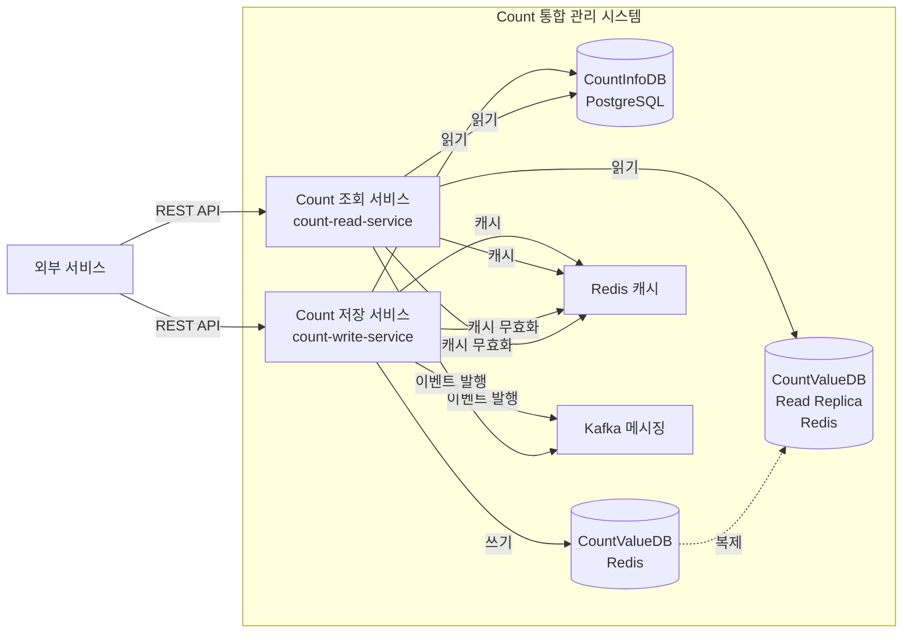

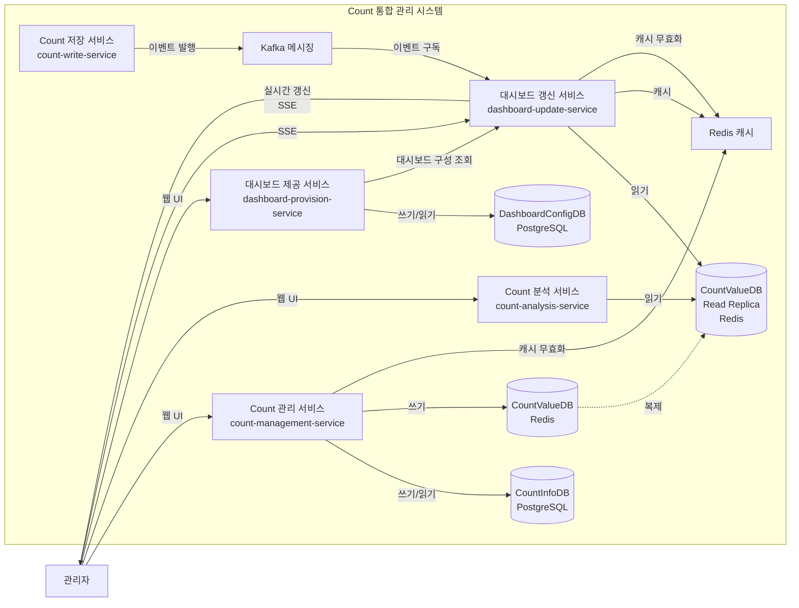

## 컴포넌트 구성

### Count 저장 서비스 (count-write-service)

#### 컴포넌트 목록

| 컴포넌트 | 유형 | 역할 | 인터페이스 |
|---------|------|------|-----------|
| CountAPI (저장 엔드포인트) | Boundary | 외부 서비스로부터 Count 저장 요청 수신 및 응답 반환 | REST API |
| CountWriter | Control | Count 값 저장 및 업데이트 비즈니스 로직 처리 | 내부 API |

#### 컴포넌트 상호작용

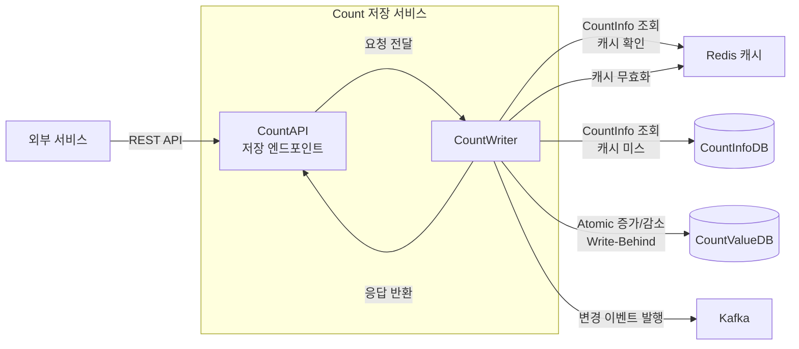

### Count 조회 서비스 (count-read-service)

#### 컴포넌트 목록

| 컴포넌트 | 유형 | 역할 | 인터페이스 |
|---------|------|------|-----------|
| CountAPI (조회 엔드포인트) | Boundary | 외부 서비스로부터 Count 조회 요청 수신 및 응답 반환 | REST API |
| CountReader | Control | Count 값 조회 비즈니스 로직 처리 | 내부 API |

#### 컴포넌트 상호작용

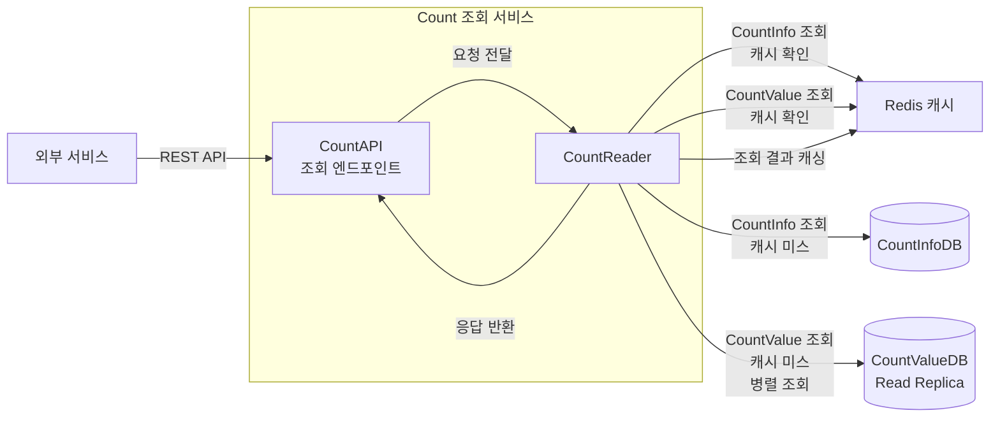

### Count 관리 서비스 (count-management-service)

#### 컴포넌트 목록

| 컴포넌트 | 유형 | 역할 | 인터페이스 |
|---------|------|------|-----------|
| CountManagementUI | Boundary | 관리자와의 Count 관리 웹 UI 인터페이스 | 웹 UI |
| CountManager | Control | Count 데이터 생성, 수정, 삭제 비즈니스 로직 처리 | 내부 API |

#### 컴포넌트 상호작용

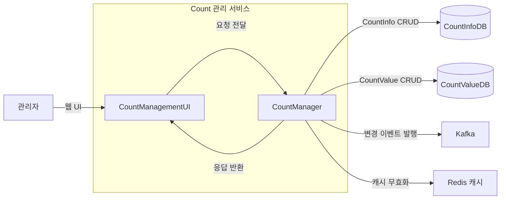

### Count 분석 서비스 (count-analysis-service)

#### 컴포넌트 목록

| 컴포넌트 | 유형 | 역할 | 인터페이스 |
|---------|------|------|-----------|
| CountAnalysisUI | Boundary | 관리자와의 Count 분석 웹 UI 인터페이스 | 웹 UI |
| CountAnalyzer | Control | Count 분석 요청 처리 및 분석 유형별 컴포넌트로 위임 | 내부 API |
| TrendAnalyzer | Control | 트렌드 분석 비즈니스 로직 처리 | 내부 API |
| ComparisonAnalyzer | Control | 비교 분석 비즈니스 로직 처리 | 내부 API |
| PredictionAnalyzer | Control | 예측 분석 비즈니스 로직 처리 | 내부 API |

#### 컴포넌트 상호작용

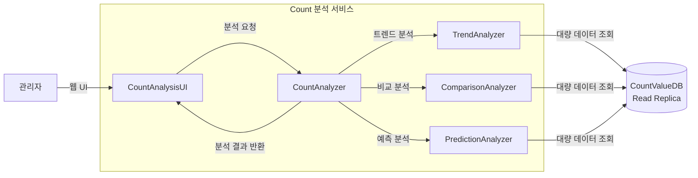

### 대시보드 제공 서비스 (dashboard-provision-service)

#### 컴포넌트 목록

| 컴포넌트 | 유형 | 역할 | 인터페이스 |
|---------|------|------|-----------|
| DashboardUI | Boundary | 관리자와의 Count 모니터링 대시보드 웹 UI 인터페이스 | 웹 UI |
| DashboardManager | Control | 대시보드 구성 및 레이아웃 관리 비즈니스 로직 처리 | 내부 API |

#### 컴포넌트 상호작용

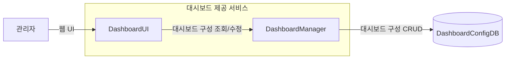

### 대시보드 갱신 서비스 (dashboard-update-service)

#### 컴포넌트 목록

| 컴포넌트 | 유형 | 역할 | 인터페이스 |
|---------|------|------|-----------|
| DashboardUpdater | Control | 대시보드 데이터 실시간 갱신 비즈니스 로직 처리 및 SSE 제공 | 내부 API, SSE |
| CountReader | Control | Count 값 조회 비즈니스 로직 처리 | 내부 API |

#### 컴포넌트 상호작용

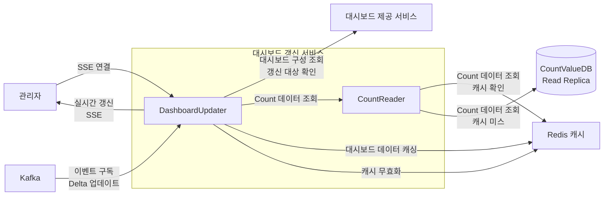

## 커넥터 정의

### 배치 단위 간 커넥터

| 배치 단위 A | 배치 단위 B | 통신 방식 | 프로토콜 | 데이터 형식 | 목적 |
|------------|------------|----------|---------|------------|------|
| 외부 서비스 | Count 저장 서비스 | 동기 | HTTP/HTTPS | JSON | Count 저장 요청 |
| 외부 서비스 | Count 조회 서비스 | 동기 | HTTP/HTTPS | JSON | Count 조회 요청 |
| 관리자 | Count 관리 서비스 | 동기 | HTTP/HTTPS | HTML/JSON | Count 관리 UI |
| 관리자 | Count 분석 서비스 | 동기 | HTTP/HTTPS | HTML/JSON | Count 분석 UI |
| 관리자 | 대시보드 제공 서비스 | 동기 | HTTP/HTTPS | HTML/JSON | 대시보드 UI |
| 관리자 | 대시보드 갱신 서비스 | 비동기 | SSE | JSON | 실시간 갱신 (SSE) |
| 대시보드 제공 서비스 | DashboardConfigDB | 동기 | PostgreSQL Protocol | SQL | 대시보드 구성 CRUD |
| 대시보드 갱신 서비스 | 대시보드 제공 서비스 | 동기 | HTTP/HTTPS | JSON | 대시보드 구성 조회 (갱신 대상 확인) |
| Count 저장 서비스 | CountInfoDB | 동기 | PostgreSQL Protocol | SQL | CountInfo 조회 |
| Count 저장 서비스 | CountValueDB | 동기 | Redis Protocol | Redis Commands | CountValue 저장 (Atomic 연산) |
| Count 저장 서비스 | Redis 캐시 | 동기 | Redis Protocol | Redis Commands | CountInfo 캐싱 및 무효화 |
| Count 저장 서비스 | Kafka | 비동기 | Kafka Protocol | JSON | 변경 이벤트 발행 |
| Count 조회 서비스 | CountInfoDB | 동기 | PostgreSQL Protocol | SQL | CountInfo 조회 |
| Count 조회 서비스 | CountValueDB Read Replica | 동기 | Redis Protocol | Redis Commands | CountValue 조회 |
| Count 조회 서비스 | Redis 캐시 | 동기 | Redis Protocol | Redis Commands | CountInfo/CountValue/조회 결과 캐싱 |
| Count 관리 서비스 | CountInfoDB | 동기 | PostgreSQL Protocol | SQL | CountInfo CRUD |
| Count 관리 서비스 | CountValueDB | 동기 | Redis Protocol | Redis Commands | CountValue CRUD |
| Count 관리 서비스 | Redis 캐시 | 동기 | Redis Protocol | Redis Commands | 캐시 무효화 |
| Count 관리 서비스 | Kafka | 비동기 | Kafka Protocol | JSON | 변경 이벤트 발행 |
| Count 분석 서비스 | CountValueDB Read Replica | 동기 | Redis Protocol | Redis Commands | 대량 CountValue 조회 |
| 대시보드 제공 서비스 | DashboardConfigDB | 동기 | PostgreSQL Protocol | SQL | 대시보드 구성 CRUD |
| 대시보드 갱신 서비스 | 대시보드 제공 서비스 | 동기 | HTTP/HTTPS | JSON | 대시보드 구성 조회 (갱신 대상 확인) |
| 대시보드 갱신 서비스 | CountValueDB Read Replica | 동기 | Redis Protocol | Redis Commands | CountValue 조회 |
| 대시보드 갱신 서비스 | Redis 캐시 | 동기 | Redis Protocol | Redis Commands | 대시보드 데이터 캐싱 |
| 대시보드 갱신 서비스 | Kafka | 비동기 | Kafka Protocol | JSON | 변경 이벤트 구독 |
| 대시보드 갱신 서비스 | 관리자 | 비동기 | SSE | JSON | 실시간 갱신 전송 |
| CountValueDB | CountValueDB Read Replica | 비동기 | Redis Replication Protocol | Redis Replication | 데이터 복제 |

### 컴포넌트 간 커넥터

배치 단위 내 컴포넌트 간 커넥터는 각 배치 단위의 컴포넌트 상호작용 다이어그램에 명시되어 있습니다. 주요 커넥터는 다음과 같습니다:

- **Boundary ↔ Control**: 동기 호출 (함수 호출 또는 내부 API)
- **Control ↔ Entity**: 동기 호출 (데이터베이스 접근)
- **Control ↔ Cache**: 동기 호출 (캐시 접근)
- **Control ↔ Kafka**: 비동기 호출 (이벤트 발행/구독)

## 주요 Use Case 동작

### UC-001: Count 저장

#### 동작 흐름

1. 외부 서비스가 Count 저장 API 요청을 Count 저장 서비스로 전송
2. CountAPI가 요청 데이터 형식 검증 및 인증 정보 검증 수행
3. CountAPI가 CountWriter로 Count 저장 요청 전달
4. CountWriter가 Redis 캐시에서 CountInfo 조회 (CA-007)
5. 캐시 미스 시 CountInfoDB에서 CountInfo 조회
6. CountWriter가 Redis의 Atomic 증가/감소 연산 사용 (CA-012, CA-012A)
7. CountWriter가 Write-Behind 캐싱으로 비동기 쓰기 수행 (CA-009)
8. CountWriter가 Kafka로 변경 이벤트 발행 (CA-022, CA-024)
9. CountWriter가 Redis 캐시 무효화 수행
10. CountWriter가 저장 결과를 CountAPI로 반환
11. CountAPI가 외부 서비스로 저장 결과 반환

#### 배치 단위 간 상호작용

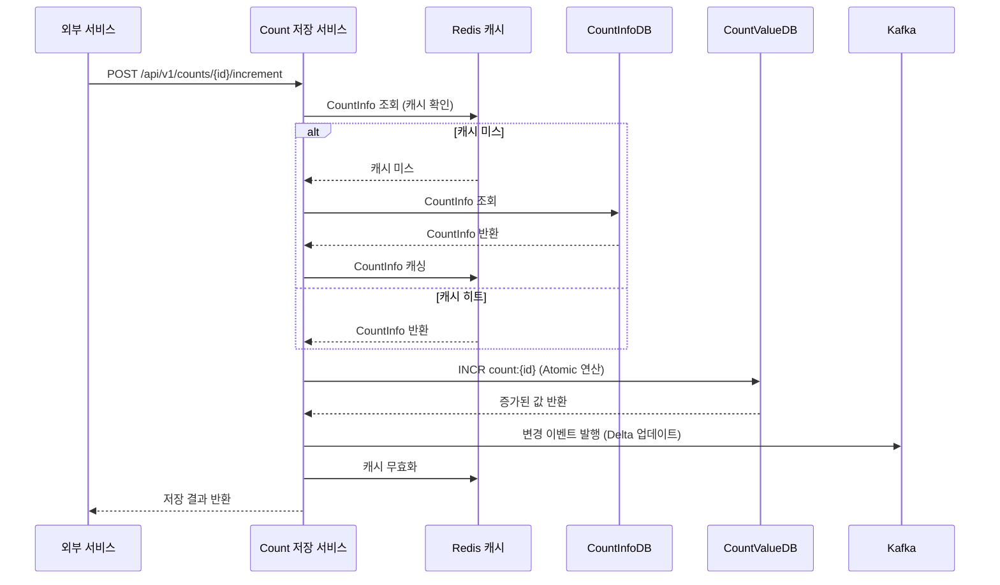

### UC-002: Count 조회

#### 동작 흐름

1. 외부 서비스가 Count 조회 API 요청을 Count 조회 서비스로 전송
2. CountAPI가 요청 데이터 형식 검증 및 인증 정보 검증 수행
3. CountAPI가 CountReader로 Count 조회 요청 전달
4. CountReader가 Redis 캐시에서 조회 결과 확인 (CA-015)
5. 캐시 미스 시:
   - CountReader가 Redis 캐시에서 CountInfo 조회 (CA-013)
   - CountReader가 Redis 캐시에서 CountValue 조회 (CA-014)
   - 캐시 미스 시 CountInfoDB 및 CountValueDB Read Replica에서 병렬 조회 (CA-019)
6. CountReader가 조회 결과를 조합하여 Redis 캐시에 저장
7. CountReader가 조회 결과를 CountAPI로 반환
8. CountAPI가 외부 서비스로 조회 결과 반환

#### 배치 단위 간 상호작용

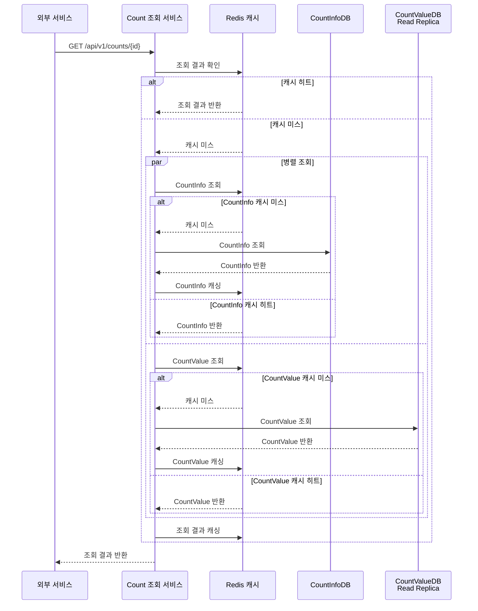

### UC-005: Count 모니터링

#### 동작 흐름

1. 관리자가 대시보드 웹 UI 접근
2. DashboardUI가 DashboardManager를 통해 DashboardConfigDB에서 대시보드 구성 조회
3. DashboardUI가 관리자에게 대시보드 화면 표시
4. 관리자가 대시보드 갱신 서비스로 SSE 연결 요청
5. DashboardUpdater가 Redis 캐시에서 대시보드 데이터 확인 (CA-025)
6. 캐시 미스 시 CountReader를 통해 CountValueDB Read Replica에서 Count 데이터 조회
7. DashboardUpdater가 대시보드 데이터를 조합하여 Redis 캐시에 저장
8. DashboardUpdater가 초기 대시보드 데이터를 SSE로 관리자에게 전송
9. Kafka에서 변경 이벤트 수신 시 (CA-022):
   - DashboardUpdater가 Delta 업데이트 처리 (CA-023)
   - DashboardUpdater가 SSE를 통해 관리자에게 직접 실시간 갱신 전송 (CA-021)
   - DashboardUpdater가 Redis 캐시 무효화 (CA-025A)

#### 배치 단위 간 상호작용

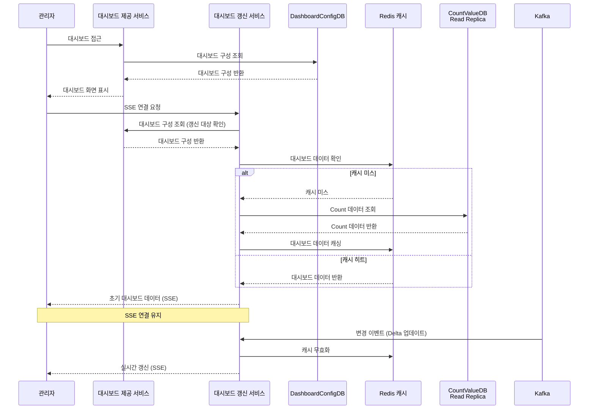

## 품질 요구사항 확인

### 성능

- **응답 시간**: 
  - NFR-001 (Count 저장 응답 시간 < 100ms): CountInfoDB 캐싱(CA-007), Write-Behind 캐싱(CA-009), Atomic 연산(CA-012), Redis 사용(CA-704)으로 달성 가능
  - NFR-002 (Count 조회 응답 시간 < 100ms): CountInfoDB 캐싱(CA-013), CountValueDB 캐싱(CA-014), 조회 결과 캐싱(CA-015), Read Replica(CA-016), Redis 사용(CA-704)으로 달성 가능
  - NFR-004 (대시보드 로딩 시간 < 3초): 대시보드 데이터 캐싱(CA-025)으로 달성 가능
- **처리량**: 
  - NFR-003 (동시 요청 처리량 >= 1000 RPS): 서비스 분할(CA-001, CA-002), Connection Pooling(CA-011, CA-018), Read Replica(CA-016), Redis 사용(CA-704), Kafka 사용(CA-710)으로 달성 가능
- **리소스 활용**: 
  - 각 서비스의 독립적 스케일링으로 리소스 활용 최적화
  - 캐싱을 통한 데이터베이스 부하 감소
  - Read Replica를 통한 읽기 부하 분산

### 가용성

- **장애 격리**: 
  - 서비스 분할(CA-001, CA-002, CA-003, CA-004, CA-005, CA-027)로 각 서비스의 장애가 다른 서비스에 전파되지 않음
  - Database per Service 패턴으로 데이터베이스 장애 격리
  - 대시보드 제공/갱신 서비스 분리(CA-027)로 갱신 서비스의 부하가 UI 제공 서비스에 영향 없음
- **복제 및 백업**: 
  - CountValueDB Read Replica(CA-016)로 읽기 가용성 향상
  - Redis AOF 영속성 전략(CA-704B)으로 데이터 영속성 보장
  - PostgreSQL의 기본 복제 기능 활용 가능

### 신뢰성

- **데이터 일관성**: 
  - CountValueDB는 Redis의 Atomic 연산(CA-012)으로 일관성 보장
  - CountInfoDB와 DashboardConfigDB는 PostgreSQL의 ACID 속성으로 일관성 보장
  - Read Replica 사용 시 Eventual Consistency (CA-001A1, CA-002A1 등)
- **장애 복구**: 
  - Write-Behind 캐싱의 배치 쓰기 및 복구 메커니즘(CA-009A)으로 데이터 손실 방지
  - Kafka의 메시지 보관 정책(CA-710B)으로 이벤트 재처리 가능

### 보안

- **인증/권한**: 
  - 각 서비스의 API 엔드포인트에서 인증/권한 검증 수행
  - 외부 서비스와 관리자 간 인증 메커니즘 분리
- **네트워크 보안**: 
  - HTTPS 프로토콜 사용
  - Kubernetes 환경의 네트워크 정책 활용 가능

### 사용성

- **사용자 인터페이스**: 
  - 관리자용 웹 UI 제공 (Count 관리, 분석, 모니터링)
  - 외부 서비스용 REST API 제공
- **응답성**: 
  - 실시간 갱신(CA-021, CA-022)으로 대시보드 응답성 향상
  - 캐싱을 통한 빠른 응답 시간
  - 서비스 분리(CA-027)로 갱신 로직의 부하가 UI 제공에 영향 없음

## 채택된 후보 구조 반영

### 후보 구조 매핑

| 후보 구조 | 배치 단위 | 반영 내용 |
|----------|----------|-----------|
| CA-001 | Count 저장 서비스 | 서비스 분할, Database per Service |
| CA-002 | Count 조회 서비스 | 서비스 분할, CQRS, Read Replica |
| CA-003 | Count 관리 서비스 | 서비스 분할, Database per Service |
| CA-004 | Count 분석 서비스 | 서비스 분할, Read Replica |
| CA-005 | 대시보드 제공 서비스, 대시보드 갱신 서비스 | 서비스 분할, Database per Service, 서비스 분리 (CA-027) |
| CA-007 | Count 저장 서비스 | CountInfoDB 캐싱 |
| CA-009 | Count 저장 서비스 | Write-Behind 캐싱 |
| CA-010 | Count 저장 서비스 | 데이터베이스 인덱싱 최적화 |
| CA-011 | Count 저장 서비스 | Connection Pooling |
| CA-012 | Count 저장 서비스 | Atomic 증가/감소 연산 |
| CA-013 | Count 조회 서비스 | CountInfoDB 캐싱 |
| CA-014 | Count 조회 서비스 | CountValueDB 캐싱 |
| CA-015 | Count 조회 서비스 | 조회 결과 캐싱 |
| CA-016 | Count 조회 서비스, Count 분석 서비스, 대시보드 갱신 서비스 | Read Replica 구성 |
| CA-017 | Count 조회 서비스 | 데이터베이스 인덱싱 최적화 |
| CA-018 | Count 조회 서비스 | Connection Pooling |
| CA-019 | Count 조회 서비스 | 병렬 DB 조회 |
| CA-021 | 대시보드 갱신 서비스 | Server-Sent Events 실시간 통신 |
| CA-022 | 대시보드 갱신 서비스 | 이벤트 기반 갱신 |
| CA-023 | 대시보드 갱신 서비스 | Delta 업데이트 |
| CA-024 | Count 저장 서비스, Count 조회 서비스 | 변경 이벤트에 데이터 포함 |
| CA-025 | 대시보드 갱신 서비스 | 대시보드 데이터 캐싱 |
| CA-027 | 대시보드 제공 서비스, 대시보드 갱신 서비스 | 대시보드 제공/갱신 서비스 분리 |
| CA-701 | CountInfoDB | PostgreSQL 선택 |
| CA-704 | CountValueDB | Redis 선택, Atomic 연산 지원 |
| CA-706 | DashboardConfigDB | PostgreSQL 선택 |
| CA-708 | Redis 캐시 | Redis 캐싱 솔루션 선택 |
| CA-710 | Kafka 메시징 | Kafka 메시징 시스템 선택 |

### 설계 결정 반영

#### MSA 서비스 분할
- **CA-001, CA-002, CA-003, CA-004, CA-005**: 각 Use Case를 독립적인 마이크로서비스로 분할하여 서비스 독립성 확보
- 각 서비스는 독립적인 배포 및 스케일링 가능
- Database per Service 패턴 적용으로 데이터 독립성 확보

#### CQRS 패턴
- **CA-002**: Count 조회 서비스를 별도로 분리하여 읽기와 쓰기 작업의 독립적 최적화 가능
- Read Replica를 통한 읽기 성능 향상
- 쓰기 작업의 부하가 읽기 작업에 영향을 미치지 않음

#### 성능 최적화
- **캐싱**: CountInfoDB 캐싱(CA-007, CA-013), CountValueDB 캐싱(CA-014), 조회 결과 캐싱(CA-015), 대시보드 데이터 캐싱(CA-025)으로 응답 시간 단축
- **Write-Behind 캐싱**: CA-009로 비동기 쓰기를 통한 응답 시간 단축
- **Atomic 연산**: CA-012로 읽기-수정-쓰기 패턴 제거하여 응답 시간 단축
- **Read Replica**: CA-016로 읽기 부하 분산 및 성능 향상
- **Connection Pooling**: CA-011, CA-018로 연결 관리 효율화
- **병렬 DB 조회**: CA-019로 조회 응답 시간 개선

#### 기술 솔루션 선택
- **PostgreSQL**: CountInfoDB(CA-701)와 DashboardConfigDB(CA-706)에 사용하여 강한 일관성 보장
- **Redis**: CountValueDB(CA-704)와 캐싱(CA-708)에 사용하여 높은 성능과 Atomic 연산 지원
- **Kafka**: 메시징 시스템(CA-710)으로 사용하여 높은 처리량과 메시지 순서 보장

#### 대시보드 최적화
- **서비스 분리**: CA-027로 대시보드 제공 서비스와 갱신 서비스를 분리하여 성능 격리 및 독립적 스케일링 가능
  - 대시보드 제공 서비스: DashboardUI와 DashboardManager를 포함하여 대시보드 구성 및 레이아웃 관리 기능 제공
  - 대시보드 갱신 서비스: DashboardUpdater와 CountReader를 포함하여 실시간 갱신 로직 처리 및 SSE 직접 제공
- **Server-Sent Events**: CA-021로 대시보드 갱신 서비스가 관리자에게 직접 실시간 갱신 제공
- **이벤트 기반 갱신**: CA-022로 폴링 방식 대신 이벤트 기반 갱신
- **Delta 업데이트**: CA-023로 변경된 부분만 전송하여 네트워크 부하 감소
- **변경 이벤트에 데이터 포함**: CA-024로 추가 조회 불필요
- **대시보드 데이터 캐싱**: CA-025로 로딩 시간 단축
