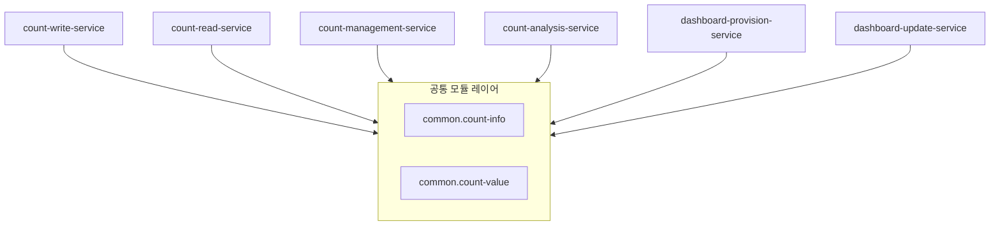

# 모듈 구조 (Module Architecture)

## 개요

### 목적
이 문서는 Count 통합 관리 시스템의 모듈 구조를 정의합니다. 채택된 후보 구조를 근거로 개발해야 할 모듈을 구성하고 모듈 간 의존성 관계를 명세합니다.

### 설계 근거
- **채택된 후보 구조**: 
  - 패키지 구조: CA-501, CA-502, CA-503, CA-504, CA-505, CA-506, CA-513, CA-514, CA-515, CA-516, CA-519
  - 변경 용이성: CA-522, CA-526, CA-530, CA-531, CA-532, CA-535, CA-536, CA-537, CA-541, CA-543, CA-547
  - 개발 프레임워크: CA-602, CA-602B, CA-602B1, CA-602B3, CA-602B4, CA-602B5, CA-602B6
- **주요 설계 결정**: 
  - 도메인별 공통 모듈 구조 (CA-519) 적용
  - NestJS 프레임워크 기반 모듈 구조
  - 리포지토리 패턴 적용 (CA-543)
  - 분석 인터페이스 추상화 (CA-522)
  - 대시보드 기능 인터페이스 추상화 (CA-526)
  - API 어댑터 계층 분리 (CA-537)
  - UI와 API 계층 분리 (CA-531)

## 레이어 구조

### 공통 모듈 레이어 (Common Modules)

#### CountInfo 도메인 공통 모듈 (common.count-info)
- **책임**: CountInfo 도메인 관련 인프라 및 비즈니스 로직 제공
- **포함 모듈**: 
  - `common.count-info.infra`: CountInfoDB 접근 모듈 (Repository 인터페이스 및 구현체)
  - `common.count-info.logic`: CountInfo CRUD 비즈니스 로직 모듈
- **의존성**: 다른 패키지에 의존하지 않음 (최하위 레이어)
- **채택된 후보 구조**: CA-519A

#### CountValue 도메인 공통 모듈 (common.count-value)
- **책임**: CountValue 도메인 관련 인프라 및 비즈니스 로직 제공
- **포함 모듈**: 
  - `common.count-value.infra`: CountValueDB 접근 모듈 (Repository 인터페이스 및 구현체)
  - `common.count-value.logic`: CountValue CRUD 비즈니스 로직 모듈
  - `common.count-value.logic.analysis`: CountValue 분석 로직 모듈 (TrendAnalyzer, ComparisonAnalyzer, PredictionAnalyzer)
- **의존성**: 다른 패키지에 의존하지 않음 (최하위 레이어)
- **채택된 후보 구조**: CA-519B, CA-522

### 서비스별 레이어

#### Count 저장 서비스 (count-write-service)
- **책임**: 외부 서비스로부터 Count 값 저장, 증가, 감소 요청 처리
- **포함 모듈**: 
  - `api.write`: Count 저장 API 레이어 (REST API 컨트롤러, DTO, 어댑터)
- **의존성**: common.count-info.logic, common.count-value.logic
- **채택된 후보 구조**: CA-501, CA-519C, CA-537, CA-543

#### Count 조회 서비스 (count-read-service)
- **책임**: 외부 서비스로부터 Count 값 조회 요청 처리
- **포함 모듈**: 
  - `api.read`: Count 조회 API 레이어 (REST API 컨트롤러, DTO, 어댑터)
- **의존성**: common.count-info.logic, common.count-value.logic
- **채택된 후보 구조**: CA-502, CA-519D, CA-537, CA-543

#### Count 관리 서비스 (count-management-service)
- **책임**: 관리자가 웹 UI를 통해 Count 데이터를 생성, 수정, 삭제하는 기능 제공
- **포함 모듈**: 
  - `ui.management`: Count 관리 UI 레이어 (React 컴포넌트, 페이지)
- **의존성**: common.count-info.logic, common.count-value.logic
- **채택된 후보 구조**: CA-503, CA-519E, CA-531, CA-532, CA-535, CA-536

#### Count 분석 서비스 (count-analysis-service)
- **책임**: 관리자가 Count 데이터에 대한 다양한 분석 기능(트렌드, 비교, 예측) 수행
- **포함 모듈**: 
  - `ui.analysis`: Count 분석 UI 레이어 (React 컴포넌트, 페이지)
- **의존성**: common.count-value.logic.analysis
- **채택된 후보 구조**: CA-504, CA-519F, CA-522, CA-530, CA-531, CA-532, CA-535, CA-536

#### 대시보드 제공 서비스 (dashboard-provision-service)
- **책임**: 관리자에게 대시보드 UI를 제공하고 대시보드 구성 및 레이아웃 관리 기능 제공
- **포함 모듈**: 
  - `ui.dashboard`: 대시보드 UI 레이어 (React 컴포넌트, 페이지)
  - `logic.dashboard`: 대시보드 관리 로직 레이어 (대시보드 구성 관리)
- **의존성**: common.count-info.logic, common.count-value.logic
- **채택된 후보 구조**: CA-505, CA-519G, CA-526, CA-530, CA-531, CA-532, CA-535, CA-536

#### 대시보드 갱신 서비스 (dashboard-update-service)
- **책임**: 대시보드 데이터의 실시간 갱신 로직 처리 및 SSE를 통한 실시간 갱신 제공
- **포함 모듈**: 
  - `logic.dashboard`: 대시보드 갱신 로직 레이어 (실시간 갱신, SSE)
- **의존성**: common.count-value.logic
- **채택된 후보 구조**: CA-506, CA-519H

## 모듈 구조 다이어그램



## 의존성 관계

### 레이어 간 의존성

| 레이어 A | 레이어 B | 의존성 방향 | 의존성 유형 |
|---------|---------|------------|------------|
| 서비스 API/UI 레이어 | 공통 모듈 Logic 레이어 | → | 인터페이스 |
| 공통 모듈 Logic 레이어 | 공통 모듈 Infra 레이어 | → | 인터페이스 (Repository) |
| 공통 모듈 Analysis 레이어 | 공통 모듈 Logic 레이어 | → | 인터페이스 |

### 모듈 간 의존성

| 모듈 A | 모듈 B | 의존성 방향 | 의존성 유형 | 목적 |
|-------|-------|------------|------------|------|
| CountWriteController | CountInfoService | → | 인터페이스 | CountInfo 조회 |
| CountWriteController | CountValueService | → | 인터페이스 | CountValue 저장 |
| CountReadController | CountInfoService | → | 인터페이스 | CountInfo 조회 |
| CountReadController | CountValueService | → | 인터페이스 | CountValue 조회 |
| CountManagementPage | CountInfoService | → | 인터페이스 | CountInfo CRUD |
| CountManagementPage | CountValueService | → | 인터페이스 | CountValue CRUD |
| CountAnalysisPage | AnalysisStrategy | → | 인터페이스 | 분석 기능 사용 |
| DashboardPage | DashboardManager | → | 인터페이스 | 대시보드 구성 관리 |
| DashboardManager | CountInfoService | → | 인터페이스 | CountInfo 조회 |
| DashboardManager | CountValueService | → | 인터페이스 | CountValue 조회 |
| DashboardUpdater | CountValueService | → | 인터페이스 | CountValue 조회 |
| CountInfoService | CountInfoRepository | → | 인터페이스 | CountInfoDB 접근 |
| CountValueService | CountValueRepository | → | 인터페이스 | CountValueDB 접근 |
| TrendAnalyzer | CountValueService | → | 인터페이스 | CountValue 데이터 조회 |
| ComparisonAnalyzer | CountValueService | → | 인터페이스 | CountValue 데이터 조회 |
| PredictionAnalyzer | CountValueService | → | 인터페이스 | CountValue 데이터 조회 |

## 모듈 목록

### 공통 모듈

#### CountInfoRepository (인터페이스)
- **유형**: Infrastructure (인터페이스)
- **레이어**: common.count-info.infra
- **책임**: CountInfoDB 접근을 위한 리포지토리 인터페이스 정의
- **포함 컴포넌트**: CountInfoDB 접근 메서드 정의
- **관련 Use Case**: UC-001, UC-002, UC-003, UC-004, UC-005
- **채택된 후보 구조**: CA-519A, CA-543
- **설계 결정**: 리포지토리 패턴 적용으로 데이터베이스 변경 용이성 향상

#### CountInfoRepositoryImpl
- **유형**: Infrastructure (구현체)
- **레이어**: common.count-info.infra
- **책임**: CountInfoDB 접근 구현 (PostgreSQL, TypeORM)
- **포함 컴포넌트**: TypeORM Entity, Repository 구현
- **관련 Use Case**: UC-001, UC-002, UC-003, UC-004, UC-005
- **채택된 후보 구조**: CA-519A, CA-543, CA-602B1
- **설계 결정**: TypeORM을 사용한 PostgreSQL 접근 구현

#### CountInfoService
- **유형**: Control
- **레이어**: common.count-info.logic
- **책임**: CountInfo CRUD 비즈니스 로직 처리
- **포함 컴포넌트**: CountInfo 생성, 조회, 수정, 삭제 로직
- **관련 Use Case**: UC-001, UC-002, UC-003, UC-004, UC-005
- **채택된 후보 구조**: CA-519A
- **설계 결정**: 도메인별 공통 모듈로 분리하여 재사용성 향상

#### CountValueRepository (인터페이스)
- **유형**: Infrastructure (인터페이스)
- **레이어**: common.count-value.infra
- **책임**: CountValueDB 접근을 위한 리포지토리 인터페이스 정의
- **포함 컴포넌트**: CountValueDB 접근 메서드 정의 (Atomic 연산 포함)
- **관련 Use Case**: UC-001, UC-002, UC-003, UC-004, UC-005
- **채택된 후보 구조**: CA-519B, CA-543
- **설계 결정**: 리포지토리 패턴 적용으로 데이터베이스 변경 용이성 향상

#### CountValueRepositoryImpl
- **유형**: Infrastructure (구현체)
- **레이어**: common.count-value.infra
- **책임**: CountValueDB 접근 구현 (Redis, ioredis)
- **포함 컴포넌트**: Redis 클라이언트, Atomic 연산 구현
- **관련 Use Case**: UC-001, UC-002, UC-003, UC-004, UC-005
- **채택된 후보 구조**: CA-519B, CA-543, CA-602B3
- **설계 결정**: ioredis를 사용한 Redis 접근 구현

#### CountValueService
- **유형**: Control
- **레이어**: common.count-value.logic
- **책임**: CountValue CRUD 비즈니스 로직 처리
- **포함 컴포넌트**: CountValue 저장, 조회, 증가/감소 로직
- **관련 Use Case**: UC-001, UC-002, UC-003, UC-004, UC-005
- **채택된 후보 구조**: CA-519B
- **설계 결정**: 도메인별 공통 모듈로 분리하여 재사용성 향상

#### AnalysisStrategy (인터페이스)
- **유형**: Control (인터페이스)
- **레이어**: common.count-value.logic.analysis
- **책임**: 분석 전략 인터페이스 정의
- **포함 컴포넌트**: 분석 메서드 정의
- **관련 Use Case**: UC-004
- **채택된 후보 구조**: CA-519B, CA-522
- **설계 결정**: 전략 패턴 적용으로 분석 기능 추가 용이성 향상

#### TrendAnalyzer
- **유형**: Control
- **레이어**: common.count-value.logic.analysis
- **책임**: 트렌드 분석 비즈니스 로직 처리
- **포함 컴포넌트**: 트렌드 분석 알고리즘
- **관련 Use Case**: UC-004
- **채택된 후보 구조**: CA-519B, CA-522
- **설계 결정**: AnalysisStrategy 인터페이스 구현

#### ComparisonAnalyzer
- **유형**: Control
- **레이어**: common.count-value.logic.analysis
- **책임**: 비교 분석 비즈니스 로직 처리
- **포함 컴포넌트**: 비교 분석 알고리즘
- **관련 Use Case**: UC-004
- **채택된 후보 구조**: CA-519B, CA-522
- **설계 결정**: AnalysisStrategy 인터페이스 구현

#### PredictionAnalyzer
- **유형**: Control
- **레이어**: common.count-value.logic.analysis
- **책임**: 예측 분석 비즈니스 로직 처리
- **포함 컴포넌트**: 예측 분석 알고리즘
- **관련 Use Case**: UC-004
- **채택된 후보 구조**: CA-519B, CA-522
- **설계 결정**: AnalysisStrategy 인터페이스 구현

### Count 저장 서비스 모듈

#### CountWriteController
- **유형**: Boundary
- **레이어**: count-write-service.api.write
- **책임**: 외부 서비스로부터 Count 저장 REST API 요청 수신 및 응답 반환
- **포함 컴포넌트**: REST API 엔드포인트, 요청/응답 처리
- **관련 Use Case**: UC-001
- **채택된 후보 구조**: CA-501, CA-519C, CA-537
- **설계 결정**: NestJS Controller로 REST API 제공

#### CountWriteAdapter
- **유형**: Boundary
- **레이어**: count-write-service.api.write
- **책임**: REST API 요청을 비즈니스 로직으로 변환
- **포함 컴포넌트**: 요청 데이터 변환, 검증
- **관련 Use Case**: UC-001
- **채택된 후보 구조**: CA-501, CA-519C, CA-537
- **설계 결정**: API 어댑터 계층 분리로 프로토콜 변경 용이성 향상

#### CountWriteDTO
- **유형**: Data Transfer Object
- **레이어**: count-write-service.api.write
- **책임**: REST API 요청/응답 데이터 전송 객체
- **포함 컴포넌트**: 요청/응답 데이터 구조
- **관련 Use Case**: UC-001
- **채택된 후보 구조**: CA-501, CA-519C
- **설계 결정**: DTO를 통한 데이터 전송 객체 분리

### Count 조회 서비스 모듈

#### CountReadController
- **유형**: Boundary
- **레이어**: count-read-service.api.read
- **책임**: 외부 서비스로부터 Count 조회 REST API 요청 수신 및 응답 반환
- **포함 컴포넌트**: REST API 엔드포인트, 요청/응답 처리
- **관련 Use Case**: UC-002
- **채택된 후보 구조**: CA-502, CA-519D, CA-537
- **설계 결정**: NestJS Controller로 REST API 제공

#### CountReadAdapter
- **유형**: Boundary
- **레이어**: count-read-service.api.read
- **책임**: REST API 요청을 비즈니스 로직으로 변환
- **포함 컴포넌트**: 요청 데이터 변환, 검증
- **관련 Use Case**: UC-002
- **채택된 후보 구조**: CA-502, CA-519D, CA-537
- **설계 결정**: API 어댑터 계층 분리로 프로토콜 변경 용이성 향상

#### CountReadDTO
- **유형**: Data Transfer Object
- **레이어**: count-read-service.api.read
- **책임**: REST API 요청/응답 데이터 전송 객체
- **포함 컴포넌트**: 요청/응답 데이터 구조
- **관련 Use Case**: UC-002
- **채택된 후보 구조**: CA-502, CA-519D
- **설계 결정**: DTO를 통한 데이터 전송 객체 분리

### Count 관리 서비스 모듈

#### CountManagementPage
- **유형**: Boundary
- **레이어**: count-management-service.ui.management
- **책임**: 관리자와의 Count 관리 웹 UI 인터페이스
- **포함 컴포넌트**: React 페이지 컴포넌트, 폼 컴포넌트
- **관련 Use Case**: UC-003
- **채택된 후보 구조**: CA-503, CA-519E, CA-531, CA-532, CA-535, CA-536
- **설계 결정**: React 기반 UI 컴포넌트, 공통 UI 컴포넌트 라이브러리 사용

#### CountManagementComponents
- **유형**: Boundary
- **레이어**: count-management-service.ui.management
- **책임**: Count 관리 UI 컴포넌트
- **포함 컴포넌트**: Count 목록, Count 생성/수정/삭제 폼 컴포넌트
- **관련 Use Case**: UC-003
- **채택된 후보 구조**: CA-503, CA-519E, CA-532, CA-536
- **설계 결정**: 컴포넌트 기반 UI 구조로 UI 변경 용이성 향상

### Count 분석 서비스 모듈

#### CountAnalysisPage
- **유형**: Boundary
- **레이어**: count-analysis-service.ui.analysis
- **책임**: 관리자와의 Count 분석 웹 UI 인터페이스
- **포함 컴포넌트**: React 페이지 컴포넌트, 분석 결과 표시 컴포넌트
- **관련 Use Case**: UC-004
- **채택된 후보 구조**: CA-504, CA-519F, CA-522, CA-530, CA-531, CA-532, CA-535, CA-536
- **설계 결정**: React 기반 UI 컴포넌트, AnalysisStrategy 인터페이스 사용

#### CountAnalysisComponents
- **유형**: Boundary
- **레이어**: count-analysis-service.ui.analysis
- **책임**: Count 분석 UI 컴포넌트
- **포함 컴포넌트**: 분석 유형 선택, 분석 결과 차트/테이블 컴포넌트
- **관련 Use Case**: UC-004
- **채택된 후보 구조**: CA-504, CA-519F, CA-522, CA-530, CA-532, CA-536
- **설계 결정**: UI와 로직 분리 구조, 컴포넌트 기반 UI 구조

### 대시보드 제공 서비스 모듈

#### DashboardPage
- **유형**: Boundary
- **레이어**: dashboard-provision-service.ui.dashboard
- **책임**: 관리자와의 Count 모니터링 대시보드 웹 UI 인터페이스
- **포함 컴포넌트**: React 페이지 컴포넌트, 대시보드 레이아웃 컴포넌트
- **관련 Use Case**: UC-005
- **채택된 후보 구조**: CA-505, CA-519G, CA-526, CA-530, CA-531, CA-532, CA-535, CA-536
- **설계 결정**: React 기반 UI 컴포넌트, DashboardFeature 인터페이스 사용

#### DashboardComponents
- **유형**: Boundary
- **레이어**: dashboard-provision-service.ui.dashboard
- **책임**: 대시보드 UI 컴포넌트
- **포함 컴포넌트**: 대시보드 위젯 컴포넌트, 레이아웃 편집 컴포넌트
- **관련 Use Case**: UC-005
- **채택된 후보 구조**: CA-505, CA-519G, CA-526, CA-530, CA-532, CA-536
- **설계 결정**: UI와 로직 분리 구조, 컴포넌트 기반 UI 구조

#### DashboardManager
- **유형**: Control
- **레이어**: dashboard-provision-service.logic.dashboard
- **책임**: 대시보드 구성 및 레이아웃 관리 비즈니스 로직 처리
- **포함 컴포넌트**: 대시보드 구성 CRUD 로직, DashboardFeature 관리
- **관련 Use Case**: UC-005
- **채택된 후보 구조**: CA-505, CA-519G, CA-526
- **설계 결정**: DashboardFeature 인터페이스에 의존하여 대시보드 기능 추가 용이성 향상

#### DashboardFeature (인터페이스)
- **유형**: Control (인터페이스)
- **레이어**: dashboard-provision-service.logic.dashboard
- **책임**: 대시보드 기능 인터페이스 정의
- **포함 컴포넌트**: 대시보드 기능 메서드 정의
- **관련 Use Case**: UC-005
- **채택된 후보 구조**: CA-505, CA-519G, CA-526
- **설계 결정**: 전략 패턴 적용으로 대시보드 기능 추가 용이성 향상

### 대시보드 갱신 서비스 모듈

#### DashboardUpdater
- **유형**: Control
- **레이어**: dashboard-update-service.logic.dashboard
- **책임**: 대시보드 데이터 실시간 갱신 비즈니스 로직 처리
- **포함 컴포넌트**: 실시간 갱신 로직, 이벤트 처리
- **관련 Use Case**: UC-005
- **채택된 후보 구조**: CA-506, CA-519H
- **설계 결정**: 이벤트 기반 갱신, Delta 업데이트

#### SSEHandler
- **유형**: Boundary
- **레이어**: dashboard-update-service.logic.dashboard
- **책임**: Server-Sent Events를 통한 실시간 갱신 제공
- **포함 컴포넌트**: SSE 연결 관리, 이벤트 전송
- **관련 Use Case**: UC-005
- **채택된 후보 구조**: CA-506, CA-519H
- **설계 결정**: Server-Sent Events 실시간 통신

## 프로젝트 구조

### 전체 프로젝트 폴더 구조

```
count-management-system/
├── common/                                    # 공통 모듈 레이어
│   ├── count-info/                            # CA-519A: CountInfo 도메인 공통 모듈
│   │   ├── infra/                             # infra 레이어
│   │   │   ├── repository/                    # Repository 인터페이스 및 구현체
│   │   │   └── entity/                        # Entity 모델 (TypeORM)
│   │   └── logic/                             # logic 레이어
│   │       └── service/                       # Service 인터페이스 및 구현체
│   │
│   └── count-value/                           # CA-519B: CountValue 도메인 공통 모듈
│       ├── infra/                             # infra 레이어
│       │   ├── repository/                    # Repository 인터페이스 및 구현체
│       │   └── entity/                        # Entity 모델 (Redis)
│       └── logic/                             # logic 레이어
│           ├── service/                       # Service 인터페이스 및 구현체
│           └── analysis/                      # CA-522: 분석 로직 레이어
│               ├── strategy/                  # AnalysisStrategy 인터페이스
│               └── analyzer/                  # Analyzer 구현체
│
├── count-write-service/                       # CA-519C: Count 저장 서비스
│   └── api/                                   # API 레이어
│       └── write/                             # api.write 패키지
│           ├── controller/                    # REST API Controller
│           ├── adapter/                       # CA-537: API 어댑터
│           ├── dto/                           # DTO (Data Transfer Object)
│           └── version/                       # CA-541: API 버전 관리
│
├── count-read-service/                        # CA-519D: Count 조회 서비스
│   └── api/                                   # API 레이어
│       └── read/                              # api.read 패키지
│           ├── controller/                    # REST API Controller
│           ├── adapter/                       # CA-537: API 어댑터
│           ├── dto/                           # DTO (Data Transfer Object)
│           └── version/                       # CA-541: API 버전 관리
│
├── count-management-service/                  # CA-519E: Count 관리 서비스
│   └── ui/                                    # UI 레이어
│       └── management/                        # ui.management 패키지
│           ├── page/                          # React 페이지 컴포넌트
│           ├── component/                     # CA-536: UI 컴포넌트
│           ├── style/                         # CA-535: 스타일 시스템
│           └── api/                           # CA-531: API 계층 (서비스 API 호출)
│
├── count-analysis-service/                    # CA-519F: Count 분석 서비스
│   └── ui/                                    # UI 레이어
│       └── analysis/                          # ui.analysis 패키지
│           ├── page/                          # React 페이지 컴포넌트
│           ├── component/                     # CA-536: UI 컴포넌트
│           │   └── chart/                     # 차트 컴포넌트
│           ├── style/                         # CA-535: 스타일 시스템
│           └── api/                           # CA-531: API 계층 (서비스 API 호출)
│
├── dashboard-provision-service/               # CA-519G: 대시보드 제공 서비스
│   ├── ui/                                    # UI 레이어
│   │   └── dashboard/                         # ui.dashboard 패키지
│   │       ├── page/                          # React 페이지 컴포넌트
│   │       ├── component/                     # CA-536: UI 컴포넌트
│   │       │   └── widget/                    # 대시보드 위젯 컴포넌트
│   │       ├── style/                         # CA-535: 스타일 시스템
│   │       └── api/                           # CA-531: API 계층 (서비스 API 호출)
│   └── logic/                                 # Logic 레이어
│       └── dashboard/                         # logic.dashboard 패키지
│           ├── manager/                       # DashboardManager
│           ├── feature/                       # CA-526: DashboardFeature 인터페이스 및 구현체
│           └── repository/                    # DashboardConfigDB Repository
│
└── dashboard-update-service/                  # CA-519H: 대시보드 갱신 서비스
    └── logic/                                 # Logic 레이어
        └── dashboard/                          # logic.dashboard 패키지
            ├── updater/                       # DashboardUpdater
            ├── sse/                           # SSEHandler
            └── event/                         # 이벤트 처리 모듈
```

### 공통 모듈 폴더 구조

#### common/count-info/
```
common/count-info/
├── infra/
│   ├── repository/
│   │   ├── count-info.repository.interface.ts    # CA-543: Repository 인터페이스
│   │   └── count-info.repository.impl.ts          # CA-543: Repository 구현체
│   └── entity/
│       └── count-info.entity.ts                  # CA-602B1: TypeORM Entity
└── logic/
    └── service/
        ├── count-info.service.interface.ts       # Service 인터페이스
        └── count-info.service.impl.ts            # Service 구현체
```

#### common/count-value/
```
common/count-value/
├── infra/
│   ├── repository/
│   │   ├── count-value.repository.interface.ts  # CA-543: Repository 인터페이스
│   │   └── count-value.repository.impl.ts         # CA-543: Repository 구현체 (ioredis)
│   └── entity/
│       └── count-value.entity.ts                 # Entity 모델
└── logic/
    ├── service/
    │   ├── count-value.service.interface.ts      # Service 인터페이스
    │   └── count-value.service.impl.ts           # Service 구현체
    └── analysis/                                 # CA-522: 분석 로직
        ├── strategy/
        │   └── analysis-strategy.interface.ts     # CA-522: AnalysisStrategy 인터페이스
        └── analyzer/
            ├── trend-analyzer.ts                 # TrendAnalyzer 구현체
            ├── comparison-analyzer.ts            # ComparisonAnalyzer 구현체
            └── prediction-analyzer.ts            # PredictionAnalyzer 구현체
```

### 서비스별 폴더 구조

#### count-write-service/
```
count-write-service/
└── api/
    └── write/
        ├── controller/
        │   └── count-write.controller.ts         # CA-602B: NestJS Controller
        ├── adapter/
        │   └── count-write.adapter.ts             # CA-537: API 어댑터
        ├── dto/
        │   ├── count-write-request.dto.ts
        │   └── count-write-response.dto.ts
        └── version/
            └── v1/                                # CA-541: API 버전 관리
```

#### count-read-service/
```
count-read-service/
└── api/
    └── read/
        ├── controller/
        │   └── count-read.controller.ts           # CA-602B: NestJS Controller
        ├── adapter/
        │   └── count-read.adapter.ts              # CA-537: API 어댑터
        ├── dto/
        │   ├── count-read-request.dto.ts
        │   └── count-read-response.dto.ts
        └── version/
            └── v1/                                # CA-541: API 버전 관리
```

#### count-management-service/
```
count-management-service/
└── ui/
    └── management/
        ├── page/
        │   └── count-management.page.tsx          # React 페이지
        ├── component/
        │   ├── count-list.component.tsx           # CA-536: 컴포넌트
        │   └── count-form.component.tsx            # CA-536: 컴포넌트
        ├── style/
        │   └── theme.ts                           # CA-535: 스타일 시스템
        └── api/
            └── count-management.api.ts            # CA-531: API 계층
```

#### count-analysis-service/
```
count-analysis-service/
└── ui/
    └── analysis/
        ├── page/
        │   └── count-analysis.page.tsx            # React 페이지
        ├── component/
        │   ├── analysis-selector.component.tsx    # CA-536: 컴포넌트
        │   └── chart/
        │       ├── trend-chart.component.tsx      # CA-530: UI 컴포넌트
        │       ├── comparison-chart.component.tsx # CA-530: UI 컴포넌트
        │       └── prediction-chart.component.tsx  # CA-530: UI 컴포넌트
        ├── style/
        │   └── theme.ts                           # CA-535: 스타일 시스템
        └── api/
            └── count-analysis.api.ts              # CA-531: API 계층
```

#### dashboard-provision-service/
```
dashboard-provision-service/
├── ui/
│   └── dashboard/
│       ├── page/
│       │   └── dashboard.page.tsx                # React 페이지
│       ├── component/
│       │   ├── dashboard-layout.component.tsx    # CA-536: 컴포넌트
│       │   └── widget/
│       │       └── dashboard-widget.component.tsx # CA-530: UI 컴포넌트
│       ├── style/
│       │   └── theme.ts                          # CA-535: 스타일 시스템
│       └── api/
│           └── dashboard.api.ts                  # CA-531: API 계층
└── logic/
    └── dashboard/
        ├── manager/
        │   └── dashboard-manager.ts               # DashboardManager
        ├── feature/
        │   ├── dashboard-feature.interface.ts     # CA-526: DashboardFeature 인터페이스
        │   └── dashboard-feature.impl.ts          # CA-526: DashboardFeature 구현체
        └── repository/
            └── dashboard-config.repository.ts    # DashboardConfigDB Repository
```

#### dashboard-update-service/
```
dashboard-update-service/
└── logic/
    └── dashboard/
        ├── updater/
        │   └── dashboard-updater.ts              # DashboardUpdater
        ├── sse/
        │   └── sse-handler.ts                    # SSEHandler
        └── event/
            └── dashboard-event-handler.ts         # 이벤트 처리
```

### 공통 UI 컴포넌트 라이브러리 (선택적)

```
common-ui/                                     # CA-532: 공통 UI 컴포넌트 라이브러리
├── component/
│   ├── button/
│   ├── input/
│   ├── table/
│   └── chart/
├── style/
│   └── design-system.ts                       # CA-535: 디자인 토큰 시스템
└── theme/
    └── theme-manager.ts                        # CA-535: 테마 관리 시스템
```

### 의존성 규칙

#### 공통 모듈 의존성 규칙
- `common.count-info.infra`: 다른 패키지를 의존하지 않음
- `common.count-info.logic`: `common.count-info.infra`만 의존
- `common.count-value.infra`: 다른 패키지를 의존하지 않음
- `common.count-value.logic`: `common.count-value.infra`만 의존
- `common.count-value.logic.analysis`: `common.count-value.logic`만 의존

#### 서비스별 레이어 의존성 규칙
- `api.write`, `api.read`: `common.count-info.logic`, `common.count-value.logic` 의존
- `ui.management`, `ui.analysis`, `ui.dashboard`: `common.count-info.logic`, `common.count-value.logic` 의존 (직접 또는 API 계층을 통해)
- `logic.dashboard`: `common.count-info.logic`, `common.count-value.logic` 의존
- 서비스 패키지는 다른 서비스 패키지를 의존하지 않음

## 품질 요구사항 확인

### 변경 용이성

- **모듈 독립성**: 
  - 도메인별 공통 모듈 구조(CA-519)로 도메인별 변경 시 영향 범위 제한
  - 서비스별 API/UI 레이어 분리로 서비스별 독립성 보장
  - 리포지토리 패턴(CA-543)으로 데이터베이스 변경 시 영향 범위 제한
  - **만족 여부**: ✅ 만족

- **인터페이스 분리**: 
  - AnalysisStrategy 인터페이스(CA-522)로 분석 기능 추가 시 CountAnalyzer 수정 불필요
  - DashboardFeature 인터페이스(CA-526)로 대시보드 기능 추가 시 DashboardManager 수정 불필요
  - Repository 인터페이스(CA-543)로 데이터베이스 구현 변경 시 비즈니스 로직 수정 불필요
  - **만족 여부**: ✅ 만족

- **의존성 관리**: 
  - 공통 모듈은 다른 패키지를 의존하지 않음
  - 서비스 레이어는 공통 모듈의 Logic 레이어만 의존
  - 의존성 역전 원칙 적용으로 인터페이스에 의존
  - **만족 여부**: ✅ 만족

### 재사용성

- **모듈 재사용성**: 
  - CountInfoService, CountValueService가 여러 서비스에서 재사용
  - AnalysisStrategy 구현체가 분석 서비스에서 재사용
  - 공통 UI 컴포넌트 라이브러리(CA-532)로 UI 컴포넌트 재사용
  - **만족 여부**: ✅ 만족

- **공통 모듈 분리**: 
  - 도메인별 공통 모듈(CA-519)로 공통 로직 분리
  - 공통 모듈 내부에서 infra와 logic 레이어 분리
  - **만족 여부**: ✅ 만족

### 테스트 용이성

- **모듈 테스트**: 
  - 각 모듈이 인터페이스에 의존하여 독립적으로 테스트 가능
  - Repository 인터페이스를 모킹하여 비즈니스 로직 테스트 가능
  - AnalysisStrategy 인터페이스를 모킹하여 분석 로직 테스트 가능
  - **만족 여부**: ✅ 만족

- **의존성 주입**: 
  - NestJS의 의존성 주입 프레임워크 활용
  - 인터페이스 기반 의존성 주입으로 테스트 용이성 향상
  - **만족 여부**: ✅ 만족

- **모킹 가능성**: 
  - Repository 인터페이스를 모킹하여 데이터베이스 접근 테스트
  - Service 인터페이스를 모킹하여 비즈니스 로직 테스트
  - **만족 여부**: ✅ 만족

### 유지보수성

- **코드 구조**: 
  - 도메인별 공통 모듈 구조로 명확한 코드 구조
  - 레이어별 패키지 구성으로 관심사 분리
  - **만족 여부**: ✅ 만족

- **모듈 경계**: 
  - 도메인별 공통 모듈과 서비스별 레이어로 명확한 모듈 경계
  - 인터페이스를 통한 모듈 간 통신으로 경계 명확화
  - **만족 여부**: ✅ 만족

- **문서화**: 
  - 모듈 구조 문서화 완료
  - 각 모듈의 책임과 의존성 관계 명시
  - **만족 여부**: ✅ 만족

## 채택된 후보 구조 반영

### 후보 구조 매핑

| 후보 구조 | 모듈 구조 반영 내용 |
|----------|-------------------|
| CA-519 | 도메인별 공통 모듈 구조 적용 (common.count-info, common.count-value) |
| CA-519A | CountInfo 도메인 공통 모듈 구성 (infra, logic) |
| CA-519B | CountValue 도메인 공통 모듈 구성 (infra, logic, logic.analysis) |
| CA-519C | Count 저장 서비스 레이어 구성 (api.write) |
| CA-519D | Count 조회 서비스 레이어 구성 (api.read) |
| CA-519E | Count 관리 서비스 레이어 구성 (ui.management) |
| CA-519F | Count 분석 서비스 레이어 구성 (ui.analysis) |
| CA-519G | 대시보드 제공 서비스 레이어 구성 (ui.dashboard, logic.dashboard) |
| CA-519H | 대시보드 갱신 서비스 레이어 구성 (logic.dashboard) |
| CA-522 | AnalysisStrategy 인터페이스 및 구현체 모듈 |
| CA-526 | DashboardFeature 인터페이스 및 구현체 모듈 |
| CA-530 | 대시보드 UI와 로직 분리 구조 |
| CA-531 | UI와 API 계층 분리 구조 |
| CA-532 | 공통 UI 컴포넌트 라이브러리 |
| CA-535 | 스타일 시스템 분리 |
| CA-536 | 컴포넌트 기반 UI 구조 |
| CA-537 | API 어댑터 계층 분리 (CountWriteAdapter, CountReadAdapter) |
| CA-541 | API 버전 관리 구조 |
| CA-543 | 리포지토리 패턴 적용 (CountInfoRepository, CountValueRepository) |
| CA-547 | 쿼리 분리 구조 |
| CA-602B | NestJS 프레임워크 기반 모듈 구조 |
| CA-602B1 | TypeORM을 사용한 CountInfoRepository 구현 |
| CA-602B3 | ioredis를 사용한 CountValueRepository 구현 |

### 설계 결정 반영

#### 도메인별 공통 모듈 구조
- **CA-519**: CountInfo와 CountValue를 도메인별로 공통 모듈 분리
- 각 도메인 모듈은 infra와 logic 레이어 포함
- 여러 서비스에서 공통으로 사용되는 도메인 로직 재사용

#### 리포지토리 패턴
- **CA-543**: Repository 인터페이스와 구현체 분리
- 데이터베이스 변경 시 Repository 구현체만 수정하면 됨
- 비즈니스 로직은 Repository 인터페이스에 의존

#### 인터페이스 추상화
- **CA-522**: AnalysisStrategy 인터페이스로 분석 기능 추가 용이성 향상
- **CA-526**: DashboardFeature 인터페이스로 대시보드 기능 추가 용이성 향상

#### API 어댑터 계층 분리
- **CA-537**: API 어댑터 계층 분리로 프로토콜 변경 용이성 향상
- REST API 외 다른 프로토콜 지원 시 어댑터만 교체

#### UI와 API 계층 분리
- **CA-531**: UI와 API 계층 분리로 UI 변경이 비즈니스 로직에 영향 없음
- **CA-532**: 공통 UI 컴포넌트 라이브러리로 UI 컴포넌트 재사용
- **CA-536**: 컴포넌트 기반 UI 구조로 UI 변경 용이성 향상

#### NestJS 프레임워크
- **CA-602B**: NestJS 프레임워크 기반 모듈 구조
- 모듈 시스템과 의존성 주입으로 구조화된 개발
- TypeORM, ioredis 등과의 통합 지원
