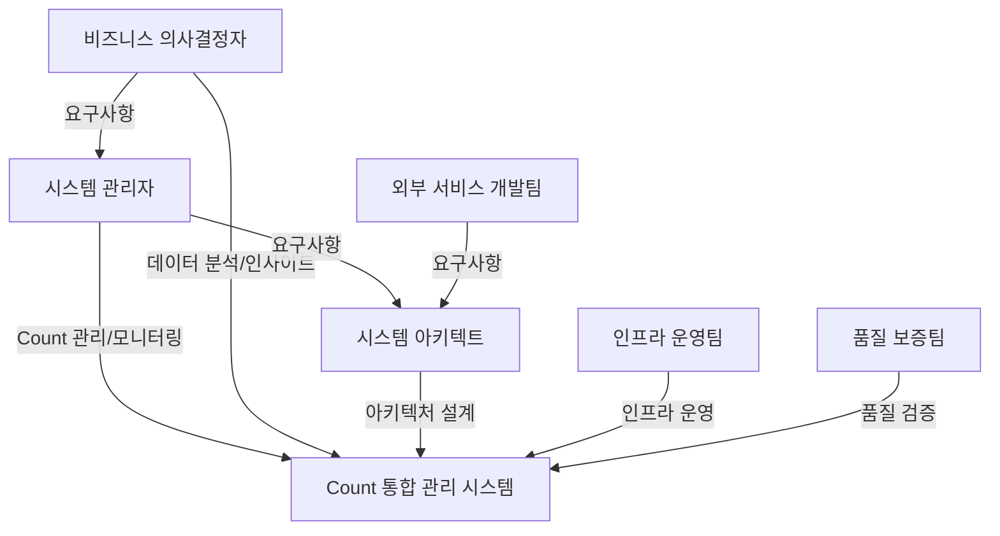

# 비즈니스 요구사항

## 비즈니스 개요

### 비즈니스 배경
마이크로서비스 아키텍처 환경에서 여러 서비스들이 각각 Count 데이터를 분산 관리하면서 발생하는 문제들을 해결하기 위해, Count 데이터를 중앙에서 통합 관리하는 시스템이 필요하게 되었습니다. 분산된 Count 값의 불일치, 중복 저장으로 인한 비효율성, 그리고 Count 조회 및 관리 기능의 부재는 서비스 운영의 신뢰성과 효율성을 저해하는 주요 요인입니다.

### 비즈니스 목적
Count 통합 관리 시스템을 통해 다음과 같은 비즈니스 목적을 달성하고자 합니다:
- Count 데이터의 일관성과 신뢰성 보장을 통한 서비스 품질 향상
- Count 데이터의 중앙 집중식 관리를 통한 운영 효율성 증대
- 관리자를 위한 통합 UI, 분석 기능, 대시보드를 제공하여 의사결정 지원
- 외부 서비스들이 Count 데이터를 효율적으로 활용할 수 있는 인프라 제공

### 비즈니스 가치 제안
- **데이터 일관성 보장**: 분산된 Count 값의 불일치 문제 해결로 서비스 신뢰성 향상
- **운영 효율성**: 중앙 집중식 관리를 통한 운영 비용 절감 및 관리 편의성 증대
- **의사결정 지원**: 분석 기능과 대시보드를 통한 데이터 기반 의사결정 지원
- **확장성**: Kubernetes 환경에서 MSA로 개발하여 향후 서비스 확장에 유연하게 대응
- **개발 생산성**: 외부 서비스들이 표준화된 API를 통해 Count 데이터를 쉽게 활용

## 비즈니스 목표

### 단기 목표 (3-6개월)
- Count 통합 관리 시스템 구축 및 배포 완료
- 주요 외부 서비스들의 Count 데이터 마이그레이션 완료
- 관리자 UI를 통한 Count 관리 기능 제공
- 기본적인 분석 기능 및 대시보드 제공
- Count 데이터의 일관성 보장 메커니즘 구현

### 중기 목표 (6-12개월)
- 모든 외부 서비스의 Count 데이터 통합 완료
- 고급 분석 기능 제공 (트렌드 분석, 비교 분석, 예측 분석 등)
- 대시보드 기능 고도화 및 실시간 모니터링 강화
- 시스템 성능 최적화 및 확장성 개선
- 운영 안정성 향상 및 장애 대응 체계 구축

### 장기 목표 (12개월 이상)
- Count 데이터 기반 비즈니스 인사이트 제공
- 머신러닝을 활용한 예측 분석 기능 확장
- 자동화된 Count 데이터 관리 및 최적화
- 다른 데이터 타입으로의 확장 가능성 검토
- 비즈니스 가치 창출을 위한 데이터 활용 전략 수립

### 목표 우선순위
1. **최우선**: Count 데이터 일관성 보장 및 기본 CRUD 기능 제공 (단기 목표)
2. **높음**: 관리자 UI 및 기본 분석/대시보드 기능 제공 (단기 목표)
3. **중간**: 고급 분석 기능 및 성능 최적화 (중기 목표)
4. **낮음**: 예측 분석 및 자동화 기능 확장 (장기 목표)

## 비즈니스 드라이버

### 시장 요구사항
- 마이크로서비스 아키텍처 환경에서 데이터 일관성 보장의 중요성 증가
- 실시간 데이터 분석 및 모니터링에 대한 요구 증가
- 서비스 운영의 효율성과 신뢰성에 대한 기대 증가
- 데이터 기반 의사결정의 중요성 강조

### 경쟁력 요인
- **데이터 일관성**: Count 값의 불일치 문제 해결로 서비스 품질 향상
- **운영 효율성**: 중앙 집중식 관리를 통한 운영 비용 절감
- **의사결정 지원**: 분석 기능과 대시보드를 통한 빠른 의사결정
- **확장성**: Kubernetes 및 MSA 기반의 유연한 아키텍처
- **개발 생산성**: 표준화된 API를 통한 쉬운 통합 및 활용

### 수익성 목표
- 운영 비용 절감: 중복 저장 및 관리 비용 감소
- 개발 생산성 향상: 표준화된 API를 통한 개발 시간 단축
- 서비스 품질 향상: 데이터 일관성 보장으로 인한 고객 만족도 증가
- 의사결정 품질 향상: 분석 기능을 통한 더 나은 비즈니스 의사결정

### 성장 전략
- 단계적 마이그레이션: 기존 서비스와의 호환성을 유지하면서 점진적 통합
- 기능 확장: 기본 기능부터 시작하여 고급 분석 기능으로 확장
- 사용자 확대: 초기 외부 서비스부터 시작하여 점진적으로 확대
- 기술 진화: Kubernetes 및 MSA 기반의 현대적인 아키텍처로 지속적 개선

## 이해관계자

### 주요 이해관계자
- **외부 서비스 개발팀**
  - 역할: Count 데이터를 생성하고 사용하는 마이크로서비스 개발 및 운영
  - 관심사: Count 데이터의 안정적인 저장/조회, API 사용 편의성, 성능
  - 영향력: 높음

- **시스템 관리자**
  - 역할: Count 데이터를 직접 관리하고 모니터링하는 운영 담당자
  - 관심사: 관리자 UI의 사용 편의성, 분석 기능의 유용성, 대시보드를 통한 모니터링
  - 영향력: 높음

- **비즈니스 의사결정자**
  - 역할: Count 데이터를 기반으로 비즈니스 의사결정을 수행
  - 관심사: 분석 기능의 정확성, 대시보드의 시각화 품질, 데이터 기반 인사이트
  - 영향력: 중간

- **시스템 아키텍트**
  - 역할: 시스템 아키텍처 설계 및 기술 전략 수립
  - 관심사: 시스템의 확장성, 성능, 유지보수성, 기술 표준 준수
  - 영향력: 높음

- **인프라 운영팀**
  - 역할: Kubernetes 환경에서 시스템 인프라 운영 및 관리
  - 관심사: 시스템 안정성, 확장성, 모니터링, 장애 대응
  - 영향력: 중간

- **품질 보증팀**
  - 역할: 시스템 품질 검증 및 테스트
  - 관심사: 데이터 일관성, 시스템 안정성, 성능, 사용자 경험
  - 영향력: 중간

### 이해관계자 관계

