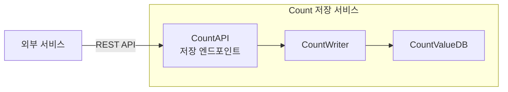

# CA-001: Count 저장 서비스 분할

## 개요

### 후보 구조 ID
CA-001

### 제목
Count 저장 서비스 분할

### 설명
UC-001 (Count 저장) 기능을 독립적인 마이크로서비스로 분할합니다. 외부 서비스가 Count 값을 저장하거나 증가/감소시키는 기능을 제공하는 독립적인 서비스입니다.

## 설계 결정

### 서비스 분할 결정
- **대상 Use Case**: UC-001 (Count 저장)
- **서비스명**: `count-write-service`
- **서비스 경계**: CountWriter (Control), CountAPI의 저장 관련 엔드포인트 (Boundary)
- **데이터 소유권**: CountValueDB (Entity) - Count 값 데이터

### 전술 적용
- **Use Case 기반 서비스 분할**: UC-001을 독립 서비스로 분할
- **Database per Service**: CountValueDB를 Count 저장 서비스 전용으로 할당

## 서비스 구조

### 서비스 컴포넌트
- **CountAPI (저장 엔드포인트)**: 외부 서비스로부터 Count 저장 요청 수신
- **CountWriter**: Count 값 저장 및 업데이트 비즈니스 로직 처리
- **CountValueDB**: Count 값 데이터 영속적 저장

### 서비스 인터페이스
- **REST API**: 
  - `POST /api/v1/counts/{countId}/increment` - Count 값 증가
  - `POST /api/v1/counts/{countId}/decrement` - Count 값 감소
  - `PUT /api/v1/counts/{countId}/value` - Count 값 설정

## 장점

### 서비스 독립성
- **QA-003 (Count 저장 서비스 독립성 최대화) 달성에 기여**
- Count 저장 서비스가 다른 서비스의 부하에 영향을 받지 않음
- Count 저장 서비스 변경 시 다른 서비스에 영향을 미치지 않음
- 독립적인 배포 및 스케일링 가능

### 성능 격리
- **QA-001 (Count 저장 응답 시간 최소화) 달성에 기여**
- Count 저장 작업이 다른 서비스(조회, 관리, 분석, 모니터링)의 성능에 영향을 미치지 않음
- Count 저장 서비스의 부하가 다른 서비스에 전파되지 않음
- 독립적인 성능 최적화 가능

### 확장성
- Count 저장 트래픽에 맞춰 독립적으로 확장 가능
- 다른 서비스와 독립적인 스케일링 정책 적용 가능
- **NFR-003 (동시 요청 처리 능력 >= 1000 RPS) 달성에 기여**

### 배포 독립성
- Count 저장 서비스만 독립적으로 배포 및 업데이트 가능
- 다른 서비스의 배포에 영향을 받지 않음
- 롤백 시 다른 서비스에 영향을 미치지 않음

## 단점 및 트레이드오프

### DB 공유 문제
- **문제**: CountValueDB를 다른 서비스(조회, 관리, 분석, 모니터링)와 공유하면 서비스 독립성이 저하됨
- **영향**: 
  - CountValueDB의 부하가 다른 서비스에 영향을 미칠 수 있음
  - CountValueDB의 장애가 다른 서비스에 영향을 미칠 수 있음
  - CountValueDB의 스키마 변경이 다른 서비스에 영향을 미칠 수 있음
- **해결 방안**: CA-001A (CountValueDB for Count 저장 서비스)

### 데이터 불일치 문제
- **문제**: CountValueDB를 독립적으로 할당하면 다른 서비스에서 Count 값을 조회할 때 데이터 불일치 가능
- **영향**: 
  - Count 저장 서비스에서 Count 값을 저장했지만, 다른 서비스에서 즉시 조회하지 못할 수 있음
  - 데이터 일관성 보장 필요
- **해결 방안**: 
  - CA-001A1 (비동기적 일치): Eventual Consistency 보장
  - CA-001A2 (동기적 일치): 즉시 일관성 보장

### 네트워크 오버헤드
- **문제**: 서비스 분할로 인해 네트워크 통신 오버헤드 발생
- **영향**: 
  - 서비스 간 통신으로 인한 지연 시간 증가 가능
  - 네트워크 대역폭 사용량 증가
- **해결 방안**: 서비스 간 통신 최적화, 캐싱 전술 적용

### 운영 복잡도 증가
- **문제**: 서비스 분할로 인해 운영 관리 복잡도 증가
- **영향**: 
  - 서비스 모니터링 및 로깅 관리 복잡도 증가
  - 배포 파이프라인 관리 복잡도 증가
- **해결 방안**: 통합 모니터링 및 배포 도구 활용

## 종속 후보 구조

### 필수 종속
- **CA-001A**: CountValueDB for Count 저장 서비스 (DB 공유 문제 해결)

### 선택적 종속
- **CA-001A1**: 비동기적 일치 (데이터 불일치 문제 해결 - Eventual Consistency)
- **CA-001A2**: 동기적 일치 (데이터 불일치 문제 해결 - 즉시 일관성)

## 관련 품질 요구사항

### 직접 관련
- **QA-003**: Count 저장 서비스 독립성 최대화 (우선순위 3)
- **QA-001**: Count 저장 응답 시간 최소화 (우선순위 1)
- **NFR-001**: Count 저장 응답 시간 < 100ms
- **NFR-003**: 동시 요청 처리량 >= 1000 RPS

### 간접 관련
- **QS-012**: Count 저장 서비스 독립성

## 관련 Use Case

- **UC-001**: Count 저장

## 비고

- Count 저장 서비스는 외부 서비스와의 통신을 위한 핵심 서비스로, 높은 가용성과 성능이 요구됨
- 독립적인 서비스로 분할하여 다른 서비스의 영향으로부터 격리하고, 독립적인 확장 및 배포가 가능함
