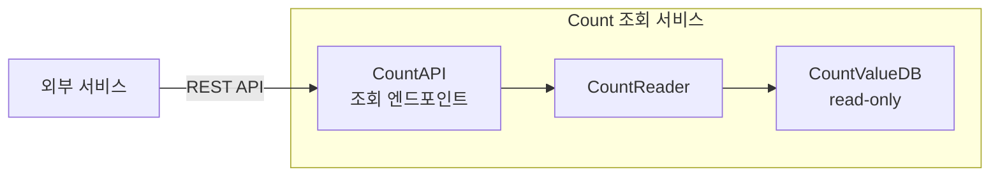

# CA-002: Count 조회 서비스 분할

## 개요

### 후보 구조 ID
CA-002

### 제목
Count 조회 서비스 분할

### 설명
UC-002 (Count 조회) 기능을 독립적인 마이크로서비스로 분할합니다. 외부 서비스가 Count 값을 조회하는 기능을 제공하는 독립적인 서비스입니다.

## 설계 결정

### 서비스 분할 결정
- **대상 Use Case**: UC-002 (Count 조회)
- **서비스명**: `count-read-service`
- **서비스 경계**: CountReader (Control), CountAPI의 조회 관련 엔드포인트 (Boundary)
- **데이터 소유권**: CountValueDB (Entity) - Count 값 데이터 (읽기 전용 또는 복제본)

### 전술 적용
- **Use Case 기반 서비스 분할**: UC-002를 독립 서비스로 분할
- **CQRS**: 읽기와 쓰기 분리
- **Read Replica**: CountValueDB의 읽기 전용 복제본 활용 (선택적)

## 서비스 구조

### 서비스 컴포넌트
- **CountAPI (조회 엔드포인트)**: 외부 서비스로부터 Count 조회 요청 수신
- **CountReader**: Count 값 조회 비즈니스 로직 처리
- **CountValueDB (read-only)**: Count 값 데이터 조회 (읽기 전용 복제본 또는 원본)

### 서비스 인터페이스
- **REST API**: 
  - `GET /api/v1/counts/{countId}` - Count 값 조회
  - `GET /api/v1/counts/{countId}/history` - Count 값 이력 조회

## 장점

### 서비스 독립성
- **QA-004 (Count 조회 서비스 독립성 최대화) 달성에 기여**
- Count 조회 서비스가 다른 서비스의 부하에 영향을 받지 않음
- Count 조회 서비스 변경 시 다른 서비스에 영향을 미치지 않음
- 독립적인 배포 및 스케일링 가능

### 성능 격리
- **QA-002 (Count 조회 응답 시간 최소화) 달성에 기여**
- Count 조회 작업이 다른 서비스(저장, 관리, 분석, 모니터링)의 성능에 영향을 미치지 않음
- Count 조회 서비스의 부하가 다른 서비스에 전파되지 않음
- 독립적인 성능 최적화 가능 (캐싱, 읽기 전용 복제본 등)

### 확장성
- Count 조회 트래픽에 맞춰 독립적으로 확장 가능
- 읽기 전용 복제본을 통한 수평 확장 가능
- **NFR-002 (Count 조회 응답 시간 < 100ms) 달성에 기여**

### CQRS 패턴 적용
- 읽기와 쓰기 작업의 독립적 최적화 가능
- 읽기 전용 복제본을 통한 읽기 성능 향상
- 쓰기 작업의 부하가 읽기 작업에 영향을 미치지 않음

## 단점 및 트레이드오프

### DB 공유 문제
- **문제**: CountValueDB를 다른 서비스(저장, 관리, 분석, 모니터링)와 공유하면 서비스 독립성이 저하됨
- **영향**: 
  - CountValueDB의 부하가 다른 서비스에 영향을 미칠 수 있음
  - CountValueDB의 장애가 다른 서비스에 영향을 미칠 수 있음
- **해결 방안**: CA-002A (CountValueDB read-only 복제본 for Count 조회 서비스)

### 데이터 불일치 문제
- **문제**: 읽기 전용 복제본을 사용하면 복제 지연으로 인한 데이터 불일치 가능
- **영향**: 
  - Count 저장 서비스에서 Count 값을 저장했지만, 조회 서비스에서 즉시 조회하지 못할 수 있음
  - Eventual Consistency 보장 필요
- **해결 방안**: 
  - CA-002A1 (비동기적 일치): Eventual Consistency 보장
  - CA-002A2 (동기적 일치): 즉시 일관성 보장 (원본 DB 직접 조회)

### 네트워크 오버헤드
- **문제**: 서비스 분할로 인해 네트워크 통신 오버헤드 발생
- **영향**: 
  - 서비스 간 통신으로 인한 지연 시간 증가 가능
- **해결 방안**: 서비스 간 통신 최적화, 캐싱 전술 적용

### 운영 복잡도 증가
- **문제**: 서비스 분할로 인해 운영 관리 복잡도 증가
- **영향**: 
  - 서비스 모니터링 및 로깅 관리 복잡도 증가
- **해결 방안**: 통합 모니터링 도구 활용

## 종속 후보 구조

### 선택적 종속
- **CA-002A**: CountValueDB read-only 복제본 for Count 조회 서비스 (DB 공유 문제 해결)
- **CA-002A1**: 비동기적 일치 (데이터 불일치 문제 해결 - Eventual Consistency)
- **CA-002A2**: 동기적 일치 (데이터 불일치 문제 해결 - 즉시 일관성)

## 관련 품질 요구사항

### 직접 관련
- **QA-004**: Count 조회 서비스 독립성 최대화 (우선순위 4)
- **QA-002**: Count 조회 응답 시간 최소화 (우선순위 2)
- **NFR-002**: Count 조회 응답 시간 < 100ms

### 간접 관련
- **QS-013**: Count 조회 서비스 독립성

## 관련 Use Case

- **UC-002**: Count 조회
- **UC-004**: Count 분석 (CountReader 활용)
- **UC-005**: Count 모니터링 (CountReader 활용)

## 비고

- Count 조회 서비스는 외부 서비스와의 통신을 위한 핵심 서비스로, 높은 가용성과 성능이 요구됨
- 읽기 작업이 많으므로 읽기 전용 복제본을 활용하여 성능을 향상시킬 수 있음
- CQRS 패턴을 적용하여 읽기와 쓰기의 독립적 최적화가 가능함
