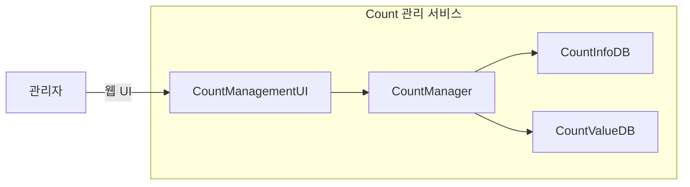

# CA-003: Count 관리 서비스 분할

## 개요

### 후보 구조 ID
CA-003

### 제목
Count 관리 서비스 분할

### 설명
UC-003 (Count 관리) 기능을 독립적인 마이크로서비스로 분할합니다. 관리자가 웹 UI를 통해 Count 데이터를 생성, 수정, 삭제하는 기능을 제공하는 독립적인 서비스입니다.

## 설계 결정

### 서비스 분할 결정
- **대상 Use Case**: UC-003 (Count 관리)
- **서비스명**: `count-management-service`
- **서비스 경계**: CountManager (Control), CountManagementUI (Boundary)
- **데이터 소유권**: CountInfoDB (Entity) - Count 메타데이터, CountValueDB (Entity) - Count 값 데이터

### 전술 적용
- **Use Case 기반 서비스 분할**: UC-003을 독립 서비스로 분할
- **Database per Service**: CountInfoDB를 Count 관리 서비스 전용으로 할당

## 서비스 구조

### 서비스 컴포넌트
- **CountManagementUI**: 관리자와의 Count 관리 웹 UI 인터페이스
- **CountManager**: Count 데이터 생성, 수정, 삭제 비즈니스 로직 처리
- **CountInfoDB**: Count 정보(메타데이터) 영속적 저장
- **CountValueDB**: Count 값 데이터 영속적 저장

### 서비스 인터페이스
- **웹 UI**: 
  - Count 생성 화면
  - Count 수정 화면
  - Count 삭제 화면
  - Count 목록 조회 화면

## 장점

### 서비스 독립성
- **QA-008 (Count 관리 서비스 독립성 최대화) 달성에 기여**
- Count 관리 서비스가 다른 서비스의 부하에 영향을 받지 않음
- Count 관리 서비스 변경 시 다른 서비스에 영향을 미치지 않음
- 독립적인 배포 및 스케일링 가능

### 성능 격리
- 관리자 UI 작업이 다른 서비스(저장, 조회, 분석, 모니터링)의 성능에 영향을 미치지 않음
- Count 관리 서비스의 부하가 다른 서비스에 전파되지 않음

### 확장성
- 관리자 UI 트래픽에 맞춰 독립적으로 확장 가능
- 다른 서비스와 독립적인 스케일링 정책 적용 가능

### 배포 독립성
- Count 관리 서비스만 독립적으로 배포 및 업데이트 가능
- UI 변경 시 다른 서비스에 영향을 미치지 않음

## 단점 및 트레이드오프

### DB 공유 문제
- **문제**: CountInfoDB와 CountValueDB를 다른 서비스와 공유하면 서비스 독립성이 저하됨
- **영향**: 
  - DB의 부하가 다른 서비스에 영향을 미칠 수 있음
  - DB의 장애가 다른 서비스에 영향을 미칠 수 있음
  - DB의 스키마 변경이 다른 서비스에 영향을 미칠 수 있음
- **해결 방안**: CA-003A (CountInfoDB for Count 관리 서비스), CA-003B (CountValueDB for Count 관리 서비스)

### 데이터 불일치 문제
- **문제**: CountInfoDB와 CountValueDB를 독립적으로 할당하면 다른 서비스에서 데이터 불일치 가능
- **영향**: 
  - Count 관리 서비스에서 Count를 생성했지만, 다른 서비스에서 즉시 조회하지 못할 수 있음
- **해결 방안**: 
  - CA-003A1 (비동기적 일치): Eventual Consistency 보장
  - CA-003A2 (동기적 일치): 즉시 일관성 보장

### 네트워크 오버헤드
- **문제**: 서비스 분할로 인해 네트워크 통신 오버헤드 발생
- **영향**: 
  - 서비스 간 통신으로 인한 지연 시간 증가 가능
- **해결 방안**: 서비스 간 통신 최적화

### 운영 복잡도 증가
- **문제**: 서비스 분할로 인해 운영 관리 복잡도 증가
- **영향**: 
  - 서비스 모니터링 및 로깅 관리 복잡도 증가
- **해결 방안**: 통합 모니터링 도구 활용

## 종속 후보 구조

### 선택적 종속
- **CA-003A**: CountInfoDB for Count 관리 서비스 (DB 공유 문제 해결)
- **CA-003B**: CountValueDB for Count 관리 서비스 (DB 공유 문제 해결)
- **CA-003A1**: 비동기적 일치 (데이터 불일치 문제 해결)
- **CA-003A2**: 동기적 일치 (데이터 불일치 문제 해결)

## 관련 품질 요구사항

### 직접 관련
- **QA-008**: Count 관리 서비스 독립성 최대화 (우선순위 8)
- **QA-007**: UI 변경 용이성 최대화 (우선순위 7)

### 간접 관련
- **QS-014**: Count 관리 서비스 독립성
- **QS-008**: UI 변경 용이성

## 관련 Use Case

- **UC-003**: Count 관리

## 비고

- Count 관리 서비스는 관리자 전용 서비스로, 외부 서비스와는 분리되어 있음
- UI 변경이 빈번할 수 있으므로 독립적인 서비스로 분할하여 UI 변경 용이성을 향상시킴
- 관리자 작업은 트래픽이 상대적으로 적으므로 독립적인 확장이 필요할 수 있음
