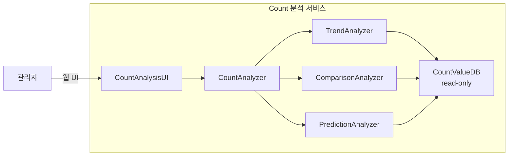

# CA-004: Count 분석 서비스 분할

## 개요

### 후보 구조 ID
CA-004

### 제목
Count 분석 서비스 분할

### 설명
UC-004 (Count 분석) 기능을 독립적인 마이크로서비스로 분할합니다. 관리자가 Count 데이터에 대한 다양한 분석 기능(트렌드 분석, 비교 분석, 예측 분석 등)을 수행하는 독립적인 서비스입니다.

## 설계 결정

### 서비스 분할 결정
- **대상 Use Case**: UC-004 (Count 분석)
- **서비스명**: `count-analysis-service`
- **서비스 경계**: CountAnalyzer (Control), TrendAnalyzer (Control), ComparisonAnalyzer (Control), PredictionAnalyzer (Control), CountAnalysisUI (Boundary)
- **데이터 소유권**: CountValueDB (Entity) - Count 값 데이터 (읽기 전용)

### 전술 적용
- **Use Case 기반 서비스 분할**: UC-004를 독립 서비스로 분할
- **Read Replica**: CountValueDB의 읽기 전용 복제본 활용 (선택적)

## 서비스 구조

### 서비스 컴포넌트
- **CountAnalysisUI**: 관리자와의 Count 분석 웹 UI 인터페이스
- **CountAnalyzer**: Count 분석 요청 처리 및 분석 유형별 컴포넌트로 위임
- **TrendAnalyzer**: 트렌드 분석 비즈니스 로직 처리
- **ComparisonAnalyzer**: 비교 분석 비즈니스 로직 처리
- **PredictionAnalyzer**: 예측 분석 비즈니스 로직 처리
- **CountValueDB (read-only)**: Count 값 데이터 조회 (읽기 전용 복제본 또는 원본)

### 서비스 인터페이스
- **웹 UI**: 
  - 트렌드 분석 화면
  - 비교 분석 화면
  - 예측 분석 화면
- **REST API** (선택적): 
  - `POST /api/v1/analysis/trend` - 트렌드 분석
  - `POST /api/v1/analysis/comparison` - 비교 분석
  - `POST /api/v1/analysis/prediction` - 예측 분석

## 장점

### 서비스 독립성
- **QA-009 (Count 분석 서비스 독립성 최대화) 달성에 기여**
- Count 분석 서비스가 다른 서비스의 부하에 영향을 받지 않음
- Count 분석 서비스 변경 시 다른 서비스에 영향을 미치지 않음
- 독립적인 배포 및 스케일링 가능

### 성능 격리
- 분석 작업이 다른 서비스(저장, 조회, 관리, 모니터링)의 성능에 영향을 미치지 않음
- Count 분석 서비스의 부하가 다른 서비스에 전파되지 않음
- 분석 작업은 CPU 집약적일 수 있으므로 독립적인 리소스 할당 가능

### 확장성
- 분석 트래픽에 맞춰 독립적으로 확장 가능
- 분석 작업은 배치 처리 가능하므로 비동기 처리 및 큐 시스템 활용 가능
- **QA-005 (분석 기능 추가 용이성 최대화) 달성에 기여**

### 변경 용이성
- **QA-005 (분석 기능 추가 용이성 최대화) 달성에 기여**
- 새로운 분석 기능 추가 시 다른 서비스에 영향을 미치지 않음
- 분석 알고리즘 변경 시 다른 서비스에 영향을 미치지 않음

## 단점 및 트레이드오프

### DB 공유 문제
- **문제**: CountValueDB를 다른 서비스와 공유하면 서비스 독립성이 저하됨
- **영향**: 
  - CountValueDB의 부하가 다른 서비스에 영향을 미칠 수 있음
  - 분석 작업은 대량의 데이터를 조회하므로 DB 부하가 높을 수 있음
- **해결 방안**: CA-004A (CountValueDB read-only 복제본 for Count 분석 서비스)

### 데이터 불일치 문제
- **문제**: 읽기 전용 복제본을 사용하면 복제 지연으로 인한 데이터 불일치 가능
- **영향**: 
  - 최신 데이터가 아닌 데이터로 분석할 수 있음
  - 분석 결과의 정확도에 영향을 미칠 수 있음
- **해결 방안**: 
  - CA-004A1 (비동기적 일치): Eventual Consistency 보장 (분석 작업은 허용 가능)
  - CA-004A2 (동기적 일치): 즉시 일관성 보장 (원본 DB 직접 조회)

### 네트워크 오버헤드
- **문제**: 서비스 분할로 인해 네트워크 통신 오버헤드 발생
- **영향**: 
  - 대량의 데이터 조회로 인한 네트워크 대역폭 사용량 증가
- **해결 방안**: 데이터 집계 및 필터링, 배치 처리

### 운영 복잡도 증가
- **문제**: 서비스 분할로 인해 운영 관리 복잡도 증가
- **영향**: 
  - 분석 작업 모니터링 및 로깅 관리 복잡도 증가
- **해결 방안**: 통합 모니터링 도구 활용

## 종속 후보 구조

### 선택적 종속
- **CA-004A**: CountValueDB read-only 복제본 for Count 분석 서비스 (DB 공유 문제 해결)
- **CA-004A1**: 비동기적 일치 (데이터 불일치 문제 해결 - Eventual Consistency)
- **CA-004A2**: 동기적 일치 (데이터 불일치 문제 해결 - 즉시 일관성)

## 관련 품질 요구사항

### 직접 관련
- **QA-009**: Count 분석 서비스 독립성 최대화 (우선순위 9)
- **QA-005**: 분석 기능 추가 용이성 최대화 (우선순위 5)

### 간접 관련
- **QS-015**: Count 분석 서비스 독립성
- **QS-009**: 분석 기능 추가 용이성

## 관련 Use Case

- **UC-004**: Count 분석
- **UC-005**: Count 모니터링 (CountAnalyzer 활용)

## 비고

- Count 분석 서비스는 관리자 전용 서비스로, 외부 서비스와는 분리되어 있음
- 분석 작업은 CPU 집약적일 수 있으므로 독립적인 리소스 할당 및 확장이 필요함
- 새로운 분석 기능 추가가 예상되므로 독립적인 서비스로 분할하여 변경 용이성을 향상시킴
- 분석 작업은 대량의 데이터를 조회하므로 읽기 전용 복제본을 활용하여 성능을 향상시킬 수 있음
