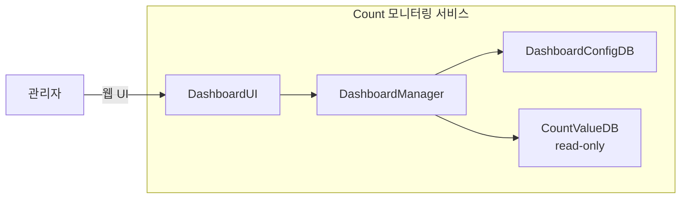

# CA-005: Count 모니터링 서비스 분할

## 개요

### 후보 구조 ID
CA-005

### 제목
Count 모니터링 서비스 분할

### 설명
UC-005 (Count 모니터링) 기능을 독립적인 마이크로서비스로 분할합니다. 관리자가 대시보드를 통해 Count 데이터를 모니터링하고 시각화된 정보를 확인하는 독립적인 서비스입니다.

## 설계 결정

### 서비스 분할 결정
- **대상 Use Case**: UC-005 (Count 모니터링)
- **서비스명**: `count-monitoring-service`
- **서비스 경계**: DashboardManager (Control), DashboardUI (Boundary)
- **데이터 소유권**: DashboardConfigDB (Entity) - 대시보드 구성 정보, CountValueDB (Entity) - Count 값 데이터 (읽기 전용)

### 전술 적용
- **Use Case 기반 서비스 분할**: UC-005를 독립 서비스로 분할
- **Read Replica**: CountValueDB의 읽기 전용 복제본 활용 (선택적)

## 서비스 구조

### 서비스 컴포넌트
- **DashboardUI**: 관리자와의 Count 모니터링 대시보드 웹 UI 인터페이스
- **DashboardManager**: Count 데이터 모니터링 비즈니스 로직 처리
- **DashboardConfigDB**: 대시보드 구성 정보 영속적 저장
- **CountValueDB (read-only)**: Count 값 데이터 조회 (읽기 전용 복제본 또는 원본)

### 서비스 인터페이스
- **웹 UI**: 
  - 대시보드 화면
  - 대시보드 편집 화면
  - 실시간 업데이트 기능

## 장점

### 서비스 독립성
- **QA-010 (Count 모니터링 서비스 독립성 최대화) 달성에 기여**
- Count 모니터링 서비스가 다른 서비스의 부하에 영향을 받지 않음
- Count 모니터링 서비스 변경 시 다른 서비스에 영향을 미치지 않음
- 독립적인 배포 및 스케일링 가능

### 성능 격리
- 모니터링 작업이 다른 서비스(저장, 조회, 관리, 분석)의 성능에 영향을 미치지 않음
- Count 모니터링 서비스의 부하가 다른 서비스에 전파되지 않음
- 실시간 업데이트 작업이 다른 서비스에 영향을 미치지 않음

### 확장성
- 모니터링 트래픽에 맞춰 독립적으로 확장 가능
- 실시간 업데이트 작업은 WebSocket 등을 활용하여 독립적으로 처리 가능
- **QA-006 (대시보드 기능 추가 용이성 최대화) 달성에 기여**

### 변경 용이성
- **QA-006 (대시보드 기능 추가 용이성 최대화) 달성에 기여**
- 새로운 대시보드 기능 추가 시 다른 서비스에 영향을 미치지 않음
- 대시보드 UI 변경 시 다른 서비스에 영향을 미치지 않음

## 단점 및 트레이드오프

### DB 공유 문제
- **문제**: CountValueDB와 DashboardConfigDB를 다른 서비스와 공유하면 서비스 독립성이 저하됨
- **영향**: 
  - DB의 부하가 다른 서비스에 영향을 미칠 수 있음
  - DB의 장애가 다른 서비스에 영향을 미칠 수 있음
- **해결 방안**: CA-005A (DashboardConfigDB for Count 모니터링 서비스), CA-005B (CountValueDB read-only 복제본 for Count 모니터링 서비스)

### 데이터 불일치 문제
- **문제**: 읽기 전용 복제본을 사용하면 복제 지연으로 인한 데이터 불일치 가능
- **영향**: 
  - 실시간 모니터링 시 최신 데이터가 아닌 데이터를 표시할 수 있음
  - **QA-011 (대시보드 갱신 시간 최소화) 달성에 영향을 미칠 수 있음**
- **해결 방안**: 
  - CA-005B1 (비동기적 일치): Eventual Consistency 보장
  - CA-005B2 (동기적 일치): 즉시 일관성 보장 (원본 DB 직접 조회)

### 네트워크 오버헤드
- **문제**: 서비스 분할로 인해 네트워크 통신 오버헤드 발생
- **영향**: 
  - 실시간 업데이트를 위한 주기적 데이터 조회로 인한 네트워크 대역폭 사용량 증가
- **해결 방안**: WebSocket 또는 Server-Sent Events를 활용한 효율적인 실시간 통신

### 운영 복잡도 증가
- **문제**: 서비스 분할로 인해 운영 관리 복잡도 증가
- **영향**: 
  - 서비스 모니터링 및 로깅 관리 복잡도 증가
- **해결 방안**: 통합 모니터링 도구 활용

## 종속 후보 구조

### 선택적 종속
- **CA-005A**: DashboardConfigDB for Count 모니터링 서비스 (DB 공유 문제 해결)
- **CA-005B**: CountValueDB read-only 복제본 for Count 모니터링 서비스 (DB 공유 문제 해결)
- **CA-005B1**: 비동기적 일치 (데이터 불일치 문제 해결 - Eventual Consistency)
- **CA-005B2**: 동기적 일치 (데이터 불일치 문제 해결 - 즉시 일관성)

## 관련 품질 요구사항

### 직접 관련
- **QA-010**: Count 모니터링 서비스 독립성 최대화 (우선순위 10)
- **QA-006**: 대시보드 기능 추가 용이성 최대화 (우선순위 6)
- **QA-011**: 대시보드 갱신 시간 최소화 (우선순위 11)
- **NFR-004**: 대시보드 로딩 시간 < 3초

### 간접 관련
- **QS-016**: Count 모니터링 서비스 독립성
- **QS-010**: 대시보드 기능 추가 용이성
- **QS-005**: 대시보드 갱신 시간

## 관련 Use Case

- **UC-005**: Count 모니터링

## 비고

- Count 모니터링 서비스는 관리자 전용 서비스로, 외부 서비스와는 분리되어 있음
- 대시보드 기능 고도화가 예상되므로 독립적인 서비스로 분할하여 변경 용이성을 향상시킴
- 실시간 모니터링 기능을 제공하므로 WebSocket 등을 활용한 효율적인 실시간 통신이 필요함
- 대시보드 구성 정보는 사용자별로 다를 수 있으므로 독립적인 DB를 할당하는 것이 좋음
