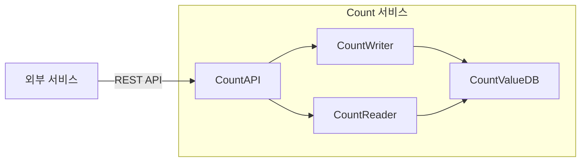

# CA-006: Count 저장/조회 서비스 통합

## 개요

### 후보 구조 ID
CA-006

### 제목
Count 저장/조회 서비스 통합

### 설명
CA-001 (Count 저장 서비스 분할)과 CA-002 (Count 조회 서비스 분할)의 대안으로, Count 저장과 조회 기능을 하나의 마이크로서비스로 통합합니다. 외부 서비스가 Count 값을 저장하고 조회하는 기능을 통합 제공하는 서비스입니다.

## 설계 결정

### 서비스 통합 결정
- **대상 Use Case**: UC-001 (Count 저장), UC-002 (Count 조회)
- **서비스명**: `count-service`
- **서비스 경계**: CountWriter (Control), CountReader (Control), CountAPI (Boundary)
- **데이터 소유권**: CountValueDB (Entity) - Count 값 데이터

### 전술 적용
- **Service Aggregation**: 여러 기능을 하나의 서비스로 통합
- **Shared Database**: CountValueDB를 저장과 조회가 공유

## 서비스 구조

### 서비스 컴포넌트
- **CountAPI**: 외부 서비스로부터 Count 저장/조회 요청 수신
- **CountWriter**: Count 값 저장 및 업데이트 비즈니스 로직 처리
- **CountReader**: Count 값 조회 비즈니스 로직 처리
- **CountValueDB**: Count 값 데이터 영속적 저장

### 서비스 인터페이스
- **REST API**: 
  - `POST /api/v1/counts/{countId}/increment` - Count 값 증가
  - `POST /api/v1/counts/{countId}/decrement` - Count 값 감소
  - `PUT /api/v1/counts/{countId}/value` - Count 값 설정
  - `GET /api/v1/counts/{countId}` - Count 값 조회
  - `GET /api/v1/counts/{countId}/history` - Count 값 이력 조회

## 장점

### 단순성
- 서비스 분할로 인한 복잡도 감소
- 네트워크 통신 오버헤드 감소
- 운영 관리 복잡도 감소

### 트랜잭션 일관성
- 저장과 조회가 동일한 DB를 사용하므로 데이터 일관성 보장 용이
- 즉시 일관성 보장 가능

### 낮은 네트워크 오버헤드
- 서비스 간 통신이 없으므로 네트워크 지연 시간 감소
- **QA-001 (Count 저장 응답 시간 최소화), QA-002 (Count 조회 응답 시간 최소화) 달성에 기여할 수 있음**

### 개발 생산성
- 단일 서비스로 개발 및 유지보수 용이
- 코드 중복 감소

## 단점 및 트레이드오프

### 서비스 독립성 저하
- **문제**: 저장과 조회가 통합되어 있어 서비스 독립성이 저하됨
- **영향**: 
  - Count 저장 작업의 부하가 Count 조회 작업에 영향을 미칠 수 있음
  - Count 조회 작업의 부하가 Count 저장 작업에 영향을 미칠 수 있음
  - **QA-003 (Count 저장 서비스 독립성 최대화), QA-004 (Count 조회 서비스 독립성 최대화) 달성에 부정적 영향**
- **해결 방안**: CA-001 (Count 저장 서비스 분할), CA-002 (Count 조회 서비스 분할)

### 확장성 제한
- **문제**: 저장과 조회가 통합되어 있어 독립적인 확장이 어려움
- **영향**: 
  - 저장 트래픽과 조회 트래픽의 확장 패턴이 다를 수 있음
  - 읽기 전용 복제본을 활용한 수평 확장이 어려움
- **해결 방안**: CA-001 (Count 저장 서비스 분할), CA-002 (Count 조회 서비스 분할)

### 성능 격리 부족
- **문제**: 저장과 조회가 통합되어 있어 성능 격리가 어려움
- **영향**: 
  - 저장 작업의 성능 저하가 조회 작업에 영향을 미칠 수 있음
  - 조회 작업의 성능 저하가 저장 작업에 영향을 미칠 수 있음
- **해결 방안**: CA-001 (Count 저장 서비스 분할), CA-002 (Count 조회 서비스 분할)

### 배포 독립성 부족
- **문제**: 저장과 조회가 통합되어 있어 독립적인 배포가 어려움
- **영향**: 
  - 저장 기능 변경 시 조회 기능도 함께 배포되어야 함
  - 조회 기능 변경 시 저장 기능도 함께 배포되어야 함
- **해결 방안**: CA-001 (Count 저장 서비스 분할), CA-002 (Count 조회 서비스 분할)

## 대안 후보 구조

이 후보 구조는 다음 후보 구조들의 대안입니다:
- **CA-001**: Count 저장 서비스 분할
- **CA-002**: Count 조회 서비스 분할

## 관련 품질 요구사항

### 직접 관련
- **QA-003**: Count 저장 서비스 독립성 최대화 (우선순위 3) - 부정적 영향
- **QA-004**: Count 조회 서비스 독립성 최대화 (우선순위 4) - 부정적 영향
- **QA-001**: Count 저장 응답 시간 최소화 (우선순위 1) - 긍정적 영향 가능
- **QA-002**: Count 조회 응답 시간 최소화 (우선순위 2) - 긍정적 영향 가능

### 간접 관련
- **QS-012**: Count 저장 서비스 독립성
- **QS-013**: Count 조회 서비스 독립성

## 관련 Use Case

- **UC-001**: Count 저장
- **UC-002**: Count 조회

## 비고

- 이 후보 구조는 CA-001과 CA-002의 대안으로, 서비스 통합을 통한 단순성을 추구함
- 서비스 독립성보다 단순성과 개발 생산성을 우선시하는 경우에 적합함
- 초기 단계에서는 이 구조를 채택하고, 이후 필요에 따라 CA-001과 CA-002로 분할할 수 있음
