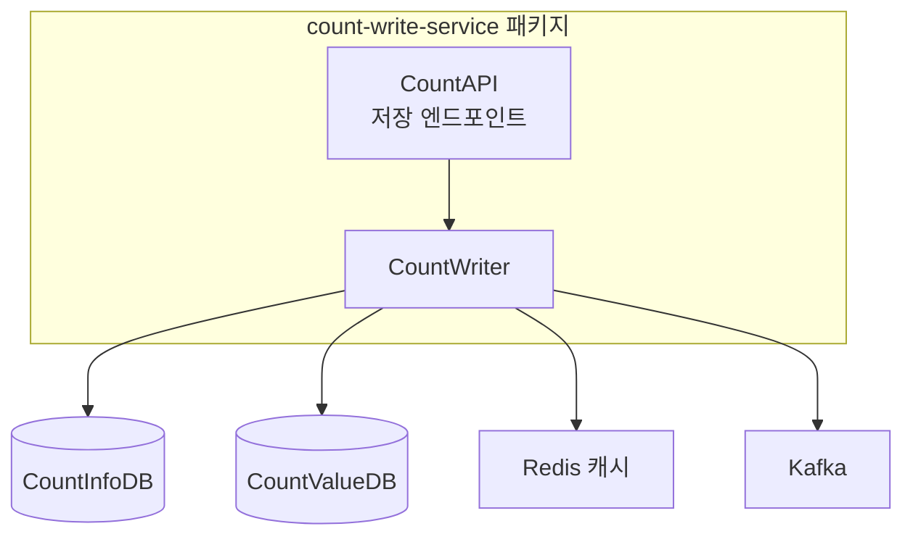

# CA-501: Count 저장 서비스 패키지 구성

## 개요

**후보 구조 ID**: CA-501  
**후보 구조 제목**: Count 저장 서비스 패키지 구성  
**설계 관점**: 배포 용이성 관점  
**부모 후보 구조**: 없음 (최상위)  
**종속 후보 구조**: 없음

## 후보 구조 명세

### 패키지 구성 결정

Count 저장 서비스 배치 단위에 배포되는 모듈을 `count-write-service` 패키지로 구성한다.

### 포함 모듈

- **CountAPI (저장 엔드포인트)**: 외부 서비스로부터 Count 저장 요청 수신 및 응답 반환
- **CountWriter**: Count 값 저장 및 업데이트 비즈니스 로직 처리

### 배치 단위 매핑

- **배치 단위**: count-write-service
- **관련 Use Case**: UC-001 (Count 저장)

## 설계 근거

### 배포 독립성

- 서비스별 독립적인 빌드 및 배포 가능
- Count 저장 기능의 응집도 향상
- 변경 영향 범위 제한

### 기능 응집도

- Count 저장 관련 모듈을 하나의 패키지로 그룹화
- 관련 기능의 응집도 향상

## 장점

1. **서비스별 독립적인 빌드 및 배포 가능**
   - count-write-service 패키지만 독립적으로 빌드 및 배포 가능
   - 다른 서비스에 영향을 주지 않고 변경 가능

2. **Count 저장 기능의 응집도 향상**
   - Count 저장 관련 모듈이 하나의 패키지에 모여 있어 이해하기 쉬움
   - 관련 기능을 함께 수정하기 쉬움

3. **변경 영향 범위 제한**
   - Count 저장 기능 변경 시 해당 패키지만 수정하면 됨
   - 다른 서비스에 영향을 주지 않음

## 단점 및 트레이드오프

1. **공통 모듈 중복 가능성**
   - 데이터베이스 접근, 캐시 접근 등 공통 모듈이 각 서비스에 중복될 수 있음
   - 중복 제거를 위해 공통 모듈 패키지(CA-508, CA-509 등)와 함께 사용 필요

2. **의존성 관리 복잡도**
   - 공통 모듈을 별도 라이브러리로 배포하거나 각 서비스에 포함해야 함
   - 의존성 관리가 복잡해질 수 있음

## 패키지 구조 다이어그램

## 의존성 규칙

- `count-write-service` 패키지는 공통 모듈 패키지(common-db, common-cache, common-messaging 등)를 의존할 수 있다.
- `count-write-service` 패키지는 다른 서비스 패키지를 의존하지 않는다.

## 관련 후보 구조

- **CA-502**: Count 조회 서비스 패키지 구성
- **CA-508**: 데이터베이스 접근 공통 모듈 패키지 구성
- **CA-509**: 캐시 접근 공통 모듈 패키지 구성
- **CA-510**: 메시징 공통 모듈 패키지 구성

## 평가 고려사항

이 후보 구조는 배포 용이성 관점에서 설계되었으며, 공통 모듈 관점(CA-507~CA-512) 및 레이어 관점(CA-513~CA-516)의 후보 구조와 함께 사용하여 완전한 패키지 구조를 구성할 수 있습니다.
