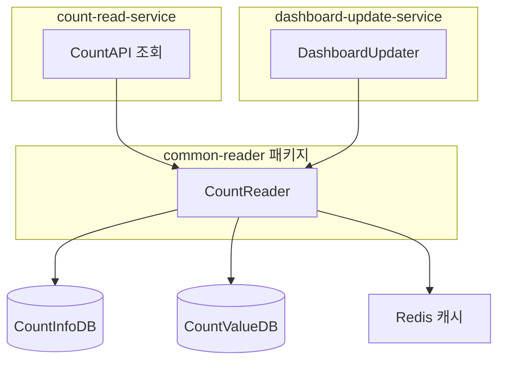

# CA-507: CountReader 공통 모듈 패키지 구성

## 개요

**후보 구조 ID**: CA-507  
**후보 구조 제목**: CountReader 공통 모듈 패키지 구성  
**설계 관점**: 공통 모듈 관점  
**부모 후보 구조**: 없음 (최상위)  
**종속 후보 구조**: CA-507A, CA-507B

## 후보 구조 명세

### 패키지 구성 결정

CountReader 모듈을 공통 모듈로 분리하여 `common-reader` 패키지로 구성한다.

### 포함 모듈

- **CountReader**: Count 값 조회 비즈니스 로직 처리

### 사용 배치 단위

- count-read-service
- dashboard-update-service

### 관련 Use Case

- UC-002 (Count 조회)
- UC-004 (Count 분석)
- UC-005 (Count 모니터링)

## 설계 근거

### 공통 모듈 분리

- count-read-service와 dashboard-update-service에서 공통 사용
- 중복 제거 및 재사용성 향상
- 변경 시 한 곳에서만 수정하면 됨

### 일관성 보장

- 일관된 조회 로직 보장
- 조회 로직 변경 시 모든 서비스에 일관되게 적용

## 장점

1. **중복 제거 및 재사용성 향상**
   - CountReader 모듈을 한 곳에서만 구현하면 됨
   - 여러 서비스에서 재사용 가능

2. **변경 시 한 곳에서만 수정**
   - CountReader 로직 변경 시 한 곳에서만 수정하면 됨
   - 모든 서비스에 일관되게 적용됨

3. **일관된 조회 로직 보장**
   - 모든 서비스에서 동일한 조회 로직 사용
   - 일관성 보장

## 단점 및 트레이드오프

1. **공통 모듈 배포 및 공유 방식 결정 필요**
   - 공통 모듈을 별도 라이브러리로 배포하거나 각 서비스에 포함해야 함
   - 배포 방식에 따라 의존성 관리가 달라짐

2. **공통 모듈 변경 시 여러 서비스에 영향**
   - 공통 모듈 변경 시 이를 사용하는 모든 서비스에 영향을 미칠 수 있음
   - 변경 시 신중한 검토 필요

3. **버전 관리 복잡도**
   - 공통 모듈의 버전 관리가 필요할 수 있음
   - 여러 서비스에서 다른 버전을 사용할 경우 호환성 문제 발생 가능

## 패키지 구조 다이어그램

## 의존성 규칙

### CA-507A: 공통 패키지 의존 가능

`common-reader` 패키지는 다른 공통 패키지(common-db, common-cache 등)를 의존할 수 있다.

**설계 근거**:
- CountReader는 데이터베이스 접근 및 캐시 접근이 필요함
- 공통 모듈 간 의존성은 허용하여 재사용성 향상

### CA-507B: 서비스별 패키지 의존 불가

`common-reader` 패키지는 서비스별 패키지(count-write-service, count-read-service 등)를 의존하지 않는다.

**설계 근거**:
- 공통 모듈은 서비스별 패키지를 의존하지 않아야 함
- 순환 의존성 방지 및 재사용성 보장

## 관련 후보 구조

- **CA-502**: Count 조회 서비스 패키지 구성
- **CA-506**: 대시보드 갱신 서비스 패키지 구성
- **CA-508**: 데이터베이스 접근 공통 모듈 패키지 구성
- **CA-509**: 캐시 접근 공통 모듈 패키지 구성

## 평가 고려사항

이 후보 구조는 공통 모듈 관점에서 설계되었으며, 배포 용이성 관점(CA-501~CA-506) 및 레이어 관점(CA-513~CA-516)의 후보 구조와 함께 사용하여 완전한 패키지 구조를 구성할 수 있습니다.

공통 모듈의 배포 및 공유 방식(별도 라이브러리 vs 각 서비스에 포함)에 대한 추가 설계 결정이 필요할 수 있습니다.
