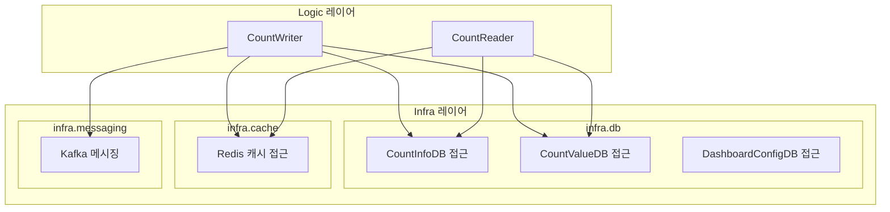

# CA-513: Infra 레이어 패키지 구성

## 개요

**후보 구조 ID**: CA-513  
**후보 구조 제목**: Infra 레이어 패키지 구성  
**설계 관점**: 레이어 관점  
**부모 후보 구조**: 없음 (최상위)  
**종속 후보 구조**: CA-513A, CA-513B, CA-513C, CA-513D

## 후보 구조 명세

### 패키지 구성 결정

인프라스트럭처 관련 모듈을 Infra 레이어로 구성한다.

### 세부 패키지 구성

#### CA-513A: infra.db 패키지 구성

데이터베이스 관련 모듈을 `infra.db` 패키지로 구성한다.

**포함 모듈**:
- CountInfoDB 접근 모듈
- CountValueDB 접근 모듈
- DashboardConfigDB 접근 모듈

#### CA-513B: infra.cache 패키지 구성

캐시 관련 모듈을 `infra.cache` 패키지로 구성한다.

**포함 모듈**:
- Redis 캐시 접근 모듈

#### CA-513C: infra.messaging 패키지 구성

메시징 관련 모듈을 `infra.messaging` 패키지로 구성한다.

**포함 모듈**:
- Kafka 메시징 모듈

## 설계 근거

### 기술 스택 의존성 격리

- 기술 스택 의존 모듈을 별도 레이어로 격리
- 기술 스택 변경 시 영향 범위 제한
- 레이어별 관심사 분리

### 관심사 분리

- 인프라스트럭처 관련 관심사를 명확히 분리
- 비즈니스 로직과 기술 구현의 분리

## 장점

1. **기술 스택 의존 모듈의 명확한 분리**
   - 데이터베이스, 캐시, 메시징 등 기술 스택 의존 모듈이 명확히 분리됨
   - 기술 스택 변경 시 영향 범위를 쉽게 파악 가능

2. **기술 스택 변경 시 영향 범위 제한**
   - 기술 스택 변경 시 Infra 레이어만 수정하면 됨
   - 비즈니스 로직 레이어에 영향을 주지 않음

3. **레이어별 관심사 분리**
   - 인프라스트럭처 관심사와 비즈니스 로직 관심사가 명확히 분리됨
   - 각 레이어의 책임이 명확함

## 단점 및 트레이드오프

1. **레이어 구조로 인한 복잡도 증가**
   - 레이어 구조로 인해 패키지 구조가 복잡해질 수 있음
   - 레이어 간 의존성 관리 필요

2. **추상화 필요성**
   - 기술 스택 변경 시 영향을 최소화하려면 추상화 인터페이스 필요
   - 추상화 설계가 복잡할 수 있음

## 패키지 구조 다이어그램



## 의존성 규칙

### CA-513D: 다른 레이어 의존 불가

Infra 레이어는 다른 레이어(Logic, API, UI)를 의존하지 않는다.

**설계 근거**:
- 인프라스트럭처 레이어는 가장 하위 레이어로, 다른 레이어를 의존하지 않아야 함
- 의존성 역전 원칙 준수
- 순환 의존성 방지

**의존성 방향**:
```
Infra 레이어 ← Logic 레이어 ← API/UI 레이어
```

## 관련 후보 구조

- **CA-514**: Logic 레이어 패키지 구성
- **CA-515**: API 레이어 패키지 구성
- **CA-516**: UI 레이어 패키지 구성
- **CA-508**: 데이터베이스 접근 공통 모듈 패키지 구성
- **CA-509**: 캐시 접근 공통 모듈 패키지 구성
- **CA-510**: 메시징 공통 모듈 패키지 구성

## 평가 고려사항

이 후보 구조는 레이어 관점에서 설계되었으며, 배포 용이성 관점(CA-501~CA-506) 및 공통 모듈 관점(CA-507~CA-512)의 후보 구조와 함께 사용하여 완전한 패키지 구조를 구성할 수 있습니다.

기술 스택 변경 시 영향을 최소화하려면 추상화 인터페이스를 도입하는 추가 설계 결정이 필요할 수 있습니다.
