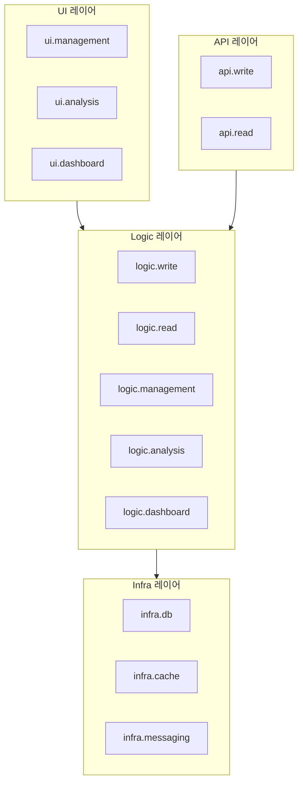

# CA-517: 전체 레이어 구조 통합

## 개요

**후보 구조 ID**: CA-517  
**후보 구조 제목**: 전체 레이어 구조 통합  
**설계 관점**: 레이어 관점  
**부모 후보 구조**: 없음 (최상위)  
**종속 후보 구조**: CA-517A, CA-517B, CA-517C, CA-517D, CA-517E

## 후보 구조 명세

### 패키지 구성 결정

CA-513 (Infra 레이어), CA-514 (Logic 레이어), CA-515 (API 레이어), CA-516 (UI 레이어)를 통합하여 전체 레이어 구조를 구성한다.

### 통합 레이어 구조

전체 시스템을 다음 레이어로 구성한다:

1. **Infra 레이어** (CA-513): 인프라스트럭처 관련 모듈
   - infra.db: 데이터베이스 접근 모듈
   - infra.cache: 캐시 접근 모듈
   - infra.messaging: 메시징 모듈

2. **Logic 레이어** (CA-514): 비즈니스 로직 관련 모듈
   - logic.write: Count 저장 로직
   - logic.read: Count 조회 로직
   - logic.management: Count 관리 로직
   - logic.analysis: Count 분석 로직
   - logic.dashboard: 대시보드 로직

3. **API 레이어** (CA-515): REST API 관련 모듈
   - api.write: Count 저장 API
   - api.read: Count 조회 API

4. **UI 레이어** (CA-516): 웹 UI 관련 모듈
   - ui.management: Count 관리 UI
   - ui.analysis: Count 분석 UI
   - ui.dashboard: 대시보드 UI

### 레이어 간 의존성 규칙

- **CA-517A**: Infra 레이어는 다른 레이어를 의존하지 않는다.
- **CA-517B**: Logic 레이어는 Infra 레이어만 의존한다.
- **CA-517C**: API 레이어는 Logic 레이어와 Infra 레이어를 의존한다.
- **CA-517D**: UI 레이어는 Logic 레이어와 Infra 레이어를 의존한다.
- **CA-517E**: 레이어 간 순환 의존성은 허용되지 않는다.

## 설계 근거

### 레이어별 관심사 분리

- 각 레이어가 명확한 책임을 가짐
- 레이어 간 의존성 방향이 명확함
- 변경 영향 범위를 레이어 단위로 제한 가능

### 기술 스택 변경 영향 최소화

- Infra 레이어로 기술 스택 의존성 격리
- 기술 스택 변경 시 Infra 레이어만 수정하면 됨

### 비즈니스 로직 보호

- Logic 레이어가 비즈니스 로직을 담당
- API/UI 레이어 변경이 비즈니스 로직에 영향을 주지 않음

## 장점

1. **명확한 레이어 구조**
   - 각 레이어의 역할과 책임이 명확함
   - 코드 구조 이해가 쉬움

2. **변경 영향 범위 제한**
   - 레이어별로 변경 영향 범위가 제한됨
   - 기술 스택 변경 시 Infra 레이어만 수정하면 됨

3. **테스트 용이성**
   - 각 레이어를 독립적으로 테스트 가능
   - Mock 객체를 통한 레이어 간 의존성 제어 가능

4. **재사용성 향상**
   - Logic 레이어를 여러 API/UI에서 재사용 가능
   - Infra 레이어를 여러 Logic 레이어에서 재사용 가능

## 단점 및 트레이드오프

1. **레이어 구조로 인한 복잡도 증가**
   - 패키지 구조가 복잡해질 수 있음
   - 레이어 간 의존성 관리 필요

2. **과도한 추상화 가능성**
   - 작은 프로젝트에서는 레이어 구조가 과도할 수 있음
   - 개발 생산성 저하 가능성

3. **성능 오버헤드**
   - 레이어 간 호출로 인한 성능 오버헤드 가능
   - 불필요한 레이어 통과 가능성

## 전체 레이어 구조 다이어그램



## 통합 소스 코드 폴더 구조

```
count-management-system/
├── infra/                # Infra 레이어 (CA-513)
│   ├── db/               # CA-513A: infra.db
│   ├── cache/            # CA-513B: infra.cache
│   └── messaging/        # CA-513C: infra.messaging
├── logic/                # Logic 레이어 (CA-514)
│   ├── write/            # CA-514A: logic.write
│   ├── read/             # CA-514B: logic.read
│   ├── management/       # CA-514C: logic.management
│   ├── analysis/         # CA-514D: logic.analysis
│   └── dashboard/        # CA-514E: logic.dashboard
├── api/                  # API 레이어 (CA-515)
│   ├── write/            # CA-515A: api.write
│   └── read/             # CA-515B: api.read
├── ui/                   # UI 레이어 (CA-516)
│   ├── management/       # CA-516A: ui.management
│   ├── analysis/         # CA-516B: ui.analysis
│   └── dashboard/        # CA-516C: ui.dashboard
└── service/              # 서비스별 빌드 및 배포 (CA-001~CA-006)
    ├── count-write-service/         # CA-001: count-write-service
    ├── count-read-service/          # CA-002: count-read-service
    ├── count-management-service/    # CA-003: count-management-service
    ├── count-analysis-service/      # CA-004: count-analysis-service
    ├── dashboard-provision-service/ # CA-005: count-provision-service
    └── dashboard-update-service/    # CA-006: count-update-service
```

각 레이어별 패키지 구조와 서비스별 빌드 디렉터리를 하나의 count-management-system 프로젝트 내에 통합한 구조입니다. Infra, Logic, API, UI 레이어 별로 하위 패키지가 명확히 구분되어 있고, service 디렉터리에서 서비스 단위로 배포/배치를 수행합니다.

## 의존성 규칙

### CA-517A: Infra 레이어 의존성 규칙

Infra 레이어는 다른 레이어(Logic, API, UI)를 의존하지 않는다.

**설계 근거**:
- Infra 레이어는 가장 하위 레이어로, 다른 레이어를 의존하지 않아야 함
- 의존성 역전 원칙 준수
- 순환 의존성 방지

### CA-517B: Logic 레이어 의존성 규칙

Logic 레이어는 Infra 레이어만 의존한다.

**설계 근거**:
- 비즈니스 로직은 인프라스트럭처에만 의존해야 함
- API/UI 레이어 변경이 비즈니스 로직에 영향을 주지 않음
- 비즈니스 로직의 재사용성 향상

### CA-517C: API 레이어 의존성 규칙

API 레이어는 Logic 레이어와 Infra 레이어를 의존한다.

**설계 근거**:
- API 레이어는 Logic 레이어의 비즈니스 로직을 호출
- 필요시 Infra 레이어를 직접 사용할 수 있음 (예: 인증/권한)
- UI 레이어를 의존하지 않아 API 독립성 보장

### CA-517D: UI 레이어 의존성 규칙

UI 레이어는 Logic 레이어와 Infra 레이어를 의존한다.

**설계 근거**:
- UI 레이어는 Logic 레이어의 비즈니스 로직을 호출
- 필요시 Infra 레이어를 직접 사용할 수 있음 (예: 인증/권한)
- API 레이어를 의존하지 않아 UI 독립성 보장

### CA-517E: 순환 의존성 방지 규칙

레이어 간 순환 의존성은 허용되지 않는다.

**설계 근거**:
- 순환 의존성은 코드 구조를 복잡하게 만듦
- 테스트 및 유지보수 어려움
- 의존성 방향 명확화

## 관련 후보 구조

- **CA-513**: Infra 레이어 패키지 구성
- **CA-514**: Logic 레이어 패키지 구성
- **CA-515**: API 레이어 패키지 구성
- **CA-516**: UI 레이어 패키지 구성
- **CA-501**: Count 저장 서비스 패키지 구성
- **CA-502**: Count 조회 서비스 패키지 구성
- **CA-503**: Count 관리 서비스 패키지 구성
- **CA-504**: Count 분석 서비스 패키지 구성
- **CA-505**: 대시보드 제공 서비스 패키지 구성
- **CA-506**: 대시보드 갱신 서비스 패키지 구성

## 평가 고려사항

이 후보 구조는 CA-513~CA-516의 레이어 구조를 통합하여 전체 시스템의 레이어 구조를 정의합니다. 각 서비스는 이 레이어 구조를 따르며, 서비스별로 필요한 레이어만 포함합니다.

- **count-write-service**: API 레이어 (api.write) + Logic 레이어 (logic.write) + Infra 레이어
- **count-read-service**: API 레이어 (api.read) + Logic 레이어 (logic.read) + Infra 레이어
- **count-management-service**: UI 레이어 (ui.management) + Logic 레이어 (logic.management) + Infra 레이어
- **count-analysis-service**: UI 레이어 (ui.analysis) + Logic 레이어 (logic.analysis) + Infra 레이어
- **dashboard-provision-service**: UI 레이어 (ui.dashboard) + Logic 레이어 (logic.dashboard) + Infra 레이어
- **dashboard-update-service**: Logic 레이어 (logic.dashboard) + Infra 레이어

이 구조는 배포 용이성 관점(CA-501~CA-506) 및 공통 모듈 관점(CA-507~CA-512)의 후보 구조와 함께 사용하여 완전한 패키지 구조를 구성할 수 있습니다.
