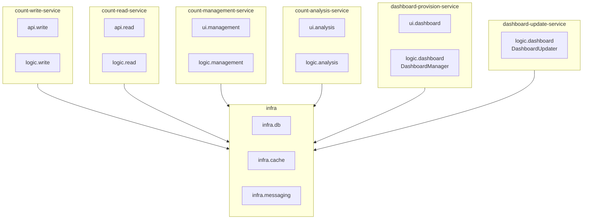

# CA-518: Infra 공통 + 서비스별 레이어 구조

## 개요

**후보 구조 ID**: CA-518  
**후보 구조 제목**: Infra 공통 + 서비스별 레이어 구조  
**설계 관점**: 배포 용이성 관점 + 레이어 관점  
**부모 후보 구조**: 없음 (최상위)  
**종속 후보 구조**: CA-518A, CA-518B, CA-518C, CA-518D, CA-518E

## 후보 구조 명세

### 패키지 구성 결정

Infra 레이어는 공통 모듈로 분리하고, Logic/API/UI 레이어는 각 서비스 내부에 포함하도록 구성한다.

### 패키지 구조 원칙

1. **Infra 레이어**: 공통 모듈로 분리
   - 모든 서비스에서 공통으로 사용되는 인프라스트럭처 모듈
   - 기술 스택 의존성 격리 및 재사용성 향상

2. **Logic/API/UI 레이어**: 서비스별로 구성
   - 각 서비스의 비즈니스 로직, API, UI를 서비스 내부에 포함
   - 서비스별 독립적인 빌드 및 배포 가능

### 공통 Infra 레이어 구성

**CA-518A**: Infra 레이어를 공통 모듈로 분리하여 `Infra` 패키지로 구성한다.

**포함 모듈**:
- infra.db: 데이터베이스 접근 모듈
- infra.cache: 캐시 접근 모듈
- infra.messaging: 메시징 모듈

**세부 패키지 구성**:
- `Infra.db`: CountInfoDB, CountValueDB, DashboardConfigDB 접근 모듈
- `Infra.cache`: Redis 캐시 접근 모듈
- `Infra.messaging`: Kafka 메시징 모듈

### 서비스별 레이어 구성

각 서비스는 필요한 Logic/API/UI 레이어를 내부에 포함한다.

#### CA-518B: Count 저장 서비스 레이어 구성

**패키지**: `count-write-service`

**포함 레이어**:
- **api.write**: Count 저장 API 레이어
- **logic.write**: Count 저장 로직 레이어
- **infra**: Infra 패키지 의존

#### CA-518C: Count 조회 서비스 레이어 구성

**패키지**: `count-read-service`

**포함 레이어**:
- **api.read**: Count 조회 API 레이어
- **logic.read**: Count 조회 로직 레이어
- **infra**: Infra 패키지 의존

#### CA-518D: Count 관리 서비스 레이어 구성

**패키지**: `count-management-service`

**포함 레이어**:
- **ui.management**: Count 관리 UI 레이어
- **logic.management**: Count 관리 로직 레이어
- **infra**: Infra 패키지 의존

#### CA-518E: Count 분석 서비스 레이어 구성

**패키지**: `count-analysis-service`

**포함 레이어**:
- **ui.analysis**: Count 분석 UI 레이어
- **logic.analysis**: Count 분석 로직 레이어
- **infra**: Infra 패키지 의존

#### CA-518F: 대시보드 제공 서비스 레이어 구성

**패키지**: `dashboard-provision-service`

**포함 레이어**:
- **ui.dashboard**: 대시보드 UI 레이어
- **logic.dashboard**: 대시보드 관리 로직 레이어
- **infra**: Infra 패키지 의존

#### CA-518G: 대시보드 갱신 서비스 레이어 구성

**패키지**: `dashboard-update-service`

**포함 레이어**:
- **logic.dashboard**: 대시보드 갱신 로직 레이어
- **infra**: Infra 패키지 의존

## 설계 근거

### Infra 공통 분리

- 기술 스택 의존성을 공통 모듈로 격리
- 기술 스택 변경 시 Infra만 수정하면 됨
- 여러 서비스에서 재사용 가능

### 서비스별 레이어 구성

- 서비스별 독립적인 빌드 및 배포 가능
- 서비스 내부의 레이어 구조로 관심사 분리
- 서비스별 변경 영향 범위 제한

### 레이어 구조 유지

- 각 서비스 내부에서 레이어 구조를 유지하여 관심사 분리
- Logic 레이어의 비즈니스 로직 보호
- API/UI 레이어 변경이 비즈니스 로직에 영향을 주지 않음

## 장점

1. **기술 스택 변경 영향 최소화**
   - Infra 레이어를 공통 모듈로 분리하여 기술 스택 변경 시 Infra만 수정하면 됨
   - 여러 서비스에 일관되게 적용 가능

2. **서비스별 독립성 보장**
   - 각 서비스가 독립적인 빌드 및 배포 가능
   - 서비스별 변경이 다른 서비스에 영향을 주지 않음

3. **레이어 구조의 이점 유지**
   - 각 서비스 내부에서 레이어 구조를 유지하여 관심사 분리
   - Logic 레이어의 비즈니스 로직 보호

4. **재사용성 향상**
   - Infra 레이어를 여러 서비스에서 재사용 가능
   - 공통 인프라 모듈의 중복 제거

## 단점 및 트레이드오프

1. **공통 모듈 의존성 관리**
   - Infra를 별도 라이브러리로 배포하거나 각 서비스에 포함해야 함
   - 공통 모듈 변경 시 여러 서비스에 영향을 미칠 수 있음

2. **서비스별 레이어 중복**
   - 각 서비스에서 유사한 레이어 구조가 중복될 수 있음
   - 레이어 구조의 일관성 유지 필요

3. **복잡도 증가**
   - 공통 모듈과 서비스별 레이어 구조로 인한 복잡도 증가
   - 의존성 관리가 복잡해질 수 있음

## 패키지 구조 다이어그램



## 소스 코드 폴더 구조

### 전체 프로젝트 구조

```
count-management-system/
├── infra/                          # CA-518A: 공통 Infra 레이어
│     ├── db/                       # infra.db
│     ├── cache/                    # infra.cache
│     └── messaging                 # infra.messaging
│
├── count-write-service/            # CA-518B: Count 저장 서비스
│     ├── api/                      # API 레이어
│     └── logic/                    # Logic 레이어
│
├── count-read-service/             # CA-518C: Count 조회 서비스
│     ├── api/                      # API 레이어
│     └── logic/                    # Logic 레이어
│
├── count-management-service/       # CA-518D: Count 관리 서비스
│     ├── ui/                       # UI 레이어
│     └── logic/                    # Logic 레이어
│
├── count-analysis-service/         # CA-518E: Count 분석 서비스
│     ├── ui/                       # UI 레이어
│     └── logic/                    # Logic 레이어
│
├── dashboard-provision-service/    # CA-518F: 대시보드 제공 서비스
│     ├── ui/                       # UI 레이어
│     └── logic/                    # Logic 레이어
│
└── dashboard-update-service/       # CA-518G: 대시보드 갱신 서비스
      └── logic/                    # Logic 레이어
```

## 의존성 규칙

### CA-518A: 공통 Infra 레이어 의존성 규칙

`Infra` 패키지는 다른 패키지를 의존하지 않는다.

**설계 근거**:
- 공통 Infra 레이어는 가장 하위 레이어로, 다른 패키지를 의존하지 않아야 함
- 의존성 역전 원칙 준수
- 순환 의존성 방지

### CA-518B~CA-518G: 서비스별 레이어 의존성 규칙

각 서비스의 레이어는 다음 의존성 규칙을 따른다:

1. **API 레이어**: Logic 레이어와 Infra 패키지를 의존한다.
2. **UI 레이어**: Logic 레이어와 Infra 패키지를 의존한다.
3. **Logic 레이어**: Infra 패키지만 의존한다.
4. **서비스 간 의존성**: 서비스 패키지는 다른 서비스 패키지를 의존하지 않는다.

**의존성 방향**:
```
Infra ← Logic 레이어 ← API/UI 레이어
```

## 관련 후보 구조

- **CA-517**: 전체 레이어 구조 통합
- **CA-501**: Count 저장 서비스 패키지 구성
- **CA-502**: Count 조회 서비스 패키지 구성
- **CA-503**: Count 관리 서비스 패키지 구성
- **CA-504**: Count 분석 서비스 패키지 구성
- **CA-505**: 대시보드 제공 서비스 패키지 구성
- **CA-506**: 대시보드 갱신 서비스 패키지 구성
- **CA-508**: 데이터베이스 접근 공통 모듈 패키지 구성
- **CA-509**: 캐시 접근 공통 모듈 패키지 구성
- **CA-510**: 메시징 공통 모듈 패키지 구성

## 평가 고려사항

이 후보 구조는 CA-517과 다른 접근 방식을 취합니다:

- **CA-517**: 모든 레이어를 독립적으로 구성 (Infra, Logic, API, UI 모두 독립)
- **CA-518**: Infra만 공통으로 분리하고, Logic/API/UI는 서비스별로 구성

CA-518의 장점:
- 서비스별 독립성 보장 (배포 용이성 관점)
- 기술 스택 변경 영향 최소화 (Infra 공통 분리)
- 서비스 내부 레이어 구조 유지 (관심사 분리)

CA-518의 단점:
- 공통 모듈 의존성 관리 필요
- 서비스별 레이어 구조 중복 가능성

이 구조는 배포 용이성 관점과 레이어 관점을 결합한 형태로, 마이크로서비스 아키텍처에서 적합한 패키지 구조를 제공합니다.
