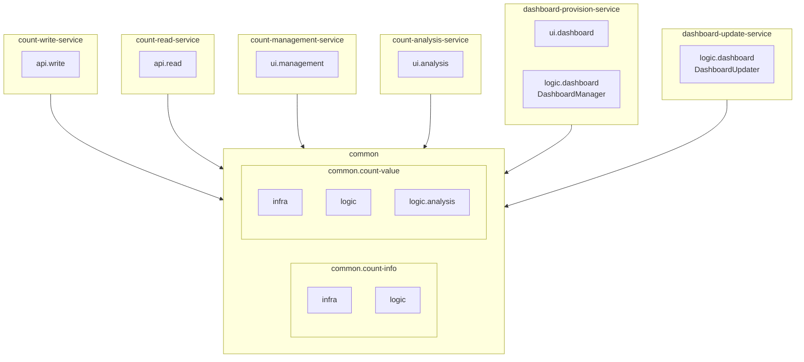

# CA-519: 도메인별 공통 모듈 구조

## 개요

**후보 구조 ID**: CA-519  
**후보 구조 제목**: 도메인별 공통 모듈 구조  
**설계 관점**: 배포 용이성 관점 + 도메인 관점 + 레이어 관점  
**부모 후보 구조**: 없음 (최상위)  
**종속 후보 구조**: CA-519A, CA-519B, CA-519C, CA-519D, CA-519E, CA-519F, CA-519G

## 후보 구조 명세

### 패키지 구성 결정

도메인별(CountInfo, CountValue)로 공통 모듈을 분리하고, 각 도메인 모듈은 infra와 logic을 포함한다. 서비스는 필요한 API/UI 레이어만 포함하고, 공통 모듈의 logic을 재사용한다.

### 패키지 구조 원칙

1. **도메인별 공통 모듈**: CountInfo, CountValue 도메인별로 공통 모듈 분리
   - 각 도메인 모듈은 infra와 logic을 포함
   - 여러 서비스에서 공통으로 사용되는 도메인 로직 재사용

2. **서비스별 API/UI 레이어**: 각 서비스는 API/UI 레이어만 포함
   - 서비스별 독립적인 빌드 및 배포 가능
   - 공통 모듈의 logic을 재사용하여 중복 제거

### 도메인별 공통 모듈 구성

#### CA-519A: CountInfo 도메인 공통 모듈 구성

**패키지**: `common.count-info`

**포함 모듈**:
- **infra**: CountInfoDB 접근 모듈
- **logic**: CountInfo 관련 비즈니스 로직 모듈

**세부 패키지 구성**:
- `common.count-info.infra`: CountInfoDB 접근 모듈 (Repository 인터페이스 및 구현체)
- `common.count-info.logic`: CountInfo CRUD 비즈니스 로직 모듈

**사용 서비스**:
- count-write-service
- count-read-service
- count-management-service
- count-analysis-service
- dashboard-provision-service
- dashboard-update-service

#### CA-519B: CountValue 도메인 공통 모듈 구성

**패키지**: `common.count-value`

**포함 모듈**:
- **infra**: CountValueDB 접근 모듈
- **logic**: CountValue 관련 비즈니스 로직 모듈
  - **analysis**: CountValue 분석 로직 모듈

**세부 패키지 구성**:
- `common.count-value.infra`: CountValueDB 접근 모듈 (Repository 인터페이스 및 구현체)
- `common.count-value.logic`: CountValue CRUD 비즈니스 로직 모듈
- `common.count-value.logic.analysis`: CountValue 분석 로직 모듈 (TrendAnalyzer, ComparisonAnalyzer, PredictionAnalyzer)

**사용 서비스**:
- count-write-service
- count-read-service
- count-management-service
- count-analysis-service
- dashboard-provision-service
- dashboard-update-service

### 서비스별 레이어 구성

각 서비스는 필요한 API/UI 레이어만 포함하고, 공통 모듈의 logic을 재사용한다.

#### CA-519C: Count 저장 서비스 레이어 구성

**패키지**: `count-write-service`

**포함 레이어**:
- **api.write**: Count 저장 API 레이어
- **공통 모듈 의존**: common.count-info, common.count-value

**설명**:
- API 레이어만 포함하고, 비즈니스 로직은 common.count-info.logic과 common.count-value.logic을 사용

#### CA-519D: Count 조회 서비스 레이어 구성

**패키지**: `count-read-service`

**포함 레이어**:
- **api.read**: Count 조회 API 레이어
- **공통 모듈 의존**: common.count-info, common.count-value

**설명**:
- API 레이어만 포함하고, 비즈니스 로직은 common.count-info.logic과 common.count-value.logic을 사용

#### CA-519E: Count 관리 서비스 레이어 구성

**패키지**: `count-management-service`

**포함 레이어**:
- **ui.management**: Count 관리 UI 레이어
- **공통 모듈 의존**: common.count-info, common.count-value

**설명**:
- UI 레이어만 포함하고, 비즈니스 로직은 common.count-info.logic과 common.count-value.logic을 사용

#### CA-519F: Count 분석 서비스 레이어 구성

**패키지**: `count-analysis-service`

**포함 레이어**:
- **ui.analysis**: Count 분석 UI 레이어
- **공통 모듈 의존**: common.count-value (analysis 로직 포함)

**설명**:
- UI 레이어만 포함하고, 분석 로직은 common.count-value.logic.analysis를 사용

#### CA-519G: 대시보드 제공 서비스 레이어 구성

**패키지**: `dashboard-provision-service`

**포함 레이어**:
- **ui.dashboard**: 대시보드 UI 레이어
- **logic.dashboard**: 대시보드 관리 로직 레이어 (대시보드 구성 관리)
- **공통 모듈 의존**: common.count-info, common.count-value

**설명**:
- UI 레이어와 대시보드 관리 로직만 포함하고, Count 관련 로직은 공통 모듈을 사용

#### CA-519H: 대시보드 갱신 서비스 레이어 구성

**패키지**: `dashboard-update-service`

**포함 레이어**:
- **logic.dashboard**: 대시보드 갱신 로직 레이어 (실시간 갱신)
- **공통 모듈 의존**: common.count-value

**설명**:
- 대시보드 갱신 로직만 포함하고, Count 관련 로직은 common.count-value.logic을 사용

## 설계 근거

### 도메인별 공통 모듈 분리

- CountInfo와 CountValue를 도메인별로 분리하여 각 도메인의 응집도 향상
- 각 도메인 모듈이 infra와 logic을 포함하여 도메인별 완전한 기능 제공
- 여러 서비스에서 공통으로 사용되는 도메인 로직 재사용

### 서비스별 API/UI 레이어 구성

- 각 서비스는 API/UI 레이어만 포함하여 서비스별 독립성 보장
- 공통 모듈의 logic을 재사용하여 중복 제거
- 서비스별 독립적인 빌드 및 배포 가능

### 레이어 구조 유지

- 공통 모듈 내부에서 infra와 logic 레이어 구조 유지
- 서비스 내부에서 API/UI 레이어 구조 유지
- 관심사 분리 및 의존성 방향 명확화

## 장점

1. **도메인별 응집도 향상**
   - CountInfo와 CountValue를 도메인별로 분리하여 각 도메인의 응집도 향상
   - 도메인별 변경 시 영향 범위 제한

2. **공통 로직 재사용**
   - 여러 서비스에서 공통으로 사용되는 도메인 로직을 공통 모듈로 재사용
   - 중복 제거 및 일관성 보장

3. **서비스별 독립성 보장**
   - 각 서비스가 API/UI 레이어만 포함하여 서비스별 독립성 보장
   - 서비스별 독립적인 빌드 및 배포 가능

4. **변경 영향 범위 제한**
   - 도메인별 공통 모듈로 변경 시 영향 범위 제한
   - 서비스별 변경이 다른 서비스에 영향을 주지 않음

## 단점 및 트레이드오프

1. **공통 모듈 의존성 관리**
   - 공통 모듈을 별도 라이브러리로 배포하거나 각 서비스에 포함해야 함
   - 공통 모듈 변경 시 여러 서비스에 영향을 미칠 수 있음

2. **도메인 간 의존성 관리**
   - CountInfo와 CountValue 간 의존성이 있을 경우 관리 필요
   - 순환 의존성 방지 필요

3. **복잡도 증가**
   - 도메인별 공통 모듈과 서비스별 레이어 구조로 인한 복잡도 증가
   - 의존성 관리가 복잡해질 수 있음

## 패키지 구조 다이어그램



## 소스 코드 폴더 구조

### 전체 프로젝트 구조

```
count-management-system/
├── common/                          # CA-519A, CA-519B: 도메인별 공통 모듈
│   ├── count-info/                  # CA-519A: CountInfo 도메인 공통 모듈
│   │   ├── infra/                   # infra 레이어
│   │   └── logic/                   # logic 레이어
│   │
│   └── count-value/                 # CA-519B: CountValue 도메인 공통 모듈
│       ├── infra/                   # infra 레이어
│       └── logic/                   # logic 레이어
│           └── analysis/            # analysis 로직
│
├── count-write-service/              # CA-519C: Count 저장 서비스
│   └── api/                          # API 레이어
│
├── count-read-service/               # CA-519D: Count 조회 서비스
│   └── api/                          # API 레이어
│
├── count-management-service/         # CA-519E: Count 관리 서비스
│   └── ui/                           # UI 레이어
│
├── count-analysis-service/           # CA-519F: Count 분석 서비스
│   └── ui/                           # UI 레이어
│
├── dashboard-provision-service/      # CA-519G: 대시보드 제공 서비스
│   ├── ui/                           # UI 레이어
│   └── logic/                        # Logic 레이어 (대시보드 관리)
│
└── dashboard-update-service/         # CA-519H: 대시보드 갱신 서비스
    └── logic/                        # Logic 레이어 (대시보드 갱신)
```

## 의존성 규칙

### CA-519A, CA-519B: 도메인별 공통 모듈 의존성 규칙

각 도메인 공통 모듈은 다음 의존성 규칙을 따른다:

1. **infra 레이어**: 다른 패키지를 의존하지 않는다.
2. **logic 레이어**: 같은 도메인의 infra 레이어만 의존한다.
3. **logic.analysis**: 같은 도메인의 logic 레이어를 의존할 수 있다.
4. **도메인 간 의존성**: CountInfo와 CountValue 도메인 간 순환 의존성은 허용되지 않는다.

**의존성 방향**:
```
infra ← logic ← logic.analysis
```

### CA-519C~CA-519H: 서비스별 레이어 의존성 규칙

각 서비스의 레이어는 다음 의존성 규칙을 따른다:

1. **API 레이어**: 공통 모듈의 logic 레이어를 의존한다.
2. **UI 레이어**: 공통 모듈의 logic 레이어를 의존한다.
3. **서비스별 logic 레이어**: 공통 모듈의 logic 레이어를 의존할 수 있다.
4. **서비스 간 의존성**: 서비스 패키지는 다른 서비스 패키지를 의존하지 않는다.

**의존성 방향**:
```
common.count-info.logic ← API/UI 레이어
common.count-value.logic ← API/UI 레이어
```

## 관련 후보 구조

- **CA-518**: Infra 공통 + 서비스별 레이어 구조
- **CA-517**: 전체 레이어 구조 통합
- **CA-501**: Count 저장 서비스 패키지 구성
- **CA-502**: Count 조회 서비스 패키지 구성
- **CA-503**: Count 관리 서비스 패키지 구성
- **CA-504**: Count 분석 서비스 패키지 구성
- **CA-505**: 대시보드 제공 서비스 패키지 구성
- **CA-506**: 대시보드 갱신 서비스 패키지 구성

## 평가 고려사항

이 후보 구조는 CA-518과 다른 접근 방식을 취합니다:

- **CA-518**: Infra만 공통으로 분리하고, Logic/API/UI는 서비스별로 구성
- **CA-519**: 도메인별(CountInfo, CountValue)로 공통 모듈을 분리하고, 각 도메인 모듈은 infra와 logic을 포함. 서비스는 API/UI 레이어만 포함

CA-519의 장점:
- 도메인별 응집도 향상
- 공통 로직 재사용
- 서비스별 독립성 보장
- 변경 영향 범위 제한

CA-519의 단점:
- 공통 모듈 의존성 관리 필요
- 도메인 간 의존성 관리 필요
- 복잡도 증가

이 구조는 도메인 관점과 레이어 관점을 결합한 형태로, 도메인 주도 설계(DDD) 접근 방식과 유사한 패키지 구조를 제공합니다.
