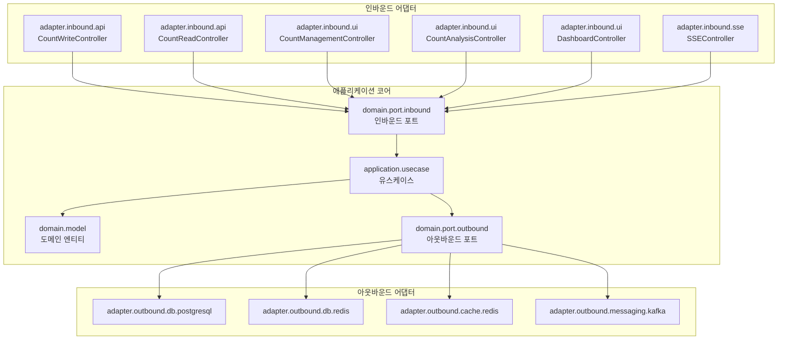

# CA-520: 헥사고날 아키텍처 구조

## 개요

**후보 구조 ID**: CA-520  
**후보 구조 제목**: 헥사고날 아키텍처 구조  
**설계 관점**: 아키텍처 패턴 관점 (포트 앤 어댑터 패턴)  
**부모 후보 구조**: 없음 (최상위)  
**종속 후보 구조**: CA-520A, CA-520B, CA-520C, CA-520D, CA-520E, CA-520F, CA-520G

## 후보 구조 명세

### 패키지 구성 결정

헥사고날 아키텍처(포트 앤 어댑터 패턴)를 적용하여 애플리케이션 코어와 어댑터를 분리한다.

### 헥사고날 아키텍처 원칙

1. **애플리케이션 코어**: 비즈니스 로직과 도메인 모델
   - 외부 의존성 없이 독립적으로 동작 가능
   - 포트를 통해 외부와 통신

2. **포트(Port)**: 인터페이스
   - **인바운드 포트**: 애플리케이션 코어가 제공하는 인터페이스 (유스케이스)
   - **아웃바운드 포트**: 애플리케이션 코어가 필요로 하는 인터페이스 (Repository, 외부 서비스)

3. **어댑터(Adapter)**: 포트의 구현체
   - **인바운드 어댑터**: API 컨트롤러, UI 컨트롤러
   - **아웃바운드 어댑터**: DB 어댑터, 캐시 어댑터, 메시징 어댑터

### 애플리케이션 코어 구성

#### CA-520A: 애플리케이션 코어 구성

**패키지**: `application.core` 또는 `domain`

**포함 모듈**:
- **도메인 모델**: CountInfo, CountValue 엔티티
- **유스케이스**: Count 저장, 조회, 관리, 분석, 모니터링 유스케이스
- **포트 인터페이스**: 인바운드 포트(유스케이스 인터페이스), 아웃바운드 포트(Repository 인터페이스)

**세부 패키지 구성**:
- `domain.model`: 도메인 엔티티 (CountInfo, CountValue)
- `domain.port.inbound`: 인바운드 포트 인터페이스 (유스케이스 인터페이스)
- `domain.port.outbound`: 아웃바운드 포트 인터페이스 (Repository 인터페이스)
- `application.usecase`: 유스케이스 구현체

### 인바운드 어댑터 구성

#### CA-520B: Count 저장 서비스 인바운드 어댑터 구성

**패키지**: `count-write-service`

**포함 모듈**:
- **인바운드 어댑터**: REST API 컨트롤러
- **애플리케이션 코어 의존**: domain.port.inbound

**세부 패키지 구성**:
- `adapter.inbound.api`: REST API 어댑터 (CountWriteController)

#### CA-520C: Count 조회 서비스 인바운드 어댑터 구성

**패키지**: `count-read-service`

**포함 모듈**:
- **인바운드 어댑터**: REST API 컨트롤러
- **애플리케이션 코어 의존**: domain.port.inbound

**세부 패키지 구성**:
- `adapter.inbound.api`: REST API 어댑터 (CountReadController)

#### CA-520D: Count 관리 서비스 인바운드 어댑터 구성

**패키지**: `count-management-service`

**포함 모듈**:
- **인바운드 어댑터**: 웹 UI 컨트롤러
- **애플리케이션 코어 의존**: domain.port.inbound

**세부 패키지 구성**:
- `adapter.inbound.ui`: 웹 UI 어댑터 (CountManagementController)

#### CA-520E: Count 분석 서비스 인바운드 어댑터 구성

**패키지**: `count-analysis-service`

**포함 모듈**:
- **인바운드 어댑터**: 웹 UI 컨트롤러
- **애플리케이션 코어 의존**: domain.port.inbound

**세부 패키지 구성**:
- `adapter.inbound.ui`: 웹 UI 어댑터 (CountAnalysisController)

#### CA-520F: 대시보드 제공 서비스 인바운드 어댑터 구성

**패키지**: `dashboard-provision-service`

**포함 모듈**:
- **인바운드 어댑터**: 웹 UI 컨트롤러
- **애플리케이션 코어 의존**: domain.port.inbound

**세부 패키지 구성**:
- `adapter.inbound.ui`: 웹 UI 어댑터 (DashboardController)

#### CA-520G: 대시보드 갱신 서비스 인바운드 어댑터 구성

**패키지**: `dashboard-update-service`

**포함 모듈**:
- **인바운드 어댑터**: SSE 컨트롤러
- **애플리케이션 코어 의존**: domain.port.inbound

**세부 패키지 구성**:
- `adapter.inbound.sse`: SSE 어댑터 (SSEController)

### 아웃바운드 어댑터 구성

#### CA-520H: 데이터베이스 아웃바운드 어댑터 구성

**패키지**: `adapter.outbound.db`

**포함 모듈**:
- **아웃바운드 어댑터**: 데이터베이스 어댑터
- **포트 구현**: domain.port.outbound.Repository 인터페이스 구현

**세부 패키지 구성**:
- `adapter.outbound.db.postgresql`: PostgreSQL 어댑터 (CountInfoRepository, DashboardConfigRepository)
- `adapter.outbound.db.redis`: Redis 어댑터 (CountValueRepository)

#### CA-520I: 캐시 아웃바운드 어댑터 구성

**패키지**: `adapter.outbound.cache`

**포함 모듈**:
- **아웃바운드 어댑터**: 캐시 어댑터
- **포트 구현**: domain.port.outbound.Cache 인터페이스 구현

**세부 패키지 구성**:
- `adapter.outbound.cache.redis`: Redis 캐시 어댑터

#### CA-520J: 메시징 아웃바운드 어댑터 구성

**패키지**: `adapter.outbound.messaging`

**포함 모듈**:
- **아웃바운드 어댑터**: 메시징 어댑터
- **포트 구현**: domain.port.outbound.MessagePublisher 인터페이스 구현

**세부 패키지 구성**:
- `adapter.outbound.messaging.kafka`: Kafka 메시징 어댑터

## 설계 근거

### 애플리케이션 코어 독립성

- 애플리케이션 코어가 외부 의존성 없이 독립적으로 동작 가능
- 비즈니스 로직과 기술 구현의 완전한 분리
- 테스트 용이성 향상

### 포트 앤 어댑터 패턴

- 포트를 통한 명확한 인터페이스 정의
- 어댑터 교체를 통한 기술 스택 변경 용이
- 의존성 역전 원칙 준수

### 관심사 분리

- 인바운드 어댑터: 외부 요청을 애플리케이션 코어로 전달
- 아웃바운드 어댑터: 애플리케이션 코어의 요청을 외부 시스템으로 전달
- 애플리케이션 코어: 비즈니스 로직만 담당

## 장점

1. **기술 스택 독립성**
   - 애플리케이션 코어가 기술 스택에 독립적
   - 어댑터 교체를 통한 기술 스택 변경 용이

2. **테스트 용이성**
   - 애플리케이션 코어를 Mock 어댑터로 독립적으로 테스트 가능
   - 비즈니스 로직 테스트와 기술 구현 테스트 분리

3. **변경 영향 범위 제한**
   - 기술 스택 변경 시 해당 어댑터만 수정하면 됨
   - 비즈니스 로직 변경이 기술 구현에 영향을 주지 않음

4. **재사용성 향상**
   - 애플리케이션 코어를 다양한 어댑터와 조합하여 재사용 가능
   - 여러 인터페이스(API, UI)에서 동일한 비즈니스 로직 사용

## 단점 및 트레이드오프

1. **복잡도 증가**
   - 포트와 어댑터 구조로 인한 복잡도 증가
   - 작은 프로젝트에서는 과도할 수 있음

2. **성능 오버헤드**
   - 어댑터 레이어를 통한 호출로 인한 성능 오버헤드 가능
   - 불필요한 추상화 레이어 가능성

3. **학습 곡선**
   - 헥사고날 아키텍처 패턴에 대한 이해 필요
   - 팀원들의 학습 비용 증가

## 패키지 구조 다이어그램



## 소스 코드 폴더 구조

### 전체 프로젝트 구조

```
count-management-system/
├── domain/                          # CA-520A: 애플리케이션 코어
│   ├── model/                       # 도메인 모델
│   ├── port/
│   │   ├── inbound/                 # 인바운드 포트 인터페이스
│   │   └── outbound/                # 아웃바운드 포트 인터페이스
│   └── application/
│       └── usecase/                  # 유스케이스 구현체
│
├── adapter/
│   ├── inbound/                     # 인바운드 어댑터
│   │   ├── api/                     # REST API 어댑터
│   │   │   ├── count-write-service/
│   │   │   └── count-read-service/
│   │   ├── ui/                      # 웹 UI 어댑터
│   │   │   ├── count-management-service/
│   │   │   ├── count-analysis-service/
│   │   │   └── dashboard-provision-service/
│   │   └── sse/                     # SSE 어댑터
│   │       └── dashboard-update-service/
│   │
│   └── outbound/                    # 아웃바운드 어댑터
│       ├── db/                      # 데이터베이스 어댑터
│       ├── cache/                   # 캐시 어댑터
│       └── messaging/               # 메시징 어댑터
│
├── count-write-service/             # CA-520B: Count 저장 서비스
│   └── (adapter.inbound.api 사용)
│
├── count-read-service/              # CA-520C: Count 조회 서비스
│   └── (adapter.inbound.api 사용)
│
├── count-management-service/        # CA-520D: Count 관리 서비스
│   └── (adapter.inbound.ui 사용)
│
├── count-analysis-service/          # CA-520E: Count 분석 서비스
│   └── (adapter.inbound.ui 사용)
│
├── dashboard-provision-service/     # CA-520F: 대시보드 제공 서비스
│   └── (adapter.inbound.ui 사용)
│
└── dashboard-update-service/        # CA-520G: 대시보드 갱신 서비스
    └── (adapter.inbound.sse 사용)
```

## 의존성 규칙

### CA-520A: 애플리케이션 코어 의존성 규칙

애플리케이션 코어(`domain`)는 다른 패키지를 의존하지 않는다.

**설계 근거**:
- 애플리케이션 코어는 외부 의존성 없이 독립적으로 동작해야 함
- 포트 인터페이스만 정의하고 구현체는 어댑터에서 제공
- 의존성 역전 원칙 준수

### CA-520B~CA-520G: 인바운드 어댑터 의존성 규칙

인바운드 어댑터는 애플리케이션 코어의 인바운드 포트를 의존한다.

**설계 근거**:
- 인바운드 어댑터는 애플리케이션 코어의 유스케이스를 호출
- 아웃바운드 포트나 아웃바운드 어댑터를 직접 의존하지 않음

### CA-520H~CA-520J: 아웃바운드 어댑터 의존성 규칙

아웃바운드 어댑터는 애플리케이션 코어의 아웃바운드 포트를 구현한다.

**설계 근거**:
- 아웃바운드 어댑터는 포트 인터페이스를 구현
- 애플리케이션 코어는 아웃바운드 포트를 통해 아웃바운드 어댑터를 사용

**의존성 방향**:
```
인바운드 어댑터 → 애플리케이션 코어 (인바운드 포트)
애플리케이션 코어 → 아웃바운드 포트 (인터페이스)
아웃바운드 어댑터 → 아웃바운드 포트 (구현)
```

## 관련 후보 구조

- **CA-517**: 전체 레이어 구조 통합
- **CA-518**: Infra 공통 + 서비스별 레이어 구조
- **CA-519**: 도메인별 공통 모듈 구조
- **CA-501**: Count 저장 서비스 패키지 구성
- **CA-502**: Count 조회 서비스 패키지 구성

## 평가 고려사항

이 후보 구조는 헥사고날 아키텍처(포트 앤 어댑터 패턴)를 적용한 구조입니다.

**헥사고날 아키텍처의 특징**:
- 애플리케이션 코어의 완전한 독립성
- 포트를 통한 명확한 인터페이스 정의
- 어댑터 교체를 통한 기술 스택 변경 용이

**적용 시나리오**:
- 기술 스택 변경이 빈번한 경우
- 다양한 인터페이스(API, UI, CLI 등)를 지원해야 하는 경우
- 비즈니스 로직의 독립성을 최대한 보장해야 하는 경우

**주의사항**:
- 복잡도 증가로 인한 개발 생산성 저하 가능성
- 작은 프로젝트에서는 과도할 수 있음
- 팀원들의 헥사고날 아키텍처 패턴 이해 필요
