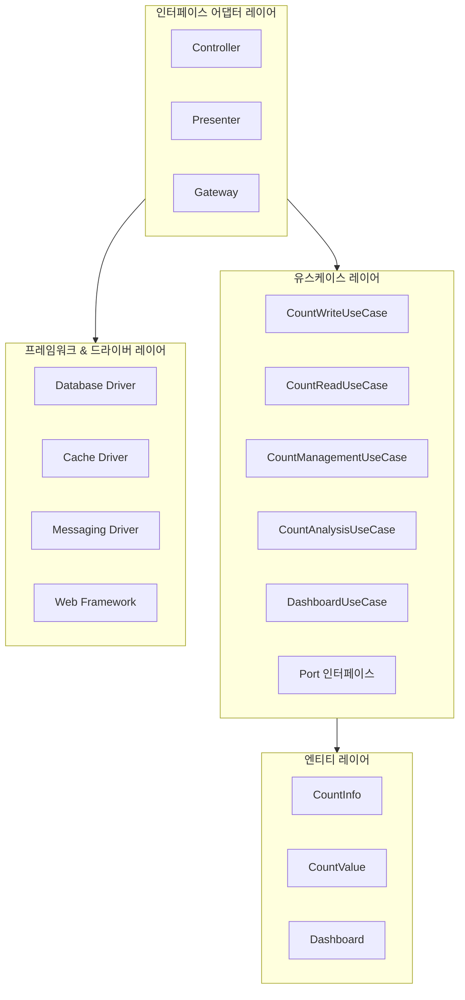

# CA-521: 클린 아키텍처 구조

## 개요

**후보 구조 ID**: CA-521  
**후보 구조 제목**: 클린 아키텍처 구조  
**설계 관점**: 아키텍처 패턴 관점 (클린 아키텍처)  
**부모 후보 구조**: 없음 (최상위)  
**종속 후보 구조**: CA-521A, CA-521B, CA-521C, CA-521D, CA-521E, CA-521F, CA-521G

## 후보 구조 명세

### 패키지 구성 결정

클린 아키텍처를 적용하여 의존성 방향을 안쪽으로 향하도록 구성한다.

### 클린 아키텍처 원칙

1. **엔티티(Entity)**: 가장 안쪽 레이어, 도메인 엔티티
   - 비즈니스 규칙을 포함하는 핵심 엔티티
   - 다른 레이어에 의존하지 않음

2. **유스케이스(Use Case)**: 엔티티 레이어 외부
   - 애플리케이션별 비즈니스 로직
   - 엔티티 레이어만 의존

3. **인터페이스 어댑터(Interface Adapter)**: 유스케이스 레이어 외부
   - 컨트롤러: 외부 요청을 유스케이스로 변환
   - 프레젠터: 유스케이스 결과를 외부 형식으로 변환
   - 게이트웨이: 유스케이스가 필요로 하는 인터페이스 구현

4. **프레임워크 & 드라이버(Framework & Driver)**: 가장 바깥쪽 레이어
   - 데이터베이스, 웹 프레임워크 등 외부 프레임워크
   - 인터페이스 어댑터 레이어의 인터페이스를 구현

### 클린 아키텍처 레이어 구성

#### CA-521A: 엔티티 레이어 구성

**패키지**: `domain.entity`

**포함 모듈**:
- **도메인 엔티티**: CountInfo, CountValue 엔티티
- **비즈니스 규칙**: 엔티티 내부의 비즈니스 규칙

**세부 패키지 구성**:
- `domain.entity.countinfo`: CountInfo 엔티티
- `domain.entity.countvalue`: CountValue 엔티티
- `domain.entity.dashboard`: Dashboard 엔티티

**의존성 규칙**: 다른 레이어를 의존하지 않는다.

#### CA-521B: 유스케이스 레이어 구성

**패키지**: `application.usecase`

**포함 모듈**:
- **유스케이스**: Count 저장, 조회, 관리, 분석, 모니터링 유스케이스
- **인터페이스**: Repository, Service 인터페이스 (게이트웨이 인터페이스)

**세부 패키지 구성**:
- `application.usecase.write`: Count 저장 유스케이스
- `application.usecase.read`: Count 조회 유스케이스
- `application.usecase.management`: Count 관리 유스케이스
- `application.usecase.analysis`: Count 분석 유스케이스
- `application.usecase.dashboard`: 대시보드 유스케이스
- `application.port`: 포트 인터페이스 (Repository, Service 인터페이스)

**의존성 규칙**: 엔티티 레이어만 의존한다.

#### CA-521C: 인터페이스 어댑터 레이어 구성

**패키지**: `adapter`

**포함 모듈**:
- **컨트롤러**: 외부 요청을 유스케이스로 변환
- **프레젠터**: 유스케이스 결과를 외부 형식으로 변환
- **게이트웨이**: 유스케이스가 필요로 하는 인터페이스 구현

**세부 패키지 구성**:
- `adapter.controller`: 컨트롤러 (API, UI)
- `adapter.presenter`: 프레젠터 (응답 형식 변환)
- `adapter.gateway`: 게이트웨이 (Repository, Service 구현)

**의존성 규칙**: 유스케이스 레이어와 엔티티 레이어를 의존한다.

#### CA-521D: 프레임워크 & 드라이버 레이어 구성

**패키지**: `infrastructure`

**포함 모듈**:
- **데이터베이스 드라이버**: PostgreSQL, Redis 드라이버
- **캐시 드라이버**: Redis 캐시 드라이버
- **메시징 드라이버**: Kafka 드라이버
- **웹 프레임워크**: Spring Boot, Express 등

**세부 패키지 구성**:
- `infrastructure.database`: 데이터베이스 드라이버
- `infrastructure.cache`: 캐시 드라이버
- `infrastructure.messaging`: 메시징 드라이버
- `infrastructure.web`: 웹 프레임워크 설정

**의존성 규칙**: 인터페이스 어댑터 레이어의 인터페이스를 구현한다.

### 서비스별 구성

#### CA-521E: Count 저장 서비스 구성

**패키지**: `count-write-service`

**포함 레이어**:
- **컨트롤러**: REST API 컨트롤러
- **프레젠터**: JSON 응답 프레젠터
- **유스케이스**: Count 저장 유스케이스
- **게이트웨이**: Repository 게이트웨이

#### CA-521F: Count 조회 서비스 구성

**패키지**: `count-read-service`

**포함 레이어**:
- **컨트롤러**: REST API 컨트롤러
- **프레젠터**: JSON 응답 프레젠터
- **유스케이스**: Count 조회 유스케이스
- **게이트웨이**: Repository 게이트웨이

#### CA-521G: Count 관리 서비스 구성

**패키지**: `count-management-service`

**포함 레이어**:
- **컨트롤러**: 웹 UI 컨트롤러
- **프레젠터**: HTML 응답 프레젠터
- **유스케이스**: Count 관리 유스케이스
- **게이트웨이**: Repository 게이트웨이

#### CA-521H: Count 분석 서비스 구성

**패키지**: `count-analysis-service`

**포함 레이어**:
- **컨트롤러**: 웹 UI 컨트롤러
- **프레젠터**: HTML 응답 프레젠터
- **유스케이스**: Count 분석 유스케이스
- **게이트웨이**: Repository 게이트웨이

#### CA-521I: 대시보드 제공 서비스 구성

**패키지**: `dashboard-provision-service`

**포함 레이어**:
- **컨트롤러**: 웹 UI 컨트롤러
- **프레젠터**: HTML 응답 프레젠터
- **유스케이스**: 대시보드 관리 유스케이스
- **게이트웨이**: Repository 게이트웨이

#### CA-521J: 대시보드 갱신 서비스 구성

**패키지**: `dashboard-update-service`

**포함 레이어**:
- **컨트롤러**: SSE 컨트롤러
- **프레젠터**: SSE 응답 프레젠터
- **유스케이스**: 대시보드 갱신 유스케이스
- **게이트웨이**: Repository 게이트웨이

## 설계 근거

### 의존성 방향 제어

- 의존성 방향이 안쪽으로 향하도록 구성
- 외부 레이어가 내부 레이어에 의존
- 내부 레이어는 외부 레이어를 의존하지 않음

### 비즈니스 로직 보호

- 엔티티와 유스케이스 레이어가 비즈니스 로직을 담당
- 프레임워크 변경이 비즈니스 로직에 영향을 주지 않음
- 기술 스택 변경 시 외부 레이어만 수정하면 됨

### 테스트 용이성

- 각 레이어를 독립적으로 테스트 가능
- Mock 객체를 통한 레이어 간 의존성 제어
- 비즈니스 로직 테스트와 기술 구현 테스트 분리

## 장점

1. **의존성 방향 제어**
   - 의존성 방향이 명확하게 정의됨
   - 순환 의존성 방지

2. **비즈니스 로직 보호**
   - 엔티티와 유스케이스 레이어가 비즈니스 로직을 보호
   - 프레임워크 변경이 비즈니스 로직에 영향을 주지 않음

3. **테스트 용이성**
   - 각 레이어를 독립적으로 테스트 가능
   - Mock 객체를 통한 테스트 용이

4. **유지보수성 향상**
   - 레이어별 책임이 명확함
   - 변경 영향 범위 제한

## 단점 및 트레이드오프

1. **복잡도 증가**
   - 여러 레이어로 인한 복잡도 증가
   - 작은 프로젝트에서는 과도할 수 있음

2. **성능 오버헤드**
   - 여러 레이어를 통과하는 호출로 인한 성능 오버헤드 가능
   - 불필요한 추상화 레이어 가능성

3. **학습 곡선**
   - 클린 아키텍처 패턴에 대한 이해 필요
   - 팀원들의 학습 비용 증가

## 패키지 구조 다이어그램



## 소스 코드 폴더 구조

### 전체 프로젝트 구조

```
count-management-system/
├── domain/                          # CA-521A: 엔티티 레이어
│   └── entity/
│       ├── countinfo/
│       ├── countvalue/
│       └── dashboard/
│
├── application/                     # CA-521B: 유스케이스 레이어
│   ├── usecase/
│   │   ├── write/
│   │   ├── read/
│   │   ├── management/
│   │   ├── analysis/
│   │   └── dashboard/
│   └── port/
│
├── adapter/                         # CA-521C: 인터페이스 어댑터 레이어
│   ├── controller/
│   │   ├── api/
│   │   ├── ui/
│   │   └── sse/
│   ├── presenter/
│   │   ├── api/
│   │   ├── ui/
│   │   └── sse/
│   └── gateway/
│       ├── db/
│       ├── cache/
│       └── messaging/
│
├── infrastructure/                  # CA-521D: 프레임워크 & 드라이버 레이어
│   ├── database/
│   ├── cache/
│   ├── messaging/
│   └── web/
│
├── count-write-service/             # CA-521E: Count 저장 서비스
│   └── (adapter.controller.api, adapter.presenter.api 사용)
│
├── count-read-service/              # CA-521F: Count 조회 서비스
│   └── (adapter.controller.api, adapter.presenter.api 사용)
│
├── count-management-service/        # CA-521G: Count 관리 서비스
│   └── (adapter.controller.ui, adapter.presenter.ui 사용)
│
├── count-analysis-service/          # CA-521H: Count 분석 서비스
│   └── (adapter.controller.ui, adapter.presenter.ui 사용)
│
├── dashboard-provision-service/     # CA-521I: 대시보드 제공 서비스
│   └── (adapter.controller.ui, adapter.presenter.ui 사용)
│
└── dashboard-update-service/         # CA-521J: 대시보드 갱신 서비스
    └── (adapter.controller.sse, adapter.presenter.sse 사용)
```

## 의존성 규칙

### CA-521A: 엔티티 레이어 의존성 규칙

엔티티 레이어(`domain.entity`)는 다른 레이어를 의존하지 않는다.

**설계 근거**:
- 엔티티는 가장 안쪽 레이어로, 다른 레이어를 의존하지 않아야 함
- 비즈니스 규칙만 포함하고 기술 구현은 포함하지 않음

### CA-521B: 유스케이스 레이어 의존성 규칙

유스케이스 레이어(`application.usecase`)는 엔티티 레이어만 의존한다.

**설계 근거**:
- 유스케이스는 엔티티를 사용하여 비즈니스 로직을 구현
- 포트 인터페이스를 통해 외부 의존성을 추상화

### CA-521C: 인터페이스 어댑터 레이어 의존성 규칙

인터페이스 어댑터 레이어(`adapter`)는 유스케이스 레이어와 엔티티 레이어를 의존한다.

**설계 근거**:
- 컨트롤러는 유스케이스를 호출
- 프레젠터는 유스케이스 결과를 변환
- 게이트웨이는 포트 인터페이스를 구현

### CA-521D: 프레임워크 & 드라이버 레이어 의존성 규칙

프레임워크 & 드라이버 레이어(`infrastructure`)는 인터페이스 어댑터 레이어의 인터페이스를 구현한다.

**설계 근거**:
- 게이트웨이 인터페이스를 구현하여 실제 기술 스택과 연결
- 웹 프레임워크는 컨트롤러를 사용

**의존성 방향**:
```
프레임워크 & 드라이버 → 인터페이스 어댑터 → 유스케이스 → 엔티티
```

## 관련 후보 구조

- **CA-520**: 헥사고날 아키텍처 구조
- **CA-517**: 전체 레이어 구조 통합
- **CA-518**: Infra 공통 + 서비스별 레이어 구조
- **CA-519**: 도메인별 공통 모듈 구조

## 평가 고려사항

이 후보 구조는 클린 아키텍처를 적용한 구조입니다.

**클린 아키텍처의 특징**:
- 의존성 방향이 안쪽으로 향함
- 비즈니스 로직의 완전한 독립성
- 프레임워크 독립성

**헥사고날 아키텍처(CA-520)와의 차이점**:
- **CA-520**: 포트 앤 어댑터 패턴, 인바운드/아웃바운드 포트 구분
- **CA-521**: 클린 아키텍처, 엔티티/유스케이스/인터페이스 어댑터/프레임워크 레이어 구분

**적용 시나리오**:
- 비즈니스 로직의 독립성을 최대한 보장해야 하는 경우
- 프레임워크 변경이 빈번한 경우
- 장기적인 유지보수성이 중요한 경우

**주의사항**:
- 복잡도 증가로 인한 개발 생산성 저하 가능성
- 작은 프로젝트에서는 과도할 수 있음
- 팀원들의 클린 아키텍처 패턴 이해 필요
