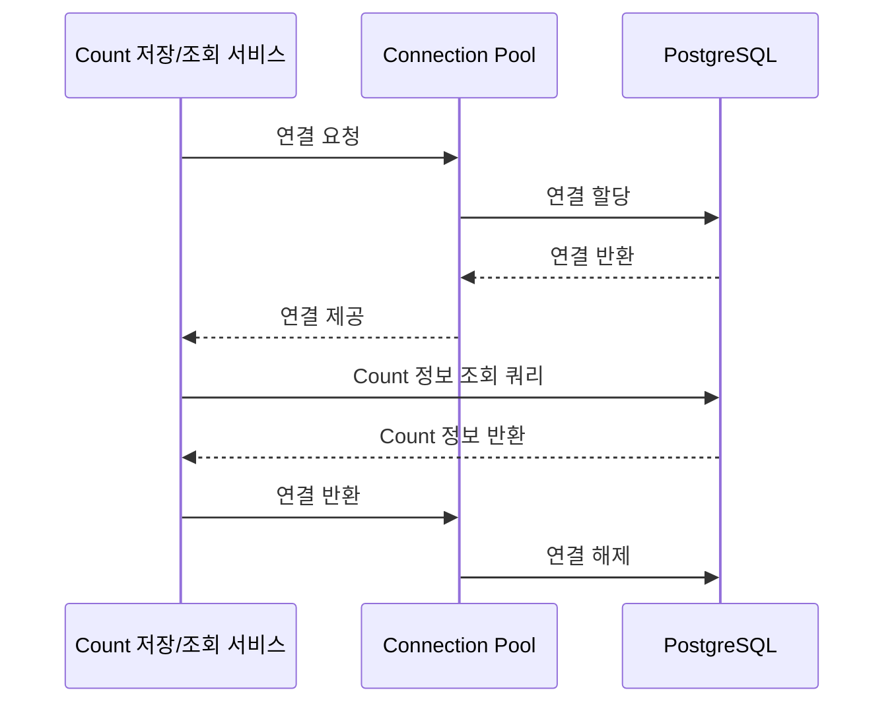

# CA-701: PostgreSQL for CountInfoDB

## 개요

### 후보 구조 ID
CA-701

### 제목
PostgreSQL for CountInfoDB

### 부모 후보 구조
없음 (최상위)

### 상충 후보 구조
- CA-702: MySQL for CountInfoDB

### 종속 후보 구조
- CA-701A: Read Replica 구성 (선택적)
- CA-701B: Connection Pooling 최적화 (선택적)

## 설계 결정

### 결정 내용
CountInfoDB에 PostgreSQL 관계형 데이터베이스를 사용합니다.

### 설계 근거
- CountInfoDB는 Count 정보(메타데이터)를 저장하는 컴포넌트로, 관계형 데이터 구조가 적합함
- ACID 트랜잭션 보장이 필요함
- 읽기 중심 워크로드로 변경 빈도가 낮음
- Kubernetes 환경에서 안정적인 운영이 필요함

### 관련 품질 요구사항
- QA-001: Count 저장 응답 시간 최소화 (우선순위 1)
- QA-002: Count 조회 응답 시간 최소화 (우선순위 2)
- QA-003: Count 저장 서비스 독립성 최대화 (우선순위 3)
- QA-004: Count 조회 서비스 독립성 최대화 (우선순위 4)
- NFR-001: Count 저장 응답 시간 < 100ms
- NFR-002: Count 조회 응답 시간 < 100ms
- NFR-003: 동시 요청 처리량 >= 1000 RPS

## 구조 설명

### 기술 스택
- **데이터베이스**: PostgreSQL (최신 안정 버전)
- **데이터 모델**: 관계형 데이터베이스
- **트랜잭션**: ACID 보장
- **인덱싱**: B-tree, Hash, GIN, GiST 등 다양한 인덱스 타입 지원

### 데이터 스키마 설계

#### CountInfo 테이블
```sql
CREATE TABLE count_info (
    count_id VARCHAR(255) PRIMARY KEY,
    name VARCHAR(255) NOT NULL,
    description TEXT,
    created_at TIMESTAMP NOT NULL DEFAULT CURRENT_TIMESTAMP,
    updated_at TIMESTAMP NOT NULL DEFAULT CURRENT_TIMESTAMP,
    created_by VARCHAR(255),
    metadata JSONB
);

CREATE INDEX idx_count_info_name ON count_info(name);
CREATE INDEX idx_count_info_created_at ON count_info(created_at);
```

### 동작 흐름



## 장점

### 기능성
- **강한 일관성 보장**: ACID 트랜잭션으로 데이터 일관성 보장
- **표준 SQL 지원**: 표준 SQL로 개발 생산성 향상
- **풍부한 인덱싱 옵션**: B-tree, Hash, GIN, GiST 등 다양한 인덱스 타입으로 쿼리 최적화 가능
- **JSONB 지원**: 유연한 메타데이터 저장 가능

### 성능
- **읽기 성능**: 인덱싱을 통한 빠른 조회 성능
- **트랜잭션 성능**: WAL(Write-Ahead Logging)을 통한 효율적인 쓰기 성능
- **동시성 처리**: MVCC(Multi-Version Concurrency Control)로 높은 동시성 지원

### 확장성
- **수직 확장**: 단일 노드 성능 향상 가능
- **Read Replica**: 읽기 전용 복제본으로 읽기 성능 확장 가능 (CA-701A)

### 안정성
- **데이터 무결성**: 외래 키, 체크 제약 조건 등으로 데이터 무결성 보장
- **장애 복구**: WAL을 통한 트랜잭션 로그 기반 복구
- **백업 및 복구**: 표준 백업/복구 도구 지원

### 생태계
- **오픈소스**: 라이선스 비용 없음
- **성숙한 커뮤니티**: 널리 사용되어 문제 해결 자료 풍부
- **Kubernetes 지원**: PostgreSQL Operator로 Kubernetes 환경에서 안정적인 운영
- **도구 지원**: 다양한 관리 도구 및 모니터링 도구 지원

### 운영
- **학습 곡선**: 표준 SQL로 학습 곡선 낮음
- **운영 복잡도**: 표준적인 관계형 데이터베이스 운영 지식으로 운영 가능

## 단점 및 트레이드오프

### 성능 제한
- **수평 확장성 제한**: 단일 노드 성능에 의존하며, 수평 확장이 제한적임
- **높은 동시성 처리 시 성능 저하**: 매우 높은 동시성 환경에서 성능 저하 가능
- **복잡한 쿼리 시 응답 시간 증가**: 복잡한 조인 쿼리 시 응답 시간 증가 가능
- **확장 가능한 metadata 저장 제한**: 정적 스키마로 Count마다 다른 구조의 metadata 저장에 제한 (JSONB 사용 시 일부 완화 가능하나 MongoDB 대비 유연성 낮음)

### 비용
- **인프라 비용**: 높은 성능을 위해 고사양 인프라 필요 시 비용 증가

### 운영 복잡도
- **Read Replica 구성 시**: 복제 지연 관리 필요 (CA-701A로 보완 가능)
- **백업 및 복구**: 백업 전략 수립 및 테스트 필요

## 종속 후보 구조

### CA-701A: Read Replica 구성
- **목적**: 읽기 성능 향상을 위한 읽기 전용 복제본 구성
- **적용 시점**: 읽기 부하가 높아질 때
- **단점 보완**: 수평 확장성 제한 완화

### CA-701B: Connection Pooling 최적화
- **목적**: 동시성 처리 능력 향상을 위한 연결 풀 최적화
- **적용 시점**: 높은 동시성 처리 요구사항이 있을 때
- **단점 보완**: 높은 동시성 처리 시 성능 저하 완화

## 대안 후보 구조

### CA-702: MySQL for CountInfoDB
- **차이점**: MySQL은 PostgreSQL 대비 고급 기능 제한
- **선택 기준**: 학습 곡선이 더 낮은 환경에서 선택 가능

### CA-713: MongoDB for CountInfoDB
- **차이점**: 문서형 데이터베이스로 확장 가능한 metadata 저장, 유연한 스키마, 수평 확장성
- **선택 기준**: Count마다 확장 가능한 metadata 저장이 필요하고 유연한 스키마가 중요한 경우

## 채택 고려사항

### 채택 조건
- 관계형 데이터 구조 요구사항
- ACID 트랜잭션 보장 필요
- Kubernetes 환경 운영
- 오픈소스 솔루션 선호

### 채택 시 추가 고려사항
- Read Replica 구성 검토 (CA-701A)
- Connection Pooling 최적화 검토 (CA-701B)
- 인덱싱 전략 수립
- 백업 및 복구 전략 수립
- 모니터링 및 알림 설정

## 관련 후보 구조

- **CA-703**: PostgreSQL for CountValueDB (동일 기술 스택 사용 시 일관성)
- **CA-706**: PostgreSQL for DashboardConfigDB (동일 기술 스택 사용 시 일관성)
- **CA-013**: CountInfoDB 캐싱 (캐싱과 함께 사용 시 성능 향상)
- **CA-007**: CountInfoDB 캐싱 (저장 시나리오에서 캐싱과 함께 사용)

## 참조 문서

- `solutions.md`: 기술 솔루션 선택 설계 과정
- `qualities.md`: 품질 요구사항
- `domain/model.md`: 도메인 모델
