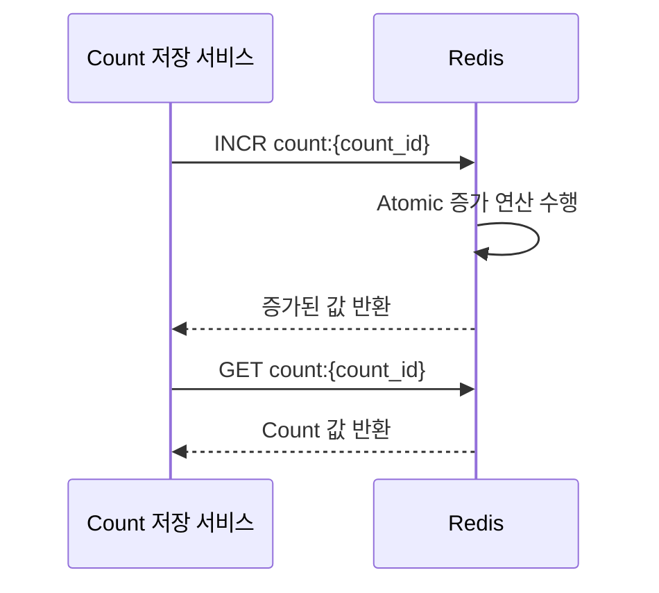

# CA-704: Redis for CountValueDB

## 개요

### 후보 구조 ID
CA-704

### 제목
Redis for CountValueDB

### 부모 후보 구조
없음 (최상위)

### 상충 후보 구조
- CA-703: PostgreSQL for CountValueDB
- CA-705: MongoDB for CountValueDB

### 종속 후보 구조
- CA-704A: Redis Cluster 구성 (선택적)
- CA-704B: AOF 영속성 전략 선택 (선택적)
- CA-704C: 메모리 관리 전략 (선택적)

## 설계 결정

### 결정 내용
CountValueDB에 Redis 인메모리 데이터베이스를 사용합니다.

### 설계 근거
- Count 값 저장은 매우 빠른 읽기/쓰기 성능이 필요함
- Atomic 증가/감소 연산이 빈번하게 발생함
- NFR-001 (응답 시간 < 100ms) 및 NFR-003 (동시 요청 처리량 >= 1000 RPS) 만족 필요
- 인메모리 저장으로 매우 빠른 성능 제공

### 관련 품질 요구사항
- QA-001: Count 저장 응답 시간 최소화 (우선순위 1)
- QA-002: Count 조회 응답 시간 최소화 (우선순위 2)
- NFR-001: Count 저장 응답 시간 < 100ms
- NFR-002: Count 조회 응답 시간 < 100ms
- NFR-003: 동시 요청 처리량 >= 1000 RPS

## 구조 설명

### 기술 스택
- **데이터베이스**: Redis (최신 안정 버전)
- **데이터 모델**: 키-값 저장소
- **Atomic 연산**: INCR, DECR, INCRBY, DECRBY 명령 지원
- **영속성**: AOF (Append-Only File) 또는 RDB 스냅샷

### 데이터 구조 설계

#### Count 값 저장
```
Key: count:{count_id}
Value: {numeric_value}
TTL: 없음 (영구 저장)
```

#### Atomic 증가/감소 연산
```redis
INCR count:{count_id}        # 1 증가
DECR count:{count_id}        # 1 감소
INCRBY count:{count_id} 5    # 5 증가
DECRBY count:{count_id} 3    # 3 감소
```

### 동작 흐름



## 장점

### 성능
- **매우 빠른 읽기/쓰기 성능**: 인메모리 저장으로 < 1ms 응답 시간
- **높은 처리량**: 초당 수십만 연산 처리 가능
- **Atomic 연산 지원**: INCR/DECR 명령으로 동시성 제어 용이
- **낮은 응답 시간**: NFR-001, NFR-002 요구사항 충족 가능

### 기능성
- **Atomic 증가/감소 연산**: 네이티브 지원으로 동시성 제어 용이
- **다양한 데이터 구조**: String, Hash, List, Set, Sorted Set 지원
- **TTL 지원**: 자동 만료 기능

### 확장성
- **수평 확장**: Redis Cluster로 수평 확장 가능 (CA-704A)
- **높은 처리량**: NFR-003 (동시 요청 처리량 >= 1000 RPS) 충족 가능

### 생태계
- **오픈소스**: 라이선스 비용 없음
- **성숙한 커뮤니티**: 널리 사용되어 문제 해결 자료 풍부
- **Kubernetes 지원**: Redis Operator로 Kubernetes 환경에서 안정적인 운영
- **도구 지원**: 다양한 관리 도구 및 모니터링 도구 지원

## 단점 및 트레이드오프

### 데이터 손실 위험
- **메모리 기반**: 메모리 용량 제한으로 데이터 손실 위험
- **영속성 보장 시 성능 저하**: AOF/RDB 사용 시 성능 저하 가능 (CA-704B로 보완)
- **장애 시 데이터 복구**: 영속성 전략에 따라 데이터 손실 가능

### 비용
- **메모리 비용**: 대용량 데이터 저장 시 메모리 비용 증가
- **인프라 비용**: 고용량 메모리 인프라 필요

### 기능 제한
- **복잡한 쿼리 제한**: 키-값 기반으로 복잡한 쿼리 제한
- **관계형 데이터 구조 제한**: 관계형 데이터 모델링 제한

### 운영 복잡도
- **메모리 관리**: 메모리 용량 관리 및 eviction policy 설정 필요 (CA-704C)
- **영속성 전략**: AOF/RDB 전략 선택 및 모니터링 필요 (CA-704B)
- **클러스터 구성**: Redis Cluster 구성 시 운영 복잡도 증가 (CA-704A)

## 종속 후보 구조

### CA-704A: Redis Cluster 구성
- **목적**: 수평 확장 및 고가용성을 위한 클러스터 구성
- **적용 시점**: 단일 노드로 처리 불가능한 부하가 발생할 때
- **단점 보완**: 수평 확장성 제한 완화, 고가용성 확보

### CA-704B: AOF 영속성 전략 선택
- **목적**: 데이터 영속성 보장을 위한 전략 선택
- **적용 시점**: 데이터 손실을 허용할 수 없을 때
- **단점 보완**: 데이터 손실 위험 완화 (성능 저하 트레이드오프)

### CA-704C: 메모리 관리 전략
- **목적**: 메모리 용량 관리 및 eviction policy 설정
- **적용 시점**: 메모리 용량 제한이 문제가 될 때
- **단점 보완**: 메모리 비용 관리

## 대안 후보 구조

### CA-703: PostgreSQL for CountValueDB
- **차이점**: 관계형 데이터베이스로 강한 일관성 보장, 디스크 기반 저장
- **선택 기준**: 데이터 영속성 및 일관성이 더 중요한 경우

### CA-705: MongoDB for CountValueDB
- **차이점**: 문서형 데이터베이스로 유연한 스키마, 수평 확장성
- **선택 기준**: 유연한 스키마 및 수평 확장성이 더 중요한 경우

## 채택 고려사항

### 채택 조건
- 매우 빠른 응답 시간 요구사항 (NFR-001, NFR-002)
- 높은 처리량 요구사항 (NFR-003)
- Atomic 증가/감소 연산 빈번
- 데이터 손실 허용 가능 또는 영속성 전략 수립 가능

### 채택 시 추가 고려사항
- Redis Cluster 구성 검토 (CA-704A)
- AOF 영속성 전략 검토 (CA-704B)
- 메모리 관리 전략 수립 (CA-704C)
- 메모리 용량 계획
- 백업 및 복구 전략 수립
- 모니터링 및 알림 설정

## 관련 후보 구조

- **CA-708**: Redis for 캐싱 (동일 기술 스택 사용 시 인프라 통합 가능)
- **CA-712**: Redis Pub/Sub for 메시징 (동일 기술 스택 사용 시 인프라 통합 가능)
- **CA-014**: CountValueDB 캐싱 (Redis를 DB로 사용 시 캐싱 레이어 불필요할 수 있음)

## 참조 문서

- `solutions.md`: 기술 솔루션 선택 설계 과정
- `qualities.md`: 품질 요구사항
- `domain/model.md`: 도메인 모델
