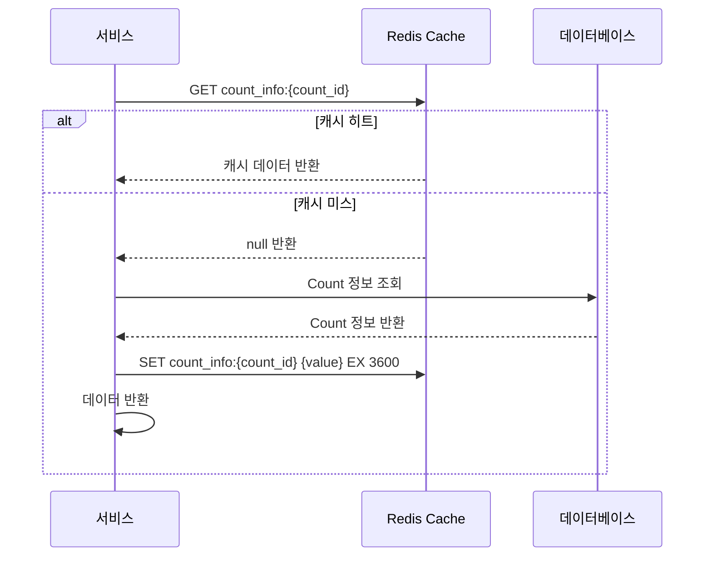
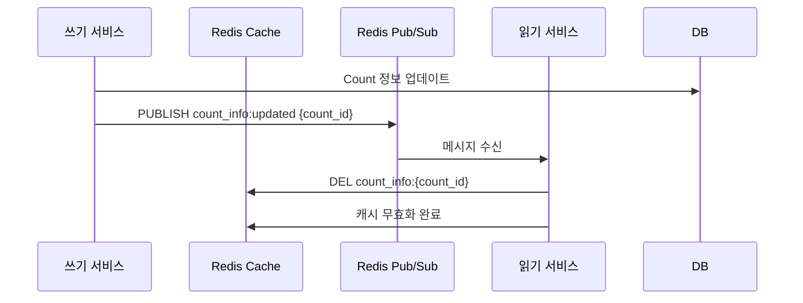

# CA-708: Redis for 캐싱

## 개요

### 후보 구조 ID
CA-708

### 제목
Redis for 캐싱

### 부모 후보 구조
없음 (최상위)

### 상충 후보 구조
- CA-709: Memcached for 캐싱

### 종속 후보 구조
- CA-708A: Redis Cluster 구성 (선택적)
- CA-708B: 캐시 전략 선택 (선택적)

## 설계 결정

### 결정 내용
캐싱 솔루션으로 Redis를 사용합니다.

### 설계 근거
- 인메모리 캐시로 빠른 조회 성능 제공
- TTL 지원으로 자동 만료 기능
- Pub/Sub 지원으로 이벤트 기반 캐시 무효화 가능
- 분산 캐시 지원으로 MSA 환경에 적합
- Kubernetes 환경 호환성

### 관련 품질 요구사항
- QA-001: Count 저장 응답 시간 최소화 (우선순위 1)
- QA-002: Count 조회 응답 시간 최소화 (우선순위 2)
- NFR-001: Count 저장 응답 시간 < 100ms
- NFR-002: Count 조회 응답 시간 < 100ms

### 관련 후보 구조
- CA-007: CountInfoDB 캐싱
- CA-013: CountInfoDB 캐싱
- CA-014: CountValueDB 캐싱
- CA-015: Count 조회 결과 캐싱
- CA-025: 대시보드 데이터 캐싱

## 구조 설명

### 기술 스택
- **캐싱 솔루션**: Redis (최신 안정 버전)
- **캐시 패턴**: Write-Through, Write-Behind, Cache-Aside 지원
- **무효화 전략**: TTL 기반, 이벤트 기반 무효화 지원

### 캐시 키 설계

#### CountInfoDB 캐싱
```
Key: count_info:{count_id}
Value: {count_info_json}
TTL: 3600 (1시간)
```

#### CountValueDB 캐싱
```
Key: count_value:{count_id}
Value: {count_value}
TTL: 300 (5분)
```

#### 조회 결과 캐싱
```
Key: count_result:{count_id}:{query_hash}
Value: {count_result_json}
TTL: 300 (5분)
```

### 동작 흐름

#### TTL 기반 캐시 무효화


#### 이벤트 기반 캐시 무효화


## 장점

### 성능
- **매우 빠른 읽기/쓰기 성능**: 인메모리 저장으로 < 1ms 응답 시간
- **높은 처리량**: 초당 수십만 연산 처리 가능
- **응답 시간 단축**: DB 조회 대비 10~100배 빠른 응답 시간

### 기능성
- **TTL 지원**: 자동 만료 기능으로 캐시 관리 용이
- **Pub/Sub 지원**: 이벤트 기반 캐시 무효화 가능 (CA-007B, CA-013B, CA-025A)
- **다양한 데이터 구조**: String, Hash, List, Set, Sorted Set 지원
- **원자적 연산**: INCR, DECR 등 원자적 연산 지원

### 확장성
- **분산 캐시 지원**: Redis Cluster로 수평 확장 가능 (CA-708A)
- **높은 처리량**: NFR-003 (동시 요청 처리량 >= 1000 RPS) 충족 가능

### 생태계
- **오픈소스**: 라이선스 비용 없음
- **성숙한 커뮤니티**: 널리 사용되어 문제 해결 자료 풍부
- **Kubernetes 지원**: Redis Operator로 Kubernetes 환경에서 안정적인 운영
- **도구 지원**: 다양한 관리 도구 및 모니터링 도구 지원

### 운영
- **캐시 전략 유연성**: Write-Through, Write-Behind, Cache-Aside 등 다양한 전략 지원 (CA-708B)
- **모니터링**: Redis 명령어 및 도구로 캐시 상태 모니터링 용이

## 단점 및 트레이드오프

### 데이터 일관성
- **캐시와 DB 불일치**: 캐시 무효화 실패 시 데이터 불일치 가능
- **이벤트 기반 무효화 복잡도**: Pub/Sub 기반 무효화 구현 복잡도 증가

### 비용
- **메모리 비용**: 대용량 캐시 저장 시 메모리 비용 증가
- **인프라 비용**: 고용량 메모리 인프라 필요

### 운영 복잡도
- **캐시 전략 선택**: Write-Through, Write-Behind 등 전략 선택 필요 (CA-708B)
- **캐시 무효화 전략**: TTL vs 이벤트 기반 무효화 전략 선택 필요
- **클러스터 구성**: Redis Cluster 구성 시 운영 복잡도 증가 (CA-708A)
- **캐시 적중률 모니터링**: 캐시 적중률 모니터링 및 최적화 필요

## 종속 후보 구조

### CA-708A: Redis Cluster 구성
- **목적**: 수평 확장 및 고가용성을 위한 클러스터 구성
- **적용 시점**: 단일 노드로 처리 불가능한 캐시 부하가 발생할 때
- **단점 보완**: 수평 확장성 제한 완화, 고가용성 확보

### CA-708B: 캐시 전략 선택
- **목적**: Write-Through, Write-Behind, Cache-Aside 등 캐시 전략 선택
- **적용 시점**: 캐시 일관성 요구사항에 따라 전략 선택 필요
- **단점 보완**: 데이터 일관성 문제 완화

## 대안 후보 구조

### CA-709: Memcached for 캐싱
- **차이점**: 단순한 키-값 캐시, Pub/Sub 미지원
- **선택 기준**: 단순한 캐싱 요구사항이고 이벤트 기반 무효화가 불필요한 경우

## 채택 고려사항

### 채택 조건
- 빠른 응답 시간 요구사항 (NFR-001, NFR-002)
- 높은 처리량 요구사항 (NFR-003)
- TTL 또는 이벤트 기반 캐시 무효화 필요
- 분산 캐시 지원 필요

### 채택 시 추가 고려사항
- Redis Cluster 구성 검토 (CA-708A)
- 캐시 전략 선택 (CA-708B)
- 캐시 키 설계 및 네이밍 규칙 수립
- TTL 값 최적화
- 이벤트 기반 무효화 구현 (CA-007B, CA-013B, CA-025A)
- 캐시 적중률 모니터링
- 메모리 용량 계획

## 관련 후보 구조

- **CA-704**: Redis for CountValueDB (동일 기술 스택 사용 시 인프라 통합 가능)
- **CA-712**: Redis Pub/Sub for 메시징 (동일 기술 스택 사용 시 인프라 통합 가능)
- **CA-007**: CountInfoDB 캐싱 (저장 시나리오)
- **CA-013**: CountInfoDB 캐싱 (조회 시나리오)
- **CA-014**: CountValueDB 캐싱
- **CA-015**: Count 조회 결과 캐싱
- **CA-025**: 대시보드 데이터 캐싱

## 참조 문서

- `solutions.md`: 기술 솔루션 선택 설계 과정
- `qualities.md`: 품질 요구사항
- `QS-001-Count-저장-응답-시간.md`: 성능 최적화 후보 구조
- `QS-002-Count-조회-응답-시간.md`: 성능 최적화 후보 구조
