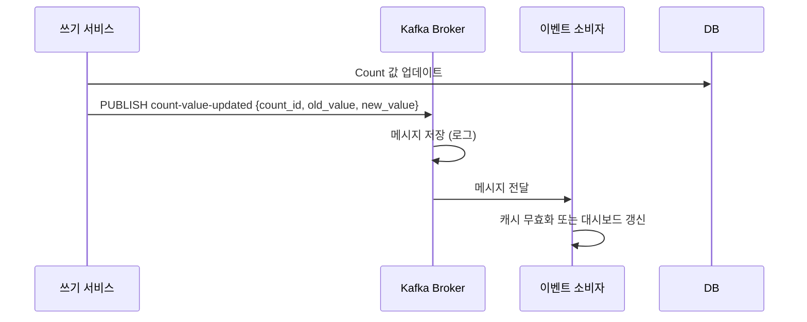

# CA-710: Kafka for 메시징

## 개요

### 후보 구조 ID
CA-710

### 제목
Kafka for 메시징

### 부모 후보 구조
없음 (최상위)

### 상충 후보 구조
- CA-711: RabbitMQ for 메시징
- CA-712: Redis Pub/Sub for 메시징

### 종속 후보 구조
- CA-710A: Kafka Topic 파티션 수 결정 (선택적)
- CA-710B: 메시지 보관 정책 설정 (선택적)

## 설계 결정

### 결정 내용
이벤트 기반 갱신을 위한 메시징 시스템으로 Apache Kafka를 사용합니다.

### 설계 근거
- 높은 처리량 요구사항 (수백만 메시지/초)
- 낮은 지연 시간
- 메시지 영속성 보장 필요
- 이벤트 재생 가능성 필요
- 수평 확장성 필요

### 관련 품질 요구사항
- QA-011: 대시보드 갱신 시간 최소화 (우선순위 11)
- CA-022: 이벤트 기반 갱신
- CA-007B: 이벤트 기반 캐시 무효화
- CA-013B: 이벤트 기반 캐시 무효화
- CA-025A: 이벤트 기반 캐시 무효화

## 구조 설명

### 기술 스택
- **메시징 시스템**: Apache Kafka (최신 안정 버전)
- **메시지 패턴**: 이벤트 스트리밍
- **토픽 기반**: 토픽 단위로 메시지 발행/구독

### 토픽 설계

#### Count 값 변경 이벤트
```
Topic: count-value-updated
Partition: {count_id} 해시 기반 파티션
Key: {count_id}
Value: {
    "count_id": "{count_id}",
    "old_value": {old_value},
    "new_value": {new_value},
    "timestamp": {timestamp}
}
```

#### Count 정보 변경 이벤트
```
Topic: count-info-updated
Partition: {count_id} 해시 기반 파티션
Key: {count_id}
Value: {
    "count_id": "{count_id}",
    "action": "created|updated|deleted",
    "timestamp": {timestamp}
}
```

### 동작 흐름



## 장점

### 성능
- **높은 처리량**: 수백만 메시지/초 처리 가능
- **낮은 지연 시간**: 밀리초 단위 지연 시간
- **수평 확장성**: 파티션 기반으로 수평 확장 가능

### 기능성
- **메시지 영속성 보장**: 로그 기반 저장으로 메시지 손실 방지
- **메시지 순서 보장**: 파티션 내 메시지 순서 보장
- **이벤트 재생 가능**: 로그 보관으로 이벤트 재생 가능
- **높은 내구성**: 복제본을 통한 고가용성

### 확장성
- **파티션 기반 확장**: 파티션 수 증가로 처리량 확장 (CA-710A)
- **컨슈머 그룹**: 여러 컨슈머로 부하 분산 가능

### 생태계
- **오픈소스**: 라이선스 비용 없음
- **성숙한 커뮤니티**: 널리 사용되어 문제 해결 자료 풍부
- **Kubernetes 지원**: Strimzi Operator로 Kubernetes 환경에서 안정적인 운영
- **도구 지원**: Kafka Connect, Kafka Streams 등 풍부한 도구 지원

## 단점 및 트레이드오프

### 운영 복잡도
- **높은 학습 곡선**: Kafka 개념 이해 필요 (토픽, 파티션, 오프셋 등)
- **설정 복잡도**: 파티션 수, 복제 팩터 등 설정 복잡 (CA-710A)
- **운영 복잡도**: 브로커 관리, 모니터링 복잡

### 비용
- **인프라 비용**: 디스크 저장 공간 필요 (메시지 보관)
- **운영 비용**: Kafka 운영 전문 인력 필요

### 기능 제한
- **낮은 처리량 환경에서 오버엔지니어링**: 단순한 메시징 요구사항에는 과도할 수 있음
- **메시지 브로커 대비 설정 복잡**: RabbitMQ 대비 설정 복잡

## 종속 후보 구조

### CA-710A: Kafka Topic 파티션 수 결정
- **목적**: 처리량 및 확장성을 위한 파티션 수 결정
- **적용 시점**: 토픽 생성 시 파티션 수 결정 필요
- **단점 보완**: 확장성 제한 완화

### CA-710B: 메시지 보관 정책 설정
- **목적**: 메시지 보관 기간 및 용량 관리
- **적용 시점**: 메시지 보관 정책 수립 필요
- **단점 보완**: 인프라 비용 관리

## 대안 후보 구조

### CA-711: RabbitMQ for 메시징
- **차이점**: 메시지 브로커 패턴, 유연한 라우팅, 운영 복잡도 낮음
- **선택 기준**: 처리량이 낮고 운영 복잡도를 낮추고 싶은 경우

### CA-712: Redis Pub/Sub for 메시징
- **차이점**: 단순한 Pub/Sub, 메시지 영속성 미지원, 낮은 지연 시간
- **선택 기준**: 메시지 영속성이 불필요하고 매우 낮은 지연 시간이 필요한 경우

## 채택 고려사항

### 채택 조건
- 높은 처리량 요구사항
- 메시지 영속성 보장 필요
- 이벤트 재생 가능성 필요
- 수평 확장성 필요
- Kafka 운영 전문 인력 보유 또는 확보 가능

### 채택 시 추가 고려사항
- Kafka Topic 파티션 수 결정 (CA-710A)
- 메시지 보관 정책 설정 (CA-710B)
- 토픽 설계 및 네이밍 규칙 수립
- 컨슈머 그룹 설계
- 모니터링 및 알림 설정
- 백업 및 복구 전략 수립

## 관련 후보 구조

- **CA-022**: 이벤트 기반 갱신 (대시보드 갱신)
- **CA-007B**: 이벤트 기반 캐시 무효화 (CountInfoDB)
- **CA-013B**: 이벤트 기반 캐시 무효화 (CountInfoDB)
- **CA-025A**: 이벤트 기반 캐시 무효화 (대시보드 데이터)

## 참조 문서

- `solutions.md`: 기술 솔루션 선택 설계 과정
- `qualities.md`: 품질 요구사항
- `QS-005-대시보드-갱신-시간.md`: 성능 최적화 후보 구조
