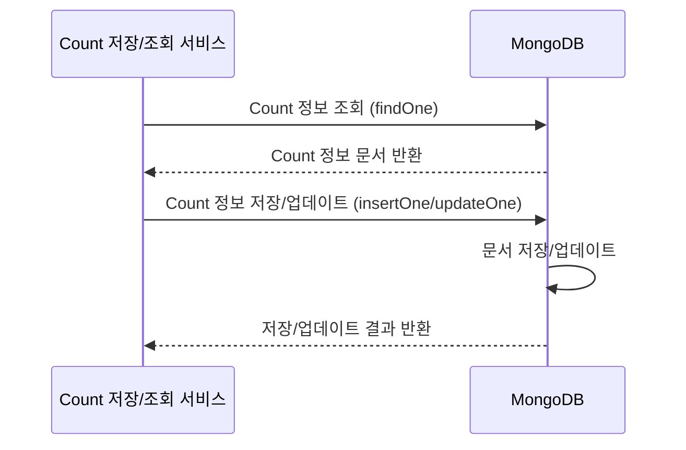

# CA-713: MongoDB for CountInfoDB

## 개요

### 후보 구조 ID
CA-713

### 제목
MongoDB for CountInfoDB

### 부모 후보 구조
없음 (최상위)

### 상충 후보 구조
- CA-701: PostgreSQL for CountInfoDB
- CA-702: MySQL for CountInfoDB

### 종속 후보 구조
- CA-713A: MongoDB Sharding 구성 (선택적)
- CA-713B: MongoDB Replica Set 구성 (선택적)
- CA-713C: 인덱싱 전략 최적화 (선택적)

## 설계 결정

### 결정 내용
CountInfoDB에 MongoDB 문서형 데이터베이스를 사용합니다.

### 설계 근거
- CountInfoDB는 Count 정보(메타데이터)를 저장하는 컴포넌트로, Count마다 확장 가능한 metadata 저장이 필요함
- 동적 스키마 지원으로 유연한 데이터 구조 저장 가능
- 문서형 데이터 모델이 JSON 형태의 metadata 저장에 적합함
- 수평 확장성이 필요할 수 있음
- Kubernetes 환경에서 안정적인 운영이 필요함

### 관련 품질 요구사항
- QA-001: Count 저장 응답 시간 최소화 (우선순위 1)
- QA-002: Count 조회 응답 시간 최소화 (우선순위 2)
- QA-003: Count 저장 서비스 독립성 최대화 (우선순위 3)
- QA-004: Count 조회 서비스 독립성 최대화 (우선순위 4)
- NFR-001: Count 저장 응답 시간 < 100ms
- NFR-002: Count 조회 응답 시간 < 100ms
- NFR-003: 동시 요청 처리량 >= 1000 RPS

## 구조 설명

### 기술 스택
- **데이터베이스**: MongoDB (최신 안정 버전)
- **데이터 모델**: 문서형 데이터베이스 (BSON)
- **트랜잭션**: 다중 문서 트랜잭션 지원 (최신 버전)
- **인덱싱**: 단일 필드, 복합, 텍스트, 지리공간 인덱스 지원

### 데이터 스키마 설계

#### CountInfo 컬렉션
```javascript
{
  _id: ObjectId,
  count_id: String,  // 인덱스
  name: String,
  description: String,
  created_at: Date,
  updated_at: Date,
  created_by: String,
  // 확장 가능한 metadata (동적 필드)
  metadata: {
    // Count마다 다른 구조의 metadata 저장 가능
    custom_field_1: String,
    custom_field_2: Number,
    tags: [String],
    // 중첩된 객체도 가능
    settings: {
      option1: Boolean,
      option2: Number
    }
  }
}
```

#### 인덱스 설계
```javascript
// count_id에 대한 고유 인덱스
db.count_info.createIndex({ count_id: 1 }, { unique: true })

// 이름에 대한 인덱스
db.count_info.createIndex({ name: 1 })

// 생성일 기준 인덱스
db.count_info.createIndex({ created_at: -1 })

// metadata 내부 필드 인덱스 (필요시)
db.count_info.createIndex({ "metadata.tags": 1 })
```

### 동작 흐름



## 장점

### 기능성
- **확장 가능한 metadata 저장**: Count마다 다른 구조의 metadata를 동적으로 저장 가능
- **유연한 스키마**: 문서형 데이터 모델로 스키마 변경 용이
- **JSON 지원**: JSON 형태로 직관적인 데이터 저장 및 조회
- **다양한 인덱싱**: 단일 필드, 복합, 텍스트, 지리공간 인덱스 지원

### 성능
- **읽기 성능**: 인덱싱을 통한 빠른 조회 성능
- **쓰기 성능**: 문서 단위 쓰기로 효율적인 저장
- **수평 확장성**: Sharding을 통한 수평 확장 가능 (CA-713A)

### 확장성
- **수평 확장**: Sharding으로 데이터 분산 및 처리량 확장 가능 (CA-713A)
- **수직 확장**: 단일 노드 성능 향상 가능

### 안정성
- **Replica Set**: 복제본을 통한 고가용성 지원 (CA-713B)
- **자동 장애 복구**: Replica Set의 자동 장애 복구
- **데이터 무결성**: 다중 문서 트랜잭션 지원 (최신 버전)

### 생태계
- **오픈소스**: 라이선스 비용 없음
- **성숙한 커뮤니티**: 널리 사용되어 문제 해결 자료 풍부
- **Kubernetes 지원**: MongoDB Operator로 Kubernetes 환경에서 안정적인 운영
- **도구 지원**: 다양한 관리 도구 및 모니터링 도구 지원

### 운영
- **유연한 데이터 모델**: 스키마 변경이 용이하여 개발 초기 단계에 유리
- **JSON 직관성**: JSON 형태로 개발자 친화적

## 단점 및 트레이드오프

### 일관성 제한
- **최종 일관성**: 관계형 데이터베이스 대비 강한 일관성 보장 약함
- **트랜잭션 제한**: 다중 문서 트랜잭션 지원하나 관계형 DB 대비 제한적
- **복잡한 조인 쿼리 제한**: 관계형 데이터베이스 대비 조인 기능 제한

### 성능 제한
- **복잡한 쿼리 성능**: 복잡한 집계 쿼리 시 성능 제한 가능
- **인덱스 관리**: 인덱스가 많아질수록 쓰기 성능 저하 가능

### 운영 복잡도
- **Sharding 구성 시**: Sharding 구성 시 운영 복잡도 증가 (CA-713A)
- **인덱스 관리**: 인덱스 전략 수립 및 모니터링 필요 (CA-713C)
- **데이터 모델링**: 스키마가 없어도 되지만, 데이터 모델링 고려 필요

### 비용
- **인프라 비용**: Sharding 구성 시 인프라 비용 증가
- **메모리 비용**: 인덱스 및 작업 세트를 위한 메모리 필요

## 종속 후보 구조

### CA-713A: MongoDB Sharding 구성
- **목적**: 수평 확장 및 처리량 향상을 위한 Sharding 구성
- **적용 시점**: 단일 노드로 처리 불가능한 부하가 발생할 때
- **단점 보완**: 수평 확장성 제한 완화, 처리량 향상

### CA-713B: MongoDB Replica Set 구성
- **목적**: 고가용성 및 읽기 성능 향상을 위한 복제본 구성
- **적용 시점**: 고가용성 요구사항이 있을 때
- **단점 보완**: 안정성 및 가용성 확보

### CA-713C: 인덱싱 전략 최적화
- **목적**: 쿼리 성능 향상을 위한 인덱싱 전략 수립
- **적용 시점**: 쿼리 성능 최적화가 필요할 때
- **단점 보완**: 복잡한 쿼리 성능 제한 완화

## 대안 후보 구조

### CA-701: PostgreSQL for CountInfoDB
- **차이점**: 관계형 데이터베이스로 강한 일관성 보장, 정적 스키마
- **선택 기준**: 확장 가능한 metadata가 불필요하고 강한 일관성이 중요한 경우

### CA-702: MySQL for CountInfoDB
- **차이점**: 관계형 데이터베이스로 강한 일관성 보장, 정적 스키마
- **선택 기준**: 확장 가능한 metadata가 불필요하고 MySQL 생태계를 선호하는 경우

## 채택 고려사항

### 채택 조건
- Count마다 확장 가능한 metadata 저장 필요
- 유연한 스키마 요구사항
- JSON 형태의 데이터 저장 선호
- 수평 확장성 필요
- Kubernetes 환경 운영
- 오픈소스 솔루션 선호

### 채택 시 추가 고려사항
- MongoDB Sharding 구성 검토 (CA-713A)
- MongoDB Replica Set 구성 검토 (CA-713B)
- 인덱싱 전략 수립 (CA-713C)
- 데이터 모델링 설계
- 백업 및 복구 전략 수립
- 모니터링 및 알림 설정

## 관련 후보 구조

- **CA-705**: MongoDB for CountValueDB (동일 기술 스택 사용 시 일관성)
- **CA-707**: MongoDB for DashboardConfigDB (동일 기술 스택 사용 시 일관성)
- **CA-013**: CountInfoDB 캐싱 (캐싱과 함께 사용 시 성능 향상)
- **CA-007**: CountInfoDB 캐싱 (저장 시나리오에서 캐싱과 함께 사용)

## 참조 문서

- `solutions.md`: 기술 솔루션 선택 설계 과정
- `qualities.md`: 품질 요구사항
- `domain/model.md`: 도메인 모델
