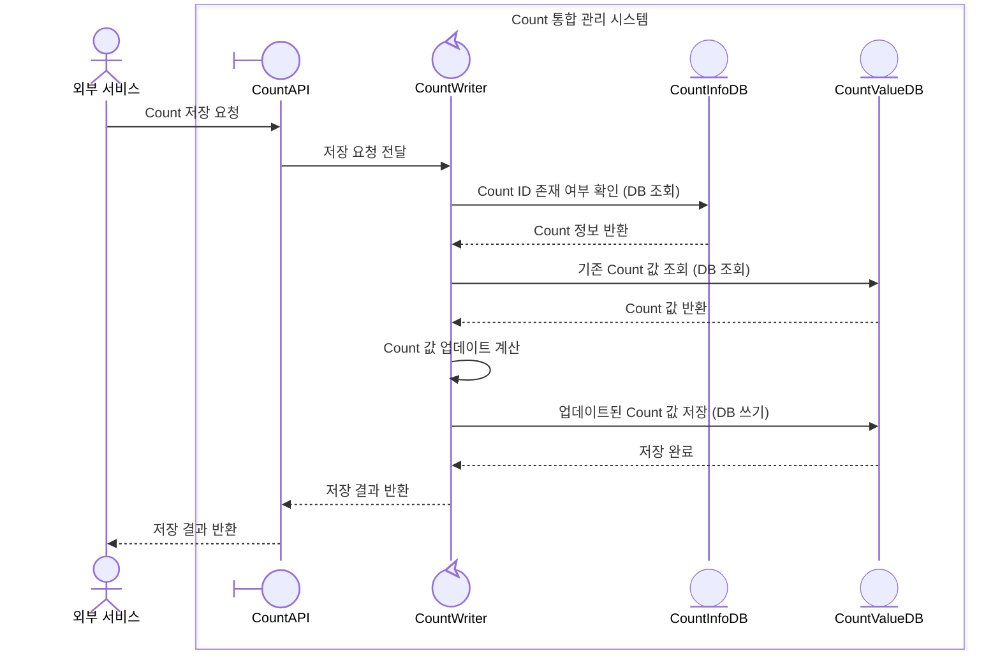
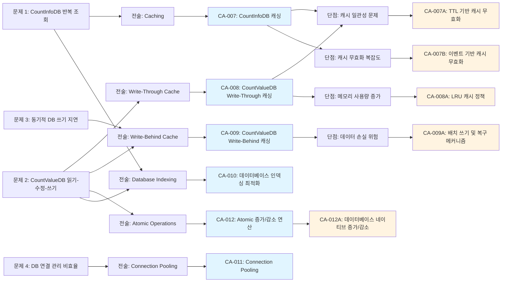
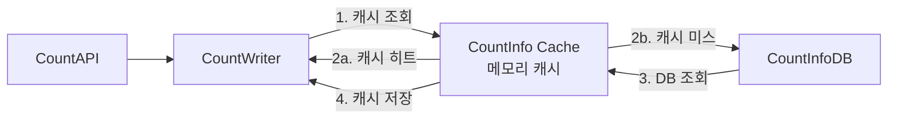
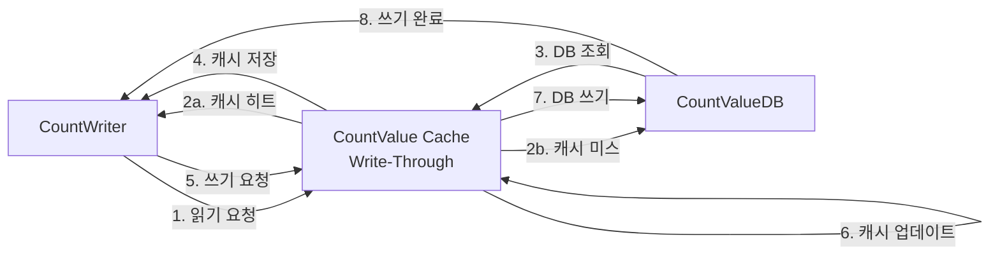
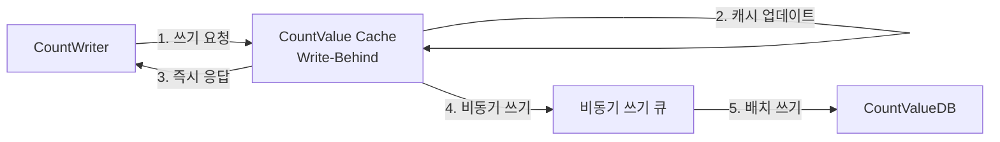

# QS-001-Count-저장-응답-시간 성능 최적화 후보 구조

## 개요

### 목적
이 문서는 QS-001 (Count 저장 응답 시간) 성능 시나리오를 분석하고, 성능 최적화를 위한 후보 구조를 설계합니다.

### 성능 시나리오 요약
- **품질 시나리오**: QS-001-Count-저장-응답-시간
- **품질 속성**: 성능 (응답 시간)
- **NFR-001**: Count 저장 응답 시간 < 100ms
- **QA-001**: Count 저장 응답 시간 최소화 (우선순위 1)
- **관련 Use Case**: UC-001-Count 저장

## 성능 시나리오 분석

### 현재 동작 흐름



### 성능 병목 지점 분석

현재 동작 흐름에서 다음과 같은 성능 병목 지점이 식별됩니다:

1. **CountInfoDB 조회 지연** (단계 3)
   - Count ID 존재 여부 확인을 위한 DB 조회
   - 매 요청마다 DB 접근 발생
   - 네트워크 지연 + DB 쿼리 실행 시간

2. **CountValueDB 조회 지연** (단계 5)
   - 기존 Count 값 조회를 위한 DB 조회
   - 증가/감소 연산 시 필수적인 조회
   - 네트워크 지연 + DB 쿼리 실행 시간

3. **CountValueDB 쓰기 지연** (단계 7)
   - 업데이트된 Count 값 저장을 위한 DB 쓰기
   - 트랜잭션 커밋 대기 시간
   - 디스크 I/O 지연

4. **순차적 DB 접근**
   - CountInfoDB 조회 → CountValueDB 조회 → CountValueDB 쓰기 순차 실행
   - 총 응답 시간 = 각 단계 지연 시간의 합

## 성능 문제 식별

### 문제 1: CountInfoDB 반복 조회 오버헤드
- **문제**: Count ID 존재 여부 확인을 위해 매 요청마다 CountInfoDB에 접근
- **영향**: 
  - DB 조회 지연 (네트워크 + 쿼리 실행 시간)
  - DB 연결 리소스 소비
  - 동일한 Count ID에 대한 반복 조회
- **근거**: CountInfoDB는 메타데이터로 변경 빈도가 낮고, 읽기 전용 조회가 대부분임

### 문제 2: CountValueDB 읽기-수정-쓰기 패턴
- **문제**: 증가/감소 연산 시 기존 값을 조회한 후 업데이트하는 패턴
- **영향**:
  - 읽기와 쓰기 두 번의 DB 접근
  - 읽기 지연 + 쓰기 지연의 합산
  - 동시성 제어 오버헤드 (락 대기 시간)
- **근거**: 증가/감소 연산이 빈번하게 발생하는 쓰기 중심 워크로드

### 문제 3: 동기적 DB 쓰기 지연
- **문제**: CountValueDB 쓰기 작업이 완료될 때까지 응답 대기
- **영향**:
  - 디스크 I/O 대기 시간
  - 트랜잭션 커밋 대기 시간
  - 높은 쓰기 부하 시 응답 시간 증가
- **근거**: NFR-001 요구사항 (100ms 이하) 달성을 위해 쓰기 지연 최소화 필요

### 문제 4: DB 연결 관리 비효율
- **문제**: 매 요청마다 새로운 DB 연결 생성 또는 연결 풀 관리 부족
- **영향**:
  - 연결 생성 오버헤드
  - 연결 풀 고갈 시 대기 시간
  - 리소스 낭비
- **근거**: 높은 동시성 처리 요구사항 (NFR-003: >= 1000 RPS)

## 설계 과정 마인드 맵



## 후보 구조 목록

이 문서에서 다루는 모든 후보 구조:

- **CA-007**: CountInfoDB 캐싱
  - **CA-007A**: TTL 기반 캐시 무효화
  - **CA-007B**: 이벤트 기반 캐시 무효화
- **CA-008**: CountValueDB Write-Through 캐싱
  - **CA-008A**: LRU 캐시 정책
- **CA-009**: CountValueDB Write-Behind 캐싱
  - **CA-009A**: 배치 쓰기 및 복구 메커니즘
- **CA-010**: 데이터베이스 인덱싱 최적화
- **CA-011**: Connection Pooling
- **CA-012**: Atomic 증가/감소 연산
  - **CA-012A**: 데이터베이스 네이티브 증가/감소

## 후보 구조 설계

### CA-007: CountInfoDB 캐싱

**ID**: CA-007  
**부모**: -  
**종속 유형**: 최상위

**Description**:

CountInfoDB의 Count ID 존재 여부 확인을 캐시하여 반복 조회 오버헤드를 제거합니다.

- **해결하려는 문제**: CountInfoDB 반복 조회로 인한 DB 접근 지연 (문제 1)
- **적용하는 패턴/전술**: Caching, Cache-Aside 패턴
- **기대 효과**: 
  - CountInfoDB 조회 시간을 DB 접근 시간에서 메모리 접근 시간으로 단축 (예: 10ms → 0.1ms)
  - DB 부하 감소 및 연결 리소스 절약
  - 전체 응답 시간 단축에 기여
- **트레이드오프**: 
  - 캐시 일관성 문제 (CountInfoDB 변경 시 캐시 무효화 필요)
  - 메모리 사용량 증가
- **종속 후보 구조**: CA-007A, CA-007B (캐시 일관성 문제 해결)

**구조도**:



**동작 방식**:

1. CountWriter가 Count ID 존재 여부 확인 시 먼저 캐시 조회
2. 캐시 히트 시: 캐시에서 즉시 반환 (DB 접근 없음)
3. 캐시 미스 시: CountInfoDB 조회 후 결과를 캐시에 저장
4. 캐시 무효화: CA-007A 또는 CA-007B 적용

**장점**:

- **응답 시간 단축**: CountInfoDB 조회 시간 대폭 감소 (DB 접근 → 메모리 접근)
- **DB 부하 감소**: 반복 조회를 캐시로 처리하여 DB 접근 빈도 감소
- **확장성 향상**: DB 연결 리소스 절약으로 동시 처리량 증가
- **구현 용이성**: 표준적인 캐싱 패턴으로 구현 난이도 낮음

**단점 및 트레이드오프**:

- **캐시 일관성 문제**: CountInfoDB 변경 시 캐시와 실제 데이터 불일치 가능
- **메모리 사용량 증가**: Count 정보를 메모리에 저장하여 메모리 사용량 증가
- **캐시 무효화 복잡도**: 캐시 일관성 유지를 위한 무효화 메커니즘 필요

**종속 후보 구조**:

- **CA-007A**: TTL 기반 캐시 무효화 (캐시 일관성 문제 해결)
- **CA-007B**: 이벤트 기반 캐시 무효화 (캐시 일관성 문제 해결)

---

### CA-007A: TTL 기반 캐시 무효화

**ID**: CA-007A  
**부모**: CA-007  
**종속 유형**: 선택적

**Description**:

CountInfoDB 캐시에 TTL(Time To Live)을 설정하여 일정 시간 후 자동으로 만료되도록 합니다.

- **해결하려는 문제**: CA-007의 캐시 일관성 문제
- **적용하는 패턴/전술**: TTL 기반 캐시 만료
- **기대 효과**: 
  - 캐시 일관성 자동 관리 (TTL 경과 시 자동 갱신)
  - 구현 단순성 (이벤트 처리 불필요)
- **트레이드오프**: 
  - 최대 지연 시간 존재 (TTL 동안 오래된 데이터 제공 가능)
  - CountInfoDB 변경 후 최대 TTL 시간 동안 오래된 데이터 제공

**동작 방식**:

- 각 캐시 항목에 TTL 설정 (예: 5분)
- TTL 경과 시 자동으로 캐시 항목 제거
- 다음 요청 시 CountInfoDB에서 최신 데이터 조회 후 캐시 갱신

**장점**:

- **구현 단순성**: 이벤트 처리 없이 TTL만 설정하면 됨
- **자동 관리**: 수동 캐시 무효화 불필요
- **메모리 효율성**: 만료된 항목 자동 제거

**단점 및 트레이드오프**:

- **최대 지연 시간**: CountInfoDB 변경 후 최대 TTL 시간 동안 오래된 데이터 제공
- **일관성 보장 한계**: 강한 일관성 요구사항에는 부적합

---

### CA-007B: 이벤트 기반 캐시 무효화

**ID**: CA-007B  
**부모**: CA-007  
**종속 유형**: 선택적  
**상충**: CA-007A

**Description**:

CountInfoDB 변경 시 이벤트를 발행하여 해당 Count ID의 캐시를 즉시 무효화합니다.

- **해결하려는 문제**: CA-007의 캐시 일관성 문제
- **적용하는 패턴/전술**: 이벤트 기반 캐시 무효화
- **기대 효과**: 
  - 즉시 일관성 보장 (CountInfoDB 변경 시 즉시 캐시 무효화)
  - 강한 일관성 요구사항 만족
- **트레이드오프**: 
  - 구현 복잡도 증가 (이벤트 발행/구독 메커니즘 필요)
  - 이벤트 처리 오버헤드

**동작 방식**:

1. CountInfoDB 변경 시 변경 이벤트 발행
2. 캐시 서비스가 이벤트 구독
3. 해당 Count ID의 캐시 항목 즉시 제거
4. 다음 요청 시 최신 데이터 조회 후 캐시 갱신

**장점**:

- **즉시 일관성**: CountInfoDB 변경 시 즉시 캐시 무효화
- **강한 일관성 보장**: TTL 기반보다 일관성 보장 수준 높음

**단점 및 트레이드오프**:

- **구현 복잡도**: 이벤트 발행/구독 메커니즘 구현 필요
- **이벤트 처리 오버헤드**: 이벤트 처리 비용 발생
- **이벤트 손실 위험**: 이벤트 전달 실패 시 캐시 일관성 문제

---

### CA-008: CountValueDB Write-Through 캐싱

**ID**: CA-008  
**부모**: -  
**종속 유형**: 최상위

**Description**:

CountValueDB의 읽기와 쓰기를 캐시를 통해 처리하는 Write-Through 캐싱 패턴을 적용합니다.

- **해결하려는 문제**: CountValueDB 읽기-수정-쓰기 패턴으로 인한 이중 DB 접근 (문제 2)
- **적용하는 패턴/전술**: Write-Through Cache 패턴
- **기대 효과**: 
  - 읽기 성능 향상: 캐시에서 즉시 조회 (DB 접근 없음)
  - 쓰기 성능 향상: 캐시 업데이트와 DB 쓰기 병렬 처리 가능
  - 전체 응답 시간 단축
- **트레이드오프**: 
  - 메모리 사용량 증가
  - 캐시 일관성 관리 복잡도
- **종속 후보 구조**: CA-008A (메모리 효율성 개선)

**구조도**:



**동작 방식**:

1. **읽기**: 캐시에서 조회 → 캐시 미스 시 DB 조회 후 캐시 저장
2. **쓰기**: 캐시 업데이트와 DB 쓰기를 동시에 수행 (캐시와 DB 모두 업데이트)
3. **일관성**: 쓰기 시 캐시와 DB를 동시에 업데이트하여 일관성 보장

**장점**:

- **읽기 성능 향상**: 캐시 히트 시 DB 접근 없이 즉시 반환
- **쓰기 성능 향상**: 캐시 업데이트와 DB 쓰기 병렬 처리 가능
- **데이터 일관성**: Write-Through로 캐시와 DB 일관성 보장
- **응답 시간 단축**: 읽기-수정-쓰기 패턴의 읽기 단계 최적화

**단점 및 트레이드오프**:

- **메모리 사용량 증가**: Count 값 데이터를 메모리에 저장
- **캐시 관리 복잡도**: 캐시 무효화 및 일관성 관리 필요
- **쓰기 지연**: DB 쓰기가 완료될 때까지 대기 (비동기 처리 불가)

**종속 후보 구조**:

- **CA-008A**: LRU 캐시 정책 (메모리 효율성 개선)

---

### CA-008A: LRU 캐시 정책

**ID**: CA-008A  
**부모**: CA-008  
**종속 유형**: 선택적

**Description**:

CountValueDB 캐시에 LRU(Least Recently Used) 정책을 적용하여 메모리 사용량을 제한합니다.

- **해결하려는 문제**: CA-008의 메모리 사용량 증가 문제
- **적용하는 패턴/전술**: LRU 캐시 정책
- **기대 효과**: 
  - 메모리 사용량 제한 (최근 사용된 항목만 유지)
  - 자주 사용되는 Count 값에 대한 캐시 효율성 향상
- **트레이드오프**: 
  - 캐시 미스율 증가 가능 (자주 사용되지 않는 항목 제거)

**동작 방식**:

- 캐시 크기 제한 설정 (예: 최대 10,000개 항목)
- 새로운 항목 추가 시 가장 오래 전에 사용된 항목 제거
- 자주 사용되는 Count 값은 캐시에 유지

**장점**:

- **메모리 효율성**: 메모리 사용량 제한
- **자동 관리**: 사용 빈도에 따른 자동 캐시 관리
- **성능 최적화**: 자주 사용되는 데이터에 대한 캐시 효율성 향상

**단점 및 트레이드오프**:

- **캐시 미스율 증가**: 자주 사용되지 않는 항목 제거로 인한 캐시 미스 가능
- **캐시 크기 튜닝 필요**: 적절한 캐시 크기 설정 필요

---

### CA-009: CountValueDB Write-Behind 캐싱

**ID**: CA-009  
**부모**: -  
**종속 유형**: 최상위  
**상충**: CA-008

**Description**:

CountValueDB 쓰기를 비동기적으로 처리하는 Write-Behind 캐싱 패턴을 적용합니다.

- **해결하려는 문제**: 동기적 DB 쓰기 지연으로 인한 응답 시간 증가 (문제 3)
- **적용하는 패턴/전술**: Write-Behind Cache 패턴, Asynchronous Processing
- **기대 효과**: 
  - 응답 시간 대폭 단축 (DB 쓰기 완료 대기 없음)
  - 쓰기 처리량 향상 (배치 쓰기 가능)
  - DB 부하 분산
- **트레이드오프**: 
  - 데이터 손실 위험 (캐시 장애 시 미저장 데이터 손실)
  - 일관성 보장 한계 (쓰기 완료 전 조회 시 오래된 데이터)
- **종속 후보 구조**: CA-009A (데이터 손실 위험 완화)

**구조도**:



**동작 방식**:

1. **쓰기 요청**: 캐시에 즉시 업데이트 후 응답 반환
2. **비동기 쓰기**: 백그라운드에서 큐를 통해 DB에 비동기적으로 쓰기
3. **배치 처리**: 여러 쓰기 요청을 배치로 묶어 DB에 일괄 쓰기
4. **복구 메커니즘**: CA-009A 적용

**장점**:

- **응답 시간 단축**: DB 쓰기 완료 대기 없이 즉시 응답 (예: 50ms → 5ms)
- **처리량 향상**: 배치 쓰기로 DB 쓰기 효율성 향상
- **DB 부하 분산**: 쓰기 요청을 배치로 처리하여 DB 부하 감소
- **확장성 향상**: 높은 쓰기 처리량 지원

**단점 및 트레이드오프**:

- **데이터 손실 위험**: 캐시 장애 시 미저장 데이터 손실 가능
- **일관성 보장 한계**: 쓰기 완료 전 조회 시 오래된 데이터 제공 가능
- **복구 복잡도**: 장애 복구 메커니즘 필요

**종속 후보 구조**:

- **CA-009A**: 배치 쓰기 및 복구 메커니즘 (데이터 손실 위험 완화)

---

### CA-009A: 배치 쓰기 및 복구 메커니즘

**ID**: CA-009A  
**부모**: CA-009  
**종속 유형**: 선택적

**Description**:

Write-Behind 캐싱의 데이터 손실 위험을 완화하기 위해 배치 쓰기와 복구 메커니즘을 추가합니다.

- **해결하려는 문제**: CA-009의 데이터 손실 위험
- **적용하는 패턴/전술**: 배치 처리, 복구 메커니즘
- **기대 효과**: 
  - 데이터 손실 위험 감소 (배치 쓰기 및 복구 메커니즘)
  - 쓰기 효율성 향상 (배치 처리)
- **트레이드오프**: 
  - 구현 복잡도 증가
  - 복구 시간 소요

**동작 방식**:

1. **배치 쓰기**: 일정 시간(예: 100ms) 또는 일정 개수(예: 100개) 단위로 배치 쓰기
2. **쓰기 로그**: 모든 쓰기 요청을 로그에 기록
3. **복구 메커니즘**: 장애 발생 시 로그를 기반으로 미저장 데이터 복구
4. **주기적 동기화**: 주기적으로 캐시와 DB 동기화

**장점**:

- **데이터 손실 위험 감소**: 쓰기 로그 기반 복구 메커니즘
- **쓰기 효율성 향상**: 배치 처리로 DB 쓰기 효율성 향상
- **안정성 향상**: 장애 복구 메커니즘으로 시스템 안정성 향상

**단점 및 트레이드오프**:

- **구현 복잡도**: 배치 처리 및 복구 메커니즘 구현 필요
- **복구 시간**: 장애 발생 시 복구 시간 소요
- **추가 저장소**: 쓰기 로그 저장소 필요

---

### CA-010: 데이터베이스 인덱싱 최적화

**ID**: CA-010  
**부모**: -  
**종속 유형**: 최상위

**Description**:

CountInfoDB와 CountValueDB의 쿼리 성능을 향상시키기 위해 적절한 인덱스를 추가합니다.

- **해결하려는 문제**: DB 쿼리 실행 시간 (문제 1, 2)
- **적용하는 패턴/전술**: Database Indexing
- **기대 효과**: 
  - Count ID 기반 조회 성능 향상 (인덱스 스캔)
  - 전체 테이블 스캔 방지
  - 쿼리 실행 시간 단축
- **트레이드오프**: 
  - 인덱스 유지 비용 (쓰기 성능 약간 저하)
  - 저장 공간 사용량 증가

**인덱스 설계**:

- **CountInfoDB**: Count ID에 대한 Primary Key 또는 Unique Index
- **CountValueDB**: Count ID에 대한 Index (조회 및 쓰기 성능 향상)

**장점**:

- **조회 성능 향상**: 인덱스 스캔으로 조회 시간 단축 (예: 10ms → 1ms)
- **구현 단순성**: 인덱스 추가만으로 성능 개선
- **비용 효율성**: 추가 인프라 없이 성능 개선

**단점 및 트레이드오프**:

- **쓰기 성능 약간 저하**: 인덱스 유지 비용 (하지만 Count ID는 변경되지 않으므로 영향 최소)
- **저장 공간 증가**: 인덱스 저장 공간 필요

---

### CA-011: Connection Pooling

**ID**: CA-011  
**부모**: -  
**종속 유형**: 최상위

**Description**:

데이터베이스 연결을 풀링하여 연결 생성 오버헤드를 제거하고 동시 처리량을 향상시킵니다.

- **해결하려는 문제**: DB 연결 관리 비효율 (문제 4)
- **적용하는 패턴/전술**: Connection Pooling, Resource Pooling
- **기대 효과**: 
  - 연결 생성 오버헤드 제거
  - 동시 처리량 향상 (NFR-003: >= 1000 RPS 달성)
  - 리소스 효율성 향상
- **트레이드오프**: 
  - 연결 풀 크기 튜닝 필요
  - 메모리 사용량 증가 (연결 풀 유지)

**동작 방식**:

1. **연결 풀 초기화**: 애플리케이션 시작 시 미리 연결 생성
2. **연결 재사용**: 요청 처리 시 풀에서 연결 가져오기
3. **연결 반환**: 요청 처리 완료 후 풀에 연결 반환
4. **연결 풀 관리**: 최소/최대 연결 수 관리, 유휴 연결 타임아웃

**장점**:

- **연결 오버헤드 제거**: 연결 생성 시간 제거 (예: 5ms → 0ms)
- **동시 처리량 향상**: 연결 풀을 통한 동시 요청 처리 지원
- **리소스 효율성**: 연결 재사용으로 리소스 효율성 향상
- **안정성 향상**: 연결 풀 관리를 통한 안정적인 연결 관리

**단점 및 트레이드오프**:

- **연결 풀 크기 튜닝**: 적절한 풀 크기 설정 필요
- **메모리 사용량**: 연결 풀 유지를 위한 메모리 사용
- **연결 풀 고갈**: 부하 증가 시 연결 풀 고갈 가능

---

### CA-012: Atomic 증가/감소 연산

**ID**: CA-012  
**부모**: -  
**종속 유형**: 최상위

**Description**:

데이터베이스의 네이티브 증가/감소 연산을 사용하여 읽기-수정-쓰기 패턴을 단일 원자적 연산으로 대체합니다.

- **해결하려는 문제**: CountValueDB 읽기-수정-쓰기 패턴으로 인한 이중 DB 접근 및 동시성 문제 (문제 2)
- **적용하는 패턴/전술**: Atomic Operations, Database Native Operations
- **기대 효과**: 
  - 읽기 단계 제거 (단일 쓰기 연산)
  - 동시성 제어 오버헤드 감소
  - 응답 시간 단축 및 처리량 향상
- **트레이드오프**: 
  - 데이터베이스별 구현 차이
  - 증가/감소 연산만 적용 가능 (설정 연산은 기존 방식 유지)
- **종속 후보 구조**: CA-012A (데이터베이스 네이티브 연산 적용)

**구조도**:

```mermaid
sequenceDiagram
    WRITER[CountWriter]
    ValueDB[CountValueDB]
    
    WRITER->>ValueDB: Atomic 증가/감소 연산<br/>UPDATE count_value SET value = value + ? WHERE count_id = ?
    ValueDB-->>WRITER: 업데이트된 값 반환
```

**동작 방식**:

1. **증가/감소 연산**: 데이터베이스 네이티브 증가/감소 연산 사용
   - SQL: `UPDATE count_value SET value = value + ? WHERE count_id = ?`
   - 단일 원자적 연산으로 읽기-수정-쓰기 수행
2. **설정 연산**: 기존 방식 유지 (읽기-수정-쓰기 패턴)

**장점**:

- **응답 시간 단축**: 읽기 단계 제거로 DB 접근 횟수 감소 (2회 → 1회)
- **동시성 제어 개선**: 데이터베이스 레벨 원자적 연산으로 동시성 제어
- **처리량 향상**: 단일 연산으로 처리량 향상
- **데이터 일관성**: 원자적 연산으로 데이터 일관성 보장

**단점 및 트레이드오프**:

- **데이터베이스 의존성**: 데이터베이스별 네이티브 연산 지원 여부 확인 필요
- **제한적 적용**: 증가/감소 연산만 적용 가능 (설정 연산은 기존 방식)
- **기존 값 조회 불가**: 증가/감소 연산 시 기존 값을 조회하지 않으므로 기존 값 반환 불가 (필요 시 별도 조회)

**종속 후보 구조**:

- **CA-012A**: 데이터베이스 네이티브 증가/감소 연산 적용

---

### CA-012A: 데이터베이스 네이티브 증가/감소 연산

**ID**: CA-012A  
**부모**: CA-012  
**종속 유형**: 필수

**Description**:

데이터베이스별 네이티브 증가/감소 연산을 구체적으로 적용합니다.

- **해결하려는 문제**: CA-012의 데이터베이스별 구현 차이
- **적용하는 패턴/전술**: 데이터베이스별 네이티브 연산 활용
- **기대 효과**: 
  - 데이터베이스별 최적화된 연산 사용
  - 성능 최대화
- **트레이드오프**: 
  - 데이터베이스별 구현 필요

**데이터베이스별 구현**:

- **MySQL/PostgreSQL**: `UPDATE count_value SET value = value + ? WHERE count_id = ? RETURNING value`
- **MongoDB**: `db.count_value.updateOne({count_id: ?}, {$inc: {value: ?}}, {returnDocument: 'after'})`
- **Redis**: `INCRBY count:{count_id} {increment}`

**장점**:

- **데이터베이스 최적화**: 각 데이터베이스의 최적화된 연산 활용
- **성능 최대화**: 데이터베이스별 최적 성능 달성

**단점 및 트레이드오프**:

- **데이터베이스 의존성**: 데이터베이스별 구현 필요
- **이식성 제한**: 데이터베이스 변경 시 코드 수정 필요

---

## 후보 구조 간 관계

### 상충 관계

- **CA-008 vs CA-009**: Write-Through와 Write-Behind는 서로 다른 쓰기 전략으로 동시 적용 불가
  - CA-008: 동기적 쓰기 (일관성 우선)
  - CA-009: 비동기적 쓰기 (성능 우선)

- **CA-007A vs CA-007B**: TTL 기반과 이벤트 기반 캐시 무효화는 서로 다른 전략
  - CA-007A: TTL 기반 (단순성 우선)
  - CA-007B: 이벤트 기반 (일관성 우선)

### 종속 관계

- **CA-007A, CA-007B**: CA-007에 종속 (캐시 일관성 문제 해결)
- **CA-008A**: CA-008에 종속 (메모리 효율성 개선)
- **CA-009A**: CA-009에 종속 (데이터 손실 위험 완화)
- **CA-012A**: CA-012에 종속 (데이터베이스 네이티브 연산 적용)

### 병행 적용 가능

다음 후보 구조들은 서로 독립적이므로 병행 적용 가능:

- **CA-007** (CountInfoDB 캐싱) + **CA-008** 또는 **CA-009** (CountValueDB 캐싱)
- **CA-010** (인덱싱) + **CA-011** (Connection Pooling) + **CA-012** (Atomic 연산)
- 모든 후보 구조는 **CA-010**, **CA-011**과 병행 적용 가능

## 성능 개선 효과 예상

### 개별 후보 구조 효과

| 후보 구조 | 개선 효과 | 예상 응답 시간 단축 |
|---------|---------|------------------|
| CA-007 | CountInfoDB 조회 최적화 | ~10ms |
| CA-008 | CountValueDB 읽기 최적화 | ~10ms (읽기 시) |
| CA-009 | CountValueDB 쓰기 최적화 | ~40ms (쓰기 완료 대기 제거) |
| CA-010 | DB 쿼리 최적화 | ~5ms |
| CA-011 | 연결 오버헤드 제거 | ~5ms |
| CA-012 | 읽기 단계 제거 | ~10ms (증가/감소 시) |

### 조합 효과

**최적 조합 (강한 일관성 요구)**:
- CA-007 + CA-007B + CA-008 + CA-010 + CA-011 + CA-012
- 예상 응답 시간: ~30-50ms (기존 100ms+ 대비 50-70% 단축)

**최적 조합 (성능 우선)**:
- CA-007 + CA-007A + CA-009 + CA-009A + CA-010 + CA-011 + CA-012
- 예상 응답 시간: ~10-20ms (기존 100ms+ 대비 80-90% 단축)

## 관련 품질 요구사항

### 직접 관련
- **NFR-001**: Count 저장 응답 시간 < 100ms
- **QA-001**: Count 저장 응답 시간 최소화 (우선순위 1)
- **QS-001**: Count 저장 응답 시간

### 간접 관련
- **NFR-003**: 동시 요청 처리량 >= 1000 RPS (CA-011, CA-012 관련)
- **QA-003**: Count 저장 서비스 독립성 최대화 (CA-007, CA-008, CA-009는 서비스 내부 최적화)

## 관련 Use Case

- **UC-001**: Count 저장

## 비고

- 모든 후보 구조는 독립적으로 평가되며, 채택 여부가 결정됨
- 종속 후보 구조는 부모 후보 구조의 단점을 보완하기 위한 추가 설계 결정임
- 후보 구조 간 상충 관계가 있을 수 있으며, 평가 단계에서 비교 분석이 필요함
- 성능 개선 효과는 실제 환경에 따라 달라질 수 있으므로, 프로토타입을 통한 검증이 권장됨
