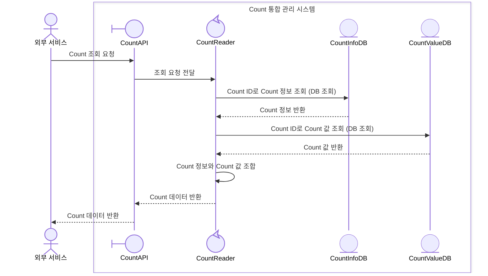
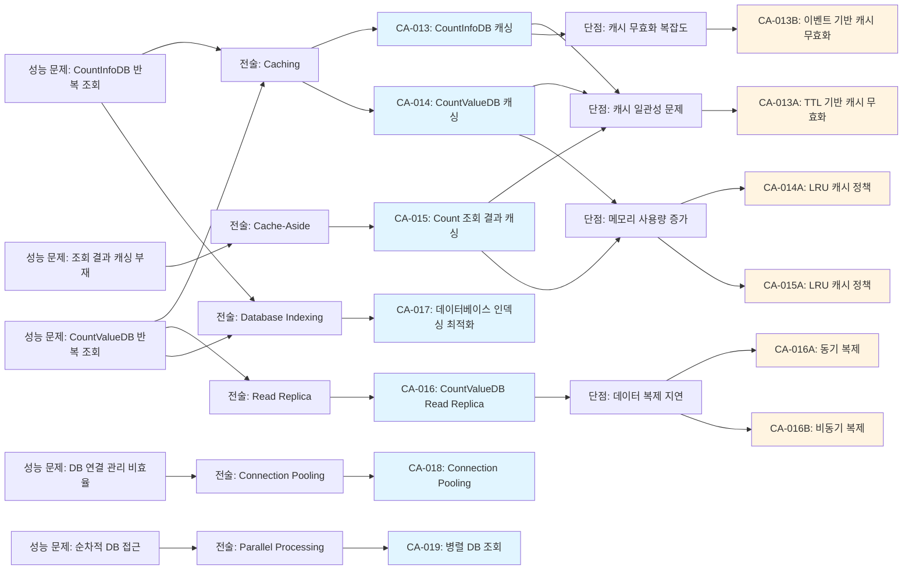
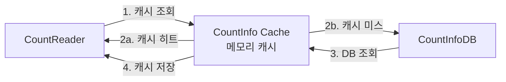
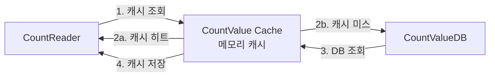
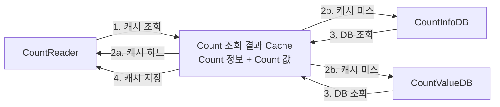
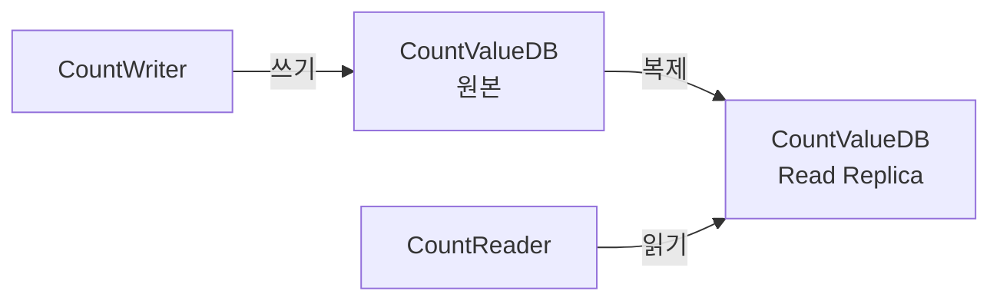

# QS-002-Count-조회-응답-시간 성능 최적화 후보 구조

## 개요

### 목적
이 문서는 QS-002 (Count 조회 응답 시간) 성능 시나리오를 분석하고, 성능 최적화를 위한 후보 구조를 설계합니다.

### 성능 시나리오 요약
- **품질 시나리오**: QS-002-Count-조회-응답-시간
- **품질 속성**: 성능 (응답 시간)
- **NFR-002**: Count 조회 응답 시간 < 100ms
- **QA-002**: Count 조회 응답 시간 최소화 (우선순위 2)
- **관련 Use Case**: UC-002-Count 조회

## 성능 시나리오 분석

### 현재 동작 흐름



### 성능 병목 지점 분석

현재 동작 흐름에서 다음과 같은 성능 병목 지점이 식별됩니다:

1. **CountInfoDB 조회 지연** (단계 3)
   - Count ID로 Count 정보 조회를 위한 DB 조회
   - 매 요청마다 DB 접근 발생
   - 네트워크 지연 + DB 쿼리 실행 시간

2. **CountValueDB 조회 지연** (단계 5)
   - Count ID로 Count 값 조회를 위한 DB 조회
   - 매 요청마다 DB 접근 발생
   - 네트워크 지연 + DB 쿼리 실행 시간

3. **순차적 DB 접근**
   - CountInfoDB 조회 → CountValueDB 조회 순차 실행
   - 총 응답 시간 = 각 단계 지연 시간의 합
   - 병렬 처리 불가

4. **반복 조회 패턴**
   - 동일한 Count ID에 대한 반복 조회
   - 조회 빈도가 높은 Count에 대한 캐싱 부재

## 성능 문제 식별

### 문제 1: CountInfoDB 반복 조회 오버헤드
- **문제**: Count ID로 Count 정보 조회를 위해 매 요청마다 CountInfoDB에 접근
- **영향**: 
  - DB 조회 지연 (네트워크 + 쿼리 실행 시간)
  - DB 연결 리소스 소비
  - 동일한 Count ID에 대한 반복 조회
- **근거**: CountInfoDB는 메타데이터로 변경 빈도가 낮고, 읽기 전용 조회가 대부분임

### 문제 2: CountValueDB 반복 조회 오버헤드
- **문제**: Count 값 조회를 위해 매 요청마다 CountValueDB에 접근
- **영향**:
  - DB 조회 지연 (네트워크 + 쿼리 실행 시간)
  - 동일한 Count ID에 대한 반복 조회
  - 읽기 작업이 많을수록 DB 부하 증가
- **근거**: 조회 작업은 읽기 중심 워크로드로, 캐싱 효과가 큼

### 문제 3: 순차적 DB 접근 패턴
- **문제**: CountInfoDB 조회와 CountValueDB 조회가 순차적으로 실행됨
- **영향**:
  - 총 응답 시간 = CountInfoDB 조회 시간 + CountValueDB 조회 시간
  - 병렬 처리 불가로 인한 응답 시간 증가
- **근거**: 두 조회는 서로 독립적이므로 병렬 처리 가능

### 문제 4: DB 연결 관리 비효율
- **문제**: 매 요청마다 새로운 DB 연결 생성 또는 연결 풀 관리 부족
- **영향**:
  - 연결 생성 오버헤드
  - 연결 풀 고갈 시 대기 시간
  - 리소스 낭비
- **근거**: 높은 동시성 처리 요구사항 (NFR-003: >= 1000 RPS)

### 문제 5: 조회 결과 캐싱 부재
- **문제**: 조회 결과(Count 정보 + Count 값)를 캐싱하지 않음
- **영향**:
  - 매 요청마다 두 번의 DB 조회 필요
  - 동일한 Count ID에 대한 반복 조회 시 불필요한 DB 접근
- **근거**: 조회 빈도가 높은 Count에 대한 캐싱 효과가 큼

## 설계 과정 마인드 맵



## 후보 구조 목록

이 문서에서 다루는 모든 후보 구조:

- **CA-013**: CountInfoDB 캐싱
  - **CA-013A**: TTL 기반 캐시 무효화
  - **CA-013B**: 이벤트 기반 캐시 무효화
- **CA-014**: CountValueDB 캐싱
  - **CA-014A**: LRU 캐시 정책
- **CA-015**: Count 조회 결과 캐싱
  - **CA-015A**: LRU 캐시 정책
- **CA-016**: CountValueDB Read Replica
  - **CA-016A**: 동기 복제
  - **CA-016B**: 비동기 복제
- **CA-017**: 데이터베이스 인덱싱 최적화
- **CA-018**: Connection Pooling
- **CA-019**: 병렬 DB 조회

## 후보 구조 설계

### CA-013: CountInfoDB 캐싱

**ID**: CA-013  
**부모**: -  
**종속 유형**: 최상위

**Description**:

CountInfoDB의 Count 정보 조회를 캐시하여 반복 조회 오버헤드를 제거합니다.

- **해결하려는 문제**: CountInfoDB 반복 조회로 인한 DB 접근 지연 (문제 1)
- **적용하는 패턴/전술**: Caching, Cache-Aside 패턴
- **기대 효과**: 
  - CountInfoDB 조회 시간을 DB 접근 시간에서 메모리 접근 시간으로 단축 (예: 10ms → 0.1ms)
  - DB 부하 감소 및 연결 리소스 절약
  - 전체 응답 시간 단축에 기여
- **트레이드오프**: 
  - 캐시 일관성 문제 (CountInfoDB 변경 시 캐시 무효화 필요)
  - 메모리 사용량 증가
- **종속 후보 구조**: CA-013A, CA-013B (캐시 일관성 문제 해결)

**구조도**:



**동작 방식**:

1. CountReader가 Count 정보 조회 시 먼저 캐시 조회
2. 캐시 히트 시: 캐시에서 즉시 반환 (DB 접근 없음)
3. 캐시 미스 시: CountInfoDB 조회 후 결과를 캐시에 저장
4. 캐시 무효화: CA-013A 또는 CA-013B 적용

**장점**:

- **응답 시간 단축**: CountInfoDB 조회 시간 대폭 감소 (DB 접근 → 메모리 접근)
- **DB 부하 감소**: 반복 조회를 캐시로 처리하여 DB 접근 빈도 감소
- **확장성 향상**: DB 연결 리소스 절약으로 동시 처리량 증가
- **구현 용이성**: 표준적인 캐싱 패턴으로 구현 난이도 낮음

**단점 및 트레이드오프**:

- **캐시 일관성 문제**: CountInfoDB 변경 시 캐시와 실제 데이터 불일치 가능
- **메모리 사용량 증가**: Count 정보를 메모리에 저장하여 메모리 사용량 증가
- **캐시 무효화 복잡도**: 캐시 일관성 유지를 위한 무효화 메커니즘 필요

**종속 후보 구조**:

- **CA-013A**: TTL 기반 캐시 무효화 (캐시 일관성 문제 해결)
- **CA-013B**: 이벤트 기반 캐시 무효화 (캐시 일관성 문제 해결)

---

### CA-013A: TTL 기반 캐시 무효화

**ID**: CA-013A  
**부모**: CA-013  
**종속 유형**: 선택적

**Description**:

CountInfoDB 캐시에 TTL(Time To Live)을 설정하여 일정 시간 후 자동으로 만료되도록 합니다.

- **해결하려는 문제**: CA-013의 캐시 일관성 문제
- **적용하는 패턴/전술**: TTL 기반 캐시 만료
- **기대 효과**: 
  - 캐시 일관성 자동 관리 (TTL 경과 시 자동 갱신)
  - 구현 단순성 (이벤트 처리 불필요)
- **트레이드오프**: 
  - 최대 지연 시간 존재 (TTL 동안 오래된 데이터 제공 가능)
  - CountInfoDB 변경 후 최대 TTL 시간 동안 오래된 데이터 제공

**동작 방식**:

- 각 캐시 항목에 TTL 설정 (예: 5분)
- TTL 경과 시 자동으로 캐시 항목 제거
- 다음 요청 시 CountInfoDB에서 최신 데이터 조회 후 캐시 갱신

**장점**:

- **구현 단순성**: 이벤트 처리 없이 TTL만 설정하면 됨
- **자동 관리**: 수동 캐시 무효화 불필요
- **메모리 효율성**: 만료된 항목 자동 제거

**단점 및 트레이드오프**:

- **최대 지연 시간**: CountInfoDB 변경 후 최대 TTL 시간 동안 오래된 데이터 제공
- **일관성 보장 한계**: 강한 일관성 요구사항에는 부적합

---

### CA-013B: 이벤트 기반 캐시 무효화

**ID**: CA-013B  
**부모**: CA-013  
**종속 유형**: 선택적  
**상충**: CA-013A

**Description**:

CountInfoDB 변경 시 이벤트를 발행하여 해당 Count ID의 캐시를 즉시 무효화합니다.

- **해결하려는 문제**: CA-013의 캐시 일관성 문제
- **적용하는 패턴/전술**: 이벤트 기반 캐시 무효화
- **기대 효과**: 
  - 즉시 일관성 보장 (CountInfoDB 변경 시 즉시 캐시 무효화)
  - 강한 일관성 요구사항 만족
- **트레이드오프**: 
  - 구현 복잡도 증가 (이벤트 발행/구독 메커니즘 필요)
  - 이벤트 처리 오버헤드

**동작 방식**:

1. CountInfoDB 변경 시 변경 이벤트 발행
2. 캐시 서비스가 이벤트 구독
3. 해당 Count ID의 캐시 항목 즉시 제거
4. 다음 요청 시 최신 데이터 조회 후 캐시 갱신

**장점**:

- **즉시 일관성**: CountInfoDB 변경 시 즉시 캐시 무효화
- **강한 일관성 보장**: TTL 기반보다 일관성 보장 수준 높음

**단점 및 트레이드오프**:

- **구현 복잡도**: 이벤트 발행/구독 메커니즘 구현 필요
- **이벤트 처리 오버헤드**: 이벤트 처리 비용 발생
- **이벤트 손실 위험**: 이벤트 전달 실패 시 캐시 일관성 문제

---

### CA-014: CountValueDB 캐싱

**ID**: CA-014  
**부모**: -  
**종속 유형**: 최상위

**Description**:

CountValueDB의 Count 값 조회를 캐시하여 반복 조회 오버헤드를 제거합니다.

- **해결하려는 문제**: CountValueDB 반복 조회로 인한 DB 접근 지연 (문제 2)
- **적용하는 패턴/전술**: Caching, Cache-Aside 패턴
- **기대 효과**: 
  - CountValueDB 조회 시간을 DB 접근 시간에서 메모리 접근 시간으로 단축 (예: 10ms → 0.1ms)
  - DB 부하 감소 및 연결 리소스 절약
  - 전체 응답 시간 단축에 기여
- **트레이드오프**: 
  - 캐시 일관성 문제 (Count 값 변경 시 캐시 무효화 필요)
  - 메모리 사용량 증가
- **종속 후보 구조**: CA-014A (메모리 효율성 개선)

**구조도**:



**동작 방식**:

1. CountReader가 Count 값 조회 시 먼저 캐시 조회
2. 캐시 히트 시: 캐시에서 즉시 반환 (DB 접근 없음)
3. 캐시 미스 시: CountValueDB 조회 후 결과를 캐시에 저장
4. 캐시 무효화: Count 값 변경 시 이벤트 기반 무효화 또는 TTL 기반 만료

**장점**:

- **응답 시간 단축**: CountValueDB 조회 시간 대폭 감소 (DB 접근 → 메모리 접근)
- **DB 부하 감소**: 반복 조회를 캐시로 처리하여 DB 접근 빈도 감소
- **확장성 향상**: DB 연결 리소스 절약으로 동시 처리량 증가
- **조회 성능 향상**: 읽기 중심 워크로드에 효과적

**단점 및 트레이드오프**:

- **캐시 일관성 문제**: Count 값 변경 시 캐시와 실제 데이터 불일치 가능
- **메모리 사용량 증가**: Count 값 데이터를 메모리에 저장하여 메모리 사용량 증가
- **캐시 무효화 복잡도**: Count 값 변경 빈도가 높을수록 캐시 효율성 저하

**종속 후보 구조**:

- **CA-014A**: LRU 캐시 정책 (메모리 효율성 개선)

---

### CA-014A: LRU 캐시 정책

**ID**: CA-014A  
**부모**: CA-014  
**종속 유형**: 선택적

**Description**:

CountValueDB 캐시에 LRU(Least Recently Used) 정책을 적용하여 메모리 사용량을 제한합니다.

- **해결하려는 문제**: CA-014의 메모리 사용량 증가 문제
- **적용하는 패턴/전술**: LRU 캐시 정책
- **기대 효과**: 
  - 메모리 사용량 제한 (최근 사용된 항목만 유지)
  - 자주 사용되는 Count 값에 대한 캐시 효율성 향상
- **트레이드오프**: 
  - 캐시 미스율 증가 가능 (자주 사용되지 않는 항목 제거)

**동작 방식**:

- 캐시 크기 제한 설정 (예: 최대 10,000개 항목)
- 새로운 항목 추가 시 가장 오래 전에 사용된 항목 제거
- 자주 사용되는 Count 값은 캐시에 유지

**장점**:

- **메모리 효율성**: 메모리 사용량 제한
- **자동 관리**: 사용 빈도에 따른 자동 캐시 관리
- **성능 최적화**: 자주 사용되는 데이터에 대한 캐시 효율성 향상

**단점 및 트레이드오프**:

- **캐시 미스율 증가**: 자주 사용되지 않는 항목 제거로 인한 캐시 미스 가능
- **캐시 크기 튜닝 필요**: 적절한 캐시 크기 설정 필요

---

### CA-015: Count 조회 결과 캐싱

**ID**: CA-015  
**부모**: -  
**종속 유형**: 최상위

**Description**:

Count 조회 결과(Count 정보 + Count 값)를 통합하여 캐싱하여 두 번의 DB 조회를 한 번으로 줄입니다.

- **해결하려는 문제**: 조회 결과 캐싱 부재로 인한 반복 DB 접근 (문제 5)
- **적용하는 패턴/전술**: Caching, Cache-Aside 패턴
- **기대 효과**: 
  - CountInfoDB와 CountValueDB 조회를 한 번의 캐시 조회로 대체
  - 응답 시간 대폭 단축 (두 번의 DB 조회 → 한 번의 메모리 접근)
  - DB 부하 감소
- **트레이드오프**: 
  - 캐시 일관성 문제 (Count 정보 또는 Count 값 변경 시 캐시 무효화 필요)
  - 메모리 사용량 증가
- **종속 후보 구조**: CA-015A (메모리 효율성 개선)

**구조도**:



**동작 방식**:

1. CountReader가 Count 조회 시 먼저 조회 결과 캐시 조회
2. 캐시 히트 시: 캐시에서 즉시 반환 (DB 접근 없음)
3. 캐시 미스 시: CountInfoDB와 CountValueDB 조회 후 결과를 조합하여 캐시에 저장
4. 캐시 무효화: Count 정보 또는 Count 값 변경 시 캐시 무효화

**장점**:

- **응답 시간 단축**: 두 번의 DB 조회를 한 번의 캐시 조회로 대체
- **DB 부하 감소**: 반복 조회를 캐시로 처리하여 DB 접근 빈도 대폭 감소
- **전체 성능 향상**: CountInfoDB와 CountValueDB 조회를 모두 최적화

**단점 및 트레이드오프**:

- **캐시 일관성 문제**: Count 정보 또는 Count 값 변경 시 캐시 무효화 필요
- **메모리 사용량 증가**: 조회 결과 전체를 메모리에 저장
- **캐시 무효화 복잡도**: 두 데이터 소스 변경 모두 감지 필요

**종속 후보 구조**:

- **CA-015A**: LRU 캐시 정책 (메모리 효율성 개선)

---

### CA-015A: LRU 캐시 정책

**ID**: CA-015A  
**부모**: CA-015  
**종속 유형**: 선택적

**Description**:

Count 조회 결과 캐시에 LRU(Least Recently Used) 정책을 적용하여 메모리 사용량을 제한합니다.

- **해결하려는 문제**: CA-015의 메모리 사용량 증가 문제
- **적용하는 패턴/전술**: LRU 캐시 정책
- **기대 효과**: 
  - 메모리 사용량 제한 (최근 사용된 항목만 유지)
  - 자주 사용되는 Count 조회 결과에 대한 캐시 효율성 향상
- **트레이드오프**: 
  - 캐시 미스율 증가 가능 (자주 사용되지 않는 항목 제거)

**동작 방식**:

- 캐시 크기 제한 설정 (예: 최대 5,000개 항목)
- 새로운 항목 추가 시 가장 오래 전에 사용된 항목 제거
- 자주 사용되는 Count 조회 결과는 캐시에 유지

**장점**:

- **메모리 효율성**: 메모리 사용량 제한
- **자동 관리**: 사용 빈도에 따른 자동 캐시 관리
- **성능 최적화**: 자주 사용되는 조회 결과에 대한 캐시 효율성 향상

**단점 및 트레이드오프**:

- **캐시 미스율 증가**: 자주 사용되지 않는 항목 제거로 인한 캐시 미스 가능
- **캐시 크기 튜닝 필요**: 적절한 캐시 크기 설정 필요

---

### CA-016: CountValueDB Read Replica

**ID**: CA-016  
**부모**: -  
**종속 유형**: 최상위

**Description**:

CountValueDB의 읽기 전용 복제본을 생성하여 읽기 작업을 분산시킵니다.

- **해결하려는 문제**: CountValueDB 읽기 부하로 인한 성능 저하 (문제 2)
- **적용하는 패턴/전술**: Read Replica
- **기대 효과**: 
  - 읽기 작업을 복제본으로 분산하여 원본 DB 부하 감소
  - 읽기 성능 향상 (복제본 전용 리소스 활용)
  - 확장성 향상 (복제본 추가로 읽기 처리량 확장)
- **트레이드오프**: 
  - 데이터 복제 지연 (복제본이 최신 데이터를 반영하는 데 시간 소요)
  - 인프라 비용 증가
- **종속 후보 구조**: CA-016A, CA-016B (복제 지연 문제 해결)

**구조도**:



**동작 방식**:

1. CountWriter는 원본 CountValueDB에만 쓰기
2. 원본 CountValueDB의 변경사항이 복제본에 복제
3. CountReader는 복제본에서 읽기 수행
4. 복제 지연: CA-016A 또는 CA-016B 적용

**장점**:

- **읽기 성능 향상**: 읽기 작업을 복제본으로 분산
- **원본 DB 부하 감소**: 쓰기 작업에 집중하여 원본 DB 성능 향상
- **확장성 향상**: 복제본 추가로 읽기 처리량 확장 가능
- **가용성 향상**: 원본 장애 시 복제본으로 읽기 가능

**단점 및 트레이드오프**:

- **데이터 복제 지연**: 복제본이 최신 데이터를 반영하는 데 시간 소요
- **인프라 비용 증가**: 복제본 유지를 위한 추가 인프라 필요
- **복제 관리 복잡도**: 복제 상태 모니터링 및 관리 필요

**종속 후보 구조**:

- **CA-016A**: 동기 복제 (복제 지연 최소화)
- **CA-016B**: 비동기 복제 (성능 우선)

---

### CA-016A: 동기 복제

**ID**: CA-016A  
**부모**: CA-016  
**종속 유형**: 선택적  
**상충**: CA-016B

**Description**:

CountValueDB의 변경사항을 복제본에 동기적으로 복제하여 복제 지연을 최소화합니다.

- **해결하려는 문제**: CA-016의 데이터 복제 지연 문제
- **적용하는 패턴/전술**: 동기 복제
- **기대 효과**: 
  - 복제 지연 최소화 (쓰기 완료 시 복제본에도 즉시 반영)
  - 강한 일관성 보장
- **트레이드오프**: 
  - 쓰기 성능 저하 (복제본 복제 완료 대기)
  - 복제본 장애 시 쓰기 실패 가능

**동작 방식**:

- 원본 DB에 쓰기 시 복제본에도 동기적으로 복제
- 복제 완료 후 쓰기 완료 응답
- 복제본 장애 시 쓰기 실패

**장점**:

- **복제 지연 최소화**: 쓰기 완료 시 복제본에도 즉시 반영
- **강한 일관성**: 원본과 복제본의 데이터 일관성 보장

**단점 및 트레이드오프**:

- **쓰기 성능 저하**: 복제 완료 대기로 인한 쓰기 지연 증가
- **복제본 장애 영향**: 복제본 장애 시 쓰기 실패 가능
- **복제본 수 제한**: 동기 복제는 복제본 수가 많을수록 성능 저하

---

### CA-016B: 비동기 복제

**ID**: CA-016B  
**부모**: CA-016  
**종속 유형**: 선택적  
**상충**: CA-016A

**Description**:

CountValueDB의 변경사항을 복제본에 비동기적으로 복제하여 쓰기 성능을 우선시합니다.

- **해결하려는 문제**: CA-016의 데이터 복제 지연 문제 (성능 우선 관점)
- **적용하는 패턴/전술**: 비동기 복제
- **기대 효과**: 
  - 쓰기 성능 향상 (복제 완료 대기 없음)
  - 복제본 수 확장 용이
- **트레이드오프**: 
  - 복제 지연 존재 (최신 데이터 반영 지연)
  - Eventual Consistency (최종 일관성)

**동작 방식**:

- 원본 DB에 쓰기 시 즉시 완료 응답
- 백그라운드에서 비동기적으로 복제본에 복제
- 복제 지연 시간 존재 (일반적으로 수백 밀리초)

**장점**:

- **쓰기 성능 향상**: 복제 완료 대기 없이 즉시 응답
- **복제본 수 확장**: 복제본 수가 많아도 쓰기 성능 영향 최소
- **복제본 장애 격리**: 복제본 장애가 쓰기에 영향 없음

**단점 및 트레이드오프**:

- **복제 지연**: 최신 데이터 반영 지연 (일반적으로 수백 밀리초)
- **일관성 보장 한계**: Eventual Consistency (최종 일관성)

---

### CA-017: 데이터베이스 인덱싱 최적화

**ID**: CA-017  
**부모**: -  
**종속 유형**: 최상위

**Description**:

CountInfoDB와 CountValueDB의 쿼리 성능을 향상시키기 위해 적절한 인덱스를 추가합니다.

- **해결하려는 문제**: DB 쿼리 실행 시간 (문제 1, 2)
- **적용하는 패턴/전술**: Database Indexing
- **기대 효과**: 
  - Count ID 기반 조회 성능 향상 (인덱스 스캔)
  - 전체 테이블 스캔 방지
  - 쿼리 실행 시간 단축
- **트레이드오프**: 
  - 인덱스 유지 비용 (쓰기 성능 약간 저하)
  - 저장 공간 사용량 증가

**인덱스 설계**:

- **CountInfoDB**: Count ID에 대한 Primary Key 또는 Unique Index
- **CountValueDB**: Count ID에 대한 Index (조회 성능 향상)

**장점**:

- **조회 성능 향상**: 인덱스 스캔으로 조회 시간 단축 (예: 10ms → 1ms)
- **구현 단순성**: 인덱스 추가만으로 성능 개선
- **비용 효율성**: 추가 인프라 없이 성능 개선

**단점 및 트레이드오프**:

- **쓰기 성능 약간 저하**: 인덱스 유지 비용 (하지만 Count ID는 변경되지 않으므로 영향 최소)
- **저장 공간 증가**: 인덱스 저장 공간 필요

---

### CA-018: Connection Pooling

**ID**: CA-018  
**부모**: -  
**종속 유형**: 최상위

**Description**:

데이터베이스 연결을 풀링하여 연결 생성 오버헤드를 제거하고 동시 처리량을 향상시킵니다.

- **해결하려는 문제**: DB 연결 관리 비효율 (문제 4)
- **적용하는 패턴/전술**: Connection Pooling, Resource Pooling
- **기대 효과**: 
  - 연결 생성 오버헤드 제거
  - 동시 처리량 향상 (NFR-003: >= 1000 RPS 달성)
  - 리소스 효율성 향상
- **트레이드오프**: 
  - 연결 풀 크기 튜닝 필요
  - 메모리 사용량 증가 (연결 풀 유지)

**동작 방식**:

1. **연결 풀 초기화**: 애플리케이션 시작 시 미리 연결 생성
2. **연결 재사용**: 요청 처리 시 풀에서 연결 가져오기
3. **연결 반환**: 요청 처리 완료 후 풀에 연결 반환
4. **연결 풀 관리**: 최소/최대 연결 수 관리, 유휴 연결 타임아웃

**장점**:

- **연결 오버헤드 제거**: 연결 생성 시간 제거 (예: 5ms → 0ms)
- **동시 처리량 향상**: 연결 풀을 통한 동시 요청 처리 지원
- **리소스 효율성**: 연결 재사용으로 리소스 효율성 향상
- **안정성 향상**: 연결 풀 관리를 통한 안정적인 연결 관리

**단점 및 트레이드오프**:

- **연결 풀 크기 튜닝**: 적절한 풀 크기 설정 필요
- **메모리 사용량**: 연결 풀 유지를 위한 메모리 사용
- **연결 풀 고갈**: 부하 증가 시 연결 풀 고갈 가능

---

### CA-019: 병렬 DB 조회

**ID**: CA-019  
**부모**: -  
**종속 유형**: 최상위

**Description**:

CountInfoDB 조회와 CountValueDB 조회를 병렬로 수행하여 순차적 DB 접근 지연을 제거합니다.

- **해결하려는 문제**: 순차적 DB 접근 패턴으로 인한 응답 시간 증가 (문제 3)
- **적용하는 패턴/전술**: Parallel Processing
- **기대 효과**: 
  - 총 응답 시간 = max(CountInfoDB 조회 시간, CountValueDB 조회 시간)
  - 순차 실행 대비 응답 시간 단축 (예: 20ms → 10ms)
- **트레이드오프**: 
  - 구현 복잡도 증가 (비동기 처리 필요)
  - 스레드/코루틴 리소스 사용

**구조도**:

```mermaid
sequenceDiagram
    READER[CountReader]
    InfoDB[CountInfoDB]
    ValueDB[CountValueDB]
    
    READER->>InfoDB: 병렬 조회 1
    READER->>ValueDB: 병렬 조회 2
    InfoDB-->>READER: Count 정보 반환
    ValueDB-->>READER: Count 값 반환
    READER->>READER: 결과 조합
```

**동작 방식**:

1. CountReader가 CountInfoDB와 CountValueDB 조회를 병렬로 시작
2. 두 조회가 동시에 실행됨
3. 두 조회 결과를 모두 받은 후 조합하여 반환
4. 총 응답 시간 = 두 조회 중 더 긴 시간

**장점**:

- **응답 시간 단축**: 순차 실행 대비 응답 시간 단축 (두 조회 중 더 긴 시간만 소요)
- **DB 부하 분산**: 두 DB에 동시 접근하여 전체 처리 시간 단축
- **확장성 향상**: 병렬 처리로 처리량 향상

**단점 및 트레이드오프**:

- **구현 복잡도**: 비동기 처리 구현 필요
- **리소스 사용**: 스레드/코루틴 리소스 사용
- **에러 처리 복잡도**: 병렬 처리 시 에러 처리 복잡도 증가

---

## 후보 구조 간 관계

### 상충 관계

- **CA-016A vs CA-016B**: 동기 복제와 비동기 복제는 서로 다른 복제 전략
  - CA-016A: 동기 복제 (일관성 우선)
  - CA-016B: 비동기 복제 (성능 우선)

- **CA-013A vs CA-013B**: TTL 기반과 이벤트 기반 캐시 무효화는 서로 다른 전략
  - CA-013A: TTL 기반 (단순성 우선)
  - CA-013B: 이벤트 기반 (일관성 우선)

### 종속 관계

- **CA-013A, CA-013B**: CA-013에 종속 (캐시 일관성 문제 해결)
- **CA-014A**: CA-014에 종속 (메모리 효율성 개선)
- **CA-015A**: CA-015에 종속 (메모리 효율성 개선)
- **CA-016A, CA-016B**: CA-016에 종속 (복제 지연 문제 해결)

### 병행 적용 가능

다음 후보 구조들은 서로 독립적이므로 병행 적용 가능:

- **CA-013** (CountInfoDB 캐싱) + **CA-014** (CountValueDB 캐싱) 또는 **CA-015** (조회 결과 캐싱)
- **CA-016** (Read Replica) + **CA-013**, **CA-014**, **CA-015** (캐싱)
- **CA-017** (인덱싱) + **CA-018** (Connection Pooling) + **CA-019** (병렬 조회)
- 모든 후보 구조는 **CA-017**, **CA-018**과 병행 적용 가능

## 성능 개선 효과 예상

### 개별 후보 구조 효과

| 후보 구조 | 개선 효과 | 예상 응답 시간 단축 |
|---------|---------|------------------|
| CA-013 | CountInfoDB 조회 최적화 | ~10ms |
| CA-014 | CountValueDB 조회 최적화 | ~10ms |
| CA-015 | 조회 결과 통합 캐싱 | ~20ms (두 조회 모두 최적화) |
| CA-016 | Read Replica로 읽기 분산 | ~5ms (부하 분산 효과) |
| CA-017 | DB 쿼리 최적화 | ~5ms |
| CA-018 | 연결 오버헤드 제거 | ~5ms |
| CA-019 | 병렬 DB 조회 | ~10ms (순차 → 병렬) |

### 조합 효과

**최적 조합 (강한 일관성 요구)**:
- CA-013 + CA-013B + CA-014 + CA-014A + CA-017 + CA-018 + CA-019
- 예상 응답 시간: ~20-30ms (기존 100ms+ 대비 70-80% 단축)

**최적 조합 (성능 우선)**:
- CA-015 + CA-015A + CA-016 + CA-016B + CA-017 + CA-018 + CA-019
- 예상 응답 시간: ~10-15ms (기존 100ms+ 대비 85-90% 단축)

## 관련 품질 요구사항

### 직접 관련
- **NFR-002**: Count 조회 응답 시간 < 100ms
- **QA-002**: Count 조회 응답 시간 최소화 (우선순위 2)
- **QS-002**: Count 조회 응답 시간

### 간접 관련
- **NFR-003**: 동시 요청 처리량 >= 1000 RPS (CA-018, CA-016 관련)
- **QA-004**: Count 조회 서비스 독립성 최대화 (CA-016은 서비스 내부 최적화)

## 관련 Use Case

- **UC-002**: Count 조회

## 비고

- 모든 후보 구조는 독립적으로 평가되며, 채택 여부가 결정됨
- 종속 후보 구조는 부모 후보 구조의 단점을 보완하기 위한 추가 설계 결정임
- 후보 구조 간 상충 관계가 있을 수 있으며, 평가 단계에서 비교 분석이 필요함
- 성능 개선 효과는 실제 환경에 따라 달라질 수 있으므로, 프로토타입을 통한 검증이 권장됨
- QS-001 (Count 저장 응답 시간)과 일부 후보 구조가 중복될 수 있으나, 조회 작업 특성에 맞게 최적화됨
