# QS-005-대시보드-갱신-시간 성능 최적화 후보 구조

## 개요

### 목적
이 문서는 QS-005 (대시보드 갱신 시간) 성능 시나리오를 분석하고, 성능 최적화를 위한 후보 구조를 설계합니다.

### 성능 시나리오 요약
- **품질 시나리오**: QS-005-대시보드-갱신-시간
- **품질 속성**: 성능 (응답 시간, 실시간성)
- **QA-011**: 대시보드 갱신 시간 최소화 (우선순위 11)
- **관련 Use Case**: UC-005-Count 모니터링

## 성능 시나리오 분석

### 현재 동작 흐름

#### 폴링 방식 시나리오

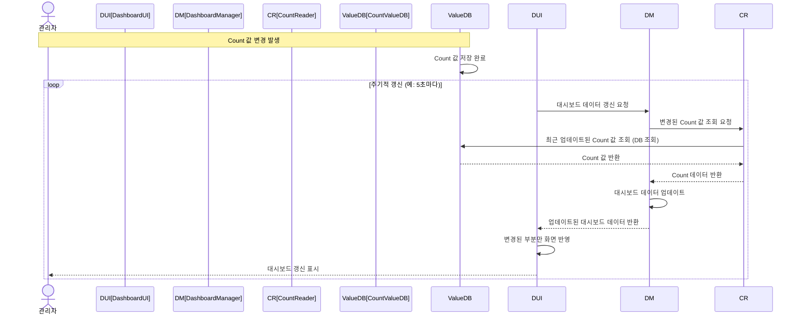

#### 이벤트 기반 시나리오

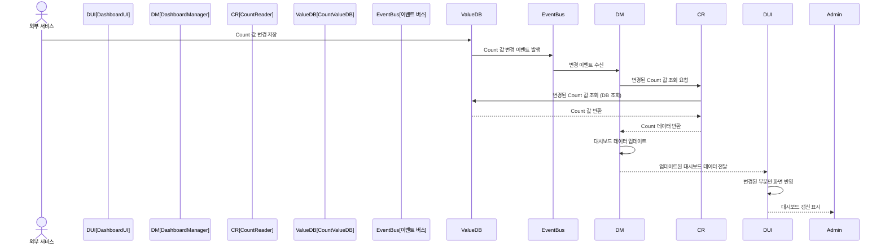

### 성능 병목 지점 분석

현재 동작 흐름에서 다음과 같은 성능 병목 지점이 식별됩니다:

1. **폴링 주기 지연** (폴링 방식)
   - 주기적 갱신으로 인한 최대 지연 시간 (예: 5초 주기 시 최대 5초 지연)
   - 변경 발생 후 다음 폴링 시점까지 대기 시간

2. **이벤트 전달 지연** (이벤트 기반)
   - 이벤트 버스 전달 시간
   - 이벤트 처리 큐 대기 시간

3. **DB 조회 지연**
   - CountValueDB에서 변경된 Count 값 조회
   - 네트워크 지연 + DB 쿼리 실행 시간

4. **네트워크 전송 지연**
   - DashboardManager → DashboardUI 데이터 전송
   - HTTP 요청/응답 오버헤드

5. **불필요한 데이터 전송**
   - 변경되지 않은 Count 데이터도 함께 전송
   - 전체 대시보드 데이터 재전송

## 성능 문제 식별

### 문제 1: 폴링 방식의 주기적 지연
- **문제**: 폴링 방식은 주기적으로 갱신 요청을 수행하므로 변경 발생 후 다음 폴링 시점까지 대기 시간 발생
- **영향**: 
  - 최대 지연 시간 = 폴링 주기 (예: 5초 주기 시 최대 5초 지연)
  - 실시간성 저하
  - 불필요한 폴링 요청 (변경이 없어도 주기적으로 요청)
- **근거**: 폴링 방식은 실시간 갱신에 부적합하며, 변경 빈도가 낮을 때 비효율적

### 문제 2: 이벤트 기반 방식의 DB 조회 지연
- **문제**: 이벤트 수신 후 DB에서 변경된 Count 값을 조회하는 과정에서 지연 발생
- **영향**:
  - 이벤트 수신 → DB 조회 → 데이터 전송까지의 시간 합산
  - DB 조회 지연이 갱신 시간에 직접 영향
- **근거**: 이벤트에는 변경 정보만 포함되고 실제 데이터는 DB에서 조회해야 함

### 문제 3: HTTP 요청/응답 오버헤드
- **문제**: DashboardManager와 DashboardUI 간 HTTP 요청/응답으로 인한 오버헤드
- **영향**:
  - HTTP 헤더 오버헤드
  - 연결 설정/해제 오버헤드
  - 요청/응답 라운드트립 시간
- **근거**: 실시간 갱신에는 지속적인 연결이 더 효율적

### 문제 4: 전체 데이터 재전송
- **문제**: 변경된 Count 값만 전송하지 않고 전체 대시보드 데이터를 재전송
- **영향**:
  - 네트워크 대역폭 낭비
  - 데이터 처리 시간 증가
  - UI 렌더링 시간 증가
- **근거**: 변경된 부분만 전송하면 네트워크 및 처리 시간 단축 가능

### 문제 5: 변경 감지 비효율
- **문제**: 변경된 Count를 식별하기 위해 DB에서 최근 업데이트된 값 조회
- **영향**:
  - DB 쿼리 실행 시간
  - 변경되지 않은 Count도 조회 가능
- **근거**: 이벤트에 변경 정보가 포함되면 DB 조회 최소화 가능

### 문제 6: 대시보드 제공과 갱신 로직의 결합
- **문제**: DashboardUI와 DashboardManager가 같은 서비스에 있어 갱신 로직의 부하가 UI 제공에 영향을 미칠 수 있음
- **영향**:
  - 갱신 로직의 높은 부하가 UI 응답 시간에 영향
  - 갱신 서비스의 독립적인 스케일링 불가
  - 갱신 로직 변경 시 UI 서비스도 재배포 필요
- **근거**: UI 제공과 갱신 로직은 서로 다른 확장 패턴과 배포 주기를 가짐

## 설계 과정 마인드 맵

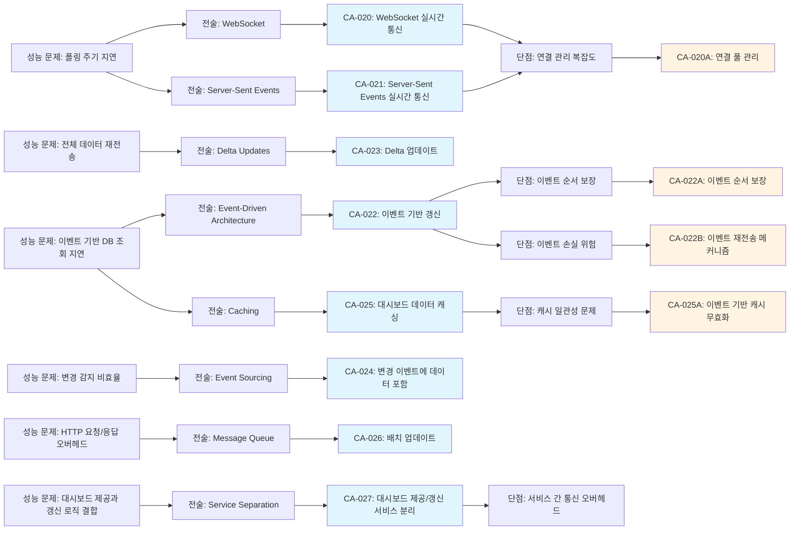

## 후보 구조 목록

이 문서에서 다루는 모든 후보 구조:

- **CA-020**: WebSocket 실시간 통신
  - **CA-020A**: 연결 풀 관리
- **CA-021**: Server-Sent Events 실시간 통신
- **CA-022**: 이벤트 기반 갱신
  - **CA-022A**: 이벤트 순서 보장
  - **CA-022B**: 이벤트 재전송 메커니즘
- **CA-023**: Delta 업데이트
- **CA-024**: 변경 이벤트에 데이터 포함
- **CA-025**: 대시보드 데이터 캐싱
  - **CA-025A**: 이벤트 기반 캐시 무효화
- **CA-026**: 배치 업데이트
- **CA-027**: 대시보드 제공/갱신 서비스 분리

## 후보 구조 설계

### CA-020: WebSocket 실시간 통신

**ID**: CA-020  
**부모**: -  
**종속 유형**: 최상위  
**상충**: CA-021

**Description**:

DashboardUI와 DashboardManager 간 WebSocket 연결을 구축하여 실시간 양방향 통신을 제공합니다.

- **해결하려는 문제**: HTTP 요청/응답 오버헤드 및 폴링 방식의 주기적 지연 (문제 1, 3)
- **적용하는 패턴/전술**: WebSocket, Push-based Communication
- **기대 효과**: 
  - 실시간 양방향 통신 (폴링 지연 제거)
  - HTTP 오버헤드 제거 (지속적인 연결)
  - 서버에서 클라이언트로 즉시 푸시 가능
  - 갱신 시간 대폭 단축 (폴링 주기 → 즉시 전달)
- **트레이드오프**: 
  - 연결 관리 복잡도 증가
  - 서버 리소스 사용 (연결 유지)
  - 연결 장애 처리 필요
- **종속 후보 구조**: CA-020A (연결 관리 개선)

**구조도**:

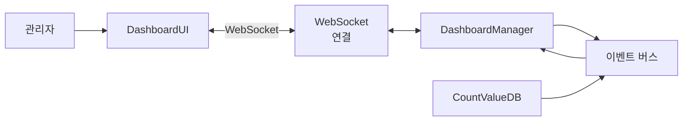

**동작 방식**:

1. 대시보드 열기 시 WebSocket 연결 설정
2. Count 값 변경 시 이벤트 버스를 통해 DashboardManager에 알림
3. DashboardManager가 변경된 데이터를 WebSocket을 통해 DashboardUI로 즉시 푸시
4. DashboardUI가 수신한 데이터로 화면 갱신
5. 연결 유지 및 하트비트로 연결 상태 확인

**장점**:

- **실시간 갱신**: 폴링 지연 제거, 즉시 갱신 가능
- **효율적인 통신**: HTTP 오버헤드 제거, 지속적인 연결
- **양방향 통신**: 클라이언트에서도 서버로 요청 가능
- **낮은 지연**: 연결 설정 오버헤드 없이 즉시 전달

**단점 및 트레이드오프**:

- **연결 관리 복잡도**: 연결 유지, 재연결, 장애 처리 필요
- **서버 리소스 사용**: 각 클라이언트마다 연결 유지 필요
- **방화벽/프록시 이슈**: 일부 네트워크 환경에서 제한 가능
- **확장성 제약**: 연결 수가 많을수록 서버 리소스 부담

**종속 후보 구조**:

- **CA-020A**: 연결 풀 관리 (연결 관리 개선)

---

### CA-020A: 연결 풀 관리

**ID**: CA-020A  
**부모**: CA-020  
**종속 유형**: 선택적

**Description**:

WebSocket 연결의 생명주기를 효율적으로 관리하고 재연결 메커니즘을 제공합니다.

- **해결하려는 문제**: CA-020의 연결 관리 복잡도 문제
- **적용하는 패턴/전술**: Connection Pooling, Reconnection Strategy
- **기대 효과**: 
  - 연결 안정성 향상 (자동 재연결)
  - 연결 리소스 효율적 관리
  - 장애 복구 자동화
- **트레이드오프**: 
  - 구현 복잡도 증가
  - 재연결 시 일시적 데이터 손실 가능

**동작 방식**:

- **연결 풀 관리**: 활성 연결 추적 및 관리
- **자동 재연결**: 연결 끊김 감지 시 자동 재연결
- **하트비트**: 주기적으로 연결 상태 확인
- **백오프 전략**: 재연결 실패 시 지수 백오프로 재시도

**장점**:

- **연결 안정성**: 자동 재연결로 연결 유지
- **장애 복구**: 연결 장애 시 자동 복구
- **리소스 효율성**: 연결 리소스 효율적 관리

**단점 및 트레이드오프**:

- **구현 복잡도**: 재연결 로직 구현 필요
- **일시적 데이터 손실**: 재연결 중 발생한 변경사항 손실 가능

---

### CA-021: Server-Sent Events 실시간 통신

**ID**: CA-021  
**부모**: -  
**종속 유형**: 최상위  
**상충**: CA-020

**Description**:

DashboardUI와 DashboardManager 간 Server-Sent Events(SSE)를 사용하여 서버에서 클라이언트로 단방향 실시간 통신을 제공합니다.

- **해결하려는 문제**: HTTP 요청/응답 오버헤드 및 폴링 방식의 주기적 지연 (문제 1, 3)
- **적용하는 패턴/전술**: Server-Sent Events, Push-based Communication
- **기대 효과**: 
  - 실시간 단방향 통신 (폴링 지연 제거)
  - HTTP 기반으로 구현 단순성
  - 서버에서 클라이언트로 즉시 푸시 가능
  - 갱신 시간 대폭 단축
- **트레이드오프**: 
  - 단방향 통신만 지원 (클라이언트 → 서버는 별도 HTTP 요청 필요)
  - 연결 관리 필요

**구조도**:

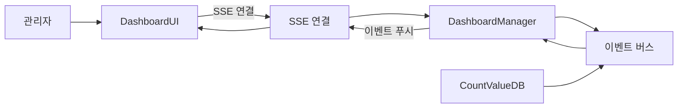

**동작 방식**:

1. 대시보드 열기 시 SSE 연결 설정
2. Count 값 변경 시 이벤트 버스를 통해 DashboardManager에 알림
3. DashboardManager가 변경된 데이터를 SSE를 통해 DashboardUI로 즉시 푸시
4. DashboardUI가 수신한 이벤트로 화면 갱신
5. 연결 유지 및 자동 재연결

**장점**:

- **실시간 갱신**: 폴링 지연 제거, 즉시 갱신 가능
- **구현 단순성**: HTTP 기반으로 구현 용이
- **자동 재연결**: 브라우저가 자동으로 재연결 처리
- **방화벽 친화적**: HTTP 기반으로 방화벽 통과 용이

**단점 및 트레이드오프**:

- **단방향 통신**: 서버 → 클라이언트만 지원 (클라이언트 → 서버는 별도 HTTP 요청)
- **연결 수 제한**: 브라우저당 연결 수 제한 (일반적으로 6개)
- **서버 리소스 사용**: 각 클라이언트마다 연결 유지 필요

---

### CA-022: 이벤트 기반 갱신

**ID**: CA-022  
**부모**: -  
**종속 유형**: 최상위

**Description**:

Count 값 변경 시 이벤트를 발행하고, DashboardManager가 이벤트를 구독하여 변경사항을 즉시 감지합니다.

- **해결하려는 문제**: 폴링 방식의 주기적 지연 및 변경 감지 비효율 (문제 1, 5)
- **적용하는 패턴/전술**: Event-Driven Architecture, Pub/Sub Pattern
- **기대 효과**: 
  - 변경 발생 시 즉시 감지 (폴링 지연 제거)
  - 불필요한 폴링 요청 제거
  - 실시간 갱신 가능
- **트레이드오프**: 
  - 이벤트 순서 보장 필요
  - 이벤트 손실 위험
  - 이벤트 처리 복잡도
- **종속 후보 구조**: CA-022A, CA-022B (이벤트 처리 안정성 개선)

**구조도**:

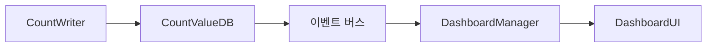

**동작 방식**:

1. Count 값 변경 시 CountWriter가 변경 이벤트 발행
2. 이벤트 버스가 이벤트를 구독자에게 전달
3. DashboardManager가 이벤트 수신
4. DashboardManager가 변경된 Count 데이터 처리 및 DashboardUI에 전달

**장점**:

- **즉시 감지**: 변경 발생 시 즉시 이벤트 발행
- **효율성**: 변경이 있을 때만 처리 (폴링 불필요)
- **확장성**: 여러 구독자가 동일 이벤트 구독 가능
- **느슨한 결합**: 이벤트 발행자와 구독자 간 결합도 낮음

**단점 및 트레이드오프**:

- **이벤트 순서 보장**: 이벤트 처리 순서 보장 필요
- **이벤트 손실 위험**: 이벤트 전달 실패 시 데이터 손실 가능
- **이벤트 처리 복잡도**: 이벤트 처리 로직 구현 필요

**종속 후보 구조**:

- **CA-022A**: 이벤트 순서 보장 (이벤트 처리 안정성 개선)
- **CA-022B**: 이벤트 재전송 메커니즘 (이벤트 손실 위험 완화)

---

### CA-022A: 이벤트 순서 보장

**ID**: CA-022A  
**부모**: CA-022  
**종속 유형**: 선택적

**Description**:

이벤트 처리 순서를 보장하여 동일 Count에 대한 여러 변경사항이 올바른 순서로 처리되도록 합니다.

- **해결하려는 문제**: CA-022의 이벤트 순서 보장 문제
- **적용하는 패턴/전술**: Event Ordering, Partition Key
- **기대 효과**: 
  - 동일 Count에 대한 이벤트 순서 보장
  - 데이터 일관성 보장
- **트레이드오프**: 
  - 이벤트 처리 지연 가능 (순서 대기)
  - 구현 복잡도 증가

**동작 방식**:

- **Partition Key**: Count ID를 기준으로 이벤트 파티셔닝
- **순서 보장**: 동일 파티션 내 이벤트 순서 보장
- **순차 처리**: 동일 Count ID의 이벤트는 순차적으로 처리

**장점**:

- **데이터 일관성**: 이벤트 순서 보장으로 데이터 일관성 유지
- **정확한 갱신**: 올바른 순서로 갱신되어 최종 상태 정확

**단점 및 트레이드오프**:

- **처리 지연**: 순서 대기로 인한 처리 지연 가능
- **구현 복잡도**: 파티셔닝 및 순서 보장 로직 구현 필요

---

### CA-022B: 이벤트 재전송 메커니즘

**ID**: CA-022B  
**부모**: CA-022  
**종속 유형**: 선택적

**Description**:

이벤트 전달 실패 시 재전송 메커니즘을 제공하여 이벤트 손실을 방지합니다.

- **해결하려는 문제**: CA-022의 이벤트 손실 위험
- **적용하는 패턴/전술**: At-Least-Once Delivery, Retry Mechanism
- **기대 효과**: 
  - 이벤트 손실 방지
  - 안정적인 이벤트 전달
- **트레이드오프**: 
  - 중복 이벤트 처리 필요
  - 구현 복잡도 증가

**동작 방식**:

- **이벤트 저장**: 발행된 이벤트를 일정 기간 저장
- **재전송**: 전달 실패 시 재전송
- **중복 제거**: 수신 측에서 중복 이벤트 제거 (Idempotency)

**장점**:

- **이벤트 손실 방지**: 재전송으로 이벤트 손실 최소화
- **안정성 향상**: 네트워크 장애 시에도 이벤트 전달 보장

**단점 및 트레이드오프**:

- **중복 처리**: 중복 이벤트 처리 로직 필요
- **저장소 필요**: 이벤트 저장을 위한 저장소 필요
- **구현 복잡도**: 재전송 및 중복 제거 로직 구현 필요

---

### CA-023: Delta 업데이트

**ID**: CA-023  
**부모**: -  
**종속 유형**: 최상위

**Description**:

변경된 Count 데이터만 전송하여 전체 대시보드 데이터 재전송을 방지합니다.

- **해결하려는 문제**: 전체 데이터 재전송으로 인한 네트워크 및 처리 시간 증가 (문제 4)
- **적용하는 패턴/전술**: Delta Updates, Incremental Updates
- **기대 효과**: 
  - 네트워크 대역폭 절감 (변경된 데이터만 전송)
  - 데이터 처리 시간 단축
  - UI 렌더링 시간 단축 (변경된 부분만 업데이트)
  - 갱신 시간 단축
- **트레이드오프**: 
  - 변경 감지 로직 필요
  - 클라이언트 측 상태 관리 필요

**구조도**:

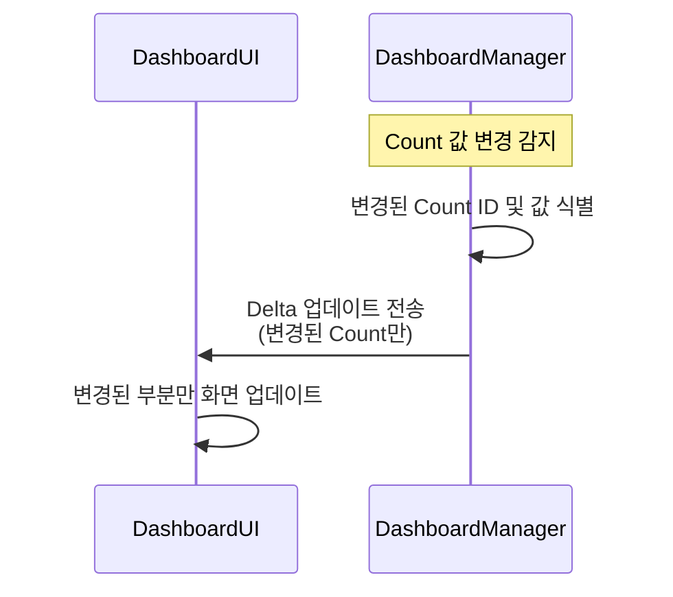

**동작 방식**:

1. Count 값 변경 시 변경된 Count ID와 값만 식별
2. DashboardManager가 변경된 Count 데이터만 Delta 형식으로 전송
3. DashboardUI가 수신한 Delta 데이터로 해당 부분만 업데이트
4. 전체 대시보드 데이터 재전송 없이 부분 업데이트

**장점**:

- **네트워크 효율성**: 변경된 데이터만 전송하여 대역폭 절감
- **처리 시간 단축**: 전체 데이터 처리 불필요
- **UI 성능 향상**: 변경된 부분만 렌더링하여 성능 향상
- **확장성**: 대시보드 크기가 커져도 효율적

**단점 및 트레이드오프**:

- **변경 감지 로직**: 변경된 데이터 식별 로직 필요
- **상태 관리**: 클라이언트 측 이전 상태 관리 필요
- **동기화 복잡도**: Delta 적용 시 동기화 로직 필요

---

### CA-024: 변경 이벤트에 데이터 포함

**ID**: CA-024  
**부모**: -  
**종속 유형**: 최상위

**Description**:

Count 값 변경 이벤트에 변경된 Count 데이터를 포함하여 DB 조회를 제거합니다.

- **해결하려는 문제**: 이벤트 수신 후 DB 조회로 인한 지연 (문제 2)
- **적용하는 패턴/전술**: Event Sourcing, Event Enrichment
- **기대 효과**: 
  - DB 조회 제거로 갱신 시간 단축
  - 이벤트 수신 즉시 갱신 가능
  - 네트워크 라운드트립 감소
- **트레이드오프**: 
  - 이벤트 크기 증가
  - 이벤트 발행 시점에 데이터 포함 필요

**구조도**:

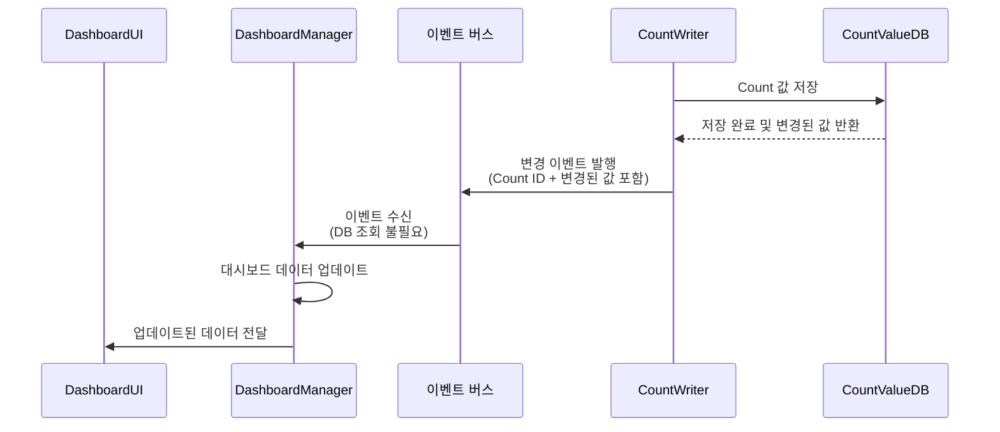

**동작 방식**:

1. Count 값 변경 시 CountWriter가 변경된 값을 포함한 이벤트 발행
2. 이벤트에 Count ID와 변경된 값이 포함됨
3. DashboardManager가 이벤트 수신 시 DB 조회 없이 즉시 데이터 업데이트
4. DashboardUI에 즉시 전달

**장점**:

- **DB 조회 제거**: 이벤트에 데이터 포함으로 DB 조회 불필요
- **갱신 시간 단축**: 이벤트 수신 즉시 갱신 가능
- **효율성 향상**: 네트워크 라운드트립 감소

**단점 및 트레이드오프**:

- **이벤트 크기 증가**: 이벤트에 데이터 포함으로 크기 증가
- **이벤트 발행 복잡도**: 이벤트 발행 시점에 데이터 포함 필요
- **데이터 일관성**: 이벤트 발행 시점과 실제 DB 저장 시점 차이 가능

---

### CA-025: 대시보드 데이터 캐싱

**ID**: CA-025  
**부모**: -  
**종속 유형**: 최상위

**Description**:

대시보드 데이터를 캐싱하여 조회 성능을 향상시키고 변경사항만 갱신합니다.

- **해결하려는 문제**: DB 조회 지연 및 반복 조회 오버헤드 (문제 2)
- **적용하는 패턴/전술**: Caching, Cache-Aside Pattern
- **기대 효과**: 
  - DB 조회 시간 단축 (캐시 히트 시)
  - 반복 조회 최적화
  - 갱신 시간 단축
- **트레이드오프**: 
  - 캐시 일관성 문제
  - 메모리 사용량 증가
- **종속 후보 구조**: CA-025A (캐시 일관성 개선)

**구조도**:

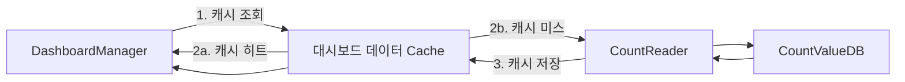

**동작 방식**:

1. 대시보드 데이터 조회 시 먼저 캐시 조회
2. 캐시 히트 시: 캐시에서 즉시 반환 (DB 접근 없음)
3. 캐시 미스 시: CountReader를 통해 DB 조회 후 캐시 저장
4. Count 값 변경 시 캐시 무효화 또는 업데이트

**장점**:

- **조회 성능 향상**: 캐시 히트 시 DB 접근 없이 즉시 반환
- **DB 부하 감소**: 반복 조회를 캐시로 처리
- **갱신 시간 단축**: 캐시에서 빠르게 조회

**단점 및 트레이드오프**:

- **캐시 일관성 문제**: Count 값 변경 시 캐시 무효화 필요
- **메모리 사용량 증가**: 대시보드 데이터를 메모리에 저장
- **캐시 무효화 복잡도**: 변경 감지 및 캐시 무효화 로직 필요

**종속 후보 구조**:

- **CA-025A**: 이벤트 기반 캐시 무효화 (캐시 일관성 개선)

---

### CA-025A: 이벤트 기반 캐시 무효화

**ID**: CA-025A  
**부모**: CA-025  
**종속 유형**: 선택적

**Description**:

Count 값 변경 이벤트를 수신하여 해당 Count의 캐시를 즉시 무효화합니다.

- **해결하려는 문제**: CA-025의 캐시 일관성 문제
- **적용하는 패턴/전술**: Event-driven Cache Invalidation
- **기대 효과**: 
  - 즉시 캐시 무효화로 일관성 보장
  - 다음 조회 시 최신 데이터 반환
- **트레이드오프**: 
  - 이벤트 처리 오버헤드
  - 구현 복잡도 증가

**동작 방식**:

1. Count 값 변경 이벤트 수신
2. 해당 Count ID의 캐시 항목 즉시 제거
3. 다음 조회 시 DB에서 최신 데이터 조회 후 캐시 갱신

**장점**:

- **캐시 일관성**: 변경 시 즉시 캐시 무효화
- **최신 데이터 보장**: 다음 조회 시 최신 데이터 반환

**단점 및 트레이드오프**:

- **이벤트 처리 오버헤드**: 이벤트 처리 비용 발생
- **구현 복잡도**: 이벤트 구독 및 캐시 무효화 로직 구현 필요

---

### CA-026: 배치 업데이트

**ID**: CA-026  
**부모**: -  
**종속 유형**: 최상위

**Description**:

짧은 시간 내 발생한 여러 Count 값 변경을 배치로 묶어서 한 번에 전송합니다.

- **해결하려는 문제**: 여러 변경사항의 개별 전송으로 인한 네트워크 오버헤드 및 처리 비용 증가
- **적용하는 패턴/전술**: Batch Processing, Batching
- **기대 효과**: 
  - 네트워크 오버헤드 감소 (여러 변경사항을 한 번에 전송)
  - 처리 효율성 향상 (배치 처리)
  - 갱신 빈도 조절 가능
- **트레이드오프**: 
  - 배치 지연 시간 (배치 수집 시간)
  - 실시간성 약간 저하

**구조도**:

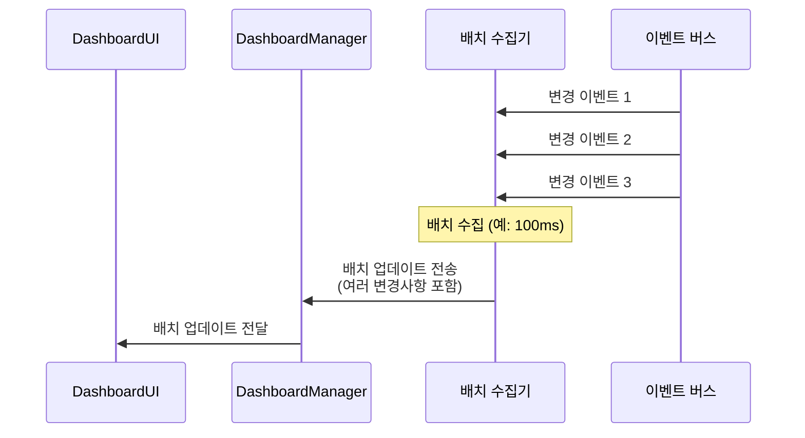

**동작 방식**:

1. 짧은 시간(예: 100ms) 내 발생한 여러 변경 이벤트를 수집
2. 배치 수집 시간 경과 또는 배치 크기 도달 시 배치로 묶어서 전송
3. DashboardManager가 배치 업데이트를 받아 한 번에 처리
4. DashboardUI에 배치 업데이트 전달

**장점**:

- **네트워크 효율성**: 여러 변경사항을 한 번에 전송
- **처리 효율성**: 배치 처리로 처리 효율 향상
- **갱신 빈도 조절**: 배치 수집 시간으로 갱신 빈도 조절 가능

**단점 및 트레이드오프**:

- **배치 지연**: 배치 수집 시간 동안 지연 발생 (예: 최대 100ms)
- **실시간성 저하**: 즉시 갱신 대신 배치 지연 발생
- **구현 복잡도**: 배치 수집 및 처리 로직 구현 필요

---

### CA-027: 대시보드 제공/갱신 서비스 분리

**ID**: CA-027  
**부모**: -  
**종속 유형**: 최상위

**Description**:

대시보드 UI 제공 서비스와 대시보드 갱신 서비스를 분리하여 각 서비스의 독립적인 스케일링과 배포를 가능하게 합니다.

- **해결하려는 문제**: 대시보드 제공과 갱신 로직의 결합으로 인한 성능 격리 부족 (문제 6)
- **적용하는 패턴/전술**: Service Separation, Microservice Architecture
- **기대 효과**: 
  - 갱신 서비스의 부하가 UI 제공 서비스에 영향 없음
  - 각 서비스의 독립적인 스케일링 가능
  - 갱신 로직 변경 시 UI 서비스 재배포 불필요
  - 갱신 서비스의 성능 최적화가 UI 서비스에 영향 없음
- **트레이드오프**: 
  - 서비스 간 통신 오버헤드 증가
  - 운영 복잡도 증가
  - 네트워크 지연 가능

**구조도**:

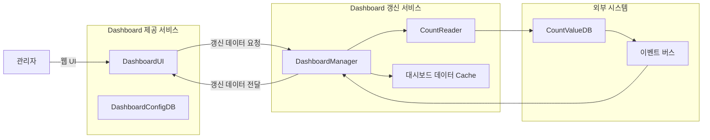

**동작 방식**:

1. **대시보드 제공 서비스**: DashboardUI와 DashboardConfigDB를 포함하여 정적 UI 제공에 집중
2. **대시보드 갱신 서비스**: DashboardManager와 CountReader를 포함하여 실시간 갱신 로직 처리에 집중
3. 갱신 서비스가 이벤트를 수신하거나 주기적으로 Count 데이터 조회
4. 갱신 서비스가 변경된 데이터를 제공 서비스로 전달
5. 제공 서비스가 UI에 갱신 데이터 반영

**장점**:

- **성능 격리**: 갱신 로직의 부하가 UI 제공에 영향 없음
- **독립적 스케일링**: 갱신 서비스와 제공 서비스를 독립적으로 스케일링 가능
- **독립적 배포**: 갱신 로직 변경 시 UI 서비스 재배포 불필요
- **성능 최적화 독립성**: 갱신 서비스의 성능 최적화가 UI 서비스에 영향 없음

**단점 및 트레이드오프**:

- **서비스 간 통신 오버헤드**: 서비스 간 네트워크 통신으로 인한 지연 증가
- **운영 복잡도**: 두 서비스의 모니터링 및 관리 필요
- **네트워크 지연**: 서비스 간 통신으로 인한 추가 지연 시간
- **데이터 일관성**: 서비스 간 데이터 동기화 필요

---

## 후보 구조 간 관계

### 상충 관계

- **CA-020 vs CA-021**: WebSocket과 Server-Sent Events는 서로 다른 실시간 통신 방식
  - CA-020: WebSocket (양방향 통신)
  - CA-021: Server-Sent Events (단방향 통신)

### 종속 관계

- **CA-020A**: CA-020에 종속 (연결 관리 개선)
- **CA-022A, CA-022B**: CA-022에 종속 (이벤트 처리 안정성 개선)
- **CA-025A**: CA-025에 종속 (캐시 일관성 개선)

### 병행 적용 가능

다음 후보 구조들은 서로 독립적이므로 병행 적용 가능:

- **CA-020** 또는 **CA-021** (실시간 통신) + **CA-022** (이벤트 기반 갱신) + **CA-023** (Delta 업데이트)
- **CA-024** (이벤트에 데이터 포함) + **CA-022** (이벤트 기반 갱신)
- **CA-025** (캐싱) + **CA-022** (이벤트 기반 갱신) + **CA-023** (Delta 업데이트)
- **CA-026** (배치 업데이트) + **CA-020** 또는 **CA-021** (실시간 통신)
- **CA-027** (서비스 분리) + **CA-020** 또는 **CA-021** (실시간 통신) + **CA-022** (이벤트 기반 갱신)

## 성능 개선 효과 예상

### 개별 후보 구조 효과

| 후보 구조 | 개선 효과 | 예상 갱신 시간 단축 |
|---------|---------|------------------|
| CA-020 | WebSocket 실시간 통신 | 폴링 주기 제거 (예: 5초 → 즉시) |
| CA-021 | Server-Sent Events 실시간 통신 | 폴링 주기 제거 (예: 5초 → 즉시) |
| CA-022 | 이벤트 기반 갱신 | 폴링 주기 제거 (예: 5초 → 즉시) |
| CA-023 | Delta 업데이트 | 네트워크 전송 시간 단축 (~50-80%) |
| CA-024 | 이벤트에 데이터 포함 | DB 조회 제거 (~10-20ms) |
| CA-025 | 대시보드 데이터 캐싱 | DB 조회 시간 단축 (~10ms) |
| CA-026 | 배치 업데이트 | 네트워크 오버헤드 감소 (~30-50%) |
| CA-027 | 대시보드 제공/갱신 서비스 분리 | 성능 격리 및 독립적 스케일링 |

### 조합 효과

**최적 조합 (실시간성 우선)**:
- CA-020 + CA-020A + CA-022 + CA-022A + CA-023 + CA-024
- 예상 갱신 시간: ~50-100ms (폴링 방식 5초 대비 98% 단축)

**최적 조합 (효율성 우선)**:
- CA-021 + CA-022 + CA-022B + CA-023 + CA-025 + CA-025A + CA-026
- 예상 갱신 시간: ~100-200ms (폴링 방식 5초 대비 96-98% 단축)

## 관련 품질 요구사항

### 직접 관련
- **QA-011**: 대시보드 갱신 시간 최소화 (우선순위 11)
- **QS-005**: 대시보드 갱신 시간

### 간접 관련
- **QA-010**: Count 모니터링 서비스 독립성 최대화 (CA-027은 서비스 분리로 독립성 향상)
- **QA-006**: 대시보드 기능 추가 용이성 최대화 (CA-027은 서비스 분리로 변경 용이성 향상)

## 관련 Use Case

- **UC-005**: Count 모니터링

## 비고

- 모든 후보 구조는 독립적으로 평가되며, 채택 여부가 결정됨
- 종속 후보 구조는 부모 후보 구조의 단점을 보완하기 위한 추가 설계 결정임
- 후보 구조 간 상충 관계가 있을 수 있으며, 평가 단계에서 비교 분석이 필요함
- 성능 개선 효과는 실제 환경에 따라 달라질 수 있으므로, 프로토타입을 통한 검증이 권장됨
- 실시간 갱신은 중기 목표이므로, 단기적으로는 폴링 방식으로도 충분할 수 있음
