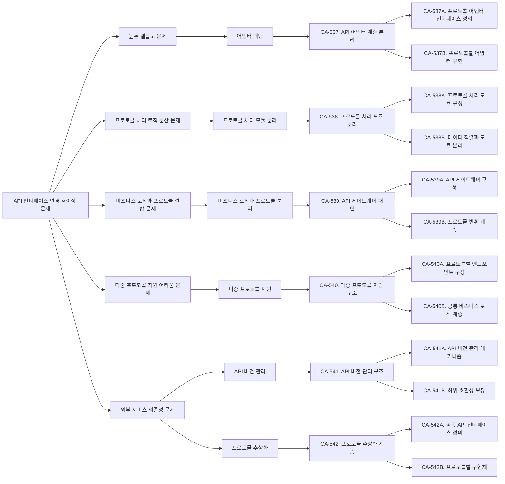
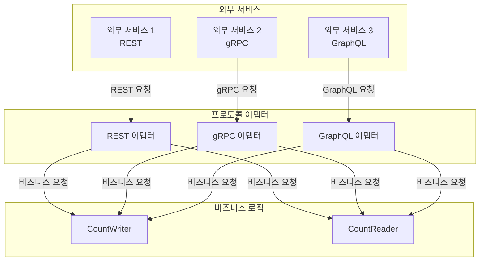
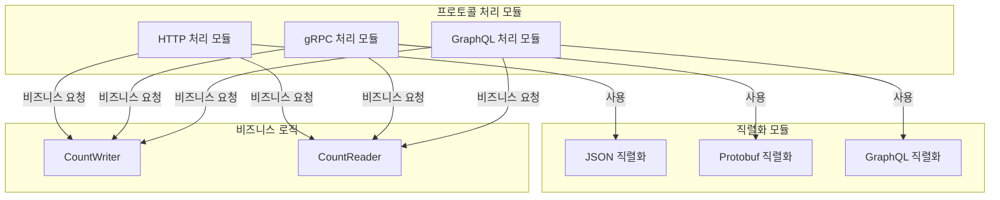
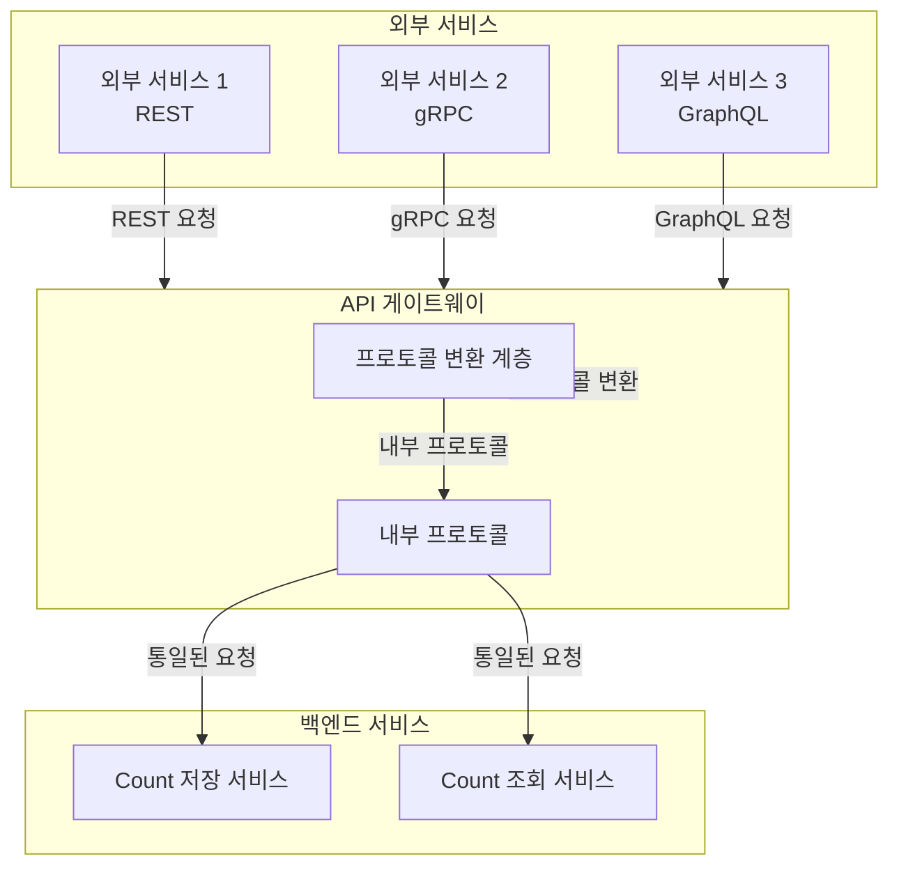
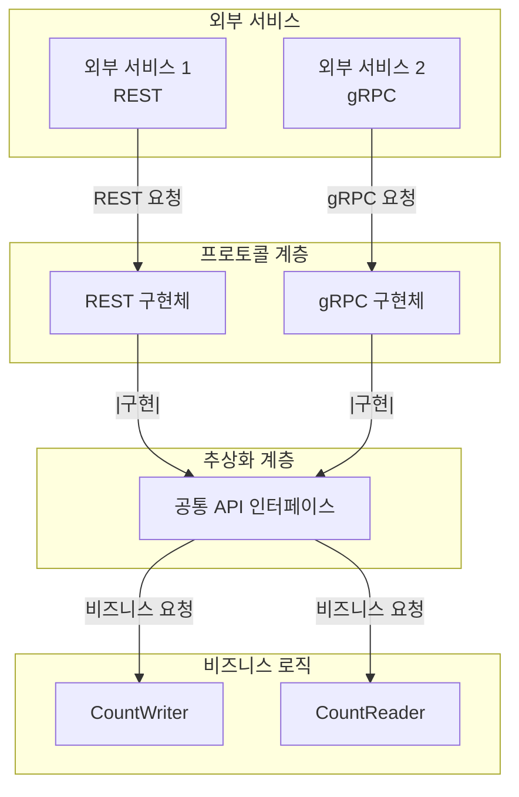

# QS-007-API-인터페이스-변경-용이성

## 개요

### 목적
이 문서는 QS-007 (API 인터페이스 변경 용이성) 변경 용이성 시나리오를 분석하고, 변경 용이성 향상을 위한 후보 구조를 설계합니다.

### 관련 품질 시나리오
- **QS-007**: API 인터페이스 변경 용이성
- **관련 품질 속성**: 변경 용이성 (인터페이스 변경)

### 관련 Use Case
- **UC-001**: Count 저장
- **UC-002**: Count 조회

## 1. 변경 용이성 시나리오 분석

### 1.1 시나리오 요약

**시나리오**: API 인터페이스 방식(예: REST → gRPC, REST → GraphQL)을 변경할 때 영향받는 모듈의 범위

**변경 유형**:
- REST API → gRPC로 변경
- REST API → GraphQL로 변경
- gRPC → REST API로 변경
- 기타 인터페이스 프로토콜/방식 변경

**측정 항목**: API 인터페이스 방식 변경 시 영향받는 모듈의 크기

**측정 공식**:
```
변경 비용 = Σ(LOC(변경되는 모듈)) + Σ(LOC(변경되는 모듈을 의존하는 모듈))
```

**관련 컴포넌트**:
- CountAPI (Boundary)
- CountWriter (Control)
- CountReader (Control)
- 외부 서비스 (API 사용자)

### 1.2 현재 구조 분석

현재 구조에서 API 인터페이스 방식 변경 시 필요한 작업:

1. **CountAPI 모듈 수정**: 인터페이스 프로토콜 처리 로직 수정 또는 교체
2. **관련 Control 컴포넌트 수정**: CountWriter, CountReader 수정 (필요한 경우)
3. **데이터 직렬화/역직렬화 로직 수정**: 프로토콜별 직렬화 방식 변경
4. **외부 서비스 코드 수정**: API 사용자 코드 수정 (필요한 경우)
5. **테스트 코드 수정**
6. **문서 업데이트**

**현재 구조의 문제점**:
- CountAPI가 특정 프로토콜(REST)에 직접 의존하여 프로토콜 변경 시 전체 수정 필요
- 프로토콜 처리 로직이 비즈니스 로직과 결합되어 있음
- 여러 프로토콜을 동시에 지원하기 어려움

### 1.3 도메인 모델 분석

`domain/model.md`를 분석한 결과:

- **CountAPI**: 외부 서비스와의 REST API 인터페이스를 담당하는 컴포넌트
  - REST API 요청 수신
  - 요청 데이터 형식 검증
  - 인증 정보 검증
  - 응답 데이터 형식 변환 및 반환
  - HTTP 프로토콜 처리

현재 구조의 의존성:
```
외부 서비스 → CountAPI (REST) → CountWriter/CountReader
```

### 1.4 배치 구조 분석

`architecture/deployment.md`를 분석한 결과:

- **Count 저장 서비스**: CountAPI (저장 엔드포인트), CountWriter 포함
- **Count 조회 서비스**: CountAPI (조회 엔드포인트), CountReader 포함

API 인터페이스 방식 변경 시 영향 범위:
- Count 저장 서비스: CountAPI 수정 필요
- Count 조회 서비스: CountAPI 수정 필요
- 외부 서비스: API 클라이언트 코드 수정 필요

## 2. 변경 용이성 문제 식별

### 2.1 높은 결합도 문제

**문제**: CountAPI가 특정 프로토콜(REST)에 직접 의존하여 결합도가 높음

**근거**:
- CountAPI가 REST 프로토콜 처리 로직에 직접 의존
- 프로토콜 변경 시 CountAPI 전체 수정 필요
- 프로토콜 처리 로직이 비즈니스 로직과 결합

**영향**:
- 변경 비용 증가: 프로토콜 변경 시 CountAPI 전체 수정 필요
- 변경 시간 증가: 프로토콜 변경 및 테스트 시간 소요

### 2.2 프로토콜 처리 로직 분산 문제

**문제**: 프로토콜 처리 로직이 CountAPI에 하드코딩되어 있어 분리 어려움

**근거**:
- HTTP 프로토콜 처리 로직이 CountAPI에 직접 구현
- 데이터 직렬화/역직렬화 로직이 CountAPI에 포함
- 프로토콜별 처리 로직이 분산되어 있음

**영향**:
- 변경 영향 범위 확대: 프로토콜 변경 시 여러 부분 수정 필요
- 재사용성 부족: 프로토콜 처리 로직을 다른 곳에서 재사용 어려움

### 2.3 비즈니스 로직과 프로토콜 결합 문제

**문제**: 비즈니스 로직(CountWriter, CountReader)이 프로토콜 처리 로직과 결합

**근거**:
- CountAPI가 프로토콜 처리와 비즈니스 로직 호출을 함께 수행
- 프로토콜 변경 시 비즈니스 로직에도 영향 가능
- 비즈니스 로직이 프로토콜에 의존할 수 있음

**영향**:
- 변경 영향 범위 확대: 프로토콜 변경 시 비즈니스 로직도 수정 필요할 수 있음
- 테스트 어려움: 프로토콜과 비즈니스 로직을 분리하여 테스트 어려움

### 2.4 다중 프로토콜 지원 어려움 문제

**문제**: 여러 프로토콜(REST, gRPC, GraphQL)을 동시에 지원하기 어려움

**근거**:
- CountAPI가 REST에만 특화되어 있음
- 다른 프로토콜 추가 시 CountAPI를 복제하거나 대폭 수정 필요
- 프로토콜별로 별도의 API 컴포넌트 필요

**영향**:
- 확장성 저하: 새로운 프로토콜 추가가 어려움
- 중복 코드 발생: 프로토콜별로 유사한 코드 중복 가능

### 2.5 외부 서비스 의존성 문제

**문제**: 외부 서비스가 특정 프로토콜에 의존하여 프로토콜 변경 시 외부 서비스도 수정 필요

**근거**:
- 외부 서비스가 REST API에 직접 의존
- 프로토콜 변경 시 모든 외부 서비스의 클라이언트 코드 수정 필요
- 하위 호환성 유지 어려움

**영향**:
- 변경 영향 범위 확대: 외부 서비스까지 수정 필요
- 마이그레이션 복잡도 증가: 점진적 마이그레이션 어려움

## 3. 설계 과정 마인드 맵



## 4. 후보 구조 설계

### 4.1 CA-537: API 어댑터 계층 분리

#### 개요
프로토콜 처리 로직을 어댑터 패턴으로 분리하여 프로토콜 변경 시 어댑터만 교체하면 되도록 설계합니다.

#### 설계 결정

**CA-537A. 프로토콜 어댑터 인터페이스 정의**
- 프로토콜 처리를 추상화하는 어댑터 인터페이스를 정의합니다.
- 인터페이스는 요청 수신, 데이터 변환, 응답 전송 메서드를 포함합니다.
- 모든 프로토콜 어댑터는 이 인터페이스를 구현합니다.

**CA-537B. 프로토콜별 어댑터 구현**
- REST, gRPC, GraphQL 등 각 프로토콜별로 어댑터를 구현합니다.
- 각 어댑터는 프로토콜별 처리 로직을 캡슐화합니다.
- 비즈니스 로직은 어댑터 인터페이스에만 의존합니다.

#### 구조 다이어그램



#### 장점

- **프로토콜 변경 용이**: 프로토콜 변경 시 어댑터만 교체하면 됨
- **비즈니스 로직 분리**: 비즈니스 로직이 프로토콜에 의존하지 않음
- **다중 프로토콜 지원**: 여러 프로토콜을 동시에 지원 가능
- **테스트 용이성**: 어댑터를 모킹하여 비즈니스 로직 테스트 가능

#### 단점 및 트레이드오프

- **어댑터 관리 복잡도**: 여러 어댑터 관리 필요
- **추가 계층**: 어댑터 계층 추가로 인한 복잡도 증가
- **성능 오버헤드**: 어댑터 계층을 통한 데이터 변환 오버헤드

### 4.2 CA-538: 프로토콜 처리 모듈 분리

#### 개요
프로토콜 처리 로직을 별도 모듈로 분리하여 재사용성을 높이고 변경 영향 범위를 제한합니다.

#### 설계 결정

**CA-538A. 프로토콜 처리 모듈 구성**
- 프로토콜 처리 로직을 `protocol-handler` 모듈로 구성합니다.
- HTTP, gRPC, GraphQL 등 프로토콜별 처리 모듈 포함
- 각 모듈은 독립적으로 개발 및 배포 가능

**CA-538B. 데이터 직렬화 모듈 분리**
- 데이터 직렬화/역직렬화 로직을 별도 모듈로 분리합니다.
- JSON, Protobuf, GraphQL Schema 등 직렬화 방식별 모듈
- 프로토콜 처리 모듈과 직렬화 모듈을 조합하여 사용

#### 구조 다이어그램



#### 장점

- **모듈 재사용성**: 프로토콜 처리 모듈을 다른 곳에서 재사용 가능
- **변경 영향 범위 제한**: 프로토콜 처리 모듈 변경이 비즈니스 로직에 영향 없음
- **독립적 개발**: 프로토콜 처리 모듈을 독립적으로 개발 및 테스트 가능

#### 단점 및 트레이드오프

- **모듈 관리 복잡도**: 여러 모듈 관리 필요
- **모듈 간 의존성**: 모듈 간 의존성 관리 필요

### 4.3 CA-539: API 게이트웨이 패턴

#### 개요
API 게이트웨이를 통해 프로토콜 변환을 중앙에서 처리하고, 백엔드 서비스는 통일된 인터페이스를 사용하도록 설계합니다.

#### 설계 결정

**CA-539A. API 게이트웨이 구성**
- API 게이트웨이를 구성하여 모든 외부 요청을 중앙에서 처리합니다.
- 게이트웨이는 다양한 프로토콜을 수신하고 내부 통신 프로토콜로 변환
- 백엔드 서비스는 통일된 내부 프로토콜 사용

**CA-539B. 프로토콜 변환 계층**
- 게이트웨이 내부에 프로토콜 변환 계층을 구성합니다.
- 외부 프로토콜(REST, gRPC, GraphQL)을 내부 프로토콜로 변환
- 내부 프로토콜 변경 시 게이트웨이만 수정하면 됨

#### 구조 다이어그램



#### 장점

- **프로토콜 변경 용이**: 백엔드 서비스는 내부 프로토콜만 사용하여 변경 영향 최소화
- **중앙 집중식 관리**: 프로토콜 변환을 게이트웨이에서 중앙 관리
- **다중 프로토콜 지원**: 게이트웨이에서 여러 프로토콜 동시 지원

#### 단점 및 트레이드오프

- **게이트웨이 복잡도**: 게이트웨이가 복잡해질 수 있음
- **단일 장애점**: 게이트웨이가 단일 장애점이 될 수 있음
- **성능 오버헤드**: 게이트웨이를 통한 추가 홉으로 인한 지연

### 4.4 CA-540: 다중 프로토콜 지원 구조

#### 개요
여러 프로토콜을 동시에 지원하도록 설계하여 프로토콜 변경 없이 새로운 프로토콜을 추가할 수 있도록 합니다.

#### 설계 결정

**CA-540A. 프로토콜별 엔드포인트 구성**
- 각 프로토콜별로 독립적인 엔드포인트를 구성합니다.
- REST: `/api/v1/rest/...`
- gRPC: `/api/v1/grpc/...`
- GraphQL: `/api/v1/graphql`
- 각 엔드포인트는 독립적으로 운영 가능

**CA-540B. 공통 비즈니스 로직 계층**
- 모든 프로토콜이 공통 비즈니스 로직 계층을 사용합니다.
- 프로토콜별 어댑터가 공통 비즈니스 로직을 호출
- 비즈니스 로직 변경 시 모든 프로토콜에 자동 반영

#### 구조 다이어그램

```mermaid
graph TB
    subgraph External[외부 서비스]
        ES1[외부 서비스 1<br/>REST]
        ES2[외부 서비스 2<br/>gRPC]
        ES3[외부 서비스 3<br/>GraphQL]
    end
    
    subgraph Endpoints[프로토콜별 엔드포인트]
        RESTEndpoint[/api/v1/rest]
        gRPCEndpoint[/api/v1/grpc]
        GraphQLEndpoint[/api/v1/graphql]
    end
    
    subgraph Adapters[프로토콜 어댑터]
        RESTAdapter[REST 어댑터]
        gRPCAdapter[gRPC 어댑터]
        GraphQLAdapter[GraphQL 어댑터]
    end
    
    subgraph Business[공통 비즈니스 로직]
        Writer[CountWriter]
        Reader[CountReader]
    end
    
    ES1 -->|REST 요청| RESTEndpoint
    ES2 -->|gRPC 요청| gRPCEndpoint
    ES3 -->|GraphQL 요청| GraphQLEndpoint
    RESTEndpoint --> RESTAdapter
    gRPCEndpoint --> gRPCAdapter
    GraphQLEndpoint --> GraphQLAdapter
    RESTAdapter -->|공통 요청| Writer
    RESTAdapter -->|공통 요청| Reader
    gRPCAdapter -->|공통 요청| Writer
    gRPCAdapter -->|공통 요청| Reader
    GraphQLAdapter -->|공통 요청| Writer
    GraphQLAdapter -->|공통 요청| Reader
```

#### 장점

- **점진적 마이그레이션**: 기존 프로토콜을 유지하면서 새로운 프로토콜 추가 가능
- **다중 프로토콜 지원**: 여러 프로토콜을 동시에 지원하여 외부 서비스 선택권 제공
- **변경 영향 범위 제한**: 프로토콜 추가 시 해당 어댑터만 추가하면 됨

#### 단점 및 트레이드오프

- **엔드포인트 관리 복잡도**: 여러 엔드포인트 관리 필요
- **코드 중복 가능성**: 프로토콜별 어댑터에 유사한 코드 중복 가능

### 4.5 CA-541: API 버전 관리 구조

#### 개요
API 버전 관리를 통해 하위 호환성을 보장하고, 프로토콜 변경 시 기존 클라이언트에 영향을 주지 않도록 설계합니다.

#### 설계 결정

**CA-541A. API 버전 관리 메커니즘**
- API 버전을 URL 경로 또는 헤더로 관리합니다.
- `/api/v1/...`, `/api/v2/...` 등 버전별 엔드포인트
- 각 버전은 독립적으로 운영 가능

**CA-541B. 하위 호환성 보장**
- 이전 버전 API를 유지하여 기존 클라이언트와의 호환성 보장
- 새 버전 추가 시 이전 버전도 계속 지원
- 점진적 마이그레이션 지원

#### 구조 다이어그램

```mermaid
graph TB
    subgraph External[외부 서비스]
        ES1[외부 서비스 1<br/>v1 사용]
        ES2[외부 서비스 2<br/>v2 사용]
    end
    
    subgraph Versions[API 버전]
        V1[/api/v1/rest]
        V2[/api/v2/grpc]
    end
    
    subgraph Adapters[버전별 어댑터]
        V1Adapter[v1 어댑터]
        V2Adapter[v2 어댑터]
    end
    
    subgraph Business[비즈니스 로직]
        Writer[CountWriter]
        Reader[CountReader]
    end
    
    ES1 -->|v1 요청| V1
    ES2 -->|v2 요청| V2
    V1 --> V1Adapter
    V2 --> V2Adapter
    V1Adapter -->|비즈니스 요청| Writer
    V1Adapter -->|비즈니스 요청| Reader
    V2Adapter -->|비즈니스 요청| Writer
    V2Adapter -->|비즈니스 요청| Reader
```

#### 장점

- **하위 호환성 보장**: 기존 클라이언트에 영향을 주지 않고 새 버전 추가 가능
- **점진적 마이그레이션**: 클라이언트가 점진적으로 새 버전으로 마이그레이션 가능
- **변경 영향 범위 제한**: 새 버전 추가 시 기존 버전 유지

#### 단점 및 트레이드오프

- **버전 관리 복잡도**: 여러 버전 관리 필요
- **코드 중복 가능성**: 버전별로 유사한 코드 중복 가능

### 4.6 CA-542: 프로토콜 추상화 계층

#### 개요
프로토콜을 완전히 추상화하여 비즈니스 로직이 프로토콜에 전혀 의존하지 않도록 설계합니다.

#### 설계 결정

**CA-542A. 공통 API 인터페이스 정의**
- 프로토콜에 독립적인 공통 API 인터페이스를 정의합니다.
- 요청/응답 모델을 프로토콜에 독립적으로 정의
- 비즈니스 로직은 공통 인터페이스에만 의존

**CA-542B. 프로토콜별 구현체**
- 각 프로토콜별로 공통 인터페이스를 구현하는 어댑터를 제공합니다.
- REST, gRPC, GraphQL 등 각 프로토콜별 구현체
- 프로토콜 변경 시 구현체만 교체하면 됨

#### 구조 다이어그램



#### 장점

- **완전한 프로토콜 독립성**: 비즈니스 로직이 프로토콜에 전혀 의존하지 않음
- **프로토콜 변경 용이**: 프로토콜 변경 시 구현체만 교체하면 됨
- **테스트 용이성**: 인터페이스를 모킹하여 비즈니스 로직 테스트 가능

#### 단점 및 트레이드오프

- **추상화 계층 추가**: 추상화 계층 추가로 인한 복잡도 증가
- **성능 오버헤드**: 추상화 계층을 통한 데이터 변환 오버헤드

## 5. 후보 구조 비교

| 후보 구조 | 변경 비용 감소 | 복잡도 증가 | 다중 프로토콜 지원 | 하위 호환성 |
|---------|------------|----------|----------------|-----------|
| CA-537 (어댑터 패턴) | 높음 | 중 | 높음 | 중 |
| CA-538 (프로토콜 처리 모듈 분리) | 중 | 낮음 | 중 | 중 |
| CA-539 (API 게이트웨이) | 매우 높음 | 높음 | 매우 높음 | 높음 |
| CA-540 (다중 프로토콜 지원) | 높음 | 중 | 매우 높음 | 중 |
| CA-541 (API 버전 관리) | 중 | 중 | 중 | 매우 높음 |
| CA-542 (프로토콜 추상화) | 매우 높음 | 높음 | 높음 | 중 |

## 6. 결론

QS-007 (API 인터페이스 변경 용이성) 시나리오를 분석한 결과, 다음과 같은 변경 용이성 문제를 식별했습니다:

1. **높은 결합도**: CountAPI가 특정 프로토콜(REST)에 직접 의존
2. **프로토콜 처리 로직 분산**: 프로토콜 처리 로직이 CountAPI에 하드코딩
3. **비즈니스 로직과 프로토콜 결합**: 비즈니스 로직이 프로토콜 처리 로직과 결합
4. **다중 프로토콜 지원 어려움**: 여러 프로토콜을 동시에 지원하기 어려움
5. **외부 서비스 의존성**: 외부 서비스가 특정 프로토콜에 의존

이러한 문제를 해결하기 위해 다음과 같은 후보 구조를 설계했습니다:

- **CA-537**: API 어댑터 계층 분리 (어댑터 패턴)
- **CA-538**: 프로토콜 처리 모듈 분리 (모듈화)
- **CA-539**: API 게이트웨이 패턴 (게이트웨이 패턴)
- **CA-540**: 다중 프로토콜 지원 구조 (다중 프로토콜)
- **CA-541**: API 버전 관리 구조 (버전 관리)
- **CA-542**: 프로토콜 추상화 계층 (추상화)

**권장 구조**: API 게이트웨이 패턴(CA-539) 또는 어댑터 패턴(CA-537)을 기반으로 다중 프로토콜 지원(CA-540)과 API 버전 관리(CA-541)를 조합하여, 프로토콜 변경 용이성을 최대화하면서 하위 호환성을 보장할 수 있습니다.

각 후보 구조는 변경 용이성 향상에 기여하지만, 복잡도와 성능에 대한 트레이드오프가 있습니다. 프로젝트의 요구사항과 제약사항을 고려하여 적절한 후보 구조를 선택해야 합니다.
