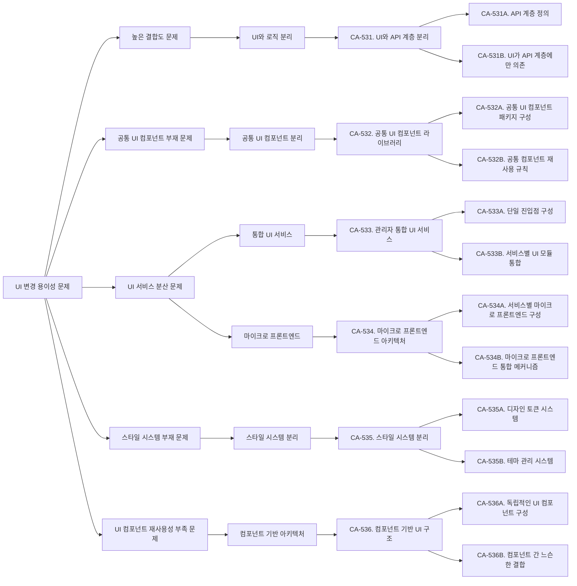
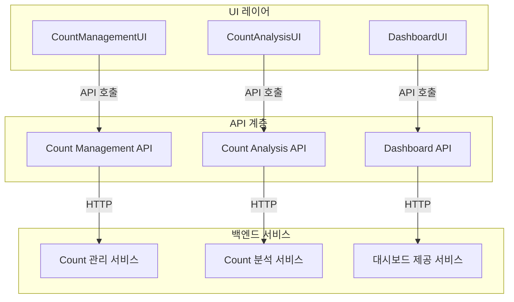
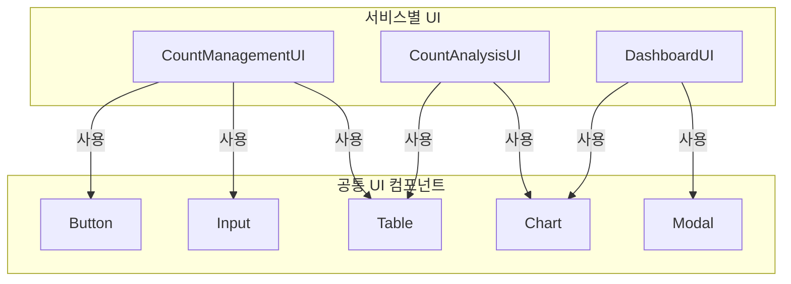
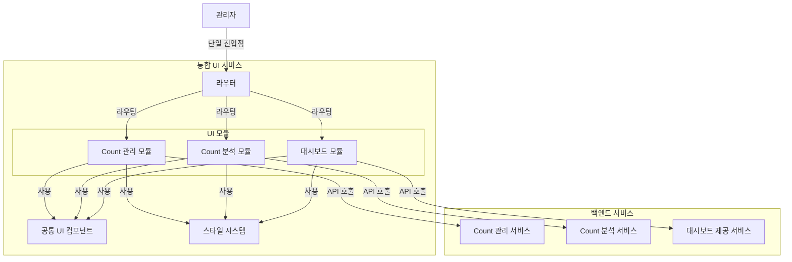
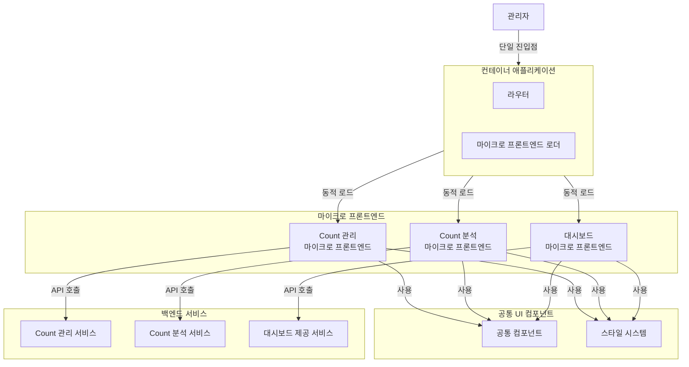
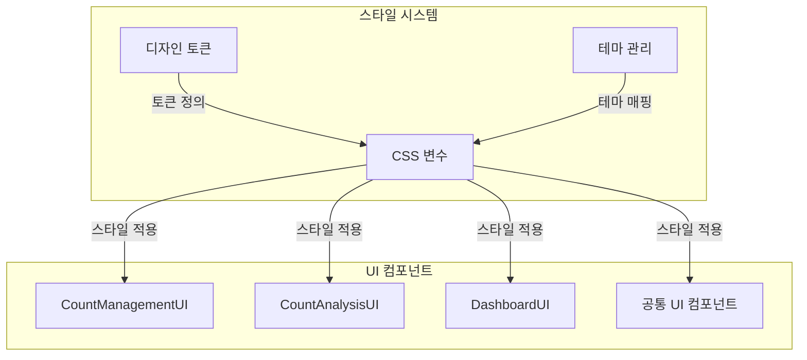
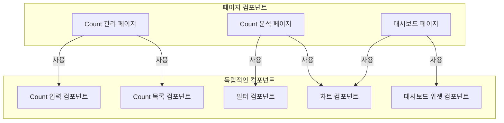

# QS-008-UI-변경-용이성

## 개요

### 목적
이 문서는 QS-008 (UI 변경 용이성) 변경 용이성 시나리오를 분석하고, 변경 용이성 향상을 위한 후보 구조를 설계합니다. 또한 관리자를 위한 전체 UI 구조에 대해서도 구체적으로 검토하고 설계합니다.

### 관련 품질 시나리오
- **QS-008**: UI 변경 용이성
- **관련 품질 속성**: QA-007-UI-변경-용이성-최대화 (우선순위 7)

### 관련 Use Case
- **UC-003**: Count 관리
- **UC-004**: Count 분석
- **UC-005**: Count 모니터링

## 1. 변경 용이성 시나리오 분석

### 1.1 시나리오 요약

**시나리오**: 관리자에게 제공하는 UI를 변경할 때 영향받는 모듈의 범위

**변경 유형**:
- UI 레이아웃 변경
- 화면 구성 요소 추가/수정/삭제
- 스타일 변경
- 전체 UI 스타일 변경

**측정 항목**: UI 변경 시 영향받는 모듈의 크기

**측정 공식**:
```
변경 비용 = Σ(LOC(변경되는 모듈)) + Σ(LOC(변경되는 모듈을 의존하는 모듈))
```

**관련 컴포넌트**:
- CountManagementUI (Boundary)
- CountAnalysisUI (Boundary)
- DashboardUI (Boundary)
- CountManager (Control)
- CountAnalyzer (Control)
- DashboardManager (Control)

### 1.2 현재 구조 분석

현재 구조에서 UI 변경 시 필요한 작업:

1. **UI 컴포넌트 모듈 수정** (CountManagementUI, CountAnalysisUI, DashboardUI)
2. **관련 Control 컴포넌트 수정** (필요한 경우)
3. **테스트 코드 수정**
4. **문서 업데이트**

**현재 구조의 문제점**:
- 각 UI가 별도의 서비스에 분리되어 있어 공통 UI 컴포넌트 재사용 어려움
- UI와 Control 컴포넌트가 밀접하게 결합되어 있어 UI 변경 시 Control 수정 필요할 수 있음
- 전체 UI 스타일 변경 시 여러 서비스의 UI를 모두 수정해야 함

### 1.3 도메인 모델 분석

`domain/model.md`를 분석한 결과:

- **CountManagementUI**: Count 관리 웹 UI 인터페이스 (UC-003)
- **CountAnalysisUI**: Count 분석 웹 UI 인터페이스 (UC-004)
- **DashboardUI**: Count 모니터링 대시보드 웹 UI 인터페이스 (UC-005)

현재 구조의 의존성:
```
CountManagementUI → CountManager
CountAnalysisUI → CountAnalyzer
DashboardUI → DashboardManager
```

### 1.4 배치 구조 분석

`architecture/deployment.md`를 분석한 결과:

- **Count 관리 서비스**: CountManagementUI, CountManager 포함
- **Count 분석 서비스**: CountAnalysisUI, CountAnalyzer 포함
- **대시보드 제공 서비스**: DashboardUI, DashboardManager 포함

UI 변경 시 영향 범위:
- 각 서비스의 UI 컴포넌트 수정 필요
- 전체 UI 스타일 변경 시 모든 서비스의 UI 수정 필요
- 공통 UI 컴포넌트가 없어 중복 코드 발생 가능

## 2. 관리자 전체 UI 구조 설계 고려사항

### 2.1 UI 제공 방식

#### 2.1.1 통합 UI 서비스 vs 분리된 UI 서비스

**통합 UI 서비스**:
- 모든 관리자 UI를 하나의 서비스로 제공
- 단일 진입점으로 관리자에게 통합된 경험 제공
- 공통 UI 컴포넌트 재사용 용이

**분리된 UI 서비스**:
- 각 기능별로 UI 서비스를 분리
- 서비스별 독립적 배포 및 스케일링 가능
- 공통 UI 컴포넌트 재사용 어려움

#### 2.1.2 단일 페이지 애플리케이션(SPA) vs 멀티 페이지 애플리케이션(MPA)

**SPA**:
- 클라이언트 사이드 라우팅으로 페이지 전환
- 빠른 페이지 전환 및 부드러운 사용자 경험
- 초기 로딩 시간 증가 가능

**MPA**:
- 서버 사이드 라우팅으로 페이지 전환
- 각 페이지 독립적 로딩
- 페이지 전환 시 전체 페이지 리로딩

#### 2.1.3 마이크로 프론트엔드 아키텍처

**마이크로 프론트엔드**:
- 각 서비스가 독립적인 프론트엔드 애플리케이션으로 구성
- 런타임 또는 빌드 타임에 통합
- 서비스별 독립적 개발 및 배포 가능

### 2.2 UI 컴포넌트 구조

#### 2.2.1 공통 UI 컴포넌트 분리

- 공통 UI 컴포넌트를 별도 패키지로 분리
- 버튼, 입력 필드, 테이블, 차트 등 재사용 가능한 컴포넌트
- 공통 스타일 및 테마 관리

#### 2.2.2 UI와 로직 분리

- UI 컴포넌트와 비즈니스 로직 분리
- UI 변경이 로직에 영향을 미치지 않도록 설계
- API 계층을 통한 UI와 백엔드 통신

### 2.3 UI 변경 영향 범위 최소화

#### 2.3.1 컴포넌트 기반 아키텍처

- UI를 독립적인 컴포넌트로 구성
- 컴포넌트 간 느슨한 결합
- 컴포넌트 변경 시 다른 컴포넌트에 영향 최소화

#### 2.3.2 스타일 시스템 분리

- 스타일을 별도 시스템으로 분리
- 테마 및 디자인 토큰 관리
- 스타일 변경 시 UI 컴포넌트 수정 불필요

## 3. 변경 용이성 문제 식별

### 3.1 높은 결합도 문제

**문제**: UI 컴포넌트가 Control 컴포넌트에 직접 의존하여 결합도가 높음

**근거**:
- CountManagementUI가 CountManager를 직접 호출
- CountAnalysisUI가 CountAnalyzer를 직접 호출
- DashboardUI가 DashboardManager를 직접 호출
- UI 변경 시 Control 컴포넌트 수정 필요할 수 있음

**영향**:
- 변경 비용 증가: UI 변경 시 Control 컴포넌트 수정 필요
- 변경 시간 증가: UI와 로직을 함께 수정 및 테스트해야 함

### 3.2 공통 UI 컴포넌트 부재 문제

**문제**: 공통 UI 컴포넌트가 없어 중복 코드 발생

**근거**:
- 각 서비스의 UI가 독립적으로 구현됨
- 공통 UI 컴포넌트(버튼, 입력 필드, 테이블 등)가 각 서비스에 중복 구현
- 전체 UI 스타일 변경 시 모든 서비스의 UI 수정 필요

**영향**:
- 변경 비용 증가: 전체 UI 스타일 변경 시 모든 서비스 수정 필요
- 유지보수 어려움: 공통 컴포넌트 변경 시 여러 곳 수정 필요

### 3.3 UI 서비스 분산 문제

**문제**: UI가 여러 서비스에 분산되어 있어 통합 관리 어려움

**근거**:
- CountManagementUI, CountAnalysisUI, DashboardUI가 각각 다른 서비스에 분리
- 공통 UI 컴포넌트 재사용 어려움
- 전체 UI 일관성 유지 어려움

**영향**:
- 변경 영향 범위 확대: 전체 UI 변경 시 여러 서비스 수정 필요
- 일관성 유지 어려움: 각 서비스의 UI가 독립적으로 발전하여 일관성 저하

### 3.4 스타일 시스템 부재 문제

**문제**: 스타일이 각 UI 컴포넌트에 분산되어 있어 일괄 변경 어려움

**근거**:
- 각 UI 컴포넌트에 스타일이 하드코딩되어 있음
- 공통 스타일 시스템이 없음
- 테마 변경 시 모든 UI 컴포넌트 수정 필요

**영향**:
- 변경 비용 증가: 스타일 변경 시 모든 UI 컴포넌트 수정 필요
- 일관성 유지 어려움: 각 컴포넌트의 스타일이 독립적으로 관리됨

### 3.5 UI 컴포넌트 재사용성 부족 문제

**문제**: UI 컴포넌트가 특정 서비스에 종속되어 재사용 어려움

**근거**:
- 각 서비스의 UI 컴포넌트가 해당 서비스에만 사용됨
- 공통 UI 컴포넌트 라이브러리가 없음
- 유사한 UI 컴포넌트가 여러 서비스에 중복 구현

**영향**:
- 개발 비용 증가: 유사한 UI 컴포넌트를 여러 번 개발
- 변경 비용 증가: 유사한 컴포넌트 변경 시 여러 곳 수정 필요

## 4. 설계 과정 마인드 맵



## 5. 후보 구조 설계

### 5.1 CA-531: UI와 API 계층 분리

#### 개요
UI 컴포넌트와 비즈니스 로직을 API 계층으로 분리하여 UI 변경이 로직에 영향을 미치지 않도록 설계합니다.

#### 설계 결정

**CA-531A. API 계층 정의**
- UI와 백엔드 서비스 간 통신을 위한 API 계층을 정의합니다.
- REST API 또는 GraphQL을 통한 통신 인터페이스 제공
- API 계층은 비즈니스 로직과 독립적으로 설계

**CA-531B. UI가 API 계층에만 의존**
- UI 컴포넌트는 Control 컴포넌트가 아닌 API 계층에만 의존합니다.
- UI 변경 시 Control 컴포넌트 수정 불필요
- API 계층 변경 시에만 UI 수정 필요

#### 구조 다이어그램



#### 장점

- **UI와 로직 분리**: UI 변경이 비즈니스 로직에 영향을 미치지 않음
- **독립적 개발**: UI와 백엔드를 독립적으로 개발 및 테스트 가능
- **변경 영향 범위 제한**: UI 변경 시 API 계층만 확인하면 됨

#### 단점 및 트레이드오프

- **API 계층 추가**: API 계층 추가로 인한 복잡도 증가
- **네트워크 오버헤드**: UI와 백엔드 간 네트워크 통신 필요

### 5.2 CA-532: 공통 UI 컴포넌트 라이브러리

#### 개요
공통 UI 컴포넌트를 별도 라이브러리로 분리하여 재사용성을 높이고 변경 영향 범위를 제한합니다.

#### 설계 결정

**CA-532A. 공통 UI 컴포넌트 패키지 구성**
- 공통 UI 컴포넌트를 `common-ui` 패키지로 구성합니다.
- 버튼, 입력 필드, 테이블, 차트, 모달 등 재사용 가능한 컴포넌트 포함
- 각 서비스의 UI는 공통 UI 컴포넌트를 사용

**CA-532B. 공통 컴포넌트 재사용 규칙**
- 공통 UI 컴포넌트는 서비스별 UI 패키지를 의존하지 않습니다.
- 서비스별 UI 패키지는 공통 UI 컴포넌트 패키지를 의존합니다.
- 공통 컴포넌트 변경 시 모든 서비스의 UI에 자동 반영

#### 구조 다이어그램



#### 장점

- **재사용성 향상**: 공통 UI 컴포넌트를 여러 서비스에서 재사용
- **변경 영향 범위 제한**: 공통 컴포넌트 변경 시 한 곳만 수정하면 모든 서비스에 반영
- **일관성 유지**: 공통 컴포넌트 사용으로 UI 일관성 유지

#### 단점 및 트레이드오프

- **의존성 관리**: 공통 UI 컴포넌트 버전 관리 필요
- **공통 컴포넌트 변경 영향**: 공통 컴포넌트 변경 시 모든 서비스에 영향

### 5.3 CA-533: 관리자 통합 UI 서비스

#### 개요
모든 관리자 UI를 하나의 통합 UI 서비스로 제공하여 공통 컴포넌트 재사용을 용이하게 하고 일관된 사용자 경험을 제공합니다.

#### 설계 결정

**CA-533A. 단일 진입점 구성**
- 관리자에게 단일 진입점을 제공하는 통합 UI 서비스를 구성합니다.
- SPA(Single Page Application) 또는 MPA(Multi Page Application) 구조
- 라우팅을 통한 각 기능 화면 전환

**CA-533B. 서비스별 UI 모듈 통합**
- Count 관리, Count 분석, 대시보드 UI를 하나의 서비스 내 모듈로 구성
- 각 모듈은 독립적으로 개발 가능하지만 통합 서비스로 배포
- 공통 UI 컴포넌트 및 스타일 시스템 공유

#### 구조 다이어그램



#### 장점

- **공통 컴포넌트 재사용**: 모든 UI 모듈이 공통 컴포넌트 및 스타일 시스템 공유
- **일관된 사용자 경험**: 단일 진입점으로 일관된 네비게이션 및 UI 제공
- **변경 영향 범위 제한**: 공통 컴포넌트 변경 시 한 곳만 수정하면 모든 모듈에 반영
- **전체 UI 스타일 변경 용이**: 스타일 시스템 변경 시 모든 모듈에 자동 반영

#### 단점 및 트레이드오프

- **서비스 독립성 저하**: UI 서비스를 통합하여 서비스별 독립적 배포 어려움
- **서비스 크기 증가**: 통합 UI 서비스가 커질 수 있음
- **모듈 간 의존성**: 모듈 간 의존성 관리 필요

### 5.4 CA-534: 마이크로 프론트엔드 아키텍처

#### 개요
각 서비스가 독립적인 마이크로 프론트엔드로 구성되고, 런타임 또는 빌드 타임에 통합하여 서비스별 독립적 개발 및 배포를 가능하게 합니다.

#### 설계 결정

**CA-534A. 서비스별 마이크로 프론트엔드 구성**
- 각 서비스(Count 관리, Count 분석, 대시보드)가 독립적인 마이크로 프론트엔드로 구성
- 각 마이크로 프론트엔드는 독립적으로 개발 및 배포 가능
- 공통 UI 컴포넌트는 별도 패키지로 제공하여 각 마이크로 프론트엔드에서 사용

**CA-534B. 마이크로 프론트엔드 통합 메커니즘**
- 런타임 통합: 각 마이크로 프론트엔드를 동적으로 로드하여 통합
- 빌드 타임 통합: 빌드 시점에 마이크로 프론트엔드를 통합
- 컨테이너 애플리케이션: 각 마이크로 프론트엔드를 통합하는 컨테이너 애플리케이션 구성

#### 구조 다이어그램



#### 장점

- **서비스 독립성**: 각 마이크로 프론트엔드를 독립적으로 개발 및 배포 가능
- **공통 컴포넌트 재사용**: 공통 UI 컴포넌트를 각 마이크로 프론트엔드에서 사용
- **변경 영향 범위 제한**: 각 마이크로 프론트엔드 변경이 다른 마이크로 프론트엔드에 영향 없음
- **기술 스택 다양성**: 각 마이크로 프론트엔드가 다른 기술 스택 사용 가능

#### 단점 및 트레이드오프

- **복잡도 증가**: 마이크로 프론트엔드 통합 메커니즘으로 인한 복잡도 증가
- **런타임 오버헤드**: 동적 로딩으로 인한 런타임 오버헤드
- **버전 관리 복잡도**: 각 마이크로 프론트엔드의 버전 관리 필요

### 5.5 CA-535: 스타일 시스템 분리

#### 개요
스타일을 별도 시스템으로 분리하여 테마 및 디자인 토큰을 중앙에서 관리하고, 스타일 변경 시 UI 컴포넌트 수정 없이 적용 가능하도록 설계합니다.

#### 설계 결정

**CA-535A. 디자인 토큰 시스템**
- 색상, 폰트, 간격, 그림자 등 디자인 토큰을 중앙에서 관리
- 디자인 토큰 변경 시 모든 UI 컴포넌트에 자동 반영
- CSS 변수 또는 테마 객체를 통한 토큰 관리

**CA-535B. 테마 관리 시스템**
- 다크 모드, 라이트 모드 등 테마를 중앙에서 관리
- 테마 전환 시 모든 UI 컴포넌트에 자동 적용
- 테마별 디자인 토큰 매핑

#### 구조 다이어그램



#### 장점

- **스타일 변경 용이**: 디자인 토큰 변경 시 모든 UI에 자동 반영
- **테마 전환 용이**: 테마 변경 시 모든 UI에 자동 적용
- **일관성 유지**: 중앙에서 관리하는 디자인 토큰으로 일관성 유지

#### 단점 및 트레이드오프

- **스타일 시스템 관리 복잡도**: 디자인 토큰 및 테마 관리 로직 필요
- **초기 설정 비용**: 스타일 시스템 구축에 초기 비용 필요

### 5.6 CA-536: 컴포넌트 기반 UI 구조

#### 개요
UI를 독립적인 컴포넌트로 구성하여 컴포넌트 간 느슨한 결합을 유지하고, 컴포넌트 변경 시 다른 컴포넌트에 영향을 미치지 않도록 설계합니다.

#### 설계 결정

**CA-536A. 독립적인 UI 컴포넌트 구성**
- 각 UI 컴포넌트를 독립적으로 구성
- 컴포넌트는 props를 통해서만 데이터를 받음
- 컴포넌트 내부 상태는 최소화

**CA-536B. 컴포넌트 간 느슨한 결합**
- 컴포넌트 간 직접 의존성 최소화
- 이벤트 기반 통신 또는 상태 관리 라이브러리를 통한 통신
- 컴포넌트 변경 시 다른 컴포넌트에 영향 없음

#### 구조 다이어그램



#### 장점

- **컴포넌트 재사용**: 독립적인 컴포넌트를 여러 페이지에서 재사용
- **변경 영향 범위 제한**: 컴포넌트 변경 시 해당 컴포넌트만 수정하면 됨
- **테스트 용이성**: 독립적인 컴포넌트를 개별적으로 테스트 가능

#### 단점 및 트레이드오프

- **컴포넌트 관리 복잡도**: 많은 컴포넌트 관리 필요
- **컴포넌트 간 통신**: 컴포넌트 간 통신 메커니즘 필요

## 6. 관리자 전체 UI 구조 설계 권장안

### 6.1 권장 구조: 통합 UI 서비스 + 공통 컴포넌트 + 스타일 시스템

**구성 요소**:
- **CA-533**: 관리자 통합 UI 서비스 (단일 진입점)
- **CA-532**: 공통 UI 컴포넌트 라이브러리 (재사용성)
- **CA-535**: 스타일 시스템 분리 (테마 관리)
- **CA-531**: UI와 API 계층 분리 (로직 분리)
- **CA-536**: 컴포넌트 기반 UI 구조 (컴포넌트 독립성)

**장점**:
- 공통 컴포넌트 및 스타일 시스템 공유로 일관성 유지
- 전체 UI 스타일 변경 시 스타일 시스템만 수정하면 모든 UI에 반영
- UI 변경 시 해당 컴포넌트만 수정하면 됨
- UI와 로직 분리로 독립적 개발 및 테스트 가능

**구조**:
```
통합 UI 서비스
├── 공통 UI 컴포넌트 라이브러리
├── 스타일 시스템
├── Count 관리 모듈
├── Count 분석 모듈
└── 대시보드 모듈
    └── API 계층 (각 백엔드 서비스와 통신)
```

### 6.2 대안 구조: 마이크로 프론트엔드 아키텍처

**구성 요소**:
- **CA-534**: 마이크로 프론트엔드 아키텍처
- **CA-532**: 공통 UI 컴포넌트 라이브러리
- **CA-535**: 스타일 시스템 분리

**적용 시나리오**:
- 각 서비스의 UI를 완전히 독립적으로 개발 및 배포해야 하는 경우
- 각 서비스가 다른 기술 스택을 사용해야 하는 경우
- 서비스별 UI 팀이 독립적으로 운영되는 경우

## 7. 후보 구조 비교

| 후보 구조 | 변경 비용 감소 | 복잡도 증가 | 서비스 독립성 | 공통 컴포넌트 재사용 |
|---------|------------|----------|------------|----------------|
| CA-531 (UI와 API 분리) | 중 | 낮음 | 높음 | 낮음 |
| CA-532 (공통 컴포넌트) | 높음 | 낮음 | 중 | 매우 높음 |
| CA-533 (통합 UI 서비스) | 매우 높음 | 중 | 낮음 | 매우 높음 |
| CA-534 (마이크로 프론트엔드) | 높음 | 높음 | 매우 높음 | 높음 |
| CA-535 (스타일 시스템) | 매우 높음 | 낮음 | 중 | 높음 |
| CA-536 (컴포넌트 기반) | 중 | 낮음 | 중 | 높음 |

## 8. 결론

QS-008 (UI 변경 용이성) 시나리오를 분석한 결과, 다음과 같은 변경 용이성 문제를 식별했습니다:

1. **높은 결합도**: UI 컴포넌트가 Control 컴포넌트에 직접 의존
2. **공통 UI 컴포넌트 부재**: 공통 컴포넌트가 없어 중복 코드 발생
3. **UI 서비스 분산**: UI가 여러 서비스에 분산되어 통합 관리 어려움
4. **스타일 시스템 부재**: 스타일이 각 컴포넌트에 분산되어 일괄 변경 어려움
5. **UI 컴포넌트 재사용성 부족**: 컴포넌트가 특정 서비스에 종속되어 재사용 어려움

이러한 문제를 해결하기 위해 다음과 같은 후보 구조를 설계했습니다:

- **CA-531**: UI와 API 계층 분리 (관심사 분리)
- **CA-532**: 공통 UI 컴포넌트 라이브러리 (재사용성)
- **CA-533**: 관리자 통합 UI 서비스 (통합 관리)
- **CA-534**: 마이크로 프론트엔드 아키텍처 (서비스 독립성)
- **CA-535**: 스타일 시스템 분리 (테마 관리)
- **CA-536**: 컴포넌트 기반 UI 구조 (컴포넌트 독립성)

**권장 구조**: 통합 UI 서비스 + 공통 컴포넌트 + 스타일 시스템 조합으로, UI 변경 용이성을 최대화하면서 일관된 사용자 경험을 제공할 수 있습니다.

각 후보 구조는 변경 용이성 향상에 기여하지만, 복잡도와 서비스 독립성에 대한 트레이드오프가 있습니다. 프로젝트의 요구사항과 제약사항을 고려하여 적절한 후보 구조를 선택해야 합니다.
