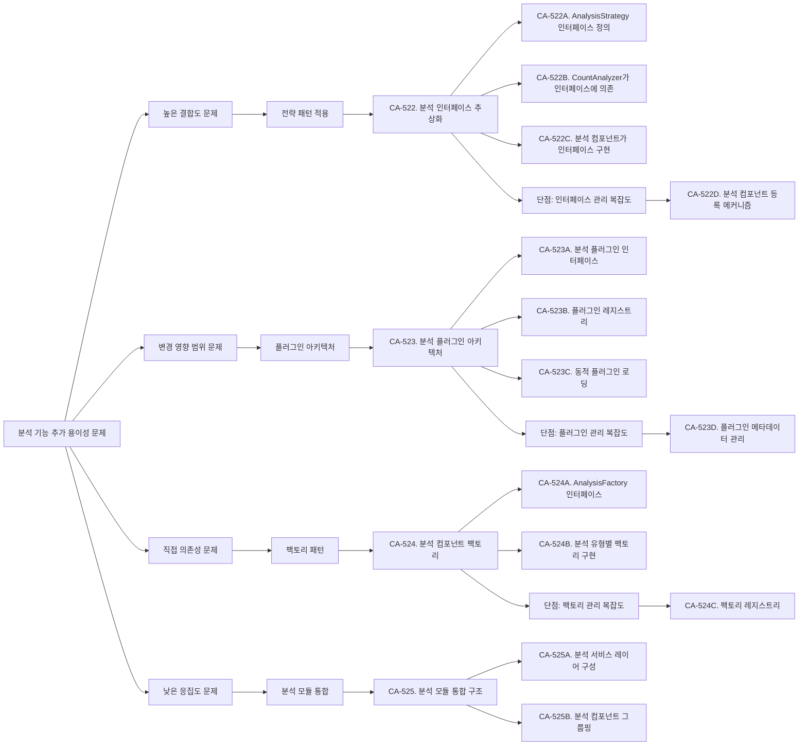
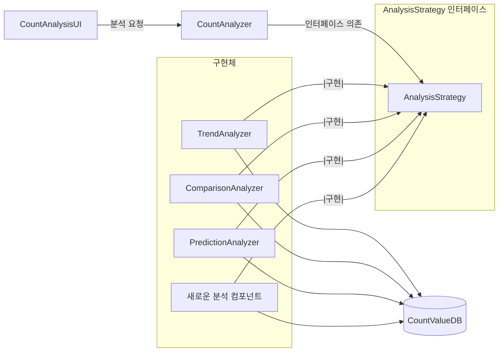
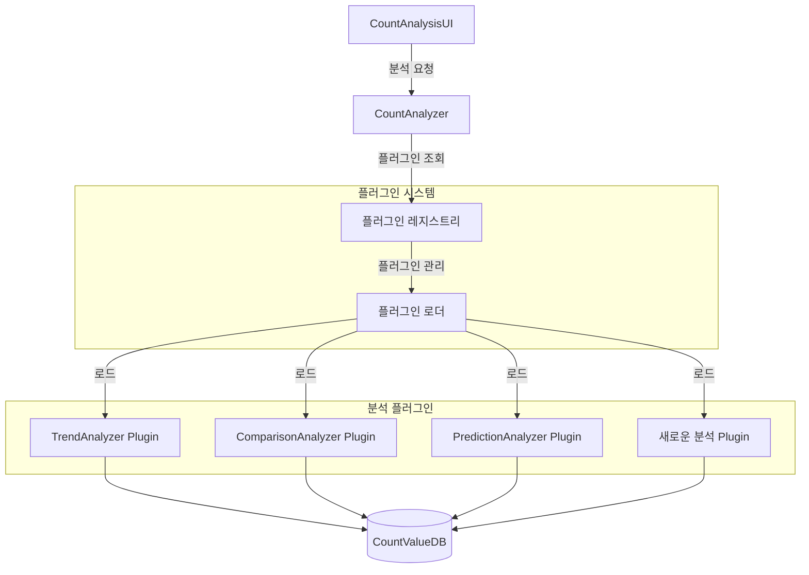
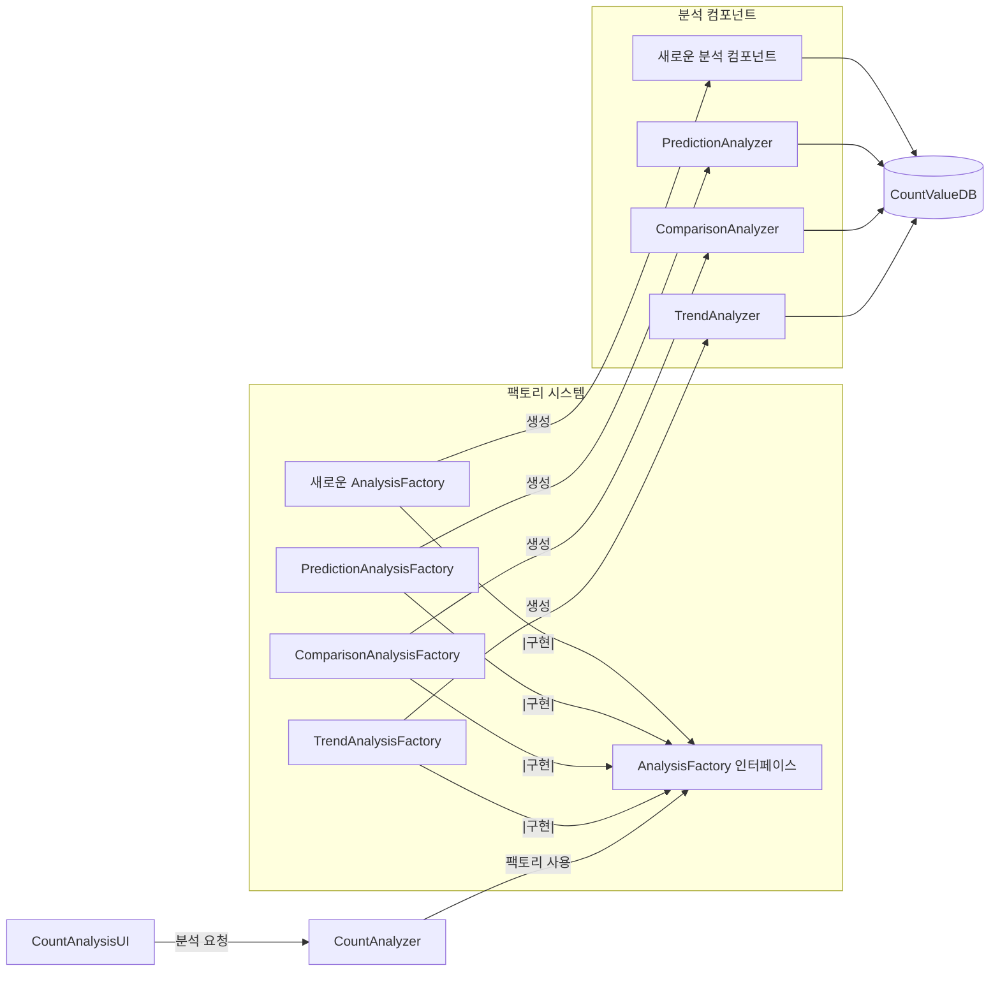
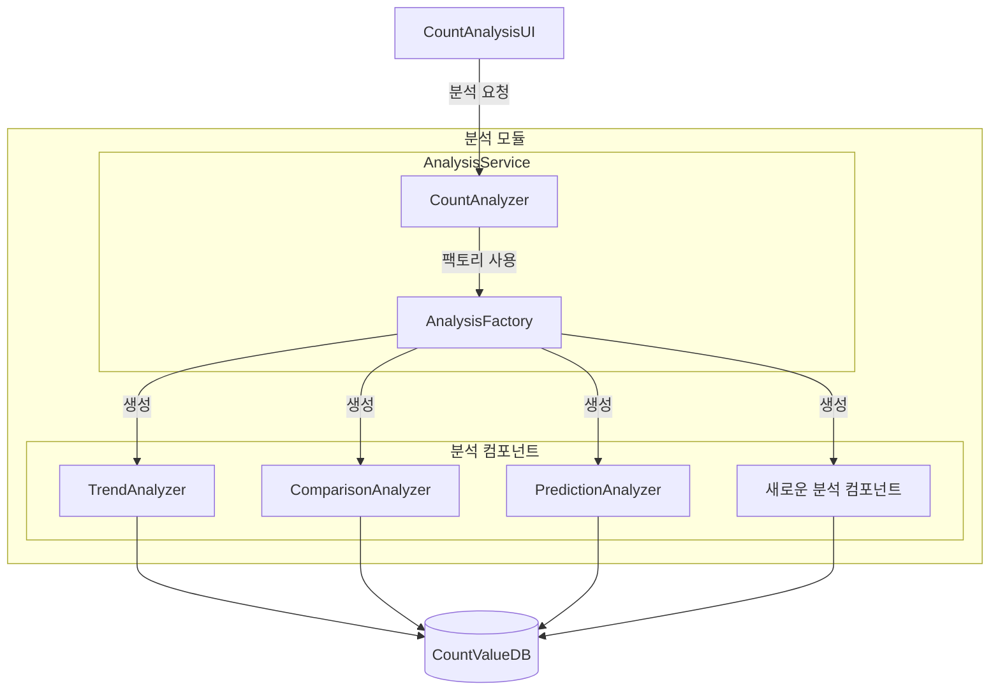

# QS-009-분석-기능-추가-용이성

## 개요

### 목적
이 문서는 QS-009 (분석 기능 추가 용이성) 변경 용이성 시나리오를 분석하고, 변경 용이성 향상을 위한 후보 구조를 설계합니다.

### 관련 품질 시나리오
- **QS-009**: 분석 기능 추가 용이성
- **관련 품질 속성**: QA-005-분석-기능-추가-용이성-최대화 (우선순위 5)

### 관련 Use Case
- **UC-004**: Count 분석

## 1. 변경 용이성 시나리오 분석

### 1.1 시나리오 요약

**시나리오**: 새로운 분석 기능(예: 상관관계 분석)을 추가할 때 필요한 작업의 범위

**측정 항목**: 분석 기능 추가 시 수정/영향을 받는 모듈의 크기

**측정 공식**:
```
변경 비용 = Σ(LOC(추가되는 모듈)) + Σ(LOC(변경되는 모듈)) + Σ(LOC(변경되는 모듈을 의존하는 모듈))
```

**관련 컴포넌트**:
- CountAnalysisUI (Boundary)
- CountAnalyzer (Control)
- TrendAnalyzer (Control)
- ComparisonAnalyzer (Control)
- PredictionAnalyzer (Control)
- 새로운 분석 컴포넌트 (추가될 컴포넌트)

### 1.2 현재 구조 분석

현재 구조에서 분석 기능 추가 시 필요한 작업:

1. **새로운 분석 컴포넌트 개발** (예: CorrelationAnalyzer)
2. **CountAnalyzer 수정**: 새로운 분석 유형 처리 로직 추가
3. **CountAnalysisUI 수정**: 새로운 분석 유형 선택 옵션 추가
4. **테스트 코드 작성**
5. **문서 업데이트**

### 1.3 도메인 모델 분석

`domain/model.md`를 분석한 결과:

- **CountAnalyzer**: 분석 유형에 따라 TrendAnalyzer, ComparisonAnalyzer, PredictionAnalyzer로 위임
- **각 분석 컴포넌트**: CountValueDB에 직접 접근하여 데이터 조회
- **CountAnalysisUI**: 분석 유형 선택 및 결과 표시

현재 구조의 의존성:
```
CountAnalysisUI → CountAnalyzer → TrendAnalyzer
                              → ComparisonAnalyzer
                              → PredictionAnalyzer
```

## 2. 변경 용이성 문제 식별

### 2.1 높은 결합도 문제

**문제**: CountAnalyzer가 구체적인 분석 컴포넌트에 직접 의존

**근거**:
- CountAnalyzer가 TrendAnalyzer, ComparisonAnalyzer, PredictionAnalyzer를 직접 참조
- 새로운 분석 기능 추가 시 CountAnalyzer의 코드 수정 필요
- 분석 컴포넌트 변경 시 CountAnalyzer에 영향

**영향**:
- 변경 비용 증가: 새로운 분석 기능 추가 시 CountAnalyzer 수정 필요
- 변경 시간 증가: CountAnalyzer 수정 및 테스트 시간 소요

### 2.2 변경 영향 범위 문제

**문제**: 새로운 분석 기능 추가 시 여러 컴포넌트 수정 필요

**근거**:
- CountAnalyzer: 새로운 분석 유형 처리 로직 추가
- CountAnalysisUI: 새로운 분석 유형 선택 옵션 추가
- 두 컴포넌트 모두 수정해야 새로운 분석 기능 사용 가능

**영향**:
- 변경 비용 증가: 여러 모듈 수정 필요
- 변경 영향 범위 확대: UI와 비즈니스 로직 모두 변경

### 2.3 직접 의존성 문제

**문제**: 구체적인 구현에 직접 의존하여 변경이 어려움

**근거**:
- CountAnalyzer가 구체적인 분석 컴포넌트 클래스에 직접 의존
- 분석 컴포넌트 교체나 변경 시 CountAnalyzer 수정 필요
- 런타임에 분석 컴포넌트 선택 불가능

**영향**:
- 변경 용이성 저하: 구체적인 구현 변경 시 의존하는 모듈 수정 필요
- 확장성 저하: 새로운 분석 기능 추가가 어려움

### 2.4 낮은 응집도 문제

**문제**: 분석 관련 기능이 여러 컴포넌트에 분산

**근거**:
- 분석 유형 선택 로직이 CountAnalyzer에 있음
- 분석 유형 표시 로직이 CountAnalysisUI에 있음
- 분석 컴포넌트 생성 및 관리 로직이 분산

**영향**:
- 변경 영향 범위 확대: 분석 기능 변경 시 여러 컴포넌트 수정 필요
- 유지보수 어려움: 관련 기능이 분산되어 있어 이해하기 어려움

## 3. 설계 과정 마인드 맵



## 4. 후보 구조 설계

### 4.1 CA-522: 분석 인터페이스 추상화

#### 개요
분석 컴포넌트를 추상화하여 CountAnalyzer가 구체적인 구현이 아닌 인터페이스에 의존하도록 설계합니다.

#### 설계 결정

**CA-522A. AnalysisStrategy 인터페이스 정의**
- 분석 기능을 추상화하는 인터페이스를 정의합니다.
- 인터페이스는 분석 실행 메서드와 분석 유형 식별 메서드를 포함합니다.
- 모든 분석 컴포넌트는 이 인터페이스를 구현합니다.

**CA-522B. CountAnalyzer가 인터페이스에 의존**
- CountAnalyzer는 구체적인 분석 컴포넌트가 아닌 AnalysisStrategy 인터페이스에 의존합니다.
- 분석 유형에 따라 적절한 AnalysisStrategy 구현체를 선택하여 실행합니다.

**CA-522C. 분석 컴포넌트가 인터페이스 구현**
- TrendAnalyzer, ComparisonAnalyzer, PredictionAnalyzer는 AnalysisStrategy 인터페이스를 구현합니다.
- 새로운 분석 컴포넌트도 AnalysisStrategy 인터페이스를 구현하여 추가 가능합니다.

#### 구조 다이어그램



#### 장점

- **변경 용이성 개선**: 새로운 분석 기능 추가 시 CountAnalyzer 수정 불필요 (인터페이스 구현만 추가)
- **결합도 감소**: CountAnalyzer가 구체적인 구현이 아닌 추상화에 의존
- **확장성 향상**: 새로운 분석 컴포넌트를 쉽게 추가 가능
- **테스트 용이성**: 인터페이스를 모킹하여 테스트 가능

#### 단점 및 트레이드오프

- **인터페이스 관리 복잡도**: 분석 컴포넌트 등록 및 관리 메커니즘 필요
- **추상화 계층 추가**: 인터페이스 계층 추가로 인한 복잡도 증가
- **런타임 오류 가능성**: 잘못된 분석 유형 선택 시 런타임 오류 가능

#### 단점 보완 후보 구조

**CA-522D. 분석 컴포넌트 등록 메커니즘**
- 분석 컴포넌트를 자동으로 등록하는 메커니즘을 제공합니다.
- 분석 유형과 구현체를 매핑하는 레지스트리를 구성합니다.
- CountAnalyzer는 레지스트리를 통해 분석 컴포넌트를 조회합니다.

**장점**:
- 분석 컴포넌트 등록 자동화로 관리 복잡도 감소
- 새로운 분석 기능 추가 시 등록만 하면 사용 가능

**단점**:
- 레지스트리 관리 로직 추가로 복잡도 증가

### 4.2 CA-523: 분석 플러그인 아키텍처

#### 개요
분석 기능을 플러그인으로 분리하여 동적으로 로드하고 실행할 수 있도록 설계합니다.

#### 설계 결정

**CA-523A. 분석 플러그인 인터페이스**
- 분석 플러그인이 구현해야 하는 인터페이스를 정의합니다.
- 플러그인 메타데이터(이름, 버전, 분석 유형 등)를 포함합니다.

**CA-523B. 플러그인 레지스트리**
- 등록된 플러그인을 관리하는 레지스트리를 구성합니다.
- 플러그인을 분석 유형별로 조회할 수 있는 기능을 제공합니다.

**CA-523C. 동적 플러그인 로딩**
- 런타임에 플러그인을 동적으로 로드하고 등록합니다.
- 새로운 플러그인 추가 시 시스템 재시작 없이 사용 가능합니다.

#### 구조 다이어그램



#### 장점

- **변경 용이성 대폭 개선**: 새로운 분석 기능을 플러그인으로 추가하여 CountAnalyzer 수정 불필요
- **동적 확장**: 시스템 재시작 없이 새로운 플러그인 추가 가능
- **독립적 배포**: 플러그인을 독립적으로 개발 및 배포 가능
- **변경 영향 범위 최소화**: 플러그인 추가 시 기존 코드 수정 불필요

#### 단점 및 트레이드오프

- **플러그인 관리 복잡도**: 플러그인 로딩, 버전 관리, 의존성 관리 등 복잡도 증가
- **런타임 오류 가능성**: 잘못된 플러그인 로딩 시 런타임 오류 가능
- **성능 오버헤드**: 플러그인 로딩 및 동적 호출로 인한 성능 오버헤드
- **개발 복잡도 증가**: 플러그인 개발 및 배포 프로세스 필요

#### 단점 보완 후보 구조

**CA-523D. 플러그인 메타데이터 관리**
- 플러그인 메타데이터를 중앙에서 관리합니다.
- 플러그인 버전, 의존성, 호환성을 검증하는 메커니즘을 제공합니다.
- 플러그인 등록 시 메타데이터를 검증하여 안전성을 보장합니다.

**장점**:
- 플러그인 호환성 검증으로 런타임 오류 감소
- 메타데이터 기반 관리로 복잡도 감소

**단점**:
- 메타데이터 관리 로직 추가로 복잡도 증가

### 4.3 CA-524: 분석 컴포넌트 팩토리

#### 개요
분석 컴포넌트 생성을 팩토리 패턴으로 캡슐화하여 CountAnalyzer의 책임을 분리합니다.

#### 설계 결정

**CA-524A. AnalysisFactory 인터페이스**
- 분석 컴포넌트를 생성하는 팩토리 인터페이스를 정의합니다.
- 분석 유형에 따라 적절한 분석 컴포넌트를 생성하는 메서드를 포함합니다.

**CA-524B. 분석 유형별 팩토리 구현**
- 각 분석 유형별로 팩토리를 구현합니다.
- TrendAnalysisFactory, ComparisonAnalysisFactory, PredictionAnalysisFactory 등

#### 구조 다이어그램



#### 장점

- **생성 로직 캡슐화**: 분석 컴포넌트 생성 로직을 팩토리에 캡슐화하여 CountAnalyzer 단순화
- **확장성 향상**: 새로운 분석 기능 추가 시 팩토리만 추가하면 됨
- **테스트 용이성**: 팩토리를 모킹하여 테스트 가능

#### 단점 및 트레이드오프

- **팩토리 관리 복잡도**: 팩토리 등록 및 관리 메커니즘 필요
- **추가 계층**: 팩토리 계층 추가로 인한 복잡도 증가

#### 단점 보완 후보 구조

**CA-524C. 팩토리 레지스트리**
- 팩토리를 등록하고 관리하는 레지스트리를 구성합니다.
- 분석 유형에 따라 적절한 팩토리를 조회할 수 있는 기능을 제공합니다.

**장점**:
- 팩토리 관리 자동화로 복잡도 감소

**단점**:
- 레지스트리 관리 로직 추가로 복잡도 증가

### 4.4 CA-525: 분석 모듈 통합 구조

#### 개요
분석 관련 기능을 하나의 모듈로 통합하여 응집도를 높이고 변경 영향 범위를 제한합니다.

#### 설계 결정

**CA-525A. 분석 서비스 레이어 구성**
- 분석 관련 기능을 AnalysisService 레이어로 구성합니다.
- CountAnalyzer, 분석 컴포넌트, 분석 팩토리를 포함합니다.

**CA-525B. 분석 컴포넌트 그룹핑**
- 모든 분석 컴포넌트를 analysis 패키지로 그룹핑합니다.
- 분석 인터페이스, 구현체, 팩토리를 함께 관리합니다.

#### 구조 다이어그램



#### 장점

- **응집도 향상**: 분석 관련 기능을 하나의 모듈로 통합하여 응집도 향상
- **변경 영향 범위 제한**: 분석 기능 변경 시 분석 모듈 내부에서만 영향
- **모듈 독립성**: 분석 모듈을 독립적으로 개발 및 테스트 가능

#### 단점 및 트레이드오프

- **모듈 크기 증가**: 분석 모듈이 커질 수 있음
- **모듈 간 의존성**: 다른 모듈과의 의존성 관리 필요

## 5. 후보 구조 비교

| 후보 구조 | 변경 비용 감소 | 복잡도 증가 | 확장성 | 동적 확장 |
|---------|------------|----------|--------|---------|
| CA-522 (인터페이스 추상화) | 중 | 낮음 | 높음 | 낮음 |
| CA-523 (플러그인 아키텍처) | 매우 높음 | 높음 | 매우 높음 | 높음 |
| CA-524 (팩토리 패턴) | 중 | 중 | 높음 | 낮음 |
| CA-525 (모듈 통합) | 중 | 낮음 | 중 | 낮음 |

## 6. 결론

QS-009 (분석 기능 추가 용이성) 시나리오를 분석한 결과, 다음과 같은 변경 용이성 문제를 식별했습니다:

1. **높은 결합도**: CountAnalyzer가 구체적인 분석 컴포넌트에 직접 의존
2. **변경 영향 범위**: 새로운 분석 기능 추가 시 여러 컴포넌트 수정 필요
3. **직접 의존성**: 구체적인 구현에 직접 의존하여 변경이 어려움
4. **낮은 응집도**: 분석 관련 기능이 여러 컴포넌트에 분산

이러한 문제를 해결하기 위해 다음과 같은 후보 구조를 설계했습니다:

- **CA-522**: 분석 인터페이스 추상화 (전략 패턴)
- **CA-523**: 분석 플러그인 아키텍처 (플러그인 패턴)
- **CA-524**: 분석 컴포넌트 팩토리 (팩토리 패턴)
- **CA-525**: 분석 모듈 통합 구조 (모듈화)

각 후보 구조는 변경 용이성 향상에 기여하지만, 복잡도와 성능에 대한 트레이드오프가 있습니다. 프로젝트의 요구사항과 제약사항을 고려하여 적절한 후보 구조를 선택해야 합니다.
