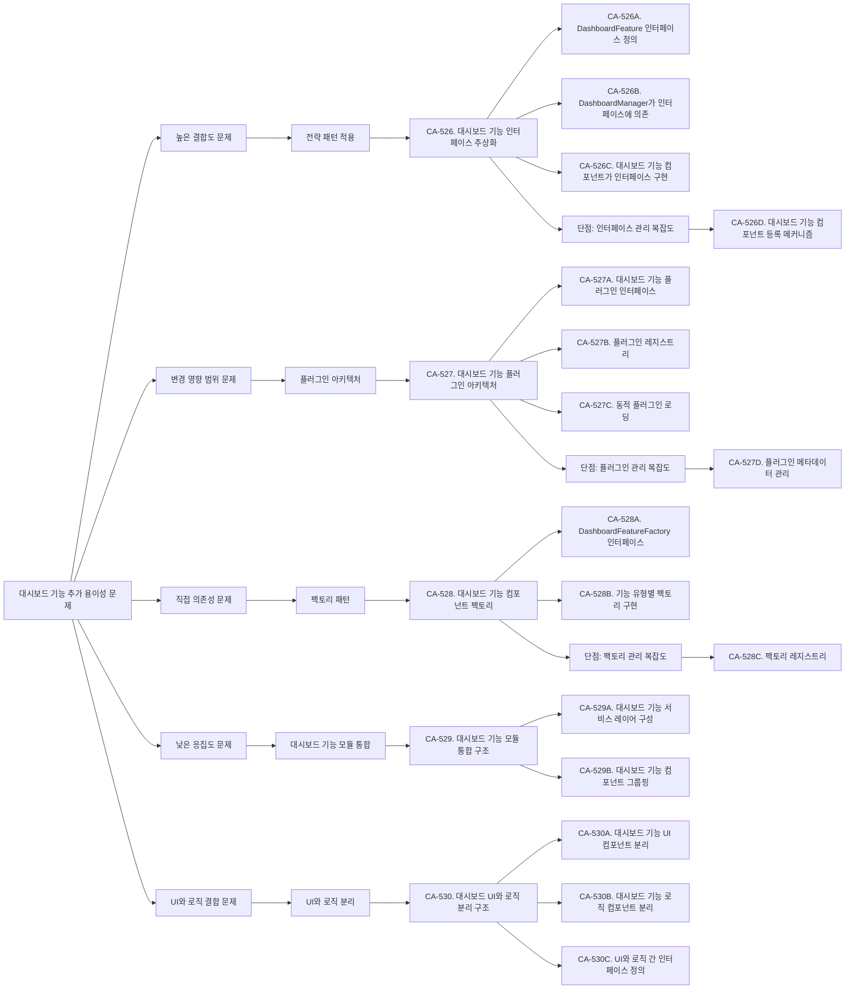
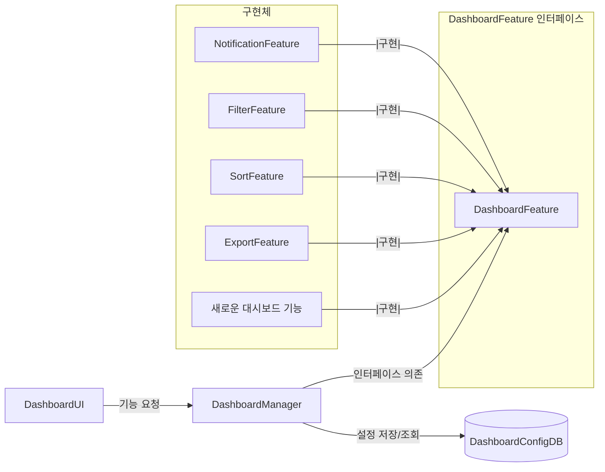
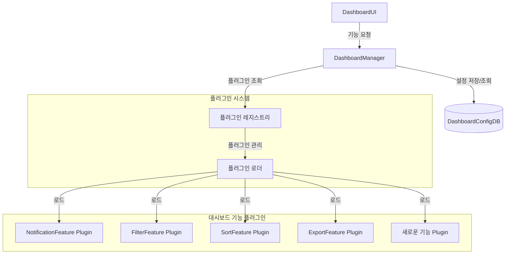
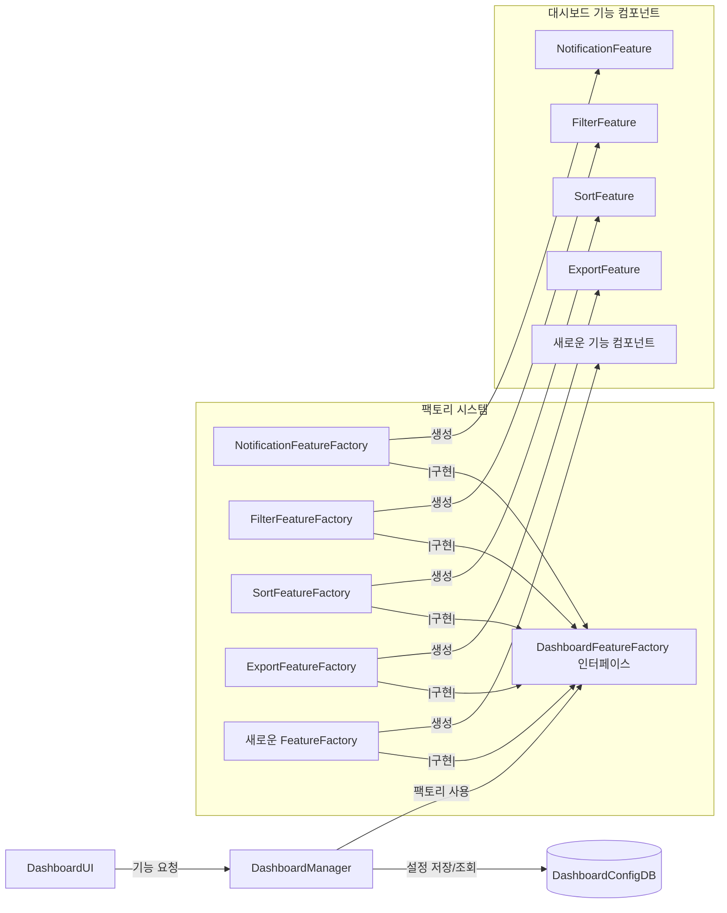
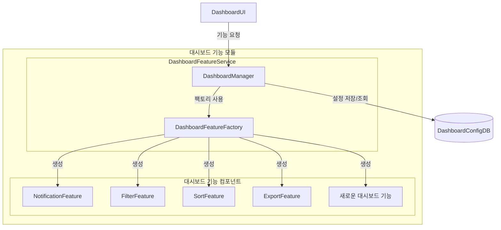
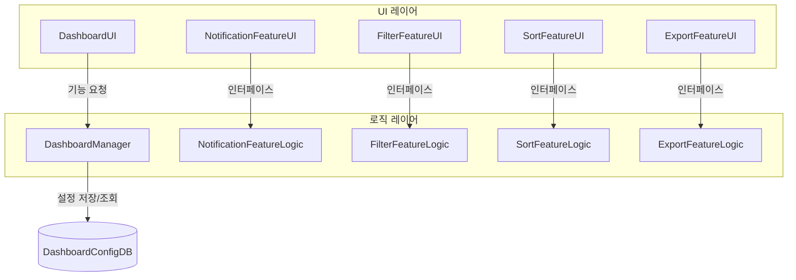

# QS-010-대시보드-기능-추가-용이성

## 개요

### 목적
이 문서는 QS-010 (대시보드 기능 추가 용이성) 변경 용이성 시나리오를 분석하고, 변경 용이성 향상을 위한 후보 구조를 설계합니다.

### 관련 품질 시나리오
- **QS-010**: 대시보드 기능 추가 용이성
- **관련 품질 속성**: QA-006-대시보드-기능-추가-용이성-최대화 (우선순위 6)

### 관련 Use Case
- **UC-005**: Count 모니터링

## 1. 변경 용이성 시나리오 분석

### 1.1 시나리오 요약

**시나리오**: 대시보드에 새로운 기능(예: 알림 기능, 필터 기능, 정렬 기능, 내보내기 기능 등)을 추가할 때 필요한 작업의 범위

**측정 항목**: 대시보드 기능 추가 시 수정/영향을 받는 모듈의 크기

**측정 공식**:
```
변경 비용 = Σ(LOC(추가되는 모듈)) + Σ(LOC(변경되는 모듈)) + Σ(LOC(변경되는 모듈을 의존하는 모듈))
```

**관련 컴포넌트**:
- DashboardUI (Boundary)
- DashboardManager (Control)
- DashboardConfigDB (Entity)
- 새로운 기능 컴포넌트 (추가될 컴포넌트)

### 1.2 현재 구조 분석

현재 구조에서 대시보드 기능 추가 시 필요한 작업:

1. **새로운 기능 컴포넌트 개발** (예: NotificationFeature, FilterFeature)
2. **DashboardManager 수정**: 새로운 기능 처리 로직 추가
3. **DashboardUI 수정**: 새로운 기능 UI 추가
4. **DashboardConfigDB 스키마 수정**: 새로운 기능 설정 저장을 위한 스키마 변경 (필요한 경우)
5. **테스트 코드 작성**
6. **문서 업데이트**

### 1.3 도메인 모델 분석

`domain/model.md`를 분석한 결과:

- **DashboardManager**: 대시보드 데이터 조회, 구성 저장/조회, 실시간 업데이트 처리
- **DashboardUI**: 대시보드 화면 표시, 사용자 상호작용 처리, 대시보드 편집 모드 지원
- **DashboardConfigDB**: 대시보드 구성 정보 저장 (표시할 Count 목록, 분석 데이터 목록, 요소별 표시 옵션, 레이아웃 정보 등)

현재 구조의 의존성:
```
DashboardUI → DashboardManager → DashboardConfigDB
```

### 1.4 배치 구조 분석

`architecture/deployment.md`를 분석한 결과:

- **대시보드 제공 서비스**: DashboardUI, DashboardManager 포함
- **대시보드 갱신 서비스**: DashboardUpdater, CountReader 포함
- **DashboardConfigDB**: 대시보드 구성 정보 저장

대시보드 기능 추가 시 영향 범위:
- 대시보드 제공 서비스: DashboardUI, DashboardManager 수정 필요
- DashboardConfigDB: 새로운 기능 설정 저장을 위한 스키마 변경 필요 (필요한 경우)

## 2. 변경 용이성 문제 식별

### 2.1 높은 결합도 문제

**문제**: DashboardManager가 대시보드 기능을 직접 처리하여 결합도가 높음

**근거**:
- DashboardManager가 모든 대시보드 기능을 직접 처리
- 새로운 기능 추가 시 DashboardManager의 코드 수정 필요
- 기능 변경 시 DashboardManager에 영향

**영향**:
- 변경 비용 증가: 새로운 기능 추가 시 DashboardManager 수정 필요
- 변경 시간 증가: DashboardManager 수정 및 테스트 시간 소요

### 2.2 변경 영향 범위 문제

**문제**: 새로운 대시보드 기능 추가 시 여러 컴포넌트 수정 필요

**근거**:
- DashboardManager: 새로운 기능 처리 로직 추가
- DashboardUI: 새로운 기능 UI 추가
- DashboardConfigDB: 새로운 기능 설정 저장을 위한 스키마 변경 (필요한 경우)
- 세 컴포넌트 모두 수정해야 새로운 기능 사용 가능

**영향**:
- 변경 비용 증가: 여러 모듈 수정 필요
- 변경 영향 범위 확대: UI, 비즈니스 로직, 데이터 모델 모두 변경

### 2.3 직접 의존성 문제

**문제**: 구체적인 구현에 직접 의존하여 변경이 어려움

**근거**:
- DashboardManager가 구체적인 기능 처리 로직에 직접 의존
- 기능 교체나 변경 시 DashboardManager 수정 필요
- 런타임에 기능 선택 불가능

**영향**:
- 변경 용이성 저하: 구체적인 구현 변경 시 의존하는 모듈 수정 필요
- 확장성 저하: 새로운 기능 추가가 어려움

### 2.4 낮은 응집도 문제

**문제**: 대시보드 관련 기능이 여러 컴포넌트에 분산

**근거**:
- 기능 처리 로직이 DashboardManager에 있음
- 기능 UI 로직이 DashboardUI에 있음
- 기능 설정 저장 로직이 DashboardConfigDB에 있음
- 기능 컴포넌트 생성 및 관리 로직이 분산

**영향**:
- 변경 영향 범위 확대: 대시보드 기능 변경 시 여러 컴포넌트 수정 필요
- 유지보수 어려움: 관련 기능이 분산되어 있어 이해하기 어려움

### 2.5 UI와 로직 결합 문제

**문제**: DashboardUI와 DashboardManager가 밀접하게 결합되어 있음

**근거**:
- DashboardUI가 DashboardManager의 구체적인 메서드를 직접 호출
- 새로운 기능 추가 시 UI와 로직 모두 수정 필요
- UI 변경이 로직에 영향을 미치고, 로직 변경이 UI에 영향을 미침

**영향**:
- 변경 영향 범위 확대: UI와 로직을 함께 수정해야 함
- 테스트 어려움: UI와 로직이 결합되어 있어 독립적 테스트 어려움

## 3. 설계 과정 마인드 맵



## 4. 후보 구조 설계

### 4.1 CA-526: 대시보드 기능 인터페이스 추상화

#### 개요
대시보드 기능 컴포넌트를 추상화하여 DashboardManager가 구체적인 구현이 아닌 인터페이스에 의존하도록 설계합니다.

#### 설계 결정

**CA-526A. DashboardFeature 인터페이스 정의**
- 대시보드 기능을 추상화하는 인터페이스를 정의합니다.
- 인터페이스는 기능 실행 메서드, 기능 설정 메서드, 기능 UI 렌더링 메서드를 포함합니다.
- 모든 대시보드 기능 컴포넌트는 이 인터페이스를 구현합니다.

**CA-526B. DashboardManager가 인터페이스에 의존**
- DashboardManager는 구체적인 기능 컴포넌트가 아닌 DashboardFeature 인터페이스에 의존합니다.
- 기능 유형에 따라 적절한 DashboardFeature 구현체를 선택하여 실행합니다.

**CA-526C. 대시보드 기능 컴포넌트가 인터페이스 구현**
- 알림 기능, 필터 기능, 정렬 기능 등은 DashboardFeature 인터페이스를 구현합니다.
- 새로운 대시보드 기능도 DashboardFeature 인터페이스를 구현하여 추가 가능합니다.

#### 구조 다이어그램



#### 장점

- **변경 용이성 개선**: 새로운 대시보드 기능 추가 시 DashboardManager 수정 불필요 (인터페이스 구현만 추가)
- **결합도 감소**: DashboardManager가 구체적인 구현이 아닌 추상화에 의존
- **확장성 향상**: 새로운 대시보드 기능을 쉽게 추가 가능
- **테스트 용이성**: 인터페이스를 모킹하여 테스트 가능

#### 단점 및 트레이드오프

- **인터페이스 관리 복잡도**: 대시보드 기능 컴포넌트 등록 및 관리 메커니즘 필요
- **추상화 계층 추가**: 인터페이스 계층 추가로 인한 복잡도 증가
- **런타임 오류 가능성**: 잘못된 기능 유형 선택 시 런타임 오류 가능

#### 단점 보완 후보 구조

**CA-526D. 대시보드 기능 컴포넌트 등록 메커니즘**
- 대시보드 기능 컴포넌트를 자동으로 등록하는 메커니즘을 제공합니다.
- 기능 유형과 구현체를 매핑하는 레지스트리를 구성합니다.
- DashboardManager는 레지스트리를 통해 기능 컴포넌트를 조회합니다.

**장점**:
- 대시보드 기능 컴포넌트 등록 자동화로 관리 복잡도 감소
- 새로운 기능 추가 시 등록만 하면 사용 가능

**단점**:
- 레지스트리 관리 로직 추가로 복잡도 증가

### 4.2 CA-527: 대시보드 기능 플러그인 아키텍처

#### 개요
대시보드 기능을 플러그인으로 분리하여 동적으로 로드하고 실행할 수 있도록 설계합니다.

#### 설계 결정

**CA-527A. 대시보드 기능 플러그인 인터페이스**
- 대시보드 기능 플러그인이 구현해야 하는 인터페이스를 정의합니다.
- 플러그인 메타데이터(이름, 버전, 기능 유형 등)를 포함합니다.

**CA-527B. 플러그인 레지스트리**
- 등록된 플러그인을 관리하는 레지스트리를 구성합니다.
- 플러그인을 기능 유형별로 조회할 수 있는 기능을 제공합니다.

**CA-527C. 동적 플러그인 로딩**
- 런타임에 플러그인을 동적으로 로드하고 등록합니다.
- 새로운 플러그인 추가 시 시스템 재시작 없이 사용 가능합니다.

#### 구조 다이어그램



#### 장점

- **변경 용이성 대폭 개선**: 새로운 대시보드 기능을 플러그인으로 추가하여 DashboardManager 수정 불필요
- **동적 확장**: 시스템 재시작 없이 새로운 플러그인 추가 가능
- **독립적 배포**: 플러그인을 독립적으로 개발 및 배포 가능
- **변경 영향 범위 최소화**: 플러그인 추가 시 기존 코드 수정 불필요

#### 단점 및 트레이드오프

- **플러그인 관리 복잡도**: 플러그인 로딩, 버전 관리, 의존성 관리 등 복잡도 증가
- **런타임 오류 가능성**: 잘못된 플러그인 로딩 시 런타임 오류 가능
- **성능 오버헤드**: 플러그인 로딩 및 동적 호출로 인한 성능 오버헤드
- **개발 복잡도 증가**: 플러그인 개발 및 배포 프로세스 필요

#### 단점 보완 후보 구조

**CA-527D. 플러그인 메타데이터 관리**
- 플러그인 메타데이터를 중앙에서 관리합니다.
- 플러그인 버전, 의존성, 호환성을 검증하는 메커니즘을 제공합니다.
- 플러그인 등록 시 메타데이터를 검증하여 안전성을 보장합니다.

**장점**:
- 플러그인 호환성 검증으로 런타임 오류 감소
- 메타데이터 기반 관리로 복잡도 감소

**단점**:
- 메타데이터 관리 로직 추가로 복잡도 증가

### 4.3 CA-528: 대시보드 기능 컴포넌트 팩토리

#### 개요
대시보드 기능 컴포넌트 생성을 팩토리 패턴으로 캡슐화하여 DashboardManager의 책임을 분리합니다.

#### 설계 결정

**CA-528A. DashboardFeatureFactory 인터페이스**
- 대시보드 기능 컴포넌트를 생성하는 팩토리 인터페이스를 정의합니다.
- 기능 유형에 따라 적절한 기능 컴포넌트를 생성하는 메서드를 포함합니다.

**CA-528B. 기능 유형별 팩토리 구현**
- 각 기능 유형별로 팩토리를 구현합니다.
- NotificationFeatureFactory, FilterFeatureFactory, SortFeatureFactory, ExportFeatureFactory 등

#### 구조 다이어그램



#### 장점

- **생성 로직 캡슐화**: 대시보드 기능 컴포넌트 생성 로직을 팩토리에 캡슐화하여 DashboardManager 단순화
- **확장성 향상**: 새로운 대시보드 기능 추가 시 팩토리만 추가하면 됨
- **테스트 용이성**: 팩토리를 모킹하여 테스트 가능

#### 단점 및 트레이드오프

- **팩토리 관리 복잡도**: 팩토리 등록 및 관리 메커니즘 필요
- **추가 계층**: 팩토리 계층 추가로 인한 복잡도 증가

#### 단점 보완 후보 구조

**CA-528C. 팩토리 레지스트리**
- 팩토리를 등록하고 관리하는 레지스트리를 구성합니다.
- 기능 유형에 따라 적절한 팩토리를 조회할 수 있는 기능을 제공합니다.

**장점**:
- 팩토리 관리 자동화로 복잡도 감소

**단점**:
- 레지스트리 관리 로직 추가로 복잡도 증가

### 4.4 CA-529: 대시보드 기능 모듈 통합 구조

#### 개요
대시보드 관련 기능을 하나의 모듈로 통합하여 응집도를 높이고 변경 영향 범위를 제한합니다.

#### 설계 결정

**CA-529A. 대시보드 기능 서비스 레이어 구성**
- 대시보드 관련 기능을 DashboardFeatureService 레이어로 구성합니다.
- DashboardManager, 대시보드 기능 컴포넌트, 대시보드 기능 팩토리를 포함합니다.

**CA-529B. 대시보드 기능 컴포넌트 그룹핑**
- 모든 대시보드 기능 컴포넌트를 dashboard-feature 패키지로 그룹핑합니다.
- 대시보드 기능 인터페이스, 구현체, 팩토리를 함께 관리합니다.

#### 구조 다이어그램



#### 장점

- **응집도 향상**: 대시보드 관련 기능을 하나의 모듈로 통합하여 응집도 향상
- **변경 영향 범위 제한**: 대시보드 기능 변경 시 기능 모듈 내부에서만 영향
- **모듈 독립성**: 대시보드 기능 모듈을 독립적으로 개발 및 테스트 가능

#### 단점 및 트레이드오프

- **모듈 크기 증가**: 대시보드 기능 모듈이 커질 수 있음
- **모듈 간 의존성**: 다른 모듈과의 의존성 관리 필요

### 4.5 CA-530: 대시보드 UI와 로직 분리 구조

#### 개요
대시보드 UI와 로직을 분리하여 UI 변경이 로직에 영향을 미치지 않도록 설계합니다.

#### 설계 결정

**CA-530A. 대시보드 기능 UI 컴포넌트 분리**
- 대시보드 기능의 UI 컴포넌트를 별도로 분리합니다.
- 각 기능별로 독립적인 UI 컴포넌트를 구성합니다.

**CA-530B. 대시보드 기능 로직 컴포넌트 분리**
- 대시보드 기능의 로직 컴포넌트를 별도로 분리합니다.
- 각 기능별로 독립적인 로직 컴포넌트를 구성합니다.

**CA-530C. UI와 로직 간 인터페이스 정의**
- UI와 로직 간의 인터페이스를 명확히 정의합니다.
- UI는 로직의 인터페이스를 통해서만 접근합니다.

#### 구조 다이어그램



#### 장점

- **UI와 로직 분리**: UI 변경이 로직에 영향을 미치지 않음
- **독립적 개발**: UI와 로직을 독립적으로 개발 및 테스트 가능
- **변경 영향 범위 제한**: UI 변경 시 로직 수정 불필요

#### 단점 및 트레이드오프

- **인터페이스 관리 복잡도**: UI와 로직 간 인터페이스 정의 및 관리 필요
- **추가 계층**: 인터페이스 계층 추가로 인한 복잡도 증가

## 5. 후보 구조 비교

| 후보 구조 | 변경 비용 감소 | 복잡도 증가 | 확장성 | 동적 확장 |
|---------|------------|----------|--------|---------|
| CA-526 (인터페이스 추상화) | 중 | 낮음 | 높음 | 낮음 |
| CA-527 (플러그인 아키텍처) | 매우 높음 | 높음 | 매우 높음 | 높음 |
| CA-528 (팩토리 패턴) | 중 | 중 | 높음 | 낮음 |
| CA-529 (모듈 통합) | 중 | 낮음 | 중 | 낮음 |
| CA-530 (UI와 로직 분리) | 중 | 중 | 높음 | 낮음 |

## 6. 결론

QS-010 (대시보드 기능 추가 용이성) 시나리오를 분석한 결과, 다음과 같은 변경 용이성 문제를 식별했습니다:

1. **높은 결합도**: DashboardManager가 구체적인 기능 컴포넌트에 직접 의존
2. **변경 영향 범위**: 새로운 대시보드 기능 추가 시 여러 컴포넌트 수정 필요
3. **직접 의존성**: 구체적인 구현에 직접 의존하여 변경이 어려움
4. **낮은 응집도**: 대시보드 관련 기능이 여러 컴포넌트에 분산
5. **UI와 로직 결합**: DashboardUI와 DashboardManager가 밀접하게 결합

이러한 문제를 해결하기 위해 다음과 같은 후보 구조를 설계했습니다:

- **CA-526**: 대시보드 기능 인터페이스 추상화 (전략 패턴)
- **CA-527**: 대시보드 기능 플러그인 아키텍처 (플러그인 패턴)
- **CA-528**: 대시보드 기능 컴포넌트 팩토리 (팩토리 패턴)
- **CA-529**: 대시보드 기능 모듈 통합 구조 (모듈화)
- **CA-530**: 대시보드 UI와 로직 분리 구조 (관심사 분리)

각 후보 구조는 변경 용이성 향상에 기여하지만, 복잡도와 성능에 대한 트레이드오프가 있습니다. 프로젝트의 요구사항과 제약사항을 고려하여 적절한 후보 구조를 선택해야 합니다.
