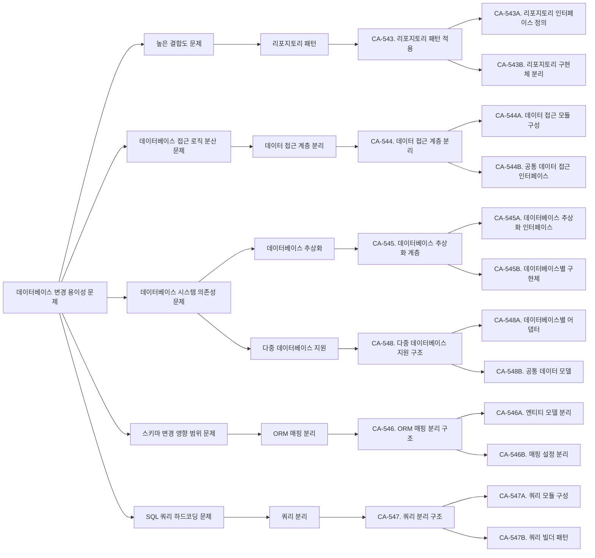
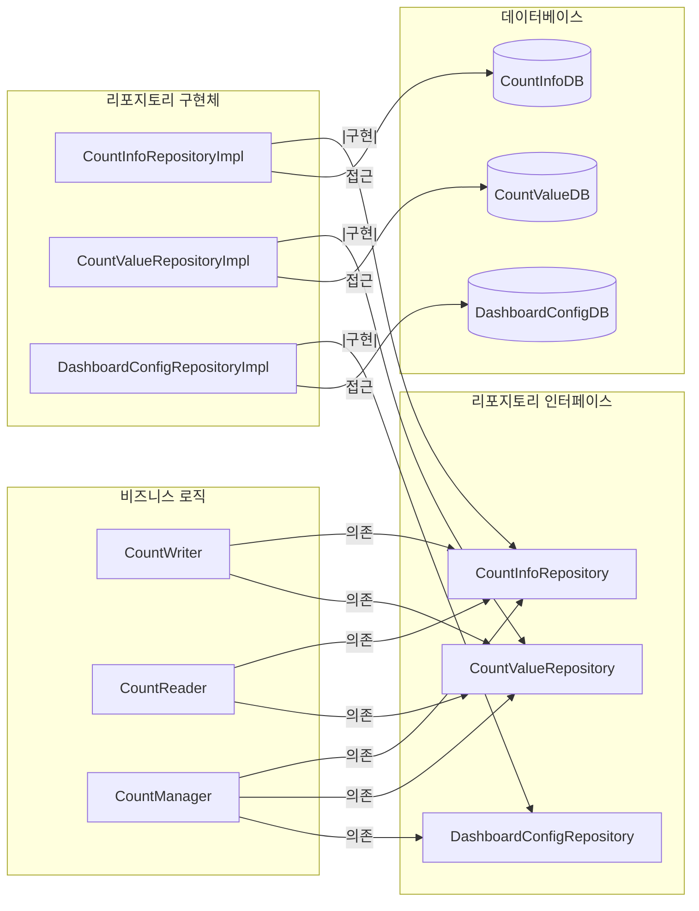
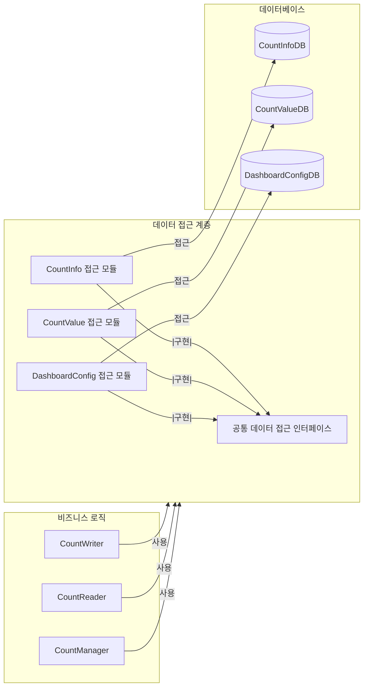
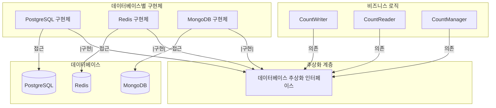
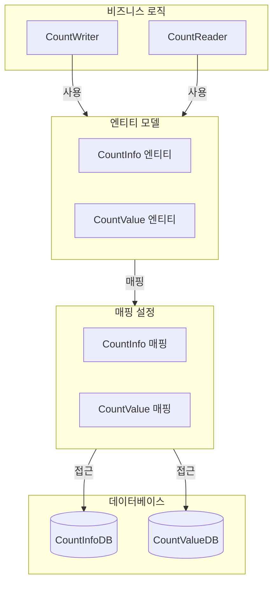
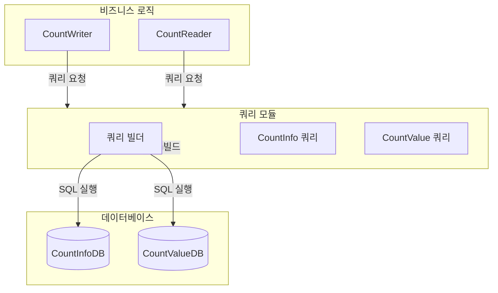
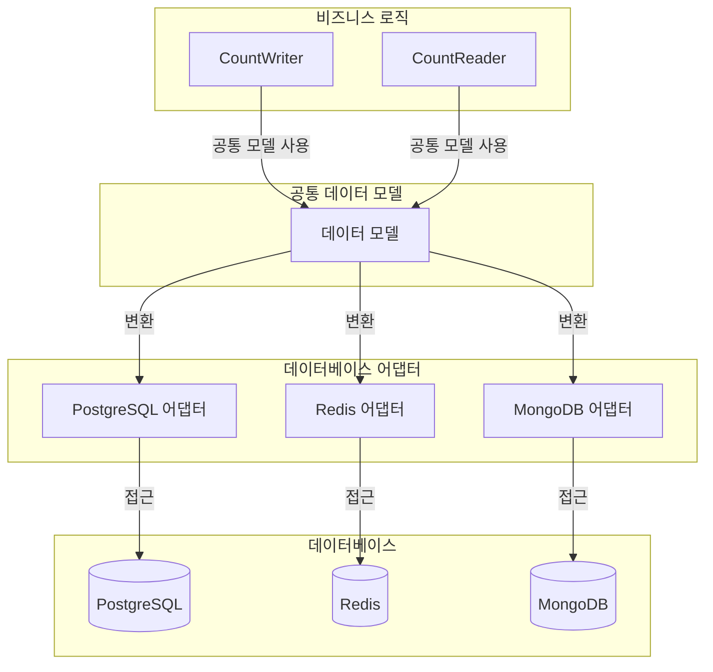

# QS-011-데이터베이스-변경-용이성

## 개요

### 목적
이 문서는 QS-011 (데이터베이스 변경 용이성) 변경 용이성 시나리오를 분석하고, 변경 용이성 향상을 위한 후보 구조를 설계합니다.

### 관련 품질 시나리오
- **QS-011**: 데이터베이스 변경 용이성
- **관련 품질 속성**: 변경 용이성 (구현 방식 변경)

### 관련 Use Case
- **UC-001**: Count 저장
- **UC-002**: Count 조회
- **UC-003**: Count 관리
- **UC-004**: Count 분석
- **UC-005**: Count 모니터링

## 1. 변경 용이성 시나리오 분석

### 1.1 시나리오 요약

**시나리오**: 데이터베이스 스키마나 데이터베이스 시스템을 변경할 때 영향받는 모듈의 범위

**변경 유형**:
- 스키마 변경: 테이블 추가/수정/삭제, 컬럼 추가/수정/삭제
- 데이터베이스 시스템 변경: MySQL → PostgreSQL, PostgreSQL → MongoDB 등
- 데이터베이스 버전 업그레이드

**측정 항목**: 데이터베이스 변경 시 수정/영향을 받는 모듈의 크기

**측정 공식**:
```
변경 비용 = Σ(LOC_modified)
```

여기서:
- `LOC_modified`: 변경으로 인해 수정이 필요한 각 모듈의 코드 라인 수(Lines of Code)

**관련 컴포넌트**:
- CountInfoDB (Entity)
- CountValueDB (Entity)
- DashboardConfigDB (Entity)
- CountWriter (Control)
- CountReader (Control)
- CountManager (Control)
- CountAnalyzer (Control)
- DashboardManager (Control)

### 1.2 현재 구조 분석

현재 구조에서 데이터베이스 변경 시 필요한 작업:

1. **데이터베이스 스키마 변경 또는 마이그레이션 수행**
2. **데이터베이스 접근 코드 수정**: SQL 쿼리, ORM 매핑 등
3. **ORM 매핑 수정**: 엔티티 클래스, 매핑 설정 등 (사용하는 경우)
4. **관련 Control 컴포넌트 수정**: 데이터베이스 접근 로직 변경
5. **테스트 코드 수정**
6. **문서 업데이트**

**현재 구조의 문제점**:
- Control 컴포넌트가 데이터베이스에 직접 의존하여 스키마 변경 시 여러 컴포넌트 수정 필요
- 데이터베이스 접근 로직이 여러 Control 컴포넌트에 분산
- 데이터베이스 시스템 변경 시 모든 접근 코드 수정 필요

### 1.3 도메인 모델 분석

`domain/model.md`를 분석한 결과:

- **CountInfoDB**: Count 정보(메타데이터)의 영속적 저장 및 관리
- **CountValueDB**: Count 값의 영속적 저장 및 관리
- **DashboardConfigDB**: 대시보드 구성 정보의 영속적 저장 및 관리

현재 구조의 의존성:
```
CountWriter → CountInfoDB, CountValueDB
CountReader → CountInfoDB, CountValueDB
CountManager → CountInfoDB, CountValueDB
CountAnalyzer → CountValueDB
DashboardManager → DashboardConfigDB
```

### 1.4 배치 구조 분석

`architecture/deployment.md`를 분석한 결과:

- **CountInfoDB**: PostgreSQL
- **CountValueDB**: Redis
- **DashboardConfigDB**: PostgreSQL

데이터베이스 변경 시 영향 범위:
- Count 저장 서비스: CountInfoDB, CountValueDB 접근 코드 수정 필요
- Count 조회 서비스: CountInfoDB, CountValueDB 접근 코드 수정 필요
- Count 관리 서비스: CountInfoDB, CountValueDB 접근 코드 수정 필요
- Count 분석 서비스: CountValueDB 접근 코드 수정 필요
- 대시보드 제공 서비스: DashboardConfigDB 접근 코드 수정 필요

## 2. 변경 용이성 문제 식별

### 2.1 높은 결합도 문제

**문제**: Control 컴포넌트가 데이터베이스에 직접 의존하여 결합도가 높음

**근거**:
- CountWriter, CountReader 등이 데이터베이스에 직접 접근
- 스키마 변경 시 여러 Control 컴포넌트 수정 필요
- 데이터베이스 시스템 변경 시 모든 Control 컴포넌트 수정 필요

**영향**:
- 변경 비용 증가: 데이터베이스 변경 시 여러 컴포넌트 수정 필요
- 변경 시간 증가: 데이터베이스 변경 및 테스트 시간 소요

### 2.2 데이터베이스 접근 로직 분산 문제

**문제**: 데이터베이스 접근 로직이 여러 Control 컴포넌트에 분산되어 있음

**근거**:
- CountWriter, CountReader, CountManager 등이 각각 데이터베이스 접근 로직 포함
- 동일한 데이터베이스 접근 패턴이 여러 곳에 중복 구현
- 데이터베이스 변경 시 여러 곳을 수정해야 함

**영향**:
- 변경 영향 범위 확대: 데이터베이스 변경 시 여러 컴포넌트 수정 필요
- 중복 코드 발생: 유사한 데이터베이스 접근 로직 중복

### 2.3 데이터베이스 시스템 의존성 문제

**문제**: Control 컴포넌트가 특정 데이터베이스 시스템에 의존

**근거**:
- PostgreSQL, Redis 등 특정 데이터베이스 시스템에 직접 의존
- 데이터베이스 시스템 변경 시 모든 접근 코드 수정 필요
- 데이터베이스별 특화 기능 사용으로 인한 의존성 증가

**영향**:
- 변경 용이성 저하: 데이터베이스 시스템 변경이 어려움
- 확장성 저하: 다른 데이터베이스 시스템으로 전환 어려움

### 2.4 스키마 변경 영향 범위 문제

**문제**: 스키마 변경 시 여러 컴포넌트에 영향

**근거**:
- 여러 Control 컴포넌트가 동일한 테이블/컬럼 사용
- 스키마 변경 시 모든 관련 컴포넌트 수정 필요
- ORM 매핑 변경 시 엔티티 클래스 및 매핑 설정 수정 필요

**영향**:
- 변경 비용 증가: 스키마 변경 시 여러 컴포넌트 수정 필요
- 변경 영향 범위 확대: 스키마 변경이 전체 시스템에 영향

### 2.5 SQL 쿼리 하드코딩 문제

**문제**: SQL 쿼리가 Control 컴포넌트에 하드코딩되어 있음

**근거**:
- SQL 쿼리가 Control 컴포넌트에 직접 포함
- 스키마 변경 시 SQL 쿼리 수정 필요
- 데이터베이스 시스템 변경 시 SQL 쿼리 재작성 필요

**영향**:
- 변경 영향 범위 확대: SQL 쿼리 변경 시 여러 곳 수정 필요
- 유지보수 어려움: SQL 쿼리가 분산되어 관리 어려움

## 3. 설계 과정 마인드 맵



## 4. 후보 구조 설계

### 4.1 CA-543: 리포지토리 패턴 적용

#### 개요
데이터베이스 접근 로직을 리포지토리 패턴으로 캡슐화하여 Control 컴포넌트가 데이터베이스에 직접 의존하지 않도록 설계합니다.

#### 설계 결정

**CA-543A. 리포지토리 인터페이스 정의**
- 데이터베이스 접근을 추상화하는 리포지토리 인터페이스를 정의합니다.
- 인터페이스는 도메인 모델에 기반한 메서드를 포함합니다.
- Control 컴포넌트는 리포지토리 인터페이스에만 의존합니다.

**CA-543B. 리포지토리 구현체 분리**
- 리포지토리 구현체를 별도 모듈로 분리합니다.
- 데이터베이스별 구현체를 제공합니다.
- 스키마 변경 시 리포지토리 구현체만 수정하면 됨

#### 구조 다이어그램



#### 장점

- **데이터베이스 독립성**: Control 컴포넌트가 데이터베이스에 직접 의존하지 않음
- **변경 영향 범위 제한**: 스키마 변경 시 리포지토리 구현체만 수정하면 됨
- **테스트 용이성**: 리포지토리 인터페이스를 모킹하여 비즈니스 로직 테스트 가능

#### 단점 및 트레이드오프

- **추가 계층**: 리포지토리 계층 추가로 인한 복잡도 증가
- **성능 오버헤드**: 리포지토리 계층을 통한 추가 호출 오버헤드

### 4.2 CA-544: 데이터 접근 계층 분리

#### 개요
데이터베이스 접근 로직을 별도 계층으로 분리하여 재사용성을 높이고 변경 영향 범위를 제한합니다.

#### 설계 결정

**CA-544A. 데이터 접근 모듈 구성**
- 데이터베이스 접근 로직을 `data-access` 모듈로 구성합니다.
- 각 데이터베이스별 접근 모듈 포함
- 공통 데이터 접근 유틸리티 포함

**CA-544B. 공통 데이터 접근 인터페이스**
- 데이터베이스 접근을 위한 공통 인터페이스를 정의합니다.
- CRUD 작업을 추상화하는 인터페이스
- 모든 데이터 접근 모듈이 이 인터페이스를 구현

#### 구조 다이어그램



#### 장점

- **모듈 재사용성**: 데이터 접근 모듈을 다른 곳에서 재사용 가능
- **변경 영향 범위 제한**: 데이터 접근 모듈 변경이 비즈니스 로직에 영향 없음
- **독립적 개발**: 데이터 접근 모듈을 독립적으로 개발 및 테스트 가능

#### 단점 및 트레이드오프

- **모듈 관리 복잡도**: 여러 모듈 관리 필요
- **모듈 간 의존성**: 모듈 간 의존성 관리 필요

### 4.3 CA-545: 데이터베이스 추상화 계층

#### 개요
데이터베이스를 완전히 추상화하여 비즈니스 로직이 특정 데이터베이스 시스템에 의존하지 않도록 설계합니다.

#### 설계 결정

**CA-545A. 데이터베이스 추상화 인터페이스**
- 데이터베이스 접근을 추상화하는 인터페이스를 정의합니다.
- 데이터베이스 시스템에 독립적인 메서드 정의
- 비즈니스 로직은 추상화 인터페이스에만 의존

**CA-545B. 데이터베이스별 구현체**
- 각 데이터베이스 시스템별로 추상화 인터페이스를 구현하는 어댑터를 제공합니다.
- PostgreSQL, Redis, MongoDB 등 각 데이터베이스별 구현체
- 데이터베이스 시스템 변경 시 구현체만 교체하면 됨

#### 구조 다이어그램



#### 장점

- **완전한 데이터베이스 독립성**: 비즈니스 로직이 데이터베이스 시스템에 전혀 의존하지 않음
- **데이터베이스 시스템 변경 용이**: 데이터베이스 시스템 변경 시 구현체만 교체하면 됨
- **다중 데이터베이스 지원**: 여러 데이터베이스 시스템을 동시에 지원 가능

#### 단점 및 트레이드오프

- **추상화 계층 추가**: 추상화 계층 추가로 인한 복잡도 증가
- **성능 오버헤드**: 추상화 계층을 통한 데이터 변환 오버헤드
- **기능 제한**: 추상화로 인해 데이터베이스별 특화 기능 사용 어려움

### 4.4 CA-546: ORM 매핑 분리 구조

#### 개요
ORM 매핑을 별도 모듈로 분리하여 스키마 변경 시 매핑만 수정하면 되도록 설계합니다.

#### 설계 결정

**CA-546A. 엔티티 모델 분리**
- 엔티티 모델을 별도 모듈로 분리합니다.
- 도메인 모델과 엔티티 모델을 분리
- 스키마 변경 시 엔티티 모델만 수정하면 됨

**CA-546B. 매핑 설정 분리**
- ORM 매핑 설정을 별도 파일로 분리합니다.
- 매핑 설정 변경 시 비즈니스 로직 수정 불필요
- 스키마 변경 시 매핑 설정만 수정하면 됨

#### 구조 다이어그램



#### 장점

- **스키마 변경 용이**: 스키마 변경 시 엔티티 모델 및 매핑 설정만 수정하면 됨
- **비즈니스 로직 분리**: 비즈니스 로직이 ORM 매핑에 의존하지 않음
- **매핑 관리 용이**: 매핑 설정을 중앙에서 관리

#### 단점 및 트레이드오프

- **엔티티 모델 관리 복잡도**: 엔티티 모델과 도메인 모델 분리로 인한 복잡도 증가
- **ORM 의존성**: ORM 프레임워크에 의존

### 4.5 CA-547: 쿼리 분리 구조

#### 개요
SQL 쿼리를 별도 모듈로 분리하여 스키마 변경 시 쿼리만 수정하면 되도록 설계합니다.

#### 설계 결정

**CA-547A. 쿼리 모듈 구성**
- SQL 쿼리를 별도 모듈로 구성합니다.
- 쿼리 파일 또는 쿼리 클래스로 관리
- 스키마 변경 시 쿼리 모듈만 수정하면 됨

**CA-547B. 쿼리 빌더 패턴**
- 쿼리 빌더 패턴을 사용하여 동적 쿼리 생성
- 스키마 변경에 유연하게 대응
- 쿼리 재사용성 향상

#### 구조 다이어그램



#### 장점

- **쿼리 관리 용이**: 쿼리를 중앙에서 관리
- **스키마 변경 용이**: 스키마 변경 시 쿼리만 수정하면 됨
- **쿼리 재사용성**: 쿼리를 여러 곳에서 재사용 가능

#### 단점 및 트레이드오프

- **쿼리 모듈 관리 복잡도**: 쿼리 모듈 관리 필요
- **쿼리 빌더 복잡도**: 쿼리 빌더 구현 복잡도 증가

### 4.6 CA-548: 다중 데이터베이스 지원 구조

#### 개요
여러 데이터베이스 시스템을 동시에 지원하도록 설계하여 데이터베이스 시스템 변경 없이 새로운 데이터베이스를 추가할 수 있도록 합니다.

#### 설계 결정

**CA-548A. 데이터베이스별 어댑터**
- 각 데이터베이스 시스템별로 어댑터를 제공합니다.
- PostgreSQL, Redis, MongoDB 등 각 데이터베이스별 어댑터
- 공통 인터페이스를 통한 통일된 접근

**CA-548B. 공통 데이터 모델**
- 데이터베이스 시스템에 독립적인 공통 데이터 모델을 정의합니다.
- 모든 데이터베이스 어댑터가 공통 데이터 모델 사용
- 데이터베이스 시스템 변경 시 어댑터만 교체하면 됨

#### 구조 다이어그램



#### 장점

- **점진적 마이그레이션**: 기존 데이터베이스를 유지하면서 새로운 데이터베이스 추가 가능
- **다중 데이터베이스 지원**: 여러 데이터베이스 시스템을 동시에 지원
- **변경 영향 범위 제한**: 데이터베이스 시스템 변경 시 어댑터만 교체하면 됨

#### 단점 및 트레이드오프

- **어댑터 관리 복잡도**: 여러 어댑터 관리 필요
- **데이터 변환 오버헤드**: 공통 모델과 데이터베이스 모델 간 변환 오버헤드

## 5. 후보 구조 비교

| 후보 구조 | 변경 비용 감소 | 복잡도 증가 | 데이터베이스 독립성 | 다중 DB 지원 |
|---------|------------|----------|----------------|------------|
| CA-543 (리포지토리 패턴) | 높음 | 중 | 높음 | 중 |
| CA-544 (데이터 접근 계층 분리) | 중 | 낮음 | 중 | 중 |
| CA-545 (데이터베이스 추상화) | 매우 높음 | 높음 | 매우 높음 | 높음 |
| CA-546 (ORM 매핑 분리) | 높음 | 중 | 중 | 낮음 |
| CA-547 (쿼리 분리) | 중 | 낮음 | 낮음 | 낮음 |
| CA-548 (다중 데이터베이스 지원) | 높음 | 높음 | 높음 | 매우 높음 |

## 6. 결론

QS-011 (데이터베이스 변경 용이성) 시나리오를 분석한 결과, 다음과 같은 변경 용이성 문제를 식별했습니다:

1. **높은 결합도**: Control 컴포넌트가 데이터베이스에 직접 의존
2. **데이터베이스 접근 로직 분산**: 데이터베이스 접근 로직이 여러 Control 컴포넌트에 분산
3. **데이터베이스 시스템 의존성**: Control 컴포넌트가 특정 데이터베이스 시스템에 의존
4. **스키마 변경 영향 범위**: 스키마 변경 시 여러 컴포넌트에 영향
5. **SQL 쿼리 하드코딩**: SQL 쿼리가 Control 컴포넌트에 하드코딩

이러한 문제를 해결하기 위해 다음과 같은 후보 구조를 설계했습니다:

- **CA-543**: 리포지토리 패턴 적용 (리포지토리 패턴)
- **CA-544**: 데이터 접근 계층 분리 (계층 분리)
- **CA-545**: 데이터베이스 추상화 계층 (추상화)
- **CA-546**: ORM 매핑 분리 구조 (매핑 분리)
- **CA-547**: 쿼리 분리 구조 (쿼리 분리)
- **CA-548**: 다중 데이터베이스 지원 구조 (다중 DB 지원)

**권장 구조**: 리포지토리 패턴(CA-543) 또는 데이터베이스 추상화 계층(CA-545)을 기반으로 ORM 매핑 분리(CA-546)와 쿼리 분리(CA-547)를 조합하여, 데이터베이스 변경 용이성을 최대화하면서 비즈니스 로직의 독립성을 보장할 수 있습니다.

각 후보 구조는 변경 용이성 향상에 기여하지만, 복잡도와 성능에 대한 트레이드오프가 있습니다. 프로젝트의 요구사항과 제약사항을 고려하여 적절한 후보 구조를 선택해야 합니다.
