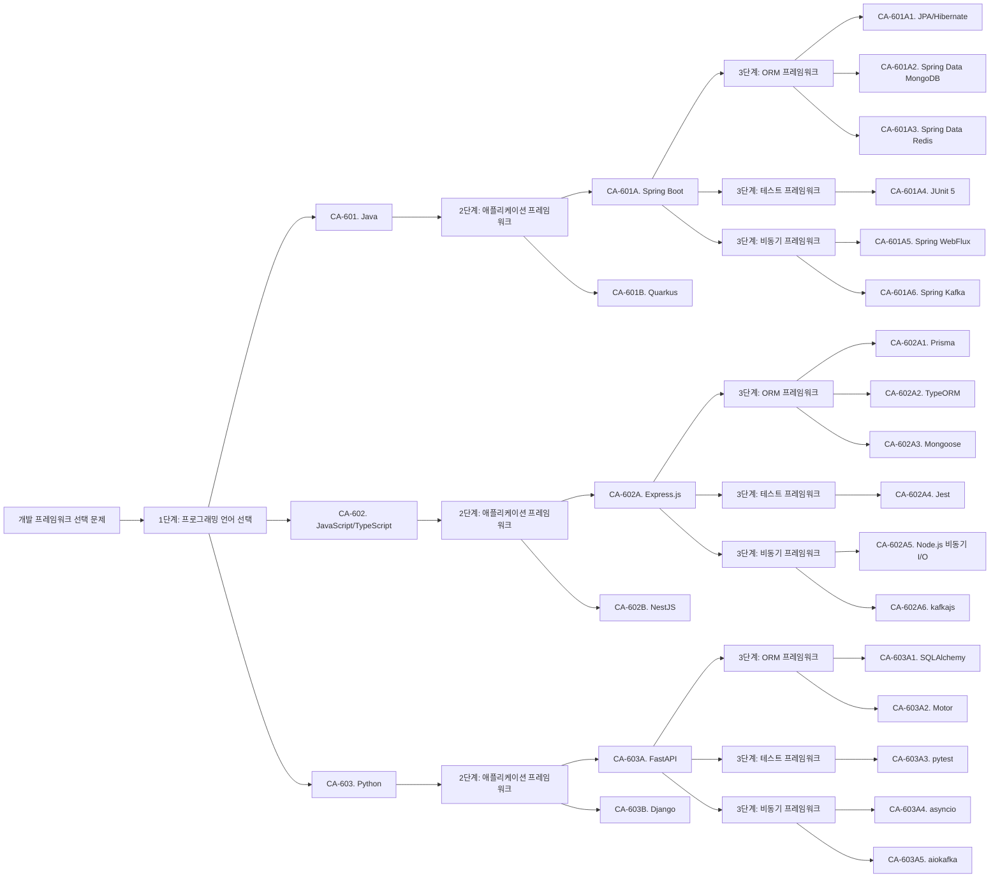

# 개발 프레임워크 선택 설계

## 개요

이 문서는 Count 통합 관리 시스템의 개발 프레임워크 선택 관점에서 후보 구조를 설계합니다. 개발 프레임워크 선택은 계층적 의존성 관계를 가지므로, 프로그래밍 언어 → 애플리케이션 프레임워크 → 나머지 프레임워크 순서로 설계합니다.

## 1. 개발 프레임워크 선택 문제 식별

### 1.1 후보 구조 분석

`candidate/candidates.md`를 분석한 결과:

- **MSA 아키텍처**: 서비스별 독립적 배포 및 운영
- **헥사고날/클린 아키텍처**: 포트 앤 어댑터 패턴, 레이어 분리
- **리포지토리 패턴**: 데이터베이스 접근 추상화
- **API 게이트웨이 패턴**: 프로토콜 변환 및 라우팅
- **다중 데이터베이스**: PostgreSQL, Redis, MongoDB 지원

**개발 프레임워크 요구사항**:
- 마이크로서비스 개발 지원
- REST API 개발 지원
- 웹 UI 개발 지원
- 다중 데이터베이스 지원 (PostgreSQL, Redis, MongoDB)
- 비동기 처리 지원 (Kafka 메시징)
- 실시간 통신 지원 (SSE)
- 테스트 프레임워크 지원

### 1.2 품질 요구사항 분석

`qualities.md`를 분석한 결과:

**성능 요구사항**:
- NFR-001: Count 저장 응답 시간 < 100ms
- NFR-002: Count 조회 응답 시간 < 100ms
- NFR-003: 동시 요청 처리량 >= 1000 RPS
- NFR-004: 대시보드 로딩 시간 < 3초

**품질 속성**:
- QA-001: Count 저장 응답 시간 최소화 (우선순위 1)
- QA-002: Count 조회 응답 시간 최소화 (우선순위 2)
- QA-003: Count 저장 서비스 독립성 최대화 (우선순위 3)
- QA-004: Count 조회 서비스 독립성 최대화 (우선순위 4)

**프레임워크 선택에 영향을 미치는 요구사항**:
- 높은 성능 요구사항: 빠른 응답 시간 및 높은 처리량
- 서비스 독립성: 서비스별 독립적 개발 및 배포
- 변경 용이성: 프레임워크 변경 용이성 (QS-007, QS-011)

### 1.3 도메인 모델 분석

`domain/model.md`를 분석한 결과:

**컴포넌트 구조**:
- Boundary: CountAPI, CountManagementUI, CountAnalysisUI, DashboardUI
- Control: CountWriter, CountReader, CountManager, CountAnalyzer, DashboardManager
- Entity: CountInfoDB, CountValueDB, DashboardConfigDB

**데이터 저장 요구사항**:
- PostgreSQL: CountInfoDB, DashboardConfigDB
- Redis: CountValueDB, 캐싱
- MongoDB: 선택적 사용 가능

**외부 시스템 연동 요구사항**:
- REST API: 외부 서비스와의 통신
- Kafka: 이벤트 기반 메시징
- SSE: 실시간 대시보드 갱신

### 1.4 개발 프레임워크 선택 문제 식별

다음 관점에서 구조적 문제를 식별:

#### 1.4.1 프로그래밍 언어 선택

**문제**: 어떤 프로그래밍 언어를 사용할 것인가?

**고려사항**:
- 성능 요구사항: 100ms 이하 응답 시간, 1000 RPS 처리량
- 마이크로서비스 지원: 서비스별 독립적 개발 및 배포
- 생태계: 풍부한 라이브러리 및 프레임워크 지원
- 개발 생산성: 빠른 개발 및 유지보수

**후보 언어**:
- Java: 엔터프라이즈급 성능, Spring Boot 생태계, MSA 지원
- JavaScript/TypeScript: Node.js 기반, 빠른 개발, 풍부한 생태계
- Python: 빠른 개발, 풍부한 라이브러리, 데이터 분석 지원

#### 1.4.2 애플리케이션 프레임워크 선택

**문제**: 어떤 애플리케이션 프레임워크를 사용할 것인가?

**고려사항**:
- REST API 개발 지원
- 웹 UI 개발 지원
- 마이크로서비스 아키텍처 지원
- 다중 데이터베이스 지원
- 비동기 처리 지원

**프로그래밍 언어별 후보**:
- Java: Spring Boot, Quarkus
- JavaScript/TypeScript: Express.js, NestJS, Fastify
- Python: Django, FastAPI, Flask

#### 1.4.3 ORM 프레임워크 선택

**문제**: 어떤 ORM 프레임워크를 사용할 것인가?

**고려사항**:
- PostgreSQL 지원
- Redis 지원
- MongoDB 지원 (선택적)
- 성능: 빠른 데이터 접근
- 변경 용이성: 스키마 변경 시 영향 범위 최소화

**애플리케이션 프레임워크별 후보**:
- Spring Boot: JPA/Hibernate, Spring Data JPA, Spring Data MongoDB, Spring Data Redis
- Express.js: Sequelize, TypeORM, Prisma, Mongoose
- FastAPI: SQLAlchemy, Tortoise ORM, Motor (MongoDB)

#### 1.4.4 테스트 프레임워크 선택

**문제**: 어떤 테스트 프레임워크를 사용할 것인가?

**고려사항**:
- 단위 테스트 지원
- 통합 테스트 지원
- 마이크로서비스 테스트 지원
- 모킹 지원

**프로그래밍 언어별 후보**:
- Java: JUnit, TestNG, Mockito
- JavaScript/TypeScript: Jest, Mocha, Vitest
- Python: pytest, unittest

#### 1.4.5 비동기 프레임워크 선택

**문제**: 비동기 처리를 위한 프레임워크가 필요한가? 어떤 프레임워크를 사용할 것인가?

**고려사항**:
- Kafka 메시징 지원
- SSE 실시간 통신 지원
- 비동기 처리 성능

**애플리케이션 프레임워크별 후보**:
- Spring Boot: Spring WebFlux (Reactive), Spring Kafka, Spring AMQP
- Express.js: Node.js 비동기 I/O, kafkajs, socket.io
- FastAPI: asyncio, aiokafka, WebSocket

### 1.5 프레임워크 간 의존성 관계

프레임워크 선택은 계층적 의존성 관계를 가집니다:

```
1단계: 프로그래밍 언어 선택 (최상위)
  └─> 2단계: 애플리케이션 프레임워크 선택 (프로그래밍 언어에 종속)
       └─> 3단계: ORM 프레임워크 선택 (애플리케이션 프레임워크에 종속)
       └─> 3단계: 테스트 프레임워크 선택 (프로그래밍 언어 및 애플리케이션 프레임워크에 종속)
       └─> 3단계: 비동기 프레임워크 선택 (애플리케이션 프레임워크에 종속, 선택적)
```

## 2. 설계 과정 마인드 맵



## 3. 후보 구조 설계

### 3.1 CA-601: Java 프로그래밍 언어 선택

#### 개요
Java를 프로그래밍 언어로 선택하여 엔터프라이즈급 성능과 풍부한 생태계를 활용합니다.

#### 설계 결정

**CA-601. Java 선택**
- Java를 주요 프로그래밍 언어로 선택합니다.
- Java 17 이상 버전 사용 (LTS 버전)
- 엔터프라이즈급 성능 및 안정성 제공

#### 장점

- **높은 성능**: JVM 최적화로 높은 성능 제공
- **풍부한 생태계**: Spring Boot 등 성숙한 프레임워크 생태계
- **MSA 지원**: Spring Cloud 등 마이크로서비스 지원 도구 풍부
- **안정성**: 엔터프라이즈 환경에서 검증된 안정성
- **다중 데이터베이스 지원**: JPA, Spring Data 등 다양한 데이터베이스 지원

#### 단점 및 트레이드오프

- **메모리 사용량**: JVM으로 인한 상대적으로 높은 메모리 사용
- **시작 시간**: JVM 시작 시간으로 인한 상대적으로 느린 시작 시간
- **복잡도**: 엔터프라이즈 프레임워크로 인한 학습 곡선

### 3.2 CA-601A: Spring Boot 애플리케이션 프레임워크 선택

#### 개요
Java 기반으로 Spring Boot를 애플리케이션 프레임워크로 선택합니다.

#### 설계 결정

**CA-601A. Spring Boot 선택**
- Spring Boot를 애플리케이션 프레임워크로 선택합니다.
- Spring Boot 3.x 버전 사용 (Java 17+ 필요)
- REST API, 웹 UI, 마이크로서비스 개발 지원

#### 부모 후보 구조
- **CA-601**: Java 프로그래밍 언어 선택

#### 프레임워크 조합 가이드

**권장 Starter 패키지**:
- `spring-boot-starter-web`: REST API 개발
- `spring-boot-starter-webflux`: 비동기 처리 (선택적)
- `spring-boot-starter-data-jpa`: PostgreSQL 접근
- `spring-boot-starter-data-redis`: Redis 접근
- `spring-boot-starter-data-mongodb`: MongoDB 접근 (선택적)
- `spring-boot-starter-kafka`: Kafka 메시징
- `spring-boot-starter-test`: 테스트 프레임워크

#### 의존성 그래프

```
Spring Boot 3.x
  ├─> Java 17+ (필수)
  ├─> spring-boot-starter-web
  │    └─> spring-web, spring-webmvc
  ├─> spring-boot-starter-data-jpa
  │    ├─> Hibernate (간접 의존성)
  │    └─> PostgreSQL JDBC Driver (직접 의존성 필요)
  ├─> spring-boot-starter-data-redis
  │    └─> Lettuce (Redis 클라이언트)
  ├─> spring-boot-starter-data-mongodb
  │    └─> MongoDB Java Driver
  ├─> spring-boot-starter-kafka
  │    └─> Spring Kafka
  └─> spring-boot-starter-test
       └─> JUnit 5 (간접 의존성)
```

#### 장점

- **MSA 지원**: Spring Cloud를 통한 마이크로서비스 개발 지원
- **다중 데이터베이스 지원**: JPA, Spring Data Redis, Spring Data MongoDB 동시 사용 가능
- **자동 설정**: Auto Configuration으로 빠른 개발
- **생태계**: 풍부한 Spring 생태계 및 커뮤니티
- **테스트 지원**: Spring Boot Test로 통합 테스트 용이

#### 단점 및 트레이드오프

- **복잡도**: 많은 기능으로 인한 학습 곡선
- **메모리 사용량**: Spring 프레임워크로 인한 메모리 사용량 증가

### 3.3 CA-601A1: JPA/Hibernate ORM 프레임워크 선택

#### 개요
Spring Boot 기반으로 JPA/Hibernate를 PostgreSQL 접근을 위한 ORM 프레임워크로 선택합니다.

#### 설계 결정

**CA-601A1. JPA/Hibernate 선택**
- JPA/Hibernate를 PostgreSQL 접근을 위한 ORM 프레임워크로 선택합니다.
- Spring Data JPA를 통해 사용
- 리포지토리 패턴 지원

#### 부모 후보 구조
- **CA-601A**: Spring Boot 애플리케이션 프레임워크 선택

#### 프레임워크 조합
- Spring Boot + Spring Data JPA + Hibernate + PostgreSQL

#### 장점

- **표준 ORM**: JPA 표준으로 이식성 높음
- **리포지토리 패턴**: Spring Data JPA로 리포지토리 패턴 쉽게 구현
- **스키마 변경 용이**: JPA를 통한 스키마 변경 영향 범위 제한
- **성능 최적화**: Hibernate의 쿼리 최적화 및 캐싱 지원

#### 단점 및 트레이드오프

- **학습 곡선**: JPA/Hibernate 학습 필요
- **성능 오버헤드**: ORM 계층으로 인한 성능 오버헤드 가능

### 3.4 CA-601A2: Spring Data MongoDB ORM 프레임워크 선택

#### 개요
Spring Boot 기반으로 Spring Data MongoDB를 MongoDB 접근을 위한 ORM 프레임워크로 선택합니다.

#### 설계 결정

**CA-601A2. Spring Data MongoDB 선택**
- Spring Data MongoDB를 MongoDB 접근을 위한 ORM 프레임워크로 선택합니다.
- JPA/Hibernate와 동시 사용 가능
- MongoDB 특화 기능 지원

#### 부모 후보 구조
- **CA-601A**: Spring Boot 애플리케이션 프레임워크 선택

#### 프레임워크 조합
- Spring Boot + Spring Data MongoDB + MongoDB

#### 장점

- **MongoDB 특화**: MongoDB 특화 기능 지원
- **동시 사용 가능**: JPA/Hibernate와 동시 사용 가능
- **일관된 인터페이스**: Spring Data 인터페이스로 일관된 접근

#### 단점 및 트레이드오프

- **MongoDB 의존성**: MongoDB에 특화되어 다른 NoSQL로 전환 어려움

### 3.5 CA-601A3: Spring Data Redis ORM 프레임워크 선택

#### 개요
Spring Boot 기반으로 Spring Data Redis를 Redis 접근을 위한 프레임워크로 선택합니다.

#### 설계 결정

**CA-601A3. Spring Data Redis 선택**
- Spring Data Redis를 Redis 접근을 위한 프레임워크로 선택합니다.
- Redis 캐싱 및 데이터 저장 지원
- Lettuce 또는 Jedis 클라이언트 사용

#### 부모 후보 구조
- **CA-601A**: Spring Boot 애플리케이션 프레임워크 선택

#### 프레임워크 조합
- Spring Boot + Spring Data Redis + Lettuce + Redis

#### 장점

- **Redis 통합**: Spring Cache와 통합하여 캐싱 용이
- **비동기 지원**: Lettuce를 통한 비동기 Redis 접근
- **일관된 인터페이스**: Spring Data 인터페이스로 일관된 접근

#### 단점 및 트레이드오프

- **Redis 의존성**: Redis에 특화되어 다른 캐시로 전환 어려움

### 3.6 CA-601A4: JUnit 5 테스트 프레임워크 선택

#### 개요
Java 기반으로 JUnit 5를 테스트 프레임워크로 선택합니다.

#### 설계 결정

**CA-601A4. JUnit 5 선택**
- JUnit 5를 테스트 프레임워크로 선택합니다.
- Spring Boot Test와 통합
- 단위 테스트 및 통합 테스트 지원

#### 부모 후보 구조
- **CA-601A**: Spring Boot 애플리케이션 프레임워크 선택

#### 프레임워크 조합
- Spring Boot + JUnit 5 + Mockito + Spring Boot Test

#### 장점

- **표준 테스트 프레임워크**: Java 표준 테스트 프레임워크
- **Spring 통합**: Spring Boot Test로 통합 테스트 용이
- **모킹 지원**: Mockito와 통합하여 모킹 용이

#### 단점 및 트레이드오프

- **Java 의존성**: Java 환경에서만 사용 가능

### 3.7 CA-601A5: Spring WebFlux 비동기 프레임워크 선택

#### 개요
Spring Boot 기반으로 Spring WebFlux를 비동기 처리를 위한 프레임워크로 선택합니다.

#### 설계 결정

**CA-601A5. Spring WebFlux 선택**
- Spring WebFlux를 비동기 처리를 위한 프레임워크로 선택합니다.
- Reactive Streams 기반 비동기 처리
- SSE 실시간 통신 지원

#### 부모 후보 구조
- **CA-601A**: Spring Boot 애플리케이션 프레임워크 선택

#### 프레임워크 조합
- Spring Boot + Spring WebFlux + Project Reactor

#### 장점

- **비동기 처리**: 높은 동시성 처리 능력
- **SSE 지원**: Server-Sent Events를 통한 실시간 통신
- **성능 향상**: 비동기 처리로 높은 처리량

#### 단점 및 트레이드오프

- **복잡도 증가**: Reactive 프로그래밍으로 인한 복잡도 증가
- **학습 곡선**: Reactive Streams 학습 필요

### 3.8 CA-601A6: Spring Kafka 비동기 프레임워크 선택

#### 개요
Spring Boot 기반으로 Spring Kafka를 Kafka 메시징을 위한 프레임워크로 선택합니다.

#### 설계 결정

**CA-601A6. Spring Kafka 선택**
- Spring Kafka를 Kafka 메시징을 위한 프레임워크로 선택합니다.
- Kafka Producer 및 Consumer 지원
- 이벤트 기반 아키텍처 지원

#### 부모 후보 구조
- **CA-601A**: Spring Boot 애플리케이션 프레임워크 선택

#### 프레임워크 조합
- Spring Boot + Spring Kafka + Apache Kafka Client

#### 장점

- **Kafka 통합**: Spring과 Kafka의 원활한 통합
- **이벤트 기반**: 이벤트 기반 아키텍처 구현 용이
- **자동 설정**: Spring Boot Auto Configuration으로 빠른 설정

#### 단점 및 트레이드오프

- **Kafka 의존성**: Kafka에 특화되어 다른 메시징 시스템으로 전환 어려움

### 3.9 CA-601B: Quarkus 애플리케이션 프레임워크 선택

#### 개요
Java 기반으로 Quarkus를 애플리케이션 프레임워크로 선택합니다.

#### 설계 결정

**CA-601B. Quarkus 선택**
- Quarkus를 애플리케이션 프레임워크로 선택합니다.
- 네이티브 컴파일 지원
- 빠른 시작 시간 및 낮은 메모리 사용

#### 부모 후보 구조
- **CA-601**: Java 프로그래밍 언어 선택

#### 장점

- **빠른 시작 시간**: 네이티브 컴파일로 빠른 시작 시간
- **낮은 메모리 사용**: 최적화된 메모리 사용
- **클라우드 네이티브**: Kubernetes 환경에 최적화

#### 단점 및 트레이드오프

- **생태계**: Spring Boot에 비해 상대적으로 작은 생태계
- **학습 곡선**: Quarkus 특화 기능 학습 필요

### 3.10 CA-602: JavaScript/TypeScript 프로그래밍 언어 선택

#### 개요
JavaScript/TypeScript를 프로그래밍 언어로 선택하여 빠른 개발과 풍부한 생태계를 활용합니다.

#### 설계 결정

**CA-602. JavaScript/TypeScript 선택**
- TypeScript를 주요 프로그래밍 언어로 선택합니다.
- 타입 안정성 제공
- Node.js 런타임 사용

#### 장점

- **빠른 개발**: 빠른 개발 속도
- **풍부한 생태계**: npm 생태계의 풍부한 라이브러리
- **비동기 I/O**: Node.js의 비동기 I/O로 높은 동시성
- **타입 안정성**: TypeScript로 타입 안정성 제공

#### 단점 및 트레이드오프

- **성능**: Java에 비해 상대적으로 낮은 성능
- **엔터프라이즈 지원**: Spring Boot에 비해 상대적으로 적은 엔터프라이즈 지원

### 3.11 CA-602A: Express.js 애플리케이션 프레임워크 선택

#### 개요
JavaScript/TypeScript 기반으로 Express.js를 애플리케이션 프레임워크로 선택합니다.

#### 설계 결정

**CA-602A. Express.js 선택**
- Express.js를 애플리케이션 프레임워크로 선택합니다.
- REST API 및 웹 서버 개발
- 미들웨어 기반 아키텍처

#### 부모 후보 구조
- **CA-602**: JavaScript/TypeScript 프로그래밍 언어 선택

#### 프레임워크 조합 가이드

**권장 패키지**:
- `express`: 웹 프레임워크
- `@prisma/client`: ORM (PostgreSQL)
- `mongoose`: MongoDB ODM
- `ioredis`: Redis 클라이언트
- `kafkajs`: Kafka 클라이언트
- `jest`: 테스트 프레임워크

#### 장점

- **가벼움**: 경량 프레임워크로 빠른 시작
- **유연성**: 미들웨어 기반으로 유연한 확장
- **비동기 I/O**: Node.js 비동기 I/O 활용

#### 단점 및 트레이드오프

- **구조화**: 프레임워크가 가볍아 구조화 필요
- **엔터프라이즈 기능**: Spring Boot에 비해 적은 엔터프라이즈 기능

### 3.12 CA-602B: NestJS 애플리케이션 프레임워크 선택

#### 개요
JavaScript/TypeScript 기반으로 NestJS를 애플리케이션 프레임워크로 선택합니다.

#### 설계 결정

**CA-602B. NestJS 선택**
- NestJS를 애플리케이션 프레임워크로 선택합니다.
- Spring Boot와 유사한 구조
- TypeScript 기반

#### 부모 후보 구조
- **CA-602**: JavaScript/TypeScript 프로그래밍 언어 선택

#### 프레임워크 조합 가이드

**권장 패키지**:
- `@nestjs/core`: NestJS 핵심 프레임워크
- `@nestjs/common`: 공통 유틸리티
- `@nestjs/platform-express`: Express.js 플랫폼 어댑터
- `@nestjs/typeorm`: TypeORM 통합 (PostgreSQL)
- `@nestjs/mongoose`: Mongoose 통합 (MongoDB)
- `@nestjs/microservices`: 마이크로서비스 지원 (Kafka)
- `@nestjs/config`: 설정 관리
- `@nestjs/cache-manager`: 캐싱 지원
- `ioredis`: Redis 클라이언트
- `@nestjs/testing`: 테스트 유틸리티
- `jest`: 테스트 프레임워크

#### 의존성 그래프

```
NestJS 10.x
  ├─> Node.js 18+ (필수)
  ├─> TypeScript 5.x (권장)
  ├─> @nestjs/platform-express
  │    └─> express
  ├─> @nestjs/typeorm
  │    ├─> typeorm
  │    └─> pg (PostgreSQL 드라이버)
  ├─> @nestjs/mongoose
  │    └─> mongoose
  ├─> @nestjs/microservices
  │    └─> kafkajs
  ├─> @nestjs/cache-manager
  │    └─> cache-manager
  │    └─> ioredis
  └─> @nestjs/testing
       └─> jest
```

#### 장점

- **구조화된 개발**: Spring Boot와 유사한 구조로 구조화된 개발
- **의존성 주입**: 의존성 주입 패턴으로 느슨한 결합
- **모듈 시스템**: 모듈 기반 아키텍처로 마이크로서비스 지원
- **TypeScript**: 타입 안정성 제공
- **비동기 처리**: Node.js 비동기 I/O로 높은 동시성
- **테스트 지원**: Jest 통합으로 테스트 용이
- **변경 용이성**: 모듈 및 Provider 패턴으로 변경 용이성 향상

#### 단점 및 트레이드오프

- **복잡도**: Express.js에 비해 복잡도 증가
- **학습 곡선**: NestJS 특화 기능 학습 필요
- **생태계**: Spring Boot에 비해 상대적으로 작은 생태계
- **성능**: Java/Spring Boot에 비해 상대적으로 낮은 성능

### 3.12.1 CA-602B1: TypeORM ORM 프레임워크 선택

#### 개요
NestJS 기반으로 TypeORM을 PostgreSQL 접근을 위한 ORM 프레임워크로 선택합니다.

#### 설계 결정

**CA-602B1. TypeORM 선택**
- TypeORM을 PostgreSQL 접근을 위한 ORM 프레임워크로 선택합니다.
- @nestjs/typeorm을 통해 사용
- 리포지토리 패턴 지원

#### 부모 후보 구조
- **CA-602B**: NestJS 애플리케이션 프레임워크 선택

#### 프레임워크 조합
- NestJS + @nestjs/typeorm + TypeORM + PostgreSQL

#### 장점

- **NestJS 통합**: @nestjs/typeorm으로 NestJS와 원활한 통합
- **TypeScript 지원**: TypeScript 타입 안정성 제공
- **리포지토리 패턴**: TypeORM Repository로 리포지토리 패턴 쉽게 구현
- **스키마 변경 용이**: TypeORM 마이그레이션으로 스키마 변경 용이
- **성능 최적화**: TypeORM의 쿼리 최적화 및 캐싱 지원

#### 단점 및 트레이드오프

- **학습 곡선**: TypeORM 학습 필요
- **성능 오버헤드**: ORM 계층으로 인한 성능 오버헤드 가능
- **PostgreSQL 의존성**: PostgreSQL에 특화되어 다른 데이터베이스로 전환 어려움

### 3.12.2 CA-602B2: Mongoose ORM 프레임워크 선택

#### 개요
NestJS 기반으로 Mongoose를 MongoDB 접근을 위한 ORM 프레임워크로 선택합니다.

#### 설계 결정

**CA-602B2. Mongoose 선택**
- Mongoose를 MongoDB 접근을 위한 ORM 프레임워크로 선택합니다.
- @nestjs/mongoose를 통해 사용
- TypeORM과 동시 사용 가능

#### 부모 후보 구조
- **CA-602B**: NestJS 애플리케이션 프레임워크 선택

#### 프레임워크 조합
- NestJS + @nestjs/mongoose + Mongoose + MongoDB

#### 장점

- **MongoDB 특화**: MongoDB 특화 기능 지원
- **NestJS 통합**: @nestjs/mongoose로 NestJS와 원활한 통합
- **동시 사용 가능**: TypeORM과 동시 사용 가능
- **스키마 정의**: Mongoose Schema로 스키마 정의 용이

#### 단점 및 트레이드오프

- **MongoDB 의존성**: MongoDB에 특화되어 다른 NoSQL로 전환 어려움
- **TypeScript 지원 제한**: Mongoose의 TypeScript 지원이 TypeORM에 비해 제한적

### 3.12.3 CA-602B3: ioredis Redis 클라이언트 선택

#### 개요
NestJS 기반으로 ioredis를 Redis 접근을 위한 클라이언트로 선택합니다.

#### 설계 결정

**CA-602B3. ioredis 선택**
- ioredis를 Redis 접근을 위한 클라이언트로 선택합니다.
- @nestjs/cache-manager와 통합
- Redis 캐싱 및 데이터 저장 지원

#### 부모 후보 구조
- **CA-602B**: NestJS 애플리케이션 프레임워크 선택

#### 프레임워크 조합
- NestJS + @nestjs/cache-manager + ioredis + Redis

#### 장점

- **높은 성능**: 비동기 처리 및 파이프라인 지원으로 높은 성능
- **NestJS 통합**: @nestjs/cache-manager와 통합하여 캐싱 용이
- **비동기 지원**: Promise 기반 비동기 처리
- **클러스터 지원**: Redis Cluster 지원

#### 단점 및 트레이드오프

- **Redis 의존성**: Redis에 특화되어 다른 캐시로 전환 어려움
- **ORM 부재**: ORM이 아닌 클라이언트 라이브러리로 직접 쿼리 작성 필요

### 3.12.4 CA-602B4: Jest 테스트 프레임워크 선택

#### 개요
NestJS 기반으로 Jest를 테스트 프레임워크로 선택합니다.

#### 설계 결정

**CA-602B4. Jest 선택**
- Jest를 테스트 프레임워크로 선택합니다.
- @nestjs/testing과 통합
- 단위 테스트 및 통합 테스트 지원

#### 부모 후보 구조
- **CA-602B**: NestJS 애플리케이션 프레임워크 선택

#### 프레임워크 조합
- NestJS + @nestjs/testing + Jest

#### 장점

- **NestJS 통합**: NestJS 기본 테스트 프레임워크로 완벽한 통합
- **모킹 지원**: Jest의 모킹 및 스파이 기능 제공
- **커버리지**: 코드 커버리지 자동 측정
- **스냅샷 테스트**: 스냅샷 테스트 지원

#### 단점 및 트레이드오프

- **Node.js 의존성**: Node.js 환경에서만 사용 가능
- **TypeScript 설정**: TypeScript 설정 필요

### 3.12.5 CA-602B5: NestJS Microservice Transport 비동기 프레임워크 선택

#### 개요
NestJS 기반으로 NestJS Microservice Transport를 Kafka 메시징을 위한 비동기 프레임워크로 선택합니다.

#### 설계 결정

**CA-602B5. NestJS Microservice Transport 선택**
- NestJS Microservice Transport를 Kafka 메시징을 위한 비동기 프레임워크로 선택합니다.
- @nestjs/microservices를 통해 사용
- Kafka Producer 및 Consumer 지원

#### 부모 후보 구조
- **CA-602B**: NestJS 애플리케이션 프레임워크 선택

#### 프레임워크 조합
- NestJS + @nestjs/microservices + kafkajs + Kafka

#### 장점

- **NestJS 통합**: NestJS와 완벽한 통합
- **Kafka 지원**: Kafka Transport 지원
- **이벤트 기반**: 이벤트 기반 아키텍처 구현 용이
- **마이크로서비스**: 마이크로서비스 간 통신 지원

#### 단점 및 트레이드오프

- **Kafka 의존성**: Kafka에 특화되어 다른 메시징 시스템으로 전환 어려움
- **복잡도**: 마이크로서비스 아키텍처로 인한 복잡도 증가

### 3.12.6 CA-602B6: Node.js 비동기 I/O 선택

#### 개요
NestJS 기반으로 Node.js 비동기 I/O를 SSE 실시간 통신 및 비동기 처리를 위한 프레임워크로 선택합니다.

#### 설계 결정

**CA-602B6. Node.js 비동기 I/O 선택**
- Node.js 비동기 I/O를 SSE 실시간 통신 및 비동기 처리를 위한 프레임워크로 선택합니다.
- Node.js의 이벤트 루프 기반 비동기 I/O
- SSE 실시간 통신 지원

#### 부모 후보 구조
- **CA-602B**: NestJS 애플리케이션 프레임워크 선택

#### 프레임워크 조합
- NestJS + Node.js 비동기 I/O + SSE

#### 장점

- **높은 동시성**: Node.js의 이벤트 루프 기반 비동기 I/O로 높은 동시성
- **SSE 지원**: Server-Sent Events를 통한 실시간 통신
- **성능 향상**: 비동기 처리로 높은 처리량
- **내장 지원**: Node.js에 내장되어 추가 라이브러리 불필요

#### 단점 및 트레이드오프

- **복잡도**: 비동기 프로그래밍으로 인한 복잡도 증가
- **에러 처리**: 비동기 에러 처리 복잡도

### 3.13 CA-603: Python 프로그래밍 언어 선택

#### 개요
Python을 프로그래밍 언어로 선택하여 빠른 개발과 풍부한 데이터 분석 라이브러리를 활용합니다.

#### 설계 결정

**CA-603. Python 선택**
- Python을 주요 프로그래밍 언어로 선택합니다.
- Python 3.11 이상 버전 사용
- 빠른 개발 및 데이터 분석 지원

#### 장점

- **빠른 개발**: 빠른 개발 속도
- **데이터 분석**: 풍부한 데이터 분석 라이브러리
- **생태계**: 풍부한 Python 생태계

#### 단점 및 트레이드오프

- **성능**: Java/Node.js에 비해 상대적으로 낮은 성능
- **동시성**: GIL로 인한 동시성 처리 제한

### 3.14 CA-603A: FastAPI 애플리케이션 프레임워크 선택

#### 개요
Python 기반으로 FastAPI를 애플리케이션 프레임워크로 선택합니다.

#### 설계 결정

**CA-603A. FastAPI 선택**
- FastAPI를 애플리케이션 프레임워크로 선택합니다.
- 높은 성능 (비동기 지원)
- 자동 API 문서 생성

#### 부모 후보 구조
- **CA-603**: Python 프로그래밍 언어 선택

#### 장점

- **높은 성능**: 비동기 지원으로 높은 성능
- **자동 문서화**: OpenAPI 자동 생성
- **타입 힌팅**: Python 타입 힌팅 지원

#### 단점 및 트레이드오프

- **생태계**: Spring Boot에 비해 상대적으로 작은 생태계
- **MSA 지원**: Spring Cloud에 비해 적은 MSA 지원 도구

## 4. 후보 구조 비교

### 4.1 프로그래밍 언어 비교

| 언어 | 성능 | 생태계 | MSA 지원 | 개발 속도 |
|------|------|--------|----------|----------|
| Java | 매우 높음 | 매우 풍부 | 매우 높음 | 중 |
| JavaScript/TypeScript | 높음 | 매우 풍부 | 높음 | 높음 |
| Python | 중 | 풍부 | 중 | 매우 높음 |

### 4.2 애플리케이션 프레임워크 비교 (Java)

| 프레임워크 | 성능 | 생태계 | MSA 지원 | 학습 곡선 |
|-----------|------|--------|----------|----------|
| Spring Boot | 높음 | 매우 풍부 | 매우 높음 | 중 |
| Quarkus | 매우 높음 | 중 | 높음 | 중 |

### 4.3 애플리케이션 프레임워크 비교 (JavaScript/TypeScript)

| 프레임워크 | 성능 | 생태계 | 구조화 | 학습 곡선 |
|-----------|------|--------|--------|----------|
| Express.js | 높음 | 매우 풍부 | 낮음 | 낮음 |
| NestJS | 높음 | 풍부 | 높음 | 중 |

### 4.4 ORM 프레임워크 비교 (Spring Boot)

| ORM | 데이터베이스 | 성능 | 변경 용이성 |
|-----|------------|------|------------|
| JPA/Hibernate | PostgreSQL | 높음 | 높음 |
| Spring Data MongoDB | MongoDB | 높음 | 중 |
| Spring Data Redis | Redis | 매우 높음 | 중 |

## 5. 권장 프레임워크 조합

### 5.1 권장 조합: Java + Spring Boot

**프레임워크 조합**:
- **프로그래밍 언어**: Java 17+
- **애플리케이션 프레임워크**: Spring Boot 3.x
- **ORM 프레임워크**: 
  - JPA/Hibernate (PostgreSQL)
  - Spring Data Redis (Redis)
  - Spring Data MongoDB (MongoDB, 선택적)
- **테스트 프레임워크**: JUnit 5 + Spring Boot Test
- **비동기 프레임워크**: 
  - Spring WebFlux (SSE, 비동기 처리)
  - Spring Kafka (Kafka 메시징)

**선택 근거**:
- 높은 성능 요구사항 만족 (100ms 이하 응답 시간, 1000 RPS)
- 풍부한 MSA 지원 도구 (Spring Cloud)
- 다중 데이터베이스 지원 (PostgreSQL, Redis, MongoDB)
- 리포지토리 패턴 및 헥사고날/클린 아키텍처 지원
- 풍부한 생태계 및 커뮤니티 지원

**의존성 그래프**:
```
Java 17+
  └─> Spring Boot 3.x
       ├─> Spring Data JPA + Hibernate (PostgreSQL)
       ├─> Spring Data Redis (Redis)
       ├─> Spring Data MongoDB (MongoDB, 선택적)
       ├─> Spring WebFlux (비동기 처리, SSE)
       ├─> Spring Kafka (Kafka 메시징)
       └─> JUnit 5 + Spring Boot Test (테스트)
```

### 5.2 대안 조합: JavaScript/TypeScript + NestJS

**프레임워크 조합**:
- **프로그래밍 언어**: TypeScript
- **애플리케이션 프레임워크**: NestJS 10.x
- **ORM 프레임워크**: 
  - TypeORM (PostgreSQL) - CA-602B1
  - Mongoose (MongoDB, 선택적) - CA-602B2
  - ioredis (Redis) - CA-602B3
- **테스트 프레임워크**: Jest - CA-602B4
- **비동기 프레임워크**: 
  - NestJS Microservice Transport (Kafka) - CA-602B5
  - Node.js 비동기 I/O (SSE, 비동기 처리) - CA-602B6

**선택 근거**:
- Spring Boot와 유사한 구조로 구조화된 개발
- TypeScript 타입 안정성 제공
- Node.js 비동기 I/O로 높은 동시성
- 모듈 기반 아키텍처로 마이크로서비스 지원

**의존성 그래프**:
```
TypeScript
  └─> NestJS 10.x
       ├─> TypeORM (PostgreSQL)
       ├─> Mongoose (MongoDB, 선택적)
       ├─> ioredis (Redis)
       ├─> NestJS Microservice Transport (Kafka)
       ├─> Node.js 비동기 I/O (SSE)
       └─> Jest (테스트)
```

**적용 시나리오**:
- 빠른 개발이 중요한 경우
- Node.js 생태계를 선호하는 경우
- TypeScript 타입 안정성을 원하는 경우
- Spring Boot와 유사한 구조를 원하는 경우

## 6. 결론

개발 프레임워크 선택 문제를 분석한 결과, 다음과 같은 후보 구조를 설계했습니다:

### 프로그래밍 언어 선택
- **CA-601**: Java (권장)
- **CA-602**: JavaScript/TypeScript (대안)
- **CA-603**: Python (대안)

### 애플리케이션 프레임워크 선택 (Java)
- **CA-601A**: Spring Boot (권장)
- **CA-601B**: Quarkus (대안)

### ORM 프레임워크 선택 (Spring Boot)
- **CA-601A1**: JPA/Hibernate (PostgreSQL)
- **CA-601A2**: Spring Data MongoDB (MongoDB)
- **CA-601A3**: Spring Data Redis (Redis)

### 테스트 프레임워크 선택 (Spring Boot)
- **CA-601A4**: JUnit 5

### 비동기 프레임워크 선택 (Spring Boot)
- **CA-601A5**: Spring WebFlux (비동기 처리, SSE)
- **CA-601A6**: Spring Kafka (Kafka 메시징)

**권장 프레임워크 조합**: Java + Spring Boot + JPA/Hibernate + Spring Data Redis + Spring WebFlux + Spring Kafka + JUnit 5

이 조합은 높은 성능 요구사항, MSA 지원, 다중 데이터베이스 지원, 변경 용이성 등 모든 요구사항을 만족하면서도 풍부한 생태계와 커뮤니티 지원을 제공합니다.
