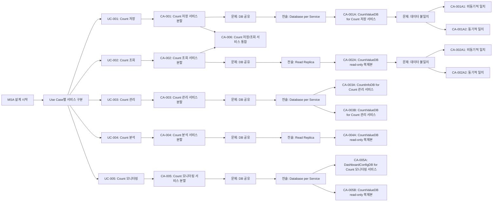

# MSA 후보 구조 설계

## 개요

### 목적
이 문서는 Count 통합 관리 시스템의 MSA(Microservice Architecture) 관점에서 서비스의 분할과 통합을 위한 후보 구조 설계 과정을 문서화합니다.

### 설계 범위
- 서비스 분할/통합 결정
- 서비스 경계 설계
- 데이터 소유권 설계
- 서비스 통합 방식 설계

## 서비스 분할/통합 문제 식별

### 도메인 모델 분석

도메인 모델(`domain/model.md`)을 분석한 결과, 다음과 같은 컴포넌트 구조를 확인했습니다:

#### Boundary 컴포넌트
- **CountAPI**: 외부 서비스와의 REST API 인터페이스 (UC-001, UC-002)
- **CountManagementUI**: 관리자와의 Count 관리 웹 UI 인터페이스 (UC-003)
- **CountAnalysisUI**: 관리자와의 Count 분석 웹 UI 인터페이스 (UC-004)
- **DashboardUI**: 관리자와의 Count 모니터링 대시보드 웹 UI 인터페이스 (UC-005)

#### Control 컴포넌트
- **CountWriter**: Count 값 저장 및 업데이트 비즈니스 로직 (UC-001)
- **CountReader**: Count 값 조회 비즈니스 로직 (UC-002, UC-004, UC-005)
- **CountManager**: Count 데이터 생성, 수정, 삭제 비즈니스 로직 (UC-003)
- **CountAnalyzer**: Count 분석 요청 처리 및 분석 유형별 컴포넌트로 위임 (UC-004, UC-005)
- **TrendAnalyzer**: 트렌드 분석 비즈니스 로직 (UC-004)
- **ComparisonAnalyzer**: 비교 분석 비즈니스 로직 (UC-004)
- **PredictionAnalyzer**: 예측 분석 비즈니스 로직 (UC-004)
- **DashboardManager**: Count 데이터 모니터링 비즈니스 로직 (UC-005)

#### Entity 컴포넌트
- **CountInfoDB**: Count 정보(메타데이터) 영속적 저장 (UC-001, UC-002, UC-003, UC-004, UC-005)
- **CountValueDB**: Count 값 영속적 저장 (UC-001, UC-002, UC-003, UC-004, UC-005)
- **DashboardConfigDB**: 대시보드 구성 정보 영속적 저장 (UC-005)

### 품질 요구사항 분석

품질 요구사항(`qualities.md`)을 분석한 결과, 다음과 같은 MSA 관련 요구사항을 확인했습니다:

#### 서비스 독립성 관련 품질 속성
- **QA-003**: Count 저장 서비스 독립성 최대화 (우선순위 3)
- **QA-004**: Count 조회 서비스 독립성 최대화 (우선순위 4)
- **QA-008**: Count 관리 서비스 독립성 최대화 (우선순위 8)
- **QA-009**: Count 분석 서비스 독립성 최대화 (우선순위 9)
- **QA-010**: Count 모니터링 서비스 독립성 최대화 (우선순위 10)

#### 성능 관련 품질 속성
- **QA-001**: Count 저장 응답 시간 최소화 (우선순위 1)
- **QA-002**: Count 조회 응답 시간 최소화 (우선순위 2)

#### 변경 용이성 관련 품질 속성
- **QA-005**: 분석 기능 추가 용이성 최대화 (우선순위 5)
- **QA-006**: 대시보드 기능 추가 용이성 최대화 (우선순위 6)
- **QA-007**: UI 변경 용이성 최대화 (우선순위 7)

### Use Case 분석

Use Case를 분석한 결과, 다음과 같은 기능적 요구사항을 확인했습니다:

#### 외부 서비스 대상 Use Case
- **UC-001**: Count 저장 - 외부 서비스가 Count 값을 저장하거나 증가/감소시킴
- **UC-002**: Count 조회 - 외부 서비스가 Count 값을 조회함

#### 관리자 대상 Use Case
- **UC-003**: Count 관리 - 관리자가 웹 UI를 통해 Count 데이터를 생성, 수정, 삭제함
- **UC-004**: Count 분석 - 관리자가 Count 데이터에 대한 다양한 분석 기능을 수행함
- **UC-005**: Count 모니터링 - 관리자가 대시보드를 통해 Count 데이터를 모니터링함

### 서비스 분할/통합 문제 식별

다음 관점에서 구조적 문제를 식별했습니다:

#### 확장성 독립성
- **문제**: Count 저장(UC-001)과 Count 조회(UC-002)는 서로 다른 확장 패턴을 가짐
  - 저장: 쓰기 작업 중심, 트랜잭션 처리 중요
  - 조회: 읽기 작업 중심, 높은 동시성 처리 필요
- **근거**: QA-003, QA-004 (서비스 독립성 최대화)

#### 성능 격리
- **문제**: Count 저장 작업의 성능 저하가 Count 조회 작업에 영향을 미칠 수 있음
- **근거**: QA-001, QA-002 (응답 시간 최소화), QA-003, QA-004 (서비스 독립성)

#### 배포 독립성
- **문제**: 관리자 대상 기능(UC-003, UC-004, UC-005)과 외부 서비스 대상 기능(UC-001, UC-002)의 배포 주기가 다를 수 있음
- **근거**: QA-005, QA-006, QA-007 (변경 용이성), QA-008, QA-009, QA-010 (서비스 독립성)

#### 장애 격리
- **문제**: 한 기능의 장애가 다른 기능에 영향을 미칠 수 있음
- **근거**: QA-003, QA-004, QA-008, QA-009, QA-010 (서비스 독립성)

## 설계 과정 마인드 맵

## 후보 구조 설계 과정

### 1단계: Use Case별 서비스 분할

각 Use Case를 독립적인 마이크로서비스로 분할하는 후보 구조를 설계했습니다:

1. **CA-001**: Count 저장 서비스 분할 (UC-001)
2. **CA-002**: Count 조회 서비스 분할 (UC-002)
3. **CA-003**: Count 관리 서비스 분할 (UC-003)
4. **CA-004**: Count 분석 서비스 분할 (UC-004)
5. **CA-005**: Count 모니터링 서비스 분할 (UC-005)

### 2단계: 서비스 통합 대안 검토

서비스 분할의 대안으로 서비스 통합 후보 구조를 설계했습니다:

6. **CA-006**: Count 저장/조회 서비스 통합 (CA-001, CA-002의 대안)

### 3단계: DB 공유 문제 해결

각 서비스 분할 후보 구조에서 발생하는 DB 공유 문제를 해결하기 위한 종속 후보 구조를 식별했습니다:

- **CA-001A**: CountValueDB for Count 저장 서비스
- **CA-002A**: CountValueDB read-only 복제본 for Count 조회 서비스
- **CA-003A**: CountInfoDB for Count 관리 서비스
- **CA-003B**: CountValueDB for Count 관리 서비스
- **CA-004A**: CountValueDB read-only 복제본 for Count 분석 서비스
- **CA-005A**: DashboardConfigDB for Count 모니터링 서비스
- **CA-005B**: CountValueDB read-only 복제본 for Count 모니터링 서비스

### 4단계: 데이터 불일치 문제 해결

DB 분리로 인한 데이터 불일치 문제를 해결하기 위한 종속 후보 구조를 식별했습니다:

- **CA-001A1**: 비동기적 일치 (Eventual Consistency)
- **CA-001A2**: 동기적 일치 (즉시 일관성)
- **CA-002A1**: 비동기적 일치 (Eventual Consistency)
- **CA-002A2**: 동기적 일치 (즉시 일관성)

## 후보 구조 목록

### 서비스 분할 후보 구조

| 후보 구조 ID | 제목 | 대상 Use Case | 서비스명 |
|------------|------|-------------|---------|
| CA-001 | Count 저장 서비스 분할 | UC-001 | count-write-service |
| CA-002 | Count 조회 서비스 분할 | UC-002 | count-read-service |
| CA-003 | Count 관리 서비스 분할 | UC-003 | count-management-service |
| CA-004 | Count 분석 서비스 분할 | UC-004 | count-analysis-service |
| CA-005 | Count 모니터링 서비스 분할 | UC-005 | count-monitoring-service |

### 서비스 통합 후보 구조

| 후보 구조 ID | 제목 | 대상 Use Case | 서비스명 |
|------------|------|-------------|---------|
| CA-006 | Count 저장/조회 서비스 통합 | UC-001, UC-002 | count-service |

### 종속 후보 구조

각 후보 구조의 상세 내용과 종속 후보 구조는 `CA-nnn-{title}.md` 파일을 참조하세요.

## 주요 설계 결정

### 서비스 분할 기준

1. **Use Case 기반 분할**: 각 Use Case를 독립적인 마이크로서비스로 분할
2. **액터 기반 분할**: 외부 서비스 대상(UC-001, UC-002)과 관리자 대상(UC-003, UC-004, UC-005) 기능 분리
3. **기능별 분할**: 저장, 조회, 관리, 분석, 모니터링 기능별 분리

### 전술 적용

1. **Database per Service**: 각 서비스에 독립적인 DB 할당
2. **Read Replica**: 읽기 작업이 많은 서비스에 읽기 전용 복제본 활용
3. **CQRS**: 읽기와 쓰기 분리
4. **Service Aggregation**: 서비스 통합 대안 제공

### 품질 요구사항 만족

- **서비스 독립성**: QA-003, QA-004, QA-008, QA-009, QA-010 달성에 기여
- **성능 격리**: QA-001, QA-002 달성에 기여
- **변경 용이성**: QA-005, QA-006, QA-007 달성에 기여

## 비고

- 모든 후보 구조는 독립적으로 평가되며, 채택 여부가 결정됨
- 종속 후보 구조는 부모 후보 구조의 단점을 보완하기 위한 추가 설계 결정임
- 후보 구조 간 상충 관계가 있을 수 있으며, 평가 단계에서 비교 분석이 필요함
