# 패키지 구조 설계

## 개요

이 문서는 Count 통합 관리 시스템의 패키지 구조 설계 과정을 기록합니다. 개발해야 할 모듈을 식별하고, 관심사에 따라 패키지 구조와 의존성을 설계하는 후보 구조를 제시합니다.

## 1. 개발 모듈 식별

### 1.1 도메인 모델 분석

`domain/model.md`를 분석한 결과, 다음과 같은 컴포넌트가 식별되었습니다:

#### Boundary 컴포넌트
- **CountAPI**: 외부 서비스와의 REST API 인터페이스 (UC-001, UC-002)
- **CountManagementUI**: 관리자와의 Count 관리 웹 UI 인터페이스 (UC-003)
- **CountAnalysisUI**: 관리자와의 Count 분석 웹 UI 인터페이스 (UC-004)
- **DashboardUI**: 관리자와의 Count 모니터링 대시보드 웹 UI 인터페이스 (UC-005)

#### Control 컴포넌트
- **CountWriter**: Count 값 저장 및 업데이트 비즈니스 로직 처리 (UC-001)
- **CountReader**: Count 값 조회 비즈니스 로직 처리 (UC-002, UC-004, UC-005)
- **CountManager**: Count 데이터 생성, 수정, 삭제 비즈니스 로직 처리 (UC-003)
- **CountAnalyzer**: Count 데이터 분석 요청 처리 및 분석 유형별 컴포넌트로 위임 (UC-004, UC-005)
- **TrendAnalyzer**: 트렌드 분석 비즈니스 로직 처리 (UC-004)
- **ComparisonAnalyzer**: 비교 분석 비즈니스 로직 처리 (UC-004)
- **PredictionAnalyzer**: 예측 분석 비즈니스 로직 처리 (UC-004)
- **DashboardManager**: Count 데이터 모니터링 비즈니스 로직 처리 (UC-005)
- **DashboardUpdater**: 대시보드 데이터 실시간 갱신 비즈니스 로직 처리 및 SSE 제공 (UC-005)

#### Entity 컴포넌트
- **CountInfoDB**: Count 정보(메타데이터)의 영속적 저장 및 관리 (UC-001, UC-002, UC-003, UC-004, UC-005)
- **CountValueDB**: Count 값의 영속적 저장 및 관리 (UC-001, UC-002, UC-003, UC-004, UC-005)
- **DashboardConfigDB**: 대시보드 구성 정보의 영속적 저장 및 관리 (UC-005)

### 1.2 배치 구조 분석

`architecture/deployment.md`를 분석한 결과, 다음과 같은 배치 단위가 식별되었습니다:

#### 배치 단위별 컴포넌트 구성

1. **Count 저장 서비스 (count-write-service)**
   - CountAPI (저장 엔드포인트)
   - CountWriter

2. **Count 조회 서비스 (count-read-service)**
   - CountAPI (조회 엔드포인트)
   - CountReader

3. **Count 관리 서비스 (count-management-service)**
   - CountManagementUI
   - CountManager

4. **Count 분석 서비스 (count-analysis-service)**
   - CountAnalysisUI
   - CountAnalyzer
   - TrendAnalyzer
   - ComparisonAnalyzer
   - PredictionAnalyzer

5. **대시보드 제공 서비스 (dashboard-provision-service)**
   - DashboardUI
   - DashboardManager

6. **대시보드 갱신 서비스 (dashboard-update-service)**
   - DashboardUpdater
   - CountReader

7. **데이터베이스 (외부 배치 단위)**
   - CountInfoDB (PostgreSQL)
   - CountValueDB (Redis)
   - DashboardConfigDB (PostgreSQL)

### 1.3 개발 모듈 목록

배치 단위와 컴포넌트를 기반으로 개발해야 할 모듈 목록을 정리합니다:

| 모듈 | 유형 | 역할 | 관련 Use Case | 배치 단위 |
|------|------|------|---------------|-----------|
| CountAPI (저장) | Boundary | 외부 서비스로부터 Count 저장 요청 수신 및 응답 반환 | UC-001 | count-write-service |
| CountAPI (조회) | Boundary | 외부 서비스로부터 Count 조회 요청 수신 및 응답 반환 | UC-002 | count-read-service |
| CountWriter | Control | Count 값 저장 및 업데이트 비즈니스 로직 처리 | UC-001 | count-write-service |
| CountReader | Control | Count 값 조회 비즈니스 로직 처리 | UC-002, UC-004, UC-005 | count-read-service, dashboard-update-service |
| CountManagementUI | Boundary | 관리자와의 Count 관리 웹 UI 인터페이스 | UC-003 | count-management-service |
| CountManager | Control | Count 데이터 생성, 수정, 삭제 비즈니스 로직 처리 | UC-003 | count-management-service |
| CountAnalysisUI | Boundary | 관리자와의 Count 분석 웹 UI 인터페이스 | UC-004 | count-analysis-service |
| CountAnalyzer | Control | Count 데이터 분석 요청 처리 및 분석 유형별 컴포넌트로 위임 | UC-004 | count-analysis-service |
| TrendAnalyzer | Control | 트렌드 분석 비즈니스 로직 처리 | UC-004 | count-analysis-service |
| ComparisonAnalyzer | Control | 비교 분석 비즈니스 로직 처리 | UC-004 | count-analysis-service |
| PredictionAnalyzer | Control | 예측 분석 비즈니스 로직 처리 | UC-004 | count-analysis-service |
| DashboardUI | Boundary | 관리자와의 Count 모니터링 대시보드 웹 UI 인터페이스 | UC-005 | dashboard-provision-service |
| DashboardManager | Control | 대시보드 구성 및 레이아웃 관리 비즈니스 로직 처리 | UC-005 | dashboard-provision-service |
| DashboardUpdater | Control | 대시보드 데이터 실시간 갱신 비즈니스 로직 처리 및 SSE 제공 | UC-005 | dashboard-update-service |
| CountInfoDB | Entity | Count 정보(메타데이터)의 영속적 저장 및 관리 | UC-001, UC-002, UC-003, UC-004, UC-005 | 외부 DB |
| CountValueDB | Entity | Count 값의 영속적 저장 및 관리 | UC-001, UC-002, UC-003, UC-004, UC-005 | 외부 DB |
| DashboardConfigDB | Entity | 대시보드 구성 정보의 영속적 저장 및 관리 | UC-005 | 외부 DB |

## 2. 모듈 관심사 분석

### 2.1 추상화/확장 모듈 식별

현재 도메인 모델에서는 명시적인 인터페이스나 추상 클래스가 정의되지 않았습니다. 하지만 다음과 같은 추상화 모듈이 필요할 수 있습니다:

- **데이터베이스 인터페이스**: CountInfoDB, CountValueDB, DashboardConfigDB에 대한 추상화 인터페이스
- **캐시 인터페이스**: 캐시 구현에 대한 추상화 인터페이스
- **메시징 인터페이스**: Kafka 메시징에 대한 추상화 인터페이스

### 2.2 공통 모듈 식별

다음 모듈들이 여러 배치 단위에서 공통으로 사용됩니다:

- **CountReader**: count-read-service와 dashboard-update-service에서 공통 사용
- **데이터베이스 접근 모듈**: CountInfoDB, CountValueDB 접근 로직이 여러 서비스에서 공통 사용
- **캐시 접근 모듈**: Redis 캐시 접근 로직이 여러 서비스에서 공통 사용
- **메시징 모듈**: Kafka 메시징 로직이 여러 서비스에서 공통 사용
- **인증/권한 모듈**: API 인증 및 권한 검증 로직이 여러 서비스에서 공통 사용
- **공통 유틸리티**: 로깅, 에러 처리, 데이터 변환 등

### 2.3 기능/Use Case 별 모듈 식별

Use Case별로 그룹화되는 모듈:

- **UC-001 (Count 저장)**: CountAPI (저장), CountWriter
- **UC-002 (Count 조회)**: CountAPI (조회), CountReader
- **UC-003 (Count 관리)**: CountManagementUI, CountManager
- **UC-004 (Count 분석)**: CountAnalysisUI, CountAnalyzer, TrendAnalyzer, ComparisonAnalyzer, PredictionAnalyzer
- **UC-005 (Count 모니터링)**: DashboardUI, DashboardManager, DashboardUpdater

### 2.4 배치/배포 별 모듈

배치 유닛별로 배포되는 모듈:

- **count-write-service**: CountAPI (저장), CountWriter
- **count-read-service**: CountAPI (조회), CountReader
- **count-management-service**: CountManagementUI, CountManager
- **count-analysis-service**: CountAnalysisUI, CountAnalyzer, TrendAnalyzer, ComparisonAnalyzer, PredictionAnalyzer
- **dashboard-provision-service**: DashboardUI, DashboardManager
- **dashboard-update-service**: DashboardUpdater, CountReader

### 2.5 변경 예상 모듈 식별

#### 비즈니스 로직 변경 예상 모듈
- **CountWriter**: Count 저장 로직 변경 가능성
- **CountReader**: Count 조회 로직 변경 가능성
- **CountManager**: Count 관리 로직 변경 가능성
- **CountAnalyzer, TrendAnalyzer, ComparisonAnalyzer, PredictionAnalyzer**: 분석 로직 변경 가능성
- **DashboardManager, DashboardUpdater**: 대시보드 로직 변경 가능성

#### UI, 외부 시스템 인터페이스 변경 예상 모듈
- **CountAPI**: REST API 인터페이스 변경 가능성
- **CountManagementUI, CountAnalysisUI, DashboardUI**: 웹 UI 변경 가능성
- **DashboardUpdater**: SSE 인터페이스 변경 가능성

#### 데이터 모델 변경 예상 모듈
- **CountInfoDB, CountValueDB, DashboardConfigDB**: 데이터 구조 변경 가능성

#### 인프라/플랫폼 환경 변경 예상 모듈
- **데이터베이스 접근 모듈**: 데이터베이스 기술 스택 변경 가능성 (PostgreSQL, Redis)
- **캐시 접근 모듈**: 캐시 기술 스택 변경 가능성 (Redis)
- **메시징 모듈**: 메시징 기술 스택 변경 가능성 (Kafka)

#### 복잡한 구현 모듈
- **PredictionAnalyzer**: 머신러닝 기반 예측 분석으로 복잡도 증가 가능성
- **DashboardUpdater**: 실시간 갱신 로직으로 복잡도 증가 가능성

### 2.6 기술 스택 의존 모듈 식별

다음 모듈들이 특정 기술 스택에 의존합니다:

- **데이터베이스 접근 모듈**: PostgreSQL, Redis 클라이언트 라이브러리 의존
- **캐시 접근 모듈**: Redis 클라이언트 라이브러리 의존
- **메시징 모듈**: Kafka 클라이언트 라이브러리 의존
- **웹 프레임워크 모듈**: REST API 및 웹 UI를 위한 웹 프레임워크 의존 (예: Spring Boot, Express 등)
- **SSE 모듈**: Server-Sent Events를 위한 웹 프레임워크 의존

## 3. 패키지 구성 문제 식별 및 관점별 분류

### 3.1 패키지 구성 문제 식별

#### 추상화-확장 분리 문제
- 데이터베이스 접근 모듈이 구체적인 구현에 직접 의존하고 있어 기술 스택 변경 시 영향 범위가 큼
- 캐시 접근 모듈이 구체적인 구현에 직접 의존하고 있어 기술 스택 변경 시 영향 범위가 큼
- 메시징 모듈이 구체적인 구현에 직접 의존하고 있어 기술 스택 변경 시 영향 범위가 큼

#### 공통 모듈 분리 문제
- CountReader가 여러 서비스에서 사용되지만 공통 모듈로 분리되지 않음
- 데이터베이스 접근 로직이 여러 서비스에서 중복 구현될 가능성
- 캐시 접근 로직이 여러 서비스에서 중복 구현될 가능성
- 메시징 로직이 여러 서비스에서 중복 구현될 가능성
- 인증/권한 로직이 여러 서비스에서 중복 구현될 가능성

#### 기능별 독립성 문제
- 각 Use Case별 모듈이 독립적으로 구성되어 있으나, 공통 모듈 사용 시 결합도 증가 가능성

#### 배치/배포 독립성 문제
- 각 배치 단위가 독립적으로 배포되어야 하나, 공통 모듈을 어떻게 공유할지 결정 필요
- 공통 모듈을 별도 라이브러리로 분리할지, 각 서비스에 포함할지 결정 필요

#### 기술 의존성 격리 문제
- 데이터베이스, 캐시, 메시징 등 기술 스택 의존 모듈이 비즈니스 로직과 혼재되어 있음
- 기술 스택 변경 시 영향 범위가 큼

#### 변경 영향 범위 문제
- UI 변경이 비즈니스 로직에 영향을 미칠 수 있음
- 데이터 모델 변경이 여러 서비스에 영향을 미칠 수 있음
- 비즈니스 로직 변경이 UI에 영향을 미칠 수 있음

### 3.2 의존성 문제 식별

#### 순환 의존성
- 현재 명시적인 순환 의존성은 없으나, 공통 모듈 설계 시 순환 의존성 발생 가능성

#### 불필요한 의존성
- 각 서비스가 필요한 모듈만 의존하도록 설계 필요

#### 의존성 방향
- 추상화 모듈에 의존하도록 설계 필요
- 공통 모듈은 다른 패키지를 의존하지 않도록 설계 필요

### 3.3 관점별 문제 분류

#### 3.3.1 배포 용이성 관점

**목적**: 각 배치 단위(서비스)별로 독립적인 빌드 및 배포가 가능하도록 패키지 구성

**관련 문제**:
- 배치/배포 독립성 문제
- 서비스별 모듈 구성 문제
- 공통 모듈의 배포 및 공유 방식 문제

**설계 고려사항**:
- 각 배치 단위에 배포되는 모듈을 어떤 패키지로 구성할 것인가?
- 서비스별 패키지 구성이 빌드 및 배포 독립성을 보장하는가?
- 공통 모듈을 어떻게 공유할 것인가? (별도 라이브러리 vs 각 서비스에 포함)

#### 3.3.2 공통 모듈 관점

**목적**: 여러 배치 단위에서 공통으로 사용되는 모듈의 재사용성 향상

**관련 문제**:
- 공통 모듈 분리 문제
- 모듈 중복 문제
- 공통 모듈의 의존성 방향 문제

**설계 고려사항**:
- 공통 모듈을 별도 패키지로 분리할 것인가?
- 공통 패키지의 의존성 방향은 어떻게 설계할 것인가?
- 공통 모듈을 어떻게 공유할 것인가?

#### 3.3.3 레이어 관점

**목적**: 레이어별 관심사 분리 및 의존성 방향 관리

**관련 문제**:
- 레이어별 관심사 분리 문제
- 의존성 방향 문제
- 기술 의존성 격리 문제

**설계 고려사항**:
- 레이어별 패키지 구성은 어떻게 할 것인가? (API, Logic, Infra)
- 레이어 간 의존성 방향은 어떻게 설계할 것인가?
- 각 레이어 내부의 세부 패키지 구성은 어떻게 할 것인가?

## 4. 관점별 후보 구조 설계

### 설계 프로세스 개요

각 관점(배포 용이성, 공통 모듈, 레이어)에 대해 후보 구조를 설계합니다. 각 관점의 후보 구조는 서로 보완 관계이며, 함께 사용하여 완전한 패키지 구조를 구성할 수 있습니다.

### 4.1 배포 용이성 관점의 패키지 구성

배포 용이성 관점에서는 각 배치 단위(서비스)별로 독립적인 패키지 구성 후보 구조를 설계합니다.

#### CA-501: Count 저장 서비스 패키지 구성

**후보 구조**: Count 저장 서비스 배치 단위에 배포되는 모듈을 `count-write-service` 패키지로 구성한다.

**포함 모듈**:
- CountAPI (저장 엔드포인트)
- CountWriter

**설계 근거**:
- 서비스별 독립적인 빌드 및 배포 가능
- Count 저장 기능의 응집도 향상
- 변경 영향 범위 제한

**장점**:
- 서비스별 독립적인 빌드 및 배포 가능
- Count 저장 기능의 응집도 향상
- 변경 영향 범위 제한

**단점**:
- 공통 모듈(데이터베이스 접근, 캐시 접근 등)이 각 서비스에 중복될 수 있음

#### CA-502: Count 조회 서비스 패키지 구성

**후보 구조**: Count 조회 서비스 배치 단위에 배포되는 모듈을 `count-read-service` 패키지로 구성한다.

**포함 모듈**:
- CountAPI (조회 엔드포인트)
- CountReader

**설계 근거**:
- 서비스별 독립적인 빌드 및 배포 가능
- Count 조회 기능의 응집도 향상
- 변경 영향 범위 제한

**장점**:
- 서비스별 독립적인 빌드 및 배포 가능
- Count 조회 기능의 응집도 향상
- 변경 영향 범위 제한

**단점**:
- 공통 모듈(데이터베이스 접근, 캐시 접근 등)이 각 서비스에 중복될 수 있음

#### CA-503: Count 관리 서비스 패키지 구성

**후보 구조**: Count 관리 서비스 배치 단위에 배포되는 모듈을 `count-management-service` 패키지로 구성한다.

**포함 모듈**:
- CountManagementUI
- CountManager

**설계 근거**:
- 서비스별 독립적인 빌드 및 배포 가능
- Count 관리 기능의 응집도 향상
- 변경 영향 범위 제한

**장점**:
- 서비스별 독립적인 빌드 및 배포 가능
- Count 관리 기능의 응집도 향상
- 변경 영향 범위 제한

**단점**:
- 공통 모듈(데이터베이스 접근, 캐시 접근 등)이 각 서비스에 중복될 수 있음

#### CA-504: Count 분석 서비스 패키지 구성

**후보 구조**: Count 분석 서비스 배치 단위에 배포되는 모듈을 `count-analysis-service` 패키지로 구성한다.

**포함 모듈**:
- CountAnalysisUI
- CountAnalyzer
- TrendAnalyzer
- ComparisonAnalyzer
- PredictionAnalyzer

**설계 근거**:
- 서비스별 독립적인 빌드 및 배포 가능
- Count 분석 기능의 응집도 향상
- 변경 영향 범위 제한

**장점**:
- 서비스별 독립적인 빌드 및 배포 가능
- Count 분석 기능의 응집도 향상
- 변경 영향 범위 제한

**단점**:
- 공통 모듈(데이터베이스 접근, 캐시 접근 등)이 각 서비스에 중복될 수 있음

#### CA-505: 대시보드 제공 서비스 패키지 구성

**후보 구조**: 대시보드 제공 서비스 배치 단위에 배포되는 모듈을 `dashboard-provision-service` 패키지로 구성한다.

**포함 모듈**:
- DashboardUI
- DashboardManager

**설계 근거**:
- 서비스별 독립적인 빌드 및 배포 가능
- 대시보드 제공 기능의 응집도 향상
- 변경 영향 범위 제한

**장점**:
- 서비스별 독립적인 빌드 및 배포 가능
- 대시보드 제공 기능의 응집도 향상
- 변경 영향 범위 제한

**단점**:
- 공통 모듈(데이터베이스 접근, 캐시 접근 등)이 각 서비스에 중복될 수 있음

#### CA-506: 대시보드 갱신 서비스 패키지 구성

**후보 구조**: 대시보드 갱신 서비스 배치 단위에 배포되는 모듈을 `dashboard-update-service` 패키지로 구성한다.

**포함 모듈**:
- DashboardUpdater
- CountReader

**설계 근거**:
- 서비스별 독립적인 빌드 및 배포 가능
- 대시보드 갱신 기능의 응집도 향상
- 변경 영향 범위 제한

**장점**:
- 서비스별 독립적인 빌드 및 배포 가능
- 대시보드 갱신 기능의 응집도 향상
- 변경 영향 범위 제한

**단점**:
- CountReader가 count-read-service와 dashboard-update-service에서 중복 사용됨
- 공통 모듈(데이터베이스 접근, 캐시 접근 등)이 각 서비스에 중복될 수 있음

### 4.2 공통 모듈 관점의 패키지 구성

공통 모듈 관점에서는 여러 배치 단위에서 공통으로 사용되는 모듈을 별도 패키지로 분리하는 후보 구조를 설계합니다.

#### CA-507: CountReader 공통 모듈 패키지 구성

**후보 구조**: CountReader 모듈을 공통 모듈로 분리하여 `common-reader` 패키지로 구성한다.

**포함 모듈**:
- CountReader

**설계 근거**:
- count-read-service와 dashboard-update-service에서 공통 사용
- 중복 제거 및 재사용성 향상
- 변경 시 한 곳에서만 수정하면 됨

**장점**:
- 중복 제거 및 재사용성 향상
- 변경 시 한 곳에서만 수정하면 됨
- 일관된 조회 로직 보장

**단점**:
- 공통 모듈을 별도 라이브러리로 배포하거나 각 서비스에 포함해야 함
- 공통 모듈 변경 시 여러 서비스에 영향을 미칠 수 있음

**의존성 규칙**:
- CA-507A: `common-reader` 패키지는 다른 공통 패키지(데이터베이스 접근, 캐시 접근 등)를 의존할 수 있다.
- CA-507B: `common-reader` 패키지는 서비스별 패키지를 의존하지 않는다.

#### CA-508: 데이터베이스 접근 공통 모듈 패키지 구성

**후보 구조**: 데이터베이스 접근 모듈을 공통 모듈로 분리하여 `common-db` 패키지로 구성한다.

**포함 모듈**:
- CountInfoDB 접근 모듈
- CountValueDB 접근 모듈
- DashboardConfigDB 접근 모듈

**설계 근거**:
- 여러 서비스에서 공통으로 사용되는 데이터베이스 접근 로직
- 중복 제거 및 재사용성 향상
- 데이터베이스 기술 스택 변경 시 영향 범위 제한

**장점**:
- 중복 제거 및 재사용성 향상
- 데이터베이스 기술 스택 변경 시 영향 범위 제한
- 일관된 데이터베이스 접근 로직 보장

**단점**:
- 공통 모듈을 별도 라이브러리로 배포하거나 각 서비스에 포함해야 함
- 공통 모듈 변경 시 여러 서비스에 영향을 미칠 수 있음

**의존성 규칙**:
- CA-508A: `common-db` 패키지는 다른 공통 패키지를 의존하지 않는다.
- CA-508B: `common-db` 패키지는 서비스별 패키지를 의존하지 않는다.

#### CA-509: 캐시 접근 공통 모듈 패키지 구성

**후보 구조**: 캐시 접근 모듈을 공통 모듈로 분리하여 `common-cache` 패키지로 구성한다.

**포함 모듈**:
- Redis 캐시 접근 모듈

**설계 근거**:
- 여러 서비스에서 공통으로 사용되는 캐시 접근 로직
- 중복 제거 및 재사용성 향상
- 캐시 기술 스택 변경 시 영향 범위 제한

**장점**:
- 중복 제거 및 재사용성 향상
- 캐시 기술 스택 변경 시 영향 범위 제한
- 일관된 캐시 접근 로직 보장

**단점**:
- 공통 모듈을 별도 라이브러리로 배포하거나 각 서비스에 포함해야 함
- 공통 모듈 변경 시 여러 서비스에 영향을 미칠 수 있음

**의존성 규칙**:
- CA-509A: `common-cache` 패키지는 다른 공통 패키지를 의존하지 않는다.
- CA-509B: `common-cache` 패키지는 서비스별 패키지를 의존하지 않는다.

#### CA-510: 메시징 공통 모듈 패키지 구성

**후보 구조**: 메시징 모듈을 공통 모듈로 분리하여 `common-messaging` 패키지로 구성한다.

**포함 모듈**:
- Kafka 메시징 모듈

**설계 근거**:
- 여러 서비스에서 공통으로 사용되는 메시징 로직
- 중복 제거 및 재사용성 향상
- 메시징 기술 스택 변경 시 영향 범위 제한

**장점**:
- 중복 제거 및 재사용성 향상
- 메시징 기술 스택 변경 시 영향 범위 제한
- 일관된 메시징 로직 보장

**단점**:
- 공통 모듈을 별도 라이브러리로 배포하거나 각 서비스에 포함해야 함
- 공통 모듈 변경 시 여러 서비스에 영향을 미칠 수 있음

**의존성 규칙**:
- CA-510A: `common-messaging` 패키지는 다른 공통 패키지를 의존하지 않는다.
- CA-510B: `common-messaging` 패키지는 서비스별 패키지를 의존하지 않는다.

#### CA-511: 인증/권한 공통 모듈 패키지 구성

**후보 구조**: 인증/권한 모듈을 공통 모듈로 분리하여 `common-auth` 패키지로 구성한다.

**포함 모듈**:
- API 인증 모듈
- 권한 검증 모듈

**설계 근거**:
- 여러 서비스에서 공통으로 사용되는 인증/권한 로직
- 중복 제거 및 재사용성 향상
- 인증/권한 로직 변경 시 영향 범위 제한

**장점**:
- 중복 제거 및 재사용성 향상
- 인증/권한 로직 변경 시 영향 범위 제한
- 일관된 인증/권한 로직 보장

**단점**:
- 공통 모듈을 별도 라이브러리로 배포하거나 각 서비스에 포함해야 함
- 공통 모듈 변경 시 여러 서비스에 영향을 미칠 수 있음

**의존성 규칙**:
- CA-511A: `common-auth` 패키지는 다른 공통 패키지를 의존하지 않는다.
- CA-511B: `common-auth` 패키지는 서비스별 패키지를 의존하지 않는다.

#### CA-512: 공통 유틸리티 패키지 구성

**후보 구조**: 공통 유틸리티 모듈을 `common-util` 패키지로 구성한다.

**포함 모듈**:
- 로깅 모듈
- 에러 처리 모듈
- 데이터 변환 모듈
- 유효성 검증 모듈

**설계 근거**:
- 여러 서비스에서 공통으로 사용되는 유틸리티 로직
- 중복 제거 및 재사용성 향상

**장점**:
- 중복 제거 및 재사용성 향상
- 일관된 유틸리티 로직 보장

**단점**:
- 공통 모듈을 별도 라이브러리로 배포하거나 각 서비스에 포함해야 함

**의존성 규칙**:
- CA-512A: `common-util` 패키지는 다른 공통 패키지를 의존하지 않는다.
- CA-512B: `common-util` 패키지는 서비스별 패키지를 의존하지 않는다.

### 4.3 레이어 관점의 패키지 구성

레이어 관점에서는 레이어별로 패키지를 구성하고 레이어 간 의존성 방향을 정의하는 후보 구조를 설계합니다.

#### CA-513: Infra 레이어 패키지 구성

**후보 구조**: 인프라스트럭처 관련 모듈을 Infra 레이어로 구성한다.

**세부 패키지 구성**:
- **CA-513A**: 데이터베이스 관련 모듈을 `infra.db` 패키지로 구성한다. (포함: CountInfoDB 접근, CountValueDB 접근, DashboardConfigDB 접근)
- **CA-513B**: 캐시 관련 모듈을 `infra.cache` 패키지로 구성한다. (포함: Redis 캐시 접근)
- **CA-513C**: 메시징 관련 모듈을 `infra.messaging` 패키지로 구성한다. (포함: Kafka 메시징)

**설계 근거**:
- 기술 스택 의존 모듈을 별도 레이어로 격리
- 기술 스택 변경 시 영향 범위 제한
- 레이어별 관심사 분리

**장점**:
- 기술 스택 의존 모듈의 명확한 분리
- 기술 스택 변경 시 영향 범위 제한
- 레이어별 관심사 분리

**단점**:
- 레이어 구조로 인한 복잡도 증가

**의존성 규칙**:
- CA-513D: Infra 레이어는 다른 레이어를 의존하지 않는다.

#### CA-514: Logic 레이어 패키지 구성

**후보 구조**: 비즈니스 로직 관련 모듈을 Logic 레이어로 구성한다.

**세부 패키지 구성**:
- **CA-514A**: Count 저장 로직 모듈을 `logic.write` 패키지로 구성한다. (포함: CountWriter)
- **CA-514B**: Count 조회 로직 모듈을 `logic.read` 패키지로 구성한다. (포함: CountReader)
- **CA-514C**: Count 관리 로직 모듈을 `logic.management` 패키지로 구성한다. (포함: CountManager)
- **CA-514D**: Count 분석 로직 모듈을 `logic.analysis` 패키지로 구성한다. (포함: CountAnalyzer, TrendAnalyzer, ComparisonAnalyzer, PredictionAnalyzer)
- **CA-514E**: 대시보드 로직 모듈을 `logic.dashboard` 패키지로 구성한다. (포함: DashboardManager, DashboardUpdater)

**설계 근거**:
- 비즈니스 로직의 명확한 분리
- 비즈니스 로직 변경 시 영향 범위 제한
- 레이어별 관심사 분리

**장점**:
- 비즈니스 로직의 명확한 분리
- 비즈니스 로직 변경 시 영향 범위 제한
- 레이어별 관심사 분리

**단점**:
- 레이어 구조로 인한 복잡도 증가

**의존성 규칙**:
- CA-514F: Logic 레이어는 Infra 레이어만 의존한다.

#### CA-515: API 레이어 패키지 구성

**후보 구조**: REST API 관련 모듈을 API 레이어로 구성한다.

**세부 패키지 구성**:
- **CA-515A**: Count 저장 API 모듈을 `api.write` 패키지로 구성한다. (포함: CountAPI 저장 엔드포인트)
- **CA-515B**: Count 조회 API 모듈을 `api.read` 패키지로 구성한다. (포함: CountAPI 조회 엔드포인트)

**설계 근거**:
- API 인터페이스의 명확한 분리
- API 인터페이스 변경 시 영향 범위 제한
- 레이어별 관심사 분리

**장점**:
- API 인터페이스의 명확한 분리
- API 인터페이스 변경 시 영향 범위 제한
- 레이어별 관심사 분리

**단점**:
- 레이어 구조로 인한 복잡도 증가

**의존성 규칙**:
- CA-515C: API 레이어는 Logic 레이어와 Infra 레이어를 의존한다.

#### CA-516: UI 레이어 패키지 구성

**후보 구조**: 웹 UI 관련 모듈을 UI 레이어로 구성한다.

**세부 패키지 구성**:
- **CA-516A**: Count 관리 UI 모듈을 `ui.management` 패키지로 구성한다. (포함: CountManagementUI)
- **CA-516B**: Count 분석 UI 모듈을 `ui.analysis` 패키지로 구성한다. (포함: CountAnalysisUI)
- **CA-516C**: 대시보드 UI 모듈을 `ui.dashboard` 패키지로 구성한다. (포함: DashboardUI)

**설계 근거**:
- UI 인터페이스의 명확한 분리
- UI 인터페이스 변경 시 영향 범위 제한
- 레이어별 관심사 분리

**장점**:
- UI 인터페이스의 명확한 분리
- UI 인터페이스 변경 시 영향 범위 제한
- 레이어별 관심사 분리

**단점**:
- 레이어 구조로 인한 복잡도 증가

**의존성 규칙**:
- CA-516D: UI 레이어는 Logic 레이어와 Infra 레이어를 의존한다.

## 5. 설계 과정 마인드 맵

```mermaid
graph LR
    P[패키지 구성 문제]
    
    P --> S1[배포 용이성 관점]
    P --> S2[공통 모듈 관점]
    P --> S3[레이어 관점]
    
    S1 --> CA501[CA-501. Count 저장 서비스 패키지]
    CA501 --> CA501_MOD[포함: CountAPI 저장, CountWriter]
    
    S1 --> CA502[CA-502. Count 조회 서비스 패키지]
    CA502 --> CA502_MOD[포함: CountAPI 조회, CountReader]
    
    S1 --> CA503[CA-503. Count 관리 서비스 패키지]
    CA503 --> CA503_MOD[포함: CountManagementUI, CountManager]
    
    S1 --> CA504[CA-504. Count 분석 서비스 패키지]
    CA504 --> CA504_MOD[포함: CountAnalysisUI, CountAnalyzer, TrendAnalyzer, ComparisonAnalyzer, PredictionAnalyzer]
    
    S1 --> CA505[CA-505. 대시보드 제공 서비스 패키지]
    CA505 --> CA505_MOD[포함: DashboardUI, DashboardManager]
    
    S1 --> CA506[CA-506. 대시보드 갱신 서비스 패키지]
    CA506 --> CA506_MOD[포함: DashboardUpdater, CountReader]
    
    S2 --> CA507[CA-507. CountReader 공통 모듈]
    CA507 --> CA507_MOD[포함: CountReader]
    CA507 --> CA507_DEP[CA-507A. 의존성 규칙]
    CA507 --> CA507_DEP2[CA-507B. 의존성 규칙]
    
    S2 --> CA508[CA-508. 데이터베이스 접근 공통 모듈]
    CA508 --> CA508_MOD[포함: CountInfoDB, CountValueDB, DashboardConfigDB 접근]
    CA508 --> CA508_DEP[CA-508A. 의존성 규칙]
    CA508 --> CA508_DEP2[CA-508B. 의존성 규칙]
    
    S2 --> CA509[CA-509. 캐시 접근 공통 모듈]
    CA509 --> CA509_MOD[포함: Redis 캐시 접근]
    CA509 --> CA509_DEP[CA-509A. 의존성 규칙]
    CA509 --> CA509_DEP2[CA-509B. 의존성 규칙]
    
    S2 --> CA510[CA-510. 메시징 공통 모듈]
    CA510 --> CA510_MOD[포함: Kafka 메시징]
    CA510 --> CA510_DEP[CA-510A. 의존성 규칙]
    CA510 --> CA510_DEP2[CA-510B. 의존성 규칙]
    
    S2 --> CA511[CA-511. 인증/권한 공통 모듈]
    CA511 --> CA511_MOD[포함: API 인증, 권한 검증]
    CA511 --> CA511_DEP[CA-511A. 의존성 규칙]
    CA511 --> CA511_DEP2[CA-511B. 의존성 규칙]
    
    S2 --> CA512[CA-512. 공통 유틸리티]
    CA512 --> CA512_MOD[포함: 로깅, 에러 처리, 데이터 변환]
    CA512 --> CA512_DEP[CA-512A. 의존성 규칙]
    CA512 --> CA512_DEP2[CA-512B. 의존성 규칙]
    
    S3 --> CA513[CA-513. Infra 레이어]
    CA513 --> CA513A[CA-513A. infra.db 패키지]
    CA513 --> CA513B[CA-513B. infra.cache 패키지]
    CA513 --> CA513C[CA-513C. infra.messaging 패키지]
    CA513 --> CA513D[CA-513D. 의존성 규칙]
    
    S3 --> CA514[CA-514. Logic 레이어]
    CA514 --> CA514A[CA-514A. logic.write 패키지]
    CA514 --> CA514B[CA-514B. logic.read 패키지]
    CA514 --> CA514C[CA-514C. logic.management 패키지]
    CA514 --> CA514D[CA-514D. logic.analysis 패키지]
    CA514 --> CA514E[CA-514E. logic.dashboard 패키지]
    CA514 --> CA514F[CA-514F. 의존성 규칙]
    
    S3 --> CA515[CA-515. API 레이어]
    CA515 --> CA515A[CA-515A. api.write 패키지]
    CA515 --> CA515B[CA-515B. api.read 패키지]
    CA515 --> CA515C[CA-515C. 의존성 규칙]
    
    S3 --> CA516[CA-516. UI 레이어]
    CA516 --> CA516A[CA-516A. ui.management 패키지]
    CA516 --> CA516B[CA-516B. ui.analysis 패키지]
    CA516 --> CA516C[CA-516C. ui.dashboard 패키지]
    CA516 --> CA516D[CA-516D. 의존성 규칙]
    
    S3 --> CA517[CA-517. 전체 레이어 구조 통합]
    CA517 --> CA517_INFRA[Infra 레이어 통합]
    CA517 --> CA517_LOGIC[Logic 레이어 통합]
    CA517 --> CA517_API[API 레이어 통합]
    CA517 --> CA517_UI[UI 레이어 통합]
    CA517 --> CA517A[CA-517A. Infra 의존성 규칙]
    CA517 --> CA517B[CA-517B. Logic 의존성 규칙]
    CA517 --> CA517C[CA-517C. API 의존성 규칙]
    CA517 --> CA517D[CA-517D. UI 의존성 규칙]
    CA517 --> CA517E[CA-517E. 순환 의존성 방지]
    
    S3 --> CA518[CA-518. Infra 공통 + 서비스별 레이어]
    CA518 --> CA518A[CA-518A. 공통 Infra 레이어]
    CA518 --> CA518B[CA-518B. Count 저장 서비스]
    CA518 --> CA518C[CA-518C. Count 조회 서비스]
    CA518 --> CA518D[CA-518D. Count 관리 서비스]
    CA518 --> CA518E[CA-518E. Count 분석 서비스]
    CA518 --> CA518F[CA-518F. 대시보드 제공 서비스]
    CA518 --> CA518G[CA-518G. 대시보드 갱신 서비스]
    
    S3 --> CA519[CA-519. 도메인별 공통 모듈]
    CA519 --> CA519A[CA-519A. CountInfo 도메인]
    CA519 --> CA519B[CA-519B. CountValue 도메인]
    CA519 --> CA519C[CA-519C. Count 저장 서비스]
    CA519 --> CA519D[CA-519D. Count 조회 서비스]
    CA519 --> CA519E[CA-519E. Count 관리 서비스]
    CA519 --> CA519F[CA-519F. Count 분석 서비스]
    CA519 --> CA519G[CA-519G. 대시보드 제공 서비스]
    CA519 --> CA519H[CA-519H. 대시보드 갱신 서비스]
    
    S3 --> CA520[CA-520. 헥사고날 아키텍처]
    CA520 --> CA520A[CA-520A. 애플리케이션 코어]
    CA520 --> CA520B[CA-520B. Count 저장 인바운드]
    CA520 --> CA520C[CA-520C. Count 조회 인바운드]
    CA520 --> CA520D[CA-520D. Count 관리 인바운드]
    CA520 --> CA520E[CA-520E. Count 분석 인바운드]
    CA520 --> CA520F[CA-520F. 대시보드 제공 인바운드]
    CA520 --> CA520G[CA-520G. 대시보드 갱신 인바운드]
    CA520 --> CA520H[CA-520H. DB 아웃바운드]
    CA520 --> CA520I[CA-520I. 캐시 아웃바운드]
    CA520 --> CA520J[CA-520J. 메시징 아웃바운드]
    
    S3 --> CA521[CA-521. 클린 아키텍처]
    CA521 --> CA521A[CA-521A. 엔티티 레이어]
    CA521 --> CA521B[CA-521B. 유스케이스 레이어]
    CA521 --> CA521C[CA-521C. 인터페이스 어댑터]
    CA521 --> CA521D[CA-521D. 프레임워크 & 드라이버]
    CA521 --> CA521E[CA-521E. Count 저장 서비스]
    CA521 --> CA521F[CA-521F. Count 조회 서비스]
    CA521 --> CA521G[CA-521G. Count 관리 서비스]
    CA521 --> CA521H[CA-521H. Count 분석 서비스]
    CA521 --> CA521I[CA-521I. 대시보드 제공 서비스]
    CA521 --> CA521J[CA-521J. 대시보드 갱신 서비스]
```

## 6. 후보 구조 요약

### 배포 용이성 관점의 패키지 구성

- **CA-501**: Count 저장 서비스 패키지 구성
- **CA-502**: Count 조회 서비스 패키지 구성
- **CA-503**: Count 관리 서비스 패키지 구성
- **CA-504**: Count 분석 서비스 패키지 구성
- **CA-505**: 대시보드 제공 서비스 패키지 구성
- **CA-506**: 대시보드 갱신 서비스 패키지 구성

### 공통 모듈 관점의 패키지 구성

- **CA-507**: CountReader 공통 모듈 패키지 구성
  - **CA-507A**: 의존성 규칙 (공통 패키지 의존 가능)
  - **CA-507B**: 의존성 규칙 (서비스별 패키지 의존 불가)
- **CA-508**: 데이터베이스 접근 공통 모듈 패키지 구성
  - **CA-508A**: 의존성 규칙 (다른 공통 패키지 의존 불가)
  - **CA-508B**: 의존성 규칙 (서비스별 패키지 의존 불가)
- **CA-509**: 캐시 접근 공통 모듈 패키지 구성
  - **CA-509A**: 의존성 규칙 (다른 공통 패키지 의존 불가)
  - **CA-509B**: 의존성 규칙 (서비스별 패키지 의존 불가)
- **CA-510**: 메시징 공통 모듈 패키지 구성
  - **CA-510A**: 의존성 규칙 (다른 공통 패키지 의존 불가)
  - **CA-510B**: 의존성 규칙 (서비스별 패키지 의존 불가)
- **CA-511**: 인증/권한 공통 모듈 패키지 구성
  - **CA-511A**: 의존성 규칙 (다른 공통 패키지 의존 불가)
  - **CA-511B**: 의존성 규칙 (서비스별 패키지 의존 불가)
- **CA-512**: 공통 유틸리티 패키지 구성
  - **CA-512A**: 의존성 규칙 (다른 공통 패키지 의존 불가)
  - **CA-512B**: 의존성 규칙 (서비스별 패키지 의존 불가)

### 레이어 관점의 패키지 구성

- **CA-513**: Infra 레이어 패키지 구성
  - **CA-513A**: infra.db 패키지 구성
  - **CA-513B**: infra.cache 패키지 구성
  - **CA-513C**: infra.messaging 패키지 구성
  - **CA-513D**: 의존성 규칙 (다른 레이어 의존 불가)
- **CA-514**: Logic 레이어 패키지 구성
  - **CA-514A**: logic.write 패키지 구성
  - **CA-514B**: logic.read 패키지 구성
  - **CA-514C**: logic.management 패키지 구성
  - **CA-514D**: logic.analysis 패키지 구성
  - **CA-514E**: logic.dashboard 패키지 구성
  - **CA-514F**: 의존성 규칙 (Infra 레이어만 의존)
- **CA-515**: API 레이어 패키지 구성
  - **CA-515A**: api.write 패키지 구성
  - **CA-515B**: api.read 패키지 구성
  - **CA-515C**: 의존성 규칙 (Logic 레이어와 Infra 레이어 의존)
- **CA-516**: UI 레이어 패키지 구성
  - **CA-516A**: ui.management 패키지 구성
  - **CA-516B**: ui.analysis 패키지 구성
  - **CA-516C**: ui.dashboard 패키지 구성
  - **CA-516D**: 의존성 규칙 (Logic 레이어와 Infra 레이어 의존)

### 통합 레이어 구조

- **CA-517**: 전체 레이어 구조 통합
  - **CA-517A**: Infra 레이어 의존성 규칙
  - **CA-517B**: Logic 레이어 의존성 규칙
  - **CA-517C**: API 레이어 의존성 규칙
  - **CA-517D**: UI 레이어 의존성 규칙
  - **CA-517E**: 순환 의존성 방지 규칙

### Infra 공통 + 서비스별 레이어 구조

- **CA-518**: Infra 공통 + 서비스별 레이어 구조
  - **CA-518A**: 공통 Infra 레이어 구성
  - **CA-518B**: Count 저장 서비스 레이어 구성
  - **CA-518C**: Count 조회 서비스 레이어 구성
  - **CA-518D**: Count 관리 서비스 레이어 구성
  - **CA-518E**: Count 분석 서비스 레이어 구성
  - **CA-518F**: 대시보드 제공 서비스 레이어 구성
  - **CA-518G**: 대시보드 갱신 서비스 레이어 구성

### 도메인별 공통 모듈 구조

- **CA-519**: 도메인별 공통 모듈 구조
  - **CA-519A**: CountInfo 도메인 공통 모듈 구성
  - **CA-519B**: CountValue 도메인 공통 모듈 구성
  - **CA-519C**: Count 저장 서비스 레이어 구성
  - **CA-519D**: Count 조회 서비스 레이어 구성
  - **CA-519E**: Count 관리 서비스 레이어 구성
  - **CA-519F**: Count 분석 서비스 레이어 구성
  - **CA-519G**: 대시보드 제공 서비스 레이어 구성
  - **CA-519H**: 대시보드 갱신 서비스 레이어 구성

### 아키텍처 패턴 구조

- **CA-520**: 헥사고날 아키텍처 구조
  - **CA-520A**: 애플리케이션 코어 구성
  - **CA-520B**: Count 저장 서비스 인바운드 어댑터 구성
  - **CA-520C**: Count 조회 서비스 인바운드 어댑터 구성
  - **CA-520D**: Count 관리 서비스 인바운드 어댑터 구성
  - **CA-520E**: Count 분석 서비스 인바운드 어댑터 구성
  - **CA-520F**: 대시보드 제공 서비스 인바운드 어댑터 구성
  - **CA-520G**: 대시보드 갱신 서비스 인바운드 어댑터 구성
  - **CA-520H**: 데이터베이스 아웃바운드 어댑터 구성
  - **CA-520I**: 캐시 아웃바운드 어댑터 구성
  - **CA-520J**: 메시징 아웃바운드 어댑터 구성

- **CA-521**: 클린 아키텍처 구조
  - **CA-521A**: 엔티티 레이어 구성
  - **CA-521B**: 유스케이스 레이어 구성
  - **CA-521C**: 인터페이스 어댑터 레이어 구성
  - **CA-521D**: 프레임워크 & 드라이버 레이어 구성
  - **CA-521E**: Count 저장 서비스 구성
  - **CA-521F**: Count 조회 서비스 구성
  - **CA-521G**: Count 관리 서비스 구성
  - **CA-521H**: Count 분석 서비스 구성
  - **CA-521I**: 대시보드 제공 서비스 구성
  - **CA-521J**: 대시보드 갱신 서비스 구성

### 4.4 통합 레이어 구조

#### CA-517: 전체 레이어 구조 통합

**후보 구조**: CA-513 (Infra 레이어), CA-514 (Logic 레이어), CA-515 (API 레이어), CA-516 (UI 레이어)를 통합하여 전체 레이어 구조를 구성한다.

**통합 레이어 구조**:
- **Infra 레이어** (CA-513): 인프라스트럭처 관련 모듈
  - infra.db: 데이터베이스 접근 모듈
  - infra.cache: 캐시 접근 모듈
  - infra.messaging: 메시징 모듈
- **Logic 레이어** (CA-514): 비즈니스 로직 관련 모듈
  - logic.write: Count 저장 로직
  - logic.read: Count 조회 로직
  - logic.management: Count 관리 로직
  - logic.analysis: Count 분석 로직
  - logic.dashboard: 대시보드 로직
- **API 레이어** (CA-515): REST API 관련 모듈
  - api.write: Count 저장 API
  - api.read: Count 조회 API
- **UI 레이어** (CA-516): 웹 UI 관련 모듈
  - ui.management: Count 관리 UI
  - ui.analysis: Count 분석 UI
  - ui.dashboard: 대시보드 UI

**레이어 간 의존성 규칙**:
- **CA-517A**: Infra 레이어는 다른 레이어를 의존하지 않는다.
- **CA-517B**: Logic 레이어는 Infra 레이어만 의존한다.
- **CA-517C**: API 레이어는 Logic 레이어와 Infra 레이어를 의존한다.
- **CA-517D**: UI 레이어는 Logic 레이어와 Infra 레이어를 의존한다.
- **CA-517E**: 레이어 간 순환 의존성은 허용되지 않는다.

**설계 근거**:
- 레이어별 관심사 분리
- 기술 스택 변경 영향 최소화
- 비즈니스 로직 보호

**장점**:
- 명확한 레이어 구조
- 변경 영향 범위 제한
- 테스트 용이성
- 재사용성 향상

**단점**:
- 레이어 구조로 인한 복잡도 증가
- 과도한 추상화 가능성
- 성능 오버헤드

**소스 코드 폴더 구조**: 각 서비스별로 레이어 구조를 적용한 상세한 폴더 구조가 `CA-517-전체-레이어-구조-통합.md`에 정의되어 있습니다.

### 4.5 Infra 공통 + 서비스별 레이어 구조

#### CA-518: Infra 공통 + 서비스별 레이어 구조

**후보 구조**: Infra 레이어는 공통 모듈로 분리하고, Logic/API/UI 레이어는 각 서비스 내부에 포함하도록 구성한다.

**패키지 구조 원칙**:
- **Infra 레이어**: 공통 모듈로 분리 (`common-infra`)
- **Logic/API/UI 레이어**: 서비스별로 구성

**공통 Infra 레이어 구성**:
- **CA-518A**: Infra 레이어를 공통 모듈로 분리하여 `common-infra` 패키지로 구성한다.
  - `common-infra.db`: 데이터베이스 접근 모듈
  - `common-infra.cache`: 캐시 접근 모듈
  - `common-infra.messaging`: 메시징 모듈

**서비스별 레이어 구성**:
- **CA-518B**: Count 저장 서비스 레이어 구성 (`count-write-service`)
  - api.write: Count 저장 API 레이어
  - logic.write: Count 저장 로직 레이어
- **CA-518C**: Count 조회 서비스 레이어 구성 (`count-read-service`)
  - api.read: Count 조회 API 레이어
  - logic.read: Count 조회 로직 레이어
- **CA-518D**: Count 관리 서비스 레이어 구성 (`count-management-service`)
  - ui.management: Count 관리 UI 레이어
  - logic.management: Count 관리 로직 레이어
- **CA-518E**: Count 분석 서비스 레이어 구성 (`count-analysis-service`)
  - ui.analysis: Count 분석 UI 레이어
  - logic.analysis: Count 분석 로직 레이어
- **CA-518F**: 대시보드 제공 서비스 레이어 구성 (`dashboard-provision-service`)
  - ui.dashboard: 대시보드 UI 레이어
  - logic.dashboard: 대시보드 관리 로직 레이어
- **CA-518G**: 대시보드 갱신 서비스 레이어 구성 (`dashboard-update-service`)
  - logic.dashboard: 대시보드 갱신 로직 레이어

**설계 근거**:
- Infra 공통 분리: 기술 스택 의존성 격리 및 재사용성 향상
- 서비스별 레이어 구성: 서비스별 독립성 보장 및 레이어 구조 유지

**장점**:
- 기술 스택 변경 영향 최소화
- 서비스별 독립성 보장
- 레이어 구조의 이점 유지
- 재사용성 향상

**단점**:
- 공통 모듈 의존성 관리 필요
- 서비스별 레이어 구조 중복 가능성
- 복잡도 증가

**의존성 규칙**:
- CA-518A: `common-infra` 패키지는 다른 패키지를 의존하지 않는다.
- CA-518B~CA-518G: 각 서비스의 레이어는 다음 의존성 규칙을 따른다:
  - API/UI 레이어: Logic 레이어와 common-infra 패키지를 의존한다.
  - Logic 레이어: common-infra 패키지만 의존한다.
  - 서비스 간 의존성: 서비스 패키지는 다른 서비스 패키지를 의존하지 않는다.

**소스 코드 폴더 구조**: Infra 공통 분리 및 서비스별 레이어 구조가 `CA-518-Infra-공통-서비스별-레이어-구조.md`에 정의되어 있습니다.

### 4.6 도메인별 공통 모듈 구조

#### CA-519: 도메인별 공통 모듈 구조

**후보 구조**: 도메인별(CountInfo, CountValue)로 공통 모듈을 분리하고, 각 도메인 모듈은 infra와 logic을 포함한다. 서비스는 필요한 API/UI 레이어만 포함하고, 공통 모듈의 logic을 재사용한다.

**패키지 구조 원칙**:
- **도메인별 공통 모듈**: CountInfo, CountValue 도메인별로 공통 모듈 분리
- **서비스별 API/UI 레이어**: 각 서비스는 API/UI 레이어만 포함

**도메인별 공통 모듈 구성**:
- **CA-519A**: CountInfo 도메인 공통 모듈 구성 (`common.count-info`)
  - infra: CountInfoDB 접근 모듈
  - logic: CountInfo CRUD 비즈니스 로직 모듈
- **CA-519B**: CountValue 도메인 공통 모듈 구성 (`common.count-value`)
  - infra: CountValueDB 접근 모듈
  - logic: CountValue CRUD 비즈니스 로직 모듈
  - logic.analysis: CountValue 분석 로직 모듈

**서비스별 레이어 구성**:
- **CA-519C**: Count 저장 서비스 레이어 구성 (`count-write-service`)
  - api.write: Count 저장 API 레이어
- **CA-519D**: Count 조회 서비스 레이어 구성 (`count-read-service`)
  - api.read: Count 조회 API 레이어
- **CA-519E**: Count 관리 서비스 레이어 구성 (`count-management-service`)
  - ui.management: Count 관리 UI 레이어
- **CA-519F**: Count 분석 서비스 레이어 구성 (`count-analysis-service`)
  - ui.analysis: Count 분석 UI 레이어
- **CA-519G**: 대시보드 제공 서비스 레이어 구성 (`dashboard-provision-service`)
  - ui.dashboard: 대시보드 UI 레이어
  - logic.dashboard: 대시보드 관리 로직 레이어
- **CA-519H**: 대시보드 갱신 서비스 레이어 구성 (`dashboard-update-service`)
  - logic.dashboard: 대시보드 갱신 로직 레이어

**설계 근거**:
- 도메인별 공통 모듈 분리: 도메인별 응집도 향상 및 공통 로직 재사용
- 서비스별 API/UI 레이어 구성: 서비스별 독립성 보장 및 중복 제거

**장점**:
- 도메인별 응집도 향상
- 공통 로직 재사용
- 서비스별 독립성 보장
- 변경 영향 범위 제한

**단점**:
- 공통 모듈 의존성 관리 필요
- 도메인 간 의존성 관리 필요
- 복잡도 증가

**의존성 규칙**:
- CA-519A, CA-519B: 각 도메인 공통 모듈의 infra 레이어는 다른 패키지를 의존하지 않는다. logic 레이어는 같은 도메인의 infra 레이어만 의존한다.
- CA-519C~CA-519H: 각 서비스의 API/UI 레이어는 공통 모듈의 logic 레이어를 의존한다. 서비스 패키지는 다른 서비스 패키지를 의존하지 않는다.

**소스 코드 폴더 구조**: 도메인별 공통 모듈 구조가 `CA-519-도메인별-공통-모듈-구조.md`에 정의되어 있습니다.

### 4.7 헥사고날 아키텍처 구조

#### CA-520: 헥사고날 아키텍처 구조

**후보 구조**: 헥사고날 아키텍처(포트 앤 어댑터 패턴)를 적용하여 애플리케이션 코어와 어댑터를 분리한다.

**패키지 구조 원칙**:
- **애플리케이션 코어**: 비즈니스 로직과 도메인 모델 (외부 의존성 없음)
- **포트**: 인터페이스 (인바운드 포트, 아웃바운드 포트)
- **어댑터**: 포트의 구현체 (인바운드 어댑터, 아웃바운드 어댑터)

**애플리케이션 코어 구성**:
- **CA-520A**: 애플리케이션 코어 구성 (`domain`)
  - domain.model: 도메인 엔티티
  - domain.port.inbound: 인바운드 포트 인터페이스 (유스케이스)
  - domain.port.outbound: 아웃바운드 포트 인터페이스 (Repository)
  - application.usecase: 유스케이스 구현체

**인바운드 어댑터 구성**:
- **CA-520B**: Count 저장 서비스 인바운드 어댑터 (`adapter.inbound.api`)
- **CA-520C**: Count 조회 서비스 인바운드 어댑터 (`adapter.inbound.api`)
- **CA-520D**: Count 관리 서비스 인바운드 어댑터 (`adapter.inbound.ui`)
- **CA-520E**: Count 분석 서비스 인바운드 어댑터 (`adapter.inbound.ui`)
- **CA-520F**: 대시보드 제공 서비스 인바운드 어댑터 (`adapter.inbound.ui`)
- **CA-520G**: 대시보드 갱신 서비스 인바운드 어댑터 (`adapter.inbound.sse`)

**아웃바운드 어댑터 구성**:
- **CA-520H**: 데이터베이스 아웃바운드 어댑터 (`adapter.outbound.db`)
- **CA-520I**: 캐시 아웃바운드 어댑터 (`adapter.outbound.cache`)
- **CA-520J**: 메시징 아웃바운드 어댑터 (`adapter.outbound.messaging`)

**설계 근거**:
- 애플리케이션 코어 독립성: 외부 의존성 없이 독립적으로 동작 가능
- 포트 앤 어댑터 패턴: 포트를 통한 명확한 인터페이스 정의
- 관심사 분리: 인바운드/아웃바운드 어댑터 분리

**장점**:
- 기술 스택 독립성
- 테스트 용이성
- 변경 영향 범위 제한
- 재사용성 향상

**단점**:
- 복잡도 증가
- 성능 오버헤드
- 학습 곡선

**의존성 규칙**:
- CA-520A: 애플리케이션 코어는 다른 패키지를 의존하지 않는다.
- CA-520B~CA-520G: 인바운드 어댑터는 애플리케이션 코어의 인바운드 포트를 의존한다.
- CA-520H~CA-520J: 아웃바운드 어댑터는 애플리케이션 코어의 아웃바운드 포트를 구현한다.

**소스 코드 폴더 구조**: 헥사고날 아키텍처 구조가 `CA-520-헥사고날-아키텍처-구조.md`에 정의되어 있습니다.

### 4.8 클린 아키텍처 구조

#### CA-521: 클린 아키텍처 구조

**후보 구조**: 클린 아키텍처를 적용하여 의존성 방향이 안쪽으로 향하도록 구성한다.

**패키지 구조 원칙**:
- **엔티티 레이어**: 가장 안쪽 레이어, 도메인 엔티티
- **유스케이스 레이어**: 엔티티 레이어 외부, 애플리케이션별 비즈니스 로직
- **인터페이스 어댑터 레이어**: 유스케이스 레이어 외부, 컨트롤러/프레젠터/게이트웨이
- **프레임워크 & 드라이버 레이어**: 가장 바깥쪽 레이어, 외부 프레임워크

**클린 아키텍처 레이어 구성**:
- **CA-521A**: 엔티티 레이어 구성 (`domain.entity`)
- **CA-521B**: 유스케이스 레이어 구성 (`application.usecase`, `application.port`)
- **CA-521C**: 인터페이스 어댑터 레이어 구성 (`adapter.controller`, `adapter.presenter`, `adapter.gateway`)
- **CA-521D**: 프레임워크 & 드라이버 레이어 구성 (`infrastructure`)

**서비스별 구성**:
- **CA-521E**: Count 저장 서비스 구성
- **CA-521F**: Count 조회 서비스 구성
- **CA-521G**: Count 관리 서비스 구성
- **CA-521H**: Count 분석 서비스 구성
- **CA-521I**: 대시보드 제공 서비스 구성
- **CA-521J**: 대시보드 갱신 서비스 구성

**설계 근거**:
- 의존성 방향 제어: 의존성 방향이 안쪽으로 향하도록 구성
- 비즈니스 로직 보호: 엔티티와 유스케이스 레이어가 비즈니스 로직을 담당
- 테스트 용이성: 각 레이어를 독립적으로 테스트 가능

**장점**:
- 의존성 방향 제어
- 비즈니스 로직 보호
- 테스트 용이성
- 유지보수성 향상

**단점**:
- 복잡도 증가
- 성능 오버헤드
- 학습 곡선

**의존성 규칙**:
- CA-521A: 엔티티 레이어는 다른 레이어를 의존하지 않는다.
- CA-521B: 유스케이스 레이어는 엔티티 레이어만 의존한다.
- CA-521C: 인터페이스 어댑터 레이어는 유스케이스 레이어와 엔티티 레이어를 의존한다.
- CA-521D: 프레임워크 & 드라이버 레이어는 인터페이스 어댑터 레이어의 인터페이스를 구현한다.

**소스 코드 폴더 구조**: 클린 아키텍처 구조가 `CA-521-클린-아키텍처-구조.md`에 정의되어 있습니다.

## 7. 다음 단계

각 후보 구조에 대한 상세 명세 문서를 작성하고, `candidates.md`에 후보 구조 목록을 업데이트합니다.
