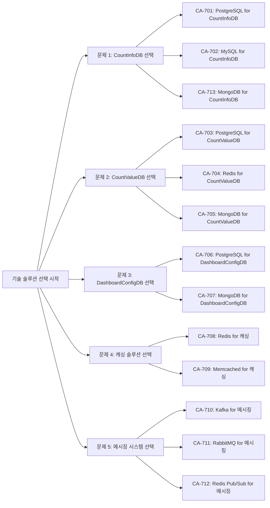

# 기술 솔루션 선택 후보 구조 설계

## 개요

### 목적
이 문서는 Count 통합 관리 시스템의 기술 솔루션 선택 관점에서 데이터베이스, 메시징 시스템, 캐싱 솔루션 등의 후보 구조를 설계합니다.

### 설계 범위
- 데이터베이스 선택 (CountInfoDB, CountValueDB, DashboardConfigDB)
- 캐싱 솔루션 선택 (캐싱 전략 구현)
- 메시징 시스템 선택 (이벤트 기반 갱신)

## 기술 솔루션 선택 문제 식별

### 문제 1: CountInfoDB 데이터베이스 선택
- **문제**: Count 정보(메타데이터) 저장을 위한 데이터베이스 기술 선택 필요
- **요구사항**:
  - 관계형 또는 문서형 데이터 구조 (Count ID, 이름, 설명, 생성일 등)
  - Count마다 확장 가능한 metadata 저장 (동적 스키마 지원)
  - 트랜잭션 지원 (ACID 속성 또는 최종 일관성)
  - 읽기 중심 워크로드 (변경 빈도 낮음)
  - Kubernetes 환경 호환성
- **근거**: 
  - QA-001, QA-002 (응답 시간 최소화)
  - QA-003, QA-004 (서비스 독립성)
  - NFR-001, NFR-002 (응답 시간 < 100ms)
  - NFR-003 (동시 요청 처리량 >= 1000 RPS)

### 문제 2: CountValueDB 데이터베이스 선택
- **문제**: Count 값 저장을 위한 데이터베이스 기술 선택 필요
- **요구사항**:
  - 키-값 또는 관계형 데이터 구조 (Count ID, 값, 타임스탬프)
  - 높은 쓰기 성능 (증가/감소 연산 빈번)
  - Atomic 증가/감소 연산 지원
  - 높은 읽기 성능 (조회 빈번)
  - Kubernetes 환경 호환성
- **근거**: 
  - QA-001, QA-002 (응답 시간 최소화)
  - QA-003, QA-004 (서비스 독립성)
  - NFR-001, NFR-002 (응답 시간 < 100ms)
  - NFR-003 (동시 요청 처리량 >= 1000 RPS)

### 문제 3: DashboardConfigDB 데이터베이스 선택
- **문제**: 대시보드 구성 정보 저장을 위한 데이터베이스 기술 선택 필요
- **요구사항**:
  - 문서형 또는 관계형 데이터 구조 (대시보드 설정, 위젯 구성 등)
  - 읽기 중심 워크로드
  - Kubernetes 환경 호환성
- **근거**: 
  - QA-006 (대시보드 기능 추가 용이성)
  - QA-010 (모니터링 서비스 독립성)

### 문제 4: 캐싱 솔루션 선택
- **문제**: 성능 최적화를 위한 캐싱 솔루션 기술 선택 필요
- **요구사항**:
  - 인메모리 캐시 (빠른 응답 시간)
  - 분산 캐시 지원 (MSA 환경)
  - TTL 및 이벤트 기반 무효화 지원
  - Kubernetes 환경 호환성
- **근거**: 
  - CA-007, CA-013 (CountInfoDB 캐싱)
  - CA-014, CA-015 (CountValueDB 및 조회 결과 캐싱)
  - CA-025 (대시보드 데이터 캐싱)
  - QA-001, QA-002 (응답 시간 최소화)

### 문제 5: 메시징 시스템 선택
- **문제**: 이벤트 기반 갱신을 위한 메시징 시스템 기술 선택 필요
- **요구사항**:
  - 이벤트 발행/구독 패턴 지원
  - 높은 처리량 및 낮은 지연 시간
  - 메시지 순서 보장 (선택적)
  - 메시지 재전송 메커니즘
  - Kubernetes 환경 호환성
- **근거**: 
  - CA-022 (이벤트 기반 갱신)
  - CA-007B, CA-013B, CA-025A (이벤트 기반 캐시 무효화)
  - QA-011 (대시보드 갱신 시간 최소화)

## 설계 과정 마인드 맵

## 후보 구조 설계 과정

### 1. CountInfoDB 데이터베이스 선택

#### CA-701: PostgreSQL for CountInfoDB

**개요**: CountInfoDB에 PostgreSQL 관계형 데이터베이스 사용

**설계 결정**:
- PostgreSQL을 CountInfoDB로 선택
- 관계형 데이터 모델 사용
- ACID 트랜잭션 보장
- 읽기 성능 최적화 (인덱싱, Connection Pooling)

**장점**:
- 강한 일관성 보장 (ACID 속성)
- 표준 SQL 지원으로 개발 생산성 높음
- 풍부한 인덱싱 옵션 (B-tree, Hash, GIN, GiST 등)
- Kubernetes 환경에서 안정적인 운영 (PostgreSQL Operator 지원)
- 오픈소스로 라이선스 비용 없음
- 성숙한 생태계 및 커뮤니티 지원

**단점 및 트레이드오프**:
- 수평 확장성 제한 (단일 노드 성능에 의존)
- 높은 동시성 처리 시 성능 저하 가능
- 복잡한 쿼리 시 응답 시간 증가 가능
- 확장 가능한 metadata 저장에 제한 (정적 스키마, JSONB 사용 시 일부 완화 가능)

**종속 후보 구조**:
- CA-701A: Read Replica 구성 (읽기 성능 향상)
- CA-701B: Connection Pooling 최적화 (동시성 처리 향상)

**관련 품질 요구사항**:
- QA-001, QA-002 (응답 시간 최소화)
- QA-003, QA-004 (서비스 독립성)
- NFR-001, NFR-002 (응답 시간 < 100ms)

#### CA-702: MySQL for CountInfoDB

**개요**: CountInfoDB에 MySQL 관계형 데이터베이스 사용

**설계 결정**:
- MySQL을 CountInfoDB로 선택
- 관계형 데이터 모델 사용
- ACID 트랜잭션 보장

**장점**:
- 강한 일관성 보장 (ACID 속성)
- 표준 SQL 지원
- 널리 사용되어 학습 곡선 낮음
- Kubernetes 환경에서 안정적인 운영
- 오픈소스 (MySQL Community Edition)

**단점 및 트레이드오프**:
- PostgreSQL 대비 고급 기능 제한
- 복잡한 쿼리 최적화 기능 제한
- 수평 확장성 제한
- 확장 가능한 metadata 저장에 제한 (정적 스키마)

**관련 품질 요구사항**:
- QA-001, QA-002 (응답 시간 최소화)
- QA-003, QA-004 (서비스 독립성)

#### CA-713: MongoDB for CountInfoDB

**개요**: CountInfoDB에 MongoDB 문서형 데이터베이스 사용

**설계 결정**:
- MongoDB를 CountInfoDB로 선택
- 문서형 데이터 모델 사용
- 동적 스키마로 확장 가능한 metadata 저장 지원
- JSON 형태로 유연한 데이터 구조

**장점**:
- **확장 가능한 metadata 저장**: Count마다 다른 metadata 구조를 동적으로 저장 가능
- **유연한 스키마**: 문서형 데이터 모델로 스키마 변경 용이
- **수평 확장성**: Sharding을 통한 수평 확장 지원
- **JSON 지원**: JSON 형태로 직관적인 데이터 저장
- **인덱싱 지원**: 단일 필드 및 복합 인덱스 지원
- Kubernetes 환경 호환성 (MongoDB Operator)
- 오픈소스

**단점 및 트레이드오프**:
- 관계형 데이터베이스 대비 일관성 보장 약함 (최종 일관성)
- 트랜잭션 지원 제한 (최신 버전에서 개선되었으나 관계형 DB 대비 제한적)
- 복잡한 조인 쿼리 제한
- 운영 복잡도 증가 (Sharding 구성 시)
- 관계형 데이터베이스 대비 쿼리 성능 제한 가능

**종속 후보 구조**:
- CA-713A: MongoDB Sharding 구성 (수평 확장)
- CA-713B: MongoDB Replica Set 구성 (고가용성)
- CA-713C: 인덱싱 전략 최적화

**관련 품질 요구사항**:
- QA-001, QA-002 (응답 시간 최소화)
- QA-003, QA-004 (서비스 독립성)
- NFR-001, NFR-002 (응답 시간 < 100ms)

### 2. CountValueDB 데이터베이스 선택

#### CA-703: PostgreSQL for CountValueDB

**개요**: CountValueDB에 PostgreSQL 관계형 데이터베이스 사용

**설계 결정**:
- PostgreSQL을 CountValueDB로 선택
- Atomic 증가/감소 연산 지원 (UPDATE ... SET value = value + delta)
- 트랜잭션으로 일관성 보장

**장점**:
- Atomic 연산 지원으로 동시성 제어 용이
- 강한 일관성 보장 (ACID 속성)
- 표준 SQL 지원
- Kubernetes 환경 호환성
- 오픈소스

**단점 및 트레이드오프**:
- 높은 쓰기 부하 시 성능 저하 가능
- 디스크 I/O로 인한 쓰기 지연
- 수평 확장성 제한

**종속 후보 구조**:
- CA-703A: Write-Ahead Logging (WAL) 최적화
- CA-703B: Connection Pooling 최적화

**관련 품질 요구사항**:
- QA-001 (저장 응답 시간 최소화)
- NFR-001 (응답 시간 < 100ms)

#### CA-704: Redis for CountValueDB

**개요**: CountValueDB에 Redis 인메모리 데이터베이스 사용

**설계 결정**:
- Redis를 CountValueDB로 선택
- 인메모리 저장으로 빠른 읽기/쓰기 성능
- INCR/DECR 명령으로 Atomic 증가/감소 연산 지원
- AOF (Append-Only File) 또는 RDB 스냅샷으로 영속성 보장

**장점**:
- 매우 빠른 읽기/쓰기 성능 (인메모리)
- Atomic 증가/감소 연산 지원 (INCR/DECR)
- 낮은 응답 시간 (< 1ms)
- 높은 처리량 지원
- Kubernetes 환경 호환성 (Redis Operator)

**단점 및 트레이드오프**:
- 메모리 용량 제한 (비용 증가)
- 영속성 보장 시 성능 저하 (AOF/RDB)
- 데이터 손실 위험 (메모리 기반)
- 복잡한 쿼리 제한 (키-값 기반)

**종속 후보 구조**:
- CA-704A: Redis Cluster 구성 (수평 확장)
- CA-704B: AOF 영속성 전략 선택
- CA-704C: 메모리 관리 전략 (eviction policy)

**관련 품질 요구사항**:
- QA-001 (저장 응답 시간 최소화)
- NFR-001 (응답 시간 < 100ms)
- NFR-003 (동시 요청 처리량 >= 1000 RPS)

#### CA-705: MongoDB for CountValueDB

**개요**: CountValueDB에 MongoDB 문서형 데이터베이스 사용

**설계 결정**:
- MongoDB를 CountValueDB로 선택
- 문서형 데이터 모델 사용
- Atomic 업데이트 연산 지원

**장점**:
- 유연한 스키마 (문서형)
- 수평 확장성 (Sharding)
- Atomic 업데이트 연산 지원
- Kubernetes 환경 호환성

**단점 및 트레이드오프**:
- 관계형 데이터베이스 대비 일관성 보장 약함
- 트랜잭션 지원 제한 (최신 버전에서 개선됨)
- 복잡한 쿼리 성능 제한
- 운영 복잡도 증가

**관련 품질 요구사항**:
- QA-001 (저장 응답 시간 최소화)

### 3. DashboardConfigDB 데이터베이스 선택

#### CA-706: PostgreSQL for DashboardConfigDB

**개요**: DashboardConfigDB에 PostgreSQL 관계형 데이터베이스 사용

**설계 결정**:
- PostgreSQL을 DashboardConfigDB로 선택
- JSONB 타입으로 유연한 구성 정보 저장

**장점**:
- 강한 일관성 보장
- JSONB로 유연한 스키마 지원
- 표준 SQL 지원
- Kubernetes 환경 호환성

**단점 및 트레이드오프**:
- 수평 확장성 제한

**관련 품질 요구사항**:
- QA-006 (대시보드 기능 추가 용이성)
- QA-010 (모니터링 서비스 독립성)

#### CA-707: MongoDB for DashboardConfigDB

**개요**: DashboardConfigDB에 MongoDB 문서형 데이터베이스 사용

**설계 결정**:
- MongoDB를 DashboardConfigDB로 선택
- 문서형 데이터 모델로 유연한 구성 정보 저장

**장점**:
- 유연한 스키마 (문서형)
- 수평 확장성
- 구성 정보 저장에 적합한 데이터 모델

**단점 및 트레이드오프**:
- 관계형 데이터베이스 대비 일관성 보장 약함
- 운영 복잡도 증가

**관련 품질 요구사항**:
- QA-006 (대시보드 기능 추가 용이성)

### 4. 캐싱 솔루션 선택

#### CA-708: Redis for 캐싱

**개요**: 캐싱 솔루션으로 Redis 사용

**설계 결정**:
- Redis를 캐싱 솔루션으로 선택
- 인메모리 캐시로 빠른 조회 성능 제공
- TTL 및 이벤트 기반 무효화 지원
- Pub/Sub으로 이벤트 기반 캐시 무효화 구현

**장점**:
- 매우 빠른 읽기/쓰기 성능 (인메모리)
- 다양한 데이터 구조 지원 (String, Hash, List, Set, Sorted Set)
- TTL 지원으로 자동 만료
- Pub/Sub 지원으로 이벤트 기반 무효화 가능
- 분산 캐시 지원 (Redis Cluster)
- Kubernetes 환경 호환성

**단점 및 트레이드오프**:
- 메모리 용량 제한 (비용 증가)
- 단일 노드 장애 시 캐시 손실 가능
- 복잡한 쿼리 제한

**종속 후보 구조**:
- CA-708A: Redis Cluster 구성 (고가용성)
- CA-708B: 캐시 전략 선택 (Write-Through, Write-Behind 등)

**관련 품질 요구사항**:
- CA-007, CA-013 (CountInfoDB 캐싱)
- CA-014, CA-015 (CountValueDB 및 조회 결과 캐싱)
- CA-025 (대시보드 데이터 캐싱)
- QA-001, QA-002 (응답 시간 최소화)

#### CA-709: Memcached for 캐싱

**개요**: 캐싱 솔루션으로 Memcached 사용

**설계 결정**:
- Memcached를 캐싱 솔루션으로 선택
- 단순한 키-값 캐시
- TTL 지원

**장점**:
- 매우 빠른 성능 (인메모리)
- 단순한 구조로 운영 용이
- 오픈소스

**단점 및 트레이드오프**:
- Pub/Sub 미지원 (이벤트 기반 무효화 불가)
- 데이터 구조 제한 (키-값만)
- 분산 캐시 지원 제한
- 영속성 미지원

**관련 품질 요구사항**:
- CA-007, CA-013 (CountInfoDB 캐싱)

### 5. 메시징 시스템 선택

#### CA-710: Kafka for 메시징

**개요**: 이벤트 기반 갱신을 위한 메시징 시스템으로 Apache Kafka 사용

**설계 결정**:
- Apache Kafka를 메시징 시스템으로 선택
- 이벤트 스트리밍 패턴 사용
- 토픽 기반 메시지 발행/구독

**장점**:
- 높은 처리량 (수백만 메시지/초)
- 낮은 지연 시간
- 메시지 순서 보장 (파티션 내)
- 메시지 영속성 보장 (로그 기반 저장)
- 수평 확장성 (파티션 기반)
- 이벤트 재생 가능 (로그 보관)
- Kubernetes 환경 호환성 (Strimzi Operator)

**단점 및 트레이드오프**:
- 운영 복잡도 높음
- 학습 곡선 높음
- 낮은 처리량 환경에서는 오버엔지니어링 가능
- 메시지 브로커 대비 설정 복잡

**종속 후보 구조**:
- CA-710A: Kafka Topic 파티션 수 결정
- CA-710B: 메시지 보관 정책 설정

**관련 품질 요구사항**:
- CA-022 (이벤트 기반 갱신)
- CA-007B, CA-013B, CA-025A (이벤트 기반 캐시 무효화)
- QA-011 (대시보드 갱신 시간 최소화)

#### CA-711: RabbitMQ for 메시징

**개요**: 이벤트 기반 갱신을 위한 메시징 시스템으로 RabbitMQ 사용

**설계 결정**:
- RabbitMQ를 메시징 시스템으로 선택
- 메시지 브로커 패턴 사용
- Exchange 및 Queue 기반 라우팅

**장점**:
- 유연한 메시지 라우팅 (Exchange 타입)
- 다양한 메시지 패턴 지원 (Queue, Topic, Fanout 등)
- 운영 복잡도 상대적으로 낮음
- Kubernetes 환경 호환성
- 오픈소스

**단점 및 트레이드오프**:
- Kafka 대비 처리량 제한
- 메시지 순서 보장 제한
- 높은 처리량 환경에서 성능 저하 가능

**종속 후보 구조**:
- CA-711A: Exchange 타입 선택 (Topic, Fanout 등)
- CA-711B: 메시지 영속성 설정

**관련 품질 요구사항**:
- CA-022 (이벤트 기반 갱신)
- QA-011 (대시보드 갱신 시간 최소화)

#### CA-712: Redis Pub/Sub for 메시징

**개요**: 이벤트 기반 갱신을 위한 메시징 시스템으로 Redis Pub/Sub 사용

**설계 결정**:
- Redis Pub/Sub을 메시징 시스템으로 선택
- Redis를 캐싱과 메시징에 동시 사용

**장점**:
- Redis 인프라 재사용 (비용 절감)
- 낮은 지연 시간
- 구현 단순성
- Kubernetes 환경 호환성

**단점 및 트레이드오프**:
- 메시지 영속성 미지원 (구독자가 없으면 메시지 손실)
- 메시지 순서 보장 제한
- 높은 처리량 환경에서 성능 제한
- Kafka/RabbitMQ 대비 기능 제한

**관련 품질 요구사항**:
- CA-022 (이벤트 기반 갱신)
- QA-011 (대시보드 갱신 시간 최소화)

## 후보 구조 목록

### 데이터베이스 선택 후보 구조

| 후보 구조 ID | 제목 | 대상 컴포넌트 | 분석 |
|------------|------|-------------|------|
| CA-701 | PostgreSQL for CountInfoDB | CountInfoDB | solutions.md |
| CA-702 | MySQL for CountInfoDB | CountInfoDB | solutions.md |
| CA-713 | MongoDB for CountInfoDB | CountInfoDB | solutions.md |
| CA-703 | PostgreSQL for CountValueDB | CountValueDB | solutions.md |
| CA-704 | Redis for CountValueDB | CountValueDB | solutions.md |
| CA-705 | MongoDB for CountValueDB | CountValueDB | solutions.md |
| CA-706 | PostgreSQL for DashboardConfigDB | DashboardConfigDB | solutions.md |
| CA-707 | MongoDB for DashboardConfigDB | DashboardConfigDB | solutions.md |

### 캐싱 솔루션 선택 후보 구조

| 후보 구조 ID | 제목 | 분석 |
|------------|------|------|
| CA-708 | Redis for 캐싱 | solutions.md |
| CA-709 | Memcached for 캐싱 | solutions.md |

### 메시징 시스템 선택 후보 구조

| 후보 구조 ID | 제목 | 분석 |
|------------|------|------|
| CA-710 | Kafka for 메시징 | solutions.md |
| CA-711 | RabbitMQ for 메시징 | solutions.md |
| CA-712 | Redis Pub/Sub for 메시징 | solutions.md |

## 주요 설계 결정

### 기술 솔루션 선택 기준

1. **성능 우선**: QA-001, QA-002 (응답 시간 최소화) 및 NFR-001, NFR-002 (응답 시간 < 100ms) 만족
2. **확장성**: NFR-003 (동시 요청 처리량 >= 1000 RPS) 만족
3. **Kubernetes 호환성**: Kubernetes 환경에서 안정적인 운영
4. **비용 효율성**: 오픈소스 솔루션 우선 고려
5. **운영 복잡도**: 학습 곡선 및 운영 복잡도 고려

### 추천 기술 스택 (채택 가능한 솔루션)

#### CountInfoDB
- **추천**: PostgreSQL (CA-701) 또는 MongoDB (CA-713)
- **근거**: 
  - PostgreSQL: 관계형 데이터 구조, 강한 일관성, 표준 SQL, Kubernetes 호환성
  - MongoDB: 확장 가능한 metadata 저장, 유연한 스키마, 수평 확장성, Kubernetes 호환성

#### CountValueDB
- **추천**: PostgreSQL (CA-703) 또는 Redis (CA-704)
- **근거**: 
  - PostgreSQL: Atomic 연산 지원, 일관성 보장, 운영 안정성
  - Redis: 매우 빠른 성능, Atomic 연산 지원, 높은 처리량

#### DashboardConfigDB
- **추천**: PostgreSQL (CA-706)
- **근거**: 관계형 데이터 구조, JSONB 지원, Kubernetes 호환성

#### 캐싱 솔루션
- **추천**: Redis (CA-708)
- **근거**: 빠른 성능, TTL 지원, Pub/Sub 지원, 분산 캐시 지원

#### 메시징 시스템
- **추천**: Kafka (CA-710) 또는 RabbitMQ (CA-711)
- **근거**: 
  - Kafka: 높은 처리량, 메시지 영속성, 이벤트 재생 가능
  - RabbitMQ: 운영 복잡도 낮음, 유연한 라우팅

## 후보 구조 상세

각 후보 구조의 상세 내용은 다음 파일을 참조하세요:

### 데이터베이스 선택 후보 구조
- **CA-701**: PostgreSQL for CountInfoDB (`CA-701-PostgreSQL-for-CountInfoDB.md`)
- **CA-702**: MySQL for CountInfoDB (상세 문서 미작성)
- **CA-713**: MongoDB for CountInfoDB (`CA-713-MongoDB-for-CountInfoDB.md`)
- **CA-703**: PostgreSQL for CountValueDB (상세 문서 미작성)
- **CA-704**: Redis for CountValueDB (`CA-704-Redis-for-CountValueDB.md`)
- **CA-705**: MongoDB for CountValueDB (상세 문서 미작성)
- **CA-706**: PostgreSQL for DashboardConfigDB (상세 문서 미작성)
- **CA-707**: MongoDB for DashboardConfigDB (상세 문서 미작성)

### 캐싱 솔루션 선택 후보 구조
- **CA-708**: Redis for 캐싱 (`CA-708-Redis-for-캐싱.md`)
- **CA-709**: Memcached for 캐싱 (상세 문서 미작성)

### 메시징 시스템 선택 후보 구조
- **CA-710**: Kafka for 메시징 (`CA-710-Kafka-for-메시징.md`)
- **CA-711**: RabbitMQ for 메시징 (상세 문서 미작성)
- **CA-712**: Redis Pub/Sub for 메시징 (상세 문서 미작성)

## 비고

- 모든 후보 구조는 독립적으로 평가되며, 채택 여부가 결정됨
- 종속 후보 구조는 부모 후보 구조의 단점을 보완하기 위한 추가 설계 결정임
- 후보 구조 간 상충 관계가 있을 수 있으며, 평가 단계에서 비교 분석이 필요함
- 기술 솔루션 선택은 품질 요구사항과 비용, 복잡도를 종합적으로 고려하여 결정됨
