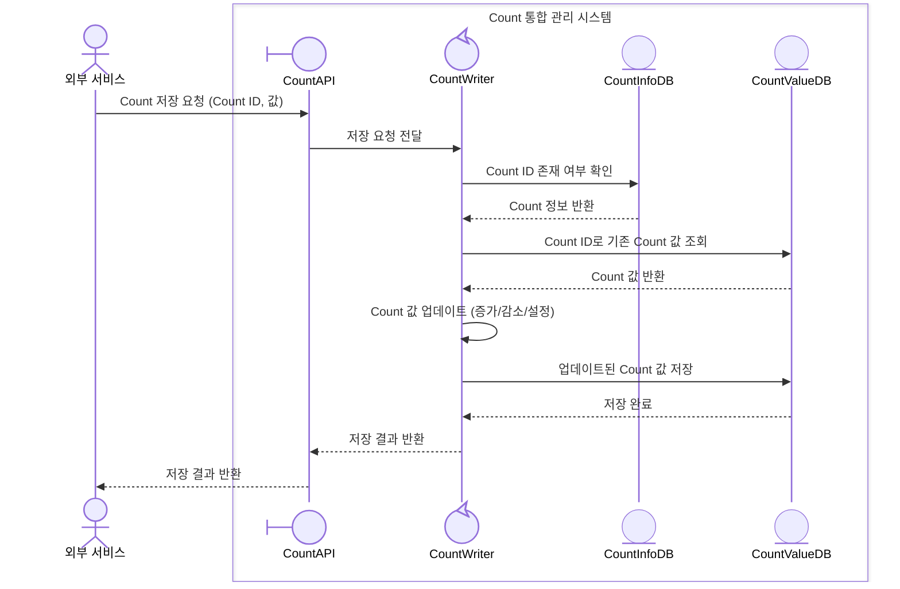
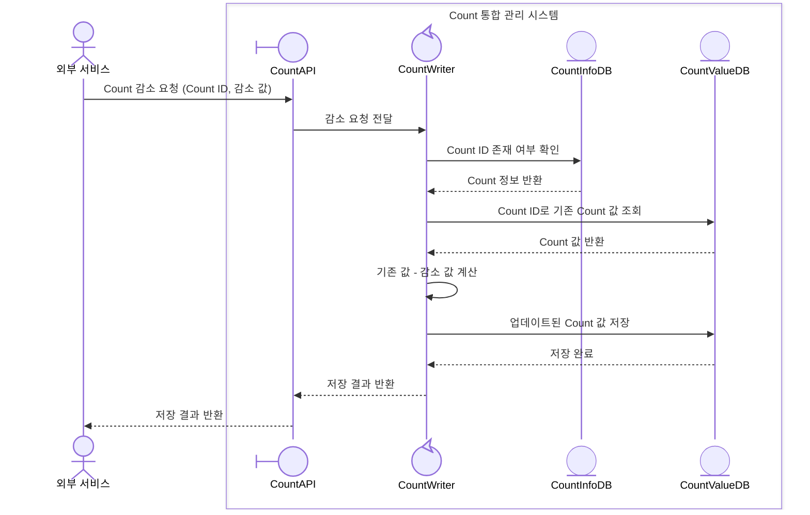
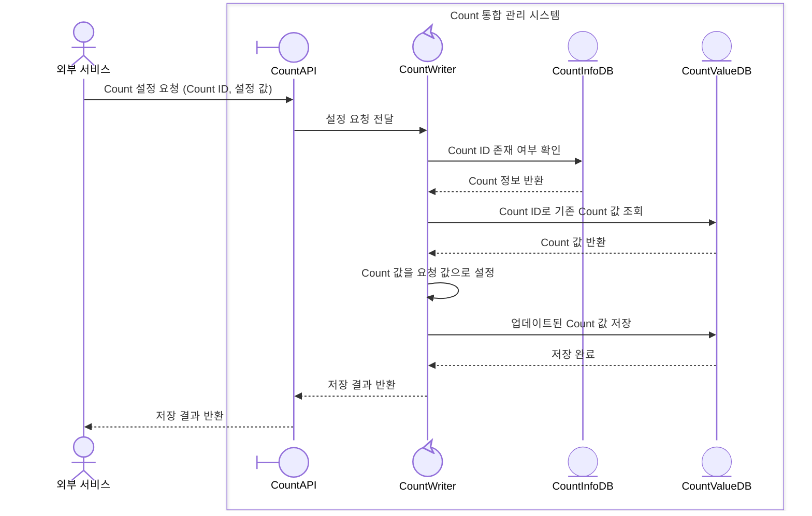
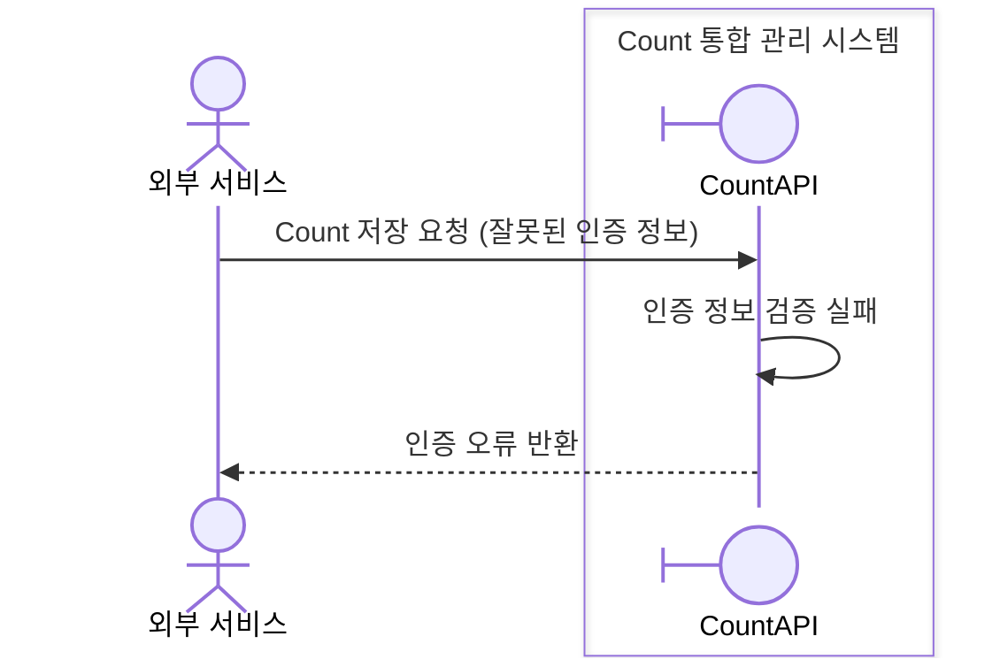
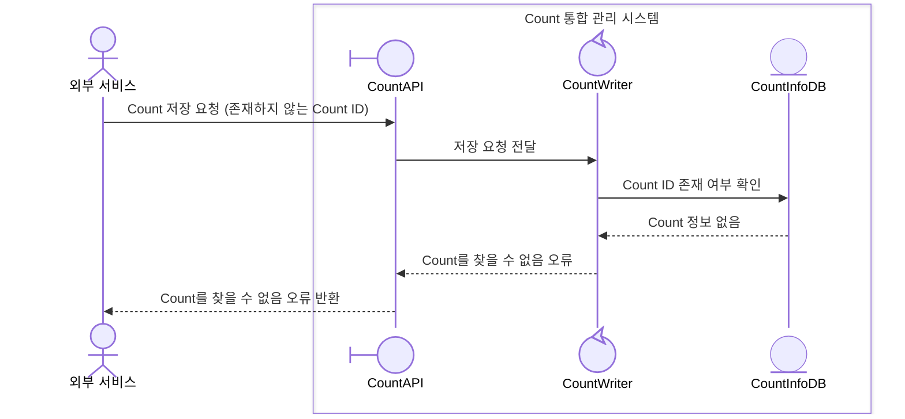
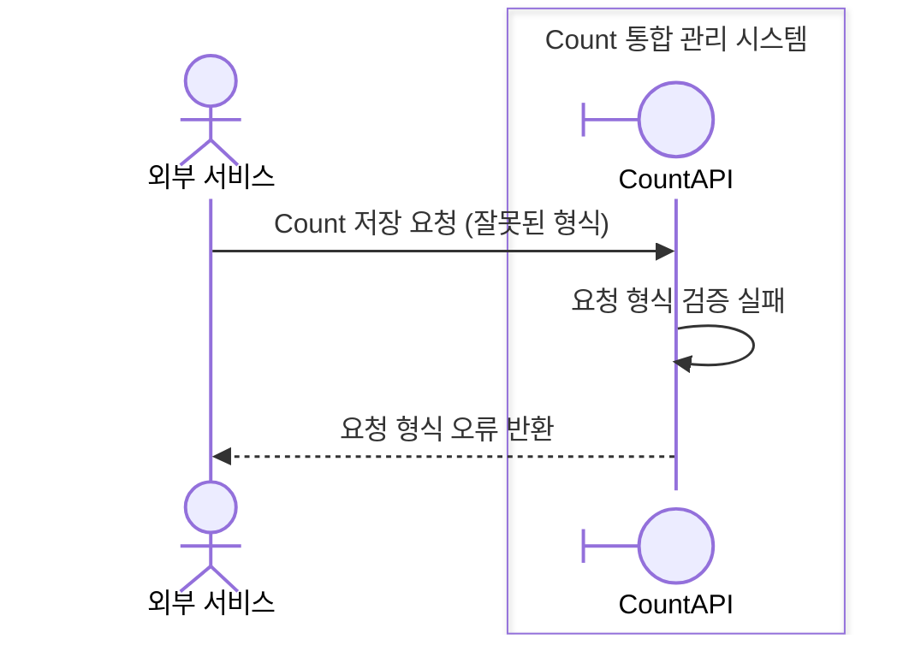
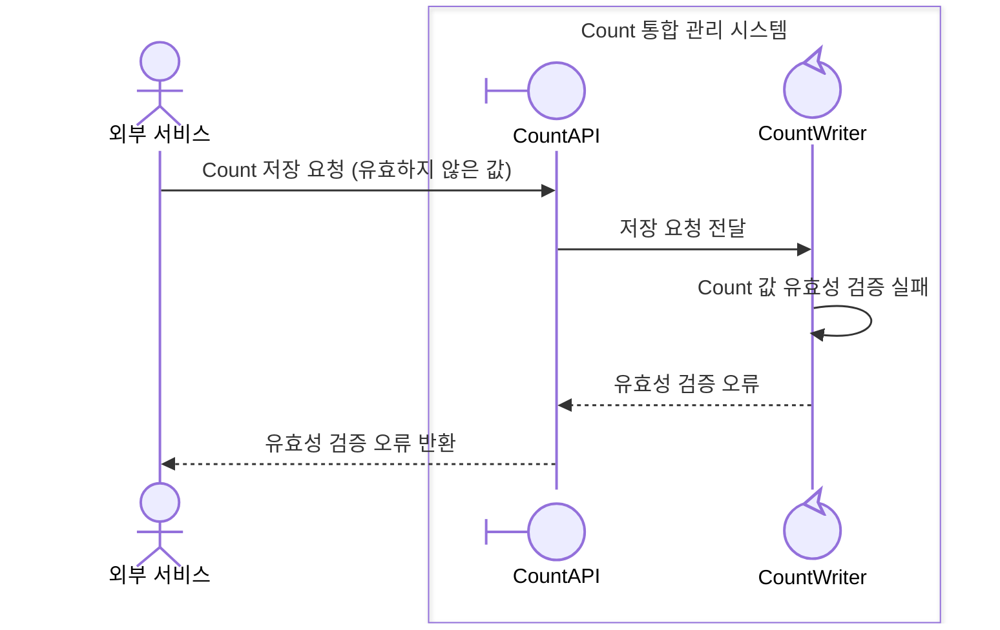

# UC-001-Count 저장 도메인 분석

## 개요

### Use Case ID
UC-001

### 제목
Count 저장

## 시퀀스 다이어그램

### 주요 시나리오

### 대안 시나리오

#### 4a. Count 값 증가

#### 4b. Count 값 감소

#### 4c. Count 값 설정

### 예외 시나리오

#### E1. 인증 실패

#### E2. Count ID 없음

#### E3. 요청 형식 오류

#### E4. Count 값 유효성 검증 실패

