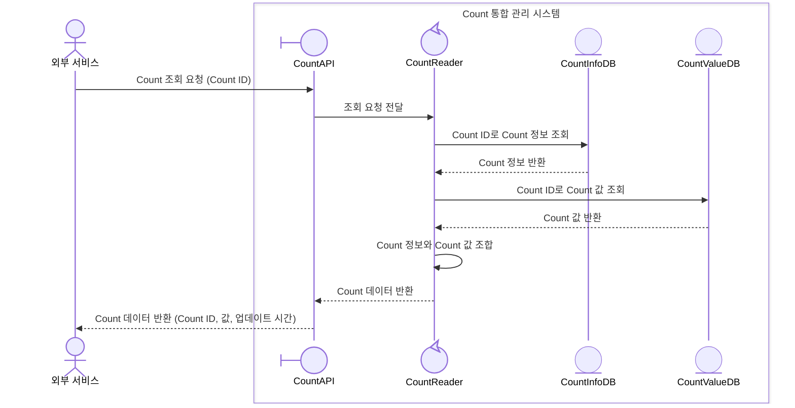
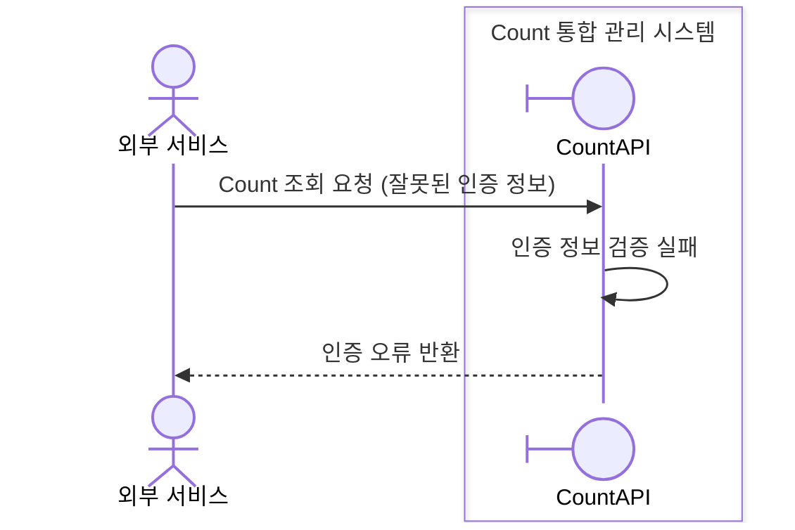
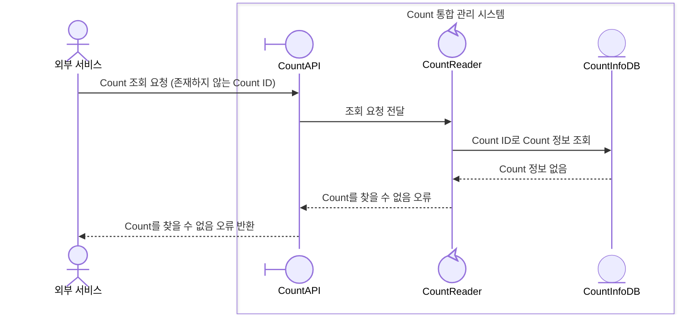
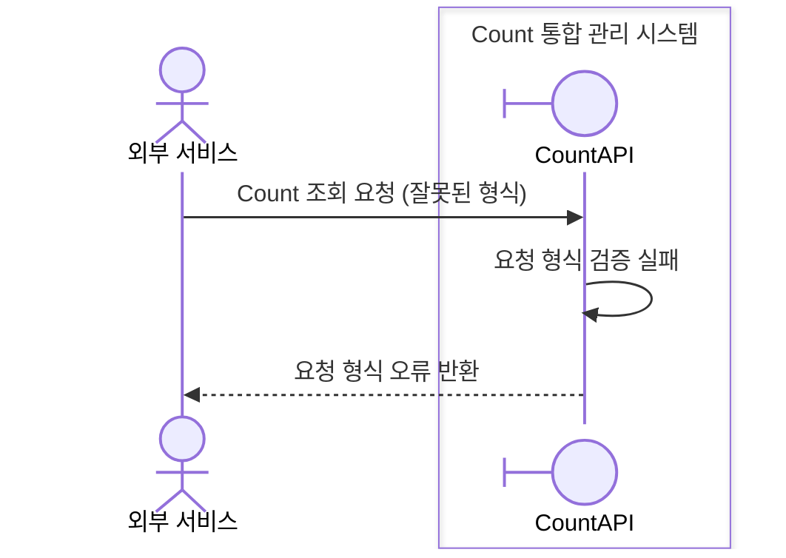
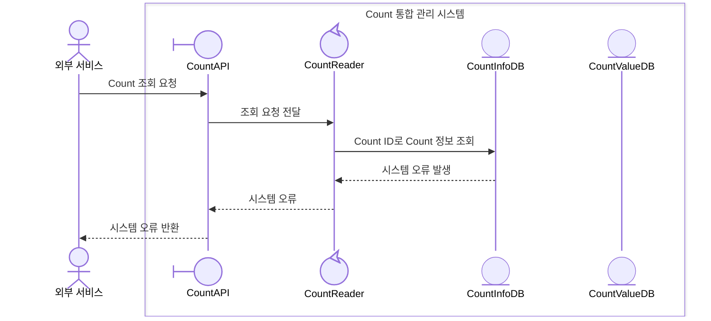

# UC-002-Count 조회 도메인 분석

## 개요

### Use Case ID
UC-002

### 제목
Count 조회

## 시퀀스 다이어그램

### 주요 시나리오

```mermaid
sequenceDiagram
  %% primary actor
  actor ExternalService as 외부 서비스

  box Count 통합 관리 시스템
    participant CountAPI@{ "type" : "boundary" }
    participant CountReader@{ "type" : "control" }
    participant CountInfoDB@{ "type" : "entity" }
    participant CountValueDB@{ "type" : "entity" }
  end

  ExternalService->>CountAPI: Count 조회 요청 (Count ID)
  CountAPI->>CountReader: 조회 요청 전달
  CountReader->>CountInfoDB: Count ID로 Count 정보 조회
  CountInfoDB-->>CountReader: Count 정보 반환
  CountReader->>CountValueDB: Count ID로 Count 값 조회
  CountValueDB-->>CountReader: Count 값 반환
  CountReader->>CountReader: Count 정보와 Count 값 조합
  CountReader-->>CountAPI: Count 데이터 반환
  CountAPI-->>ExternalService: Count 데이터 반환 (Count ID, 값, 업데이트 시간)
```

### 예외 시나리오

#### E1. 인증 실패

```mermaid
sequenceDiagram
  actor ExternalService as 외부 서비스

  box Count 통합 관리 시스템
    participant CountAPI@{ "type" : "boundary" }
  end

  ExternalService->>CountAPI: Count 조회 요청 (잘못된 인증 정보)
  CountAPI->>CountAPI: 인증 정보 검증 실패
  CountAPI-->>ExternalService: 인증 오류 반환
```

#### E2. Count ID 없음

```mermaid
sequenceDiagram
  actor ExternalService as 외부 서비스

  box Count 통합 관리 시스템
    participant CountAPI@{ "type" : "boundary" }
    participant CountReader@{ "type" : "control" }
    participant CountInfoDB@{ "type" : "entity" }
  end

  ExternalService->>CountAPI: Count 조회 요청 (존재하지 않는 Count ID)
  CountAPI->>CountReader: 조회 요청 전달
  CountReader->>CountInfoDB: Count ID로 Count 정보 조회
  CountInfoDB-->>CountReader: Count 정보 없음
  CountReader-->>CountAPI: Count를 찾을 수 없음 오류
  CountAPI-->>ExternalService: Count를 찾을 수 없음 오류 반환
```

#### E3. 요청 형식 오류

```mermaid
sequenceDiagram
  actor ExternalService as 외부 서비스

  box Count 통합 관리 시스템
    participant CountAPI@{ "type" : "boundary" }
  end

  ExternalService->>CountAPI: Count 조회 요청 (잘못된 형식)
  CountAPI->>CountAPI: 요청 형식 검증 실패
  CountAPI-->>ExternalService: 요청 형식 오류 반환
```

#### E4. 시스템 오류

```mermaid
sequenceDiagram
  actor ExternalService as 외부 서비스

  box Count 통합 관리 시스템
    participant CountAPI@{ "type" : "boundary" }
    participant CountReader@{ "type" : "control" }
    participant CountInfoDB@{ "type" : "entity" }
    participant CountValueDB@{ "type" : "entity" }
  end

  ExternalService->>CountAPI: Count 조회 요청
  CountAPI->>CountReader: 조회 요청 전달
  CountReader->>CountInfoDB: Count ID로 Count 정보 조회
  CountInfoDB-->>CountReader: 시스템 오류 발생
  CountReader-->>CountAPI: 시스템 오류
  CountAPI-->>ExternalService: 시스템 오류 반환
```
