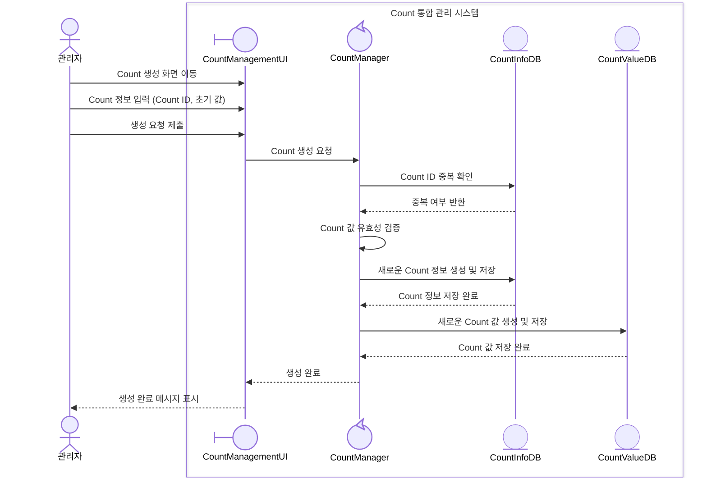
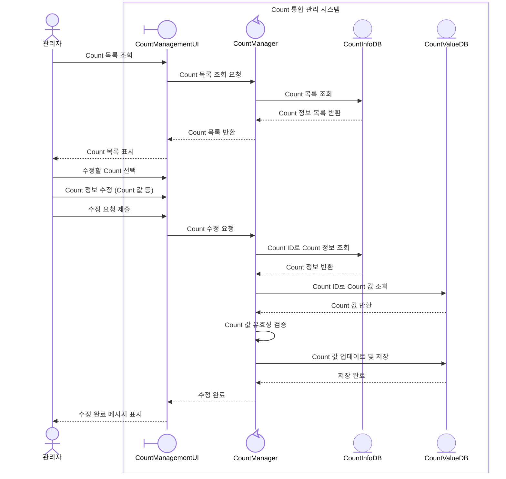
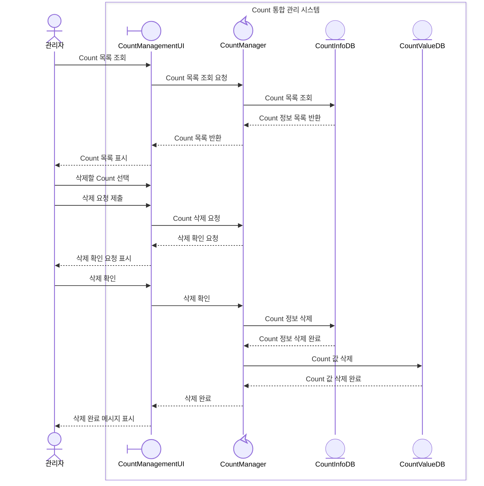
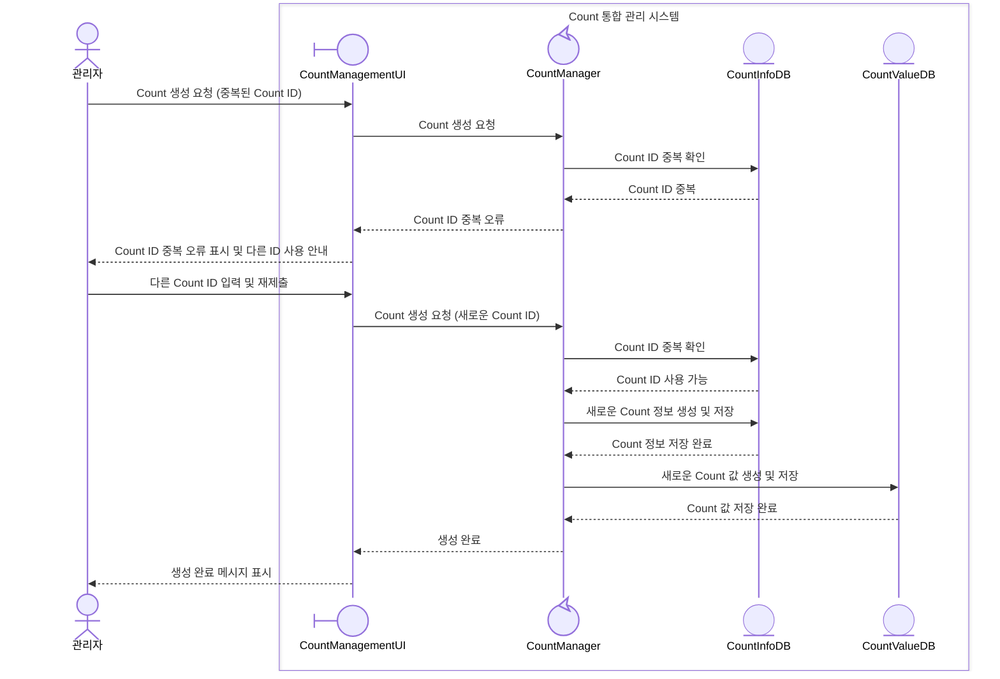
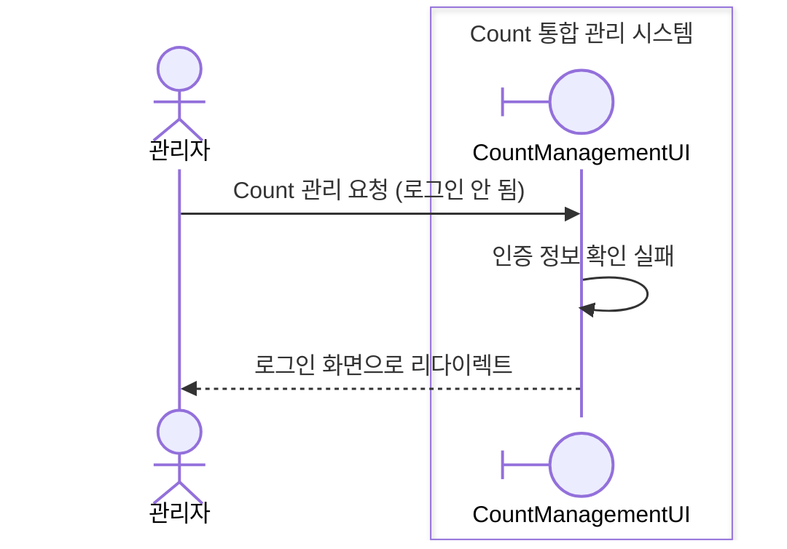
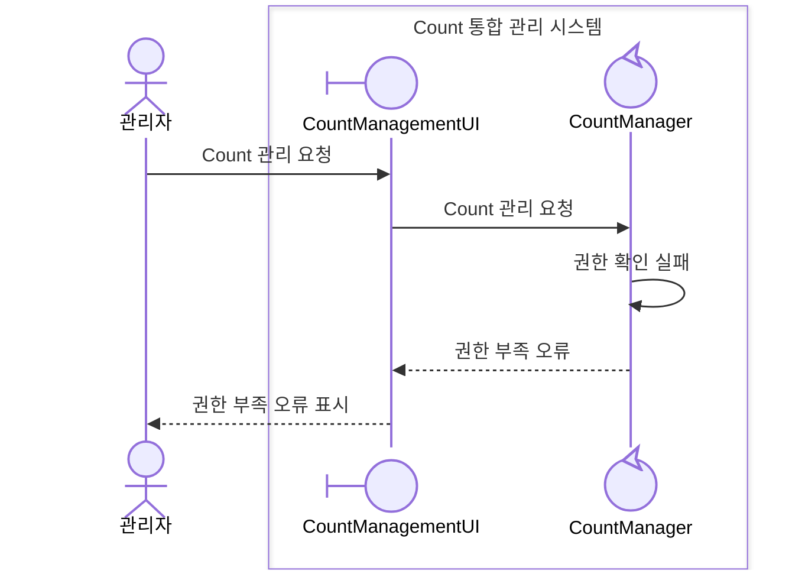
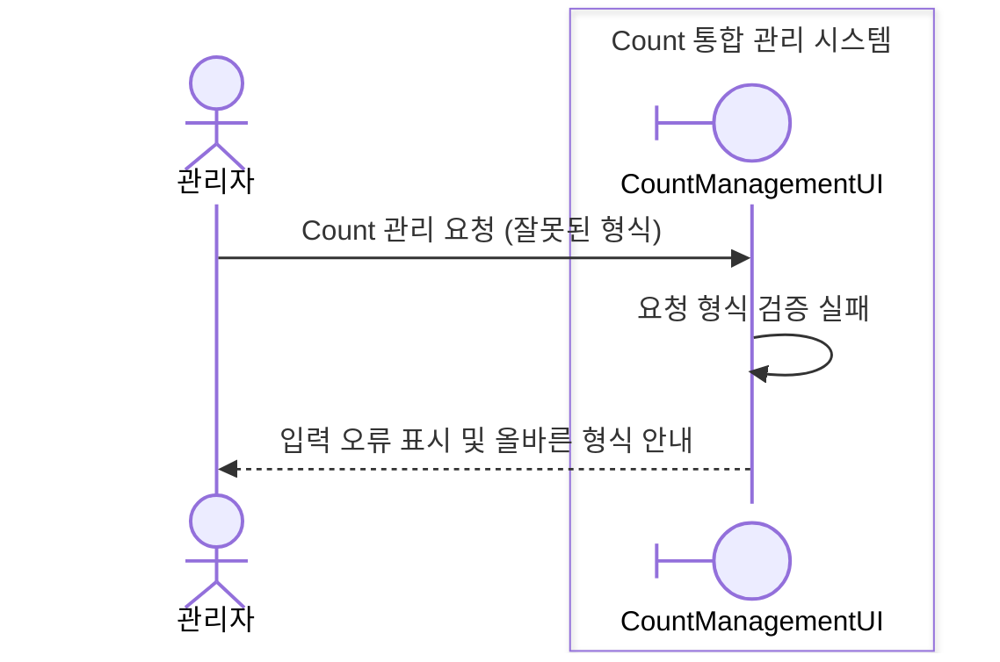
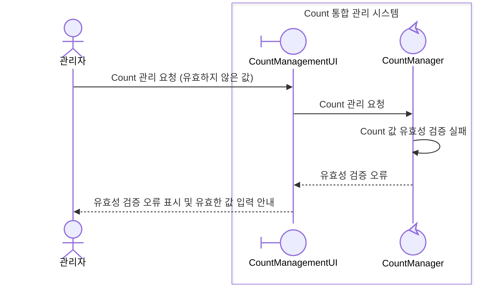
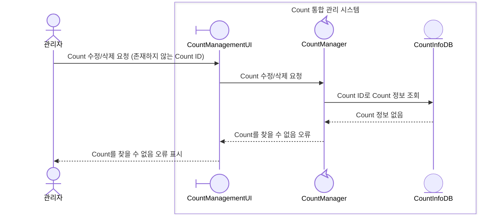

# UC-003-Count 관리 도메인 분석

## 개요

### Use Case ID
UC-003

### 제목
Count 관리

## 시퀀스 다이어그램

### 주요 시나리오

#### 시나리오 1: Count 생성

#### 시나리오 2: Count 수정

#### 시나리오 3: Count 삭제

### 대안 시나리오

#### 4a. Count ID 중복

### 예외 시나리오

#### E1. 인증 실패

#### E2. 권한 부족

#### E3. 요청 형식 오류

#### E4. Count 값 유효성 검증 실패

#### E5. Count 데이터 없음

