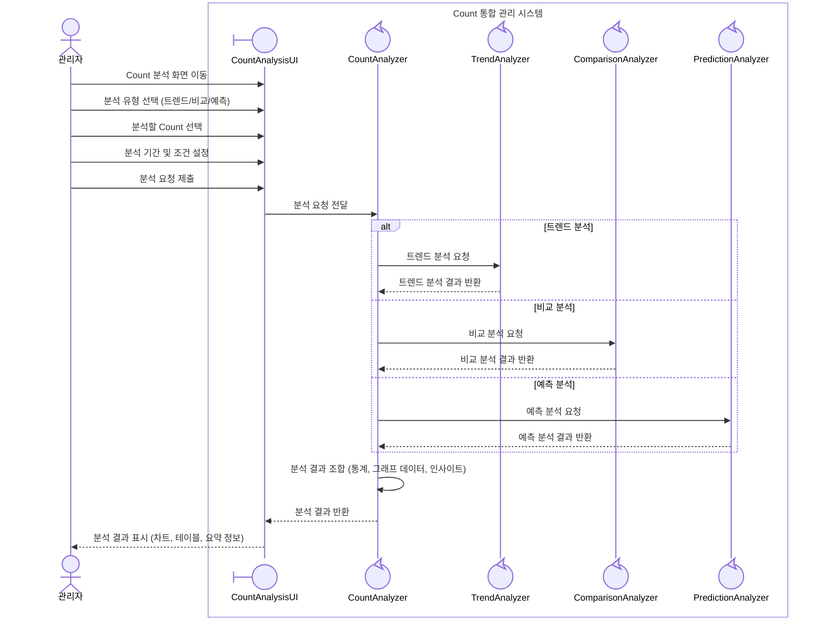
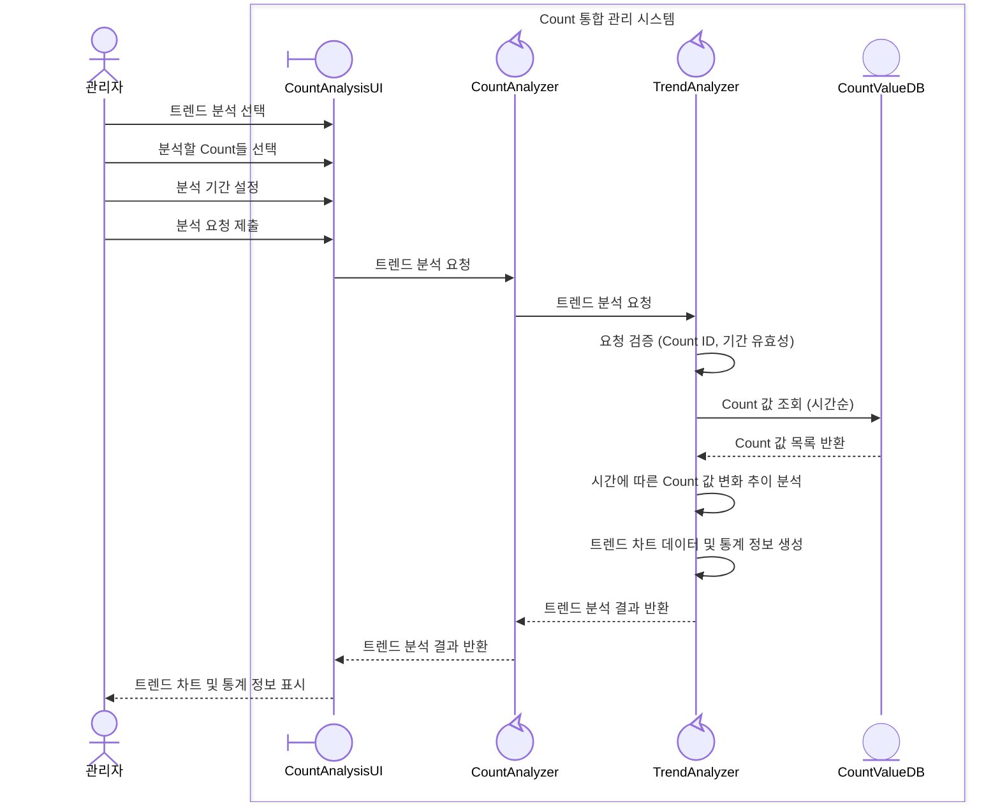
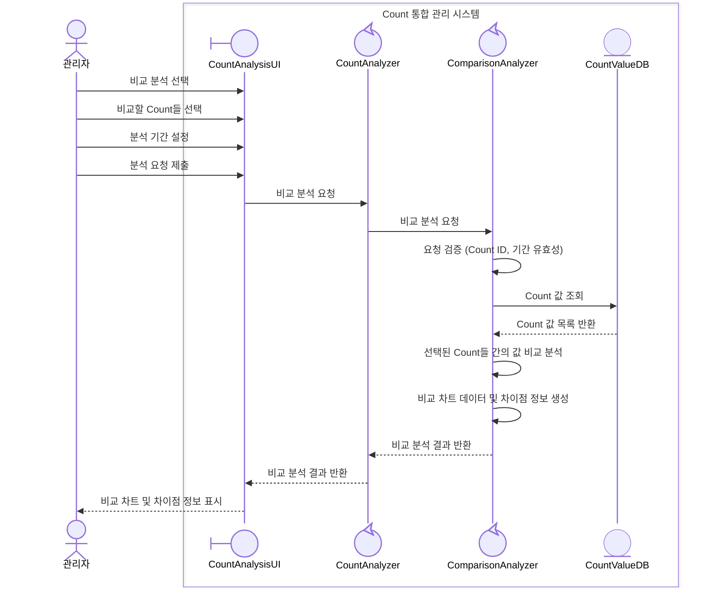
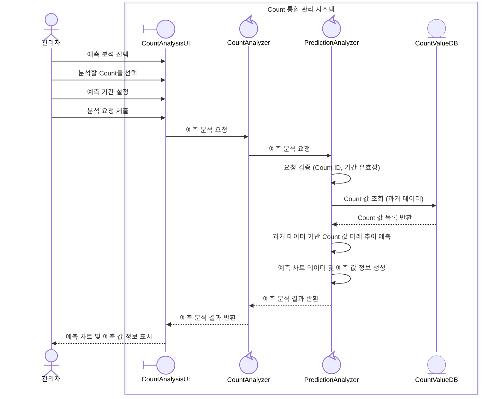
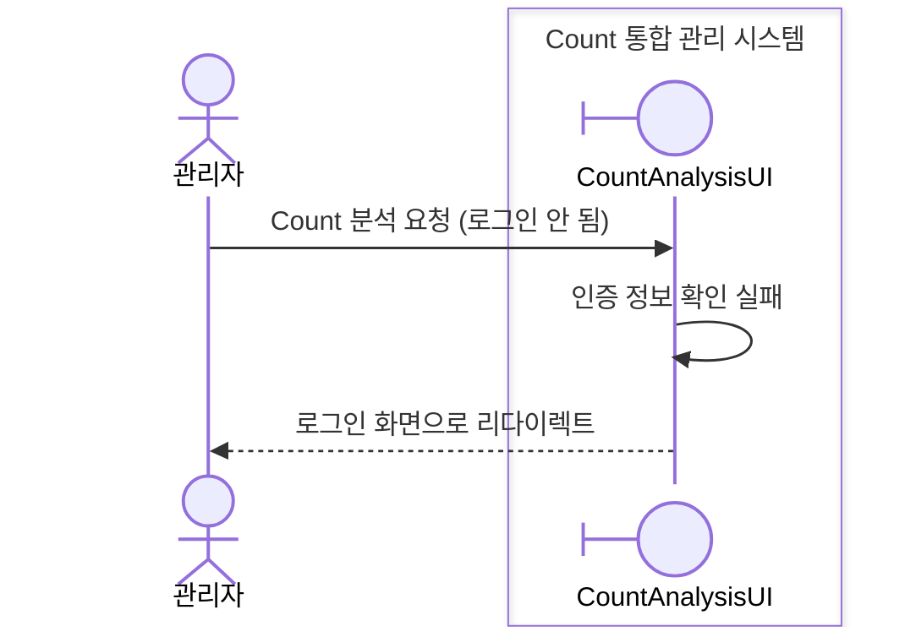
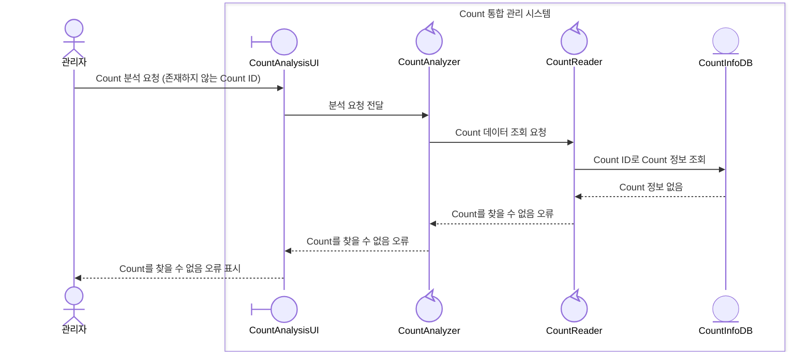
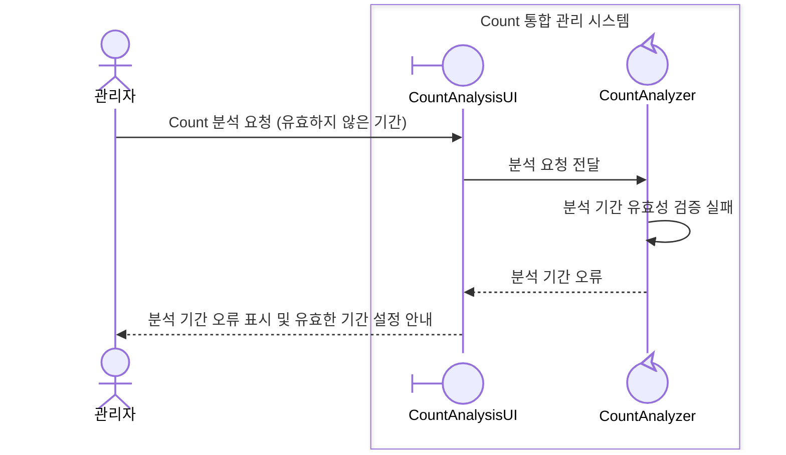
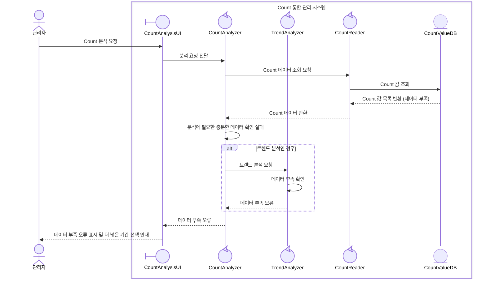
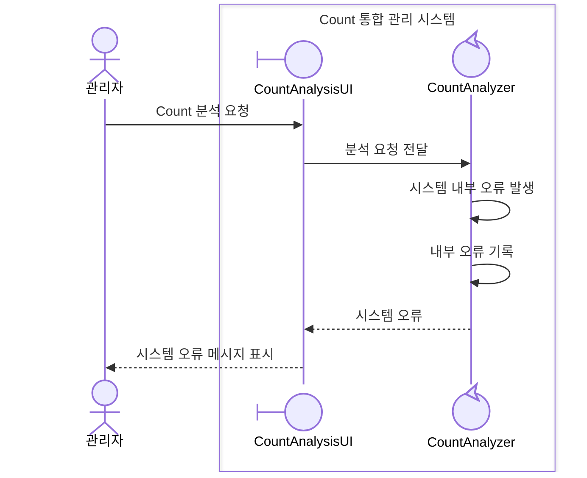

# UC-004-Count 분석 도메인 분석

## 개요

### Use Case ID
UC-004

### 제목
Count 분석

## 시퀀스 다이어그램

### 주요 시나리오

### 대안 시나리오

#### 2a. 트렌드 분석

#### 2b. 비교 분석

#### 2c. 예측 분석

### 예외 시나리오

#### E1. 인증 실패

#### E2. Count 데이터 없음

#### E3. 분석 기간 오류

#### E4. 데이터 부족

#### E5. 시스템 오류

