# UC-005-Count 모니터링 도메인 분석

## 개요

### Use Case ID
UC-005

### 제목
Count 모니터링

## 시퀀스 다이어그램

### 주요 시나리오

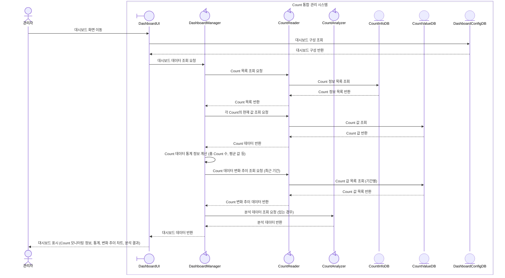

### 대안 시나리오

#### 2a. 특정 Count 모니터링
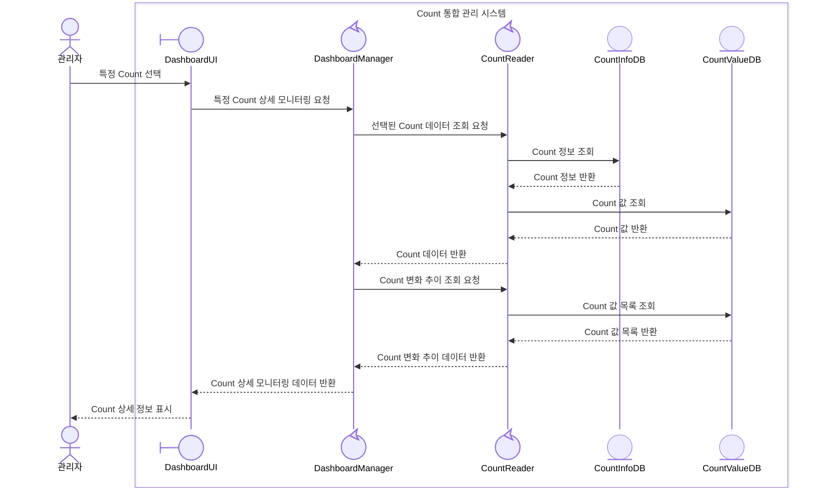

#### 4a. 실시간 업데이트
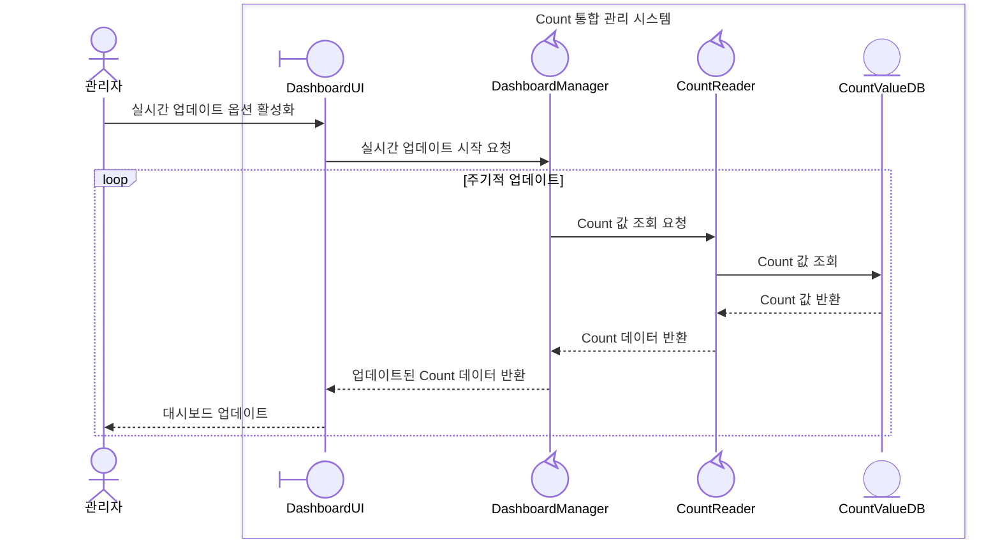

#### 8a. 대시보드 편집 모드
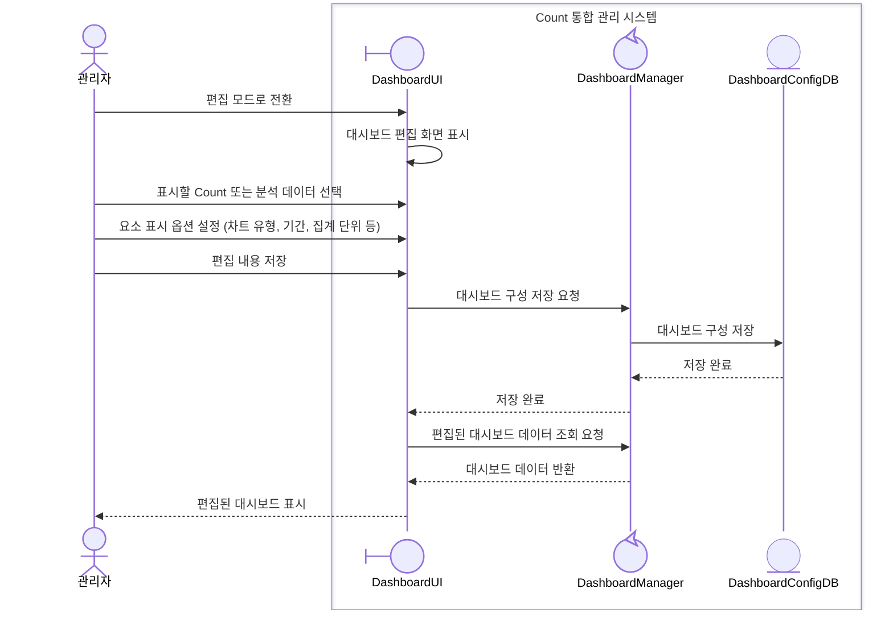

#### 8b. 대시보드 레이아웃 조정
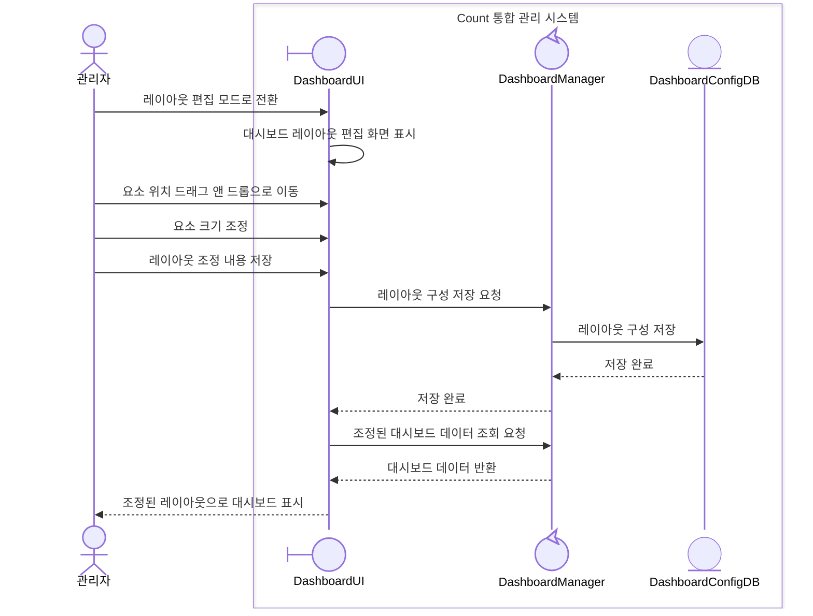

#### 8c. 대시보드 요소 추가
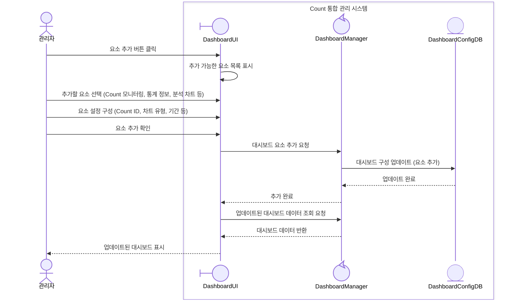

#### 8d. 대시보드 요소 제거
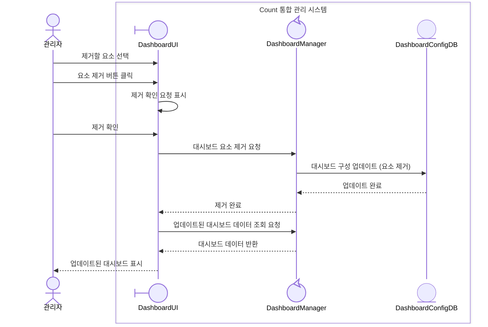

### 예외 시나리오

#### E1. 인증 실패
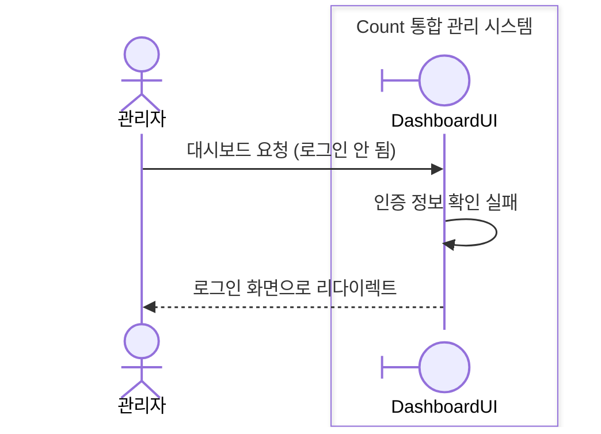

#### E2. Count 데이터 없음
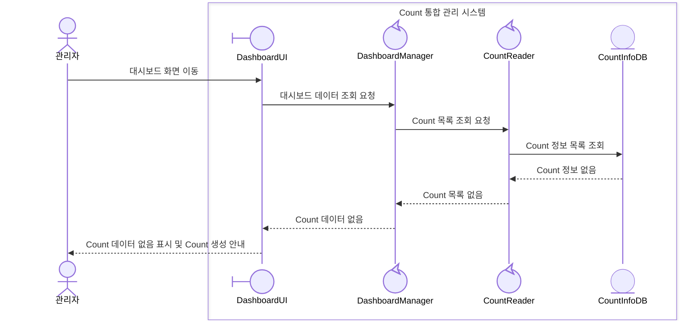

#### E3. 시스템 오류
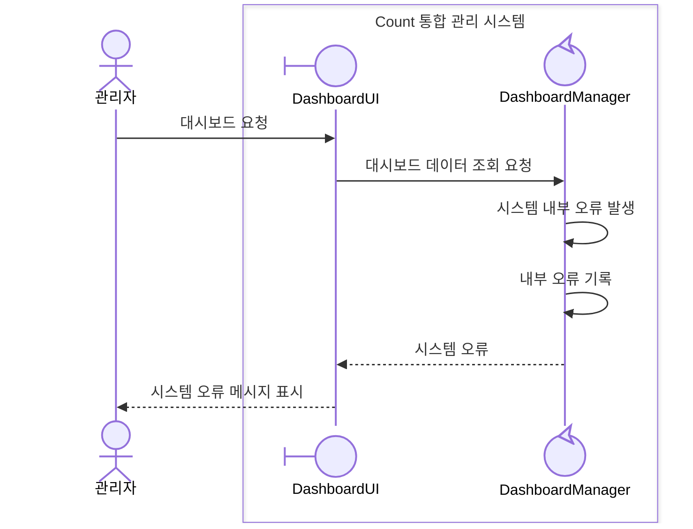

#### E4. 데이터 조회 실패
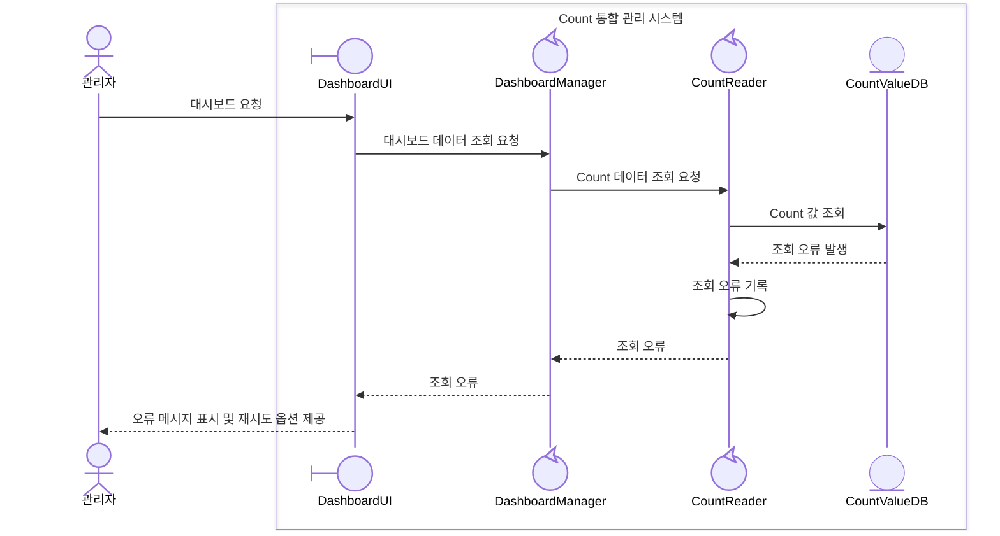
