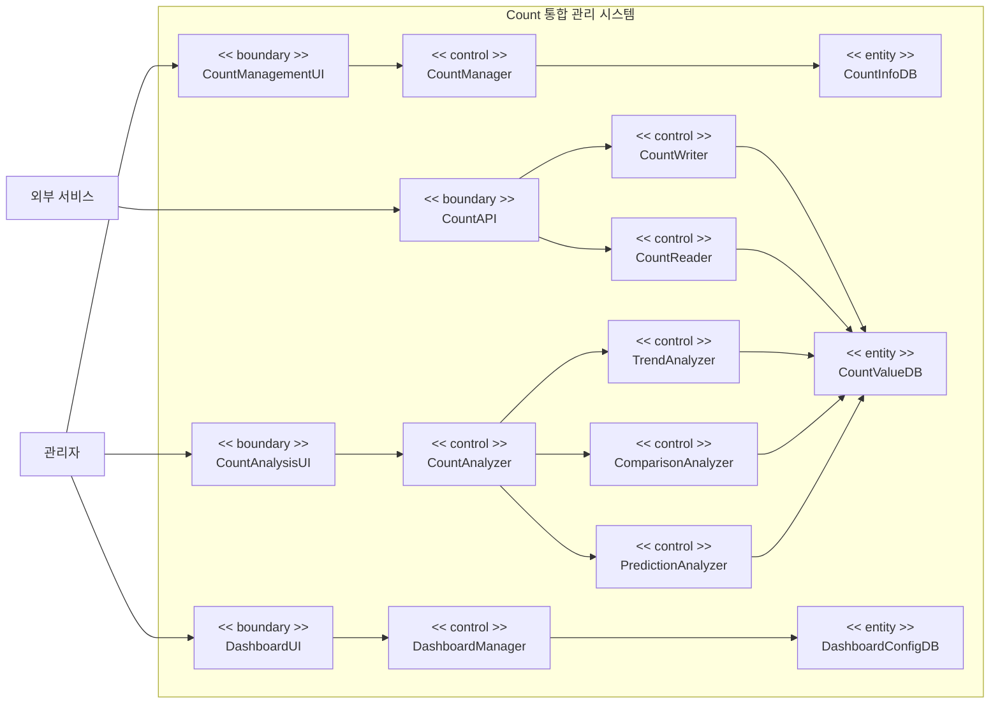

# 도메인 모델

## 개요

### 목적
Count 통합 관리 시스템의 기능적 요구사항을 제공하기 위한 내부 컴포넌트를 식별하고, 각 컴포넌트의 역할과 책임을 명확히 정의합니다. 이 도메인 모델은 UC-001 (Count 저장), UC-002 (Count 조회), UC-003 (Count 관리), UC-004 (Count 분석), UC-005 (Count 모니터링) Use Case를 분석하여 도출되었습니다.

### 컴포넌트 분류 체계
- **Boundary**: 사용자 또는 외부 시스템과의 인터페이스
- **Control**: 비즈니스 로직 처리, 흐름 제어, 계산
- **Entity**: 데이터의 저장 및 관리

## 도메인 모델

- **일부 커넥터는 생략함**

## Boundary 컴포넌트

### CountAPI
- **역할**: 외부 서비스와의 REST API 인터페이스를 담당하는 컴포넌트
- **책임**: 
  - 외부 서비스로부터의 REST API 요청 수신
  - 요청 데이터 형식 검증
  - 인증 정보 검증
  - 응답 데이터 형식 변환 및 반환
  - HTTP 프로토콜 처리
- **인터페이스**: 외부 서비스 (Primary Actor)
- **관련 Use Case**: UC-001, UC-002

### CountManagementUI
- **역할**: 관리자와의 Count 관리 웹 UI 인터페이스를 담당하는 컴포넌트
- **책임**: 
  - 관리자로부터의 Count 관리 웹 UI 요청 수신
  - 사용자 입력 데이터 형식 검증
  - 인증 및 권한 확인
  - 화면 표시 및 사용자 상호작용 처리
  - 요청 데이터를 Control 컴포넌트로 전달
  - 처리 결과를 사용자에게 표시
- **인터페이스**: 관리자 (Primary Actor)
- **관련 Use Case**: UC-003

### CountAnalysisUI
- **역할**: 관리자와의 Count 분석 웹 UI 인터페이스를 담당하는 컴포넌트
- **책임**: 
  - 관리자로부터의 Count 분석 웹 UI 요청 수신
  - 사용자 입력 데이터 형식 검증 (분석 유형, Count 선택, 기간 설정 등)
  - 인증 및 권한 확인
  - 화면 표시 및 사용자 상호작용 처리
  - 요청 데이터를 Control 컴포넌트로 전달
  - 분석 결과 시각화 (차트, 테이블, 요약 정보 등)
  - 처리 결과를 사용자에게 표시
- **인터페이스**: 관리자 (Primary Actor)
- **관련 Use Case**: UC-004

### DashboardUI
- **역할**: 관리자와의 Count 모니터링 대시보드 웹 UI 인터페이스를 담당하는 컴포넌트
- **책임**: 
  - 관리자로부터의 대시보드 웹 UI 요청 수신
  - 사용자 입력 데이터 형식 검증
  - 인증 및 권한 확인
  - 화면 표시 및 사용자 상호작용 처리
  - 요청 데이터를 Control 컴포넌트로 전달
  - 대시보드 시각화 (Count 모니터링 정보, 통계, 변화 추이 차트, 분석 결과 등)
  - 대시보드 편집 모드 지원 (요소 추가/제거, 레이아웃 조정)
  - 실시간 업데이트 처리
  - 처리 결과를 사용자에게 표시
- **인터페이스**: 관리자 (Primary Actor)
- **관련 Use Case**: UC-005

## Control 컴포넌트

### CountWriter
- **역할**: Count 값 저장 및 업데이트 비즈니스 로직을 처리하는 컴포넌트
- **책임**: 
  - Count 저장 요청 처리
  - Count 값 유효성 검증
  - Count 값 증가/감소/설정 로직 처리
  - CountInfoDB와 CountValueDB와의 상호작용 제어
  - 저장 결과 반환
- **처리 로직**: 
  - CountInfoDB에서 Count ID 존재 여부 확인
  - CountValueDB에서 기존 Count 값 조회
  - 요청 유형에 따라 Count 값 증가/감소/설정 처리
  - 업데이트된 Count 값을 CountValueDB에 저장
- **관련 Use Case**: UC-001

### CountReader
- **역할**: Count 값 조회 비즈니스 로직을 처리하는 컴포넌트
- **책임**: 
  - Count 조회 요청 처리
  - CountInfoDB와 CountValueDB로부터 Count 데이터 조회
  - 조회된 Count 데이터 반환
  - 기간별 Count 데이터 조회 (분석용, 모니터링용)
- **처리 로직**: 
  - CountInfoDB에서 Count ID 존재 여부 확인
  - CountValueDB에서 Count 값 조회
  - Count 정보와 Count 값을 조합하여 반환
  - 기간별 조회 시 시간 범위에 해당하는 Count 값 목록 조회
- **관련 Use Case**: UC-002, UC-004, UC-005

### CountManager
- **역할**: Count 데이터 생성, 수정, 삭제 비즈니스 로직을 처리하는 컴포넌트
- **책임**: 
  - Count 생성 요청 처리
  - Count 수정 요청 처리
  - Count 삭제 요청 처리
  - Count 목록 조회 요청 처리
  - Count ID 중복 확인
  - Count 값 유효성 검증
  - CountInfoDB와 CountValueDB와의 상호작용 제어
  - 처리 결과 반환
- **처리 로직**: 
  - Count 생성: CountInfoDB에서 Count ID 중복 확인 후 CountInfoDB와 CountValueDB에 새로운 데이터 생성 및 저장
  - Count 수정: CountInfoDB와 CountValueDB에서 기존 데이터 조회 후 업데이트 및 저장
  - Count 삭제: CountInfoDB와 CountValueDB에서 기존 데이터 조회 후 삭제
  - Count 목록 조회: CountInfoDB에서 모든 Count 정보 목록 조회
- **관련 Use Case**: UC-003

### CountAnalyzer
- **역할**: Count 데이터 분석 요청을 처리하고 분석 유형별 컴포넌트로 위임하는 컴포넌트
- **책임**: 
  - Count 분석 요청 처리
  - 분석 요청 검증 (Count ID 유효성, 기간 유효성 등)
  - CountReader를 통한 Count 데이터 조회 요청
  - 분석 유형에 따라 적절한 분석 컴포넌트로 분석 요청 위임
  - 분석 결과 조합 및 반환
- **처리 로직**: 
  - 분석 요청 검증: Count ID 유효성, 분석 기간 유효성, 데이터 충분성 확인
  - CountReader를 통해 분석 대상 Count 데이터 조회
  - 분석 유형에 따라 TrendAnalyzer, ComparisonAnalyzer, PredictionAnalyzer 중 적절한 컴포넌트로 분석 요청 위임
  - 분석 결과 조합: 통계 정보, 그래프 데이터, 인사이트를 포함한 분석 결과 생성
- **관련 Use Case**: UC-004, UC-005

### TrendAnalyzer
- **역할**: Count 데이터의 트렌드 분석 비즈니스 로직을 처리하는 컴포넌트
- **책임**: 
  - 트렌드 분석 요청 처리
  - 시간에 따른 Count 값 변화 추이 분석
  - 트렌드 차트 데이터 생성
  - 트렌드 통계 정보 생성
  - 트렌드 분석 결과 반환
- **처리 로직**: 
  - 시간 순서대로 정렬된 Count 값 데이터를 기반으로 변화 추이 분석
  - 트렌드 패턴 식별 (증가, 감소, 변동성 등)
  - 트렌드 차트 데이터 생성 (시계열 그래프 데이터)
  - 통계 정보 계산 (평균 변화율, 최대/최소 값, 변동성 등)
- **관련 Use Case**: UC-004

### ComparisonAnalyzer
- **역할**: Count 데이터의 비교 분석 비즈니스 로직을 처리하는 컴포넌트
- **책임**: 
  - 비교 분석 요청 처리
  - 선택된 Count들 간의 값 비교 분석
  - 비교 차트 데이터 생성
  - 차이점 정보 생성
  - 비교 분석 결과 반환
- **처리 로직**: 
  - 여러 Count의 값을 동일한 시간 기준으로 비교 분석
  - Count 간 상대적 차이 계산
  - 비교 차트 데이터 생성 (다중 시계열 그래프, 막대 그래프 등)
  - 차이점 정보 생성 (평균 차이, 최대/최소 차이, 상관관계 등)
- **관련 Use Case**: UC-004

### PredictionAnalyzer
- **역할**: Count 데이터의 예측 분석 비즈니스 로직을 처리하는 컴포넌트
- **책임**: 
  - 예측 분석 요청 처리
  - 과거 데이터 기반 Count 값 미래 추이 예측
  - 예측 차트 데이터 생성
  - 예측 값 정보 생성
  - 예측 분석 결과 반환
- **처리 로직**: 
  - 과거 Count 값 데이터를 기반으로 시계열 분석 수행
  - 예측 모델 적용 (선형 회귀, 지수 평활, 머신러닝 기반 예측 등)
  - 미래 기간에 대한 Count 값 예측 수행
  - 예측 차트 데이터 생성 (과거 데이터 + 예측 데이터 시계열 그래프)
  - 예측 값 정보 생성 (예측 값, 신뢰 구간, 예측 정확도 등)
- **관련 Use Case**: UC-004

### DashboardManager
- **역할**: Count 데이터 모니터링 비즈니스 로직을 처리하는 컴포넌트
- **책임**: 
  - 대시보드 데이터 조회 요청 처리
  - CountReader를 통한 Count 데이터 조회 요청
  - Count 데이터 통계 정보 계산 (총 Count 수, 평균 값, 최근 업데이트 시간 등)
  - Count 데이터 변화 추이 조회 요청
  - CountAnalyzer를 통한 분석 데이터 조회 (있는 경우)
  - 대시보드 구성 저장 및 조회
  - 실시간 업데이트 처리
  - 대시보드 데이터 조합 및 반환
- **처리 로직**: 
  - CountReader를 통해 Count 목록 및 현재 값 조회
  - Count 데이터 통계 정보 계산: 총 Count 수, 평균 값, 최근 업데이트 시간 등
  - CountReader를 통해 최근 기간의 Count 값 목록 조회하여 변화 추이 데이터 생성
  - CountAnalyzer를 통해 분석 데이터 조회 (대시보드에 표시할 분석 결과가 있는 경우)
  - DashboardConfigDB에서 대시보드 구성 조회
  - 대시보드 구성 저장: 요소 추가/제거, 레이아웃 조정 등
  - 실시간 업데이트: 주기적으로 Count 값을 조회하여 대시보드 업데이트
  - 대시보드 데이터 조합: Count 모니터링 정보, 통계, 변화 추이, 분석 결과를 포함한 대시보드 데이터 생성
- **관련 Use Case**: UC-005

## Entity 컴포넌트

### CountInfoDB
- **역할**: Count 정보(메타데이터)의 영속적 저장 및 관리를 담당하는 컴포넌트
- **책임**: 
  - Count 정보 저장
  - Count ID로 Count 정보 조회
  - Count 정보 목록 조회
  - Count 정보 업데이트
  - Count 정보 삭제
  - Count ID 중복 확인
  - Count 정보 무결성 관리
- **관리 데이터**: 
  - Count ID
  - 생성 시간
  - 설명 등 Count 메타데이터
- **관련 Use Case**: UC-001, UC-002, UC-003, UC-004, UC-005

### CountValueDB
- **역할**: Count 값의 영속적 저장 및 관리를 담당하는 컴포넌트
- **책임**: 
  - Count 값 저장
  - Count ID로 Count 값 조회
  - Count ID 및 기간으로 Count 값 목록 조회 (분석용, 모니터링용)
  - Count 값 업데이트
  - Count 값 삭제
  - Count 값 무결성 관리
- **관리 데이터**: 
  - Count ID
  - Count 값
  - 업데이트 시간
- **관련 Use Case**: UC-001, UC-002, UC-003, UC-004, UC-005

### DashboardConfigDB
- **역할**: 대시보드 구성 정보의 영속적 저장 및 관리를 담당하는 컴포넌트
- **책임**: 
  - 대시보드 구성 저장
  - 대시보드 구성 조회
  - 대시보드 구성 업데이트 (요소 추가/제거, 레이아웃 조정 등)
  - 대시보드 구성 삭제
  - 대시보드 구성 무결성 관리
- **관리 데이터**: 
  - 대시보드 ID
  - 표시할 Count 목록
  - 표시할 분석 데이터 목록
  - 요소별 표시 옵션 (차트 유형, 기간, 집계 단위 등)
  - 레이아웃 정보 (요소 위치, 크기 등)
  - 생성 시간
  - 업데이트 시간
- **관련 Use Case**: UC-005
