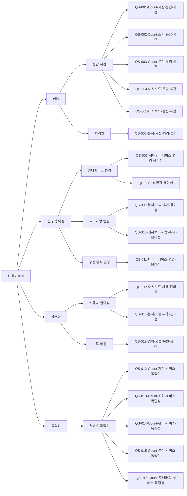

# 품질 시나리오 목록

## 개요

### 목적
이 문서는 Count 통합 관리 시스템의 구조 설계에 영향을 미치는 중요한 품질 시나리오를 식별하고 목록화합니다. 품질 시나리오는 측정 가능한 값으로 정의되며, 시스템의 품질 속성을 구체적으로 표현합니다.

### 생성 기준
다음 기준을 기반으로 품질 시나리오를 생성했습니다:
- **비즈니스 목표와의 연관성**: 비즈니스 목표 달성에 영향을 미치는 품질
- **ASR Use Case와의 연관성**: 핵심 Use Case(UC-001~UC-005)에서 요구되는 품질
- **시스템 제약사항**: Kubernetes/MSA 환경과 관련된 품질
- **컴포넌트 특성**: 도메인 모델의 컴포넌트 특성과 관련된 품질
- **구조 설계 영향**: 아키텍처 설계 결정에 영향을 미치는 품질

## Utility Tree

### 품질 속성 계층 구조

## 품질 시나리오 목록

### 성능 (Performance)

#### QS-001-Count-저장-응답-시간
- **품질 속성**: 성능 (응답 시간)
- **설명**: 외부 서비스가 Count 값을 저장하거나 증가/감소시킬 때의 응답 시간
- **측정 방법**: 외부 서비스가 Count 저장 API 요청을 보낸 시점부터 응답을 받는 시점까지의 시간
- **관련 Use Case**: UC-001-Count 저장

#### QS-002-Count-조회-응답-시간
- **품질 속성**: 성능 (응답 시간)
- **설명**: 외부 서비스나 관리자가 Count 값을 조회할 때의 응답 시간
- **측정 방법**: Count 조회 API 요청 시점부터 응답을 받는 시점까지의 시간
- **관련 Use Case**: UC-002-Count 조회

#### QS-003-Count-분석-처리-시간
- **품질 속성**: 성능 (응답 시간)
- **설명**: 관리자가 Count 데이터에 대한 분석(트렌드, 비교, 예측)을 요청했을 때의 처리 시간
- **측정 방법**: 분석 요청 시점부터 분석 결과를 반환하는 시점까지의 시간
- **관련 Use Case**: UC-004-Count 분석

#### QS-004-대시보드-로딩-시간
- **품질 속성**: 성능 (응답 시간)
- **설명**: 관리자가 대시보드를 열었을 때 초기 데이터를 로딩하는 시간
- **측정 방법**: 대시보드 페이지 요청 시점부터 화면에 데이터가 표시되는 시점까지의 시간
- **관련 Use Case**: UC-005-Count 모니터링

#### QS-005-대시보드-갱신-시간
- **품질 속성**: 성능 (응답 시간, 실시간성)
- **설명**: 대시보드가 열려있는 상태에서 Count 데이터가 변경되었을 때 화면에 반영되는 시간
- **측정 방법**: Count 데이터 변경 시점부터 대시보드 화면에 변경사항이 표시되는 시점까지의 시간
- **관련 Use Case**: UC-005-Count 모니터링
- **관련 컴포넌트**: DashboardUI, DashboardManager

#### QS-006-동시-요청-처리-능력
- **품질 속성**: 성능 (처리량)
- **설명**: 여러 외부 서비스가 동시에 Count 저장/조회 요청을 보낼 때 처리할 수 있는 요청 수
- **측정 방법**: 단위 시간(초)당 처리할 수 있는 동시 요청 수
- **관련 Use Case**: UC-001-Count 저장, UC-002-Count 조회

### 변경 용이성 (Modifiability)

#### QS-007-API-인터페이스-변경-용이성
- **품질 속성**: 변경 용이성 (인터페이스 변경)
- **설명**: API 인터페이스 방식(예: REST → gRPC, REST → GraphQL)을 변경할 때 영향받는 모듈의 범위
- **측정 방법**: 변경되는 모듈의 크기 + 변경되는 모듈을 의존하는 모듈의 크기(LOC)
- **관련 Use Case**: UC-001-Count 저장, UC-002-Count 조회
- **관련 컴포넌트**: CountAPI

#### QS-008-UI-변경-용이성
- **품질 속성**: 변경 용이성 (인터페이스 변경)
- **설명**: 관리자에게 제공하는 UI를 변경할 때 영향받는 모듈의 범위
- **측정 방법**: 변경되는 모듈의 크기 + 변경되는 모듈을 의존하는 모듈의 크기(LOC)
- **관련 Use Case**: UC-003-Count 관리, UC-004-Count 분석, UC-005-Count 모니터링
- **관련 컴포넌트**: CountManagementUI, CountAnalysisUI, DashboardUI

#### QS-009-분석-기능-추가-용이성
- **품질 속성**: 변경 용이성 (요구사항 변경)
- **설명**: 새로운 분석 기능(예: 상관관계 분석)을 추가할 때 필요한 작업의 범위
- **측정 방법**: 추가되는 모듈의 크기 + 변경되는 모듈의 크기 + 변경되는 모듈을 의존하는 모듈의 크기(LOC)
- **관련 Use Case**: UC-004-Count 분석
- **관련 컴포넌트**: CountAnalyzer, TrendAnalyzer, ComparisonAnalyzer, PredictionAnalyzer

#### QS-010-대시보드-기능-추가-용이성
- **품질 속성**: 변경 용이성 (요구사항 변경)
- **설명**: 대시보드에 새로운 기능(예: 알림 기능, 필터 기능)을 추가할 때 필요한 작업의 범위
- **측정 방법**: 추가되는 모듈의 크기 + 변경되는 모듈의 크기 + 변경되는 모듈을 의존하는 모듈의 크기(LOC)
- **관련 Use Case**: UC-005-Count 모니터링
- **관련 컴포넌트**: DashboardManager, DashboardUI

#### QS-011-데이터베이스-변경-용이성
- **품질 속성**: 변경 용이성 (구현 방식 변경)
- **설명**: 데이터베이스 스키마나 데이터베이스 시스템을 변경할 때 영향받는 모듈의 범위
- **측정 방법**: 데이터베이스 변경 시 수정/영향을 받는 모듈의 크기(LOC)
- **관련 Use Case**: 모든 Use Case
- **관련 컴포넌트**: CountInfoDB, CountValueDB, DashboardConfigDB

### 독립성 (Independence)

#### QS-012-Count-저장-서비스-독립성
- **품질 속성**: 독립성 (서비스 독립성)
- **설명**: Count 저장 서비스가 다른 서비스의 부하에 영향을 받지 않으며, 변경 시 다른 서비스에 영향을 미치지 않는 정도
- **측정 방법**: 
  - 성능 측면: 서비스 부하가 Count 저장 서비스 응답 시간에 영향을 미치는 서비스의 수
  - 변경 용이성 측면: Count 저장 서비스 변경(서버의 확장이나 업그레이드) 시 다른 서비스에 영향을 미치는 서비스의 수
- **관련 Use Case**: UC-001-Count 저장
- **관련 컴포넌트**: CountWriter, CountAPI

#### QS-013-Count-조회-서비스-독립성
- **품질 속성**: 독립성 (서비스 독립성)
- **설명**: Count 조회 서비스가 다른 서비스의 부하에 영향을 받지 않으며, 변경 시 다른 서비스에 영향을 미치지 않는 정도
- **측정 방법**: 
  - 성능 측면: 서비스 부하가 Count 저장 서비스 응답 시간에 영향을 미치는 서비스의 수
  - 변경 용이성 측면: Count 조회 서비스 변경(서버의 확장이나 업그레이드) 시 다른 서비스에 영향을 미치는 서비스의 수
- **관련 Use Case**: UC-002-Count 조회
- **관련 컴포넌트**: CountReader, CountAPI

#### QS-014-Count-관리-서비스-독립성
- **품질 속성**: 독립성 (서비스 독립성)
- **설명**: Count 관리 서비스가 다른 서비스의 부하에 영향을 받지 않으며, 변경 시 다른 서비스에 영향을 미치지 않는 정도
- **측정 방법**: 
  - 성능 측면: 서비스 부하가 Count 관리 서비스 응답 시간에 영향을 미치는 서비스의 수
  - 변경 용이성 측면: Count 관리 서비스 변경(서버의 확장이나 업그레이드) 시 다른 서비스에 영향을 미치는 서비스의 수
- **관련 Use Case**: UC-003-Count 관리
- **관련 컴포넌트**: CountManager, CountManagementUI

#### QS-015-Count-분석-서비스-독립성
- **품질 속성**: 독립성 (서비스 독립성)
- **설명**: Count 분석 서비스가 다른 서비스의 부하에 영향을 받지 않으며, 변경 시 다른 서비스에 영향을 미치지 않는 정도
- **측정 방법**: 
  - 성능 측면: 서비스 부하가 Count 분석 서비스 응답 시간에 영향을 미치는 서비스의 수
  - 변경 용이성 측면: Count 분석 서비스 변경(서버의 확장이나 업그레이드) 시 다른 서비스에 영향을 미치는 서비스의 수
- **관련 Use Case**: UC-004-Count 분석
- **관련 컴포넌트**: CountAnalyzer, TrendAnalyzer, ComparisonAnalyzer, PredictionAnalyzer, CountAnalysisUI

#### QS-016-Count-모니터링-서비스-독립성
- **품질 속성**: 독립성 (서비스 독립성)
- **설명**: Count 모니터링 서비스가 다른 서비스의 부하에 영향을 받지 않으며, 변경 시 다른 서비스에 영향을 미치지 않는 정도
- **측정 방법**: 
  - 성능 측면: 서비스 부하가 Count 모니터링 서비스 응답 시간에 영향을 미치는 서비스의 수
  - 변경 용이성 측면: Count 모니터링 서비스 변경(서버의 확장이나 업그레이드) 시 다른 서비스에 영향을 미치는 서비스의 수
- **관련 Use Case**: UC-005-Count 모니터링
- **관련 컴포넌트**: DashboardManager, DashboardUI

### 사용성 (Usability)

#### QS-017-대시보드-사용-편의성
- **품질 속성**: 사용성 (사용자 편의성)
- **설명**: 관리자가 대시보드를 사용하여 Count 데이터를 모니터링하는 편의성
- **측정 방법**: 관리자가 원하는 정보를 찾는 데 걸리는 시간 또는 클릭 수
- **관련 Use Case**: UC-005-Count 모니터링
- **관련 컴포넌트**: DashboardUI, DashboardManager

#### QS-018-분석-기능-사용-편의성
- **품질 속성**: 사용성 (사용자 편의성)
- **설명**: 관리자가 분석 기능을 사용하여 원하는 분석을 수행하는 편의성
- **측정 방법**: 관리자가 분석 요청을 완료하는 데 걸리는 시간 또는 입력 단계 수
- **관련 Use Case**: UC-004-Count 분석
- **관련 컴포넌트**: CountAnalysisUI

#### QS-019-입력-오류-복원-용이성
- **품질 속성**: 사용성 (오류 복원)
- **설명**: 관리자의 잘못된 Count 관리 요청에 대한 복원 용이성
- **측정 방법**: Count 관리 오류를 복원하는 데까지 걸리는 시간
- **관련 Use Case**: UC-003-Count 관리
- **관련 컴포넌트**: CountManagementUI, CountManager
