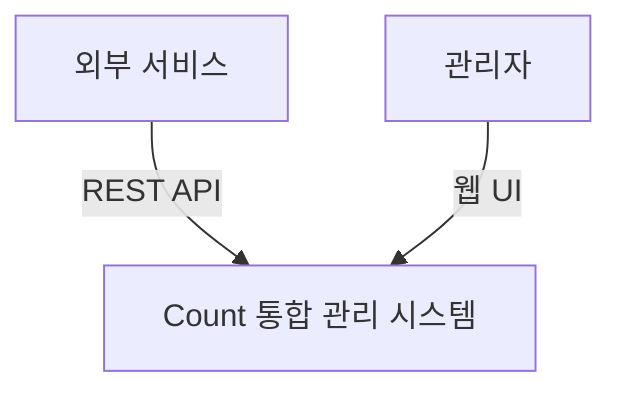

# 시스템 정의

## 시스템 개요

### 시스템 이름
Count 통합 관리 시스템 (Count Management System)

### 시스템 목적
다양한 서비스에서 발생하는 Count 데이터를 중앙에서 통합 관리하여, Count 값의 일관성과 신뢰성을 보장하고, 효율적인 조회 및 관리 기능을 제공하며, 관리자를 위한 UI를 통한 Count 관리, 다양한 분석 기능, 대시보드를 통한 모니터링 기능을 제공하는 시스템입니다.

### 시스템이 해결하려는 문제
- 여러 서비스에서 분산되어 관리되는 Count 값의 불일치 문제
- Count 데이터의 중복 저장 및 관리로 인한 비효율성
- Count 조회 및 관리 기능의 부재 또는 분산
- Count 값의 실시간 동기화 및 일관성 보장 어려움

## 시스템 범위

### 포함 기능
- 외부 서비스로부터의 Count 데이터 수신 및 처리
- Count 데이터의 API 인터페이스 제공
- 관리자를 위한 웹 UI를 통한 Count 관리 기능
- Count 데이터의 다양한 분석 기능 (트렌드 분석, 비교 분석, 예측 분석 등)
- 대시보드를 통한 Count 데이터 모니터링 및 시각화

### 제외 기능
- Count 값의 비즈니스 로직 처리 (외부 서비스의 책임)
- Count 데이터의 백업 정책 및 재해 복구 (인프라 레벨)
- 사용자 인증 및 권한 관리 (별도 인증 시스템의 책임)

### 범위 설정 근거
- Count 통합 관리 시스템은 Count 데이터의 CRUD, 일관성 관리, 분석, 시각화를 통합 제공하여 관리자의 편의성 향상
- 비즈니스 로직은 각 서비스에서 처리하며, 시스템은 데이터 관리 및 분석 기능 담당
- 관리자 UI, 분석 기능, 대시보드를 시스템 내부에 포함하여 Count 데이터의 종합적인 관리 및 모니터링 제공
- 인증/권한 관리는 기존 인프라를 활용하여 중복 개발 방지

## 시스템 경계

### 사용자 유형
- **외부 서비스**: Count 값을 생성, 수정, 조회하는 마이크로서비스 또는 애플리케이션
- **관리자**: Count 데이터를 직접 관리하고, 분석 기능을 활용하며, 대시보드를 통해 모니터링하는 운영 담당자

### 외부 환경
- **외부 서비스들**: Count 값을 생성하고 사용하는 다양한 마이크로서비스

### 인터페이스 (고수준)
- **REST API**: 외부 서비스와의 통신을 위한 RESTful 인터페이스
  - Count 생성/수정/삭제 API
  - Count 조회 API
  - Count 통계/집계 API
- **웹 UI**: 관리자를 위한 웹 기반 사용자 인터페이스
  - Count 관리 화면 (생성, 수정, 삭제)
  - 분석 화면 (트렌드, 비교, 예측 등)
  - 대시보드 화면 (모니터링 및 시각화)

## 제약사항

### 기술적 제약사항
- Kubernetes 환경에서 마이크로서비스 아키텍처(MSA)로 개발됨

