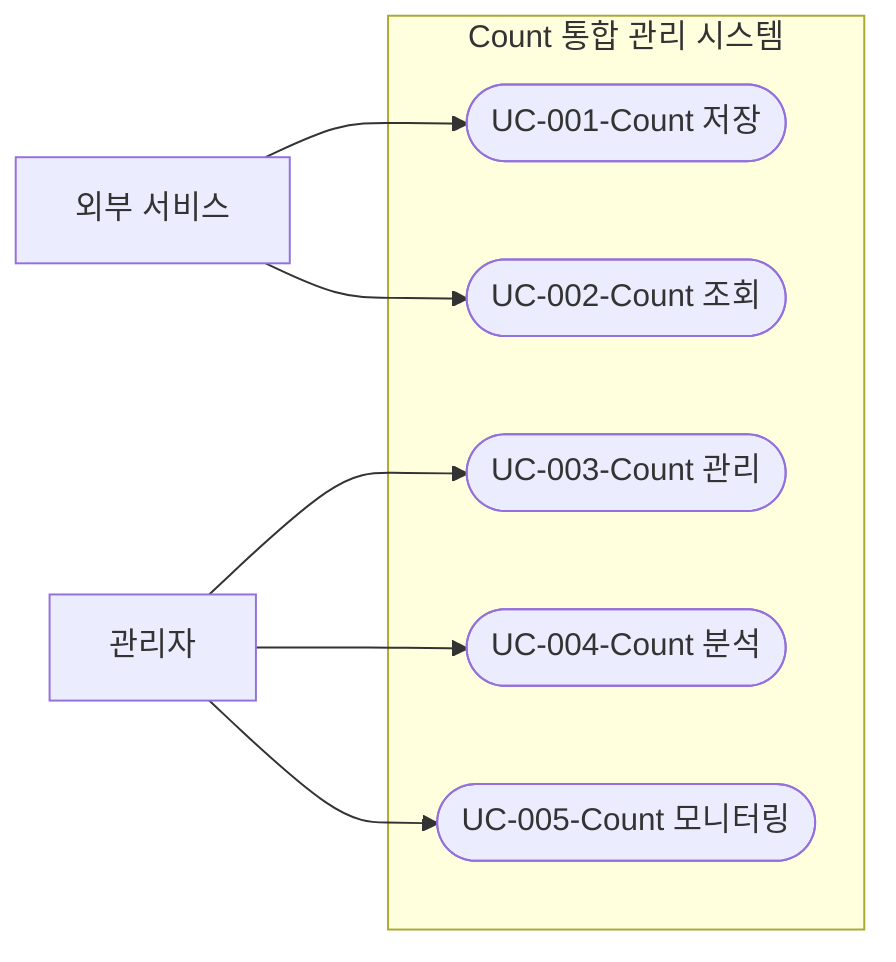

# Use Case 목록

## Use Case 개요

### 목적
이 문서는 Count 통합 관리 시스템이 제공하는 주요 기능을 Use Case 형태로 식별하고 목록화합니다. 각 Use Case는 시스템이 사용자에게 제공하는 가치 있는 기능을 표현하며, 이후 상세 명세 및 도메인 모델 분석의 기초가 됩니다.

### 식별 기준
- 시스템 범위에 포함된 기능만 Use Case로 식별
- 각 Use Case는 시스템이 사용자에게 제공하는 명확한 가치를 가져야 함
- 비즈니스 목표 달성에 기여하는 기능을 우선적으로 식별
- 사용자 유형(외부 서비스, 관리자)별로 필요한 기능을 구분하여 식별
- 시스템 경계 내에서 수행되는 기능만 포함

## Use Case 목록

### UC-001-Count 저장
- **설명**: 외부 서비스가 Count 값을 저장하거나 증가/감소시킵니다.
- **주요 액터**: 외부 서비스

### UC-002-Count 조회
- **설명**: 외부 서비스가 저장된 Count 데이터를 조회합니다.
- **주요 액터**: 외부 서비스, 관리자

### UC-003-Count 관리
- **설명**: 관리자가 웹 UI를 통해 Count 데이터를 생성, 수정, 삭제하는 통합 관리 기능을 수행합니다.
- **주요 액터**: 관리자

### UC-004-Count 분석
- **설명**: 관리자가 Count 데이터에 대한 다양한 분석 기능(트렌드 분석, 비교 분석, 예측 분석 등)을 수행합니다.
- **주요 액터**: 관리자

### UC-005-Count 모니터링
- **설명**: 관리자가 대시보드를 통해 Count 데이터를 모니터링하고 시각화된 정보를 확인합니다.
- **주요 액터**: 관리자

### 전체 Use Case 다이어그램

