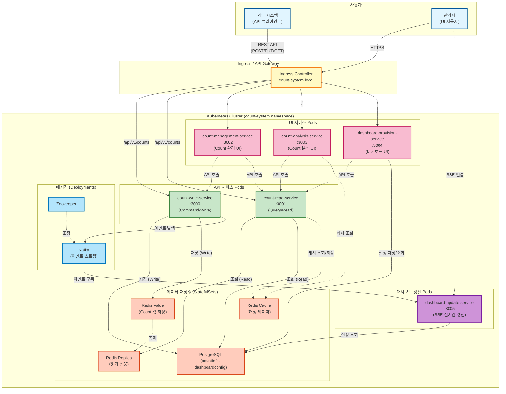
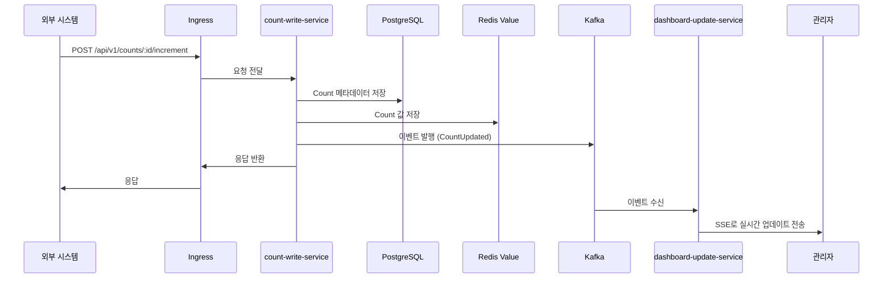
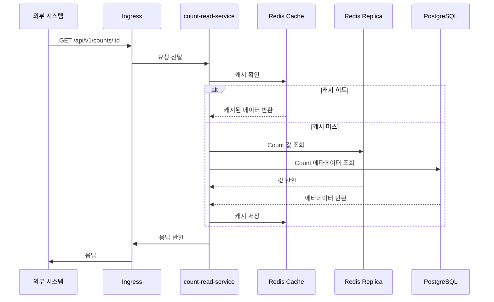
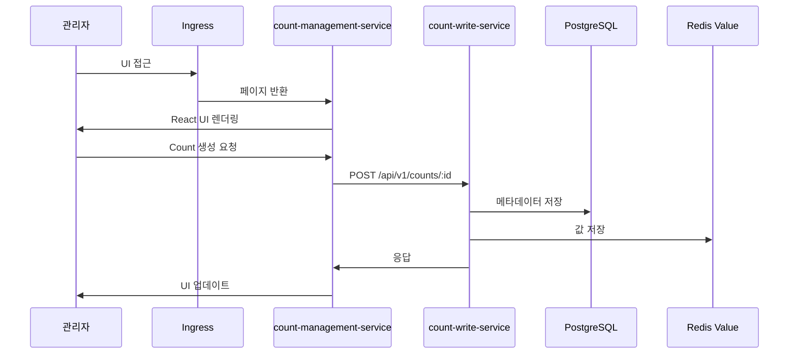

# Count 통합 관리 시스템

## 프로젝트 개요

Count 통합 관리 시스템은 다양한 서비스에서 발생하는 Count 데이터를 중앙에서 통합 관리하는 마이크로서비스 기반 시스템입니다.

### 주요 특징

- **마이크로서비스 아키텍처**: 각 기능별로 독립적인 서비스로 분리
- **CQRS 패턴**: Command와 Query를 분리하여 읽기/쓰기 성능 최적화
- **이벤트 기반 통신**: Kafka를 사용한 비동기 메시징
- **컨테이너 기반 배포**: Docker 및 Kubernetes를 통한 자동화된 배포
- **실시간 대시보드**: SSE를 통한 실시간 데이터 업데이트
- **분석 및 시각화**: 차트와 통계를 통한 데이터 분석

### 주요 기능

1. **Count 관리**
   - Count 생성, 조회, 증가, 감소
   - 메타데이터 관리 (설명, 생성일 등)

2. **Count 분석**
   - 트렌드 분석
   - 비교 분석
   - 예측 분석

3. **대시보드**
   - 실시간 모니터링
   - 커스터마이징 가능한 위젯
   - SSE 기반 실시간 업데이트

## 프로젝트 구조

```
count/src/
├── common/                          # 공통 모듈 레이어
│   ├── count-info/                  # CountInfo 도메인 공통 모듈
│   │   └── src/
│   │       ├── infra/               # 인프라 레이어
│   │       │   ├── entity/          # Entity 모델 (TypeORM)
│   │       │   └── repository/      # Repository 인터페이스 및 구현체
│   │       └── logic/               # 비즈니스 로직 레이어
│   │           └── service/         # Service 인터페이스 및 구현체
│   └── count-value/                 # CountValue 도메인 공통 모듈
│       └── src/
│           ├── infra/               # 인프라 레이어
│           │   ├── entity/          # Entity 모델 (Redis)
│           │   └── repository/      # Repository 인터페이스 및 구현체
│           └── logic/               # 비즈니스 로직 레이어
│               ├── service/         # Service 인터페이스 및 구현체
│               └── analysis/        # 분석 로직 레이어
│                   ├── strategy/    # AnalysisStrategy 인터페이스
│                   └── analyzer/    # Analyzer 구현체
│
├── count-write-service/             # Count 저장 서비스
│   └── src/
│       └── api/
│           └── write/               # API 레이어
│               ├── controller/      # REST API Controller
│               ├── adapter/         # API 어댑터
│               └── dto/             # DTO
│
├── count-read-service/              # Count 조회 서비스
│   └── src/
│       └── api/
│           └── read/                # API 레이어
│               ├── controller/      # REST API Controller
│               ├── adapter/         # API 어댑터
│               └── dto/             # DTO
│
├── count-management-service/        # Count 관리 서비스
│   └── src/
│       └── ui/
│           └── management/          # UI 레이어
│               ├── page/            # React 페이지 컴포넌트
│               ├── component/       # UI 컴포넌트
│               ├── style/           # 스타일 시스템
│               └── api/             # API 계층
│
├── count-analysis-service/          # Count 분석 서비스
│   └── src/
│       └── ui/
│           └── analysis/            # UI 레이어
│               ├── page/            # React 페이지 컴포넌트
│               ├── component/       # UI 컴포넌트
│               │   └── chart/       # 차트 컴포넌트
│               ├── style/           # 스타일 시스템
│               └── api/             # API 계층
│
├── dashboard-provision-service/     # 대시보드 제공 서비스
│   └── src/
│       ├── ui/
│       │   └── dashboard/           # UI 레이어
│       │       ├── page/            # React 페이지 컴포넌트
│       │       ├── component/       # UI 컴포넌트
│       │       │   └── widget/      # 대시보드 위젯 컴포넌트
│       │       ├── style/           # 스타일 시스템
│       │       └── api/             # API 계층
│       └── logic/
│           └── dashboard/           # Logic 레이어
│               ├── manager/         # DashboardManager
│               ├── feature/         # DashboardFeature 인터페이스
│               └── repository/      # DashboardConfigDB Repository
│
├── dashboard-update-service/        # 대시보드 갱신 서비스
│   └── src/
│       └── logic/
│           └── dashboard/           # Logic 레이어
│               ├── updater/         # DashboardUpdater
│               ├── sse/             # SSEHandler
│               └── event/           # 이벤트 처리 모듈
│
└── k8s/                             # Kubernetes 배포 파일
    ├── namespace.yaml               # 네임스페이스 정의
    ├── configmap/                   # ConfigMap
    ├── secret/                      # Secret
    ├── services/                    # Kubernetes Service
    ├── deployments/                 # Kubernetes Deployment
    ├── statefulsets/                # Kubernetes StatefulSet
    ├── persistentvolumeclaims/      # PersistentVolumeClaim
    ├── ingress/                     # Ingress
    ├── deploy.sh                    # 배포 스크립트 (Bash)
    ├── deploy.ps1                   # 배포 스크립트 (PowerShell)
    ├── undeploy.sh                  # 제거 스크립트 (Bash)
    ├── undeploy.ps1                 # 제거 스크립트 (PowerShell)
    ├── build-images.sh              # 이미지 빌드 스크립트 (Bash)
    ├── build-images.ps1             # 이미지 빌드 스크립트 (PowerShell)
    └── README.md                    # Kubernetes 배포 가이드
```

## 기술 스택

- **프레임워크**: NestJS (TypeScript)
- **데이터베이스**: 
  - PostgreSQL (CountInfoDB, DashboardConfigDB)
  - Redis (CountValueDB, 캐싱)
- **ORM**: TypeORM
- **Redis 클라이언트**: ioredis
- **메시징**: Kafka
- **UI 프레임워크**: React
- **테스트**: Jest

## 서비스 포트 및 엔드포인트

### API 서비스

- **count-write-service** (포트: 3000)
  - `POST /api/v1/counts/:id/increment` - Count 증가
  - `POST /api/v1/counts/:id/decrement` - Count 감소
  - `PUT /api/v1/counts/:id` - Count 값 설정
  - `GET /api/v1/counts/:id` - Count 조회 (CQRS Read)
  - `GET /health` - Health Check
  - `GET /ready` - Readiness Probe

- **count-read-service** (포트: 3001)
  - `GET /api/v1/counts/:id` - Count 조회 (CQRS Query)
  - `GET /health` - Health Check
  - `GET /ready` - Readiness Probe

### UI 서비스

- **count-management-service** (포트: 3002)
  - Count 관리 웹 UI (React)
  - `GET /health` - Health Check

- **count-analysis-service** (포트: 3003)
  - Count 분석 웹 UI (React)
  - 차트 및 통계 시각화
  - `GET /health` - Health Check

- **dashboard-provision-service** (포트: 3004)
  - 대시보드 제공 웹 UI (React)
  - 위젯 기반 대시보드
  - `GET /health` - Health Check

- **dashboard-update-service** (포트: 3005)
  - 대시보드 실시간 갱신 서비스
  - SSE (Server-Sent Events) 지원
  - `GET /health` - Health Check

## 아키텍처

### 시스템 구조



### 시스템 동작 흐름

#### 1. Count 데이터 쓰기 (Write Path)


#### 2. Count 데이터 조회 (Read Path)


#### 3. UI를 통한 관리 (Management Path)


### CQRS 패턴

이 시스템은 CQRS (Command Query Responsibility Segregation) 패턴을 구현합니다:

- **Command Side (Write)**:
  - `count-write-service`: Count 쓰기 작업 담당
  - PostgreSQL (CountInfoDB): Count 메타데이터 저장
  - Redis (CountValueDB): Count 값 저장 및 빠른 읽기 제공

- **Query Side (Read)**:
  - `count-read-service`: Count 읽기 작업 최적화
  - Kafka를 통한 이벤트 기반 데이터 동기화

### 데이터베이스 구조

- **PostgreSQL**:
  - `countinfo`: Count 메타데이터 (ID, 설명, 생성일 등)
  - `countvalue`: Count 값 이력 (선택적 사용)
  - `dashboardconfig`: 대시보드 설정 정보

- **Redis**:
  - `redis-value`: Count 값 저장 (Primary)
  - `redis-replica`: Read Replica
  - `redis-cache`: 캐싱 레이어

## 빌드 및 실행

### 로컬 개발 환경

#### 전체 프로젝트 빌드
```bash
npm run build
```

#### 개별 서비스 실행
```bash
cd count-write-service
npm run start:dev
```

## Kubernetes 배포

### 사전 요구사항

다음 도구들이 설치되어 있어야 합니다:

- **Docker**: 컨테이너 이미지 빌드 및 실행
- **kubectl**: Kubernetes 클러스터 관리
- **minikube**: 로컬 Kubernetes 클러스터 (또는 다른 Kubernetes 클러스터)

#### minikube 설치 및 시작

**Windows (PowerShell)**:
```powershell
# Chocolatey를 통한 설치
choco install minikube

# 또는 직접 다운로드
# https://minikube.sigs.k8s.io/docs/start/

# minikube 시작
minikube start

# Docker 환경을 minikube로 설정
minikube docker-env | Invoke-Expression
```

**Linux/macOS**:
```bash
# minikube 설치 (예: Linux)
curl -LO https://storage.googleapis.com/minikube/releases/latest/minikube-linux-amd64
sudo install minikube-linux-amd64 /usr/local/bin/minikube

# minikube 시작
minikube start

# Docker 환경을 minikube로 설정
eval $(minikube docker-env)
```

### 1. Docker 이미지 빌드

**중요**: 모든 Dockerfile은 루트 디렉토리(`count/src/`)를 빌드 컨텍스트로 사용합니다. 공통 모듈을 포함하기 위해 루트에서 빌드해야 합니다.

#### Bash 스크립트 사용 (Linux/macOS/WSL)

```bash
cd k8s
chmod +x build-images.sh
./build-images.sh
```

레지스트리 및 버전 지정:
```bash
REGISTRY=myregistry.com VERSION=v1.0.0 ./build-images.sh
```

#### PowerShell 스크립트 사용 (Windows)

```powershell
cd k8s
.\build-images.ps1
```

레지스트리 및 버전 지정:
```powershell
$env:REGISTRY="agentk.count"
$env:VERSION="latest"
.\build-images.ps1
```

#### 수동 빌드

**루트 디렉토리에서** 빌드해야 합니다:
```bash
# 루트 디렉토리로 이동
cd count/src

# Count 저장 서비스 빌드
docker build -f count-write-service/Dockerfile -t count-write-service:latest .

# Count 조회 서비스 빌드
docker build -f count-read-service/Dockerfile -t count-read-service:latest .

# Count 관리 서비스 빌드
docker build -f count-management-service/Dockerfile -t count-management-service:latest .

# Count 분석 서비스 빌드
docker build -f count-analysis-service/Dockerfile -t count-analysis-service:latest .

# 대시보드 제공 서비스 빌드
docker build -f dashboard-provision-service/Dockerfile -t dashboard-provision-service:latest .

# 대시보드 갱신 서비스 빌드
docker build -f dashboard-update-service/Dockerfile -t dashboard-update-service:latest .
```

**주의사항**:
- **빌드 컨텍스트**: 모든 빌드는 루트 디렉토리(`count/src/`)에서 실행해야 합니다.
- **minikube 사용 시**: `minikube docker-env`를 실행하여 Docker 환경을 minikube로 설정해야 합니다.
  ```powershell
  # Windows PowerShell
  minikube docker-env | Invoke-Expression
  
  # Linux/macOS
  eval $(minikube docker-env)
  ```
- **공통 모듈**: Dockerfile이 자동으로 공통 모듈(`common/count-info`, `common/count-value`)을 빌드하고 포함합니다.

### 2. Kubernetes 배포

#### 배포 스크립트 사용

배포 스크립트는 다음 작업을 자동으로 수행합니다:
1. 네임스페이스 생성
2. ConfigMap 및 Secret 생성
3. PVC 생성
4. 인프라 컴포넌트 배포 (PostgreSQL, Redis, Zookeeper, Kafka)
5. **PostgreSQL 데이터베이스 자동 초기화** (Kubernetes Job)
6. 애플리케이션 서비스 배포

**Bash (Linux/macOS/WSL)**:
```bash
cd k8s
chmod +x deploy.sh
./deploy.sh
```

Ingress 포함 배포:
```bash
./deploy.sh --with-ingress
```

**PowerShell (Windows)**:
```powershell
cd k8s
.\deploy.ps1
```

Ingress 포함 배포:
```powershell
.\deploy.ps1 --with-ingress
```

**데이터베이스 초기화 참고**:
- PostgreSQL 배포 후 자동으로 데이터베이스 초기화 Job이 실행됩니다
- Job은 `countinfo`, `countvalue`, `dashboardconfig` 데이터베이스를 생성합니다
- 이미 데이터베이스가 존재하면 스킵하므로 재배포 시에도 안전합니다

#### 수동 배포

```bash
cd k8s

# 1. 네임스페이스 생성
kubectl apply -f namespace.yaml

# 2. ConfigMap 및 Secret 생성
kubectl apply -f configmap/
kubectl apply -f secret/

# 3. PVC 생성
kubectl apply -f persistentvolumeclaims/

# 4. 인프라 컴포넌트 배포
kubectl apply -f statefulsets/
kubectl apply -f services/postgresql-service.yaml
kubectl apply -f services/redis-service.yaml
kubectl apply -f services/redis-replica-service.yaml
kubectl apply -f services/redis-cache-service.yaml
kubectl apply -f deployments/zookeeper.yaml
kubectl apply -f services/zookeeper-service.yaml
kubectl apply -f deployments/kafka.yaml
kubectl apply -f services/kafka-service.yaml

# 5. 애플리케이션 서비스 배포
kubectl apply -f services/
kubectl apply -f deployments/

# 6. Ingress 배포 (선택사항)
kubectl apply -f ingress/
```

### 3. 배포 확인

#### Pod 상태 확인
```bash
kubectl get pods -n count-system
```

모든 Pod가 `Running` 상태가 될 때까지 대기:
```bash
kubectl wait --for=condition=ready pod --all -n count-system --timeout=300s
```

#### 서비스 상태 확인
```bash
kubectl get services -n count-system
```

#### 로그 확인
```bash
# 특정 Pod의 로그 확인
kubectl logs -f <pod-name> -n count-system

# 예: Count 저장 서비스 로그
kubectl logs -f deployment/count-write-service -n count-system
```

### 4. 서비스 접근

#### minikube를 사용하는 경우

**포트 포워딩을 통한 접근**:
```bash
# Count 저장 서비스
kubectl port-forward service/count-write-service 3000:3000 -n count-system

# Count 조회 서비스
kubectl port-forward service/count-read-service 3001:3001 -n count-system

# Count 관리 서비스
kubectl port-forward service/count-management-service 3002:3002 -n count-system

# Count 분석 서비스
kubectl port-forward service/count-analysis-service 3003:3003 -n count-system

# 대시보드 제공 서비스
kubectl port-forward service/dashboard-provision-service 3004:3004 -n count-system

# 대시보드 갱신 서비스
kubectl port-forward service/dashboard-update-service 3005:3005 -n count-system
```

**minikube service를 통한 접근**:
```bash
# minikube service로 서비스 URL 확인
minikube service count-write-service -n count-system
minikube service count-read-service -n count-system
minikube service dashboard-provision-service -n count-system
```

**Ingress를 통한 접근** (Ingress Controller가 설치된 경우):
```bash
# Ingress Controller 설치 (예: NGINX Ingress)
minikube addons enable ingress

# Ingress 배포
kubectl apply -f k8s/ingress/ingress.yaml

# Ingress 접근
minikube tunnel

# 브라우저에서 접근
# http://localhost/api/v1/counts
# http://localhost/management
```

### 5. 서비스 동작 확인

배포가 완료된 후 다음 방법들로 서비스가 정상적으로 동작하는지 확인할 수 있습니다.

#### 5.1. Health Check

모든 서비스는 Health Check 엔드포인트를 제공합니다:

```bash
# count-write-service
curl http://localhost:3000/health

# count-read-service
curl http://localhost:3001/health

# count-management-service
curl http://localhost:3002/health

# count-analysis-service
curl http://localhost:3003/health

# dashboard-provision-service
curl http://localhost:3004/health

# dashboard-update-service
curl http://localhost:3005/health
```

예상 응답:
```json
{"status":"ok"}
```

#### 5.2. API 테스트

**Count 생성 및 조회**:

```bash
# 1. Count 생성 (초기값 설정)
curl -X PUT http://localhost:3000/api/v1/counts/test-counter \
  -H "Content-Type: application/json" \
  -d '{
    "value": 0,
    "description": "테스트 카운터"
  }'

# 2. Count 증가
curl -X POST http://localhost:3000/api/v1/counts/test-counter/increment \
  -H "Content-Type: application/json" \
  -d '{"amount": 5}'

# 3. Count 감소
curl -X POST http://localhost:3000/api/v1/counts/test-counter/decrement \
  -H "Content-Type: application/json" \
  -d '{"amount": 2}'

# 4. Count 조회 (Write Service)
curl http://localhost:3000/api/v1/counts/test-counter

# 5. Count 조회 (Read Service - CQRS)
curl http://localhost:3001/api/v1/counts/test-counter
```

**PowerShell을 사용하는 경우**:

```powershell
# Count 생성
Invoke-RestMethod -Method PUT -Uri "http://localhost:3000/api/v1/counts/test-counter" `
  -ContentType "application/json" `
  -Body '{"value": 0, "description": "테스트 카운터"}'

# Count 증가
Invoke-RestMethod -Method POST -Uri "http://localhost:3000/api/v1/counts/test-counter/increment" `
  -ContentType "application/json" `
  -Body '{"amount": 5}'

# Count 조회
Invoke-RestMethod -Uri "http://localhost:3000/api/v1/counts/test-counter"
```

#### 5.3. UI 접근

브라우저에서 다음 URL로 접근하여 UI 서비스를 확인할 수 있습니다:

```
# Count 관리 UI
http://localhost:3002

# Count 분석 UI
http://localhost:3003

# 대시보드 UI
http://localhost:3004
```

**minikube를 사용하는 경우**:

```bash
# 포트 포워딩 후 브라우저에서 접근
kubectl port-forward service/count-management-service 3002:3002 -n count-system
kubectl port-forward service/count-analysis-service 3003:3003 -n count-system
kubectl port-forward service/dashboard-provision-service 3004:3004 -n count-system
```

#### 5.4. Kubernetes 상태 확인

```bash
# Pod 상태 확인
kubectl get pods -n count-system

# 모든 Pod가 Running 상태여야 함
# NAME                                          READY   STATUS    RESTARTS   AGE
# count-write-service-xxx                       1/1     Running   0          5m
# count-read-service-xxx                        1/1     Running   0          5m
# ...

# 서비스 상태 확인
kubectl get services -n count-system

# Deployment 상태 확인
kubectl get deployments -n count-system

# StatefulSet 상태 확인 (PostgreSQL, Redis)
kubectl get statefulsets -n count-system
```

#### 5.5. 로그 확인

특정 서비스의 로그를 확인하여 문제를 진단할 수 있습니다:

```bash
# Deployment 로그 확인
kubectl logs -f deployment/count-write-service -n count-system
kubectl logs -f deployment/count-read-service -n count-system

# Pod 로그 확인
kubectl logs -f <pod-name> -n count-system

# 최근 로그만 확인 (마지막 100줄)
kubectl logs --tail=100 deployment/count-write-service -n count-system

# 타임스탬프 포함
kubectl logs --timestamps deployment/count-write-service -n count-system
```

#### 5.6. 데이터베이스 확인

**PostgreSQL 접속**:

```bash
# PostgreSQL Pod에 접속
kubectl exec -it postgresql-0 -n count-system -- psql -U countuser -d postgres

# 데이터베이스 목록 확인
\l

# CountInfo 데이터베이스 확인
\c countinfo
\dt
SELECT * FROM count_info;

# DashboardConfig 데이터베이스 확인
\c dashboardconfig
\dt
```

**Redis 접속**:

```bash
# Redis Value DB 접속
kubectl exec -it redis-value-0 -n count-system -- redis-cli

# 데이터 확인
KEYS *
GET count:test-counter
```

#### 5.7. 통합 테스트 시나리오

전체 시스템이 정상 동작하는지 확인하는 시나리오:

```bash
# 1. Health Check (모든 서비스)
for port in 3000 3001 3002 3003 3004 3005; do
  echo "Checking port $port..."
  curl -s http://localhost:$port/health
  echo ""
done

# 2. Count 생성
curl -X PUT http://localhost:3000/api/v1/counts/integration-test \
  -H "Content-Type: application/json" \
  -d '{"value": 100, "description": "통합 테스트"}'

# 3. 여러 번 증가/감소
for i in {1..5}; do
  curl -X POST http://localhost:3000/api/v1/counts/integration-test/increment \
    -H "Content-Type: application/json" \
    -d '{"amount": 1}'
done

# 4. Read Service에서 조회 (CQRS 확인)
curl http://localhost:3001/api/v1/counts/integration-test

# 5. 브라우저에서 UI 확인
echo "브라우저에서 다음 URL을 확인하세요:"
echo "- Count 관리: http://localhost:3002"
echo "- Count 분석: http://localhost:3003"
echo "- 대시보드: http://localhost:3004"
```

**PowerShell 버전**:

```powershell
# 1. Health Check (모든 서비스)
3000, 3001, 3002, 3003, 3004, 3005 | ForEach-Object {
  Write-Host "Checking port $_..." -ForegroundColor Cyan
  Invoke-RestMethod -Uri "http://localhost:$_/health"
}

# 2. Count 생성
Invoke-RestMethod -Method PUT -Uri "http://localhost:3000/api/v1/counts/integration-test" `
  -ContentType "application/json" `
  -Body '{"value": 100, "description": "통합 테스트"}'

# 3. 여러 번 증가
1..5 | ForEach-Object {
  Invoke-RestMethod -Method POST -Uri "http://localhost:3000/api/v1/counts/integration-test/increment" `
    -ContentType "application/json" `
    -Body '{"amount": 1}'
}

# 4. 조회
Invoke-RestMethod -Uri "http://localhost:3001/api/v1/counts/integration-test"
```

### 6. 배포 제거

#### 스크립트 사용

**Bash (Linux/macOS/WSL)**:
```bash
cd k8s
chmod +x undeploy.sh
./undeploy.sh
```

PVC 및 네임스페이스까지 제거:
```bash
./undeploy.sh --delete-pvc --delete-namespace
```

**PowerShell (Windows)**:
```powershell
cd k8s
.\undeploy.ps1
```

PVC 및 네임스페이스까지 제거:
```powershell
.\undeploy.ps1 --delete-pvc --delete-namespace
```

**주의사항**:
- `--delete-pvc` 옵션을 사용하면 영구 데이터(PostgreSQL, Redis)가 삭제됩니다.
- `--delete-namespace` 옵션을 사용하면 네임스페이스와 모든 리소스가 삭제됩니다.

#### 수동 제거

```bash
cd k8s

# 1. 애플리케이션 서비스 제거
kubectl delete -f deployments/ --ignore-not-found=true
kubectl delete -f services/ --ignore-not-found=true

# 2. 초기화 Job 제거
kubectl delete -f jobs/ --ignore-not-found=true

# 3. Ingress 제거
kubectl delete -f ingress/ --ignore-not-found=true

# 4. 인프라 컴포넌트 제거
kubectl delete -f deployments/kafka.yaml --ignore-not-found=true
kubectl delete -f deployments/zookeeper.yaml --ignore-not-found=true
kubectl delete -f statefulsets/ --ignore-not-found=true

# 5. ConfigMap 및 Secret 제거
kubectl delete -f configmap/ --ignore-not-found=true
kubectl delete -f secret/ --ignore-not-found=true

# 6. PVC 제거 (선택사항 - 데이터 삭제됨)
kubectl delete -f persistentvolumeclaims/ --ignore-not-found=true

# 7. 네임스페이스 제거 (선택사항)
kubectl delete namespace count-system --ignore-not-found=true
```

## 시스템 요구사항

### 로컬 개발 환경

- **Node.js**: 18.x 이상
- **npm**: 8.x 이상
- **TypeScript**: 5.x
- **PostgreSQL**: 15.x (개발용)
- **Redis**: 7.x (개발용)

### Kubernetes 배포 환경

- **Docker**: 최신 버전
- **kubectl**: 1.24 이상
- **Kubernetes 클러스터**: 
  - minikube (로컬 개발)
  - 또는 기타 Kubernetes 클러스터 (운영 환경)
- **최소 리소스 요구사항**:
  - CPU: 4 코어
  - 메모리: 8GB RAM
  - 디스크: 20GB 이상

## 프로젝트 구성

이 프로젝트는 다음과 같은 패키지로 구성됩니다:

### 공통 모듈

- `@count/common-count-info`: CountInfo 도메인 공통 모듈
- `@count/common-count-value`: CountValue 도메인 공통 모듈

### 서비스

- `count-write-service`: Count 저장 서비스
- `count-read-service`: Count 조회 서비스
- `count-management-service`: Count 관리 UI 서비스
- `count-analysis-service`: Count 분석 UI 서비스
- `dashboard-provision-service`: 대시보드 제공 서비스
- `dashboard-update-service`: 대시보드 갱신 서비스

## 추가 문서

- [Kubernetes 배포 가이드](k8s/README.md)
- [Docker 이미지 빌드 가이드](k8s/BUILD-GUIDE.md)
- [PostgreSQL 자동 초기화](k8s/DATABASE-AUTO-INIT.md)
